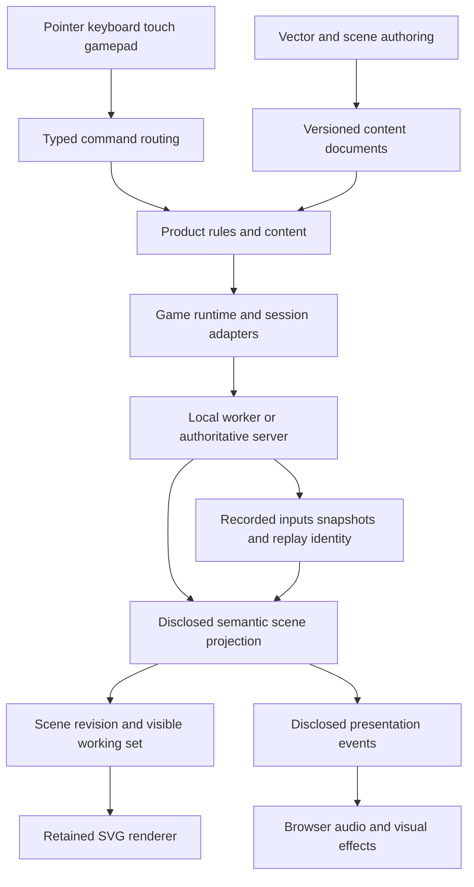

# SVG game engine and Fable template: design and delivery roadmap

Date: 2026-09-07. Saved: 2026-09-07 06:42:59 UTC. Status: proposal for review, not an accepted platform contract.

This document proposes evolving `fs-gg-fable-game` into a complete SVG-based 2D game development workspace by extracting reusable S.I.R. capabilities and implementing the missing engine systems. It changes no runtime, provider, registry, release pin, or existing architectural decision. Package names, interfaces, milestones, and performance targets below are proposed. Implementation requires the owning repositories' normal specification, contract, and release processes.

Amended 2026-09-07 to separate product delivery from workspace/default activation, clarify proportional
Quint change handling, refine capability dependencies, and add generated-workspace development journeys.
The [revision analysis](2026-09-07-121207-svg-game-engine-roadmap-revision-proposal.md) records the rationale.
These are revisions to a proposal; they adopt no routine-policy exception or change to accepted v2 gates.

## 1. Outcome and definition of completeness

A generated workspace should let a developer create vector artwork, assemble a scene, define gameplay, play locally, connect multiple clients, inspect execution, save and replay sessions, and publish a browser game. The same workspace should support a game player and optional integrated authoring tools. A consumer should not need S.I.R. source or its tactical rules to do any of this.

“Complete” means passing the capability matrix in section 4 and the end-to-end journeys in section 13. It does not mean matching every commercial engine plugin, unlimited SVG complexity, every browser, or general 3D rendering. SVG is the required primary scene renderer. Bitmap references are optional decorative assets; all core samples and gameplay remain usable with vector-only assets.

The initial supported range covers tactical games, board games, puzzle games, and moderate-density action games. Release qualification must include both grid-based and continuous-coordinate gameplay so tactical assumptions do not become engine limitations. Physics and animation completeness is bounded explicitly below.

### Separate readiness and activation claims

| Claim | Required evidence | Boundary |
|---|---|---|
| Engine preview A/B/C | Named implemented capabilities, compatible package closure and real installed consumers | Does not claim the complete workspace or activate future lifecycle defaults |
| Complete game/studio capabilities | Required C01–C20 behavior, S.I.R. parity, selected-bundle journeys, performance, accessibility and data compatibility | Product readiness alone does not authorize a workspace-default or coordination change |
| Generated workspace integration | Published backend/profile and producer capabilities, installed skills/adapters and tested upgrade | Does not imply every historical lifecycle has migrated |
| Approved routine-development carryover | Effective generated guidance and a real ordinary-change journey; sufficient cohort evidence for any efficiency claim | Does not create weaker semantic authority or replace required technical checks |
| Lifecycle/default activation | Owning SDD/Templates decisions, receiver evidence and the applicable operating epoch | Cannot be inferred from an engine release or a successful Quint run |

Release D retains the complete target-workspace claim, including its promised workspace compatibility and
activation conditions. If engine capabilities finish before those conditions, report that partial readiness
and publish only through an already-supported route; do not relabel it as D. A compatible template or
example update and a workspace-lifecycle default flip are distinct operations with distinct prerequisites.

The [routine-development proposal](2026-09-07-074251-radical-development-bureaucracy-reduction-design-and-roadmap.md)
and [aligned flow designs](coordination/2026-09-07-112837-development-flow-proposal-alignment-analysis.md)
provide the proposed development direction. Completion of an OR harness, PB controller, federation service
or orchestration dashboard is not an engine dependency. These proposals do not authorize skipping current
review, qualification, release or migration requirements.

### Product experience

The default generated project opens into a playable vector game. Developer mode exposes Create, Arrange, Play, and Review tools around the same retained scene. Products can rename or omit these modes. The production player build excludes editor and laboratory modules unless deliberately enabled. DOM menus, forms, and accessible alternatives surround the SVG scene.

The first example is a cooperative vector arena with collectible objects, moving obstacles, interactions, health, score, sound, and a win/restart loop. A tactical planning example proves S.I.R. parity. A continuous-motion arcade example proves general engine capability. These are authored examples using the public APIs, not special privileged implementations.

## 2. Evidence and current baseline

S.I.R. was inspected at commit `2b7ceccd8d922c63818d18f111ee3c7aa0b5565a`, which matched remote main during this session. Source, manifests, documentation, and recorded qualification were inspected; the application and full suites were not executed for this proposal. “Implemented” below means inspected source and/or existing implementation evidence, not a fresh passing run.

The checked-out template is a server-authoritative Fable/Elmish arena with HTTP bootstrap, named Thoth codecs, SignalR, Game.Core 0.13.0, cross-runtime codec tests, and two-browser qualification. Its provider pins Workspace.Template 0.10.0. Those are baseline identities, not proposed future release numbers.

S.I.R. already contributes:

- A retained SVG workscreen with stable semantic identities and layers, shared by Editor, Plan, Simulate, and Review.
- Typed scene projection, disclosure filtering, camera state, selection, command routing, hotkeys, modal input, docking, timeline, and supporting panels.
- Map authoring, validated versioned interchange, history, simulator handoff, worker-backed replay and experiments, and deterministic evidence export.
- Unit glyphs, semantic terrain/edges, tactical overlays, effects, palettes, reduced motion, and ordinary/dense/stress visual reviews.
- Deferred client feature loading, build receipts, production browser journeys, and detailed SVG pipeline measurement infrastructure.
- Typed rule authoring, rule dependency/coherence analysis, executable explanations, formal models, and a maintained teaching corpus.

The scaling architecture is partly a target, not a completed extraction. Existing semantic zoom and measurement code do not prove that full viewport culling, layer revision caching, and invalidation-driven presentation have all shipped. M0 must resolve each capability individually. Older architecture documents also contain historical transport and desktop-client directions; the inspected HTTP/SignalR integration and compiled project graph establish the current browser implementation baseline.

### Source map

| Resource | What to extract or learn |
|---|---|
| [S.I.R. integration report](https://github.com/EHotwagner/S.I.R./blob/2b7ceccd8d922c63818d18f111ee3c7aa0b5565a/docs/issue-138-fable-game-integration-report.md) | Existing template adoption, transport and project boundaries |
| [Scene signatures](https://github.com/EHotwagner/S.I.R./blob/2b7ceccd8d922c63818d18f111ee3c7aa0b5565a/src/SIR.Client/TacticalSceneProjection.fsi) | Stable primitives, effects, overlays and disclosure contracts |
| [Browser application](https://github.com/EHotwagner/S.I.R./blob/2b7ceccd8d922c63818d18f111ee3c7aa0b5565a/src/SIR.Client.Web/App.fs) | Actual retained renderer and application coupling to dismantle |
| [M9 acceptance](https://github.com/EHotwagner/S.I.R./blob/2b7ceccd8d922c63818d18f111ee3c7aa0b5565a/docs/persistent-tactical-workspace-m9-acceptance-evidence.md) | Workspace identity, transitions, responsive behavior and focus |
| [SVG scaling design](https://github.com/EHotwagner/S.I.R./blob/2b7ceccd8d922c63818d18f111ee3c7aa0b5565a/docs/scalable-svg-tactical-viewer.md) | Scheduling, culling, batching and layer isolation direction |
| [Performance evidence design](https://github.com/EHotwagner/S.I.R./blob/2b7ceccd8d922c63818d18f111ee3c7aa0b5565a/docs/performance-budget.md) | Measured quantities, workload axes and honest unavailable metrics |
| [Map editor](https://github.com/EHotwagner/S.I.R./blob/2b7ceccd8d922c63818d18f111ee3c7aa0b5565a/docs/map-editor.md) | Transactions, interchange and authoring workflow |
| [Visual direction](https://github.com/EHotwagner/S.I.R./blob/2b7ceccd8d922c63818d18f111ee3c7aa0b5565a/docs/visual-direction.md) | Semantic visual grammar and presentation budgets |
| [Feature loader](https://github.com/EHotwagner/S.I.R./blob/2b7ceccd8d922c63818d18f111ee3c7aa0b5565a/docs/client-feature-loader.md) | Deferred modules and versioned load states |
| [Rule authoring skill](https://github.com/EHotwagner/S.I.R./blob/2b7ceccd8d922c63818d18f111ee3c7aa0b5565a/.agents/skills/sir-author-rule/SKILL.md) | Candidate reusable authoring workflow, with S.I.R. semantics removed |
| [ADR-0071](adr/0071-two-web-workspace-providers-one-template-package.md) and [ADR-0073](adr/0073-plain-http-with-explicit-dtos-replaces-fable-remoting.md) | Existing provider and transport decisions |

## 3. Architectural decision: packages plus composition

Extract runtime and reusable tools into producer-owned packages. Templates composes released artifacts and emits product-owned domain code, configuration, example assets, and tests. S.I.R. becomes a demanding downstream consumer of the same packages. It is not the engine package owner and does not become a hidden scaffold dependency.

### Proposed ownership

| Owner | Proposed responsibility | Explicit boundary |
|---|---|---|
| FS.GG.Rendering | Browser-neutral scene description, SVG renderer, vector assets and authoring, camera, UI workspace, animation and interaction adapters | Separate browser packages; no Skia/native dependency pulled into Fable |
| FS.GG.Game | Game session/runtime interfaces, replay and simulation adapters, collision/gameplay primitives, reusable inspector and rule-lab integration | Game rules remain product-owned; Fable exactness remains per-surface |
| FS.GG.Audio | Browser Web Audio adapter and cue/mixer lifecycle | Native audio backends must not enter browser dependency closure |
| FS.GG.Templates | Generated workspace, examples, profile composition, lockfiles, build and delivery tests | No duplicated engine implementation |
| FS.GG.SDD | Lifecycle, evidence imports, owner-sourced skill materialization | No game or rendering semantics |
| FS.GG.Governance | Reusable qualification policies where new gates are needed | Consumes evidence contracts; does not run a second game model |
| FS-GG/.github | Cross-repo decisions, registry, dependency ordering and wizard integration | Owns coordination rather than engine code |
| S.I.R. | Donor characterization, tactical adapters, compatibility fixtures and consumer adoption | Retains combat, factions, disclosure policy, WASM controllers and rules corpus |

For development-flow integration, `.github` publishes common policy and driver guidance, Coordination owns
actual v2 execution semantics, SDD owns the applicable lifecycle/compiler/materializer boundaries, and
Templates verifies the effective generated receiver behavior. Engine producers supply their domain guidance
and technical evidence. Use these existing owners; the engine introduces no workflow service or separate
coordination authority. Consume a lighter profile only after it is supported and adopted through its actual
policy and contract sources.

This is a proposed ownership allocation. Before package creation, M0 must check overlap with existing Scene, input, Audio and Game packages and obtain an accepted decision for any moved responsibility. In particular, do not extend the existing Skia-associated package closure by accident or create a second incompatible Scene API without documenting why an adapter cannot suffice.

Candidate logical modules are `Scene`, `Svg`, `VectorAssets`, `Animation`, `Workspace`, `Authoring`, `Runtime`, `Replay`, and `Audio.Web`. They need not each become a NuGet package. Prefer a small number of independently useful artifacts, with Fable-compatible source and `.fsi` signatures, split only where dependency closure or release cadence requires it. Optional features use explicit imports and Vite chunks; package boundaries alone do not establish lazy loading.



### Four kinds of state

1. **Content:** authored asset and scene documents, stable IDs, explicit versions and migrations.
2. **Authority:** deterministic product state, ordered inputs, simulation tick and recorded outcomes.
3. **Projection:** immutable facts permitted for this viewer at an accepted revision/tick.
4. **Presentation:** camera, focus, hover, interpolation, animation clock, audio handles and DOM references.

No SVG measurement, browser clock, animation completion, or hidden entity reference feeds authoritative gameplay. Editor transactions affect content; entering Play makes an immutable content snapshot. Returning to Edit never silently applies simulation mutations to the document.

## 4. Capability and parity matrix

Disposition: Extract = recognizable S.I.R. capability; Generalize = coupling must be removed; New = additional engine scope; Verify = partial implementation or evidence requires audit.

Every row is required as an available, qualified capability for the complete-workspace release. Optional
installation, loading or player inclusion does not make programme delivery optional. In particular, the
planner and C16 rule tools must be available in the appropriate studio bundle while remaining absent from
products that omit them. Deferring a promised capability requires an explicit scope decision.

| ID | Capability and source | Disposition | Completion criterion | Stage |
|---|---|---|---|---|
| C01 | Scene primitives, groups, stable IDs and layers | Generalize | Grid and free-coordinate games share scene API; no SIR types in public closure | M1 |
| C02 | Persistent SVG, camera, selection and overlays | Extract | Stable root/layers across modes; correct inverse transforms and hit tests | M2 |
| C03 | Paths, Béziers, fills, strokes, gradients, masks, clipping, symbols and text | New/generalize | Documented SVG subset has render/import/export fixtures | M2–M3 |
| C04 | Art creation and editing | New | Draw/edit paths and primitives; transform/group/reorder/style; undo/export/reimport | M3 |
| C05 | Asset catalog, instances, references and prefabs | New | Shared assets update predictably; explicit overrides; missing references diagnosed | M3 |
| C06 | Scene/map editor, snapping, terrain, boundaries, objects and properties | Generalize | Grid and freeform authoring; atomic commands and validated interchange | M4 |
| C07 | Workspace docking, command algebra, keybindings, modal input, inspectors | Generalize | One effective catalog drives dispatch/help/rebinding; section 6A modal and sequence laws pass | M1, M4 |
| C08 | Runtime loop and local/server sessions | Generalize | Configurable fixed tick, bounded catch-up, pause/step/reset and clean disposal | M5 |
| C09 | Mouse, keyboard, touch, gamepad and action maps | New/generalize | Logical/physical keys, composition, capture, held-action recovery and cross-device equivalence tested | M4–M5 |
| C10 | Collision and spatial queries | New adapters | Circles/AABBs/convex polygons, broad phase, overlap/raycast and swept-motion fixtures | M5 |
| C11 | Animation, timelines, transitions and effects | New/generalize | Keyframes/tweens and event cues seek reproducibly; reduced motion and effect limits | M6 |
| C12 | Browser audio | New | Unlock gesture, volume buses, mute, loop/one-shot lifecycle and pause/disposal | M6 |
| C13 | Persistence and content migration | Generalize | Save/load, IndexedDB recovery, version rejection/migration and asset integrity | M6 |
| C14 | Replay, workers, inspection, deterministic exports | Generalize | Record/replay/seek, cancellation and divergence diagnosis across qualified runtimes | M7 |
| C15 | Planning timeline, prediction and scenario experiments | Generalize | Authored/predicted/accepted/committed states remain separate; generic sample adapter | M7 |
| C16 | Rule catalog, explanations, dependencies and formal evidence | Generalize | Required available capability; optional product module supports a non-SIR rule set with scoped evidence | M7 |
| C17 | Multiplayer and resync | Existing template + extraction | Two clients execute real gameplay; reconnect and stale input/snapshot controls pass | M8 |
| C18 | Accessibility and responsive player/editor | Extract/extend | Keyboard alternatives, screen-reader routes, reduced motion, touch and 400% reflow | M2–M10 |
| C19 | Culling, scheduling, batching, layer caching and profiling | Verify/new | Measured scene-cost invariants and declared browser workloads pass | M9 |
| C20 | Packaging, skills, samples, docs, deployment and upgrades | Extend | Clean installed artifact produces complete games and a reproducible upgrade | M10–M11 |

No S.I.R. capability is considered transferred solely because its screenshot or document is copied. Each requires source ownership, an implemented generic API, a generated-consumer journey, and a S.I.R. adoption fixture where applicable.

## 5. Scene and vector content design

The scene API separates semantic entities from render nodes. A product entity may project multiple shapes or no shape at all. Proposed node kinds include Group, Shape, Path, Text, SymbolInstance, Clip and Mask, with stable node IDs, transforms, opacity, visibility, ordering, style references and optional semantic interaction metadata. Raster references are a separately controlled optional kind. Engine scene coordinates are continuous; grid coordinates and footprints belong to adapters.

Use explicit affine transforms and consistent local/world/screen conversion. Support pan, anchored zoom, rotation, resize and device-pixel changes. Preserve ordinary SVG transform semantics, but do not expose mutable browser SVG elements as the domain model. Bounds and spatial indexes are derived caches with revision-based invalidation.

Scene ordering is deterministic: layer order, sibling order and stable tie-break IDs. Keep stable outer SVG/layer objects; reconcile only changed children. A layer registry permits tactical overlays and additional game layers without baking S.I.R.'s ordering into the engine. Full-scene export reads the accepted scene document rather than the culled live DOM.

### Vector asset contract

Define a versioned, validated asset document and an explicit supported SVG interchange subset. Preserve paths, fill rules, strokes, gradients, clipping and IDs within that subset. Provide precise unsupported-feature diagnostics; reject or explicitly flatten unsupported text/filter behavior during import rather than silently changing artwork. Normalize asset IDs and namespace every imported definition so two files with `id="gradient1"` cannot collide. Internal references must resolve within the asset/package.

Vector authoring includes rectangle/ellipse/polygon/path tools, Bézier handles, point insertion/deletion, snapping/guides, numeric transforms, grouping, alignment, layer ordering, fill/stroke/gradient editing and reusable symbols. Boolean path union/intersection/subtraction is included, but its implementation or dependency must be selected by a geometry spike with degenerate-path fixtures. It remains authoring/presentation geometry unless separately qualified for gameplay.

Fonts are explicit assets with loading/fallback state and licensing metadata. Text export supports embedded permitted fonts or a deliberate outline conversion; platform font metrics cannot define authoritative hitboxes. Visual bounds and collision bounds are separate authored or generated artifacts. Asset metadata records attribution and redistribution rights; M0 checks the S.I.R. repository license and every proposed donated font, glyph and image before reuse.

### Import and extension boundaries

SVG imports are content, never executable plugins. Disallow scripts, event attributes, foreignObject, uncontrolled external URLs, and active embedded content. Bound document bytes, node/path/segment counts, recursive references and decompression. Apply the same policy to browser and server import routes. Trusted application plugins are compiled, pinned extensions registered at build time; arbitrary uploaded JavaScript is outside the release scope.

## 6. Runtime, gameplay and transport

Define a product-facing session interface for initialize, submit input, advance, project, snapshot and restore. Adapters provide local worker sessions and authoritative server sessions. The engine never infers replay determinism from a compatible type signature. Products declare exact-replay support, snapshot-only playback, or presentation-only animation explicitly.

Use a configurable fixed simulation tick with a separate animation-frame presentation clock. Bound catch-up work; after tab suspension request resync or pause/recover according to session mode. Surface pending/failed/cancelled worker operations with generation and request IDs, reject stale replies, and terminate old workers/subscriptions on disposal. Backpressure coalesces obsolete projections without dropping authoritative inputs or required replay records.

Physics scope is collision detection and simple kinematic resolution: triggers, raycasts, swept collision, sliding and bounce for the arcade example. General rigid-body stacks, joints, cloth and fluid solvers are outside the initial completeness claim. An extension adapter can add them later. Existing Game.Core algorithms are reused only where their runtime classification and semantics match; new exact shared surfaces require producer profile/conformance work before consumer adoption.

The template retains explicit HTTP DTO codecs for bootstrap/catalog/save operations and the official SignalR client for connection-oriented input/snapshots/presence/resync. Session capabilities, identity binding, input ordering, snapshot monotonicity and resource limits remain explicit. The server must execute the sample's rules, not merely replay a recorded demonstration. Multiplayer qualification includes incompatible clients, duplicate connections, reconnect after mutation, slow clients and session cleanup.

Interpolation smooths disclosed positions between accepted states. Prediction, if enabled, is a separately labelled optional adapter with correction tests; it cannot grant knowledge of hidden state. No networking dependency is imposed on an offline game build.

## 6A. Keyboard input research and command algebra

### Research findings and existing ownership

The input audit inspected Rendering at `2fca71a42434dd76c3a77a5ce5751be9a44cb694`, Game at `9f42b5d14fdeff2728f2af53b1752d6bb0fa8194`, and the S.I.R. revision recorded above. These are source observations, not claims that every surface is published or Fable-qualified.

| Source | Finding | Engine consequence |
|---|---|---|
| [ADR-0028](adr/0028-keyboard-input-config-mechanism-policy-boundary.md) | Rendering owns command-agnostic keymap mechanism; Game owns command policy and its desktop default mapping | Preserve the dependency direction; Rendering never interprets game actions |
| [Supported KeyboardInput signatures](https://github.com/FS-GG/FS.GG.Rendering/blob/2fca71a42434dd76c3a77a5ce5751be9a44cb694/src/KeyboardInput/KeyboardInput.fsi) | Immutable keymaps, modifiers/chords, conflicts, reducer effects, raw key routing and distinct assignment/replacement operations | Extend supported semantics rather than inventing another template-local keymap runtime |
| [Current codec](https://github.com/FS-GG/FS.GG.Rendering/blob/2fca71a42434dd76c3a77a5ce5751be9a44cb694/src/KeyboardInput/KeymapCodec.fs) | Versioned `fsgg.keymap` JSON uses System.Text.Json; the project also references Scene | Qualify the full Fable dependency closure or extract a portable mechanism under the same owner |
| [Game commands](https://github.com/FS-GG/FS.GG.Game/blob/9f42b5d14fdeff2728f2af53b1752d6bb0fa8194/src/Game.Core/InputCommand.fsi) and [default mapping](https://github.com/FS-GG/FS.GG.Game/blob/9f42b5d14fdeff2728f2af53b1752d6bb0fa8194/src/Game.Render/DefaultKeymap.fsi) | Device-free move/fire/pause vocabulary, stable IDs, separate labels and keymap policy | Preserve compatible IDs; expose product extensions and a browser-qualified defaults adapter without pulling native packages into Fable |
| [S.I.R. algebra archive](https://github.com/EHotwagner/S.I.R./blob/2b7ceccd8d922c63818d18f111ee3c7aa0b5565a/docs/keyboardInput/README.md) | Retired FS.GG.UI.Input modeled physical layouts, guarded chords, standard/stateful/popup/held modes and closed binding outcomes | Recover design concepts, not the retired runtime or its Scene/SkiaViewer dependencies |
| [Historical implementation](https://github.com/EHotwagner/S.I.R./blob/2b7ceccd8d922c63818d18f111ee3c7aa0b5565a/docs/keyboardInput/historical/src/Input/KeyboardInput.fs) | `matchesBinding` only accepts a singleton chord list; CommandIntent/CommandPlan were largely prospective; recording uses Guid.NewGuid | Genuine sequences and executable plans are new work; the archived runtime is not itself deterministic evidence |
| [S.I.R. modal contracts](https://github.com/EHotwagner/S.I.R./blob/2b7ceccd8d922c63818d18f111ee3c7aa0b5565a/src/SIR.Client/ModalInput.fsi) | Produced-key identity, contexts, precedence, repeat, availability, held-session recovery and possible-input projection | Generalize implemented behavior through product context/command parameters |
| [S.I.R. workspace registry](https://github.com/EHotwagner/S.I.R./blob/2b7ceccd8d922c63818d18f111ee3c7aa0b5565a/src/SIR.Client/UnifiedTacticalWorkspace.fs) | Shared metadata, explicit overrides, conflicts and versioned binding profiles | One effective registry must drive dispatch, menus, help and rebind UI |

The archived algebra's relation is `(mode, optional state, chord sequence) → outcome`. Outcomes are EmitCommand, SetState, SetLayout, PushPopup, PushTemporary, CancelTopMode and NoInputOp. It describes modal interfaces and temporary layers, not just shortcuts. Its sequence-shaped types did not establish working multi-step sequences. S.I.R.'s accepted modal proposal deferred sequences, while later workspace code implements rebinding that the older proposal also deferred. Judge each feature from current source and tests.

The supported desktop host has separate keyboard-only and pointer-aware routes. That is a host-specific limitation, not a limitation to copy into browser DOM input. New browser adapters must preserve current desktop contracts while removing dependency obstacles deliberately.

### Proposed executable boundary

```text
resolve(configuration, contextFacts, inputState, inputEvent)
    → nextInputState + disposition + orderedEffects

inputEvent = Down | Up | FocusLost | CompositionChanged
           | DeadlineReached | BindingProfileChanged | ContextChanged
disposition = PassThrough | Consumed | AwaitingSequence | Rejected
effects = invocation | context transition | held-action change
        | deadline request/cancel | focus request | diagnostic
```

This is proposed design notation, not a published API. The host supplies event IDs, monotonic time and deadline observations. The reducer performs no clock, random-ID, DOM, storage or network operations. Identical configuration and ordered observations produce identical results. Host effects interpret the result, including whether the particular delivered event should have its default action prevented.

Separate three command-related concepts:

1. **Input operations:** enter/leave contexts, update mode state, begin/end held layers, await/cancel sequences and emit semantic invocations. These manage interaction state.
2. **Semantic commands:** stable namespaced IDs plus product-validated typed arguments. Examples include `workspace.camera.fit`, `editor.path.commit`, and `game.fire`. Rendering stores opaque identifiers and carriers; the product validates and interprets the argument type. Localized labels never become identity.
3. **Authoring transactions and gameplay intents:** an editor command may produce an atomic reversible edit; a gameplay command produces a session input. A key sequence is neither a tactical plan nor an automatic transaction over arbitrary commands. Do not promote the archived CommandPlan type into a production promise without separate semantics.

A command descriptor declares contexts, availability, repeat/trigger policy, argument requirements, default gestures, labels and pointer/palette alternatives. Parameterized commands can start an argument-selection interaction. Invocation rechecks availability against current state so an old menu or sequence cannot execute an action that is no longer valid.

### Modal precedence and sequences

Use native editing/composition and host reservations first; active binding capture or modal dialog/help next; held layers; active gesture/preview; active tool/session mode; and workspace commands last. Equal-priority matching gestures in overlapping contexts are catalog errors. Insertion order cannot select a winner. An exclusive modal context blocks fallthrough even when an underlying command is available; an unavailable nonexclusive candidate may defer according to its explicit context policy.

Derive tool and simulation contexts from their owners' state. Input owns ephemeral held layers, popups and pending sequences; it must not maintain a competing copy of the active tool or simulation mode. Escape cancels the innermost interaction and restores valid focus, without also firing a lower-priority command. Releasing a held layer restores the prior tool.

True multi-step sequences are new M4 work, opt-in per profile. Use a prefix automaton: nonterminal prefixes wait; unambiguous terminals emit once; terminals that are also prefixes wait for a continuation or injected deadline. Reject terminal/prefix overlap in default authoring profiles unless deliberately configured. Cancel on Escape, focus loss, composition, profile change or incompatible context change. A nonmatching continuation cancels the prefix and is resolved once from the root; do not replay buffered keys into native text fields. Timeout state never enters simulation authority. Every timed sequence has a palette/menu alternative.

### Browser keys and held-action lifecycle

Browser `key` describes the produced key value, while `code` identifies physical position, and composition is explicit in the [W3C UI Events specification](https://w3c.github.io/uievents/). Retain both. Bindings declare `LogicalKey` for S.I.R.-compatible editor mnemonics or opt-in `PhysicalCode` for position-based gameplay. Layout changes never silently reinterpret stored identity. Displayed physical-key labels must acknowledge fallback when layout mapping is unavailable.

Preserve Ctrl, Meta, Alt, Shift and AltGraph separately. A platform-primary modifier is a policy expansion, not information discarded during capture. Do not turn AltGraph text entry into Ctrl+Alt game actions. Protect IME composition, dead keys, input/textarea/select/contenteditable targets, native control activation and browser-reserved gestures. Text entry uses native text/input events. Prevent default only for events actually claimed in the application's focus scope; no API promises delivery of OS-reserved shortcuts.

Route releases to the interaction that owned the press even after a mode/focus change. Blur, visibility loss, modal takeover, disconnect and disposal neutralize held actions and cancel sequences. Rebinding capture sees raw input before lookup: an unbound key must be capturable. Resolve ordinary events against current model bindings rather than a closure holding the initial keymap, following the `mapKeyRaw` rationale.

Continuous movement samples held action state at simulation boundaries rather than using OS repeat rate. Cursor/brush steps may permit repeat; destructive commit/reset defaults to once per press. Track held contributions per device/source so releasing one binding does not cancel an action still held elsewhere. Pointer, touch and gamepad produce the same semantic invocations or action values without inventing keyboard events. Replay/network records use admitted semantic intents, not raw keys, so rebinding cannot change historical gameplay.

### Rebinding, discovery and accessibility

Persist versioned overrides over defaults, distinguishing no override, explicitly unbound and replacement. Validate raw imports before last-wins construction: current Keymap.ofBindings and codec behavior collapses duplicate keys. Distinguish `assignKey` from `replaceCommandBinding`; the former assigns a key and may retain aliases, while the latter removes previous bindings for that action. The UI states its policy and exposes displaced commands before an explicit replacement. Diagnose unknown IDs, reserved gestures, overlapping contexts and sequence-prefix conflicts.

One effective catalog generates dispatch, command palette, live possible-input help, shortcut labels, conflict reports and representable `aria-keyshortcuts`. Describe sequences in accessible text rather than mislabelling them as chords. Show current mode, held layer, pending prefix and available continuations. Historical ergonomic bigram suggestions remain optional research; automatic rebinding is excluded.

Character-only shortcuts must be disableable, remappable to include a non-character modifier, or active only within the focused component, following [W3C character-key-shortcut guidance](https://www.w3.org/WAI/WCAG22/Understanding/character-key-shortcuts). All editor operations have keyboard routes, including selection, previews, commit/cancel, timelines and inspectors. Announce mode changes without flooding live regions on every repeat.

### Roadmap additions and acceptance laws

M0 audits input sources and the Fable dependency closure. M1 defines gesture/context/command/effect signatures and adapters to existing keymaps. M4 adds 4.6 (modal resolver and sequence automaton), 4.7 (capture/conflicts/profile migration and live help), and 4.8 (native editing, composition, focus and keyboard-only qualification). M5.3 owns continuous actions and cross-device adapters. M7 separates recorded semantic intents from optional raw input diagnostics. M10 verifies the packaged mechanism and owner-sourced keyboard skill in every applicable bundle.

The expanded input scope contributes the 4–7 engineer-week addition in section 11's consolidated estimate. Refine overlap and scope in M0; this section does not maintain a second programme total.

Required laws and journeys: deterministic traces with injected deadlines; equal-precedence ambiguity rejected; no double dispatch; release after mode/focus change; no stuck action after cancellation; no repeated destructive commit; prefix/timeout/cancel semantics; rebinding takes immediate effect; imported conflicts survive validation; declared alias/replacement behavior; help agrees with resolution; pointer and keyboard share availability; composed text emits no gameplay intent; logical/physical identity survives migration; and replay ignores current bindings. Compare the portable reducer on .NET/Fable where claimed. Browser coverage includes declared Ctrl/Meta platforms and layouts/IME scenarios. Synthetic keyboard events alone do not prove native IME or physical-layout correctness; record missing device/OS coverage explicitly.

## 7. Authoring, animation, audio and persistence

Extract the workspace command registry before moving tool UI. Every command declares identity, availability, focus/input reservation, and its target content/session owner. Undo/redo is a transaction log of content changes, with explicit grouping for drags and brushes. Validation failures leave both document and history unchanged. Prefab updates expose inherited values, instance overrides, conflicts and missing dependencies.

The animation system supports position/rotation/scale/opacity/color/property tracks, easing, clips, looping, transitions, event cues, and timeline seek. Paths may morph only when compatible topology is established; arbitrary shape morphing is not promised. Skeletal deformation is an extension, not an initial requirement. Playback seeking reconstructs visual state from clip/event identity and time; animation callbacks cannot alter authoritative outcomes. Large effect counts degrade decoration while preserving facts and interaction targets.

Browser audio uses a producer-owned Web Audio adapter with a gesture-driven unlock state, master/music/effects/UI buses, volume/mute, bounded voices, loops, fades, spatial pan and asset readiness/error states. Replay seek must not replay every historical sound; an explicit cue policy distinguishes live playback, seek and pause. Tests cover resource disposal and meaningful cue dispatch, while audibility requires disclosed listening review rather than DOM assertions alone.

Persist project documents, asset manifests, saves and workspace preferences separately. Each has its own schema and migrations. IndexedDB writes are transactional with recoverable autosave; quota failures preserve the last valid document and offer export. Export archives bind content and asset hashes and reject traversal or missing members on import. Multiplayer persistence remains server policy; local editing is not an implicit upload.

## 8. Replay, planning, rules and documentation

Generalize S.I.R.'s replay envelope around product engine identity, package/profile identity, content hash, seed/randomness identity, ordered inputs and checkpoint schema. Retain immutable replay runners for historical identities or return an explicit incompatibility result. .NET/Fable/Node/browser comparison applies only to products that declare and qualify exact replay. Rendering floats and audio timing are excluded from authoritative hashes.

The planner is an optional generic sequence/constraint authoring module. It exposes separate authored, predicted, accepted and committed channels and lets products supply action validation and simulation. It does not bake in S.I.R. squads, orders or tick semantics. Demonstrate it with both a tactical move planner and an arcade obstacle-sequence preview.

Expose rules as product-owned registered definitions with metadata, examples, dependencies, explanation operands and evidence links. New behavioral specification authority follows the Quint-first direction in section 8A. Reuse the published SDD profile and generated compiled contract rather than making S.I.R.'s combat AST or an engine-specific F# specification DSL a second canonical language. Coherence reports distinguish structural checks, sampled checks, bounded proofs and unknowns. Users may author through prose and agent assistance, but accepted semantics have one literate Quint authority; Quint tooling is not a player runtime dependency. The supplied tutorial should walk through a small rule from literate specification to F# implementation, generated bindings, tests, rendered explanation and replay witness.

Documentation integrates API reference, executable examples, an SVG playground, engine architecture, content-format reference and upgrade guides. Engine developers get a conformance gallery; game developers get task-oriented guides. Player bundles do not contain the entire documentation/rule-authoring toolchain.

## 8A. Quint-first specifications and v2 upgrade compatibility

### Distinguish the upgrade axes

This addition aligns the engine roadmap with the coming FS.GG v2 transition. It does not claim that a package called version 2.0 is required or that fleet cutover has occurred. Four identities must remain independent:

| Axis | Established direction | Plan consequence |
|---|---|---|
| Specification authority | `quint-specification-v1` selected explicitly by authority manifest schema v2 | Never select authority by file presence, template version or a directory name |
| Quint language/profile and generated contract | SDD's documented 1.5.0 coherent set adds `fsgg-quint-profile/2` and compiled-contract v2 for bounded consumer models | Use an explicitly qualified profile/contract pair; manifest v2 does not imply profile 2 automatically |
| Workspace lifecycle | Present tokens remain distinct; future target is one Quint-backed Typed SDD base | Prepare the new composition for that base without silently aliasing existing none/sdd/typed-sdd/spec-kit workspaces |
| GitHub Substrate v2 | Separate coordination authority and protected fleet epoch | Engine release or Quint adoption must not activate a competing coordination writer |

Sources: [ADR-0077](adr/0077-quint-first-typed-specification-authority.md), its [accepted Q1 amendment](coordination/2026-08-26-adr-0077-q1-qualification-amendment.md), [Quint-backed workspaces](design-goals/quint-backed-workspaces.md), [single-lifecycle direction](design-goals/single-typed-sdd-lifecycle.md), and [ADR-0078](adr/0078-github-substrate-v2-new-only-coordination-authority.md). The base ADR's pending-Q1 wording is historical; the separate amendment records qualification without rewriting that frozen artifact. Local SDD documentation at `docs/release/quint-general-1.5.0.md`, `docs/typed-sdd-lifecycle.md`, and `src/FS.GG.SDD.Artifacts/TypedSpecifications/TypedLifecycleV2.fsi` was also inspected. M0 must pin the actual published producer set and verify its installed behavior rather than infer readiness from these documents.

### One specification authority, separate implementation

For each new engine behavior module, literate Markdown with ordered named Quint blocks owns actions, invariants, requirements, assumptions, implementation bindings and evidence obligations. Surrounding prose explains those declarations; it cannot introduce hidden acceptance semantics. SDD owns deterministic extraction and profile validation. Extracted `.qnt`, source maps, compiled contracts, F#/Fable bindings and readable projections are generated artifacts, not independent editable authorities.

Use the published consumer-defined profile for novel engine/input models. The original digest-qualified profile must not be stretched into a generic engine model by editing its allow-list. Selector/binding manifests identify declarations and source ranges only; semantic values belong in Quint, not a host-maintained JSON sidecar. Do not expose raw Quint compiler IR as a public game-engine schema or implement a second interpreter for arbitrary Quint expressions.

F# remains the executable runtime implementation. Producer/consumer correspondence adapters translate stable model actions into real production operations and project resulting state into model observables. They cannot reproduce the transition under test and compare it against themselves. The scene renderer and rule explorer consume generated metadata and actual product projections; neither executes Quint or reinterprets a compiled contract as gameplay code.

A workspace-wide model should compose bounded modules and their relationships rather than combine all SVG, networking, editor and gameplay state into one model-checking state space. A future ChangeProposal binds the accepted workspace-model fingerprint; discussion and issue filing do not alter authority. Templates consumes that SDD capability when published instead of inventing a temporary replacement contract. Agents can maintain Quint behind a prose-oriented user interface, while review shows a readable semantic diff.

### Proportional change handling within the common authority

The common Quint-backed workspace remains the target for framework and generated products. Authoring
depth changes how a developer works with that model, not which source owns semantics. A new bounded
behavior module and a patch implementing an already-declared behavior are different changes:

| Change | Model treatment | Technical evidence |
|---|---|---|
| Implementation repair under existing semantics | Retain the accepted model where it already expresses the intended behavior | Fresh affected implementation/conformance checks; formal-result reuse only under accepted semantic-subject rules |
| New rule, transition, precedence or compatibility meaning | Update the owning bounded model, bindings and assumptions | Readable semantic diff, applicable formal qualification and real runtime correspondence |
| Art/layout/content within a declared schema and parameter envelope | Validate the accepted envelope; no new protocol model per instance | Applicable content, visual/accessibility and provenance checks; retain gameplay-bearing content identity |
| Content outside that envelope or introducing behavior | Treat as a semantic change rather than decorative data | Updated specification/contract and qualified consumer behavior |
| Prose or metadata with no behavioral change | Supported extraction/impact rules establish semantic equivalence and retain provenance | Relevant documentation/projection checks; historical evidence is not relabeled as fresh execution |
| Unknown impact or authority/tool/evidence-policy changes | Use the strongest applicable accepted route until impact is resolved | No path-only claim of semantic equivalence or candidate-edited eligibility rule |

Changed F# may violate an unchanged model, so formal-result reuse cannot substitute for current
implementation evidence. Behavioral subject identity, implementation candidate identity and source
provenance remain distinct. Do not introduce a new model, hand-authored no-change receipt or SDD artifact
family solely because a routine patch exists.

A PR may carry the future ChangeProposal's model binding and semantic delta through the published SDD
mechanism if that producer supports the shape. Do not assume support, remove a required producer obligation,
or invent a template-local replacement. Record an unsupported consumer seam with the existing SDD owner.
The proposed routine profile is consumed only after the actual policy, tooling and validators agree.

### Initial model portfolio

| Model | Scope and primary properties | Real correspondence subject |
|---|---|---|
| Input command algebra | At most one resolved command, precedence, guarded availability, sequence cancellation, explicit timeout, held-release recovery | Portable input reducer and browser adapter observations |
| Authoring transactions | Failed edit preserves content/history, undo/redo law, immutable Play handoff, explicit schema migration | Public editor commands and content store |
| Scene revision and visibility | Older revisions cannot replace newer ones; hidden facts stay absent; culling preserves selected semantic identity and full export | Scene adapters, revision cache and export pipeline |
| Worker/session lifecycle | Stale replies ignored, cancellation/disposal bounded, no operation committed twice | Production worker/session adapters |
| Multiplayer admission/resync | Monotonic input/snapshot handling, session binding, deterministic order, reconnect restores accepted state | Server authority plus real two-browser journey |
| Replay and save compatibility | Snapshot identity, checkpoint seek equivalence, mismatched engine/profile rejection, no keymap reinterpretation | Production save/replay interpreters |
| Workspace interaction | Modal ownership, focus restoration target, command availability and help agreement | Workspace reducer and DOM qualification |

The input model includes KeyDown/KeyUp, context changes, rebind/profile changes, composition, focus loss and injected deadline actions from section 6A. It must include lost-release and terminal-prefix witnesses; types alone do not satisfy the algebra. Liveness claims state environment/fairness assumptions, such as eventual delivery of a cancellation or deadline. A bounded safety run cannot establish unconditional liveness.

SVG curve fidelity, paint latency, memory, font rendering, audio audibility and OS/IME behavior still need their native tests and measurements. Model checking cannot certify browser performance or accessibility. Continuous geometry may be abstracted to finite representative values for control-flow models, with explicit excluded numerical claims and separate qualified geometry fixtures. Imported-data limits bound actual parsers independently of model-domain bounds.

### Toolchain, evidence and runtime correspondence

Pin SDD packages, backend, profile, compiled-contract schema, extractor, Quint compiler/evaluator, optional checker, platform and guidance identities together. Use the producer's verified tool cache and installation process; no latest-version installation during qualification and no undeclared local checker substitution. A missing or unsupported tool/platform produces an explicit unavailable result and blocks the claim requiring it. Java/model-checker and authoring tools stay out of the published player bundle.

Formal evidence binds the applicable source/fence/module hashes, typed/effect compilation, generated
contract, action mapping, observation schema, toolchain, bounds, seeds and verification strength. Current
candidate evidence identifies the implementation revision and each current or reused formal artifact with
its original provenance. An unchanged model does not make old implementation observations current.
Re-extract and compile in isolated environments when establishing reproducibility or when relevant inputs
change; use accepted subject-based reuse where permitted instead of requiring duplicate execution at every
handoff. Human-readable explanations retain source locations and stable IDs. Prose-only edits retain
provenance freshness while allowing semantic equivalence only when extracted behavior and catalog are
unchanged. This proposal does not change an existing evidence schema or validator.

Run structural/type checks first, named tests/witnesses next, bounded seeded simulation next, and impact-selected model checking/full corpus where warranted. Unknown impact selects the producer's strongest applicable verification rung. Report timeout, unsupported, unknown and incomplete coverage distinctly from pass. Port ITF traces through the real F# reducer on .NET and Fable/Node; add browser journeys for the effect edge. Mutation controls must demonstrate wrong precedence, stale-state acceptance and faulty mapping failures with first-divergence diagnostics. Producer trace validation alone is not consumer implementation proof.

### Migration and compatibility matrix

| Existing subject | Supported transition | Required protection |
|---|---|---|
| F# manifest-v1 requirements/evidence | Analyze with the published SDD migrator; accept only its supported representation | Readable semantic diff, exact original bytes, rollback inventory and interrupted-transaction recovery |
| S.I.R. gameplay/rule AST and historical Quint archive | Explicit product-owned correspondence and authority migration | No assumption that the requirements migrator can translate arbitrary gameplay; preserve current rules until replacement is accepted |
| Existing Quint profile-1 work | Retain exact reader/toolchain or explicitly migrate | Profile-2 adoption cannot silently reinterpret the old contract or fingerprints |
| New engine work and newly generated studio | Explicit Quint backend and qualified consumer profile | Source/model bindings and installed-artifact evidence before enabling the lane |
| Existing none/sdd/spec-kit consumers | Inventory and explicit versioned migration | No token alias, silent default flip or destructive scaffold rerun |
| Old game saves/replays/keymaps | Independent data migration or retained runner | Specification/backend upgrades alone never change data or replay meaning |

The inspected SDD migrator has a bounded requirements/evidence scope; ambiguous or unsupported input must remain so rather than be approximated into executable semantics. Migration preserves originals and uses SDD's authority lock/journal. Inspect, author, migration and rollback must not expose half-updated manifest/contract/binding sets. After new gameplay/data semantics are committed, rolling back tooling is not automatically a valid data downgrade; preserve the appropriate engine and schema identities.

Qualify an installed matrix containing a retained F# v1 workspace, a profile-1 Quint workspace, a profile-2 engine workspace, an older generated SVG game and S.I.R. Include stale generated files, wrong profile/tool identity, missing source, changed bindings, interrupted acceptance, unsupported migration and unavailable verification tooling. No failure may silently fall back to F# or a legacy writer.

### Coordination cutover and defaults

Use versioned SDD/coordination adapters in generated build and evidence wiring. Do not copy v1 lifecycle paths, CLI output parsers, board fields or hand-written completion semantics into engine runtime packages. Provider capability detection uses published contracts, not guessed flags or version-string substring checks. Each temporary compatibility adapter has a named owner, retirement item and absence test.

ADR-0078 retains v1 as sole normal writer until the protected ledger reaches OpenV2. Before that point, v2 preparation is inert or read-only; both normal writers must never run together. Pre-OpenV2 rollback follows the protected procedure. After OpenV2 recovery is forward-only; the engine plan's package rollback guidance does not authorize reverting coordination to v1. The later workspace-default flip is separately gated on OperatingV2 and its required consumer evidence.
No engine milestone, successful Quint test or template publication substitutes for that acceptance.
Compatible engine/template publication may use the supported route without claiming that this default flip
has occurred. M11.6 identifies the owner, capability and epoch dependency of each activation operation;
“applicable fleet epoch” is not an unexplained gate on all product development. Package/data rollback,
workspace-backend migration and coordination-authority recovery retain their separate meanings.

### Roadmap placement and preserved qualification

Section 11 incorporates M0.7 (compatibility census), M1.5 (input/editor models), M7.5 (Quint rule metadata),
M10.6 (installed authority and development behavior), and M11.6 (upgrade and activation boundaries).
Deliver each M4–M8 model with its real reducer/session feature, named witnesses, ITF replay and relevant
failing controls; do not defer behavioral specification work until final composition. Modeling and migration
qualification contribute the 4–6 engineer-week addition in the single estimate below.

This engine proposal does not relax GS2 child qualification, comprehensive milestone closure, canonical
formal-input qualification, frozen-candidate rules or production-authority boundaries. Existing accepted
[ADR-0080](adr/0080-scoped-child-qualification-comprehensive-milestone-closure.md) and
[ADR-0081](adr/0081-adaptive-qualification-cadence-from-observed-cost-and-defect-yield.md) obligations remain applicable. Cheap automatic journal records and evidence references are
not receipt-only PRs or additional authorizers and may remain useful beneath the simplified experience.

## 9. Performance architecture and qualification

Port the measurement harness before porting performance conclusions. S.I.R.'s source documents distinguish callback timing from paint/compositor work, retain raw traces, and mark unavailable stages. Preserve those distinctions. Its current limits are workload evidence, not universal engine promises.

The renderer accepts immutable scene revisions and tracks revisions per layer. Dirty presentation work is coalesced onto requestAnimationFrame; unchanged scenes cause no scene reconstruction. A deterministic chunk or tree index queries the viewport plus overscan. Selected/focused objects remain accessible through pinned representation or semantic alternatives. Culling never removes them from authoritative state or full export.

Batch static terrain/edges into paths where semantic interaction and accessibility can be preserved through independent hit testing and HTML alternatives. Share symbol definitions for repeated art. Keep filters, masks, live text and path segment complexity visible in profiler counters; node count alone is insufficient. Rebuild only changed bounds/chunks and dispose invalid caches with scene generations.

### Proposed benchmark matrix

| Workload | Purpose | Proposed release expectation |
|---|---|---|
| Idle unchanged scene | Invalidation | Zero scene/layer rebuilds after stabilization |
| 100 visible detailed entities | Ordinary gameplay | p95 input-to-paint at most 100 ms on declared desktop reference |
| 200 visible entities with effects/overlays | Dense gameplay | p95 input-to-paint at most 150 ms; bounded effects with disclosed reduction |
| 10× world extent, same visible content | Culling | Live nodes do not scale with extent; steady-state render cost increase at most 20% |
| Pan/zoom/playback repetitions | Resource lifecycle | No monotonic retained-node/listener growth; heap trend assessed after collection where available |
| Complex path/text/gradient scene | SVG complexity | Budget against measured path/paint cost, not entity count alone |
| Continuous-motion arcade sample | Animation | Proposed 60 Hz desktop target; missed-frame ratio measured over a sustained journey |
| Touch/mobile reference | Interaction | Declared device-specific frame target and reachable controls; no desktop-only inference |

These numbers are proposal targets, not measured results. M0 pins reference machines/browser identities, warm-up, journey windows, sample counts and statistical method. M9 establishes absolute stage budgets and a missed-frame threshold from those declared conditions, before release acceptance. A failed target requires optimization or an explicit scope decision; it must not silently become a passing rebaseline. Chromium supports detailed trace gates; Firefox/WebKit need functional qualification and clearly scoped available timing evidence.

Measure worker work/transfer, scene projection, Elmish/React reconciliation where separable, style/layout, paint, input-to-presentation, long tasks, DOM counts, path complexity and memory independently. Export unavailable dimensions with reasons. Keep expensive production matrices at feature/release boundaries; focused tests run on narrow changes. Every newly introduced regression gate needs a demonstrated failing fixture or controlled mutation.

### Player startup and development-flow observations

Maintain three separate scorecards: game runtime, installed product/startup, and development flow. Add
player/studio dependency and chunk closure, delivered bytes, cold start and first playable interaction to
the M0/M2 baseline. Set justified startup thresholds before final qualification using declared devices,
hosting/cache conditions and included bundles; do not invent a numerical startup promise from source size.

The shared routine-development objective of 10% overhead with a 20% ceiling, if adopted, concerns model
usage across implementation, review, coordination, delivery and attributed recovery. It is distinct from
this section's 20% culling-cost comparison and browser latency targets. Use shared observation machinery,
including absolute cost per delivered unit, delivery fraction, unknown-usage treatment and delayed-repair
follow-up. No engine-specific phase ledger or overhead receipt family is needed. Missing telemetry prevents
an efficiency claim, not otherwise valid native delivery. A technical performance failure still blocks the
product claim it tests. Historical migration-driver overhead does not predict engine-development savings.

## 10. Template and skills delivery

Keep `fable-game` as the provider identity. The default becomes a small playable SVG game once the new coherent release is qualified. Offer optional composition bundles for the full studio, tactical example and arcade example. The parameter spelling and semantics require a provider/wizard decision: do not silently reuse today's rendering-only `--profile` behavior. No command in this proposal assumes that parameter already exists.

Generated ownership is explicit: product domain, content, adapters and tests are editable; engine binaries/Fable source arrive through packages; generated documentation and manifests carry provenance. Emit one build entry, locked .NET/npm closure, isolated package restore, published static hosting, browser tests and evidence import. React/Feliz becomes an explicit browser dependency decision, with measured bootstrap impact and deferred studio chunks.

### Effective generated development profile

Consume the common published workspace authority and approved routine-development profile. Do not copy
migration-specific phase identities, receipt-only PR procedures, mandatory artifact families or synchronous
usage/board updates into generated game guidance. Where a current producer still requires those mechanisms,
resolve the actual policy/consumer contract before claiming the lighter profile works. Removing paperwork
does not make generated products model-free or weaken their declared technical obligations.

M10.6 exercises a real ordinary change through a clean installed template; M11 repeats it after an upgrade.
Observe the actual resolved tools, materialized owner guidance and effective policy, not merely source
files or manifest equality. Cover each distinct shipped entry point, materializer/configuration family and
supported migration with representative cases. Shared SDD/Coordination evidence may be reused only when
its declared subject covers that receiver; avoid an unreasoned Cartesian product of unrelated browser,
provider and agent variants.

Use a routine implementation repair under an existing model and a separate semantic rule change to show
the distinction between relevant conformance checks and model amendment. Test same-PR repair, chosen native
base policy, delayed derived views and missing usage in an isolated setting. Preserve the properly protected
route for authority/security/migration changes. Installed v2 callers never fall back to a fenced v1 writer.
One successful journey proves integration behavior, not the overhead target: reuse the shared R4/R5 cohort,
coverage rules and delayed-repair observation before claiming efficiency.

### Proposed skill set

| Skill | Owner | Guidance and evidence |
|---|---|---|
| `fs-gg-svg-scene` | Rendering | Scene IDs, transforms, layers, disclosure-neutral rendering and retained identity |
| `fs-gg-svg-assets` | Rendering | Supported SVG subset, authoring, symbols, fonts, sanitation and round trips |
| `fs-gg-svg-performance` | Rendering | Profiling, culling, batching, cache lifecycle and trace interpretation |
| `fs-gg-game-workspace` | Rendering | Commands, panels, focus, modes, history and inspectors |
| Existing `fs-gg-keyboard-input`, extended after portable qualification | Rendering | Current keymap semantics, modal/sequence algebra, raw capture, native editing, live help and browser/desktop host boundaries |
| `fs-gg-game-runtime` | Game | Session adapters, input, fixed ticks, collision classifications and disposal |
| `fs-gg-game-replay` | Game | Replay identities, workers, checkpoints and exactness evidence |
| `fs-gg-game-rules` | Game | Literate Quint rule authority, generated metadata, real implementation correspondence and scoped evidence |
| Producer-owned typed author/inspect/migrate skills and pinned Quint guidance | SDD | Explicit backend/profile selection, authority freshness, semantic diff, trace interpretation and bounded migration; no moving tool installers |
| `fs-gg-browser-audio` | Audio | Browser unlock, cues, buses, pause/seek and lifecycle |
| Existing generic `fable-*` | Templates | Build, interop, HTTP/SignalR boundary and cross-runtime testing |

Names are provisional and must be reconciled against existing skills to avoid duplicate guidance. Update or retire the currently delivered `fable-remoting` advice in favor of the accepted HTTP-codec transport contract, using an explicit compatibility transition. Resolve Game skill delivery predicates for `fable-game` against the actual materializer; do not rely on the historical `profile in [game, sample-pack]` annotation or a README claim. Test every selected bundle through direct template and SDD routes, checking exact owner-sourced bodies, manifest rows, predicates and agent-root parity. Include negative selection tests so editor skills do not appear in player-only products accidentally.

## 11. Roadmap and work packages

Dependencies below name the capabilities needed for implementation or integrated closure. Repository
assignments describe future work; this document creates no issues or board entries. Work packages are
bounded implementation outcomes with exact paths determined during M0, public surfaces, focused tests,
upstream prerequisites and consumer obligations. Where adopted policy permits, one accountable owner and
one PR provide durable tracking and evidence for a useful change. A sub-number does not inherently require
another intake issue, SDD artifact family, acceptance PR or projection task. Cross-repository contracts and
release obligations remain explicit, and applicable milestone qualification is not removed.

| Stage | Work packages | Lead/support | Dependencies | Exit evidence |
|---|---|---|---|---|
| M0 — Inventory and decisions | 0.1 donor/license and capability audit; 0.2 source/test characterization; 0.3 ownership/Scene/package ADR proposal; 0.4 SVG geometry/font spike; 0.5 browser/performance fixture specification; 0.6 candidate migration catalog; 0.7 installed lifecycle/backend, profile/contract, engine API, data/replay and coordination-epoch census | .github, S.I.R., Rendering, Game | None | Every C-row classified by source and tests; existing/planned separated; accepted ownership and supported SVG subset |
| M1 — Portable contracts | 1.1 scene/value signatures; 1.2 asset/session/extension envelopes; 1.3 Fable dependency closure; 1.4 S.I.R. projection adapters; 1.5 bounded input/editor models and operation/observation mappings | Rendering + Game | M0 rights, ownership, API and Fable-closure decisions for the selected extraction; full M0 inventory remains its own outcome | Packages compile from clean consumers; no SIR/native references; scene round trips and adapter parity |
| M2 — SVG runtime | 2.1 retained renderer; 2.2 transforms/camera/picking; 2.3 styling/text/clip/mask/symbol support; 2.4 accessibility bridge | Rendering | M1 | Conformance gallery and mode-transition tests; keyboard/pointer/transform tests |
| M3 — Vector content studio | 3.1 asset registry/import policy; 3.2 primitive/path tools; 3.3 geometry operations; 3.4 symbols/prefabs/fonts; 3.5 export/migrations | Rendering | M2 | Create art from blank, save/export/reimport with semantic equivalence; hostile input fixtures |
| M4 — Shared game workspace | 4.1 command/modal input extraction; 4.2 panels/focus/layout; 4.3 scene editor/history; 4.4 properties/validation; 4.5 S.I.R. mode adapters; 4.6 sequence resolver; 4.7 binding profiles/live help; 4.8 native editing and keyboard qualification | Rendering + S.I.R. | M2; M3 for asset integration | Four-mode parity, atomic undo, section 6A input laws, responsive qualification and S.I.R. canary adoption |
| M5 — Game runtime | 5.1 local worker/server session contracts; 5.2 clocks and resource lifecycle; 5.3 action maps and devices; 5.4 collision/kinematic adapters; 5.5 arcade loop | Game + Templates | M1–M2 | Headless and browser game outcomes; pause/tab-resume/dispose; qualified collision semantics |
| M6 — Presentation and saves | 6.1 animation/clips; 6.2 effects/reduced motion; 6.3 browser audio; 6.4 saves/autosave/migrations | Rendering + Audio + Game | M3, M5 | Seekable animation, cue lifecycle, storage failure recovery and player journey |
| M7 — Replay and analysis | 7.1 recorder/checkpoints/workers; 7.2 timeline/inspector/export; 7.3 planner adapters; 7.4 generic rule explorer/coherence integration; 7.5 generated Quint metadata and real implementation binding | Game + S.I.R. + SDD | Replay core: required M5 session/input/snapshot contracts, plus M6 for durable-save integration; analysis UI: relevant M4 facilities | Exact replay where declared; deliberate divergence; generic rule and planning examples |
| M8 — Networked game | 8.1 real game host/bootstrap; 8.2 input/snapshot/session policies; 8.3 reconnect/backpressure; 8.4 two-client saved replay | Templates + Game | 8.1–8.3 after required M5 session/transport contracts; 8.4 after M7.1 and applicable M6 persistence | Two browsers play, disconnect, resync and review same accepted outcomes |
| M9 — SVG scalability | 9.1 baseline trace harness early; 9.2 dirty frame scheduling; 9.3 spatial working set; 9.4 layer caches; 9.5 batching/complexity limits; 9.6 integrated matrix | Rendering + S.I.R. | Harness after M2; final gate after M6–M8 | Declared workloads pass with raw traces and unavailable-stage disclosure |
| M10 — Product composition | 10.1 sample bundles; 10.2 template/provider/wizard; 10.3 skills/catalog predicates; 10.4 docs/playground; 10.5 clean artifact and deployment tests; 10.6 installed authority/migration matrix, tool/skill provisioning and real routine-development journey | Templates + .github + SDD | Minimal composition starts with candidate M1/M2 packages; final included-bundle qualification after M3–M9 and required producer capabilities | Every C-row has generated-consumer evidence; player excludes optional studio modules; effective approved workflow demonstrated |
| M11 — Publish and adopt | 11.1 producer coherent releases; 11.2 dual-feed verification; 11.3 template publication/activation; 11.4 S.I.R. migration; 11.5 upgrade/rollback qualification; 11.6 explicit activation dependencies, upgraded development journey and independent epoch/refusal qualification | All owners | Candidate publication follows each capability release; final activation after M10 and its named owner/capability/epoch conditions | Released package consumers reproduce samples; S.I.R. parity and no permanent copied engine; readiness and activation claims remain distinct |

### Scheduling and releases

The proposed dependency spine starts M0 → M1/M2, then separates authoring (M3/M4), session/gameplay (M5),
presentation/persistence (M6) and the relevant replay/network work (M7/M8) before integrated M9/M10 closure
and final M11 activation. M8's host/order/reconnect work does not wait for the entire planner or rule UI.
M7's integrated analysis still requires its real workspace facilities, and saved network replay still requires
its actual recorder/persistence contracts. Audio can prototype against an agreed event contract. M9
measurement and minimal generated-consumer plumbing begin with the first M2 slice.

M0 verifies these proposed dependency refinements against actual source/API coupling before scheduling.
It also supplies stage durations and owner/resource constraints before anyone calls one path the measured
critical path. This is dependency planning, not an instruction to start concurrent workers now.

Use four capability releases: A (scene/renderer preview, M1–M2), B (authoring/local-play preview, M3–M6), C (replay/multiplayer/scalability preview, M7–M9), and D (complete qualified template, M10–M11). Only D carries the complete-workspace claim. Preview consumers opt into exact immutable package sets. Do not assign SemVer numbers before API compatibility and existing package versions are reviewed.

### Consolidated planning allowance

| Component | Engineer-weeks |
|---|---:|
| Original engine scope: M0 2–3; M1–M2 6–10; M3–M4 10–16; M5–M6 8–14; M7–M8 8–14; M9 5–9; M10–M11 5–8 | 44–74 |
| Expanded keyboard/input scope from §6A | +4–7 |
| Model authoring, correspondence and migration qualification from §8A | +4–6 |
| Current additive programme allowance | **52–87** |

This consolidates existing allowances; it is not a fresh estimate or delivery commitment. M0 resolves overlap
between feature tests, input work and correspondence adapters before changing the total. Focused tests/docs
are included; major upstream redesign and an advanced rigid-body solver are excluded. External lifecycle
or fleet-cutover waiting is a dependency delay, not hidden engineering effort. Account for review, release,
shared-flow maintenance and S.I.R. adoption capacity; model work that directly establishes product behavior
is not automatically bureaucracy. Calendar duration depends on the verified dependency graph and owner
capacity, not division by agent count. No measured overhead reduction is assumed in these numbers.

## 12. Extraction, migration and release discipline

Characterize each donor behavior before moving code. Extract a narrow primitive or module; parameterize domain policy; publish a compatible candidate batch; adopt it in both a generated neutral sample and S.I.R.; only then remove S.I.R.'s superseded implementation. A work-package number is not a reason to publish another version when compatible changes can form one useful release. Avoid copying its large App module and attempting generalization afterward. During transition, one explicit adapter selects the implementation per feature; no hidden dual state owner or permanent fallback copy remains.

Record a compatibility ledger for old and new IDs, documents, glyph references, replay identities, command bindings and layout preferences. Preserve S.I.R.'s public formats through adapters. Do not rename its existing map format into a generic engine format without a migration. New generic assets can coexist with S.I.R. documents while adapters convert at the boundary.

Release dependencies before consumers. Verify package contents and isolated Fable/browser consumption, publish the coherent producer set, independently compare required feed payloads, then publish Templates and update registry/wizard pins. Validate the SDD CLI and skill-materializer versions actually used; do not assume a newest producer automatically updates embedded consumer assets. Game runtime and Game.Skills retain their separately declared release axes.

Candidate publication, installed qualification and final activation are separate steps. Publish exact
producer candidates through the authorized route before downstream consumption. Build the candidate
template from those immutable inputs, then use an approved preview publication mechanism to qualify its
actual installed artifact. Final promotion/publication/activation follows the owning release contract. If
that operation changes identity or bytes, requalify the affected claim rather than assume preview evidence
transfers unchanged. M10's installed journey therefore does not depend on an unexplained unpublished
artifact, and M11 is not the first publication of every producer dependency. None of this authorizes a
single-feed exception or omission of currently required payload verification.

Existing generated projects upgrade through documented package and configuration migrations, not by rerunning a destructive scaffold. Preserve authored files, detect conflicts and retain backups/exported documents. Keep historical replay runners and previous compatible package sets until the supported migration window closes. Rollback restores package/configuration identities without reinterpreting newly written data; a format that cannot downgrade must say so before migration.

## 13. End-to-end acceptance and definition of done

1. **Blank-to-game:** create vector art from empty content, build a scene, define an interaction and win condition, play, save, reload, export, and publish using only generated-workspace dependencies.
2. **Authoring equivalence:** create/edit terrain, boundaries, objects, paths and prefab instances; undo/redo complete transactions; switch all modes while preserving root identity, camera, valid selection and accessible focus. Complete the journey by keyboard; rebind and verify dispatch/help change together, recover a held action after focus loss, and exercise section 6A's sequence, composition and native-editing boundaries.
3. **Tactical equivalence:** a neutral tactical example exercises routes, overlays, planning channels, simulator handoff, replay seek, rules inspection and causal effects; S.I.R. executes its donor parity journeys through released engine packages.
4. **General game proof:** an arcade example uses continuous positions, kinematic collision, animated vector art, audio, touch/gamepad input, pause/resume and a complete lose/restart loop without tactical type dependencies.
5. **Network proof:** two production browsers change authoritative gameplay state, recover from disconnect, reject stale/invalid traffic and produce reviewable accepted-session records.
6. **Content resilience:** supported SVG round trips, malformed/active/over-complex imports fail safely, missing assets remain diagnosable, and storage failure never destroys the last valid document.
7. **Replay and disclosure:** matching qualified runtimes produce matching canonical bytes; an intentional mutation produces a first-divergence diagnostic; hidden facts never appear in SVG, inspector, audio cues or exports.
8. **Performance and accessibility:** declared workloads pass on named browser/device configurations; camera extent scaling, resource lifecycle, keyboard/touch, screen-reader alternatives, reduced motion and responsive modes remain qualified.
9. **Delivery proof:** a clean directory with no sibling checkouts installs the published template, restores locked dependencies, builds/tests/publishes, and serves the player and optional studio successfully. All owner-selected skills resolve and match their manifests.
10. **Upgrade proof:** an older generated game and S.I.R. both adopt the release without losing authored content or misreading retained replay identities; rollback limits are documented and exercised. Section 8A's F#/Quint authority matrix, explicit profile/backend selection, real runtime correspondence, interrupted-migration recovery and coordination-epoch protections also pass. Successful Quint verification does not count as fleet-cutover acceptance.
11. **Generated development proof:** clean and upgraded receivers resolve the approved common policy and
    owner-sourced guidance. A real routine repair completes through the approved owner/PR/check path;
    a semantic rule change exercises model amendment and conformance. Same-PR repair and the chosen native
    base policy work without a hidden receipt cycle. Isolated usage loss or a delayed derived view does not
    invalidate valid code delivery; missing observations cannot certify efficiency. Protected changes keep
    their proper route, and v2 receivers refuse fenced v1 writers. Code merge, required server deployment
    or package publication, and lifecycle activation remain separately observable outcomes.

Every C-row has an owner, source/package identity, focused tests, a mapped production journey and an evidence
location. One integrated journey may cover several rows when its assertions actually demonstrate each
capability; no duplicate journey or receipt is required solely to repeat the same facts. Documentation,
sample code, skills and executable behavior agree. Missing or blocked required capabilities prevent the
complete release claim. Report product readiness, workspace compatibility and activation separately; a
functional development journey is not itself a sufficient overhead cohort or fleet-cutover proof.

## 14. Principal risks and decision checkpoints

| Risk | Consequence | Mitigation / decision point |
|---|---|---|
| Tactical abstractions leak into engine | Non-tactical games require awkward fake units/edges | M1 signatures and arcade consumer before freezing APIs |
| Scene API duplicates existing Rendering contracts | Two incompatible ecosystems | M0 comparison and explicit adapter/ownership ADR |
| App extraction preserves excessive coupling | Every engine change affects S.I.R. internals | Characterization, small extractions, two consumers per public module |
| SVG fidelity or complexity exceeds browser capacity | Incorrect art or poor interaction | Supported subset, complexity counters, early art spike and M9 workloads |
| New physics advertised as cross-runtime exact | Replay disagreement | Package surface classifications and canonical fixtures before authority |
| Studio inflates player download/runtime | Weak game startup and mobile behavior | Separate entries/chunks; emitted bundle closure tests |
| Accessibility disappears through batching/culling | Keyboard/screen-reader regressions | Semantic alternatives and independent focus/selection model |
| Imported assets have incompatible rights | Distribution cannot proceed | M0 rights inventory; replace or obtain compatible grants before packaging |
| Recorded evidence is mistaken for fresh proof | Unsupported completion claims | Exact candidate/fixture identity and fresh release journeys |
| Scope expands without a finish line | Engine programme never lands | C01–C20 availability and bundle inclusion made explicit; staged previews; defer advanced physics/skeletal tools |
| Generated guidance restores removed ceremony | A lightweight shared route becomes expensive in game consumers | Real clean/upgrade ordinary-change journeys through published policy and tools |
| Lifecycle activation blocks unrelated engine capability | Useful packages wait for an unexplained global prerequisite | Separate preview, product readiness, workspace integration and default-activation claims |
| Broad milestone dependencies hide independent work | Networking/runtime waits for unrelated studio analysis | Verify work-package capability dependencies in M0; preserve integrated closure |
| Player bootstrap cost is hidden by good frame timing | A small scene performs well only after a heavy startup | Measure player/studio closure, cold start and first playable interaction separately |

Decisions to settle in M0: package boundaries and Scene reuse; exact SVG/text/filter subset; geometry library versus owned implementation; browser/device support matrix; provider option vocabulary; migration support window; and named owner/maintainer capacity. The recommended defaults throughout this document allow preparation to begin, but these decisions must be recorded before publishing the affected contracts.

## 15. Immediate implementation handoff

The first implementation item is a bounded M0 audit sufficient to authorize the first extraction: donor
rights, existing Scene/input ownership, Fable closure, characterization cases and the actual package-consumer
boundary. Extend the audit across the remaining C-rows before their design/implementation decisions and
retain complete inventory as the M0 outcome; the first useful spike need not wait for every later feature
question to be answered.

The next item is a minimal interactive scene consumed from published candidate packages by S.I.R. and a
fresh Fable template, with retained identity and no sibling dependency. It establishes extraction, input,
installation and early measurement before the full studio or cooperative arena is complete. It is evidence
toward the promised samples, not a substitute for their audio, multiplayer, replay or accessibility journeys.
Integrate a supported routine-development example early; record unsupported upstream policy/producer seams
with their existing owners rather than adding a template-local workaround. Use the resulting source and
consumer evidence to refine the package graph, true dependencies and consolidated estimate.

No issue creation, implementation, package publication, or board mutation is performed by this planning document.
