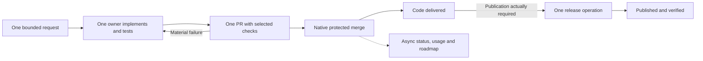

# Design and roadmap: Reduce development bureaucracy to 10–20%

Authored: **2026-09-07 07:42:51 UTC**. Status: **proposed replacement for routine development policy; not an amendment to current executable policy**. This document records the requested design and risk tradeoffs. Merging it does not change branch protection, accepted ADRs, the v2 operating epoch, or permission to mutate production. Those changes belong to the first implementation increment below. The design deliberately recommends removing guarantees, not merely implementing the existing process more efficiently.

Amended **2026-09-07** to distinguish migration-workflow evidence from ordinary v2 execution and make post-cutover carryover an explicit implementation and adoption outcome. The 68.4% measurement is not a measured property of ordinary live v2 development or of SDD alone.

**Decision proposed: ordinary development should be one accountable owner taking one bounded change through one PR and the smallest useful technical checks.** Native merge success establishes code delivery. Telemetry, board fields, roadmap prose, feedback and audit summaries follow asynchronously. Routine work has no separately authored acceptance receipt, receipt PR, review-of-review, phase identity choreography, or mandatory SDD artifact family.

The operating objective is **10% overhead, with 20% the maximum acceptable measured share**, including semantic review, planning ceremony, coordination, delivery mechanics, and their recovery. The first release should remove enough process to make that plausible before adding a new controller, formal workflow, distributed scheduler, or dashboard.

**Evidence and limits.** The measurements below use the September 7 analysis of `.github` and `FS.GG.Coordination`: issue/PR metadata, public lifecycle comments, git history, shipped source and selected Actions jobs. The principal closed accounting window is September 4 00:00 through September 7 07:20 UTC. The source snapshots were `.github` `60c790bc4a7e656a21584dd53fa183c8e986b8e8` and Coordination `a87dcf18e7065d5985141f15b3ff10f23d006328`. Public token counts are reported measured aggregates; private usage receipts were unavailable for independent verification. The available samples are not a controlled experiment. Proposals and savings budgets below are explicitly distinct from observed results.

**The size of the required change.** GS2-07.4 / Coordination #310 reports 74,649,427 tokens across 15 completed phases. Implementation/tests plus product repair account for 19,632,794; product critique and confirmation for 3,985,770; coordination and delivery for 51,030,863. The original classification put overhead at 68.4%. For this design, product critique counts as overhead too: **55,016,633 / 74,649,427 = 73.7%**. The implementation phase mixes SDD with product work, so this is still a generous estimate of productive share.

Holding that productive work constant, 20% overhead permits about **4.91 million** overhead tokens; 10% permits about **2.18 million**. That requires approximately **91.1–96.0% less overhead**, not a 20% speedup in today's procedures. The separate roadmap projection cost is excluded from that calculation; including it makes the required reduction larger. These figures size the redesign and do not predict future token consumption.

Verification: [Coordination #310](https://github.com/FS-GG/FS.GG.Coordination/issues/310), all 30 lifecycle events, and [its separate projection #3284](https://github.com/FS-GG/.github/issues/3284). Formula: overhead share is O/(P+O); therefore O may be at most P/4 for 20%, or P/9 for 10%.

**Equivalent problems in the migration skill and the v2 product have not been established.** There are three different subjects: the SDD authoring lifecycle; today's shared delivery and `work-roadmap` drivers, including the migration-specific `github-substrate-v2-work` wrapper; and the v2 Coordination product being built by those drivers. An expensive process for building v2 does not establish that v2 executes that same process. This distinction limits both the diagnosis and the changes justified by it.

The September 7 source comparison found the following:

| Concern | Migration/shared development workflow | V2 product evidence | Disposition |
|---|---|---|---|
| Independent critic, host, phase comments and telemetry reconciliation | Explicit instructions in current shared driver skills; observed in the costly histories | The inspected review/delivery and status adapters have no model-dispatch or usage-ledger requirement | Remove the observed driver ceremony; prevent its reintroduction in v2 callers. Do not attribute its measured cost to the adapters. |
| Separate acceptance/receipt PR | The migration wrapper explicitly describes the two-phase PR procedure | `DeliveryReceipt` and `DoneReceipt` are planned journal records; their names do not require two PRs | Eliminate receipt-only PRs at the caller boundary. Retain cheap automatic records where useful. |
| Delivery requires accepted review authority | Enforced by the existing delivery route | `planDelivery` calls `authorizeReview`; lifecycle derivation refuses delivery without review authority | Confirmed semantic overlap. Decide how the lightweight owner-review path satisfies or replaces it; no extra reviewer is implied by the type itself. |
| Base-sensitive review identity | An unrelated base advance caused reacceptance work in #3274 | `snapshotBytes` includes `BaseCommit`, and epoch identity hashes that snapshot | Potential overlap, not a reproduced live v2 livelock. Check which base the eventual caller observes and how it handles advancement before changing the contract. |
| Distributed coordination cost | Agent-mediated claims and elections created expensive recovery sequences | V2 uses typed Git-journal/CAS plans and deterministic status derivation | An improvement already exists. Measure real reads, writes, latency and recovery; the declared cost fields are not measured runtime telemetry. |
| Full SDD/roadmap artifacts | Migration skill explicitly requires repository SDD separately from its own gate/receipt workflow | No general SDD-artifact prerequisite was found in the two inspected adapters | Audit actual receiver guidance and entry points. A consumer might impose it even when the core does not. |
| End-to-end ordinary v2 overhead | Migration histories are available | Inspected CLI exposes `roadmap-work`, `qualification-manifest`, `workflow-select` and explicitly says production commands are not enabled | Ordinary production-path performance remains unmeasured. An adapter or qualification fixture cannot substitute for that journey. |

Verification: [migration wrapper](https://github.com/FS-GG/FS.GG.Coordination/blob/a87dcf18e7065d5985141f15b3ff10f23d006328/.agents/skills/github-substrate-v2-work/SKILL.md), [shared roadmap driver](https://github.com/FS-GG/.github/blob/d8815216ef41d9355d4c5faef1adb53d4cc07408/.agents/skills/work-roadmap/SKILL.md), [shared item driver](https://github.com/FS-GG/.github/blob/d8815216ef41d9355d4c5faef1adb53d4cc07408/.agents/skills/pnext-item/SKILL.md), [ReviewDeliveryAdapter](https://github.com/FS-GG/FS.GG.Coordination/blob/a87dcf18e7065d5985141f15b3ff10f23d006328/src/FS.GG.Coordination.GitHub/ReviewDeliveryAdapter.fs#L39), [LifecycleProjectionAdapter](https://github.com/FS-GG/FS.GG.Coordination/blob/a87dcf18e7065d5985141f15b3ff10f23d006328/src/FS.GG.Coordination.GitHub/LifecycleProjectionAdapter.fs#L92), [review/delivery tests](https://github.com/FS-GG/FS.GG.Coordination/blob/a87dcf18e7065d5985141f15b3ff10f23d006328/tests/FS.GG.Coordination.UnitTests/GitHubReviewDeliveryTests.fs), and [CLI entry point](https://github.com/FS-GG/FS.GG.Coordination/blob/a87dcf18e7065d5985141f15b3ff10f23d006328/src/FS.GG.Coordination.Cli/Program.fs). A direct reference search in Coordination's `src/**/*.fs` found no qualified calls to these two adapters outside their definitions; tests exercise them. This is a bounded call-site observation, not proof that no external library consumer exists. No ordinary live-v2 journey was executed in this analysis.

Consequently, the guarantee-reduction table below is a candidate treatment by layer, not a finding that every listed guarantee currently exists in live v2 or must be removed there. Remove proven expensive ceremony; retain already-automatic, inexpensive safeguards when they fit the budget. An internal receipt is acceptable if it adds no agent handoff, PR, separate authorizer or fragile completion dependency and its machine cost is measured. The permanent contract concerns the effective development experience and cost, not identical internals in v1 and v2.

**Root cause: authority, evidence and presentation have become entangled.** The delivery system repeatedly asks an agent to prove that another representation of a fact agrees with the fact itself. A product change acquires issue identity, claim generation, route, SDD identity, critique cycle, acceptance identity, implementation head, receipt head, package identity and roadmap projection. Some identify genuinely different things, but many independently block the same practical outcome. Their Cartesian product creates failure states that have no product meaning.

| Observed failure or cost | Underlying design cause | Proposed removal or replacement |
|---|---|---|
| GS2-07.4 spends 68.4% of reported tokens in coordination/delivery, before product critique | Agents execute and explain transitions between duplicated authorities | One native PR delivery boundary; deterministic status readback; no acceptance agent |
| Latest projection ledgers span 56m23s and 55m50s | Publishing already accepted facts is treated as a new delivery project | Build the roadmap view asynchronously from merged PR/operation references; no per-unit projection issue or PR |
| GS2-07.4 has 42m36s outside recorded phase intervals | Phase segmentation does not capture handoff/settlement gaps; many short turns still reconstruct context | Keep one implementation session; measure the whole unit; use events or bounded machine polling without model calls |
| GS2-07.3 lost a private receipt and then acquired a malformed immutable reconciliation | Diagnostic evidence participates in delivery authorization; immutability forbids cheap correction | Best-effort usage collection with explicit gaps and corrected derived summaries; no telemetry prerequisite for merge or Done |
| GS2-07.5 blocked across a tool upgrade | A phase binds tooling so tightly that recovery cannot resume naturally | Pin a run where useful, but allow explicit continuation under a newer tool; correlate segments without demanding historical requalification |
| #3247 required a comment to contain its future assigned URL | A self-referential evidence model was designed without its real authoring sequence | Use server-assigned PR/run IDs after creation; stop hashing authority envelopes that include their own future identity |
| #3242/#3251/#3255 repeatedly repaired compiler acceptance | Validators model idealized artifacts rather than real producer contracts | Exercise one actual end-to-end published-tool route before expansion; accept native outputs without a second semantic schema |
| #3274 and #3302 reacceptance/successor deadlocks | Head/base/claim/review/election generations form coupled state machines | Reuse the same PR; rerun changed-head checks; remove routine merge elections and claim generations |
| #3290 cannot complete a successful PR-less release | Generic completion is modeled as an implementation PR shape | Delivery facts have two native forms: merged code PR or completed verified operation |
| #3279 duplicate publisher failures | Multiple trigger paths race and treat identical replay as failure | One release coordinator; byte-identity verification after ambiguous or duplicate publish |
| 27/60 `.github` first-parent commits match registry/reconciliation titles | Tool repair induces release, adoption and projection churn | Batch compatible tool changes; one version update per batch; pin stable tools across normal items |
| Four scheduled economics uploads fail | Even the feedback loop's producer and consumer disagree about the output artifact | Fix the path in its generating contract, publish one table, and keep observer failure off the delivery path |
| #268 initially qualified fixture metrics instead of delivered workflow selection | Proof of an internally consistent artifact substituted for a usable capability | First acceptance example must exercise the real callable behavior with observed inputs |

Verification: [projection #3284](https://github.com/FS-GG/.github/issues/3284), [projection #3298](https://github.com/FS-GG/.github/issues/3298), [GS2-07.3 recovery](https://github.com/FS-GG/FS.GG.Coordination/issues/304#issuecomment-5557369801), [GS2-07.5 recovery](https://github.com/FS-GG/FS.GG.Coordination/issues/315#issuecomment-5563234883), [#3247](https://github.com/FS-GG/.github/issues/3247), [#3242](https://github.com/FS-GG/.github/issues/3242), [#3251](https://github.com/FS-GG/.github/issues/3251), [#3255](https://github.com/FS-GG/.github/issues/3255), [#3274](https://github.com/FS-GG/.github/issues/3274), [#3302](https://github.com/FS-GG/.github/issues/3302), [#3290](https://github.com/FS-GG/.github/issues/3290), [#3279](https://github.com/FS-GG/.github/issues/3279), and [Coordination #268](https://github.com/FS-GG/FS.GG.Coordination/issues/268). The commit count is a title-based activity proxy, not a labor percentage; the phase gaps are unclassified time, not proven idle time.

The accounting window also contains 45 newly created and 38 last-closed `.github` issues, a net increase of seven, alongside five accepted GS2 product units. Coordination has 11 created and 11 last-closed issues. These are repository-issue proxies, not Project membership transitions; closures and merged PRs must not substitute for useful unit throughput. In particular, #3290 records why release #3288 remained open after the packages had been verified: missing completion tooling, not missing publication. The new design needs fewer representations of completion rather than more aggressive automatic issue closure.

Verification: fully paginated GitHub issue metadata with `state=all` and `since=2026-08-28T00:00:00Z`, filtered by creation/last-close timestamps to the stated window, excluding PRs; [GS2 roadmap](github-substrate-v2-roadmap.md), [release #3288](https://github.com/FS-GG/.github/issues/3288), and [completion gap #3290](https://github.com/FS-GG/.github/issues/3290). Reopen/reclose transition counts would require a separate timeline census.

**There are four general architectural mistakes.** First, distributed concurrency guarantees are applied even when work has one owner and one isolated branch. Second, diagnostics and derived views have been promoted into synchronous transaction prerequisites. Third, the process uses fine-grained immutable identities for changeable working knowledge. Fourth, every incident tends to add another universal invariant, artifact or repair route without removing the older mechanism it supersedes. The system optimizes local refusal correctness while making useful completion increasingly expensive.

These are architectural inferences from the cited incidents, not findings that every existing check is useless. Product critique found real defects: the accepted GS2-07.1 record describes one blocker and five majors; GS2-07.2 describes three majors. Removing universal independent review accepts a real possibility of later defect discovery. It should not be justified by calling all review ceremonial.

Verification: [GS2-07.1–07.2 acceptance records in the roadmap](github-substrate-v2-roadmap.md). The contrast between useful review findings and expensive delivery mechanics is central to the design.

**Change the premise of the earlier designs.** The [September 4 automation design](reports/2026-09-04-fsharp-roadmap-telemetry-and-projection-automation-design.md) moves mechanics into F# while retaining most obligations. The [September 6 performance-bounded design](coordination/2026-09-06-performance-bounded-development-flow-design-and-roadmap.md) preserves hard guarantees and proposes a Quint kernel, verified plans, reservations, replay, simulation, shadow and canary machinery. The [orchestrator design](coordination/2026-08-31-operations-research-first-agent-orchestration-design.md) retains external fencing and adds a durable executor.

Those proposals can improve execution, but they cannot be prerequisites for reducing today's overhead. This proposal replaces their routine-development premise: **delete the obligation when its expected benefit does not justify its cost; accept a smaller guarantee and a bounded recovery path.** Retain the existing formal/authority machinery for the limited shared-resource and production operations that need it. Do not build federation, an OR optimizer, a new workflow language, a reservation ledger, an agent-routing marketplace or a live graph UI for the first delivery.

**The proposed normal path.**

One owner keeps context through implementation, focused checks, any justified critique and delivery. A task already stated in a user request or existing issue needs no separate intake issue. A PR is sufficient durable tracking for a routine change; an existing issue remains linked when useful. At most one optional independent critique is requested for a routine candidate. The owner repairs material findings in the same branch and PR. There is no critic confirmation of the host's acceptance or review of a generated receipt.

GitHub's merged flag, merge commit and required-check results establish code delivery. A later roadmap refresh or missed usage sample does not reopen that fact. Publishing is a distinct operation only when consumers actually require a release. An operation finishes from its native result and required output verification, with no invented PR. A release task can remain pending while code is already delivered; a single ambiguous Done flag should not conceal that distinction.

**Authority and data are deliberately smaller.**

| Fact | Authority under this proposal | What stops being authoritative |
|---|---|---|
| Requested scope | User request, existing issue or PR description, under one owner | A parallel route/intake/SDD identity chain for routine work |
| Source and code delivery | Git objects and the native PR merge result | Separate host acceptance, merge election, accepted-receipt and typed-cycle completion chains |
| Technical check result | Original CI result and its tested revision | Repeated agent-authored paraphrases and re-signed copies |
| Publication | Release operation plus selected feed's verified artifact identity | A fabricated source PR or report-only receipt PR |
| Board/roadmap status | Rebuildable view of those native facts | Synchronous projection correctness as a delivery condition |
| Usage and duration | Best-effort runtime/job observations with coverage | Immutable per-phase public comments and synthetic-checkpoint recovery |
| Ownership during ordinary edits | One accountable owner and isolated branch/worktree | Distributed leases and overlapping path locks for every routine item |
| Shared or irreversible external mutation | Existing scoped credentials and resource-specific exclusion | No relaxation inferred from the routine code route |

A small existing CLI module or repository workflow can implement this. Its restart state is the PR/run identity plus the outstanding effect kind. It re-reads the provider before retrying an ambiguous merge or publish. There is no new database or generic event-sourced workflow authority in the first version. Bookkeeping updates can be overwritten or regenerated. A missing update is a pending projection, not an indeterminate source merge.

Native GitHub already supplies an expected-head parameter for PR merge. Loose required checks reduce rebases at the explicit cost that changes may conflict semantically with a newer base. The routine proposal accepts that risk and uses a cheap post-merge integration smoke test; it does not claim that an expected PR head proves compatibility with every concurrent base change. For shared publication, Actions concurrency helps serialize a coordinator but is not a universal lock against other clients, nor proof of exactly-once effects. Read-after-ambiguity and artifact identity remain necessary.

Verification: [GitHub merge API](https://docs.github.com/en/rest/pulls/pulls#merge-a-pull-request), [strict and loose protected-branch checks](https://docs.github.com/en/repositories/configuring-branches-and-merges-in-your-repository/managing-protected-branches/about-protected-branches), and [workflow concurrency](https://docs.github.com/en/actions/how-tos/write-workflows/choose-when-workflows-run/control-workflow-concurrency), read September 7. Native capabilities are building blocks; the proposed routing is a design decision.

**Guarantees to remove, weaken or move.** All rows describe future implementation, not exceptions to current checks for this documentation PR.

| Current guarantee or procedure | Proposed routine treatment | Deliberately accepted loss | Small retained safeguard |
|---|---|---|---|
| Complete immutable per-phase telemetry | Remove from authorization; collect whole-run/request usage opportunistically | Exact phase attribution, permanent private receipt availability and complete audit chains are not guaranteed | Unknown usage remains unknown; raw totals and coverage visible |
| Mandatory full SDD family for bounded code changes | Remove; concise intent and acceptance example in PR; design prose only for actual uncertainty | Less formal requirements traceability and fewer machine-checked artifact relationships | Working test/example of the requested behavior |
| Independent critique on every child/projection/receipt | Remove universal requirement; default owner review; sampled/risk-triggered independent review | More correlated mistakes and later discovery | Focused regression checks, bounded post-merge audit and rollback |
| Distinct implementer/critic/host phase identities | Remove for routine work | No simulated separation of duties or complete role-order proof | One accountable owner and native actor attribution |
| Up to ten roadmap repair/confirmation rounds | Replace with at most one optional review and two material repair attempts | Some work ends undelivered instead of exhausting all repair avenues | Preserve candidate, concise blocker, explicit re-scope under the same cost lineage |
| Re-review after artifact-only or unrelated base movement | Remove; changed code reruns relevant checks, no global base-tip equality | No proof every ambient snapshot component was re-reviewed | Expected source head; post-merge smoke; targeted review when a semantic delta warrants it |
| Two-PR implementation and accepted-receipt cycle | Remove for routine units | No separately reviewed merge-bound receipt commit | Native immutable merge/run references; generated downstream status |
| Comprehensive qualification at every roadmap parent closure | Replace routine closure with accepted child references and integration tests | Some cross-child formal interactions may remain undetected | Full formal qualification on relevant kernel/invariant changes and actual high-consequence boundaries |
| Formal soundness proof of every selected test set | Use simple maintainable affected-project/path selection for routine work | An undeclared dependency may escape pre-merge checks | Daily full regression or release qualification and explicit escaped-defect attribution |
| Mutation/inversion evidence for every gate/doc procedure edit | Require it only for the few retained destructive/security/authority boundaries | Less assurance that ordinary validators fail correctly | Ordinary negative tests where they address a known failure |
| Double regeneration/fixed-point SDD checks at each handoff | Remove routine handoffs and repeat generation | No proof every transient working artifact is a fixed point | One native producer output at the relevant candidate; test reproducibility when it is the change |
| Atomic distributed claim/touch-set coordination everywhere | No routine locks; one owner per isolated change, limited WIP | Duplicate work or a Git conflict may occur | No shared checkout writes; native merge arbitration; fencing retained for shared destructive effects |
| Immediate coherent publication and registry adoption after each tool fix | Batch compatible changes, keep stable runtime pins | Fixes may reach consumers later; temporary version skew | Publish-before-consume at an actual contract change; verify chosen installed version |
| Two feeds and two independent builds for every routine release | Propose one authoritative feed and one build; make mirror/reproducibility sampling asynchronous where contracts permit | Less feed redundancy and no per-release independent reproducibility proof | Verify served bytes and source identity; retain stronger mode for security/authority releases |
| Globally fresh runtime/toolkit before every item | Use a tested stable version for a session/batch | Noncritical fixes may not be used immediately | Explicit security/compatibility break invalidates the pin; compatible diagnostic drift does not |
| Completion waits for all metadata and cleanup | Code delivery completes at merge; projection/cleanup are retryable background work | Temporary board staleness and leftover resources | Bounded cleanup job; resource limits; backlog age visible |

**Eligibility has two routes, not a new taxonomy project.** Routine means reversible source/prose/internal-tool changes that do not alter credentials, destructive data operations, live authority/fencing, production cutover/rollback, security boundaries, or externally consumed incompatible contracts. A small tracked list of protected paths and declared operation kinds selects stronger handling. A candidate cannot edit its own routing definition and then use that edited definition to qualify itself. Unknown or mixed-scope changes use the stronger route or split into independently useful changes; no model call is required solely to classify them.

The stronger route keeps relevant independent review, complete technical qualification for the changed critical boundary, and actual publication/cutover safeguards. It still has no review-of-review, synchronous telemetry, or receipt-only PR. Its costs remain in the overall budget and get a separate row; routing expensive work there does not make it disappear. An individually over-budget critical operation is reported as over-budget, never called an efficiency success. If its minimum useful controls cannot fit, stop expansion and simplify/scope the operation rather than silently raise the 20% ceiling.

This is a development-flow redesign, not permission to weaken live v1/v2 epoch exclusion, revive fenced writers, expose credentials, or retry destructive operations blindly. Those are small retained safety boundaries. Conversely, routine review independence, perfect auditability, full child qualification and always-current projections are explicitly negotiable and are removed as described above.

**The overhead accounting must resist relabeling.** Use two buckets for model work: productive implementation/debugging/behavioral test authoring, and overhead. Overhead includes planning documents, semantic review, critique, route/claim operations, context handoffs, CI babysitting, receipt generation, host acceptance, merges, reporting, telemetry work and process-induced repairs. Substantive domain investigation that directly resolves the requested behavior is productive; repeated explanation of existing facts is not. Mixed unclassified requests are overhead for the conservative score until a sampled observation supports another split.

The headline token measure uses input plus output, counting cached input once and reasoning within output. Also report fresh input, cached input and output separately; report actual priced cost where available, and agent-active/runner/wall time separately. A cached token remains in the token numerator. GS2-07.4 had 98.3% cached input, which explains why token volume is not equivalent to fresh reasoning or dollars. No arbitrary conversion of runner-seconds into tokens should obscure a shift from model bureaucracy to CI bureaucracy.

For each eligible work item and fixed cohort, report O/(P+O), O, P, delivery outcome and missing usage. No-work denominators are undefined, not zero. Include original intake through final deliverable, related registration/projection/release work, post-merge repairs and cancelled attempts. Also publish overhead and total cost per delivered unit, the fraction delivered, and a rolling 30-day repair follow-up. Allocate shared release/observer/control maintenance cost once under a fixed rule across its benefiting cohort; show that amount separately. Tooling built solely to support the flow remains overhead in the program's all-in score, even when its code authorship is productive within its own implementation task.

Best-effort telemetry never blocks a valid delivery, but **missing data blocks a claim of measured efficiency**. With quantified missing usage U, use (O+U)/(P+O+U) as the conservative overhead bound; with unquantified missing usage, mark the cohort insufficiently measured. Keep one implementation session and take usage snapshots automatically when available. Do not split work into extra model turns merely to obtain beautiful phase accounting. A small sample of request classifications audits the metric asynchronously; no agent writes another evidence packet for that audit.

**Budget the remaining work, not today's ceremonies.** The following are initial engineering allocations, not measured performance claims or an executable schema.

| Routine overhead category | Planning allocation, as share of total model usage |
|---|---:|
| Intent, minimal planning and final explanation | 2% |
| Owner review and amortized optional/sampled independent review | 5% |
| Model-assisted delivery exceptions | 1% |
| Asynchronous measurement/projection and shared process maintenance | 2% |
| Normal operating objective | **10%** |
| Unplanned process recovery headroom | **10 percentage points** |
| Maximum acceptable measured overhead | **20%** |

At current productive cost P, cumulative overhead may not exceed P/4 to satisfy the ceiling. Ratio enforcement cannot honestly precede all productive work, so allow one small bootstrap allowance of at most 2,000 model tokens; it still counts and can make a tiny item fail the ratio. There is no small-item exemption hidden in the metric. Such changes should need nearly zero model-mediated ceremony. Where there is a naturally shared, useful patch, batching may amortize setup; unrelated work must not be bundled merely to dilute the ratio.

Once attributable usage exists, stop optional overhead requests when they would exceed the remaining allocation. Prefer deterministic completion; reserve a bounded final response. If essential technical work remains, repair it or leave the candidate unmerged. Already known unsafe effects do not become legal when the budget runs out. If the runtime cannot enforce request usage ceilings, say that the token budget is observational; enforce simple call/round limits and expose overshoot. Do not build a separate reservation service to pretend a hard cap exists.

The machine path should need zero model calls for polling, parsing checks, merge submission, merged-state readback, usage calculation or projection. Proposed first-slice bounds are one initial PR per ordinary unit, zero receipt/projection PRs, zero phase comments, at most one optional independent review, at most two material repair attempts, and no more than one automatic retry of an ambiguous effect after observing its state. A persistent technical failure terminates clearly; a later explicit retry retains the original cost lineage.

The startup target is useful implementation within two minutes after the request has enough information. Agent-active delivery administration should normally stay below two minutes. Neither target excludes queue delays from reported end-to-end time. CI waits consume zero model calls; a machine watcher uses provider backoff and can detach from the interactive session. One coalesced status message at a meaningful milestone replaces a prescribed phase display on every response. These are provisional service targets, not tail-percentile claims from a tiny sample.

**Keep the demonstrated wins and fix the failed measurement loop.** The prior exact-subject reuse pair reduced 522 to 55 wall-seconds and 922 to 49 runner-seconds. Current protected acceptance runs for GS2-07.3–07.5 use reuse-decision and evidence-manifest jobs and sum to 69, 68 and 77 runner-seconds respectively. Retain that reuse. Do not rerun cold qualification merely to produce a second closure artifact.

Four sampled September 3–6 economics runs failed at recommendation upload. The script writes to its FSGG_RUNNER_TEMP root, while the generated workflow uploads from a different runner-temp directory. Its run request is also unpaginated at 100 records, its job read uses only the latest attempt, and the tracked defect-attribution array is empty. Repair path agreement in the generating contract, paginate the bounded time window and attempts, and publish a compact table with completeness. Unknown yield is not zero yield. Initially use that table to delete noisy/redundant checks; do not require a recommendation receipt to deliver code. Report sampling and retention gaps without launching recovery ceremonies.

Verification: [reuse evaluation](https://github.com/FS-GG/FS.GG.Coordination/blob/a87dcf18e7065d5985141f15b3ff10f23d006328/work/80-digest-bound-exact-head-qualification-reuse/performance-evaluation.md), [GS2-07.3 run](https://github.com/FS-GG/FS.GG.Coordination/actions/runs/34022719859), [GS2-07.4 run](https://github.com/FS-GG/FS.GG.Coordination/actions/runs/34043739110), [GS2-07.5 run](https://github.com/FS-GG/FS.GG.Coordination/actions/runs/34071019843), [September 6 economics failure](https://github.com/FS-GG/FS.GG.Coordination/actions/runs/34020567023), [source economics script](https://github.com/FS-GG/FS.GG.Coordination/blob/a87dcf18e7065d5985141f15b3ff10f23d006328/eng/bootstrap-gates/qualification-economics.sh), and [empty attribution source](https://github.com/FS-GG/FS.GG.Coordination/blob/a87dcf18e7065d5985141f15b3ff10f23d006328/eng/qualification-defect-attributions.json). The earlier compiled-validation improvement saved runner time while total workflow latency worsened; this redesign measures both.

**Recovery should repair the product or retry a view, not reconstruct a ceremony.**

| Failure | Proposed behavior | What the owner no longer does |
|---|---|---|
| Missing/corrupt usage sample or malformed diagnostic comment | Mark usage gap; discard invalid diagnostic input before write; continue valid delivery | No synthetic checkpoint, distinct reviewer proof or token reconstruction |
| PR source moves | Refresh relevant checks on the same PR; inspect semantic delta where needed | No release/reclaim/successor-election chain |
| Base moves without conflict | Use configured native merge rules; run cheap integration smoke after merge | No repeated global snapshot reacceptance |
| Merge response times out | Read native PR merge state; retry once only if definitely unmerged and still eligible | No assumed failure and duplicate effect |
| Post-merge smoke fails | Revert or repair the actual regression promptly; retain delivered/reverted history | No retroactive rewriting of a successful merge receipt |
| Duplicate publish or partial feed result | Verify exact package identity; finish only the missing required publication step | No new version solely because an identical upload was retried |
| Board or roadmap is stale | Rebuild from native references; show age; retry on next scheduled refresh | No new projection task for every unit |
| Old toolkit cannot parse historical diagnostics | Read known fields best-effort, preserve raw record and label unknowns | No demand to requalify old work under the new diagnostic schema |
| Owner disappears | New owner reads PR and outstanding operation; continue ordinary source work | No universal reconstruction of every old phase identity |

Old high-assurance items with live grants or indeterminate destructive effects still require their existing recovery owner. Do not transfer those obligations through a metadata edit. The lightweight route is introduced prospectively, then old ordinary items can move through an explicit one-time ownership/policy transition. Existing historical receipts remain evidence of their original meaning; their validators are removed from the new routine path, not rewritten to bless incomplete histories.

**Roadmap: ship deletion before orchestration.** This is an implementation proposal with six bounded increments, including explicit v2 carryover. It is not a request to create six epics, separate acceptance items, or a parallel research program. Each increment should remove an observed cost or verify that a cheap replacement already provides the intended behavior. Existing defect rows provide evidence and implementation ownership where appropriate; do not refile the same symptoms. Cross-repository changes may need separate PRs, but routine adoption should be one coordinated batch, not a release for each sub-fix.

| Increment | Route | Owner and dependencies | Concrete delivery | Observable exit |
|---|---|---|---|---|
| **R0 — Adopt the smaller contract** | strict bootstrap | `.github`; first, with Coordination/SDD consumer ownership identified | Map each proposed removal to the migration driver, shared driver, SDD consumer or v2 runtime; record observed/inferred/unmeasured status. Adopt one prospective routine profile; remove applicable mandatory ceremony and align actual required checks and generated guidance. | A real routine PR is eligible without hidden old validators or an issue/claim chain; every durable improvement has a named v2 receiving surface. Existing live critical-operation authority is unchanged. |
| **R1 — Implement one-owner, one-PR delivery** | routine | Current delivery implementation owner in `.github`, with Coordination's unit consumer; after R0 | Small deterministic merge/readback path, same-PR repair, owner review, one summary; code-delivered versus publication-pending status; asynchronous roadmap projection. | One actual bounded code change merges with selected checks, no receipt/projection PR, no phase comments, no separate acceptance agent. Ambiguous-merge readback and changed-head refusal are exercised. |
| **R2 — Fix economics reporting and make telemetry non-blocking** | routine | Coordination economics producer plus current runtime-usage adapter owner; after R0, alongside R1 if touch sets permit | Correct economics output path; complete bounded run/attempt census; whole-unit usage with missing-data status; model-free observer and coalesced status. | A real schedule uploads its table, usage joins to a delivered unit, and deliberate observer failure cannot block delivery. Conservative overhead score is reproducible. |
| **R3 — Simplify release, registry and recovery paths** | routine implementation; strict operation | `.github` release/registry owner; R1 | Idempotent single-coordinator publication; native PR-less completion; stable tool pins and one adoption batch; classify mirrors/provenance requirements for the allowed release class; retire routine successor/receipt repair chains. | One actual applicable release or isolated representative operation completes under retained protected-operation authority, identical replay converges, mismatched bytes refuse, and registry refresh is one batch. No fabricated source PR. |
| **R4 — Measure the current route and retire obsolete ceremony** | routine | One accountable delivery owner; R1/R2, R3 only for release-bearing cohort | Run the comparison below through the current supported route; remove obsolete routine instructions, callers and check requirements; archive old ledgers read-only; keep critical-operation mode narrowly scoped. | Current-route cohort meets the overhead ceiling with adequate coverage and useful delivery. This is an incumbent-route result, not program completion or a live-v2 performance claim. |
| **R5 — Carry improvements into ordinary v2 development and verify receiver adoption** | routine implementation; strict cutover where applicable | Coordination runtime owner, `.github` policy/skill publisher, and SDD/receiver owners; R0 mapping and available v2 execution path | Preserve the same routine profile through published runtime ownership, installed tools, receiver upgrades and generated guidance. Execute the carryover examples below through the ordinary v2 entry point; retire conflicting fallback requirements. | An authorized ordinary v2 code journey demonstrates the reduced process; representative clean/upgrade receivers agree; measured v2 cohort independently fits the 10–20% objective/ceiling. Until then, report carryover pending rather than declaring this program complete. |

Roadmap ledger:

- [x] R0 — Adopt the smaller contract. Delivered by [`.github` PR #3320](https://github.com/FS-GG/.github/pull/3320): the prospective trusted-writer policy, base-loaded exact-head eligibility gate, protected-operation boundary, shared driver route and generated guidance landed together.
- [x] R1 — Implement one-owner, one-PR delivery. [`.github` PR #3321](https://github.com/FS-GG/.github/pull/3321) added the bounded native merge/readback path and exercised successful readback, ambiguous-write readback before one retry, changed-head refusal, and distinct code-delivered/publication-pending status without an issue, claim, phase ledger, critic, acceptance receipt or projection PR.
- [ ] R2 — Fix economics reporting and make telemetry non-blocking. [Coordination PR #321](https://github.com/FS-GG/FS.GG.Coordination/pull/321) delivered the complete paginated census and [`.github` PR #3322](https://github.com/FS-GG/.github/pull/3322) delivered the non-blocking whole-unit observer. The first natural post-merge scheduled upload remains pending; a manual dispatch is not represented as schedule evidence.
- [x] R3 — Simplify release, registry and recovery paths. [`.github` PR #3324](https://github.com/FS-GG/.github/pull/3324) added native PR-less completion and repaired promoted replay. [Exact replay 34140115947](https://github.com/FS-GG/.github/actions/runs/34140115947) completed with prepare/publishers skipped; [wrong-source replay 34140167737](https://github.com/FS-GG/.github/actions/runs/34140167737) refused before either job. The existing 0.85.2 adoption/registry refresh remained the single batch in PR #3291.
- [ ] R4 — Measure the current route and retire obsolete ceremony. [`.github` PR #3326](https://github.com/FS-GG/.github/pull/3326) predeclared the fixed 10+10 code cohort and its 30-day repair follow-up in [`2026-09-07-routine-route-cohort.json`](reports/evidence/2026-09-07-routine-route-cohort.json). It also exposed and prompted removal of the obsolete branch-protection check name `reconcile` after the replacement `architecture-map reconcile` check had passed. Cohort observations remain pending.
- [ ] R5 — Carry improvements into ordinary v2 development and verify receiver adoption. [Coordination PR #322](https://github.com/FS-GG/FS.GG.Coordination/pull/322) made the Codex and Claude v2 work-skill consumers select the shared routine route for admitted source work, made protected evidence claim-dependent, and kept post-merge observation asynchronous. [`.github` PR #3330](https://github.com/FS-GG/.github/pull/3330) extended that selection to every `work-board`, `drive-board` and `pnext-item` entry point and shipped the exact merged source as [coherent set 0.86.0](https://github.com/FS-GG/.github/releases/tag/coherent-set/v0.86.0). This PR accepts the profile's [canonical GS2 integration contract](github-substrate-v2-roadmap.md#12-accepted-amendment-routine-development-simplification-and-ordinary-v2-carryover) without enabling a pre-`OpenV2` writer, rewriting accepted Q0 authority or weakening protected operations. The protected release proved pack-once dual-feed identity, clean package-consumer restore/materialization and append-only receiver notification receipts. Representative upgrade paths are [SDD PR #956](https://github.com/FS-GG/FS.GG.SDD/pull/956) for `FS.GG.Drivers` and [Rendering PR #1276](https://github.com/FS-GG/FS.GG.Rendering/pull/1276) for `FS.GG.Kit`: the SDD driver's 23 focused delivery tests pass against 0.86.0, and Rendering rematerializes the kit with zero writes and all 51 declared skills visible. Their hosted gates and merges remain pending, so receiver agreement is not yet claimed. The protected roadmap pin refresh, authorized ordinary v2 journey and independent measured v2 cohort also remain pending.

R0 is a behavior/authority change and uses the applicable implementation route; this proposal's min-docs landing does not perform it. Its policy diff must explicitly resolve conflicts with [ADR-0053](adr/0053-roadmap-driven-milestone-loop-disposable-sdd-subagents.md), [ADR-0079](adr/0079-single-accountable-delivery-authority.md), [ADR-0080](adr/0080-scoped-child-qualification-comprehensive-milestone-closure.md), [ADR-0081](adr/0081-adaptive-qualification-cadence-from-observed-cost-and-defect-yield.md), and [ADR-0082](adr/0082-durable-private-content-addressed-telemetry-receipts.md), plus the mandatory SDD/default lifecycle guidance. Amend the real sources and regenerate their projections once; no prose exception layered over a still-blocking engine.

R0's implementation evidence records the required per-removal receiver, evidence status, and later adoption
owner in `work/3308-routine-development-route/plan.md`. That map distinguishes observed current-driver facts
from inferred receiver ownership and still-unmeasured economics; it does not claim R1–R5 adoption early.

R0 uses the explicitly human-accepted trusted-repository-writer model recorded in
`.fsgg/routine-eligibility-activation.json` and the R0 implementation plan. The routine gate prevents
accidental protected-path changes, policy drift, and stale-head delivery by evaluating base-loaded bytes.
It does not claim adversarial protection from repository writers able to alter Actions workflows or spoof
a name-based check context. That smaller guarantee applies only to eligible routine development; protected
and high-assurance operations retain their strict authority boundaries.

The current `.github` CLI owns execution until a separately justified ownership migration. Do not move it into Coordination merely to implement this proposal. FS.GG.SDD needs changes only where a consumer cannot opt out of mandatory artifact generation through an existing supported boundary. Public cross-repo release contracts and any v2 accepted-unit validator must be changed before their consumers adopt the relaxed form. Until then, restrict the pilot to eligible changes that do not require those contracts. Do not claim the pilot has simplified GS2 acceptance while its old receipt validator still blocks.

**Carryover is a delivery requirement, not an assumption about the new engine.** `.github` owns the routine policy and published driver guidance; Coordination owns the v2 execution and lifecycle semantics; SDD owns applicable authoring/default behavior; receiver owners verify what an actual installed user invokes. R0 records those bindings in the existing implementation plan. There should be one effective routine profile, resolved from published source through receiver configuration, rather than one permissive migration skill and a stricter future default. Use existing configuration/contract mechanisms where sufficient; do not create a new registry just to record this mapping.

R5 reuses a small set of user-visible acceptance examples across the current route and v2. They are implementation tests and observations, not new per-item evidence obligations:

- One ordinary reversible code change, unrelated to a GS2 roadmap unit, reaches native merged delivery with selected checks, one owner and one PR. No migration index, separate acceptance issue, receipt PR, phase ledger, extra authorizer or report-only feedback cycle is demanded.
- Lost telemetry and delayed Project/roadmap updates leave valid code delivery intact. Usage gaps remain explicit and cannot certify the overhead target; retries of derived views need no model session.
- A source-head change repairs on the same PR with relevant fresh checks. An unrelated base advance follows the chosen native policy without a model-mediated review/claim restart. Measure any automatic journal updates rather than equating them with the old agent loop.
- A PR-less operation completes from its real result when that operation class is enabled. If no such runtime path is yet available, its carryover status remains pending; a code PR cannot serve as a substitute demonstration.
- A clean receiver installation and an upgrade of an existing receiver resolve the same effective routine policy, including generated Codex/Claude guidance where applicable. Check each distinct shipped entry-point/configuration family; one local source checkout is insufficient. Shared SDD defaults do not silently reinstate the removed artifact family.
- Critical-operation routing still selects the intended scoped protections. Ordinary delivery cannot fall back to a fenced v1 writer after cutover, even if that old route happens to have fewer steps.

The future implementation should attach these observations to existing v2 readiness and operational journeys: GS2-10.1/10.5 for candidate profile and receiver preparation, GS2-12.7 for the closed-fleet ordinary-flow example, GS2-13.3 for the first authorized real v2 journey, and GS2-14.1/14.2 for post-open overhead and repair observations. These are proposed integration points in the [existing migration roadmap](github-substrate-v2-roadmap.md), not amendments to its accepted gates by this prose change. R0 must land any required roadmap/contract amendments through their actual governing process before freezing the candidate. No production canary may run before the proper operating authority exists, and one functional canary does not qualify performance.

If the current-route improvement ships first, record it as complete only for that route and keep R5 owned and pending. If existing v2 machinery already satisfies an example cheaply, count that as verified preservation rather than rebuild it. If a v2 caller reintroduces an expensive prerequisite, repair that actual caller or policy; do not weaken an unrelated kernel invariant. The migration's old receipt and role choreography must not be ported merely for compatibility. Completion of this bureaucracy-reduction program requires carryover evidence on the actual v2 path and its receiver defaults, followed by the same bounded cohort accounting below; it cannot be inferred from the earlier 68.4% baseline or from a green qualification fixture.

The first implementation budget is **five engineering days to R1+R2 and a working routine pilot**, with an early stop after two engineering days if there is still no real delivery path. These are proposed investment limits, not schedule estimates. At that stop, reduce the scope or select an even simpler native route; do not fund a general controller by default. R3 and broader adoption proceed only after the first route exists. Necessary externally enforced migration/release boundaries may take longer and are reported separately rather than silently absorbing this budget.

**The canary is small, but it must not manufacture success.** Begin with reversible internal source changes and eligible prose; use routine code, not prose alone, to qualify the code route. Select the next eligible requests before their outcomes are known. Run at least ten routine code items under the candidate and ten comparable retained-baseline items, interleaving where operationally practical; label any unmatched historical comparison observational. Ten per route is a first viability reading, not statistical proof of defect equivalence or p95/p99.

The first promotion criterion is a measured cohort overhead share at most 20%, objective at most 10%, with every over-budget item named and absolute overhead reported. Every successfully measured routine item should also fit 20%; a cohort average cannot erase an expensive item. Require at least 95% observed usage coverage **and** a conservative unknown-usage bound that still meets the ceiling; unbounded unknowns prevent a performance pass. Coverage is measured against an independently enumerated request/usage population or a provider total, not the fraction of self-reported phases marked complete. Where neither denominator exists, report coverage unknown. Delivery fraction must not fall and total cost per delivered unit must improve in the observed comparison. Show intervals, differences in difficulty, and uncertainty rather than inventing a significance claim.

Record escaped regressions, rollback effort and interruptions for 30 days after each delivery, charging them to the originating unit and policy. The deliberately accepted tradeoff is that some defects can be found later; zero extra defects is not a prerequisite that recreates the old guarantees. Proposed containment limits are no credential exposure, irreversible data loss, or authority breach; any such event stops candidate admission immediately. Two process-attributable rollbacks in the first ten code items stop expansion for a focused diagnosis, not automatic reinstatement of all former ceremony. Other bugs are assessed by impact, recovery cost and the combined delivery/overhead result. A 30-day observation is required before a broad default claim; it does not block each delivered item.

At a budget breach, suppress optional review/reporting and inspect the exact overhead category. Do not spend another full agent cycle proving the breach. At a technical regression, repair or revert the product. At persistent uncertainty about required external effects, leave those effects pending under their owner. Restarting work, changing agent identity, filing a successor or upgrading a tool never resets cost accounting.

**Deletion is part of completion.** For the routine route, the final inventory should contain zero mandatory per-phase public comments, zero phase-identity actors, zero receipt-only PRs, zero per-unit roadmap projection PRs, zero agent-written zero-event feedback reports, zero model polling turns, and zero SDD artifacts created solely to satisfy process. Retained critical checks and retrospective samples should have a real consumer and an impact-based reason; this explanation lives in existing policy/configuration, not another bureaucracy ledger.

Publish one compact before/after table from the existing observation job. Count logical controls, distinct authority joins, required artifacts, model-mediated transitions, PRs, and process-repair incidents as well as tokens and time. Automatic runner work is not free simply because it uses no model: its absolute cost and delay remain visible. If tokens fall by moving the same burden into CI, or by dropping hard items, this design has not succeeded.

**The intended end state is deliberately less ambitious and less certain.** One owner can usually implement, check and merge a routine change without proving a complete formal history of how they did it. The system knows what code merged, what checks ran, and what actually published. It may temporarily lack perfect phase accounting, synchronized boards, independent review, or proof that every interaction was covered before merge. That is the accepted exchange for cutting routine overhead by roughly an order of magnitude. Stronger machinery remains available where consequences justify it, but it no longer defines the price of every item.
