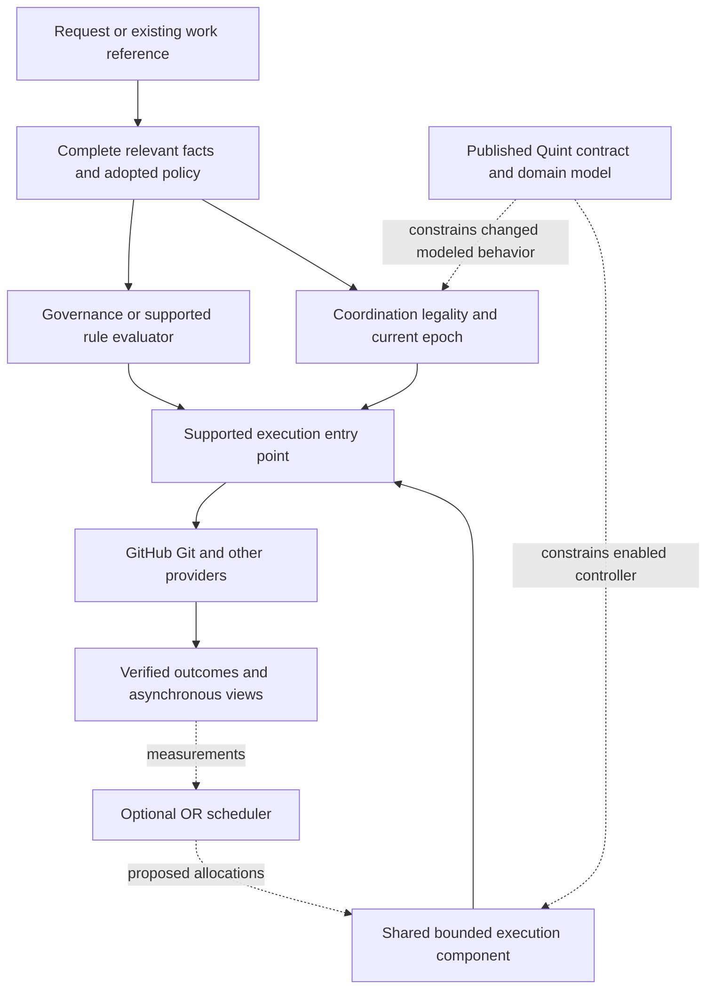
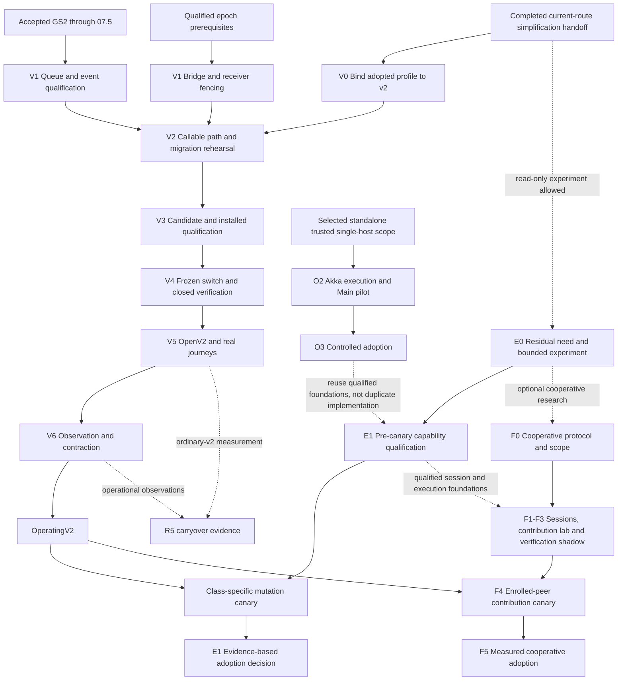

# FS-GG Unified Development Roadmap

Short name: **Unified Roadmap**. In FS-GG development discussions, **“the roadmap”**, **“current roadmap”**
and **“compacted roadmap”** refer to this document unless another roadmap is explicitly named.

Authored: **2026-09-07 15:42:10 UTC**. Status: **proposed successor design and roadmap**.

**Start from completed development simplification and the existing v2 implementation. Finish and qualify
the remaining migration, preserve the simplified experience on installed v2 receivers, then invest in
bounded execution and operations research only for demonstrated unmet needs.** This document specifies
which development process applies to each kind of work, where its behavior belongs, what evidence is
needed, and how the programmes join.

This is the consolidated planning proposal for the current tracks in the
[development master](development-master.md): v2, development simplification carryover, OR orchestration,
PB performance-bounded flow, and governance integration. It incorporates their relevant dependencies and
preserves later portfolio options. It does not restart simplification, completed v2 units, or old kernel
programmes. The broader inventory is accounted for in section 15 without making every proposal a current
implementation commitment.

Publication of this prose does not adopt a policy, change a GS2 unit, enable a writer, alter a lifecycle
default, or authorize an administrative operation. Existing accepted contracts, exact roadmap pins and
operating authority remain binding. The stage labels below are planning joins, not a second executable
queue. Implementation uses the existing owning units after any necessary versioned amendment.

For the operating model, start with [process selection](#4-which-development-process-applies-and-where).
For sequencing, use the [unified roadmap](#9-unified-roadmap-from-the-current-v2-frontier) and
[GS2 integration map](#10-exact-gs2-integration-and-contract-change-boundaries). Sections 1–2 establish
the evidence; sections 14–15 account for every active source track and the wider proposal inventory.
For Astra's planning boundaries and the available subroadmaps, use the
[feature-part index](#98-feature-parts-and-subroadmap-index). For when progress reaches a newly created
workspace, use the [workspace impact map](#99-when-new-workspaces-change).
For the client orchestrator that connects to a project master and receives jobs, see
[cooperative orchestrators](#85-cooperative-orchestrators-a-project-master-assigns-jobs-to-contributor-clients)
and their [F0–F5 roadmap](#97-f0f5-cooperative-orchestrator-development).
For stable execution policies, context/token optimization and evidence-based improvement, use
[LEARN-01](roadmaps/2026-09-12-095059-stable-policy-orchestration-and-statistical-learning.md).
Its later community milestone includes opt-in data contribution through an isolated Main intake and
reviewed public aggregate releases on GitHub.

## 0. Current progress report

LEARN-01 planning delivery, **2026-09-12 10:03 UTC**:
[`.github` PR #3449](https://github.com/FS-GG/.github/pull/3449) merged as
`93ea5e39a5aa89c35942ca1920365352644d4a4b`, delivering the
[stable-policy orchestration and statistical-learning design](roadmaps/2026-09-12-095059-stable-policy-orchestration-and-statistical-learning.md).
It records the selected direction: broad fixed profiles, comprehensive task/decision/outcome observations,
whole-issue context/token accounting, robust controlled comparisons before finer or adaptive routing,
and later opt-in community contribution through an isolated HTTPS intake on Main. The first future source
window is LEARN-01.1–.3; installed experimentation is .4–.5 and community participation is .6.
This is design delivery only. Implementation, experiments, endpoint/repository creation, data collection
and runtime policy activation remain unstarted; O2/O3 and GS2 completion authorities are unchanged.

Standalone O2 publication update, **2026-09-12 07:28 UTC**:
[Coordination #373](https://github.com/FS-GG/FS.GG.Coordination/pull/373) merged as
`a22c7f97533e7bb4c60a891a49994ca5b0995189` after exact-head bootstrap and coherent validation passed.
It corrects authoritative Main controls/readiness, selected routine-docs GitHub qualification and
pending/rate-limit pacing before publication. SystemAdmin reports launcher source
[#53](https://github.com/EHotwagner/SystemAdmin/pull/53) merged as
`0740031b6b794e33dcec5fd21d6b8efa469c6115`, with deployment 21/21, runner 10/10 and launcher 8/8
tests passing. Protected Host/runner workflows
[34675488727](https://github.com/FS-GG/FS.GG.Coordination/actions/runs/34675488727) and
[34675488512](https://github.com/FS-GG/FS.GG.Coordination/actions/runs/34675488512) published and
served-verified immutable artifacts from that exact source. SystemAdmin reports the launcher and
artifact binding accepted in [#54](https://github.com/EHotwagner/SystemAdmin/pull/54), merge
`346b09c861b869482a3a0c779af00c1f33b77da0`; that private-repository receipt is mailbox-attributed.
The installation remains inert. Installed qualification, actual subscription pilot,
recovery/reboot proof and O3 remain pending.

Operational statuses last reconciled: **2026-09-12 07:28 UTC**; LEARN-01 planning delivery recorded
**2026-09-12 10:03 UTC**. Current operational frontier: **V0 and V1 in parallel; SVG-PREVIEW-A.1
is complete and .2 protected Rendering 0.29.0 publication is blocked before any release mutation**.

This section is the progress indicator for this roadmap. It reports accepted native units, merged source,
installed operation and observed behavior separately because they have different completion authorities. A
merged PR is not an installed capability, and an installed setting is not an accepted GS2 unit. The detailed
subroadmaps and content-addressed native receipts remain the source of completion truth; this section is a dated
human-readable projection over that evidence.

**Mandatory closure update:** every Unified Roadmap item that reaches authoritative **Closed** or **Done** must
update this progress report. When the owning change is in this repository, include the progress update in the same
PR. When closure occurs in another repository or through a live operation, land the progress update immediately
after authoritative readback. A progress-only follow-up is asynchronous and does not delay the owning delivery,
but the programme driver must not select another roadmap item while the completed item is still absent here.
Ordinary CI ticks, waiting and intermediate implementation checkpoints do not require a document revision.
For the SVG programme, every milestone's owning session must update both its canonical subroadmap checkbox and
the milestone projection below after native merge/readback and before selecting the next milestone. These rows
link to owning evidence and do not replace it; a missing projection is stale reporting, never completion authority.

### 0.1 Stage progress

| Stage | Indicator | Completed evidence | Remaining exit work |
|---|---|---|---|
| **LEARN-01 — Stable policy and statistical learning** | **Design delivered; implementation not started** | [PR #3449](https://github.com/FS-GG/.github/pull/3449) supplies one [feature plan](roadmaps/2026-09-12-095059-stable-policy-orchestration-and-statistical-learning.md) joining existing V0 telemetry, E0 comparison and selected E1/O0–O3 foundations. Context/token efficiency and slow, evidence-based policy refinement are explicit goals. | .1–.3 define the baseline/experiment, extend observation and integrate fixed profiles/context; .4–.5 qualify installed operation and evaluate the first controlled comparison. Later .6 adds consented community contribution via isolated Main intake and disclosure-controlled GitHub aggregates. No implementation, efficiency, O2/O3 or v2 completion is claimed. |
| **V0 — Simplified baseline and v2 bindings** | **In progress** | Routine delivery is the canonical default for eligible work; protected operations retain explicit authority. The private telemetry engine/store, prospective runtime and CI observation, canonical budget reducer, post-completion activity/review model and public dashboard are operational. The approved physical host runs the exact merged engine with an empty privacy-conservative alias allowlist, host-native recurrence and event activation; a completed-root hook published a verified immutable feed and the deployed page was read back against it. | Finish the R2/R4/R5 evidence denominators. Close remaining automatic parent/child, CI-selection and unsupported native-usage coverage gaps without making telemetry block delivery. |
| **V1 — Event/queue qualification and incumbent fencing** | **In progress; current GS frontier is GS2-08.2 live operation** | GS2-07.1–07.8 and GS2-08.1 have accepted native receipts. GS2-08.2 protection settings are installed and its operational source is merged. GS2-08.3 writer-census and GS2-08.4 common-precondition source boundaries are merged. | Perform GS2-08.2's separately authorized initialization and monitoring operation and obtain native acceptance. Qualify/accept 08.3–08.6; publish/adopt the bridge through 08.7–08.9 and prove old-client refusal. |
| **V2 — Callable v2 and migration rehearsal** | **Not entered** | Existing pure adapters and qualification contracts are reusable inputs. | Deliver the installed ordinary entry point joining observation, decision, provider effects and recovery; complete GS2-09 representative migration, retry, rollback and omission proofs. |
| **V3 — Coherent candidate and receivers** | **Not entered** | Receiver inventories and prior clean-install/upgrade evidence exist as inputs. | GS2-10 candidate freeze, exact tool/template/provider pins, comprehensive qualification and clean/upgrade receiver proof. |
| **V4 — Closed switch** | **Not entered** | Cutover contracts and protected-operation boundaries exist. | GS2-11–12 freeze, drain, closed switch, verification and executable pre-open rollback. |
| **V5 — Open v2 and ordinary use** | **Not entered** | No `OpenV2` authority has been exercised. | GS2-13 irreversible open decision, permanent v1 fence, ordinary v2 journeys and `ObservingV2`. |
| **V6 — Observation and v1 retirement** | **Not entered** | No post-open observation window exists. | GS2-14 0/7/14/30-day observations, receiver carryover, contraction and old-client/clean-install proof. |
| **E0–E1 / F0–F5 — Execution and cooperation** | **Selected single-host foundation active; wider scope conditional** | The [standalone O0–O3 roadmap](roadmaps/2026-09-09-190726-standalone-telemetry-host-and-orchestration.md) already owns the selected Akka.NET actor, bounded execution and durable Main-host work. Source, immutable Host/runner publication and inert SystemAdmin binding are delivered; installed and operational acceptance remain open. This is partial E1 foundation delivery, not completion of E0's comparative measurements or F0–F5 federation. | Reuse the selected contracts and qualified implementation; do not schedule a second actor/executor build or repeat runtime selection for the same scope. Additional planners, federation and broader defaults retain sections 8–9's conditions. O2/O3 does not complete or gate V0/V1. |
| **Selected standalone O2 — Provider-session execution** | **Source, immutable publication and inert receiver binding delivered; installed pilot pending** | [Coordination #368](https://github.com/FS-GG/FS.GG.Coordination/pull/368)–[#373](https://github.com/FS-GG/FS.GG.Coordination/pull/373) deliver and qualify the neutral core, Codex subscription adapter, durable transport/admission, packaged executor/candidate pipeline and Main's production actor graph/seven-effect driver. Protected Host/runner workflows `34675488727` / `34675488512` published and served-verified exact `a22c7f97533e7bb4c60a891a49994ca5b0995189` artifacts. SystemAdmin reports its launcher and corrected artifact binding merged in private [#53](https://github.com/EHotwagner/SystemAdmin/pull/53) / [#54](https://github.com/EHotwagner/SystemAdmin/pull/54), with receiver verification passing and activation still false. | [The existing O2 window](roadmaps/2026-09-09-190726-standalone-telemetry-host-and-orchestration.md#o2-source-window-after-the-provider-session-correction) continues with installed adoption, actual subscription pilot, failure/reboot recovery and O3. Claude, OpenCode and DeepSeek remain intended adapters. These are the selected E1 foundations, not a future duplicate actor project. Prospective telemetry works; earlier gaps and unsupported native usage remain explicit. |
| **SVG-FOUND-01 — SVG game engine foundation** | **Foundation window complete through .5; publication pending** | Rendering PRs [#1279](https://github.com/FS-GG/FS.GG.Rendering/pull/1279) and [#1280](https://github.com/FS-GG/FS.GG.Rendering/pull/1280) delivered the portable Scene/browser packages. Templates PRs [#459](https://github.com/FS-GG/FS.GG.Templates/pull/459), [#460](https://github.com/FS-GG/FS.GG.Templates/pull/460) and [#461](https://github.com/FS-GG/FS.GG.Templates/pull/461) delivered neutral/tactical consumers and an exact retained local candidate packet. Its isolated fresh install built and served the selected scene to Chromium; the separate retained upgrade preserved authored and skill digests and reported collisions before writing. S.I.R. remained read-only. | Producer/template publication, registry or default activation and installed public qualification were not performed. They require a later authorized release window. |
| **SVG-QUAL-01 — Installed model qualification** | **Complete through .3** | SDD source [PR #981](https://github.com/FS-GG/FS.GG.SDD/pull/981) and release [PR #982](https://github.com/FS-GG/FS.GG.SDD/pull/982) published the exact SDD 1.7.0 provisioning route. Rendering [PR #1281](https://github.com/FS-GG/FS.GG.Rendering/pull/1281), merge `815783987fbf1d6f2e8165e2ae31ddf0bf61db2d`, bound its canonical literate model to 192 identical packaged .NET/Fable transitions and the browser effect boundary. Templates [PR #462](https://github.com/FS-GG/FS.GG.Templates/pull/462), merge `b081808cc8c802d264d8fdeaf417911ca821c211`, qualified separate clean and retained installed profile-2 receivers, including a 384-transition semantic amendment, actual Chromium observations, refusal and preservation controls. S.I.R. remained strictly read-only. | Rendering/Templates artifacts remain local; their publication, public-feed receiver qualification, Release A and any default activation remain pending. |
| **SVG-SCENE-02 — Scene/renderer contract** | **Delivered through .7; Preview-A publication pending** | `.github` [PR #3435](https://github.com/FS-GG/.github/pull/3435) froze the M0 inventory. Game [PR #621](https://github.com/FS-GG/FS.GG.Game/pull/621), merge `494bd45591851c03496460e250f6584025fb5e52`, delivered Rendering-free contract-only session envelopes. Rendering [PR #1282](https://github.com/FS-GG/FS.GG.Rendering/pull/1282), merge `acfca1e87866f7c1b4cab3b064e225d8f585a977`, delivered portable identified documents, reference/limit validation, affine and asset/extension contracts. Rendering [PR #1283](https://github.com/FS-GG/FS.GG.Rendering/pull/1283), merge `b3a8a2c4caf6945bb0a2d9570a11d6b27fd8fb96`, delivered selected paint/definition validation, typed serialization/export and packed .NET/Fable plus Chromium export-reload evidence while preserving the 192-transition corpus. Rendering [PR #1284](https://github.com/FS-GG/FS.GG.Rendering/pull/1284), merge `3a94881fc01845cc9d8faf9f413db214df94326f`, delivered retained-node reconciliation, accessible semantic selection, loss-safe pointer ownership and an atomic revisioned document reducer; its additive 192-transition document corpus agrees through the real .NET/Fable reducer while the original 192-transition corpus remains unchanged. Rendering [PR #1285](https://github.com/FS-GG/FS.GG.Rendering/pull/1285), merge `70f8fbf2aedacee0f14ce7548423c51c3c026572`, qualified offline public-SDD model authoring, matching real .NET/Fable replay and first-divergence mutation controls, all three browser families, and the accessible desktop journey through actual Orca/AT-SPI observation. Rendering [PR #1286](https://github.com/FS-GG/FS.GG.Rendering/pull/1286), merge `c4e50dcb239ccb62453cdd47505f1a8d1095814e`, qualified the frozen Preview-A performance/resource workloads, retained raw exact-host evidence and proved all three negative controls kill their intended gates. Templates [PR #463](https://github.com/FS-GG/FS.GG.Templates/pull/463), merge `03fe39dcf37c42b645163348b780bb36b4e43720`, delivered the full opt-in generated candidate, isolated clean source-only and typed receivers, matching 192+192 .NET/Fable replay, and collision-safe retained adoption with interruption and explicit rollback. | The feature is delivered, but candidates remain local. SVG-PREVIEW-A.1 release preparation is complete and .2 protected publication is blocked on authenticated GitHub Packages archive access; installed public clean/retained receiver qualification remains .5 before any registry/default activation. M3/M4 editor/input tooling, M5 session runtime, arbitrary import, complete C18/C19, retained heap, physical presentation/mobile and later releases remain unclaimed. |
| **SVG-PREVIEW-A — Installed scene/renderer preview** | **In progress; .1 complete, .2 blocked at protected preflight** | Rendering bootstrap [PR #1288](https://github.com/FS-GG/FS.GG.Rendering/pull/1288), merge `f0b4fc92063ab4f4e31739e675edcd0122b7d18f`, installed the trusted-base routine boundary. Rendering [PR #1287](https://github.com/FS-GG/FS.GG.Rendering/pull/1287), merge `142a27aee552c104cf9594ca778bc7b6a9e32f83`, then prepared inert 0.29.0 metadata and immutable single-pack custody for the exact 19-member set. Safeguard PRs [#1289–#1294](https://github.com/FS-GG/FS.GG.Rendering/pull/1294) landed trusted-main feed diagnostics. Run [34677990563](https://github.com/FS-GG/FS.GG.Rendering/actions/runs/34677990563) proved service/registration/version metadata readable but both established credentials receive `403` for the known 0.28.0 archive. | No package or tag was published and no version axis changed. An organization package administrator must grant the Rendering Actions principal read/write access to the 18 existing packages and create/link/read authority for new `FS.GG.UI.Scene.SvgBrowser`; a known archive must read `200` and all 19 targets `404` before release. .3–.5 remain blocked. No provider/lifecycle default changes. |

#### SVG milestone projection

This table is a concise navigation projection. The linked feature subroadmaps and owner-native PRs, commits,
checks, artifacts and operation receipts remain authoritative.

Reconciled SVG feature-milestone states: **16 completed, 1 blocked current frontier and 3 pending**.
SVG-PREVIEW-A.2 remains the next boundary; its protected preflight refuses until authenticated GitHub Packages
archive access is granted and is not authorized by .1's source merge.

| Milestone | Projected state | Native evidence | Remaining boundary |
|---|---|---|---|
| **SVG-FOUND-01.1** | **Completed** | [`.github` PR #3422](https://github.com/FS-GG/.github/pull/3422) and the [extraction-boundary audit](reports/2026-09-11-svg-game-engine-extraction-boundary.md) | None for .1; the audit did not publish or activate anything. |
| **SVG-FOUND-01.2** | **Completed** | Rendering [PR #1279](https://github.com/FS-GG/FS.GG.Rendering/pull/1279), merge [`646817c8`](https://github.com/FS-GG/FS.GG.Rendering/commit/646817c847e034e31ff2e6a2da91e7b847a8eb8b) | Local candidate only; publication remained pending. |
| **SVG-FOUND-01.3** | **Completed** | Rendering [PR #1280](https://github.com/FS-GG/FS.GG.Rendering/pull/1280), merge [`d29f272c`](https://github.com/FS-GG/FS.GG.Rendering/commit/d29f272c741d534a8269c4995c3b2da00fb97669) | Foundation browser observations were not complete M9 qualification. |
| **SVG-FOUND-01.4** | **Completed** | Templates [PR #459](https://github.com/FS-GG/FS.GG.Templates/pull/459), merge [`d19fc1d4`](https://github.com/FS-GG/FS.GG.Templates/commit/d19fc1d48647edfebad4a706db64648017fead65), and [PR #460](https://github.com/FS-GG/FS.GG.Templates/pull/460), merge [`2c76c4ba`](https://github.com/FS-GG/FS.GG.Templates/commit/2c76c4ba84fbb1afd53647e302bc6d8a1f34d011) | Defaults unchanged; S.I.R. remained read-only. |
| **SVG-FOUND-01.5** | **Completed** | Templates [PR #461](https://github.com/FS-GG/FS.GG.Templates/pull/461), merge [`31c09270`](https://github.com/FS-GG/FS.GG.Templates/commit/31c092703b35726dcf1173611c675b3cb7db0a29), plus its candidate artifact/readback packet | Producer/template publication and installed public qualification remained pending. |
| **SVG-QUAL-01.1** | **Completed** | SDD [PR #981](https://github.com/FS-GG/FS.GG.SDD/pull/981), merge `2e3a68bd…`, and release [PR #982](https://github.com/FS-GG/FS.GG.SDD/pull/982), merge `b1a3bc1c…`, with byte-identical dual-feed SDD 1.7.0 readback | Rendering/Templates candidates remained local. |
| **SVG-QUAL-01.2** | **Completed** | Rendering [PR #1281](https://github.com/FS-GG/FS.GG.Rendering/pull/1281), merge [`81578398`](https://github.com/FS-GG/FS.GG.Rendering/commit/815783987fbf1d6f2e8165e2ae31ddf0bf61db2d), and 192 identical .NET/Fable transitions | No Rendering publication occurred. |
| **SVG-QUAL-01.3** | **Completed** | Templates [PR #462](https://github.com/FS-GG/FS.GG.Templates/pull/462), merge [`b081808c`](https://github.com/FS-GG/FS.GG.Templates/commit/b081808cc8c802d264d8fdeaf417911ca821c211), with clean/retained installed receivers | Rendering/Templates packages and public-feed receiver qualification remained pending. |
| **SVG-SCENE-02.1** | **Completed** | [`.github` PR #3435](https://github.com/FS-GG/.github/pull/3435), merge `eafdb603…`, and the [M0 inventory](reports/2026-09-11-svg-scene-02-m0-inventory.md) | Inventory did not complete missing C01–C20 capabilities. |
| **SVG-SCENE-02.2** | **Completed** | Game [PR #621](https://github.com/FS-GG/FS.GG.Game/pull/621), merge [`494bd455`](https://github.com/FS-GG/FS.GG.Game/commit/494bd45591851c03496460e250f6584025fb5e52), and Rendering [PR #1282](https://github.com/FS-GG/FS.GG.Rendering/pull/1282), merge [`acfca1e8`](https://github.com/FS-GG/FS.GG.Rendering/commit/acfca1e87866f7c1b4cab3b064e225d8f585a977) | Contract envelopes only: no M5 runtime, publication, generated-workspace change or default activation. |
| **SVG-SCENE-02.3** | **Completed** | Rendering [PR #1283](https://github.com/FS-GG/FS.GG.Rendering/pull/1283), merge [`b3a8a2c4`](https://github.com/FS-GG/FS.GG.Rendering/commit/b3a8a2c4caf6945bb0a2d9570a11d6b27fd8fb96), and its [paint/definition report](https://github.com/FS-GG/FS.GG.Rendering/blob/b3a8a2c4caf6945bb0a2d9570a11d6b27fd8fb96/docs/reports/2026-09-11-svg-scene-02-paint-definitions.md) | Typed round trip/export is not arbitrary SVG import; wider browser/accessibility/performance qualification remains .5/.6. |
| **SVG-SCENE-02.4** | **Completed** | Rendering [PR #1284](https://github.com/FS-GG/FS.GG.Rendering/pull/1284), merge [`3a94881f`](https://github.com/FS-GG/FS.GG.Rendering/commit/3a94881fc01845cc9d8faf9f413db214df94326f), and its [retained-accessible interaction report](https://github.com/FS-GG/FS.GG.Rendering/blob/3a94881fc01845cc9d8faf9f413db214df94326f/docs/reports/2026-09-12-svg-scene-02-retained-accessible-interaction.md) | Contract foundations only: complete editor/input tooling and .5 multi-browser/assistive-technology qualification remain pending. Packages stayed local. |
| **SVG-SCENE-02.5** | **Completed** | Rendering [PR #1285](https://github.com/FS-GG/FS.GG.Rendering/pull/1285), merge [`70f8fbf2`](https://github.com/FS-GG/FS.GG.Rendering/commit/70f8fbf2aedacee0f14ce7548423c51c3c026572), and its [model/browser qualification report](https://github.com/FS-GG/FS.GG.Rendering/blob/70f8fbf2aedacee0f14ce7548423c51c3c026572/docs/reports/2026-09-12-svg-scene-02-model-browser-qualification.md) | Model and real reducer replay, three browser families and actual Orca/AT-SPI observation passed. Physical touch/mobile GPU, publication and defaults remain unclaimed. |
| **SVG-SCENE-02.6** | **Completed** | Rendering [PR #1286](https://github.com/FS-GG/FS.GG.Rendering/pull/1286), merge [`c4e50dcb`](https://github.com/FS-GG/FS.GG.Rendering/commit/c4e50dcb239ccb62453cdd47505f1a8d1095814e), its [performance report](https://github.com/FS-GG/FS.GG.Rendering/blob/c4e50dcb239ccb62453cdd47505f1a8d1095814e/docs/reports/2026-09-12-svg-scene-02-preview-a-performance.md) and [raw receipt](https://github.com/FS-GG/FS.GG.Rendering/blob/c4e50dcb239ccb62453cdd47505f1a8d1095814e/readiness/svg-scene-02-6/preview-a-performance.json) | Frozen exact-host latency/startup/idle/retention/resource/lifecycle predicates and three failure controls passed. Heap, physical presentation/mobile, complete C19/M9, publication and defaults remain unclaimed. |
| **SVG-SCENE-02.7** | **Completed** | Templates [PR #463](https://github.com/FS-GG/FS.GG.Templates/pull/463), merge [`03fe39dc`](https://github.com/FS-GG/FS.GG.Templates/commit/03fe39dcf37c42b645163348b780bb36b4e43720), and its [Preview-A handoff report](https://github.com/FS-GG/FS.GG.Templates/blob/03fe39dcf37c42b645163348b780bb36b4e43720/docs/reports/2026-09-12-svg-scene-02-preview-a-handoff.md) | Full local clean/typed and retained adoption evidence passed. Public producer/template publication and installed public receivers remain the unselected SVG-PREVIEW-A boundary; no default changed. |
| **SVG-PREVIEW-A.1** | **Completed** | Rendering [PR #1287](https://github.com/FS-GG/FS.GG.Rendering/pull/1287), merge [`142a27ae`](https://github.com/FS-GG/FS.GG.Rendering/commit/142a27aee552c104cf9594ca778bc7b6a9e32f83), plus bootstrap [PR #1288](https://github.com/FS-GG/FS.GG.Rendering/pull/1288), merge [`f0b4fc92`](https://github.com/FS-GG/FS.GG.Rendering/commit/f0b4fc92063ab4f4e31739e675edcd0122b7d18f) | Recoverable 19-archive preparation only. Publication, tags and version axes remained untouched. |
| **SVG-PREVIEW-A.2** | **Current frontier — blocked before mutation** | Rendering source safeguards [#1289–#1294](https://github.com/FS-GG/FS.GG.Rendering/pull/1294); trusted-main preflight [34677990563](https://github.com/FS-GG/FS.GG.Rendering/actions/runs/34677990563) | GitHub Packages archive access is `403` for the known 0.28.0 anchor under both established credentials. Obtain the recorded 18-package access plus new-package create/link/read grant, rerun exact-candidate preflight, then publish/read back. |
| **SVG-PREVIEW-A.3** | **Pending** | Defined in the [Preview-A subroadmap](roadmaps/svg-preview-a.md) | Adopt only verified public producer pins and prepare/qualify the Templates 0.11.0 receiver packet. |
| **SVG-PREVIEW-A.4** | **Pending** | Defined in the [Preview-A subroadmap](roadmaps/svg-preview-a.md) | Protected Templates 0.11.0 publication and both-feed/five-template readback. |
| **SVG-PREVIEW-A.5** | **Pending** | Defined in the [Preview-A subroadmap](roadmaps/svg-preview-a.md) | Public-only clean, typed, wizard two-step and retained receivers must pass before Release A closes. |

No single percentage is reported. The stage gates are deliberately non-fungible: source commits, accepted unit
receipts, installed settings, live journeys and elapsed observation windows cannot be added into a meaningful
effort percentage.

### 0.2 Process and telemetry progress

| Workstream | State | Evidence now available | Honest remaining gap |
|---|---|---|---|
| **Routine-process doctrine** | **Adopted for eligible work** | The work-roadmap, work-board, drive-board and single-item routes select routine delivery by default. Strict orchestration is reserved for work that actually needs protected authority, unresolved decisions or the heavier evidence contract. Cheap classification/reuse may admit work before nonblocking coherent confidence runs finish. | R4 still lacks its adequate routine cohort and 30-day follow-up; R5 still lacks an authorized ordinary-v2 journey and independent measured v2 cohort. |
| **Private telemetry store** | **Operational** | `.github` PRs [#3376](https://github.com/FS-GG/.github/pull/3376), [#3378](https://github.com/FS-GG/.github/pull/3378) and [#3379](https://github.com/FS-GG/.github/pull/3379) delivered schema 8 and its live FK-safe revision repairs. The approved host store runs SQLite WAL with zero pending/quarantined batches after retained replay and a clean foreign-key check. | The database is private host state and must never be copied to Git/GitHub. Platform-native collaboration token capture remains unsupported and explicit. |
| **Process observation** | **Operational for instrumented attempts** | Typed planning, implementation, review, validation, delivery, repair, operations and unclassified spans; exact usage attribution; complication events; revisioned attempt/item reviews; and `item-detail/1` are deployed. | Native usage is recorded only when the runtime supplies it. Missing population or attribution remains unknown; tokens are never divided by elapsed time. |
| **Public dashboard source** | **Operational** | Bounded Actions/merged-delivery views, privacy filtering, the engine-owned coherent `/2` snapshot, strict mixed-runtime coverage and one-basis total proof, safe preview/install/verify, and semantic-no-op event refresh are merged and adopted on the exact host engine. Open pages now check the same-origin snapshot approximately every minute while visible and preserve last-good data and interaction state across failed or unchanged checks; scheduled public-source collection uses GitHub's five-minute minimum. | Preserve schema, privacy, boundedness and fail-closed source acceptance as the engine evolves. Browser checks do not shorten host, Actions queue, build, deployment or cache latency. |
| **Public dashboard operation** | **Operational** | An exact empty alias allowlist was approved by digest. The physical host has marker-owned host-native recurrence enabled and active, plus a closed event receipt without embedded credentials. A real completed-root hook published and immutably verified [commit `2edf246…`](https://github.com/FS-GG/.github/commit/2edf24678840c47a7a8a1306cf9947755007d07d). [Pages run `34355973095`](https://github.com/FS-GG/.github/actions/runs/34355973095) succeeded, and an independent HTTP 200 read bound the deployed `host/3` payload to exact source `209410f…`, that host commit and public revision `851ab857…`. | Continue bounded health monitoring. Missing native collaboration usage remains explicit and is not estimated. |

Current private topology is intentionally not embedded in the repository. The host config selects one durable
store and installed engine; GitHub receives only an explicitly allowlisted, bounded public projection. Raw
sessions, SQLite/WAL files, private identities and unrestricted review prose remain off GitHub.

### 0.3 GS2 progress at the current frontier

| Unit/window | State | Delivered or observed | Still required |
|---|---|---|---|
| **GS2-07.1–07.8** | **Accepted** | All eight event, reconciliation, audit, security, merge-group, queue, measurement and selected no-host runtime-operation units have content-addressed accepted receipts. Scheduled complete audits remain authoritative; no webhook host was silently introduced. | Reuse these receipts at comprehensive closure. The bounded event-benefit result does not prove installed production savings or authorize reduced polling. |
| **GS2-08.1 — Epoch wire** | **Accepted** | Native receipt `49c70359…` freezes the bridge/epoch semantics and accepted prerequisite. | Preserve exact correspondence through later initializer, writer and receiver work. |
| **GS2-08.2 — Ledger protections** | **Installed settings and operational source delivered; live operation/native acceptance pending** | Two dedicated Apps are installed only on `FS.GG.Coordination.Authority`; five rulesets and the protected `fleet-cutover` environment are installed; control issue `#2` is bound. Two-pass App-auth capture matched. Environment capture repair [Coordination PR #348](https://github.com/FS-GG/FS.GG.Coordination/pull/348) merged green. [Coordination PR #349](https://github.com/FS-GG/FS.GG.Coordination/pull/349) delivered the real Git-object genesis, independently authorized expected-absence initializer, exact partial/lost-response settlement, one-shot private-WAL monitor, signed operational evidence, CLI/recipes and prospective Q3/Q4/Q6 contract. [Coordination PR #350](https://github.com/FS-GG/FS.GG.Coordination/pull/350) completed the operational source boundary: canonical manifest/trust derivation, cutover-App-only transport, protected-environment receipt verification anchored to [`.github` PR #3384](https://github.com/FS-GG/.github/pull/3384), signed evidence and acceptance-candidate production, and an external-runner contract with explicit alert delivery. Its exact candidate passed 344 unit and 592 architecture tests plus Q3/Q4/Q6 and every required hosted check. | Obtain fresh post-source prestate and protected cutover authorization, retain distinct signer and App credential-custody evidence, and select a named durable monitor host/store and exercised alert destination. Initialize the canonical `OperatingV1` ref/tag, activate the one-shot monitor schedule, verify both passes and accept the native unit. |
| **GS2-08.3 — Writer census** | **Source delivered; acceptance pending** | Producer and independent receiver census source is merged. It inventories 54 command roots and cross-repository writer/callsite surfaces. | Establish the native accepted result and preserve the census against later executable writer changes. |
| **GS2-08.4 — Common precondition** | **Source delivered; acceptance pending** | The common source boundary and retained Quint-validator isolation repair are merged. | Integrate every actual caller, qualify the live reader and installed fleet fencing, and obtain native acceptance. |
| **GS2-08.5–08.6 — Incumbent behavior and attacks** | **Not registered/executed** | The accepted wire and current source boundaries provide prerequisites. | Prove allowed `OperatingV1`/`Preparing` behavior, refuse every stale generation/old-client/fence bypass and complete independent attacks. |
| **GS2-08.7–08.9 — Publish/adopt/disable** | **Not registered/executed** | Receiver inventory exists. | Publish one immutable bridge, adopt its exact identity across receiver families and disable/revoke clients that cannot honor the fence. |

### 0.4 Active work and immediate critical path

1. **GS2-08.2 live operation.** Use the exact source through Coordination PR #350, regenerate fresh two-pass
   prestate and protected authorization, retain the derived initial manifest/trust binding and credential custody,
   and select a named durable monitor host/store and exercised alert destination. Apply only the sealed canonical
   `OperatingV1` initialization, verify branch/tag readback, install the one-shot schedule, exercise alert and
   heartbeat evidence, then run native conformance and acceptance.
2. **Continue GS2-08.3–08.9.** Accept the census and common precondition, integrate all callers, attack the fence,
   publish one immutable bridge and prove receiver adoption/old-client refusal before entering V2.
3. **Unblock SVG-PREVIEW-A.2.** The accepted [Preview-A subroadmap](roadmaps/svg-preview-a.md) has
   completed recoverable source preparation. Grant the Rendering Actions principal authenticated archive
   access for the 18 existing packages and create/link/read authority for SvgBrowser; then rerun the exact
   fail-closed preflight before publishing the
   exact retained 19-archive Rendering 0.29.0 set to both feeds and read back payload identity. Do not begin
   Templates adoption while any producer archive is missing or mismatched.

The independent SVG-FOUND-01 ready window completed at its reviewable local candidate boundary. The SDD 1.7.0
qualification toolchain is public; a later authorized release window may publish and qualify the exact
Rendering/Templates set. No registry activation or default change is implied by SVG-QUAL-01.

### 0.5 Known limits and decision state

- **No current human product decision blocks source work.** Routine source delivery and proportional parallel
  qualification are the canonical defaults.
- **Protected live operations still need exact authority.** General permission to continue does not substitute for
  fresh prestate, protected-environment authorization, credential custody or immutable readback.
- **Telemetry completeness is scoped.** Store integrity and the instrumented prospective path are operational;
  native collaboration usage and some automatic parent/child population discovery remain unsupported rather than
  estimated.
- **Dashboard publication is a privacy boundary.** Private-item aliases, categories, repositories, evidence links
  and notes require an explicit closed allowlist. The database itself never moves to GitHub.
- **The current roadmaps are navigation, not duplicate ledgers.** A checked subroadmap item requires its owning
  source/native evidence. Every item closure must be projected here; ordinary CI ticks do not create progress
  revisions.

## 1. Starting point and the simplification handoff

### 1.1 What “after simplification” means

The predecessor is the [R0–R5 simplification programme](2026-09-07-074251-radical-development-bureaucracy-reduction-design-and-roadmap.md).
This successor takes its **adopted policy, working current-route delivery, applicable release/recovery
behavior, measured incumbent results, and published receiver contract** as inputs. R0–R4 implementation
is predecessor work, not the first phase of this roadmap.

There is a necessary dependency distinction: R5 includes an actual ordinary-v2 journey and its measured
cohort. Those results cannot precede an ordinary v2 execution path. Entry therefore requires the completed
current-route simplification handoff and a decided, owned R5 receiving contract; the actual v2 carryover
proof completes at the existing receiver/canary/observation boundaries below. This does not rename R0–R4
as completion of the whole R0–R5 programme. If full R5 is already complete when this plan is activated,
reuse that applicable evidence and start at the first unfinished stage rather than repeat it.

The handoff consists of existing source references, not a new report family:

| Input from simplification | Required meaning at handoff | What remains in this successor |
|---|---|---|
| Adopted routine policy and trust boundary | Eligible work can use one owner and one PR with selected technical checks; protected operations retain their authority | Bind that exact policy to v2 semantics and installed receiver behavior |
| Native code and operation outcomes | Code delivery, publication pending, verified publication and unknown outcome are distinguishable | Preserve those meanings through v2 journals, adapters and recovery |
| Working observation path | Original events and usage can be joined; incomplete coverage is visible; observer loss does not block delivery | Independently measure ordinary-v2 use and any later controller |
| Current-route comparison | R4's declared cohort and follow-up requirements are satisfied for the completed handoff claim; missing results remain pending predecessor work | Do not reuse the incumbent score as v2 performance evidence |
| Removed obligations and retained predicates | The owning policy says what was deleted, made advisory, moved asynchronous or retained blocking | No generated guidance or v2 caller silently restores removed ceremony |
| Receiver ownership | Policy publisher, runtime owner and installation families are identified | Qualify clean installs, upgrades and retained protected paths |

The dated source snapshot below predates this completed handoff. It is evidence of where implementation
stands, not a claim that the predecessor is already finished. Existing authorized GS2 work can continue
under its current contracts while predecessor work finishes; this proposal does not suspend it.

### 1.2 Verified source snapshot

Research used local source and read-only GitHub observations on September 7. GitHub default-branch heads
matched the inspected checkouts:

| Repository | Revision inspected | Planning consequence |
|---|---|---|
| `FS-GG/.github` | `a6880e965bba91400090dc387ed74f27d39bce9a` | Master/inventory, adopted routine pilot, delivery helper and observer are available |
| `FS-GG/FS.GG.Coordination` | `e2be0cca5a9398cc80e341f68fbc17cd2b3962d6` | V2 acceptance through GS2-07.5; GS2-07.6 registered; economics producer repaired |
| `FS-GG/FS.GG.Governance` | `3f265769d2b23ce36cbe0d05985e3c715dfead4f` | Pure routing, enforcement and exact-key reuse already exist; installed wiring is a separate question |
| `FS-GG/FS.GG.SDD` | `8577e1b85cfb7892c372e033456a63ca46e17e71` | Explicit Quint backend and consumer-defined profile have implementation and release documentation |

The [v2 roadmap](github-substrate-v2-roadmap.md) records acceptance through GS2-07.5.
[Coordination PR #319](https://github.com/FS-GG/FS.GG.Coordination/pull/319) registered GS2-07.6 without
implementing the queue pilot. The remaining migration starts there, with GS2-08 bridge work parallel where
its actual prerequisites permit. Acceptance count is not a percentage estimate of remaining effort:
installation, cross-repository integration, operational qualification and irreversible cutover still remain.

R0/R1 have implementation evidence in [PR #3320](https://github.com/FS-GG/.github/pull/3320) and
[PR #3321](https://github.com/FS-GG/.github/pull/3321). R2 has both the
[observer](https://github.com/FS-GG/.github/pull/3322) and
[economics producer](https://github.com/FS-GG/FS.GG.Coordination/pull/321) merged. The most recent scheduled
run observed, [34100605443](https://github.com/FS-GG/FS.GG.Coordination/actions/runs/34100605443), failed on
the older pre-fix revision. Successful post-fix push qualification is not evidence of scheduled artifact
delivery. R2 closure and the R4/R5 programme claims remain separate.

During final review, [PR #3324](https://github.com/FS-GG/.github/pull/3324) merged at 15:47:26 UTC as
`86669a2ccb4a23e42609f55b4fe8f85e6a5104a3`, adding an R3 release/replay implementation slice. Its PR
explicitly reserves milestone closure for post-merge verification. This newer evidence reinforces the
handoff approach: consume completed predecessor outcomes rather than schedule their implementation here.

A subsequent observation at 16:11 UTC found [PR #3326](https://github.com/FS-GG/.github/pull/3326) merged,
recording R3 post-merge evidence and starting the fixed R4 cohort. Its empty cohort explicitly reports
insufficient evidence. Starting that comparison does not complete R4 or the successor's entry handoff.
Section 7.5 records a separate live workflow/protection observation made while preparing this document.

The inspected [Coordination CLI](https://github.com/FS-GG/FS.GG.Coordination/blob/e2be0cca5a9398cc80e341f68fbc17cd2b3962d6/src/FS.GG.Coordination.Cli/Program.fs)
exposes preparation/qualification commands and explicitly reports no enabled production commands. Adapter
qualification cannot stand in for an installed, ordinary end-to-end execution path.

The newer [SDD 1.5.0 release document](https://github.com/FS-GG/FS.GG.SDD/blob/8577e1b85cfb7892c372e033456a63ca46e17e71/docs/release/quint-general-1.5.0.md)
and [lifecycle guide](https://github.com/FS-GG/FS.GG.SDD/blob/8577e1b85cfb7892c372e033456a63ca46e17e71/docs/typed-sdd-lifecycle.md)
describe consumer-defined bounded Quint models and the explicit backend. Do not schedule a new generic
compiler from the older Q2-not-started banner. This review did not independently restore packages from both
feeds or qualify all receiver defaults; implementation stages still verify the exact published artifacts.

## 2. Research method and findings

### 2.1 Offline analysis

The review compared the master and programme inventory with the v2 roadmap and architecture amendment,
R0–R5, OR H0–H8/F0–F5, PB0–PB8, the governance proposal, Quint migration, and telemetry automation.
It inspected relevant policy, workflow, delivery, observer, Governance and SDD source. GitHub PR and Actions
checks supplemented the documentation. It did not run a production mutation, a complete board census, a
performance experiment, or an organization-wide package/receiver audit. Unpublished local telemetry is not
used as independently verified measurement and is not published by this document.

| Finding | Evidence and limits | Design response |
|---|---|---|
| Policy intent is more aligned than implementation | September 7 OR/PB amendments already make controllers optional; their older detailed clauses still describe richer workflows | One explicit process matrix and one component ownership model |
| Routine does not imply isolated | The pilot has static operation/path checks and no board/claim observation | Separate delivery profile, conflict domain, current authority and capacity |
| Governance vocabulary is not interchangeable with pilot routing | `Route.fs` makes unfenced work advisory; complete input is a caller obligation | Preserve existing semantics; qualify a complete-fact handoff instead of matching enum names |
| Source-head equality does not replace freshness or fencing | Governance freshness includes base/head; v2 review snapshots bind base/head and checks | Separate test reuse, integration evidence, review authority and current operation grants |
| Valid usage arithmetic is not population coverage | The observer marks supplied reconciled counts measured without an independent usage denominator | Separate record validity, join integrity, coverage and performance qualification |
| Delivery/observer integration has a concrete schema gap | Helper emits `expectedHead`/`observedHead`; observer reads `head` | Require a real producer/consumer identity join at handoff; no source-only adapter success claim |
| OR and PB overlap in stateful execution | Both describe budgets, verification, reservations, durable effects and recovery | One bounded execution component; OR adds scheduling over it |
| Candidate stabilization is a shared-resource problem | GS2-10 freezes many fleet inputs and requires comprehensive requalification after drift | Decide inclusion early, bound the stabilization window and exercise aborted cutovers |

Relevant source: [routine policy](https://github.com/FS-GG/.github/blob/a6880e965bba91400090dc387ed74f27d39bce9a/.fsgg/routine-development.json),
[classifier](https://github.com/FS-GG/.github/blob/a6880e965bba91400090dc387ed74f27d39bce9a/scripts/check-claim-generation.py),
[delivery helper](https://github.com/FS-GG/.github/blob/a6880e965bba91400090dc387ed74f27d39bce9a/tools/routine-delivery.py),
[observer](https://github.com/FS-GG/.github/blob/a6880e965bba91400090dc387ed74f27d39bce9a/tools/routine-observer.py),
[Governance routing](https://github.com/FS-GG/FS.GG.Governance/blob/3f265769d2b23ce36cbe0d05985e3c715dfead4f/src/FS.GG.Governance.Kernel/Route.fs),
[freshness inputs](https://github.com/FS-GG/FS.GG.Governance/blob/3f265769d2b23ce36cbe0d05985e3c715dfead4f/src/FS.GG.Governance.FreshnessKey/Model.fs),
[reuse decision](https://github.com/FS-GG/FS.GG.Governance/blob/3f265769d2b23ce36cbe0d05985e3c715dfead4f/src/FS.GG.Governance.EvidenceReuse/EvidenceReuse.fs),
and [v2 review adapter](https://github.com/FS-GG/FS.GG.Coordination/blob/e2be0cca5a9398cc80e341f68fbc17cd2b3962d6/src/FS.GG.Coordination.GitHub/ReviewDeliveryAdapter.fs).

A small synthetic boundary diagnostic passed helper-shaped delivery data to the observer and reproduced
a missing head; a self-consistent 100-token usage example was classified measured without a population
denominator. These are synthetic input checks of the inspected functions, not actual delivery, runtime
usage, or evidence of efficiency. The gaps belong to the predecessor handoff if still present there;
they do not justify rebuilding telemetry as the first successor programme.

### 2.2 Online research and transfer limits

Primary sources were opened on September 7, 2026. The table separates published observations from this
design's inferences. Product documentation establishes mechanism, industrial reports establish experience
in their own environment, and neither predicts FS-GG savings. Moving documentation does not upgrade a
pinned FS-GG toolchain or prove that a feature is enabled for a particular repository.

| Question | Primary evidence | Consequence for this design |
|---|---|---|
| How should productivity be judged? | [SPACE, Microsoft Research, 2021](https://www.microsoft.com/en-us/research/publication/the-space-of-developer-productivity-theres-more-to-it-than-you-think/) argues against a single activity or efficiency measure | Measure delivery, quality, attention and resources together; tokens alone cannot qualify a process |
| Does faster generation imply faster delivery? | [DORA, March 2026](https://dora.dev/insights/balancing-ai-tensions/) describes creation savings shifting into verification and AI amplifying existing strengths and weaknesses | Include review, integration, repair and shared maintenance in the baseline |
| Which delivery measures apply? | [Current DORA guidance](https://dora.dev/guides/dora-metrics/) distinguishes throughput and instability and warns about incomparable populations and over-investment in measurement | Keep source merge, package delivery and deployment denominators distinct; use deployment measures only where deployment exists |
| How small should implementation slices be? | [DORA small batches](https://dora.dev/capabilities/working-in-small-batches/) relates smaller changes to faster feedback and easier recovery | Prefer a usable capability or one independently testable protocol change; do not batch unrelated features merely to amortize ceremony |
| Does simplified review mean review is useless? | [Google's modern code review study, 2018](https://research.google/pubs/modern-code-review-a-case-study-at-google/) examines a mature lightweight review practice across millions of changes | Keep focused critique where uncertainty or consequences justify it; deleting universal role choreography is not evidence that critique has zero value |
| Can native merge integration reduce base churn? | [GitHub merge queue documentation](https://docs.github.com/en/repositories/configuring-branches-and-merges-in-your-repository/configuring-pull-request-merges/managing-a-merge-queue) describes checking the target plus queued predecessors; required Actions checks need `merge_group` coverage | Pilot queue behavior and check identity before enablement; a source-head check alone is not integration evidence |
| Can retries be transparent? | [AWS Builders' Library: idempotent APIs](https://aws.amazon.com/builders-library/making-retries-safe-with-idempotent-APIs/) distinguishes caller intent from merely identical request parameters | Preserve stable operation identity, payload binding and result readback; identical payloads can still represent different intended operations |
| Does a durable workflow settle an external effect? | [Temporal activity execution](https://docs.temporal.io/activity-execution) distinguishes timeout/retry and cancellation; an activity can ignore cancellation | Item termination cannot assert that an effect stopped; recovery ownership survives cancellation and timeouts |
| Do actors provide reliable business completion? | [Akka.NET delivery semantics](https://getakka.net/articles/concepts/message-delivery-reliability.html) give ordinary messages at-most-once delivery and pairwise ordering | If a host is justified, qualify persistence, acknowledgments, inbox/outbox and recovery explicitly; actor serialization is not provider atomicity |
| Where do formal methods help? | [AWS formal-methods experience, 2015](https://www.amazon.science/publications/how-amazon-web-services-uses-formal-methods) reports their use on difficult critical-system designs | Model small authority, reservation and recovery kernels; do not require a new behavioral model for every routine source edit |
| What does Quint prove? | [Quint's current explanation](https://quint.sh/docs/what-does-quint-do) distinguishes simulation and checking, and identifies partial temporal-property support | Pin supported evidence modes and bounds; report sampled versus exhaustive results and explicit environment assumptions |
| Can cache reuse replace execution? | [Bazel remote caching](https://bazel.build/remote/caching) documents hazards from changing inputs and environmental dependencies | Reuse only under the adopted subject and execution-input contract, with integrity checks and cold boundaries |
| Is predictive test omission already justified? | [Meta predictive selection, 2018](https://engineering.fb.com/2018/11/21/developer-tools/predictive-test-selection/) reports calibrated selection using large historical datasets | It motivates an optional experiment, not silent omission of FS-GG obligations or transfer of Meta's detection percentage |
| Is more CI parallelism always better? | [Fallahzadeh et al., 2023](https://arxiv.org/abs/2308.13129) study parallel batch testing using Ericsson and Chrome data and find nonlinear resource/feedback tradeoffs | Measure shared setup, queue delay and failure isolation before adaptive batching; do not import their reported savings as a local target |
| When are agents or multiple agents justified? | [Anthropic's agent guidance](https://www.anthropic.com/engineering/building-effective-agents) recommends simple composition; [its 2026 multiagent research](https://www.anthropic.com/research/multiagent-systems) discusses coordination failures and independently divisible work | Start with deterministic tools and one owner; qualify parallel composition against a fixed single-worker baseline |

The research supports a restrained architecture: retain the accepted distributed-systems protections,
reuse native integration and published tooling, measure actual bottlenecks, and add only the next needed
execution capability. It does not justify a universal controller, a new default lifecycle, or a promise
that lighter review will preserve an identical escaped-defect rate.

## 3. Intended architecture and ownership

### 3.1 One authority chain, one shared execution implementation

The arrows express proposed responsibility, not new network services. The current supported CLI remains
the incumbent entry point until the owning migration delivers a replacement. Pure decisions should remain
usable from tests, CLI, scheduled jobs and any future host without separate behavioral implementations.

| Responsibility | Owner | Implementation boundary |
|---|---|---|
| Programme policy, accepted obligation profiles, receiver topology, release coordination policy | `.github` and existing product policy owners | Versioned adopted sources and thin distribution; no domain engine copied into this repo |
| Lifecycle constitution and generic specification tooling | FS.GG.SDD | Published compiler/profile/ITF/binding/materialization boundaries; no Coordination or game semantics |
| Rule evaluation, effective severity, evidence freshness/reuse where adopted | FS.GG.Governance | Existing supported pure evaluator; consumers supply complete facts and enforce the result |
| Work facts, grants, epochs, transition legality, provider plans and reconciliation | FS.GG.Coordination | Existing v2 domain and adapter boundaries, protected Git journals and provider verification |
| Bounded workflow execution when additionally needed | FS.GG.Coordination | One component owning attempt lineage, finite budgets, reservations and durable local effect intent |
| Portfolio scheduling and allocation when justified | FS.GG.Coordination, policy owned by `.github` | Optional OR planner over the shared execution component; independent plan validation |
| Hosted supervision and authenticated observation | Same execution owner if a host is enabled | One selected runtime; it supplies lifecycle mechanics without replacing external authority |
| Receiver behavior | Each consuming repository; Templates for generated workspace families | Exact published pins, effective configuration, generated guidance, clean/upgrade acceptance |
| Product semantics | Game, Rendering, Audio, Net, S.I.R. and other actual producers | Their own models, implementations, compatibility and installed consumers |

OR and PB become **two views of the same execution architecture**. PB specifies bounded per-item progress,
resource accounting and recovery; OR allocates work and shared capacity across those items. They do not
independently implement an outbox, reservation ledger, retry engine, provider writer or completion model.
Their original detailed requirements are mapped in section 14; unneeded features remain unimplemented.

### 3.2 Four separate decisions

For any supported action, determine:

1. **Delivery/evidence profile:** routine, modeled/contract work, protected operation, or unresolved.
2. **Synchronization need:** isolated, a named shared resource/grant, or unresolved conflict domain.
3. **Operating authority:** permitted now, preparation only, deferred, or refused under the current epoch.
4. **Capacity:** available within an enforceable limit, deferred, or observationally budgeted.

These are conceptual decisions emitted through existing supported outputs, not four forms or new registries.
A routine source change can require an exclusive test-environment grant. A private worktree does not make
a release or authority change routine. An unresolved observation cannot be normalized to a negative match.

## 4. Which development process applies, and where

### 4.1 Process selection matrix

**Binding human decision — 2026-09-08:** lightweight routine delivery is the default process for all work
under this unified roadmap. Only a recorded explicit human instruction selects heavyweight ceremony for
named scope; absence or ambiguity selects routine. Strict labels, GS2 registration, protected paths, policy
changes, modeled work, protected operations and inherited strict state do not select the heavyweight route.
The matrix's process distinctions describe substantive technical evidence and effect safeguards within the
routine route unless such a human instruction says otherwise.

One accountable owner uses one routine branch and one PR, focused and native checks, same-PR repairs, native
merge/readback and asynchronous telemetry. No issue/claim, SDD artifact family, phase lifecycle, mandatory
critic, feedback/receipt cycle, metadata-`Done`, or projection PR is implied. Canonical model authority,
permissions and release/deploy/credential/destructive/cutover/external-acceptance safeguards remain
independent and fail-closed; invalid or unknown authorization blocks the affected effect, not source delivery.

[ADR-0084](adr/0084-semantic-reuse-never-cancels-coherent-validation.md) governs qualification selection
inside that route. A validated exact-head semantic reuse may advance native delivery while the independent
coherent run continues; current or unvalidated work waits, and a late failure disputes dependent acceptance
without changing the rule that only explicit human-named scope selects heavyweight process.

| Work class and examples | Where it occurs | Development process | Evidence needed before delivery | What is needed to enable it |
|---|---|---|---|---|
| Non-executable design, analysis, prose index | Any repository | Proportional prose route; one author/PR | Diff, links, applicable formatting and native required checks | Existing prose route; no policy/recipe/parser change hidden in prose |
| Ordinary reversible implementation with no modeled semantic or public-contract change | Product internals, helpers and adapters within their admitted scope | Simplified one-owner route; concise intent and behavioral example, implementation, focused tests, same-PR repair, native protected merge | Selected technical predicates and exact source identity; optional focused critique | Installed routine profile, complete classification and a supported merge path |
| Ordinary source work using an exclusive shared environment | Any eligible product | Same routine process plus automatic resource acquisition only for the shared action | Valid environment grant and relevant technical results | Qualified resource adapter, conflict identity and recovery owner; otherwise the resource action waits |
| Implementation change under an existing canonical model | Coordination protocols, modeled product behavior | Model-constrained implementation: inspect model, plan correspondence, implement, test/replay affected behavior | Current conformance and affected invariants; scoped reusable evidence where allowed | Published SDD/Quint toolchain and consumer-owned replay; no ceremonial model edit when semantics are unchanged |
| Change to modeled behavior or an authority protocol | Coordination, Governance semantics where modeled, product protocols | Typed specification process: change canonical source explicitly, review semantic delta, implement and independently test correspondence | Type/effect checks, witnesses, bounded invariant/formal evidence, negative controls, real adapter tests as applicable | Owning domain model and supported profile; protected scope selects its stronger delivery predicates |
| Significant feature with unresolved requirements but no useful formal state model | Product/consumer owner | Supported Standard SDD where applicable; clarify the uncertain behavior and deliver small slices | Behavioral requirements and relevant implementation/consumer evidence | Existing lifecycle selection; routine exemption only where actually supported, no silent lifecycle-token change |
| Public API/schema, provider, lifecycle, policy or generated-guidance change | Actual producer plus receivers | Contract change process and publish-before-adopt; relevant SDD/typed process for its semantics | Compatibility, producer publication and installed receiver evidence | Named producer/receiver boundary; protected policy route for changes affecting eligibility or authority |
| A registered GS2 implementation unit | Primarily Coordination; `.github` for bridge/authority work | Existing repository-owned migration workflow and exact registered acceptance contract | Scoped child qualification; cold comprehensive parent closure; required review evidence and accepted unit result | Current pinned unit and satisfied predecessor receipts; a routine-looking diff does not waive GS2 acceptance |
| Release, deployment, credentials, destructive migration or cutover | Authorized operation owner | Protected operation process, distinct from source PR delivery | Current authority, exact plan/artifacts, protected effects, output verification and recovery | Operation-specific permissions, grants and current epoch; no invented PR for a PR-less operation |
| Read-only OR/PB investigation | Coordination domain owner; `.github` policy analysis | Bounded research or pure prototype, with a named question and stop budget | Reproducible local evidence and honest limits | Existing tools; no hosted writer, model-dispatch service or default activation prerequisite |
| Stateful PB/OR execution change | Coordination | Modeled controller change and adversarial replay/correspondence; protected canary activation separately | Finite progress, reservations, late effects, crash recovery and policy comparison | Shared executor contract, published tooling and operation-specific eligibility |

“Protected” does not mean additional human or agent authorizers. Preserve
[ADR-0079's accountable delivery owner](adr/0079-single-accountable-delivery-authority.md). Required
independent technical or critique evidence remains evidence; exact provider approval requirements and
explicitly delegated authority still apply. Neither an agent vote nor a new role identity creates authority.

### 4.2 How much specification and review

Keep existing canonical Quint models authoritative. Introduce a new model where concurrency, authority,
retry, resource-budget or protocol correctness justifies a state model; a simple locally tested state
transition does not automatically require a formal programme. Consume existing generic tooling first.
The domain repository owns the model and implementation correspondence. A generated contract carries
stable relationships and identities, not a second language for the same semantics.

For an implementation-only change, keep the model unchanged and prove affected correspondence. For a
semantic change, amend the actual canonical source and make the before/after behavior reviewable. When
the shipped toolchain cannot verify a desired temporal claim, record the supported narrower evidence or
request a bounded producer extension; do not claim a simulation proves eventual delivery.

Routine work uses one owner and at most one optional independent critique under the predecessor
profile. Material findings repair on the same PR; style preferences do not create a confirmation cycle.
Modeled/protected work uses the applicable substantive review and negative controls, while avoiding
duplicate acceptance actors. Existing strict migration artifacts remain evidence, not a process selector.
Telemetry retirement does not remove substantive GS2 qualification predicates.

Requirement uncertainty first calls for focused clarification and a behavioral example. It does not by
itself force a feature into a complete SDD artifact family. Use heavyweight SDD ceremony only when a human
explicitly selects it for named scope.

Omitted lifecycle remains whatever the installed accepted configuration specifies. The current SDD guide
says `sdd`; this document does not flip it to `typed-sdd` or `none`. A lightweight delivery profile and a
lifecycle/backend selection are separate dimensions. If an installed consumer cannot express the intended
combination, that is a real integration gap to fix before claiming the profile works there.

### 4.3 Process selection over operating time

| Period | Ordinary development | V2/migration work | Shared or protected operations | OR/PB |
|---|---|---|---|---|
| Before GS2-10 | Supported incumbent simplified route on admitted receivers; re-observe candidate-affecting changes | Current GS2 units and their registered qualification | Current accepted v1/protected authority only; v2 sandbox effects within explicit bounds | Read-only research and pure component work may proceed; no normal v2 writer |
| GS2-10 candidate stabilization | Work that changes bound inputs either joins a new candidate or is deferred; do not assert arbitrary source changes are harmless when receiver heads are bound | Exact candidate, full matrix and rehearsal | Candidate preparation is not application permission | Candidate-affecting host/runtime/policy changes are frozen or deferred |
| GS2-11–12 frozen/switching | No ordinary production writes within the frozen scope | Authorized cutover and isolated qualification only | Cutover-owned operations; pre-open rollback under the accepted plan | No optional production experiment |
| After OpenV2, during ObservingV2 | Only enabled v2 operation classes through prepared receivers | Verify real journeys, monitor and repair; retain observation assets | V2 authority; recovery is roll-forward, no v1 restart | Continue read-only work; normal OR mutation remains deferred to OperatingV2 under H6's default |
| OperatingV2 after Q10 and contraction | Installed simplified v2 profile for its qualified classes | Remaining adopted improvements and deferred programmes | Current v2 grants and published operation contracts | One separately justified, qualified class may enter canary; broader adoption is a separate decision |

The difference between **OpenV2** and **OperatingV2** matters: the first opens normal v2 writing and
irreversibly fences v1; the latter follows the observation/contraction programme. Do not use the names as
synonyms. No purported fallback may restore a fenced v1 writer.

### 4.4 Just-in-time feature planning and execution

Use the temporary repository-owned
[`work-unified-roadmap` skill](../.agents/skills/work-unified-roadmap/SKILL.md) to advance this programme.
It is committed in both declared agent skill roots, so a fresh checkout carries the instructions and
supporting material. Creating or inspecting the skill does not start roadmap work.

At each new major feature, a fresh **Astra high** (`gpt-6-astra`, `high`) subagent analyzes actual prior
work, the relevant unified stages, original plans and targeted current primary sources. It produces one
digestible feature subroadmap: a few ready milestones with acceptance examples and a later outcome
outline. Do not detail the entire programme in advance. Resume valid active plans; expand the near-term
window when needed, or replan when a material assumption, dependency or scope changes.

The [feature-part index](#98-feature-parts-and-subroadmap-index) defines the default scope of those
planning assignments. Stages describe dependency and operating boundaries; a named part describes the
outcome Astra plans. Each subroadmap links back to its part and records its generated-workspace impact
using [section 9.9](#99-when-new-workspaces-change). Add its actual document link to the index when it is
created, preserving links to earlier bounded plans and their evidence.

A **Sol medium** (`gpt-5.6-sol`, `medium`) worker executes that bounded subroadmap through the installed
`work-roadmap` skill and the owning repository's actual route. Reuse the worker for routine milestones
and repairs where the route permits. Existing GS2 ledgers remain authoritative; window completion does
not imply feature completion or publication. Apply section 7.4 through available automatic observation,
report missing instrumentation as a gap, and avoid a new planning or reporting cycle for each item.

Retire the temporary coordinator when the shared driver provides these behaviors or the programme ends,
preserving active plans and evidence. Its presence does not amend protected contracts or enable stages
whose prerequisites have not been met.

## 5. Governance, synchronization and evidence

### 5.1 Preserve selected guarantees explicitly

At integration, each affected obligation receives one disposition in its existing owning policy:
retained blocking, retained advisory, asynchronous, duplicate retired, or deliberately removed with its
accepted tradeoff. Preserve protected-history integrity, complete relevant observations, external effect
authority, recovery ownership and declared technical qualification. Do not infer that every historical
artifact is an essential guarantee, or that a fewer-job CI layout removes any guarantee at all.

Governance determines rule applicability and evidence under its installed contract. Coordination determines
whether current external facts, grants and epochs admit the transition. A positive result from either
cannot substitute for the other. A complete negative fence match differs from incomplete input.

The inspected Governance `Route` treats unfenced work as advisory, including in gate mode. Therefore the
integration must identify which native technical predicates remain independently mandatory and how
inherited enforcement floors are supplied by the actual supported enforcement component. Merely feeding
the pilot's word “routine” into that API is not a proven policy translation. Do not silently change the
pure library's semantics to make two vocabularies appear equivalent.

### 5.2 Synchronization scope and current authority

Isolated source work should have no global claim solely for tracking. Shared environment, package,
settings and protocol effects require their actual conflict domain and qualified grant. Existing strict
claims cannot be escaped by relabeling a branch. Multiple grants use the accepted acquisition and
compensation protocol; a partial acquisition must not enable the effect.

A Git expected-parent update linearizes a journal transition, not an arbitrary later API call. At each
protected provider boundary, qualify generation, revocation and in-flight ordering through the supported
serialized/capability mechanism. If an adapter cannot meet the declared ordering, keep that operation
unsupported. Neither a pre-read nor an actor lock creates remote fencing.

The routine pilot intentionally trusts repository writers. Its check is not adversarial protection from
writers able to alter workflows or imitate name-based contexts. Preserve that scope honestly. Stronger
provenance for protected operations requires actual available provider controls and permissions, not a
statement that the same trusted-writer pilot became a security boundary.

### 5.3 Four different kinds of freshness

| Evidence/fact | Subject | Reuse or refresh rule |
|---|---|---|
| Deterministic technical result | Adopted semantic/execution inputs, toolchain, environment and policy | Reuse only when the installed key matches; verify artifact integrity |
| Integration result | Candidate combined with target/predecessors under chosen merge policy | Recompute where native integration or accepted candidate identity changes |
| Review/acceptance evidence | Required current review subject and candidate | Preserve accepted base/head semantics until a qualified narrower contract exists |
| External mutation authority | Current grant, epoch, operation and resource | Revalidate/enforce at the effect boundary; historical green evidence cannot preserve revoked authority |

Use native merge queues when their measured contention benefit justifies them and GS2-07 qualification
covers the required events and contexts. Low-volume repositories may retain their accepted native merge
policy. A queue is not a universal grant or an exemption from current authority. Unrelated base movement
should not trigger an agent-mediated receipt restart, but can still require automatic integration checks.

## 6. Execution, recovery and releases

### 6.1 One ordinary journey

A request or existing issue supplies bounded intent. The owner implements and runs selected checks in an
isolated checkout. The adopted classifier resolves scope and required shared effects. Material failures
repair in the same PR. The supported provider path merges the intended source under its required checks.
Native readback establishes delivery; any release is a separate operation. Observers join facts later.

The effective experience contains no mandatory receipt-only PR, per-phase public comment, extra acceptance
actor, synchronized roadmap update, or SDD artifact created solely for routine process. Cheap machine
records can remain when a real consumer needs them. Those records must not recreate the removed handoffs.

### 6.2 Minimum recovery without a hosted controller

| Event | Supported behavior | Enforcing/recovery owner |
|---|---|---|
| Source changes before merge | Refuse stale source; refresh relevant checks and continue the same PR | Delivery entry point and provider |
| Merge response is lost | Read native state; retry only under the bounded operation's proven retry conditions | Delivery entry point; pending outcome remains explicit if observation fails |
| Board, usage or dashboard disappears | Preserve known delivery, show stale/missing observation and refresh later | Model-free observer |
| Shared grant is revoked | Prevent new protected effects; reconcile already in-flight work under declared semantics | Coordination and qualified adapter |
| Publication partially succeeds | Verify package identity and bytes; finish only missing required steps | Existing release owner and saga |
| Timeout occurs while an effect is applying | Stop new ordinary work, preserve operation identity and settlement owner | Operation recovery path |
| Owner or future host disappears | Recover from durable relevant intent and provider facts; do not reset budgets or duplicate effects | Supported successor owner under current authority |
| Observer reports contradictory or malformed data | Isolate the diagnostic input; do not manufacture a clean effect result | Observer for reports; effect owner for actual unknown outcome |

A model session is not the durable storage system. Conversely, durable storage does not establish provider
success. A terminal item outcome may coexist with an outstanding effect settlement; that settlement
continues to reserve its needed authority and resources and blocks conflicting actions as required.

### 6.3 Release and fleet adoption

Consume the simplified release path delivered by the predecessor. Preserve the installed coherent-set,
OIDC, byte identity, feed verification, provenance and recovery obligations for the enabled release class.
Do not reinterpret release convenience as permission to reduce those contracts. A same-identity replay
converges only after byte verification; mismatched bytes refuse. A PR-less operation completes from its
native verified result rather than a fabricated source PR.

Publish producer changes before receiver adoption. Batch compatible tool/registry updates with one coherent
adoption operation when the release contract permits; do not bundle unrelated product behavior simply to
make overhead ratios look smaller. Pin stable tools for active work and support explicit continuation and
history interpretation across upgrades without pretending old evidence was produced by the new tool.

## 7. CI, observation and performance contracts

### 7.1 Optimize in the order that preserves meaning

Use the predecessor's decided obligation set. First remove duplicate invocations and unrelated synchronous
views. Then use accepted content-based reuse and shared setup. Only afterward consider a different
selection guarantee, batching strategy or predictor. GS2-06.7 sound selection, unknown-impact handling,
formal-input drift, and comprehensive closure retain their accepted meaning until amended.

The accepted reuse optimization is the four-disposition contract in
[ADR-0084](adr/0084-semantic-reuse-never-cancels-coherent-validation.md): `current`, `reused`, `deferred`, or
`failed`. Classification runs first; an accepted classification starts the coherent run, and valid reuse starts
delivery alongside it. Independent tests shard where safe, and coherent candidates may overlap. Valid reuse may leave coherent validation pending after merge; only a later
pass closes it, while a late failure marks it disputed and blocks dependent acceptance or activation.

One stable aggregate can expose many named predicate results. Missing required evidence must not become
success, and an advisory result must not become blocking because a client indiscriminately treats every
red context as required. Policy/evaluator identity comes from adopted authority; candidate changes to the
selector, policy or enforcement workflow take their applicable protected route.

Coalesce pending refresh hints for the same subject, not durable commands or distinct subjects. Preserve
grant/approval changes and non-idempotent operation identity. Cancellation of superseded analysis is
different from cancellation of an applying external effect. Full scheduled audits repair missed hints;
routine merge should not await a full fleet scan unless a named required predicate actually depends on it.

### 7.2 Measurement has four separate statuses

1. **Record validity:** schemas, units and arithmetic are meaningful.
2. **Join integrity:** the record identifies the actual request/attempt, PR or operation, source and policy.
3. **Population coverage:** independently enumerated activity or provider totals bound missing usage.
4. **Qualification:** the declared cohort, uncertainty, performance and follow-up conditions pass.

The observer must not collapse the first into the fourth. Extend existing observation output only where
needed; no per-item agent writes a measurement certificate. Aggregate public counts without publishing
private conversations, credentials or raw usage receipts. Retention and access should fit the existing
private evidence contract and cohort follow-up period.

Use separate populations for the migration workflow, incumbent routine development, ordinary v2, and each
optional controller experiment. Initial v2 R5 measurement uses the predecessor's common definitions:
productive work P, process overhead O, and quantified unknown usage U. Charge planning, semantic review,
coordination, delivery, failed attempts, observer/tooling maintenance and attributed repairs appropriately.
The measured ratio is O/(P+O); the conservative ratio is (O+U)/(P+O+U). Unquantified missing usage prevents
an efficiency qualification, even if the supplied records balance.

For the predecessor's broader comparison, preserve its **10% objective and 20% ceiling**, at least ten
candidate and ten comparable baseline code items for the first viability comparison, at least 95%
independently assessed usage coverage, and the
conservative bound within the ceiling. The source also requires every successfully measured routine item
to fit 20%; keep outliers visible and do not quietly relax that criterion for small changes. If fixed
cost makes it unsuitable for a work class, propose a versioned absolute-budget alternative before using
it for promotion. No denominator change, task enlargement or rerouting may manufacture a pass.
This broader source-contract series is not an alternative to the successor's **10% bureaucracy ceiling**
in section 7.4; report the two definitions separately. Any affected adopted promotion predicate requires
its owning versioned amendment before implementation uses the successor definition.

Report tokens by provider semantics, priced cost, runner time, API calls, human attention and wall time
separately. Cached input counts once; avoid double-counting reasoning already included in output. Price
changes and provider counters need identified measurement versions; tokens are not interchangeable money
or compute seconds. Shared work is allocated once under a stated rule and also shown as an absolute total.

### 7.3 Outcomes and experimental discipline

Compare useful delivered fraction, cost per delivered unit, lead time from the first eligible request,
age of unfinished work, escaped regressions, rollback/recovery effort and attention. Source merges are
not deployments or published packages. Use DORA-style deployment measures only for actual deployed services;
do not call a PR count deployment frequency.

Choose eligible requests before outcomes are known. Prefer interleaving or a documented matched/switchback
comparison that accounts for shared runner interference. Historical unmatched comparisons remain
observational. Failed, cancelled, refused and unfinished requests stay in the denominator; whole attempt
lineage and delayed repairs stay with the original policy. Specify primary improvement, margins, sample
sufficiency and stopping rules before reviewing results.

Ten items per route is a viability check, not p95/p99 or rare-defect equivalence evidence. Keep runtime
absolute caps separate from distributional promotion targets. Small samples return insufficient-data;
they can justify a bounded continuation, not a general tail-latency claim. Retain the predecessor's
30-day repair observation before broad default claims and its severe-incident/early-rollback stop rules.

Missing efficiency evidence blocks an efficiency claim and applicable controller promotion. It does not
independently block a valid routine merge or add a numerical gate to OpenV2/OperatingV2. Existing Q10 gates
still apply. Functional or authority failure is different: an enabled profile cannot claim qualification
while its required behavior is broken.

### 7.3.1 Stable policies, context efficiency and statistical learning

The September 12 planning direction is **broad, stable execution policy followed by increasingly precise
evidence**, detailed in [LEARN-01](roadmaps/2026-09-12-095059-stable-policy-orchestration-and-statistical-learning.md).
Collect task characteristics, execution choices and outcomes from the beginning, but begin routing with
a few fixed profiles. Classification uses information available before assignment and preserves its
version, uncertainty and provenance. Analysis refreshes do not change policy. Finer task distinctions,
model/effort/context routing and adaptive allocation need sufficient independent observations, practical
benefit with uncertainty, repair follow-up and explicit versioned promotion at declared evaluation points.
Insufficient evidence means continued observation or an inconclusive result, not automatic promotion.

**Context and token efficiency are first-class improvement goals.** Evaluate total original-issue
resources, including Astra planning, context assembly/retrieval, all workers, retries, reviews,
integration and delayed repairs. Mandatory instructions, contracts and technical evidence remain present.
A smaller initial prompt only helps if total resource use improves while completion quality and latency
remain acceptable. Keep provider-native accounting, subscription capacity and known monetary costs
distinct. Children, rescue attempts and new PRs do not create extra independent successes or reset costs.

LEARN-01's first proposed controlled comparison holds model, effort, decomposition and process fixed
while comparing the current context package with a focused package. Randomization, cohort admission,
assignment units, follow-up, sample/precision requirements and analysis rules are specified before use.
Its proposed minimum four-week enrollment and bounded evaluation cadence are research-design inputs,
not new per-PR gates. Historical associations, prediction, simulation and causal experimental results
have distinct claims. The selected roadmap owns this detail; sections 7.2–7.4 retain their existing
accounting and intervention definitions. Necessary repairs proceed under their existing authority and
mark materially affected experiments interrupted rather than silently mixing policy versions.

The later community path keeps local analysis available without sharing. Explicitly opted-in clients
submit minimized statistical reports to an isolated HTTPS intake on Main, with separate credentials,
storage and no dispatch or internal-store access. Private validation and disclosure review precede
public aggregate dataset releases in a dedicated GitHub repository. Sharing observations and joining an
experiment are separate opt-ins; removing names alone does not establish anonymity. Community
self-selection, measurement differences and unverified submissions remain visible in analysis.
Actual hostname/repository selection, publication and deployment belong to LEARN-01.6; no intake or
collection is activated here, and community participation does not gate the internal comparison.

This design extends the existing observation path and selected O0–O3 runtime. It does not establish
measured benefit, complete R2/R4/R5 or E0/O2/O3, or add a prerequisite for V0–V6. Live execution and
experimental enrollment retain their owning operational permissions.

### 7.4 Narrow bureaucracy budget: tests excluded

The requested bureaucracy budget concerns administrative checks, waiting for checks/CI, and process churn.
It is narrower than the predecessor's broad overhead measure, which also includes planning and semantic
review. **Target 5% bureaucratic overhead, with a 10% ceiling.** Retain the broader
10%/20% measure separately so this narrower definition does not hide the cost of review or planning.
The intervention rule is **15 cumulative distinct items above 10%, or any one item above 25%**. An item
above 10% breaches the ceiling immediately, but does not by itself launch a repair cycle or block delivery.
These are the requested design thresholds, not constants established by external research or additional
currently accepted GS2/per-PR gates. The 25% trigger is not a second permissible ceiling.

| Dimension | Proposed routine budget | Interpretation |
|---|---|---|
| Active owner effort spent administering the process | Target at most 5%; ceiling 10% | Administrative active effort divided by all attributed active effort |
| Model usage spent administering the process | Target at most 5%; ceiling 10% | Administrative usage divided by all attributed usage under fixed provider/classification semantics |
| Attributed CI runner time and cost spent on administrative work | Report absolute amounts and their share of CI | Diagnostic breakdown, not a separate trigger: a tiny docs-only CI run can be entirely administrative while adding little overall item cost |
| Added critical-path delay from administrative execution, CI queueing, check dispatch/reporting and process repair | Target at most 5%; ceiling 10% of end-to-end item lead time | Exclude actual useful test execution from this numerator; retain administrative waiting, including provider outages, with cause attribution |
| Absolute administrative delay | Diagnostic aims: median at most 2 minutes; p95 at most 5 minutes | Show beside the fractions; these are not additional per-item intervention triggers |
| Required agent polling/status-restatement turns | Zero on the normal path | Events or bounded machine polling observe native facts; no model session exists solely to wait |
| Receipt-only or status-only PRs | Zero | Native delivery and operation results remain the source; observers publish derived views asynchronously |
| Administrative recovery | At most one automatic recovery attempt before a visible pending/failed diagnostic | Retry only when safe; this does not cap or abandon required settlement of a real external effect |

For active effort, the numerator is effort on eligibility paperwork, state copying, check-status handling,
delivery ceremony and repairing those mechanisms. The denominator is total attributed active effort,
including useful implementation, test-related work and substantive review. Use the analogous definition
for model usage, measured separately. Automated administrative compute is also reported in absolute
runner-seconds and cost; moving model work into a runner does not make it free.

Actual execution of useful product tests, security analysis or formal verification is **not bureaucracy**.
A workflow's label does not determine its classification: a required test remains useful validation, while
a required check that merely revalidates duplicated process records remains administrative. Attribute the
administrative or avoidable part of setup and reruns explicitly; report necessary technical validation
separately. An expensive duplicate rerun is a separate avoidable-CI cost even when its test body is excluded
from the narrow bureaucracy numerator, so the definition cannot hide wasted testing.

For elapsed delay, count only intervals on the item's actual delivery critical path. A CI queue wait
overlapping productive implementation does not add its full duration to delivery time. Parallel waits
are counted once, and actual useful test execution is removed from the administrative interval rather
than counted as both testing and waiting. Show total latency and useful test duration alongside this
decomposition. Missing timing attribution remains unknown; do not subtract guessed test time to obtain
a passing bureaucracy budget.

Use the absolute delay aims beside the percentage measures: fixed administration can dominate a tiny
change's ratio, and a large implementation can conceal excessive waiting. Keep such outliers visible;
do not enlarge tasks to improve the fraction. Insufficient samples cannot qualify p95. Avoid treating a
good cost ratio as evidence of acceptable waiting: the dimensions are measured independently. No weighted
average lets a cheap model session cancel out a blocked CI queue.

**Counter and trigger semantics.** For each usable percentage-budget dimension above, compute administrative amount divided by
total attributed amount in the same units. Count a routine item once if any dimension exceeds 10%; trigger
the severe condition if any exceeds 25%. Never add minutes to tokens or count the same item three times.
No activity in a dimension is not applicable; missing activity or missing attribution is unknown, not zero.
Provider usage that cannot be combined meaningfully stays separated, with priced cost reported alongside.

The counter covers distinct original routine items since monitoring started or the last completed
intervention. It is cumulative, not consecutive and not reset by a good item, a week boundary, another PR,
a retry or a new worker. Evaluate complete item totals at delivery or a definite failed/stopped outcome,
and revise them when attributable follow-up cost arrives. An initial administrative prefix before useful
work is not a complete item with 100% overhead. Unfinished items, their provisional costs and their age
remain visible; leaving them open must not remove them from population coverage or total cost reporting.

At the fifteenth distinct breach above 10%, or the first item above 25%, enter one intervention state.
Exact 10% does not count; exact 25% counts as a normal breach but does not alone trigger the severe path.
The severe path acts on the first usable observation and does not wait for fifteen items. Replayed events,
later samples and multiple breached dimensions update the existing item. Corrections remain auditable;
they may correct a mistaken count but cannot erase real expense. Missing or bounded-but-inconclusive
attribution cannot certify compliance or fabricate a confirmed breach. Surface one deduplicated observer
health diagnostic for that gap, not a new report request on every item.

While intervention is open, further breaches join it. Do not spawn another intervention for every new
event or pause otherwise valid routine merges. The explicit tradeoff is that modest breaches can persist
until fifteen distinct items accumulate, especially at low throughput. Their count, age and absolute cost
stay visible without inventing a second automatic escalation rule.

**Aggressive intervention, with a low administrative cost.** Prioritize removing the measured sources of
overhead: delete duplicate checks and mirrored records, take derived projections off the merge path,
combine refresh hints, eliminate agent polling, share setup and repair the existing recovery path. Start
with the largest attributable costs. Prefer deletion or a small deterministic fix over another controller,
reporting layer or universal review. Retained technical predicates and unsettled effects keep their meaning.

One accountable owner uses the existing log to make the bounded implementation change and inspect its
real before/after behavior. Target a return toward 5%, not oscillation just below 10%. A completed
intervention means the fix is deployed to the affected route and ordinary-path evidence demonstrates the
claimed reduction; changing a policy number, producing a report or scheduling future work is insufficient.
Then begin a new counter epoch. Preserve the old epoch, every item's original lineage and all intervention
cost. Do not reset on opening the intervention. If the fix fails, continue the same intervention; new
post-fix breaches can trigger the next one once the previous intervention is actually complete. Historic
breaches do not re-trigger merely because the observation job reruns.

Charge diagnosis, implementation, verification and logger maintenance to shared process overhead under
the existing fixed allocation rule, and show their absolute cost separately. This makes an intervention
that costs more than it saves visible. Use ordinary implementation verification, not a new acceptance
artifact family or an overhead check on every intervention step. Genuine incidents and authority failures
still receive their existing immediate response; the fifteen-item rule batches overhead repair only.

This separation between a service objective and an actionable response is consistent with
[Google SRE's alerting analysis](https://sre.google/workbook/alerting-on-slos/), which evaluates precision,
detection and reset behavior and shows how immediate threshold alerts can generate excessive noise.
The particular 15-item and 25% choices are a local design decision, not a result established by that source.

**Comprehensive automatic logging is required for the design to work.** Extend the existing observation
path instead of creating a second ledger. Capture the complete population, including no-op, failed,
cancelled and retried work, and retain enough machine evidence to reconstruct each reported ratio:

| Evidence | Minimum useful content |
|---|---|
| Identity and lineage | Original item, attempt/run, repository, source/base where relevant, effective process/policy version, observation and intervention epoch |
| Event and timing | Trigger event and activity when available, occurrence/ingestion, dispatch, queue admission, job start/end, native delivery or stopped outcome, with clock/provenance gaps |
| Resource use | Provider-native usage counters and pricing identity, active effort when observable, runner duration/cost, API calls, shared-cost attribution, with collection coverage |
| Attribution | Useful implementation/validation, useful test execution, administration, administrative waiting, duplicate work and unknown; overlap and critical-path accounting |
| Churn and outcome | Retry/rerun cause, superseded head, reused evidence, process repair, actual merged/published/pending result, later regression/recovery links |
| Intervention state | Distinct breach IDs and dimensions, trigger reason, one owner/change reference, deployed fix, measured effect, reset reason and full intervention cost |

Record events and deltas automatically; do not require a model to narrate phases, restate check status,
reconstruct unavailable human time or approve each observation. Reconcile against independent request,
run/attempt and usage populations. Preserve raw source references and explicit collection gaps; corrected
derived aggregates remain reproducible. Logging loss does not stop valid delivery, but an incomplete
population cannot prove the overhead ceiling was met. Capture all work, not unrestricted content: avoid
credentials and private conversation bodies, use the existing evidence access controls, and retain source
evidence through the declared comparison and repair follow-up. Logger/observer failures and their repair
cost are part of the accounting, rather than reasons to start one ceremony per affected item.

Migration, release and cutover use separately declared absolute administrative/wait budgets derived from
their rehearsals and operating requirements. A temporary protected-operation exception does not raise the
routine allowance. Crossing an intervention threshold is not permission to bypass a required technical predicate or
abandon an indeterminate effect. The routine profile's eventual adoption should explicitly decide these
narrow budgets; the predecessor's existing broad performance contract retains its meaning meanwhile.

### 7.5 Observed bottleneck: full-board projection on the merge path

The current [board lifecycle workflow](https://github.com/FS-GG/.github/blob/86669a2ccb4a23e42609f55b4fe8f85e6a5104a3/.github/workflows/coord-board-reconcile.yml)
admits a run for each of the following events, with no changed-path filter:

| Trigger | Activity |
|---|---|
| Pull request | Opened, reopened, edited, synchronized by a push, or closed |
| Pull request review | Submitted, edited or dismissed |
| Schedule | Minute 17 of every hour, subject to provider scheduling delay |
| Manual dispatch | Explicit workflow run request |

Issue/comment events were already removed after earlier queue incidents. Each admitted run builds the
engine and, when its API-budget preflight permits, invokes the full-board applying reconciler. All runs
share one repository-wide concurrency group, with `cancel-in-progress: false` and `queue: max`.
[GitHub documents](https://docs.github.com/en/actions/how-tos/write-workflows/choose-when-workflows-run/control-workflow-concurrency)
that this permits one active run and up to 100 pending runs; a larger queue preserves work but does not
increase service capacity. Filtering a job after workflow-level admission does not prevent it taking a
queue slot.

At approximately 16:10 UTC on September 7, the live API showed one active and 17 pending runs. Several
pending pairs shared a PR head; the run metadata identifies `pull_request`, but does not distinguish the
exact activity that produced each pair. One [completed run](https://github.com/FS-GG/.github/actions/runs/34140348581)
was created at 15:50:35, started its job at 16:08:24, and completed that job at 16:10:09: **17m49s before
job start versus 1m45s of execution**. This is a measured queue incident, not a p95 estimate. While the
board job's bare `reconcile` context was required, it also blocked this prose PR after its other required
checks passed.

A fresh branch-protection read at 16:10:38 UTC showed `architecture-map reconcile` required instead of
the bare board `reconcile`. That live configuration change removes this particular required-check wait;
this document did not perform it. The architecture-map check verifies a different concern, and the
observed replacement is not evidence that the two jobs are semantically equivalent. The full-board
backlog and its runner/API cost remain even when they no longer block merge.

The proposed simplification carryover is concrete:

1. Keep derived board projection asynchronous. Give each retained merge-blocking check a specific
   code, contract or authority predicate; do not use a global projection pass as a proxy for those
   predicates. Qualify the actual protection configuration and installed delivery helpers together.
2. Combine redundant state-refresh hints and reconcile affected items, while retaining a periodic full
   audit for missed events. Keep authorization commands and unsettled external effects distinct from
   disposable refresh hints; losing a hint must be recoverable from native facts.
3. Preserve the existing writer's serialization until its non-idempotent writes have a qualified
   replacement. Per-PR concurrency or cancellation of an applying run is not a safe shortcut. For this
   current writer, reduce admission volume before increasing concurrency.
4. Measure trigger counts, pending age, dispatch-to-job delay, scan scope, API cost and projection age
   automatically. Exercise a realistic event burst, duplicate hints, missed events and budget deferral;
   verify that an unrelated routine PR still completes within the proposed administrative delay budget.

This is a predecessor simplification repair to consume at handoff, with v2 narrow reconciliation and
missed-event behavior qualified in GS2-07.7. It does not justify waiting for an OR scheduler or building
a second general executor. Reuse a verified fix if it has landed before this successor is activated.

## 8. One optional PB/OR extension path

The selected [standalone O0–O3 work](roadmaps/2026-09-09-190726-standalone-telemetry-host-and-orchestration.md#o2-source-window-after-the-provider-session-correction)
has brought forward the trusted single-host Akka.NET execution foundation from this later path.
Its existing roadmap is the implementation and acceptance ledger: provider-neutral session supervision,
PostgreSQL execution persistence, bounded subscription admission, the container executor and Main effect
driver belong there. Sections 8–9 now describe reuse and the remaining extensions, not a second build of
that foundation. Source delivery, installed qualification, live O2 acceptance and controlled O3 adoption
remain separate. This synchronization records the already selected scope; it does not claim comparative
benefit, activate a wider service, or change v2 cutover prerequisites.

### 8.1 Investment trigger and smallest experiment

After the simplified supported route is measured, select one residual problem: repeated CI setup, an
unmet unattended-recovery need, or a real shared-capacity scheduling bottleneck. Begin with existing
deterministic tools. A richer executor, host or optimizer is justified only if the baseline cannot meet
the named requirement at acceptable total cost.

Proposed initial funding limit: **five engineering days for one experiment**, with a scope/stop decision
after two days if no executable comparison exists. These are investment caps, not delivery estimates or
new per-PR gates. Name the expected operating volume and maintenance burden. Set the material improvement
threshold from the baseline before measuring the candidate. If there is no credible benefit after build,
operation and recovery costs, retain the baseline and close the experiment.

Do not put the full six-graph planning catalogue, every model route, all dashboards, or federation before
that first comparison. Bound the experiment to one operation class and the failure cases relevant to it.
Independent read-only research can occur before v2 completion without becoming a migration prerequisite.

[LEARN-01](roadmaps/2026-09-12-095059-stable-policy-orchestration-and-statistical-learning.md) now supplies
the selected planning question for context/token efficiency: establish the actual broad-profile baseline,
then compare one focused context package under a fixed process. Its source/research window can proceed
before live pilot authority; it does not claim that the residual cost or comparative benefit is already
measured. The engineering investment cap and the separately bounded observation/follow-up window are
different budgets. Reuse its dataset and analysis rather than starting another E0 measurement programme.

### 8.2 Bounded execution component

When justified, Coordination owns a small canonical workflow with finite scope and a non-renewable
attempt/transition budget. Repair, polling, restart, replacement identities and new operation IDs cannot
renew the original allocation. Item outcome and effect settlement are distinct. Deadline/budget exhaustion
stops new work while the assigned recovery path settles existing effects.

Model and implement reservation before concurrent dispatch. Atomically bind the local decision, effect
intent and capacity reservation to an expected state version. Keep spent plus outstanding reservations
within the item and shared allocation, including retries, cancellation lag and settlement headroom.
External grant acquisition remains a separate recoverable protocol; a local reservation alone never
authorizes provider work. Avoid distributing a local transaction across actors and assuming message order
makes it atomic.

Where an adapter cannot enforce an upper bound, label its budget observational and exclude it from a route
promising a strict aggregate cap. Estimated p95 cost is not a maximum charge. A timeout does not release an
outstanding reservation. Reserve actual recovery capacity, including a viable strategy for a one-slot
runner pool, and record the owner that can use it without the optional host.

Publish one model/contract and share implementation across CLI and host entry points. Qualify finite
profiles, witnesses, negative controls, ITF/reducer correspondence, crash recovery and upgrade behavior.
Keep persisted intent and inbox/outbox atomicity explicit for the chosen store. No second external
completion authority is created by local receipts.

### 8.3 OR scheduling over the shared component

The [LEARN-01 feature plan](roadmaps/2026-09-12-095059-stable-policy-orchestration-and-statistical-learning.md)
owns broad fixed profiles, context comparison and evidence-conditioned later refinement. Detailed
observations do not require granular dispatch rules; learned allocation and additional planner investment
remain conditional on repeatable results from that stable baseline.

Start with a deterministic priority/FIFO policy with aging, actual resource constraints, bounded WIP and
recovery headroom. Admit work according to the bottleneck's available capacity; increasing implementation
parallelism while review or integration queues grow is not progress. Observe demand before admission so
the scheduler cannot hide queueing by postponing its start timestamp.

Advanced allocation, work shaping, value-of-information review, CI optimization and model routing are
separate planners behind stable contracts. They propose allocations and sequencing. An independent
feasibility check verifies legality, capacity, evidence closure and recovery. Utility never overrides a
hard predicate. Commit a short horizon and use bounded replan triggers/hysteresis to avoid churn.

Historical replay tests decisions on observed facts, simulation tests declared assumptions, and shadow
tests live feasibility and its own overhead. None observes the outcomes of unexecuted counterfactual
actions. Real comparative value requires an authorized canary. A baseline plan or solver timeout must not
be labeled an optimal solution.

### 8.4 Hosting and runtime selection

For the selected O0–O3 single-host scope, Akka.NET is already the implementation choice: Main owns
durable orchestration and execution-session actors; a provider-neutral boundary connects the bounded
container executor. The [source window](roadmaps/2026-09-09-190726-standalone-telemetry-host-and-orchestration.md#o2-source-window-after-the-provider-session-correction)
distinguishes accepted core/adapter/persistence and Main composition source from still-pending artifact
publication and the installed/live pilot. Do not rerun runtime selection or create a competing executor for this scope.
Its selected trusted same-user profile retains the explicit deferral of stronger credential isolation;
it does not qualify hostile contributors or the federation trust boundary below.

Keep the supported CLI/workflow path. For an additional, unselected hosting need,
compare the same small failure-heavy lifecycle using the existing route, the OR-preferred Akka.NET option,
and a workflow-oriented option such as Temporal. Test duplicate input, lost provider response, process
loss, cancellation, schema upgrade and one credible concurrent-child extension. Compare effort, debugging,
operational footprint and remaining custom recovery code. Select one runtime; do not build two production
executors or adopt clustering from a future feature list.

An enabled host needs authenticated human/machine sessions, per-command authorization, durable
acknowledgment, bounded replay, sandboxed workers, scoped credentials, separate failure domains,
backup/restore, key rotation, retention, an operating owner and an outage-tested CLI/recovery boundary.
Restore must not resurrect stale authority. Start single-node unless measured recovery targets demand
more. Federation adds a separate trust boundary and is deferred until local execution has demonstrated value.

UTEL-02 contributes one concrete datapoint to that later selection: concurrent workers producing observations
for one host-local writer naturally fit actor mailbox serialization, supervision/durable delivery and explicit
parent-child correlation. Its immutable inbox batch is deliberately compatible with a future per-host
telemetry-writer actor message contract. This remains evidence for additional runtime comparisons, not
proof of production telemetry-writer actor adoption: the SQLite lock and native identity/digest
deduplication remain necessary across process recovery, upgrades and old/new overlap even if an actor
owns normal-path drains.

Begin observation with one compact table and inspectable operation history. Rich UI is selected by an
actual operator question. Enabled charts, graphs and exports still require accessibility, truthful
partial/stale states, secure content handling, canonical identities and bounded rendering cost; rendering
state can never authorize a retry or effect.

### 8.5 Cooperative orchestrators: a project master assigns jobs to contributor clients

**Retain the cooperative feature:** a user's client orchestrator connects outward to a project master
orchestrator, offers bounded capacity, accepts jobs, supervises local agents and returns contributions.
The original OR design calls this
[federated cooperative orchestrators](coordination/2026-08-31-operations-research-first-agent-orchestration-design.md#8a-federated-cooperative-orchestrators--proposed-extension).
It remains a later conditional capability in this unified design. Its user journey and development stages
belong here; the source section retains the detailed protocol, threat model and qualification catalogue.

“Master” means the orchestrator accountable for one project's assignments and delivery. Client and master
are roles in a relationship: the same installation may own its projects and contribute to several other
masters. A contributor initiates an outbound connection, so participating does not require exposing an
inbound public service. Each side retains its own state, policy and local resource limits.

| Component | Responsibility |
|---|---|
| Project master / project-owner orchestrator | Offers and selects jobs, retains external claims and current generations, chooses verification policy, accepts a candidate and performs protected delivery |
| Client / contributor orchestrator | Enrolls approved masters, advertises capacity, admits jobs under local policy, reserves resources, supervises sandboxed agents and submits results |
| Owner-controlled verification service | Independently checks the submitted candidate in suitable isolation; supplies evidence to the master without acquiring a second delivery-authority role |

The normal user journey is:

1. Enroll the identified master and agree project/data scope, availability, cost, model/tool permissions
   and eligible job classes. Both sides approve the relationship. Local policy can preauthorize job
   classes, so ordinary assignment admission does not need a fresh human prompt for each job.
2. Connect and advertise available capacity. The master offers a job; the client accepts or declines
   within its own limits. An offer alone does not authorize execution or project mutation.
3. Receive and durably acknowledge a bounded assignment tied to the project, intended client, exact
   baseline, allowed scope, current generation/epoch, budget and expiry. The master retains the external
   claim; the client receives no ambient project GitHub or release credentials.
4. Execute through the shared bounded component and local agents. Return the candidate, artifacts and
   attributed observations with their assignment identity. Remote progress, submission, verification,
   acceptance and actual delivery remain distinct visible states.
5. The master quarantines the submission and obtains owner-controlled verification. It selects a valid
   candidate and delivers through the ordinary protected path, then reports the observed outcome.

Reconnects and lost acknowledgments resume by stable assignment/attempt identity. Duplicate submissions
must not create duplicate delivery; late results from revoked or reassigned generations cannot authorize
new effects. Disconnect, pause, cancel and revoke retain their separate recovery meanings. Neither side's
timeout erases an unresolved external operation or renews a budget.

Both sides treat incoming project code, instructions and artifacts as untrusted. Client-signed test
reports are claims, not independent proof that tests ran or passed. The verifier protects its own policy,
credentials and caches from submitted code. Enrollment does not grant access to unrelated local projects,
host credentials or private telemetry. Onward delegation, anonymous contributors and payments stay outside
the first enrolled-peer mode. A narrow versioned application protocol connects peers; they do not join
one actor cluster or share a journal. The source proposes SignalR transport; F0 owns the final protocol
and identity selections rather than silently fixing a second runtime in this consolidation.

Use the same scheduling, bounded execution and observation components as E1. Account for transfer,
administrative waiting, verification capacity, integration, recovery and maintenance when judging benefit.
Useful test execution retains section 7.4's exclusion from bureaucracy. Client-reported usage remains
explicitly classified and cannot certify the 10% ceiling merely because it is signed. Comprehensive logs
join both sides by assignment while retaining disclosure boundaries; verification and recovery capacity
must be reserved so more clients do not merely lengthen the master's queue.

## 9. Unified roadmap from the current v2 frontier

The stages below consolidate outcomes and joins. They are not instructions to create new epics.
Reuse existing GS2 and predecessor ownership; map an accepted OR/PB experiment into one owning work item
when funded. No stage acquires mutable completion checkboxes in this document.

| Stage | Work and owning sources | Development process | Observable exit |
|---|---|---|---|
| **V0 — Receive the simplified baseline and decide v2 bindings** | `.github` policy, Coordination runtime, Governance and receiver owners; predecessor outputs plus governance integration | Proportional integration/contract process; protected changes for eligibility/authority | One adopted profile mapping identifies enabled classes, obligations, synchronization, trust, current writer and R5 receiver contract; any needed GS2 changes are registered before use |
| **V1 — Finish event/queue qualification and fence the incumbent** | GS2-07.6–07.8; GS2-08 in parallel where ready | Existing registered GS2 process; isolated operations under their permission ceilings | Queue/reconciliation/operating behavior is qualified; all live incumbent writer routes are fenced or explicitly disabled |
| **V2 — Deliver the complete callable v2 path and migration rehearsal** | GS2-09 and affected existing adapter/runtime contracts | Modeled implementation and installed/sandbox acceptance, not fixture-only completion | Real installed entry points connect observations, decisions, provider effects and recovery; migrate/retry/rollback/omission tests pass on representative copies |
| **V3 — Freeze the coherent candidate and prepare receivers** | GS2-10; R5 profile qualification inputs | Comprehensive exact-candidate process | Q0–Q7, installed clean/upgrade profiles, whole-cutover rehearsal, staffed bounded window and concurrent-change disposition |
| **V4 — Freeze, switch and verify while closed** | GS2-11–12 | Protected cutover operation | Normal writes closed, every receiver/settings transformation verified, isolated protocol and routine journeys pass, pre-open rollback executable |
| **V5 — Open v2 and prove ordinary use** | GS2-13; functional R5 journeys | Protected OpenV2 decision followed by enabled ordinary-v2 process | Permanent v1 fence, actual routine and required protocol journeys, named recovery owner, ObservingV2 |
| **V6 — Observe, complete carryover and contract v1** | GS2-14; R5 cohort and receiver retirement | Ordinary repair under v2, protected contraction and existing Q10 | 0/7/14/30-day readings, required operational gates, deletion/clean-install proof; R5 efficiency claimed separately only when its own evidence passes |
| **E0 — Test one residual execution hypothesis** | Shared OR H0/H1 and PB0 investment decision | Bounded research/prototype | Measured unmet need, chosen experiment, comparison protocol, investment/stop limits; stop is an acceptable result |
| **E1 — Qualify and optionally adopt one shared execution capability** | Reuse the selected standalone O0–O3 actor/execution foundation; remaining PB/OR hosting, scheduling and comparative-value scope | Continue the owning O2/O3 roadmap for selected work; qualify only additional gaps through modeled implementation, shadow and authorized canary/receiver work | Selected source, installed operation and live acceptance remain distinct; broader class/default and comparative-value claims need their own evidence |
| **F0–F5 — Cooperative clients receive jobs from a project master** | Retained OR §8A feature, using E1 foundations; see section 9.7 | Protocol modeling, enrolled read-only sessions, sandbox lab, independent verification shadow, separately authorized canary and measured adoption | An enrolled client can receive and execute a bounded job; the master can reject fabricated/stale submissions and independently verify and deliver a valid contribution through reconnect/restart |

### 9.1 Dependencies and parallelism

The GS2 roadmap retains exact prerequisite authority. This graph does not manufacture prerequisites for
already authorized units: the V0→V2 join concerns the claimed simplified ordinary path, while unaffected
migration work may continue. GS2-08's fence must include new writers introduced by simplification,
including native helper and automation routes. GS2-08.3 now carries a content-addressed producer and receiver
source census across the registry-derived fleet, including legacy tool-source and delegated-callee correspondence;
that source closure is not installed receiver behavior and does not implement the GS2-08.4 fence.

Suggested initial capacity allocation is one primary remaining-v2 implementation lane and one independent
bridge/receiver-preparation lane when contracts and touch sets permit. Use remaining capacity for actual
critical defects and bounded read-only investigation, not simultaneous OR and PB executor builds. This is
a planning recommendation, not a change to current claim/parallel-work policy or a claim about available
staff. Review and integration capacity limit useful concurrency.

Candidate delivery uses [ADR-0084](adr/0084-semantic-reuse-never-cancels-coherent-validation.md)'s cheap
content/semantic classifier and bounded recovery. A `reused` exact-head receipt can overlap native delivery
with coherent closure; `current` or missing reuse waits for that closure, and `deferred`/`failed` does not
advance. Pending post-merge validation is carried into the stage; disputed validation blocks every dependent
qualification, publication, or activation until repaired.

### 9.2 V0: bind the handoff without restarting it

Inspect the completed predecessor's policy and installed behavior. Resolve the governance proposal's
independent synchronization decision and the ownership table in section 3. Record every retained predicate
at its actual enforcing boundary. If a missing capability belongs to the predecessor's promised scope,
return that exact gap to its owner; do not conceal it inside a new general controller.

Map routine native delivery to GS2-05.6 review/delivery and lifecycle semantics. Preserve cheap automatic
records where they already satisfy the intended experience. Amend only actual semantic conflicts. A
required acceptance/phase validator that still blocks the path is a real incompatibility, not something
an explanatory prompt can override.

Decide before GS2-10 whether the routine profile is enabled in the candidate or deferred. If enabled,
producer and consumer changes, registered unit contracts and exact pins must agree. If deferred, preserve
an explicit owner and later target population; do not claim a simplified-v2 default or completed R5.

### 9.3 V1–V2: make v2 usable before freezing it

GS2-07.6 should exercise the real queue's admission, base/head movement, required-check changes, expiry,
failure and rollback under its registered isolated/representative boundary. Proposed additions from the
v2 appendix include event bursts followed by unrelated work and measurable queue/coalescing limits;
adopt these in the owning contract before executing them as acceptance requirements.

GS2-07.7 measures narrow reconciliation, missed-event repair, API cost and waiting. Reduce polling only
from observed benefit. GS2-07.8 qualifies deployment, rotation, outages, backlog recovery and emergency
disable for any host included in the actual candidate. An optional accelerator can remain disabled only
through an explicit owning-unit disposition with the supported audit/reconciliation behavior preserved.

GS2-08 delivers the universal bridge and protected epoch ledger, discovers every current writer,
publishes/adopts exact bridge identities and seals unfenceable clients. Challenge races with the ledger,
old clients, stale caches, tool upgrades and newly introduced helper paths. No class is exempt just because
its merge call is native.

Before V3, identify the exact installed entry point that connects the qualified adapters into ordinary
execution. The present CLI observation makes this a concrete completion question. Map missing wiring into
the owning existing GS2 contract or explicitly amend it; do not silently invent an extra unregistered
implementation phase or assume a future OR service will supply it. Exercise it through an isolated real
provider journey, with actor/host absent if the claimed supported baseline requires neither.

GS2-09 supplies full discovery, immutable transforms/manifests, active-operation disposition, sealed
history, migration, rollback and omission/idempotency proofs. Rehearsals cover actual receiver families,
not only an adapter fixture. If a provider capability is unavailable, qualify the accepted fallback or
disposition the affected class rather than treating unavailable as passed.

### 9.4 V3–V4: stabilize a deliberately bounded cutover

Use GS2-10's exact candidate: published artifacts, locks, model/compiler identities, tools, workflows,
settings, lifecycle/provider decisions and receiver heads. Choose deferred default changes explicitly.
Do not narrow full-head or full-candidate freshness by editorial interpretation.

The rehearsal must produce an observed duration range, API/rate headroom, temporary restriction inventory,
maximum acceptable closed-write interval, latest safe abort point, recovery time, operator availability
and named backups. Pin these in the existing cutover plan before scheduling. This design supplies no
invented universal outage duration. If the rehearsal does not fit the acceptable window, improve or
reschedule before freezing; do not discover the mismatch after OpenV2.

Prepare dependencies and receiver changes additively before the window. Any changed candidate input
requires the existing complete requalification or deferral. Repeated drift is a reason to stabilize fewer
concurrent changes and revisit candidate inclusion, not to waive the exact-candidate contract.

GS2-11 drains/parks all live operations, stops ingress, verifies restrictions and takes the coherent
snapshot. GS2-12 switches exact artifacts, migrates facts/settings, verifies every receiver, tests wrong
paths and preserves pre-open rollback. Include a routine-profile journey alongside the comprehensive
protocol journey if that profile is claimed by the candidate. They prove different behavior.

### 9.5 V5–V6: finish migration and prove the simplified experience

OpenV2 remains the explicit irreversible decision. Verify the first actual low-risk ordinary change and
the required protocol capabilities, which need not be forced into one artificial PR. Preserve native code
delivery versus required publication, same-PR repair, observer independence and installed policy identity.
Monitor old-writer attempts and retain inert v1 evidence; recovery is roll-forward.

Use identical operational definitions at 0/7/14/30 days. Complete existing Q10 and contraction conditions
before destructive retirement. Delete obsolete callers, policy contexts and artifacts only for the adopted
profile, preserving forensic history and still-needed automatic records. Verify that a clean installation
cannot resolve a v1 production route and that an upgrade does not restore removed ceremony.

R5's independent routine cohort and 30-day attributed repairs may finish on a different date from Q10.
Neither completion is inferred from the other. If adoption happens later, start that population's follow-up
then. Claim each outcome at its actual scope; no efficiency-success label is needed to admit a valid repair.

### 9.6 E0–E1: later capability development

The single-host actor/execution slice is already selected and underway in
[standalone O0–O3](roadmaps/2026-09-09-190726-standalone-telemetry-host-and-orchestration.md).
Continue that ledger through Main composition, actual pilot/recovery and controlled adoption; do not
reopen its accepted source milestones as a future E1 project. Its evidence can satisfy matching E1
foundation requirements, but does not establish unmeasured comparative value, a general default or v2
migration completion. Remaining E0/E1 extensions follow the conditions below.

[LEARN-01](roadmaps/2026-09-12-095059-stable-policy-orchestration-and-statistical-learning.md) is the
bounded learning extension across V0 observation, E0 comparison and this selected E1 foundation.
Its .1–.3 window defines measurement/experiment contracts and integrates fixed planning, execution and
context profiles; .4–.5 qualify installed use and the first evidence-based decision. O2/O3 retain their
existing pilot, recovery and adoption exits. Later community intake on Main is a separate data-receiver
boundary with no job-dispatch capability, not cooperative-agent federation or another executor.

E0 selects one measured hypothesis using section 8. E1 implements only the necessary shared kernel and
executor/host/planner slice. Qualify integrated success, technical failure, repair, budget exhaustion,
process loss, late success and recovery before simulation/shadow/canary promotion. PB and OR consume the
same operation and reservation semantics; no parallel build of competing executors.

Mutation canaries follow the existing H6 default of OperatingV2 unless a separate accepted sequencing
decision authorizes otherwise. Restrict the first canary to one reversible class, exact policy, bounded
population and authorized recovery route. Observation-only success cannot authorize it. Keep the baseline
usable and qualify host loss, pending-effect takeover and receiver routing before any default decision.

Later batching, model routing, multi-agent execution, dashboards, federation and availability expansions
each need their own evidence of incremental benefit and applicable failure qualification. A qualified
executor does not prequalify every plugin or model. Stronger model selection follows qualified capability
and observed work-class risk; escalation cost belongs to the original attempt. Parallel workers require
independent bounded tasks, disjoint or correctly synchronized resources, an integrator and bounded joins.

### 9.7 F0–F5: cooperative orchestrator development

This track implements the client/master feature in section 8.5. It is retained future scope, conditional
on the demonstrated need and qualified foundations; it is not a prerequisite for simplification or v2
cutover. The original F0–F5 identifiers remain the traceability keys, with no competing milestone series.
Reuse the actor supervision, execution identities, bounded admission, durable journal and candidate
transport delivered and qualified by standalone O0–O3 wherever their contracts match. The trusted local
runner is not an enrolled remote contributor: bilateral trust, disclosure, tenant isolation, quarantine
and independent hostile-code verification remain F0–F5 work. Do not count O2/O3 as their completion or
reimplement its shared foundation under a federation label.

| Stage | Entry and development process | Deliverable and exit |
|---|---|---|
| **F0 — Define the cooperative protocol and scope** | Alongside E0 / OR H0–H1 when this is the selected need; bounded research and Quint protocol modeling before stateful implementation | Owner/client responsibilities, admission and disclosure rules, assignment/revocation model, identity and artifact-transport choices, verification isolation and full cost model |
| **F1 — Connect enrolled clients to a master** | After the authenticated session foundations corresponding to H2 are qualified in E1; interface implementation and adversarial session tests | Bilateral enrollment, outbound connection, capacity offers, job offers, reconnect and tenant isolation; read-only sessions with no project execution or delivery |
| **F2 — Execute jobs in a sandbox laboratory** | After bounded execution foundations corresponding to H3; modeled lifecycle implementation and runtime correspondence | Explicit bounded assignments, local agent supervision, synthetic/public fixtures, submissions and quarantine; a fabricated client report cannot self-certify success |
| **F3 — Independently verify contributions in shadow** | Alongside qualified H4–H5 durability/verification foundations; replay, adversarial tests and observational comparison | Master-controlled checks, exact candidate bindings, retained evidence, restart/revocation/reassignment recovery and measured transfer/verification bottlenecks; no production delivery |
| **F4 — Run one cooperative contribution canary** | No earlier than H6 eligibility and OperatingV2 under the existing default; separately authorized protected operation | One enrolled peer, project and work class; immediate revocation, owner-selected candidate, independently verified result and observed ordinary protected delivery |
| **F5 — Adopt measured cooperative contribution** | After the bounded canary and a sufficient comparison; explicit class/default decision | Supported operation and recovery ownership, accepted data/cost/SLO bounds and logging; expand only proven work classes, with additional trust or delegation qualified separately |

Read-only F0 research can precede v2 completion. F1–F3 depend on the specific E1 foundations named above,
not completion of every optional optimizer, dashboard or hosting feature. The graph summarizes those
joins; this table retains their distinct entry conditions. The F4 canary does not gain authorization from
a green F3 shadow run or from a local E1 canary in a different work class.

The first complete demonstration is recognizable to a user: connect the client, receive a job, run local
agents, reconnect after interruption, submit a valid contribution and observe the master's independently
verified delivery. Companion negative cases include a forged result, wrong project/candidate binding,
duplicate submission, revoked assignment and exhausted verification quota. Their outcomes remain refusal,
pending recovery or bounded retry as appropriate; none manufactures success from client claims.

The owning implementation selects remaining protocol/library versions, key custody, artifact retention
and isolation through F0 rather than treating this prose as a published schema. Detailed requirements
remain in [OR §8A](coordination/2026-08-31-operations-research-first-agent-orchestration-design.md#8a-federated-cooperative-orchestrators--proposed-extension).
That source supplies protocol depth; this unified roadmap owns the feature's place in the overall sequence.

### 9.8 Feature parts and subroadmap index

These are the default **parts for Astra planning**, named by deliverable. Select the next dependency-ready
part when programme advancement is requested; use a fresh Astra-high planner when that part needs its
first plan. A valid active subroadmap continues with its existing identity. Within a part, detail only
the next useful window and retain later outcomes as an outline. Source changes, routine repairs and
individual PRs do not create new parts or require fresh planning.

A part can span stages where one outcome crosses an operating boundary, and one stage can contain
independently useful parts. The entries below are planning scopes, not a second GS2 queue or completion
ledger. Their order does not override native prerequisites. Split a part only when a separate outcome,
owner or dependency makes it independently executable; record that narrower scope here. Existing bounded
plans remain valid even when they cover only part of a row.
Entry conditions constrain the dependent execution; earlier read-only planning may inspect missing prerequisites.

| Part Astra plans | Stage and bounded outcome | Accountable planning owner and entry | Feature subroadmap |
|---|---|---|---|
| **Simplified baseline and v2 policy binding** | V0: consume the predecessor handoff; bind routine policy, Governance enforcement, logging gaps and the R5 receiver contract | `.github`, with Coordination, Governance and receiver owners; inspect actual predecessor results and decide the remaining integration | [UTEL-01 telemetry correctness](roadmaps/utel-01-telemetry-correctness.md)'s real merged-PR observation and [UTEL local telemetry store](roadmaps/utel-local-telemetry-store.md) source windows UTEL-02/03A/04A/05A/08A are delivered, including private post-completion process observations and the versioned item-detail query boundary. [UTEL operational completeness](roadmaps/utel-operational-completeness.md) covers prospective automatic repo-owned runtime/CI reconciliation, coherent publication, host/scaffold adoption and future-only operational qualification; unsupported platform-native child capture remains explicit. [UTEL-DASH public telemetry dashboard](roadmaps/utel-telemetry-dashboard.md) is operational: coherent engine source, privacy adapter, safe setup, host-native recurrence, event receipt, terminal-triggered immutable publication, deployed-page readback and state-preserving in-page refresh are complete. Remaining telemetry rollout gaps are automatic ordinary parent/child and CI population selection, `collaboration.spawn_agent` usage coverage, and generated defaults. Reuse the [R0–R5 source plan](2026-09-07-074251-radical-development-bureaucracy-reduction-design-and-roadmap.md) and its delivered evidence for the remaining V0 scope |
| **Event and queue qualification** | V1, GS2-07.6–07.7: qualify the queue and measure narrow reconciliation, coalescing and audit repair | Coordination; preserve accepted native units and resume only unfinished scope | [GS2-07.7 event-benefit subroadmap](https://github.com/FS-GG/FS.GG.Coordination/blob/main/docs/roadmaps/gs2-07-7-event-benefit.md), scoped to 07.7; native acceptance is recorded in [PR #329](https://github.com/FS-GG/FS.GG.Coordination/pull/329) |
| **Runtime operations qualification** | V1, GS2-07.8: qualify deployment, rollback, rotation, outage recovery and emergency disable for the runtime actually included | Coordination; accepted event/queue prerequisites; decide which runtime is included or explicitly disabled | No subroadmap linked yet |
| **Universal bridge and receiver fencing** | V1, GS2-08: protected epoch ledger, complete current-writer coverage, published bridge, receiver adoption and old-client refusal | `.github` bridge owner, with Coordination and receiver owners; 08.1 is accepted by native receipt [`49c70359…`](https://github.com/FS-GG/FS.GG.Coordination/pull/334), and 08.2 source preparation is the pending frontier | [GS2-08 universal v1 bridge](roadmaps/gs2-08-universal-v1-bridge.md) |
| **Callable ordinary v2 execution** | V2: installed entry point joins observation, decision, provider effect and recovery, including routine delivery | Coordination; use existing adapter/runtime contracts and register only the actual missing wiring through its owner | No subroadmap linked yet |
| **Migration tooling and representative rehearsal** | V2, GS2-09: discovery, transforms, manifests, migration, retry, rollback and omission proofs on representative receivers | Coordination, with receiver owners; native GS2-05–08 dependencies and applicable callable-path evidence | No subroadmap linked yet |
| **Coherent candidate and new-workspace qualification** | V3, GS2-10: bind published tools, template/provider pins, guidance, clean/upgrade receiver cases and the rehearsed cutover window | `.github` cutover owner, with Coordination, SDD and Templates; completed candidate inputs | No subroadmap linked yet |
| **Controlled cutover and first ordinary use** | V4–V5, GS2-11–13: freeze and drain, switch while closed, verify rollback, then separately authorize OpenV2 and observe real journeys | `.github` cutover owner with Coordination and receiver owners; qualified candidate and staffed operation window | No subroadmap linked yet; one plan retains the closed-switch and irreversible-open boundaries |
| **Observation, receiver carryover and v1 retirement** | V6, GS2-14/R5: 0/7/14/30-day observations, contraction, clean-install/upgrade proof and separately qualified routine efficiency | `.github` migration owner with Coordination and receivers; OpenV2 and the actual receiving populations | No subroadmap linked yet |
| **One residual execution experiment** | E0: one additional measured unmet need and a bounded comparison against the supported baseline | Coordination, with `.github` policy owner; measured residual need and the section 8.1 investment decision | Conditional additional scope; use the selected [standalone O0–O3](roadmaps/2026-09-09-190726-standalone-telemetry-host-and-orchestration.md) implementation/evidence as a baseline, not a second actor-runtime selection |
| **Stable-policy orchestration and statistical learning — LEARN-01** | V0 measurement, E0 controlled comparison and selected E1 context/allocation extensions: broad fixed profiles, whole-issue context/token efficiency and robust evidence before finer or adaptive routing | `.github` telemetry/policy/analysis owner with Coordination execution integration; SystemAdmin owns installed Main/runner and later isolated community intake. .1–.3 are the first future source window; live .4–.5 require published/adopted artifacts, actual usage support and applicable O2/O3/operation authority | [LEARN-01 design and roadmap](roadmaps/2026-09-12-095059-stable-policy-orchestration-and-statistical-learning.md), design delivered in [PR #3449](https://github.com/FS-GG/.github/pull/3449). Reuse UTEL and O0–O3; no implementation or experiment started. Later .6 enables consented community reports through Main and reviewed GitHub aggregate releases, independently of the core comparison. Adaptive extensions remain conditional |
| **Shared bounded execution** | E1: finite attempts, atomic reservations, effect settlement and qualified CLI/runtime correspondence | Coordination; selected trusted single-host scope is already owned by O0–O3; E0 selects only additional gaps | [Standalone telemetry and orchestration](roadmaps/2026-09-09-190726-standalone-telemetry-host-and-orchestration.md#o2-source-window-after-the-provider-session-correction) owns the shared Akka session core, PostgreSQL journal, subscription budget and provider-neutral executor/Host composition. Continue its active O2 window and O3 acceptance; reuse accepted source rather than rebuilding it here. Wider execution profiles remain conditional |
| **Authenticated hosting and recovery** | E1, relevant H2–H5: one selected host with sessions, durable recovery and a usable CLI fallback | Coordination; continue selected O0–O3, then qualify only additional hosting/cooperative requirements | [Standalone telemetry and orchestration](roadmaps/2026-09-09-190726-standalone-telemetry-host-and-orchestration.md) owns the selected O0–O3 single-host scope and O2-S1/S2 provider-session window. Akka.NET is selected for this scope, not a future competing experiment. Codex subscription execution is first; Claude, OpenCode and DeepSeek share the intended adapter contract. Live pilot and controlled adoption remain pending; other hosting scope remains conditional. |
| **Scheduling and capacity allocation** | E1, relevant OR/PB scope: one planner over the shared executor, independent feasibility checks and class-specific shadow/canary/adoption | Coordination, with `.github` policy owner; measured scheduling need and required execution foundations | No subroadmap linked yet; conditional, with no second executor |
| **Cooperative enrollment and sessions** | F0–F1: protocol, bilateral enrollment, outbound client connection, capacity/job offers and reconnect without project execution | Coordination; selected cooperative need; F0 research may precede v2, while F1 needs authenticated session foundations | No subroadmap linked yet; conditional |
| **Cooperative contribution and verification** | F2–F3: bounded sandbox assignments, local agents, quarantined submissions and owner-controlled verification through recovery | Coordination; the applicable bounded execution, session and verification foundations from section 9.7 | No subroadmap linked yet; conditional |
| **Cooperative canary and adoption** | F4–F5: one enrolled peer and work class reaches independently verified delivery, then a measured adoption decision | Coordination with project/receiver owners; F3 evidence, OperatingV2 under the existing default and separate canary authority | No subroadmap linked yet; conditional |
| **SVG game engine and Fable workspace completion** | Section 15 independent producer/product track: complete C01–C20, M0–M11, section 13 and Releases A–D through the accepted ordered feature sequence; no V0–V6 completion prerequisite for independent source/qualification work | `.github` planning owner with SDD, Rendering, Game, Audio, Net and Templates implementation owners. S.I.R. is strictly read-only and supplies only an audited disclosed compatibility baseline. SVG-FOUND-01, SVG-QUAL-01 and SVG-SCENE-02.1–.7 are complete. SVG-PREVIEW-A.1 recoverable Rendering preparation is complete; .2 protected Rendering publication is blocked on GitHub Packages archive authority before mutation. Installed public qualification and later defaults keep their own authority | [accepted complete programme](2026-09-07-064259-svg-game-engine-template-design-roadmap.md), [SVG-FOUND-01 foundation](roadmaps/svg-game-engine-foundation.md), [SVG-QUAL-01 installed model qualification](roadmaps/svg-game-engine-installed-model-qualification.md), [SVG-SCENE-02 scene/renderer](roadmaps/svg-game-engine-scene-renderer.md), [SVG-PREVIEW-A publication and installed qualification](roadmaps/svg-preview-a.md), and [revision rationale](2026-09-07-121207-svg-game-engine-roadmap-revision-proposal.md) |
| **Fable bindings candidate generation and upstream integration assessment** | Section 15 producer track: optional Xantham candidates, exact tool qualification and skill-load upstream assessment; independent of v2 prerequisites | Templates; accepted Xantham evaluation and existing bindings workflow | [Xantham candidate subroadmap](https://github.com/FS-GG/FS.GG.Templates/blob/main/docs/roadmaps/fable-bindings-xantham-candidates.md) |
| **Fable SC2 client and custom WASM control** | Section 15 product track: browser tactical client, native SC2 gateway and portable module contract; independent of v2 prerequisites | Proposed product owner; this design does not start implementation or deployment | [SC2C-01 design and feature roadmap](2026-09-08-132131-fable-sc2-wasm-client-design-roadmap.md) |
| **Fable BAR client and custom WASM control** | Section 15 product track: browser tactical client over FSBarV2/HighBarV3, including the FS.GG Fable game target; independent of v2 prerequisites | Proposed product owner: EHotwagner/FSBarV2; HighBarV3 owns native adapter changes; design delivery does not start implementation or deployment | [BARC-01 repository research, design and feature roadmap](2026-09-08-134900-fable-bar-wasm-client-design-roadmap.md) |
| **Reusable Unity shim and full Fable replacement client** | Section 15 product track: native Unity dedicated-server bridge, title adapters, complete browser gameplay and custom WASM control; independent of v2 prerequisites | Proposed Unity product owner/workspace; design delivery does not implement, publish or activate | [UNITYC-01 research, design and feature roadmap](2026-09-08-144823-unity-native-shim-fable-client-design-roadmap.md) |
| **Four-spatial-dimensional grid tactics** | Section 15 independent product track: deterministic four-axis algorithms, tactical mechanisms and a readable playable vertical slice; no V0–V6 prerequisite | Proposed original-game product workspace; `.github` owns the initial design; design does not start implementation or publication | [FOURD-01 algorithm design and feature roadmap](2026-09-08-152551-4d-grid-tactics-algorithms-design-roadmap.md) |

Each selected part produces a subroadmap in its owning repository, normally
`docs/roadmaps/<feature-slug>.md`. Link that document in the corresponding row, using a relative link for
`.github` plans and a repository URL for other owners. A draft on an implementation branch can be linked
as a draft; change the link to its durable location after delivery. Keep existing links when extending
or succeeding a plan, and identify their actual scope. “No subroadmap linked yet” means the index has no
plan to follow; check the owner for existing work before creating one. Do not create empty documents or
broken future links for the remaining rows.

The index is navigation. Native GS2 records and each ordinary subroadmap retain their own completion
authority; verify those before reporting status. Link maintenance can accompany planning or an already
needed implementation change and, across repositories, follow asynchronously. It does not become a
second planning-only PR, a per-milestone status update or a delivery prerequisite. Each subroadmap also
links back to this section and names its part so the relationship is navigable in both directions.

### 9.9 When new workspaces change

**New workspace contents change at the published scaffold/receiver boundary.** A roadmap stage or
producer source merge alone does not change the bytes delivered by an installed tool. Generated files,
available capabilities and enabled behavior can change at different times.

The inspected [SDD materialization path](https://github.com/FS-GG/FS.GG.SDD/blob/1bd80882d78f40b8a3348db3592c3889e1640716/docs/reference/scaffold-driver-materialization.md)
embeds pinned driver bytes when SDD is built and materializes them when the installed tool scaffolds a
workspace. [Templates composition](https://github.com/FS-GG/FS.GG.Templates/blob/8f85300e829fb886adba45dd82d9b3c8f2fa4ef8/docs/design.md)
combines versioned provider templates and overlays with the SDD-owned lifecycle. Thus a driver change
needs its producer publication, SDD pin adoption and publication, and use of that SDD release; a template
or overlay change needs publication and selection through its actual provider/template path. Other
receiver families use their own declared materializer. Inspect exact identities at planning time rather
than assuming every family updates together.

| Roadmap part / stage | What a newly created workspace can receive | Point at which that change becomes effective |
|---|---|---|
| **Baseline binding — V0 and predecessor releases** | Revised routine skills, selected checks, policy/guidance and automatic observation where the receiver supports them | Published producer bytes are adopted into the selected scaffold tool/template and a clean creation proves the resulting behavior. Eligible current-v1 improvements can arrive before v2 cutover |
| **Events and runtime qualification — V1** | Usually no new scaffold files; a later installed event/runtime service may improve reconciliation for enrolled workspaces | Qualification/replay alone has no installed effect. Any service activation or polling change needs its own supported receiver and operating authority |
| **Bridge and receiver fencing — V1** | Updated tool pins, helper preconditions or bridge guidance for affected families; production still follows the current epoch | The bridge is published and adopted by the scaffold/receiver family. A newly generated receiver must obey the same fence as an upgraded one |
| **Callable v2 and migration rehearsal — V2** | Published callable tools and additive preparation artifacts where included; sandbox/rehearsal capabilities can be available | The selected scaffold/receiver adopts those artifacts. Installed v2 capability remains distinct from permission to perform normal production writes |
| **Candidate and new-workspace qualification — V3** | The exact intended combination of tool, provider/template, lifecycle, policy, skills and required checks | GS2-10 explicitly includes or defers each receiver profile and qualifies fresh creation plus upgrade. This is the decisive clean-workspace qualification checkpoint; it does not itself open v2 |
| **Closed switch — V4** | Prepared receiver configuration and verified candidate bytes for the cutover scope | GS2-11–12 govern the closed-write window. Creating a workspace during that window does not escape its restrictions |
| **Open and ordinary use — V5** | Prepared and admitted workspaces can use enabled normal v2 operations and the qualified routine journey | Authoritative OpenV2, effective receiver configuration and current operation permissions. Already prepared files may stay identical while the permitted runtime behavior changes |
| **Carryover and retirement — V6** | Clean scaffolds omit retired v1 routes and obsolete ceremony for the adopted profile; upgrades preserve user-owned content under their supported contract | Published retirement changes reach the selected scaffold path and GS2-14 clean-install/old-client proofs pass. OperatingV2 and R5 efficiency remain separate claims |
| **Residual experiment — E0** | No general scaffold/default change from research | A prototype result only informs whether to fund the selected E1 capability |
| **Stable policy and statistical learning — LEARN-01** | Optional task/context/window observations and fixed execution profiles; later opt-in community export | .1 changes research inputs and .2–.3 change source capability. .4 first changes an enrolled installed route after actual producer publication, Main/runner adoption and selected SDD/Templates materialization. Qualify clean creation and retained upgrade separately; defaults remain unchanged. .6 separately qualifies local preview/consent, isolated Main intake and reviewed public aggregates; neither sharing nor experiments enroll users automatically |
| **Executor, host or scheduler — E1** | Optional tools, configuration or services for the specifically qualified work class | Each enabled capability's subroadmap includes publication, receiver qualification and a separate class/default decision; a source implementation or successful shadow run is insufficient |
| **Cooperative work — F0–F5** | Optional client/master enrollment and contribution capabilities for selected workspace/project families | F0–F3 establish protocol, sessions and lab/shadow behavior; F4 enables the authorized canary population; F5 can support a measured receiver/default decision |
| **SVG game engine foundation — SVG-FOUND-01** | Explicitly selected `fable-game` preview can receive reusable retained SVG scene interaction; existing provider/lifecycle defaults remain as selected | SVG-FOUND-01.4 changed selected source composition; .5 rehearsed candidate-template clean creation and a separate retained upgrade. Installed public behavior changes only after exact producer publication, Templates pin adoption/publication and actual receiver consumption; later lifecycle/default activation keeps its own SDD/Templates and applicable epoch prerequisites |
| **SVG installed model qualification — SVG-QUAL-01** | Explicit typed-SDD/profile-2 SVG fixtures can receive exact-tool provisioning and model/reducer correspondence; existing provider/lifecycle defaults remain unchanged | Complete through .3: SDD 1.7.0 is public, while Rendering/Templates candidates remain local and opt-in. Installed public scaffold behavior still requires compatible Rendering/Templates publication plus actual receiver consumption; Release A and any default activation remain later boundaries |
| **SVG scene/renderer — SVG-SCENE-02** | Opt-in Fable SVG candidates gain identified documents, affine transforms, selected SVG definitions/paint/text, accessible interaction and export | Complete through .7: exact local generated candidates and separate source-only, typed-SDD and retained adoption journeys pass. SVG-PREVIEW-A.1 preparation is complete; public scaffold behavior and Release A still require .2–.5 producer publication, Templates pin adoption/publication and actual public receiver qualification |
| **SVG Preview A — SVG-PREVIEW-A** | The public target remains opt-in: all 17 `FS.GG.UI.*` libraries plus BOM and `FS.GG.UI.Template` at Rendering 0.29.0, then `FS.GG.Workspace.Template` 0.11.0. The wizard remains 0.11.1 and uses its two-step `fable-game` then SVG-adopter route; `svg: false` and lifecycle `sdd` remain omitted | .1 changes no installed workspace: it prepares recoverable custody only. .2 is blocked before pack/tag/publication because GitHub Packages archive authority is unavailable, so no fresh or existing workspace changes. Fresh public effect can begin after .4 publication and is qualified only by .5; existing projects change only through the bounded adopter. After partial publication, replay authenticated original bytes only; never delete/retarget a tag, and choose a new coherent version if custody is lost. No provider activation or default change |
| **Unity replacement client — UNITYC-01** | Explicit opt-in Unity bridge, browser gameplay and WASM authoring composition in `fs-gg-fable-game` | .2 enables the selected source product's reference game; .6 publishes/adopts coherent producer and template bytes and proves separate clean/upgrade receiver journeys. Source merge alone has no installed effect |
| **4D grid tactics — FOURD-01** | No general scaffold/default change proposed; a later explicitly selected Fable sample could adopt qualified product/Game artifacts | .3 first enables a complete encounter in the selected product source. .6 assesses optional extraction/adoption; any installed receiver effect requires separately evidenced publication and clean/upgrade journeys |

For every subroadmap, state **which workspace families change, what the user sees before and after,
and the first milestone that can deliver that change**. Name the producer and scaffold/receiver adoption
steps, exact published identities once known, the default or explicit opt-in choice, and a clean-creation
acceptance example. Treat existing-workspace upgrade separately: publishing new scaffold bytes does not
rewrite existing files, and the inspected SDD backfill preserves already-present owner-sourced skills.
If the part has no workspace effect, say so; if publication or adoption is pending, keep that explicit.
Record this in the feature plan and existing evidence rather than a new fleet registry.

Routine delivery does not silently change the omitted lifecycle from `sdd` to `typed-sdd` or `none`.
The temporary `work-unified-roadmap` coordinator remains repository-owned; it is not automatically
installed in product workspaces. Its eventual shared-driver successor must pass the same publication and
materialization boundaries. The SVG/Fable product work retained in section 15 has its own provider and
default decisions; progress through V0–V6 alone does not select a new product template or game runtime.

## 10. Exact GS2 integration and contract-change boundaries

| Existing surface | Proposed integration | Required handling |
|---|---|---|
| GS2 execution/evidence rules and 05.6/05.7 | Separate migration acceptance from ordinary profile delivery; preserve actual grants and automatic evidence | Amend owning model/caller/contract where necessary; keep historical receipts unchanged |
| GS2-06.7 | Consume the adopted reduced obligation set with explicit selection guarantee | Publish/qualify policy and aggregate behavior; do not reinterpret the accepted soundness receipt |
| GS2-07.6/07.7 | Burst/coalescing, unrelated subjects, base movement, required-context identity and observer isolation | Reconcile already registered contracts before new acceptance cases are asserted |
| GS2-08.3–08.9 | Include every predecessor-created writer and installed helper route in fencing and old-client tests | Extend the current census and coverage through its owner; disable unsupported writers before freeze |
| GS2-09 and affected runtime wiring | Demonstrate actual installed callable behavior before candidate qualification | Register the precise missing implementation in an existing owner contract or accepted amendment |
| GS2-10.1/10.5 | Freeze the profile, enforcing components, tool/guidance identities and receiver classes | Enable-and-qualify or explicitly defer; no proposal frozen as implemented behavior |
| GS2-12.7/12.8 | Closed routine journey plus complete protocol journey and negative cases | Preserve no ordinary production writing before OpenV2 |
| GS2-13.3 | Actual enabled ordinary-v2 journey plus required protocol capability coverage | Native/provider evidence from installed tools, not an in-memory fixture |
| GS2-14.1/14.2 | Common routine measurements and attributed repairs | Separate R5 efficiency from existing operational gate authority |
| GS2-14.5–14.10 | Remove superseded caller ceremony and release deliberately deferred changes | Preserve archive meaning and current-epoch admission; later defaults get their own receiver observation |

The adoption sequence is policy/guarantee decision, required governing amendment, producer implementation
and publication, receiver preparation, owning unit/catalog reconciliation and pin refresh, qualification,
then authorized activation. Any change after freeze follows the existing new-candidate/full-rerun rule.

The source roadmap is consumed by exact revision and full-file digest. This document is not that input
and changes none of its bytes or pins. A later accepted roadmap amendment needs the normal reviewed pin
refresh and unit-contract disposition; readers cannot pair old catalog digests with newer document bytes.
Keep one execution owner and existing cross-repository dependency mechanisms instead of creating a parallel
master-plan state service.

## 11. Acceptance examples by changed boundary

These examples qualify a profile/component or migration boundary once at the relevant scope. They are not
a mandatory checklist repeated for every ordinary PR.

| Scenario | Expected result | Stage/process owner |
|---|---|---|
| Two isolated routine code PRs | Independent progress with selected checks, no global board-scan wait or manufactured claim | V0/V3 receiver integration |
| Two routine workers need one exclusive environment | One valid usable grant; only the conflicting action waits | V0 resource adapter and Coordination |
| Partial authorization facts or unreadable policy | Affected effect is refused or pending; source delivery remains routine unless a human selected heavyweight process | V0 policy/Governance handoff |
| Existing strict work continues without a new human heavy instruction | Existing evidence is retained; one-owner routine delivery is used | V0/V1 caller and fence |
| Candidate changes policy or check-selection inputs | Routine source delivery with trusted-base exact-head validation and all applicable native checks | V0/V3 enforcement |
| Ordinary source changes after checks | Same PR, relevant fresh checks and changed-head refusal | V2/V3 delivery |
| Unrelated target movement | Accepted native integration/key refresh; no agent-mediated review/claim restart merely to copy unchanged facts | V1/V3 with existing freshness semantics |
| Current grant revoked after a green check | Stale protected effect rejected with declared in-flight ordering | V1/V4 authority qualification |
| Merge succeeds but response is lost | Native readback identifies delivery without duplicate effect | V2/V4 delivery recovery |
| Provider outcome remains unknown after timeout | Pending settlement retained; no false cancellation or completion | V2/V4, later E1 |
| Observer disappears or usage is corrupt | Known delivery survives; measurement remains insufficient | V3/V5 profile |
| Balanced supplied usage omits an attempt | Independent coverage reveals or bounds the omission; no qualified efficiency claim | V3/V6 measurement |
| Scheduled economics producer and delivery observer meet | Correct source/operation identity, schema and whole-unit join; actual artifact retrievable | Predecessor input verified at V0 |
| Shared setup batch fails but isolated partitions pass | Interaction finding remains; no invented green | E1 only if batching enabled |
| Concurrent reservations race or usage arrives twice | Only committed allocation dispatches; no overspend or double release | E1 |
| Budget expires and remote success arrives later | Item and effect statuses remain distinct, settlement owner finishes recovery | E1 |
| Host/database restore resumes an old generation | No stale capability or effect replay can mutate the provider | E1 hosting |
| Clean and upgraded receivers invoke different guidance | Profile qualification fails until effective behavior agrees | V3/V6 and E1 adoption |
| Old helper/client attempts a write after OpenV2 | Refuses before effect for independently observed fencing reason | V5/V6 |
| Optional scheduler unavailable | Supported same-epoch routine path remains usable; unresolved effects stay with recovery owner | E1 canary |
| Cooperative client reconnects after a lost acknowledgment | Resume the same bounded assignment; valid verified contribution can reach one observed delivery | F1–F4 |
| Cooperative client submits forged evidence or a revoked generation | Client claim cannot satisfy independent verification or authorize delivery; preserve the refusal and original attempt cost | F2–F4 |
| Duplicate release identity has different bytes | Refusal; no automatic new version to hide mismatch | Inherited release behavior, V4 applicable journey |

## 12. Risks, stop conditions and operating ownership

| Risk | Early signal | Response and owner |
|---|---|---|
| Simplification leaks into protected semantics | A routine label skips grant, epoch, formal or release evidence | Stop affected class; policy and runtime owners repair the actual boundary |
| Required guarantees reappear as ceremony | Routine receiver demands phase comments, receipt PR or synchronous usage | Repair caller/configuration; do not weaken unrelated kernel semantics |
| Parallel OR/PB build duplicates state | Two reservation, retry, outbox or terminal-state implementations | Stop duplication at E0; Coordination owns one shared component |
| Freeze repeatedly loses validity | Candidate-input churn causes repeated full qualification | Reduce concurrent changes, decide deferrals and reschedule before closure |
| Insufficient operating coverage | No named settlement owner, unavailable backup, unrehearsed rollback duration | Do not schedule protected activation; operational owner supplies the missing capability |
| Qualification proves internal artifacts only | Green adapter suite with no installed callable journey | Close runtime/receiver wiring gap before V3 |
| Efficiency is obtained by exclusions | More refused/deferred work, missing attempts, enlarged tasks or uncharged maintenance | Reject comparison, retain baseline and repair accounting |
| Budget promises exceed provider control | Cancellation does not bound charges or late work | Mark observational/ineligible for strict cap; qualify a supported adapter before enabling |
| Formal state space grows with product detail | Check time explodes before useful implementation feedback | Bound the abstraction; retain model/implementation correspondence and supported proof claims |
| Low volume cannot support tail claims | Wide intervals or too few completed observations | Use insufficient-data and a bounded continuation; do not invent p99 qualification |
| Trusted-writer scope expands accidentally | Untrusted execution inherits routine credentials/check assumptions | Keep class disabled until separate threat model and controls are qualified |
| Peripheral programmes consume migration capacity | UI, federation or default flips become assumed dependencies | Apply section 15 dispositions; only demonstrated accepted blockers join GS2 |

One accountable delivery owner is named when an existing unit/operation starts. Repository ownership in
this proposal is not a claim that staffing or operator availability is already assigned. Before a hosted
or protected class is enabled, its owner records recovery, support, cost and retirement responsibilities
in existing operational sources. New missing capabilities become specific owned gaps, not a universal
bureaucracy checklist.

For the routine comparison retain the predecessor's stop conditions: severe credential/data/authority
incidents stop admission immediately, and two process-attributable rollbacks among the first ten code
items stop expansion for diagnosis. Other defects are judged by impact and recovery cost. For an optional
controller, a hard invariant or enforceable-budget violation stops new admission; current safe effects
still settle. Stopping a prototype or leaving a class unsupported is a valid outcome.

## 13. Completion claims

| Claim | What must be true |
|---|---|
| Current-route simplification handed over | The predecessor's applicable current-route outcomes and comparison are complete, with R5 explicitly distinguished |
| V2 candidate qualified | Exact candidate and installed receiver evidence meet the accepted GS2 contract, including any profile actually claimed |
| V2 opened | Authoritative OpenV2 and permanent v1 writer fence; normal v2 classes enabled under their actual authority |
| Migration complete | Existing Q10, contraction, clean-install/old-client proofs and OperatingV2; no unowned required follow-up |
| Simplification programme complete | R5's actual ordinary-v2 journeys, clean/upgrade adoption and independently sufficient cohort/follow-up evidence |
| Execution experiment successful | A measured residual need is improved at acceptable total cost; all applicable correctness/budget/recovery claims pass |
| OR/PB capability adopted | One exact operation class and policy has authorized canary, receiver/fallback qualification and an explicit default decision |

No checkbox, merged design or self-consistent telemetry record substitutes for these outcomes. No new
global “all programmes done” gate is introduced. In particular, migration may complete while an optional
optimizer is deliberately rejected or the separate numerical simplification claim remains pending.

## 14. Source-plan consolidation and retained detail

This proposal is the single integrated narrative and recommended future sequence. The sources below
retain accepted contracts, historical evidence and detailed optional requirements. Their future prose is
not a second queue to execute beside this one. When adopted, change the actual owning contracts and use
successor links instead of rewriting old receipts. No source is declared operationally superseded merely
by this documentation merge.

| Source plan | Consolidated disposition |
|---|---|
| [Development master](development-master.md) and [inventory](development-design-inventory.md) | Navigation, census and historical discoverability; this proposal supplies the post-simplification design |
| [R0–R5 radical simplification](2026-09-07-074251-radical-development-bureaucracy-reduction-design-and-roadmap.md) | R0–R4 are predecessor inputs; R5 bindings and proof join V0/V3–V6; retain its accounting and stop rules |
| [V2 governing design](coordination/2026-08-25-github-substrate-v2-fleet-cutover-design.md), [architecture amendment](coordination/2026-08-30-github-substrate-v2-remaining-migration-architecture-review.md), [roadmap](github-substrate-v2-roadmap.md) | Retain accepted journal/reconciler architecture and all current GS2 gates; V1–V6 group the remaining outcomes |
| [Governance-preserving proposal](coordination/2026-09-07-150716-governance-preserving-ci-simplification-design-proposal.md) | Integrate its independent classification, enforcement ownership, freshness and fallback decisions in V0 and sections 3–6 |
| [OR design H0/H1](coordination/2026-08-31-operations-research-first-agent-orchestration-design.md) | E0 need/baseline and bounded experiment; six graphs and the full planner catalogue are scoped to enabled needs |
| [LEARN-01 stable-policy orchestration and statistical learning](roadmaps/2026-09-12-095059-stable-policy-orchestration-and-statistical-learning.md) | Selected design refinement across V0/E0/E1: reuse UTEL and O0–O3, add decision-time task/context/experiment observation and a controlled context comparison under stable broad profiles. Earn finer/adaptive routing through robust repeated evidence. Later opt-in Main intake and reviewed GitHub aggregates extend participation without duplicating execution or changing internal/GS2 authority; source, installation, experiments and community rollout remain future work |
| OR H2–H5 | Selected single-host actor, execution and recovery foundations are owned by standalone O0–O3; reuse their accepted evidence in E1. Additional authenticated hosting, verified planning and federation requirements remain conditional gaps, not a duplicate executor build |
| OR H6/H7 | Class-specific mutation canary and separately decided normal service use after OperatingV2 by default; preserve supported routine path |
| OR H8 | Availability expansion only if measured single-node recovery is insufficient |
| OR F0–F5 federation / cooperative client and master orchestrators | Explicit retained feature in section 8.5 and staged track in section 9.7; later conditional implementation with bilateral admission, generation-bound assignments, hostile-code verification, credential isolation, quotas, revocation and result provenance |
| OR visualization catalogue | Optional question-driven views; retain identity, accessibility, privacy, truthfulness and bounded rendering for every shipped view |
| [PB0](coordination/2026-09-06-performance-bounded-development-flow-design-and-roadmap.md) | Share E0 baseline with the completed predecessor; no second measurement service |
| PB1/PB2 | Reuse standalone O0–O3's matching canonical state, reducer and bounded reservation contracts; E1 adds only unmet verifier/experimental requirements and qualifies correspondence |
| PB3/PB4 | Reuse the selected O0–O3 executor rather than build another; batching/review/routing extensions retain their separate justification. Keep finite repair and durable settlement; defer adaptive modes |
| PB5 | Optional view over canonical state; tables suffice for first qualification |
| PB6/PB7 | E1 replay/simulation/shadow and separately authorized online comparison; preserve sample sufficiency and delayed-defect follow-up |
| PB8 | Later class/default decision and measured cadence improvement; no universal controller adoption |
| [September 4 telemetry automation](reports/2026-09-04-fsharp-roadmap-telemetry-and-projection-automation-design.md) | Reuse useful deterministic collection/projection. Do not implement removed routine phase/receipt obligations merely to automate them; protect remaining GS2 evidence contracts |
| [OR/PB alignment analysis](coordination/2026-09-07-112837-development-flow-proposal-alignment-analysis.md) and [v2 CI integration analysis](coordination/2026-09-07-131445-v2-roadmap-ci-simplification-analysis.md) | Rationale retained; section 10 turns the proposed integration into one explicit owner mapping |
| [Quint-first migration](coordination/2026-08-25-quint-first-typed-sdd-migration-design.md) and [Q1 amendment](coordination/2026-08-26-adr-0077-q1-qualification-amendment.md) | Reuse actual published SDD capabilities; distinguish backend, consumer and default activation; no restart from dated Q2 wording |
| [Typed SDD/Governance successor](coordination/2026-08-24-174459-typed-sdd-governance-integration-design.md) | Deferred constitutional integration is separate from reuse of already-shipped Governance; changes to defaults respect candidate/epoch rules |

## 15. Wider portfolio: preserved without hidden prerequisites

“All current plans” here includes the master's active development tracks and the dependencies that can
affect them. Further-development proposals remain visible below. Their component work is not cancelled;
their own owner may continue authorized independent work before freeze. Candidate-input changes obey
section 4.3 regardless of whether the originating programme is considered peripheral.

| Programme or lineage | Future place and process | Relationship to this roadmap |
|---|---|---|
| [Accepted SVG game engine and Fable workspace programme](2026-09-07-064259-svg-game-engine-template-design-roadmap.md), with [SVG-FOUND-01 foundation](roadmaps/svg-game-engine-foundation.md), [SVG-QUAL-01 installed model qualification](roadmaps/svg-game-engine-installed-model-qualification.md) and [revision rationale](2026-09-07-121207-svg-game-engine-roadmap-revision-proposal.md) | Product-owned ordered feature sequence through complete C01–C20, M0–M11, section 13 and Releases A–D; modeled game/protocol semantics where relevant, published packages and generated-workspace journeys | Preserve SDD/Game/Rendering/Net/Audio/Templates ownership, capability scope and default-player distinction. S.I.R. is strictly read-only for the entire programme. Independent source/qualification work has no V0–V6 completion prerequisite, while protected releases and later defaults keep their own authority and epoch evidence |
| [Polyglot web architecture](reports/2026-07-27-163509-polyglot-web-product-architecture-and-implementation-design.md) | Provider/contract process and installed consumer qualification | Preserve neutral TypeScript versus selected Fable/game providers; reconcile existing ADR-0071 implementation before creating residual work |
| [Fable bindings/Glutinum proposals](reports/2026-09-03-101829-fable-bindings-glutinum-quint-analysis.md) and [Xantham evaluation](reports/2026-09-08-105454-xantham-fable-bindings-evaluation.md) | Producer-owned converter/adapter slices, public contract and runtime proof; the Xantham feature is indexed in section 9.8 | Analysis completion is not implementation; no new converter is required for v2 unless a demonstrated generic dependency exists |
| [S.I.R. Quint handbook](2026-08-27-sir-combat-quint-learning-handbook-design-and-roadmap.md) | S.I.R.-owned learning/publication; executable examples require their actual domain evidence | Learning work can proceed independently; no cross-project index becomes combat authority |
| [Symbology showcase](reports/2026-07-05-starcraft2-unit-symbology-library-design.md) | Optional rendering/product experiment and owner compatibility check | Deferred selection, no implicit current priority |
| [Coordination churn redesign](reports/2026-08-14-090508-coordination-churn-redesign-roadmap.md) and [change amplification](coordination/2026-08-22-coordination-change-risk-mitigation-design.md) | Map surviving release, completeness and recovery defects to the current owner | Reuse delivered work and predecessor simplification; do not restart historical stages |
| [Native collaboration supervision](reports/2026-07-30-150617-native-collaboration-runtime-supervision-design-and-roadmap.md) | Remains historical/on hold; relevant needs enter E0 | No separate competing hosted runtime |
| [Skill context budgets](reports/2026-07-25-223627-skill-context-budget-and-progressive-disclosure-roadmap.md), [rollout](reports/2026-07-26-skill-context-budget-rollout-evidence.md), [vendoring](reports/2026-07-01-skill-vendoring-robustness-roadmap.md), [workBoard](reports/2026-07-21-workboard-single-repo-board-driver-design.md) | Inspect current publisher/materializer and receiver behavior; fix real remaining gaps | Feed V3/V6 receiver qualification; preserve current owner-resolved roots and avoid reviving obsolete copy machinery |
| [Consumer documentation](reports/2026-07-21-consumer-documentation-roadmap.md) | Update actual supported journeys through their owning documentation process | V6 public guidance; no complete rewrite from historical unchecked prose |
| [F# kernel design](coordination/2026-08-24-typed-protocol-kernel-design.md), [P-series roadmap](reports/2026-08-24-094348-typed-protocol-kernel-roadmap.md), [original engine](design/coordination-engine.md), [Phase D](2026-07-15-phase-d-corpus-through-shim-plan.md) | Historical implementation and forensic evidence; successors own new work | Preserve needed compatibility until qualified retirement; use [D.4](2026-07-16-d4-differential-disposition.md) and [payoff dispositions](2026-07-16-phase-d-payoff-disposition.md) before reopening old port work |
| [Earlier executor fencing](reports/2026-08-04-github-native-executor-fencing-design.md) and [Game extraction](reports/2026-07-06-extract-fs-gg-game-component-sdd-driven.md) | Design lineage and ownership evidence | Current accepted v2 journals and actual component owners govern; no resurrection of earlier authority mechanisms |

The [full inventory](development-design-inventory.md) retains the June split plans, remaining reports,
ADRs and reference corpus. This review does not certify all of their implementation status. At future
selection, inspect owner evidence, fold duplicate residuals and deliberately defer the rest. Preserve a
successor link rather than turning historical unchecked items into a new backlog.

## 16. Decisions needed to activate this successor

The recommended decisions are concrete and bounded:

1. Accept the predecessor handoff at its actual scope, with R5 proof assigned to the v2 boundaries.
2. Adopt the process matrix through owning policy/contracts, including independent synchronization and
   complete-fact routing; preserve the installed lifecycle/default distinction.
3. Assign Coordination one shared bounded execution component for any later PB/OR implementation.
4. Include or defer the routine v2 profile before GS2-10; map missing callable wiring and new writer
   fencing into existing owner contracts before claiming candidate readiness.
5. Establish the cutover's measured window, abort boundary and operational ownership through GS2-10.
6. Adopt the 10% bureaucracy ceiling, comprehensive automatic logging and one intervention after fifteen
   cumulative distinct breaches above 10% or any item above 25%, targeting a return toward 5%. Bind the
   definitions and counter/reset behavior in section 7.4 to the existing observer and routine policy;
   preserve the separately named predecessor comparison where its current contract still applies.
7. Fund E0 only for a measured residual need; choose one experiment and leave optional feature families
   disabled until their incremental value and applicable guarantees are qualified.

These decisions belong to programme activation and changed boundaries, not every ordinary PR. This design
adds no inventory-freshness gate, board census requirement, permanent reporting service or independent
approval cycle. Its implementation should make the selected process evident to the developer while
keeping the necessary authority and recovery functions reliable underneath it.
