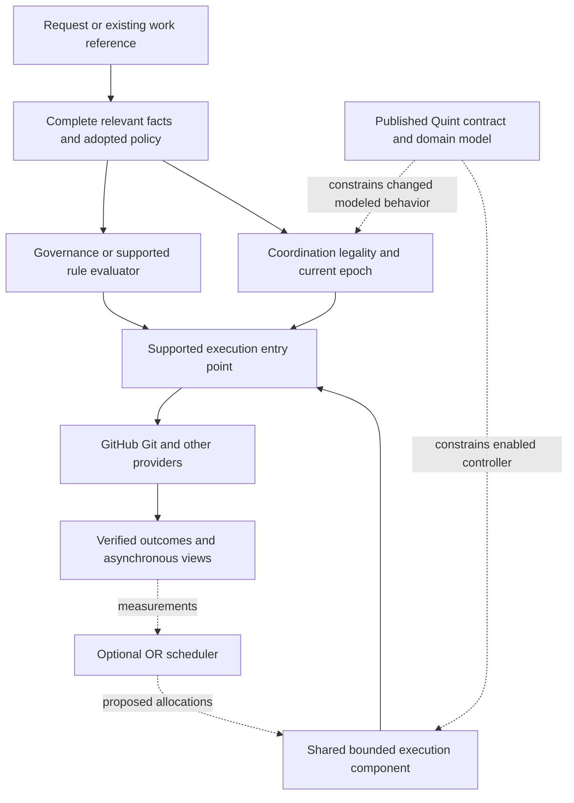
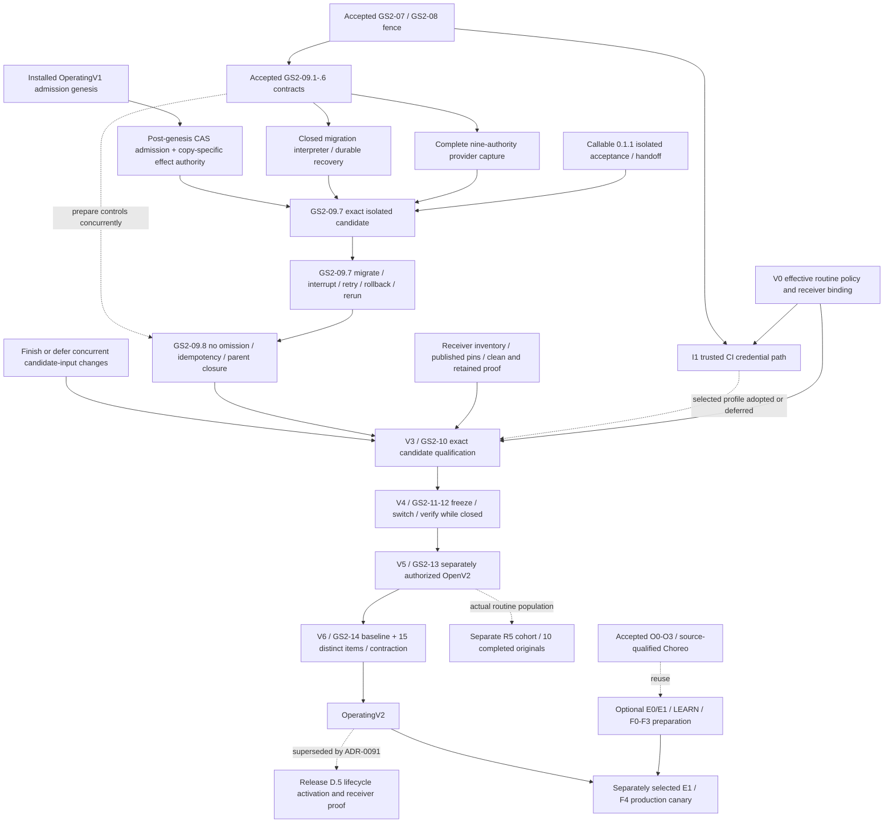

# FS-GG Unified Development Roadmap

Short name: **Unified Roadmap**. In FS-GG development discussions, **“the roadmap”**, **“current roadmap”**
and **“compacted roadmap”** refer to this document unless another roadmap is explicitly named.

Authored: **2026-09-07 15:42:10 UTC**. Section 0 evidence reconciliation: **2026-09-30**.
Status: **active programme; `.github` C0–C2 and selected C3 ordinary-V2 adoptions, including Rendering, are complete**.

**Start from completed development simplification and the existing v2 implementation. Keep the proven
`.github` settlement active, then add explicitly selected repositories through checked source, dedicated
credential custody, separate activation and observed ordinary use.** This document specifies
which development process applies to each kind of work, where its behavior belongs, what evidence is
needed, and how the programmes join.

This is the consolidated plan for the current tracks in the
[development master](development-master.md): v2, development simplification carryover, OR orchestration,
PB performance-bounded flow, and governance integration. It incorporates their relevant dependencies and
preserves later portfolio options. It does not restart simplification, completed v2 units, or old kernel
programmes. The broader inventory is accounted for in section 15 without making every proposal a current
implementation commitment.

Publication of this prose does not adopt a policy, change a GS2 unit, enable a writer, alter a lifecycle
default, or authorize an administrative operation. Existing accepted contracts, exact roadmap pins and
operating authority remain binding. The stage labels below are planning joins, not a second executable
queue. Implementation uses the existing owning units after any necessary versioned amendment.

[ADR-0091](adr/0091-speed-first-clean-v2-start.md) is the accepted owner amendment for the active V2
route. It prospectively supersedes ADR-0090 and the GS2-09 through GS2-14 migration sequence for this
clean start. Earlier accepted evidence remains historical evidence; unfinished migration, archive,
rollback and mandatory V1-admission work is cancelled or superseded, not completed.

For the operating model, start with [process selection](#4-which-development-process-applies-and-where).
For sequencing, use the [unified roadmap](#9-unified-roadmap-from-the-current-v2-frontier) and
[GS2 integration map](#10-exact-gs2-integration-and-contract-change-boundaries). Sections 1–2 establish
the evidence; sections 14–15 account for every active source track and the wider proposal inventory.
For Astra's planning boundaries and the available subroadmaps, use the
[feature-part index](#98-feature-parts-and-subroadmap-index). For when progress reaches a newly created
workspace, use the [workspace impact map](#99-when-new-workspaces-change).
For the client orchestrator that connects to a project master and receives jobs, see
[cooperative orchestrators](#85-cooperative-orchestrators-a-project-master-assigns-jobs-to-contributor-clients)
and their [F0–F5 roadmap](#97-f0f5-cooperative-orchestrator-development).
For stable execution policies, context/token optimization and evidence-based improvement, use
[LEARN-01](roadmaps/2026-09-12-095059-stable-policy-orchestration-and-statistical-learning.md).
Its later community milestone includes opt-in data contribution through an isolated Main intake and
reviewed public aggregate releases on GitHub.

## 0. Current progress report

**2026-10-01: V2 platform FULL ACCEPTED for the selected clean-start profile; independent products and extensions remain open.**
The accepted platform boundary is ordinary source delivery and ordinary settlement across the nine
named adopted receivers, truthful observer-loss behavior and the bounded fixed-job HOST diagnostic. The
[five-gate report](reports/2026-09-29-r5-functional-v2-acceptance.md), protected
[#3966](https://github.com/FS-GG/.github/pull/3966) delivery and its actual settlement/replay receipt
establish this bounded acceptance. Historical economics remains insufficient, with no efficiency
claim. BAR 0/6 useful-play cases, SC2 and FourD product journeys, HOST `.8`/`.9`/`.10` native
capture/restart/Main retirement, LEARN installed experiments and new capability profiles remain
independent and open. This dated clarification is not a current fleet-health attestation, universal
profile acceptance or waiver of exact artifact, authentication, custody, settlement/replay or effect
authority for any operation actually performed.

**2026-10-02: LEARN W6 C2 P2-A provisional Host 0.3.0 successor source prepared; publication and receiver adoption remain open.**
The [owning plan](roadmaps/learn-c2-persistent-receiver-v3.md#p2-a--provisional-host-successor-source)
selects coherent source version `0.3.0`, tag `telemetry-host/v0.3.0` and journal
`utel-host-rel-09`. Candidate, artifact, admission and publisher selectors agree; the existing
stateful publisher and default preflight remain unchanged. Focused successor, execution,
journal and release controls, including real-adapter old-candidate and source/manifest negatives,
passed. Protected native qualification remains required. Availability and served publication are
unverified; registry published fields and immutable 0.2.1 bytes remain unchanged. A separate
Coordination manager archive and inactive v3 image/runtime qualification precede real receiver
grant, capture and recovery. No workspace default, experiment or C3 activation changes.

**2026-10-02: LEARN W6 C2 P1 inactive persistent-v3 preparation CLOSED; installed qualification remains open.**
The [owning P1/P2 plan](roadmaps/learn-c2-persistent-receiver-v3.md) supplies a stateless F#
constructor and CLI with closed, duplicate-safe inputs and exclusive mode-0600 materialization.
All ten production/test blobs match independently qualified `243a1ce08c69a2669334454bcfe2593d501b8741`.
The existing Host job acquires exact public Coordination
`e6f6631a2166f9d73639b1cbb96953ee3a768530`, tree
`9059c91396cc2963d15037867cde9a5a3cf1c9ba`, builds locked manager and preparation inputs,
executes the constructor console and requires both executable identities for the joined actual
preparation → manager → Host tests. The exact added shell passed locally with 27 constructor
controls and both Host cases; actionlint, compiled workflow inspection and shell parsing passed.
[PR #4084](https://github.com/FS-GG/.github/pull/4084) merged at
`d9a142de6b0b615604b02779d5eae963010acc15`, tree
`34ecbaf027646f0454f5ce7f1d30aac61c0f8cf0`, equal qualified source
`1898c28ee98b8f4c0146eb011a022cb5c460f02a`. Root authenticated merge, tree and main, then
the exact protected [Host package run](https://github.com/FS-GG/.github/actions/runs/36953495898)
passed. The F# console executes through a thin shell entry; existing Python selector semantics and
fixtures remain unchanged. P1 is Closed. Its declarations remain inactive; publication, real grants, installed runtime/image closure,
private custody, capture/recovery and activation remain open. Published Host 0.2.1 remains its
historical immutable release; P2 needs an unused successor or a qualified immutable distribution.
Main/work-main is not a destination or prerequisite; C3 remains disabled.

**2026-10-02: P4 closed typed result consumer source delivered; protected adoption and fresh facts remain open.**
[Sandbox #43](https://github.com/FS-GG/FS.GG.GitHub.Substrate.Sandbox/pull/43) merged at
`236ab5be1b869cf65f6908e62a814985239c55a4`, tree
`f22d96e8d19755d41958bd6ef86150ecf60fa29b`, equal qualified source
`7311b8a724d8a7169422f651d0cadba917414af5`. Root authenticated merge, tree and main.
The stateless F# consumer bounds input to 8 KiB, rejects duplicate or incorrectly typed fields,
and validates the historical result and current result `/2` against closed field sets. Nested
observed cleanup completion independently requires outer cleanup success, including writer false
or unavailable; unavailable observations retain truthful outer state. Twenty retained controls,
25 focused controls and nine independent causal cases passed against the compiled executable.
No hosted source PR gate is configured for this scope. Protected helper and runtime custody,
fresh source-bound inputs and manifest, and one new facts operation remain next. Canonical H2,
provider, sealer and HOST source remain unchanged; historical refusal remains unexplained.

**2026-10-02: FourD signal and settlement source delivered; fresh private operation remains open.**
[Coordination #922](https://github.com/FS-GG/FS.GG.Coordination/pull/922) merged at
`e6f6631a2166f9d73639b1cbb96953ee3a768530`, tree
`9059c91396cc2963d15037867cde9a5a3cf1c9ba`, equal qualified source
`0b746cc5dd76e1084f0fa82dead28afd16131181`. Root authenticated merge, tree and main.
Full native validation `36946721471`, including the final formal epoch, and bootstrap
passed. Nine reviewed source blobs preserve the accepted F# signal, cancellation,
monotonic time and terminal settlement fixes. Independent qualification exercised actual
compiled canonical correspondence and late-signal, retired-active and deadline controls.
A new packet compiled from this exact protected identity, caller and runtime joins,
and one freshly admitted private operation remain next. The historical refused receipt
and separate cleanup readback retain their original truth; this source merge opens no
private window and establishes no new custody, native acceptance or product completion.

**2026-10-02: P4 safe typed failure-observation source delivered; fresh facts and custody remain open.**
[Sandbox #42](https://github.com/FS-GG/FS.GG.GitHub.Substrate.Sandbox/pull/42) merged at
`1d9079c39302d026db8f658e204106d245e0c7c3`, tree
`1fc3be4fd7bb7e69cc33c8b65bb7e403a1f6248a`, equal qualified source
`0b08bad49449f5d080d5836d09aa8e347c342da2`. Root authenticated merge, tree and main.
A locked F# projector owns the closed operation, custody and cleanup observations;
the adapter carries bounded branch facts and a typed unavailable fallback prepared
before runtime masking. Late cleanup failures reproject honestly; malformed helper
output cannot escape finalization or signal restoration. The exact source passed
63 caller tests and independent seven-case causal qualification, including actual
compiled F# and disposable real crypto controls. No hosted source PR gate is configured
for this scope; hosted SDK/helper custody remains an operation gate. Exact result `/2`
consumer readiness, fresh source-bound inputs, manifest and admission, and one new
facts operation remain next. The historical admitted facts failure remains unexplained
with no sealed capsule; this source does not retrospectively diagnose it or justify
an identical rerun. Canonical H2, provider, sealer and HOST source remain unchanged.

**2026-10-02: SC2 malformed advisor-evidence transport source delivered; private adoption remains open.**
[SC2 #35](https://github.com/FS-GG/FS.GG.SC2.Client/pull/35) merged at
`57eadf00bb9e776664e00fe200bb4f2952f72829`, tree
`991ff12af5485203d94749150b29d3e547cdf1cc`, equal qualified source
`18bcfcb8b355ada3871158eeef172ed8af0bd265`. Root authenticated merge, tree and main;
full native verify `36947574223` and its actual product job passed. Four transport/test
paths preserve malformed post-baseline terminals for the compiled F# selector and mark
mismatched tagged primitive payloads invalid. Generated-selector Node controls and both
real focused Chromium callbacks passed. F# authority, canonical Quint, dependencies and
the existing event, byte and time bounds are unchanged. A fresh protected artifact packet
must bind these bytes before private successor adoption; its actual import-closure and
complete transfer-bound repairs, native advisor/replay and full cleanup remain open.

**2026-10-02: BAR complete runtime-closure source delivered; protected artifact adoption and gameplay remain open.**
[FSBar #17](https://github.com/FS-GG/FSBarV2/pull/17) merged at
`59ab6e446e23eb3a40cc6a1ce766b181ae0db032`, tree
`6606e535c4b63fea43e7ea810d0b2b25e8b72234`, equal qualified source
`89f8e6fc9cb60fb5eb46ff41bd63422131739c4d`. Root authenticated merge, tree and main.
The owning source gate passed 16 directed Quint cases, 500 sampled traces, seven generated
ITFs, locked Release compilation and actual F# correspondence; the helper passed 77 controls.
Independent review passed 13 focused helper cases plus causal omitted-root, selection-parent,
final-deadline and early-directory-overflow controls against the exact compiled helper.
F# binds the selected runtime census, product/provenance joins and same-child final closure
before consumption, and bounds scheduled traversal before enqueue. This repository has no
hosted source workflow for the scope; these are observed local source qualifications.
Rebuild from the exact protected merge, complete runtime/product receipts, OS custody or
explicit concurrency admission and private adoption remain next. Owner read-only mode is
a checkpoint, not OS immutability. Vanilla Recoil remains unchanged; Count1 is absent and
the six genuine gameplay journeys remain 0/6. V2 platform acceptance is unchanged.

**2026-10-02: FABLE protected diagnostic census completed with UNKNOWN; publication awaits a qualified capability.**
After the #664 source closure and immediate #4080 projection, one fresh read-only
[census](https://github.com/FS-GG/FS.GG.Templates/actions/runs/36947123836) ran against
protected `5326b896a5ded3ab86b929b99e4bea7eec967f03`, tree
`619b3ac86097ebf841ec67c2cdca0e1b82d12e69`, with unchanged read permissions.
Root verified attempt 1, terminal jobs and artifact `11203040036`; receipt SHA-256 is
`fb9596c090a31a7e361c6c5d9dd6e5072424ae4d9422c3d89af63620befd39d5`.
Metadata and active-version requests returned 200; deleted versions returned 403.
The new sanitized observation reports valid syntax with an unrecognized name and level,
one `other`/`other` alternative and no accepted permission sets. It establishes no write
alternative or grant. NuGet remains independently ABSENT; complete GitHub absence remains
UNKNOWN. The bounded diagnostic window is complete. Publication requires a separately
qualified capability and fresh complete absence evidence; no further speculative probe,
tag, pack or publication occurred in this window.

**2026-10-02: FABLE unrecognized-permission diagnostics source delivered; feed occupancy remains unknown.**
[Templates #664](https://github.com/FS-GG/FS.GG.Templates/pull/664) merged at
`5326b896a5ded3ab86b929b99e4bea7eec967f03`, tree
`619b3ac86097ebf841ec67c2cdca0e1b82d12e69`, equal qualified source
`dcfb817d116e5f71a649abb7540c20e7ac54bf91`. Root authenticated merge, tree and main;
all ten triggered native checks passed, with three expected skips, including composition.
The actual F# HTTP-to-receipt route passed 178 controls. Closed diagnostic name and level
buckets preserve complete AND/OR alternatives and refuse malformed or conflicting evidence;
they leave the accepted-permission parser, request permissions and occupancy verdict unchanged.
All 330 release, template and public receiver input blobs remain unchanged from the preceding
qualified scope. The previous read-only census remains UNKNOWN after deleted-package HTTP 403
and unrecognized permission evidence. One fresh protected read-only census and an evidence-based
capability decision remain next; publication and installed product adoption remain open.

**2026-10-02: SC2 typed failure-summary and Release task-loop source delivered; native advisor journeys remain open.**
[SC2 #34](https://github.com/FS-GG/FS.GG.SC2.Client/pull/34) merged at
`feb7ab0d9ed5afd698945c3c166778c8ce591216`, tree
`8269e4e6385f9b29b3084c8779dcf3c28ef840cc`, equal the qualified coherent source
`b92ea4096d53e251b0fac4d77c3654952057ed5d`. Root authenticated merge, tree and main;
full native verify `36942709339` passed. All nine qualified producer blobs were preserved exactly.
F# now validates received advisor projections and selects bounded causal terminal evidence;
the browser adapter transports the compiled result. Release-safe iterative task loops retain
production wait, cancellation, authority and nine-query bounds. SDK 10.0.400 Release solution
built with zero warnings/errors; compiled Gateway and Contracts controls, existing Quint/FsQuint
correspondence, generated Fable vectors and Vite passed. Real focused Chromium passed both the
corrected baseline-to-summary journey and multibyte bounded capture. Exact protected artifact
rebuild, private consumer succession and native advisor/replay/cleanup acceptance remain open;
the incomplete older protected artifact is retained and cannot evidence these new exports.

**2026-10-02: LEARN W6 C2 manager v3 native-verifier CI source delivered; installed runtime remains open.**
[Coordination #921](https://github.com/FS-GG/FS.GG.Coordination/pull/921) merged at
`aa05817cd3025ead9d574e772d5302be8cf4e2dc`, tree
`02913d7ac8e36d54f88756ee1fc69e04a5a35cce`, equal qualified source
`f38e94dd77f0d09e6a943632de4afa9b899b0525`. Root authenticated merge, tree and main;
all 45 native checks passed, with six expected skips, including complete coherent formal validation
and compiler-and-tests. The required compiled test route invokes the v3 native verifier with bounded
exact protected-module acquisition, retained seven legacy cases and fail-closed cleanup. Mechanical
orchestration moved to its test-owned script, leaving the unchanged architecture caps satisfied at
844/850 total control lines and 630/630 unique lines. The protected-origin reader is already delivered.
Manager publication, actual OCI/runtime acquisition, genuine collector grant, private installed custody,
capture/recovery and separate C3 activation remain open; source CI does not establish installed acceptance.

**2026-10-02: FABLE feed-census failure diagnostics source delivered; publication remains open.**
[Templates #663](https://github.com/FS-GG/FS.GG.Templates/pull/663) merged at
`aa6fd459ec6c0904167921561b66050baa5bcb31`, tree
`73d04773351d180a66c42350385802d04062d914`, equal qualified source
`6b8daffcffb5b2d6c1f8d728510b9e48029119a6`. Root authenticated merge, tree and main;
all 13 triggered native checks passed, with three expected skips. Actual F# diagnostics passed
148 controls, including preservation of AND terms and OR alternatives in sanitized accepted
permission evidence. The 330 unchanged release, template and public receiver input blobs retain
the preceding qualified Preview C scope; this PR changes failure classification and tests.
The prior read-only census remains UNKNOWN because deleted GitHub versions returned 403.
A fresh protected read-only census and its actual sanitized capability evidence are next;
dual-feed absence, immutable release, byte-identical publication and installed receiver adoption
remain open. Source delivery does not supply deleted-version access or publication acceptance.

**2026-10-02: HOST typed private workflow registration delivered; container adoption remains open.**
[Sandbox #40](https://github.com/FS-GG/FS.GG.GitHub.Substrate.Sandbox/pull/40) merged at
`3aabcb1605c3e23032fa961b917b92c8e238522f`, tree
`f1c65fccaad42d6e693007de50bd3e5218dd5836`, equal qualified source
`cb4635ab9b04826455825e8dbf6a5d55c8cf6ead`. Root authenticated merge, tree and main.
The private workflow now uses the exact qualified public HOST recipe `8ad0da67004d670c6803f34755dfe759a7fc84e7`,
SDK 10.0.401 and its compiled F# binding/process scope. Its existing 389-byte public-input
acquisition step remains byte-identical; exact template/profile/render equality, 14 consumer tests,
26 F# tests, actionlint and shell parsing passed. Sandbox has no hosted source-PR workflow.
The [Host release roadmap](roadmaps/utel-host-release-020.md) assigns pending adoption to the existing
container/CI route and labels uncompleted Main adoption steps superseded, retaining the completed
historical artifact handoff. No new Main action follows. Private producer/admission joins, genuine
attempt-o, capture/restart/recovery and dependency-free Main retirement remain open; private records,
the fifteen stopped containers, ordinary services, fdev, PostgreSQL and shared credentials remain preserved.

**2026-10-02: P4 authenticated run-context construction source delivered; facts remain unproved.**
[Sandbox #41](https://github.com/FS-GG/FS.GG.GitHub.Substrate.Sandbox/pull/41) merged at
`c44f8dc0e4f08425cf56639fb3a71c0476e10c60`, tree
`20f8c92354c38fbc5d5d7016f36e832b6bcfcc5a`. Root authenticated the predicted merge tree,
which preserves HOST #40 and the three qualified P4 paths from `c461ec1d5eab9d0dfdac2722567bd4cd761be290`.
Actual credential-free reservation `36938654501` attempt 1 failed before admission because the
nonexistent triggering-actor-ID context was empty. It produced no result or artifact; no provider
work or secret provisioning occurred. The replacement acquires a bounded authenticated exact-run
response and passes it to F# after removing token access. F# rejects duplicate members and malformed
or mismatched identities, derives independent numeric actor IDs, and emits the existing closed
context contract. All 24 focused controls passed, including actual F# and workflow execution;
hosted SDK 10.0.400 qualification remains pending. The original eleven producer inputs and protected
v2 manifest helper are unchanged. Source-bound staging manifest replacement, fresh reservation,
exact-attempt admission, sealed facts, separate grant and native qualification remain open.

**2026-10-02: LEARN W6 C2 protected-origin reader and bound native verifier source integrated; production runtime qualification remains open.**
The installed-origin reader now joins prospective v3 manager/source-reference contracts to retained capture
and snapshot bytes and the unchanged canonical native verifier. New F# custody and process code binds the
verifier module and runtime inventory, uses closed arguments/environment, bounded output and timeout,
and compares actual canonical verification with the retained result. Installation queries apply exact
selectors before ambiguity checks; one clock governs independent profile and evidence expiry.
Producer ordering is `started <= observed <= completed <= now`; independent review reproduced the former
unequal-time refusal and verified its repair through the actual constructor/store/read path.
The five focused Core/CLI/Host checks passed; the final temporal review independently passed two Host
checks and causal freshness probes. Manager-emitted sidecar loading passed with exact frozen bytes.
This is source integration only: the manager producer's protected delivery, actual immutable OCI/runtime
closure, package/deployment pins, private installation/grant, C3 default-disabled composition and installed
qualification remain open. Synthetic runtime inventories and local producer fixtures do not establish
production image identity, snapshot origin or complete cost coverage. The canonical verifier is unchanged;
selected V2 platform acceptance remains complete.

**2026-10-01: P4 manifest-v2 private receiver source delivered; genuine runtime qualification remains open.**
[Sandbox PR #39](https://github.com/FS-GG/FS.GG.GitHub.Substrate.Sandbox/pull/39) merged on protected main
as `ae4d216d2818f2b4dcaa5136a15e2debab9abfed`, tree
`c32d43490b5cec4b5100100ffbc66a55baadeada`, equal to qualified `6c9fa72`.
The receiver separately authenticates protected H2 `f794d1a`, tree `c76d7df`, and F# manifest helper
`cbc558054805dac0e305e842e845a2803106113694ac82f991ce8a3e2a67c922` while retaining original
producer `b06c187` and its eleven role bodies. Eighteen focused helper/custody/process/settlement,
closed-result, workflow and source-boundary controls passed. There is no hosted source PR workflow in
this Sandbox; hosted SDK 10.0.400 custody and actual private execution are not inferred from local tests.
The owning `.github` template/registry join, protected placement, authenticated twelve-asset manifest
census, genuine facts/grant and native qualification remain open. No private upload, operation,
publication or installed adoption is claimed. Selected V2 platform acceptance remains complete.

**2026-10-01: FABLE-ADOPT-01.3 reference composition qualification and read-only feed census source delivered; publication remains open.**
[Templates PR #662](https://github.com/FS-GG/FS.GG.Templates/pull/662) merged on protected main as
`40a1bfd992a4d040181af3e196a26afa07be6d62`, tree
`599b5b0e60ac05e57c050b986980dbf0232599c8`, equal to qualified source tree `43687b0`.
All fourteen required native checks passed, including the full Preview C browser gate
[run `36928364765`](https://github.com/FS-GG/FS.GG.Templates/actions/runs/36928364765).
The existing D.5 and Preview C source gates now validate actual candidate archives and producer source.
The reviewed F# feed census enforces strict candidate syntax, bounded complete responses and cancellation;
its 102 focused checks include trailing-newline and late-body refusal. Its separately selected
`feed-occupancy` operation has read-only permissions and skips packaging and publication jobs.
This closes source qualification only. A fresh successful census of both feeds, immutable release tag,
pack-once byte-identical dual-feed publication and installed direct/provider/wizard browser proof remain
required before consumer adoption. No feed absence, publication, installed adoption or product-native
acceptance is inferred from the source merge; selected V2 platform acceptance remains complete.

**2026-10-01: OPS-TYPED-01.5 HOST binding source integrated; native adoption remains open.**
The [typed HOST constructor](../deployment/telemetry-collector/host-binding/README.md)
and its existing qualification adapter now join the private workflow and owning package CI.
F# owns source/profile construction, digest checks and bounded process ownership in the dedicated
exclusive CLI scope. Kernel pidfd capability is checked before child creation; identity uncertainty
remains sticky and cleanup targets only owned descendants. The accepted source and workflow
preflight exercised 26 F# tests and 38 Python tests without skips, with pinned SDK 10.0.401,
full managed/runtime dependency checks, workflow parsing and shell validation.
The four native payloads remain byte-identical. This is source delivery; protected artifact adoption,
Sandbox profile and private producer joins, actual authentication and native attempt-o qualification
remain open. The existing release is not relabeled as a new artifact or native acceptance.

**2026-10-01: P4 v2 manifest helper source delivered; private receiver qualification remains open.**
[Coordination #919](https://github.com/FS-GG/FS.GG.Coordination/pull/919) merged at
`f794d1ae14cfd41db1878ce9c362d3518dbe52c0`, tree
`c76d7dfc564aabf597b42b6fd83bbfaaf0bcb7a3`, equal qualified source
`cac39fcd491aee0d1d986081b8e58ca36f569943`.
[Full validation 36925162784](https://github.com/FS-GG/FS.GG.Coordination/actions/runs/36925162784),
[bootstrap 36925162969](https://github.com/FS-GG/FS.GG.Coordination/actions/runs/36925162969)
and the [owning provider gate 36925162927](https://github.com/FS-GG/FS.GG.Coordination/actions/runs/36925162927)
passed. The F# helper constructs and validates the versioned manifest without embedding its own
not-yet-assigned server asset ID; acquired receipts and run admission retain the external ID and digest
join. The owning workflow executes the real transport fixture under the pinned SDK. Its changed
workflow digest is recorded in the existing immutable execution inventory, with that gate preserved.
This closes the H2 source window. Sandbox S2 protected helper/runtime pins, canonical private upload,
actual twelve-asset census, facts, grant, native qualification, publication and receiver adoption remain
open. The original producer's eleven genuine roles and published 0.2.0 artifacts remain retained;
this source delivery establishes no new private upload, grant or native acceptance.

**2026-10-02: LEARN W6 C1 durable learning-owner queries delivered; installed composition remains open.**
[Coordination PR #920](https://github.com/FS-GG/FS.GG.Coordination/pull/920) merged on protected main
as `f243b6a2d16d7e504e6a1cb62cecb9ef98996c2d`, tree
`efdd0ff685d8bd737552a9d40fd62eeb04707ce4`, equal to qualified `9bacd83`.
The full [bootstrap gate](https://github.com/FS-GG/FS.GG.Coordination/actions/runs/36930690234)
and [coherent optimistic validation](https://github.com/FS-GG/FS.GG.Coordination/actions/runs/36930690256)
passed. The F# PostgreSQL owner projection binds persisted assignment/attempt/generation and treatment
identity, includes durable revision and exact retained bytes in dispatch identity, and bounds individual
and aggregate payloads before decoding. Disposable PostgreSQL key/revision/restart and corruption controls
passed; twelve query-shape bounds were independently checked. Existing canonical C3 state authority is
unchanged. This closes source delivery only: installed composition, genuine grant/enrollment and complete
observation/cost coverage remain open; selected V2 platform acceptance remains complete.

**2026-10-01: LEARN executable custody reader source delivered; installed qualification remains open.**
[Coordination #918](https://github.com/FS-GG/FS.GG.Coordination/pull/918) merged at
`4be1226aedbd6115fc228c3828e4956a7db4e96f`, tree
`aee27f2994f6d42aa31849be743b8907e461f5ed`, equal reviewed integration
`aad596bb8ce44542268762eb742e82c46fb35272`.
[Full validation 36916334732](https://github.com/FS-GG/FS.GG.Coordination/actions/runs/36916334732)
and [bootstrap 36916334860](https://github.com/FS-GG/FS.GG.Coordination/actions/runs/36916334860)
passed. The F# reader hashes the actual 286,594,376-byte executable through a bounded held descriptor,
with a 512 MiB ceiling and 1 MiB buffer. Executable custody joins containing-filesystem identity,
size, mode, owner, link count, modification time and change time before and after streaming;
causal mutation, restored modification time and missing identity-mask controls refuse without a
producer receipt. Small JSON bounds remain separate. This closes the reader source window;
replacement-container runtime closure, genuine grants and enrollment, W6 production producers,
installed capability and persistent capture/restart qualification remain open. Main has no action.

**2026-10-01: FourD typed qualification source delivered; protected operation remains open.**
[Coordination PR #917](https://github.com/FS-GG/FS.GG.Coordination/pull/917) merged at
`2f8437ccbf25606ea9cd567b02924309e3a45fde`, tree
`75dc590c42fef693bcea3c006e35ddfa14596d1f`, equal to reviewed repair
`fa776bd8fee2c5038b746e2b26c3d9274797c7bc`.
[Full validation 36908992547](https://github.com/FS-GG/FS.GG.Coordination/actions/runs/36908992547)
and [bootstrap 36908992422](https://github.com/FS-GG/FS.GG.Coordination/actions/runs/36908992422)
passed. F# owns qualification policy and generates the canonical ephemeral Quint model;
five actual ITF witnesses exercise the production reducer. The repair preserves historical model
bytes and the required architecture gate. Failed native cleanup remains an observed resource
obligation until cleanup succeeds. Protected SDK provisioning and the compiled policy binding are
source delivered. Fresh capacity, reservation, encrypted source transport, artifact adoption and
native qualification remain open; this source merge establishes no new native acceptance.

**2026-10-01: OPS-TYPED-01.5 SC2 advisor diagnostic source delivered.**
[SC2 #33](https://github.com/FS-GG/FS.GG.SC2.Client/pull/33) merged at
`039feddc07c3c0d47802485dd51c85f3d0a9d54c`; root authenticated tree
`80d72afdfdc7db86857e4484d729175cafd5ee0f`, equal reviewed joined head
`bdca1e55f994bcf73889f8575dcf889a7c1ac6ea`.
[Hosted verification 36908772155](https://github.com/FS-GG/FS.GG.SC2.Client/actions/runs/36908772155)
passed. F# owns full advisor/input identity and terminal classification; the browser retains the
actual obligation state, and the qualification driver requires a matching completed process record.
Five fresh Quint ITF traces matched 21 actual reducer/window transitions; all 25 semantic mutations
with correctly recomputed fingerprints diverged. The production compile entry and coherent gate
now execute that harness and the compiled browser bridge fixture. This is finite source correspondence,
not native acceptance. Historical attempt-n remains Unknown; protected artifact rebuilding, private
failure-summary adoption, actual advisor processing and replay qualification remain open.

**2026-10-01: OPS-TYPED-01.4 BAR runtime-evidence source delivered; native acceptance remains 0/6.**
[FSBarV2 #16](https://github.com/FS-GG/FSBarV2/pull/16) merged at
`2cd9f47dd120d43b6781b6edc7dbb1d571cc51a1`, tree
`4fee295bf14f6b2fe2369085c1e743610709297e`, equal qualified integration
`c709d1aaa8a66452ebd42a395072866e871918c1`.
The qualification-local F# data-root policy and growing-prefix reducer join the existing full solution.
Its owning gate executed 14 Quint scenarios, 500 samples of 16 steps, six regenerated ITF traces,
actual production-reducer/FsQuint correspondence and a locked Release build. The full solution
built with zero warnings or errors; existing live preparation checks passed. The gate records all
five managed executable files. No hosted PR workflow applies, so no hosted pass is claimed.
Source qualification does not establish immutable artifact adoption, selected-runtime custody,
a configured private helper or native gameplay. Root must join those artifacts and a fresh pristine
packet before another actual operation. Count1 and all six useful-play journeys remain open.

**2026-10-01: FABLE-ADOPT-01.3 local reference composition source delivered.**
[Templates #661](https://github.com/FS-GG/FS.GG.Templates/pull/661) merged at
`1c90ac81278a8e7a98fe98aa7d01b8023a8f2278`; root authenticated tree
`e1a619ad37f87e851d57284d81ad62320a60db9a`, equal reviewed head
`4eb2cc3985be42840422ddb9cc2d72f214b17489`.
[Composition 36902928139](https://github.com/FS-GG/FS.GG.Templates/actions/runs/36902928139),
[typed receivers 36902928176](https://github.com/FS-GG/FS.GG.Templates/actions/runs/36902928176)
and the final [Release C qualification 36902928101](https://github.com/FS-GG/FS.GG.Templates/actions/runs/36902928101)
passed. The FourD-shaped local reference uses the existing shared Game/Rendering APIs,
four-coordinate semantic commands and explicit disposal; disposed controls are inert.
The atomic SVG adopter now handles the reviewed old/current wizard root forms and refuses
unsupported forms. This closes the selected reference source window, with no feed publication,
installed template adoption or product migration claimed. Coherent publication and clean installed
creation remain next; external-authority/WASM seam qualification and separate product parity remain
open in the [staged adoption plan](roadmaps/2026-10-01-staged-fable-game-adoption.md).

**2026-10-01: P4 private receiver source pins delivered; protected preparation and hosted staging verified.**
[Sandbox #38](https://github.com/FS-GG/FS.GG.GitHub.Substrate.Sandbox/pull/38) merged at
`5ef88866bd3d72aecf98ad097ef9ce9bdc88c4e8`; root authenticated tree
`ed15a0315a8dac71fbf26f144fbc76e96d5368fa`, equal reviewed head
`161b013138cb9c5f402e14b444526289da969144`. The existing private workflow and adapter now
bind protected Coordination `b06c18722b422213fe1c7cdd11cda1732605466f` and tree
`51df48a04b6cb7971233723945e6c743e3a65147`; 39 focused checks accept that join and refuse
predecessor manifest/admission identities. HOST paths are byte-identical; hosted validation is
not required in this repository. Final 0.2.1 [preparation 36895926751](https://github.com/FS-GG/FS.GG.Coordination/actions/runs/36895926751)
and public [staging 36902002387](https://github.com/FS-GG/FS.GG.Coordination/actions/runs/36902002387)
passed. Root authenticated their exact archives/artifacts and the compiled F# release verifier,
then verified the nine actual staged members and provider join byte for byte. Candidate facts,
private placement/environment/reservation, genuine grant, native qualification, publication and
receiver adoption remain open; local comparison previews are not provider authority. Original
0.2.0 artifacts, Main preservation and the accepted V2 boundary remain unchanged.

**2026-10-01: OPS-TYPED-01.2 SC2 preparation source delivered; diagnostic and native adoption remain open.**
[SC2 #32](https://github.com/FS-GG/FS.GG.SC2.Client/pull/32) merged at
`ee0469a2c1241d04a5e724517121e567ad5519f3`; root authenticated tree
`422812af17d06de7f5314d31a25826fcc5f25cd9`, equal reviewed head
`75c01bc5af273f5e7b82c1c00b0f2aa3ae233786`.
[Hosted verification 36896845198](https://github.com/FS-GG/FS.GG.SC2.Client/actions/runs/36896845198)
passed after generating the new Fable contract before its first clean fixture import. Typed preparation
joins acquired module/configuration/manifest and author evidence bytes, rejects duplicate/unknown
JSON fields and false module-size declarations, and preserves the existing canonical configuration codec.
Quint sampled runs and real FsQuint reducer correspondence passed; unknown cannot become success.
The selected private consumer remains unavailable until protected artifacts are rebuilt and rebound.
Genuine attempt-n established accepted pointer and keyboard native movement, then an advisor refusal
whose precise cause was not retained; advisor and replay acceptance remain open. The bounded .5 source
window now records full advisor/input terminal identity and supervisor observations in F# with a separate
Quint model. Missing process evidence may follow destruction after dispatch and does not prove no invocation.
The [typed plan](roadmaps/2026-10-01-typed-administrative-fsharp-quint.md) retains publication/adoption boundaries.

**2026-10-01: BAR typed-packet genuine attempt refused before browser; exact cause remains unknown.**
Reviewed packet config `bcbc2f231751f77c47208d41cbed4a03d104b7d4fff85068fc40b34071422a91`
ran 17:09:36–17:09:49 UTC and returned exit2. Host readiness and handoff materialization occurred;
host, engine and receiver were acquired, but the browser never started. The generic refusal did not
retain its precise guard or a live mapping snapshot. Later static infolog/data-root and closure checks
do not establish actual runtime-closure acceptance or the earlier cause. Cleanup settled all three
owned roles with zero members; root's exact PID/start and executable census also found zero. No test,
capture, release, normalized final read or Count1 proof exists; useful-play remains0/6. A pristine
successor and reviewed nonsecret exception-location observation precede another bounded operation.

**2026-10-01: P4 compile-cache convergence and semantic image policy source closed; final 0.2.1 preparation remains open.**
[Coordination #916](https://github.com/FS-GG/FS.GG.Coordination/pull/916) merged at
`b06c18722b422213fe1c7cdd11cda1732605466f`; root authenticated tree
`51df48a04b6cb7971233723945e6c743e3a65147`, equal reviewed head
`9aab31dea75010ee9d7a310c311a7441d880ab48`. Exact-head full coherent
[validation 36890459325](https://github.com/FS-GG/FS.GG.Coordination/actions/runs/36890459325)
and [bootstrap 36890459430](https://github.com/FS-GG/FS.GG.Coordination/actions/runs/36890459430)
passed. The repair disables generated Node compile cache only for the image's compiler invocation
and checks its absence in exported layers. Two independent cold hosted qualifications
[36886526452](https://github.com/FS-GG/FS.GG.Coordination/actions/runs/36886526452) and
[36886549027](https://github.com/FS-GG/FS.GG.Coordination/actions/runs/36886549027)
agreed on all 13 OCI payloads, semantic manifest
`40085dd0a7c3c16af6b24e247cec47707bc957d6453f7e15d82636fcbf6f0755`
and config `371d2b5db7c9708812ca8c3d752376e38aa81432a8bcbe7d99146414636dd872`.
Their raw archives retain different timestamps and mandatory per-run custody. The existing F#
policy now accepts this single observed semantic pair while retaining exact archive and receipt
bindings. All 27 W6 source paths remain unchanged. Final preparation from this protected producer,
staging, facts, grant, native qualification, publication and receiver adoption remain open.
Original 0.2.0 artifacts are preserved; no installed behavior or accepted V2 boundary changes.

**2026-10-01: OPS-TYPED-01.1 BAR qualification policy source delivered; native adoption remains open.**
[FSBarV2 #15](https://github.com/FS-GG/FSBarV2/pull/15) merged at
`5c4a39a0b656bd1e65503697334b01c0182e6a30`; root authenticated tree
`ebec7dde289eb1076ff10d61c2b01de51e6551e6`, equal reviewed head
`b969ab54c9cf5f72448bfc4d10af204e10814199`. The actual stock handoff validator now
calls a closed F# constructor compiled with pinned Fable 5.18.0. Its generated artifact binds
source, compiler, locks, runtime and output identity. .NET/Fable parity and 29 production tests
passed, including canonical Python member order, all 24 permutations and malformed-input refusal.
Effect-free Playwright discovery found the one selected Count1 test; this repository has no hosted
PR workflow. The prior genuine operation passed runtime closure and browser imports but falsely
refused a valid selection through JSON member ordering, before Count1 execution. Four owned roles
settled with current zero; no capture or final normalized read occurred. All six native journeys
remain 0/6. A source-bound successor packet and actual operation are separate adoption gates.
The accepted [typed administrative plan](roadmaps/2026-10-01-typed-administrative-fsharp-quint.md)
records independent SC2 and FourD F#/Quint source reviews, real reducer correspondence and the later
administrative owner migration. No generated workspace default or V2 acceptance boundary changes.

**2026-10-01: FABLE-ADOPT-01.1 inventory and finding disposition accepted at source; adoption remains planned.**
The owning [staged adoption plan](roadmaps/2026-10-01-staged-fable-game-adoption.md) now records
its [current inventory and disposition](roadmaps/evidence/fable-adopt-01.1-inventory-disposition-20261001.md),
with a sanitized machine inventory of six exact repository revisions and 26 selected source blobs.
Existing Rendering input, SVG and lifecycle capabilities are reused; Game.Render remains an optional
pure adapter. Product incidents are assigned to their actual owners, including BAR's reproduced
JSON member-order false refusal. The external-native-authority composition seam remains an explicit
unqualified gap. The selected next reference slice is one FourD-shaped projection and semantic command,
with actual package/import closure, focus/IME, coordinates, ordering and disposal conformance still pending.
Stages .2–.7 retain their producer repair, reference composition, publication, FourD pilot, parallel
SC2/BAR adoption and removal gates. The user-selected F# administrative contracts and Quint lifecycle
models proceed through separate operational ownership; no replacement or native qualification is
claimed by this inventory. Source versions do not establish package publication or installed state,
and this independent product track adds no gate to accepted V2 platform evidence.

**2026-10-01: W6 existing-authority composition source closed; installed operation remains open.**
[Coordination #915](https://github.com/FS-GG/FS.GG.Coordination/pull/915) merged at
`b457cab51496deb25ea99fabd0b700e367200c66`; root authenticated tree
`c9dda659b31aab15ae3b6e68d4bb85ddb3952b59`, equal reviewed head
`45f9debdfbf79f0113a20cc3b0a8f973963059f7`. Exact-head full coherent
[verification 36883275832](https://github.com/FS-GG/FS.GG.Coordination/actions/runs/36883275832)
and [bootstrap 36883275835](https://github.com/FS-GG/FS.GG.Coordination/actions/runs/36883275835)
passed. Source joins existing journal authority, typed installed-custody and retained native-delivery
readers with generation/cohort/WorkItem/window bindings and disabled-by-default Host composition.
Prospective admission precedes durable assignment, then rereads the exact unlaunched assignment
before intent; execution counters are required at their actual execution stage. Stale or future
authority timestamps refuse. The real PostgreSQL fixture repair passed eight local checks without
skips and the hosted bootstrap; production reservation validators remain unchanged. This is source
delivery only. Genuine installed-origin receipts and canonical native-delivery binding producers
remain unavailable, so absent capabilities still refuse. Installation, capture, recovery, enrollment,
W6 live acceptance and Main-independent deployment remain open; no Main action is selected.

**2026-10-01: HOST operation-profile pin repair source closed; attempt-n refused before native execution.**
[Private Sandbox #37](https://github.com/FS-GG/FS.GG.GitHub.Substrate.Sandbox/pull/37) merged at
`9b157bb400c85d07ac6bd6394c76982175ceedd9`; root authenticated tree
`a79a3896d6d0d2269f50c67436ddba8130d69ada`, equal reviewed candidate
`18b04d47c46249a664232d773294103f85a0ae9f`. The workflow now pins profile
`1ef6d54eb3f9572580407efe9f266f643645af3af17c33723c0aa8368e5f4f34`, required by the
unchanged protected public recipe `61d55d8807da02b702ca97467f703640d9a59662`.
Fourteen focused local tests passed, including actual PyYAML parsing, shell syntax and the joined
recipe/profile regression; no hosted PR workflow applies in this private repository. Genuine
[attempt-n 36884618279](https://github.com/FS-GG/FS.GG.GitHub.Substrate.Sandbox/actions/runs/36884618279)
refused effect admission because its predecessor profile differed. Authentication materialization
and native execution never started. Retained result and authenticated readback show cleanup and
secret retirement completed; root credential metadata remains exact. No result capsule exists.
Release `401047616` and both input assets remain unchanged; all earlier attempts remain history.
This closes the pin repair source only. A new exact-placement attempt must still establish `.8`
capture, persistence and recovery; `.9`, `.10`, LEARN and Main receive no acceptance or action.

**2026-10-01: HOST original-rollout-audit public input registration source closed; genuine qualification remains open.**
[Private Sandbox #36](https://github.com/FS-GG/FS.GG.GitHub.Substrate.Sandbox/pull/36) merged at
`5b381c3c1a732247cb80ad1370d37f7f0c4a650f`; root API readback confirmed tree
`5d5957e30548cd1783b090fed1357ac8a2df9ebc` equal to reviewed candidate
`09ad078bd50837280492e7cf4189080764a4bf7a`. Registration binds protected HOST source
`61d55d8807da02b702ca97467f703640d9a59662` to prerelease `401047616`, tag
`v2-host-private-inputs-20261001-original-audit`, and its exact two authenticated assets: manifest
`603434428` (1,874 bytes, SHA-256 `e89674314c2added76a5ef595677c1bd33654cec05f31206e463e625d9939ae2`)
and ZIP `603434427` (152,050,740 bytes, SHA-256
`f5f864c90de7419e462c37da84824b7cf54c402ea3747e67ceb25d2e3c1311c9`). Root rehashed the
downloaded bytes, and all 13 local source checks passed; this private repository has no applicable
hosted workflow. This closes registration source only. Genuine `.8` capture, replay, persistence and
recovery remain open; `.9`, `.10`, LEARN and Main receive no acceptance or action from this merge.

**2026-10-01: P4 stable-image and authenticated-custody source closed; genuine 0.2.1 convergence remains open.**
[Coordination #914](https://github.com/FS-GG/FS.GG.Coordination/pull/914) merged at
`3a02e1e2ea77d5ab1a94d1a3e2dee1004015a594`; root API readback confirmed tree
`c2bb62f5cc2c2942fcfdbec4be7fb4e4220a3291` equal to reviewed head
`6b9c71510d8b1d033d11d2205135fdb138cf21ec`. Full coherent
[verification 36873822598](https://github.com/FS-GG/FS.GG.Coordination/actions/runs/36873822598)
passed, together with bootstrap [run 36873822720](https://github.com/FS-GG/FS.GG.Coordination/actions/runs/36873822720)
and the provider, image and executor checks. Policy now fixes inner image
`e76e01afa06a325beb74f7f55c32ed13aebe140c82a37e17c67f2d3217da4c3e` and config
`b9390f800c77e35aa2d1d124f4b416142270a6f1063aa80543077275e0a52c53`, while each preparation
must still supply its authenticated run-specific archive and complete receipt hashes. The coherent
compiler identity is bound, and missing bootstrap subjects now refuse locally before external tool
download. This closes source only; the original 0.2.0 release remains immutable. Fresh coherent 0.2.1
P2 preparation, convergence readback, staging, facts, genuine qualification and adoption remain open.

**2026-10-01: comprehensive BAR development audit and its two immediate source corrections delivered; gameplay remains open.**
The requested Astra-high audit is retained in the private revisioned knowledge database and published
with [FSBar #13](https://github.com/FS-GG/FSBarV2/pull/13), merged at
`5bc309e2cbd5ae701b16b43d5f978742beee607d`, equal reviewed candidate
`393a43cde6950d7ba58ddf5c40072a91779882c4` tree `3f13b542d484d896a0029f4c725a7f701a9a4299`.
The [audit](https://github.com/FS-GG/FSBarV2/blob/5bc309e2cbd5ae701b16b43d5f978742beee607d/docs/roadmaps/evidence/barc-01.5-development-audit-20261001.md)
records actual failures, effective packaging repairs, fixture blind spots and concrete improvements.
FSBar now retains the same cloned usable factory/current product/distinct product/queue selection for
readiness and materialization; the reproduced two-factory counterexample and source-mutation check pass.
Its owning repository has no hosted workflows; local Release build and focused source review passed.
[HighBar #14](https://github.com/FS-GG/HighBarV3/pull/14) merged at
`54e17084c35b90584f8f84efc468bcc8943e4ec0`, equal reviewed candidate
`886503ffce9e78a43a56654aa64a7ca028a6d03d` tree `5498369b7feea00bad13b0fc7d0e74c59532a89d`.
Full [CI 36872764414](https://github.com/FS-GG/HighBarV3/actions/runs/36872764414) passed for
its selected jobs; hosted C++ and native jobs were skipped, not native evidence. The local stock plugin
build and three focused checks passed. Factory-only options0 preserve Count1 instead of stock SHIFT×5;
ordinary tactical Append32 and the non-stock branch are unchanged. Root independently read both merges
and trees. These are delivered default heads, not a claim of branch protection or installed defaults.
The full private audit was imported byte-identically; 14 knowledge documents, 82 versions and 53 topics
passed integrity, foreign-key and index-parity checks. Exact stock corpus coverage and subsequent source
readbacks are maintained separately. Scanner layout and AI metadata repairs enabled genuine queue
observations; three attempts still failed before browser start. The first cleanup remains historically
unknown; second and third cleanup separately settled. Immutable settings seeds, managed artifact binding,
precise readiness reasons and actual quantity evidence are the next joined gates. Count1 and all six
useful-play journeys remain unaccepted; stock Recoil stays selected and the custom experiment stays
optional and inactive. Artifact rebuild/rebind, native qualification and publication/adoption remain open.

**2026-10-01: LEARN persistent collector custody and recovery source closed; installed operation remains open.**
The optional six-file container foundation uses an independent private persistent root, normalized
mount boundaries, descriptor-held path custody and the actual Host configuration/adjacent installer
sidecar contract. Receipt identities hash the exact retained manager-produced bytes after closed semantic
validation; F# JSON field order is not mistaken for a provenance mismatch. A matching exclusive store
lock refuses live backup, while stopped recovery preserves configuration, credential files, installer
sidecar, retained evidence and sealed native source bytes. Restored operation remains inactive.
All 19 focused checks passed, including actual F# serializer output; independent bounded review accepted
the exact source. The unchanged TelemetryHost 0.2.1 publication is already complete at release 400202272.
This source merge proves no permanent placement, image digest, credential enrollment, installer readback,
provider capability, native capture, recovery qualification, operational W6 reader or experimental benefit.
Those genuine installation and acceptance gates remain open independently of V2 and Main.

**2026-10-01: HOST native 0.158.0 original-rollout audit source repaired; independent capture remains open.**
The coherent public source recognizes the closed native subagent activity shapes and audits the original
rollout instead of treating projected events as persistence authority. Exact parent and child identities,
turns, call IDs, fixed spawn/wait contract, matching communication and child/parent ACKs remain required.
The completed activity follows its paired started activity; actual native completion may emit the
completed activity before completion communication. A valid late post-parent completed activity remains
non-authoritative. Wrong, duplicate, foreign and unmatched activity refuses. Empty wait states do not
prove terminal completion. Descriptor custody and writer health preserve unknown outcomes on missing
or contradictory evidence. Native 0.158.0 has no per-call durable persistence receipt, so arbitrary silent
producer write loss remains UNKNOWN rather than an exhaustive durability guarantee.
Final source verification passed 103 focused operation/image/private/topology checks with no skips;
independent bounded review accepted the eight-file source. This is source closure only. A new immutable
public-only input release and exact private pin registration precede a fresh bounded native attempt.
The failed attempt-m and all earlier evidence remain unchanged. Genuine capture, restart/recovery,
Main routing removal, installed LEARN capability and measured benefit remain open.

**2026-10-01: SC2 fresh input correlation and heartbeat ordering source closed; genuine gameplay remains open.**
[SC2 #31](https://github.com/FS-GG/FS.GG.SC2.Client/pull/31) merged at
`e1f3fe8cdaca33a2c2e29c1aca6091b5f0a2633e`, equal reviewed candidate
`ff47c0bb31918af5b211df121b2bf6716bc22137` tree `79ff99d0644cb7accab85dfb9b16924df2b32973`.
Actual full [verify 36864879054](https://github.com/FS-GG/FS.GG.SC2.Client/actions/runs/36864879054)
passed; root independently read both trees. Controller actions now require accepted module input,
matching decoded native outcome and a distinct command ID before Step. The actual compiled product
rejects a stale unsent decision without issuing Action. Advisor selection requires a new physical
pointer input joined to the initialized advisor identity, frame and input sequence.
The first hosted gate exposed renewal before Arm and reuse of its prior grant. Renewal now waits
for accepted Arm and its matching fresh authority projection; the final regression observes an
accepted post-Arm renewal. The repair build passed 78 browser tests; the final assertion descendant
passed its focused regression and the full hosted gate. Protected artifact rebuilding, a new immutable
private runner binding and a fresh genuine gameplay operation follow this source closure. Earlier
failed windows remain retained; movement, recording, replay, publication and installed acceptance
are not established by source checks.

**2026-10-01: FourD admitted private-source and encrypted-custody qualification source closed; genuine qualification remains open.**
[Coordination #913](https://github.com/FS-GG/FS.GG.Coordination/pull/913) merged at
`47d0833d88cbeaea9d38a7e927c837974c80352d`, equal reviewed candidate
`ae67e2dd7d47ebb70d5b15d45ceee5b144782600` tree `ca012ff34d4ba0c55d14b125f57b2117ee0d3142`.
Full [optimistic validation 36858877130](https://github.com/FS-GG/FS.GG.Coordination/actions/runs/36858877130),
bootstrap and CodeQL passed. Root independently verified equal merged trees. The coherent route
binds actual server/checkout identities, exact attempt-scoped admission, read-only acquisition,
unchanged T2/P2 qualification, descriptor-owned private custody, and verified sealed-only upload.
Focused qualification/custody/capacity checks passed 57/57; the unchanged execution-pin validator
passed 20 controls. Unknown adopted descendants remain sticky unknown and never signalable; cleanup
and stream draining fit the total deadline. Exclusive descriptor leases protect preexisting and
replacement paths, and wipe held plaintext before deleting only owned staging.
This closes source only. No key, private source acquisition, SDK/native operation, capsule upload,
root archive readback, credential revocation, provider qualification or installed adoption is proved.
Reservation and exact later admission precede a genuine operation; capability refusal still skips
SDK/build/P2. The already accepted FourD design documentation remains independent of this gate.

**2026-10-01: portable runtime and staging source closed; real successor preparation remains open.**
[Coordination #912](https://github.com/FS-GG/FS.GG.Coordination/pull/912) merged at
`0dd4aa26aca6697f1cc3cece762a4ecae60b5b81`, equal reviewed candidate
`6d014ae3dd725846db2eed11d51ff6d2ef527474` tree
`05c40eb2a61fa3705896e5699cbcfe43dfec066f`. All four applicable hosted checks passed,
including full [optimistic validation 36852977689](https://github.com/FS-GG/FS.GG.Coordination/actions/runs/36852977689),
bootstrap validation and provider source contracts. Root independently verified the merged tree.
The runtime allows the real .NET archive within a 128 MiB aggregate bound while retaining each
receiver's 64 MiB limit. Staging checks actual archive SHA-256 before extraction or effects, and
cleanup owns only a directory whose exclusive creation succeeded. The derived workflow execution
pin was corrected without weakening the security validator.
[Private Sandbox #35](https://github.com/FS-GG/FS.GG.GitHub.Substrate.Sandbox/pull/35) then merged
`9382e45bb7ba4988a1534008550988201b096a68`, equal reviewed candidate
`a153e51f088f223f7ee5df5fa298f3a86b69dd46` tree `8f1332d80fe0dd358d10b4a0169246bd847f2634`.
The adapter independently rehashes admitted roles and distinguishes protected helper H from the
genuine coherent 0.2.1 package/image producer P before account or provider effects. All 51 private
tests passed with real PyYAML and zero skips; no pull-request hosted workflow applies, honestly
not required. Root independently read the equal merged tree; all four HOST paths remain unchanged.
Actual [0.2.1 candidate preparation 36859533907](https://github.com/FS-GG/FS.GG.Coordination/actions/runs/36859533907)
succeeded on protected producer `0dd4aa26aca6697f1cc3cece762a4ecae60b5b81`, including fresh-load
packaged qualification and cleanup. Root downloaded artifact `11161341292` (186,619,619 bytes),
verified its API archive digest `42ed492f7d6638b7945015934595a9b4533fc6408669dd0c9ddc9838c05834aa`,
and retained the independently checked member inventory. The actual selected OCI digest
`e76e01afa06a325beb74f7f55c32ed13aebe140c82a37e17c67f2d3217da4c3e` differs from the fixed
provider policy `a994814516fa02d8ac537eed0bdade80db979ac22a415b9f55e73f931c2a7e0e`.
Staging and facts are not admitted: a reviewed coherent image/policy successor and fresh preparation
must repair that join. Successful preparation authorizes neither publication nor activation.
Candidate facts, admission, collector grant, native hello, publication and receiver adoption remain
open. Frozen 0.2.0 evidence and unproved installed adoption remain unchanged.

**2026-10-01: optional FourD programmable reactions and streamlined turns recorded as an unselected design consideration.**
The [player-facing proposal](roadmaps/2026-09-28-four-dimensional-skirmish-design-v2.md#design-consideration--programmable-reactions-and-streamlined-turns)
compares current-turn presentation, richer standing orders and a later simultaneous-order experiment.
It preserves Guard/Ambush/Hold, current timing and saves, `fourd-tactics-v1` as default, and the existing
V2 technical acceptance. No upload capability, rules selection, runtime profile, usability claim or
implementation authority follows from this draft; player evidence remains necessary for perceived
agency and reduced-drudgery claims. The companion [FourD #32](https://github.com/FS-GG/FS.GG.FourD/pull/32)
merged at `60f2a41eeaf22325b6af7a264791c79644c6fb6d`, equal candidate
`5e9817b0a6dd106d89336a84fd9a3816ea53983b` tree `713db27cb5a39e5896f7ddd82f222b26b6dbe984`;
full [verify 36857150748](https://github.com/FS-GG/FS.GG.FourD/actions/runs/36857150748)
passed. This closes the requested design documentation, with no implemented gameplay change.

**2026-10-01: SC2 advisor selection source closed; genuine recording and replay remain open.**
[SC2 #30](https://github.com/FS-GG/FS.GG.SC2.Client/pull/30) merged at owning main
`2c7afab6103db8ee363b0877454bb162b7eb7313`, equal reviewed candidate
`0f3c590fa4c77123b18b81578928336223458989` with tree
`8d6bcc41b05cf2c24b3acf6be165ca0747d75316`. Full hosted
[verification 36852249372](https://github.com/FS-GG/FS.GG.SC2.Client/actions/runs/36852249372)
passed, including all 69 browser tests. Root independently verified the merge and equal trees.
The advisor now uses the shared physical selection helper to find an exposed movable unit. The
hosted fixture repair prepares the real guest worker before its existing load; the 250 ms deadline
and no-retry behavior remain unchanged. Attempt-j's UI checks reported pointer and keyboard
movement before the occluded advisor click; that did not establish distinct native commands.
The subsequent protected attempt-k passed preflight, but its audit found only one successful native
Action for two Step/Observation cycles: the runner could reuse a prior result and continuing motion.
All 12 owned processes and the display were cleaned. Fresh command correlation and a regression
for stale pending input must precede another genuine recording/replay attempt. Source tests and
UI progress establish no native recording or replay acceptance.

**2026-10-01: stock BAR trace and harness source closed; genuine Count1 smoke remains open.**
[HighBarV3 #13](https://github.com/FS-GG/HighBarV3/pull/13) merged at owning master
`f08555372168cd911f438de0be5ec2898fd1cfb5`, equal candidate
`233b11f541986ee65e17062e2eed8548e795fd94` with tree
`8f287693d61ff7fcbdbd1e21482c70a09133e2fc`. Actual
[CI 36849458802](https://github.com/FS-GG/HighBarV3/actions/runs/36849458802) passed five
hosted jobs; five optional self-hosted jobs skipped, and the repository has no branch protection.
[FSBarV2 #12](https://github.com/FS-GG/FSBarV2/pull/12) merged at owning main
`6b9139e83334da903ea6861adb57d97578af2239`, equal candidate
`4608e56a6dfd973e4f5f28e37586a42ab8699576` with tree
`b951ac855c227bb938ba3bbf42e0418874ad4057`; it has no hosted workflow, so hosted checks
were honestly not required. Root independently read both merged trees equal to their reviewed
candidates. Final source/interface review is READY: actual `O_APPEND` custody passed, all 17 private
helper tests and 28 production codec/normalizer tests passed, and the authenticated growing-prefix
physical join retained the frozen prefix while allowing bounded append. Private helper manifest
SHA-256 is `e42dd46fa55fbe43f3f09011e65e397aabc017911cb1b73eebc4e1ff8b5dc758`.
This closes source and interface only. Genuine native acceptance remains 0/6, custom FR remains
inactive, and loaded-engine identity remains unknown. Next, rebuild and repin exact protected
artifacts, pass the bounded preflight and run one genuine Count1 smoke; that smoke is not six-journey
completion or gameplay acceptance.

**2026-10-01: HOST rejected-item diagnostic recipe and public-only inputs registered; runtime diagnosis remains open.**
[Private Sandbox #34](https://github.com/FS-GG/FS.GG.GitHub.Substrate.Sandbox/pull/34)
merged at protected `0dc8cc6b77db2c710ed202fe7c4023eb2ab42b26`, equal candidate
`f6f5d78cf013075e508cee65e678cdf15f0c48ae` with tree
`59012f5211ae9425f0722b48436b1539826d96ae`; root independently read API/tree equality.
All 13 PyYAML source tests passed without skips. Exact private rendering is 9,552 bytes, SHA-256
`a6714988f9c90e676b3f37017a83f2eb4023ee71b96bda83c7ac5d34435c9ce4`, after removing only
the fixed 389-byte acquisition wrapper. This private repository has no hosted workflow, so hosted
checks were not required. The registration binds public recipe
`59cb264ab7669587825e89c7974ff8ac621a4f88` and driver SHA-256
`c3b1f020dbfc74fe41ab5c80bb0c65ef834472205461be9ee5885bcf3494b5a4` to immutable private
public-only release `400857203`, tag `v2-host-private-inputs-20261001-rejected-item-diagnostic`,
target `afc547cd33531266faf9e18d9bceec77b203602e`. Root verified its exact two-asset set and API
digests: manifest asset `602993407` is 1,874 bytes, SHA-256
`b335afb6c2d900c55d96d6b203ecf070874ea47000093c921b2a1e5eb91dd470`; ZIP asset
`602993404` is 152,050,740 bytes, SHA-256
`b9ba30250a5ea477adc709e3a8e4caf6e210ff821e62a9c80fb382a4c4c9b68f`.
Only the native driver's pin changes among the 11 public members; native executable SHA-256
`167c0148a849d2444f1b5a7fb5f8bb2de1de5ae13a2a504b833fc765980f5cd9` and the other ten
members are preserved. The four HOST registration paths join without changing P4 or other private
paths. Genuine attempt-l still failed with rejected item type unknown. A separately bounded attempt-m
diagnostic is next; HOST `.8`, `.9`, `.10` and LEARN remain open. No Main action or authentication-guard
waiver follows from registration.

**2026-10-01: SC2 versioned recording-context source repaired; genuine completion remains open.**
[SC2 #29](https://github.com/FS-GG/FS.GG.SC2.Client/pull/29) merged at protected
`f1867d078da7f4db68729431a8f4479ee36e6d2d`, equal candidate
`0403b887e8cceef0d4918c8b733159691fd13ebf` with tree
`5a6bbb75025e97636e5618381c9924c6699c0fc1`; root independently verified merge-tree equality.
Full [verify 36842794937](https://github.com/FS-GG/FS.GG.SC2.Client/actions/runs/36842794937)
passed all 64 real hosted browser cases and the full Gateway suite; the candidate also passed the
same 64 browser cases locally. The source derives a versioned recording context from the real
bootstrap and projects identity, observation and offer atomically. Exact worker-fixture, readiness
and session-end handling is repaired while preserving the 250 ms deadline and no-retry boundary.
Actual genuine attempt-i still failed at recording context; all 13 owned processes and the display
socket cleaned with zero survivors. This source closure is not genuine runtime acceptance. Next,
rebuild exact protected `f1867d07`, pin a fresh private runner candidate and run a new bounded
attempt-j. Original movement, recording and replay acceptance under `.6` remains open; publication
and installed adoption remain open.

**2026-10-01: FourD public capacity screen passed; private qualification route remains unimplemented.**
Actual credential-free read-only [capacity screen 36842162867](https://github.com/FS-GG/FS.GG.Coordination/actions/runs/36842162867)
used protected Coordination `c14715d48fec86eb4e799640d4f8f2cec6be32a5`, tree
`a5759b54e3a1c978ae57e84a61d6f28a13a7c6d7`, attempt 1 and succeeded. Root downloaded
artifact `11151638544` (1,760 bytes), verified archive SHA-256
`ed5f3b8e328b32ae87a74e2db00c1b441c5c1a4e9aeebcc4fdf5c452696a0e19`, safely read its
single JSON result and verified result SHA-256
`97a9d66212e07ead348eafc80fd2d27c483c18fcfa5c61040ef144b0bc155d7e`.
The result reports `capacityScreenPassed=true` and `qualified=false`: effective headroom
15,246,069,760 bytes against required 7,516,192,768 bytes without swap credit; three known
ancestors had no finite limit; free storage was 92,353,101,824 bytes with 18,426,053 free
inodes. A Podman binary was present, but rootless capability was unmeasured and Podman was not
started. This closes only the public capacity screen. The bounded privacy/exact-admission,
private-acquisition and chunk-custody source route is not implemented; qualification
continues to refuse. No key, private source, image build/load, native runtime or player operation
was admitted.

[FourD #31](https://github.com/FS-GG/FS.GG.FourD/pull/31) separately merged at
`d5d8b6d242b13dd79007fcbbb6e5ee4069fd3264`, equal accepted documentation candidate
`38556655a52db97cd0c19a1c0c624153e2276606` with tree
`ae626190a30a784db8968157a1ef1c9c5c499770`; root independently verified merge-tree equality.
Full [verify 36841689908](https://github.com/FS-GG/FS.GG.FourD/actions/runs/36841689908)
passed. Its future geometric-presentation and evaluation window is documentation only: no renderer,
player evidence, rules default, native result, capacity result, publication or adoption changed.

**2026-10-01: HOST bounded rejected-item private diagnostic source accepted; runtime remains open.**
Accepted source `c62454a0e001eb323e4f008d459ff70b6caa3183`, tree
`bb4c1d6c8fa72b4ee63fbca71f81f37ddecb64f4`, adds bounded structural metadata only to the existing
private failure envelope when one of two rejected item-event branches is reached. The actual rejected
item type remains unknown. The four authoritative allowlisted types, generic refusal/exit 2,
success suppression and public failure projection are unchanged; no raw item, thread ID or unrestricted
discriminator is retained. Worker verification reported 112 tests; independent review passed 32
committed tests and ten focused boundary/privacy cases. This source acceptance grants no item or tool
permission. After coherent public source admission, an exact public-recipe and private-input driver-pin
update plus private registration are required before a new diagnostic runtime. HOST `.8`, `.9`, `.10`
and LEARN remain open; no qualification or native operation follows from this source join.

**2026-10-01: FourD credential-free public capacity-screen source delivered; measured screen is next.**
[Coordination #911](https://github.com/FS-GG/FS.GG.Coordination/pull/911) merged at
`c14715d48fec86eb4e799640d4f8f2cec6be32a5`, equal candidate
`2f9330be176f7106bc445528592380df612a2b9b` with tree
`a5759b54e3a1c978ae57e84a61d6f28a13a7c6d7`; root independently verified merge-tree equality.
Full formal and aggregate checks passed in
[optimistic 36837176343](https://github.com/FS-GG/FS.GG.Coordination/actions/runs/36837176343),
with [bootstrap 36837176254](https://github.com/FS-GG/FS.GG.Coordination/actions/runs/36837176254)
and [CodeQL 36837174651](https://github.com/FS-GG/FS.GG.Coordination/actions/runs/36837174651)
also successful. The source adds a credential-free, read-only public capacity screen. Its first actual
measured run follows this documentary projection. The screen is not qualification: `qualified=false`,
and no key access, private-source acquisition, native execution or player acceptance is established.
The existing FourD private-capacity refusals and later gated work remain unchanged.

**2026-10-01: coherent stock BAR producer delivered; original native journeys remain open.**
[HighBarV3 #12](https://github.com/FS-GG/HighBarV3/pull/12) merged at owning master `03de478075a588bcc93b8a9ca25cb05006a7355a`, equal reviewed coherent candidate `b2ed29534b08c2bc856922a951caaf93e2b1db65` tree `5f4c436a45e3acfe2ce3008735f88a025db7667c`; root independently read merge-tree equality. Actual [ci36838356388](https://github.com/FS-GG/HighBarV3/actions/runs/36838356388) passed all five hosted proto/arm/Python/shell/runbook jobs; five optional self-hosted jobs skipped because no runner was selected. No hosted engine-run acceptance is claimed. Initial workflow-active and Actions-enabled readbacks still produced no run; explicit repository Actions enablement followed by same-head PR reopening produced this actual run without source changes. Owning master has no branch protection.
The native/Lua/paired-contract blobs remain exact independently accepted c7/c147/4ff. Fresh plugin-only build against pristine Recoil2639 yielded SHA256 `d08be63906849bd9e83f758d80e42b78dec96c45f0dc889073cb57e9c7e0137a`,11,901,160bytes, with49native tests; deterministic production observer overlayr3 yielded `c7d6b583a954e7c2b0fdbb9c697355aaf1d2a1cd24049c3d30b9e01dfdd99d4c`,5,019bytes, with14Lua tests and actual stockLua5.1FLOAT ABI vectors. Actual CallRules reader is synced; stock Append uses shift32. The loaded engine, plugin/content discovery, genuine trace custody and original six native journeys remain unaccepted. Next source window prepares a real bounded queue trace, stock-ready selected smoke harness and private supervisor; no official engine executable rebuild, installed default change or source-only gameplay success. Optional customFR remains inactive OPEN0/6.

**2026-10-01: P4 opt-in Python template source and private route registration delivered; native qualification remains open.**
[Templates #660](https://github.com/FS-GG/FS.GG.Templates/pull/660) merged at `cfe37f35a66e3494b211197a1c84de69f08bf87e`, equal candidate `77dac554c080c164a3e77aa22fa181375e2a6c7c` tree `006553d8a59b6fef729553ed6b3093d94471dd27`. Root independently read tree equality. All eight hosted workflows passed, including full [composition36836100579](https://github.com/FS-GG/FS.GG.Templates/actions/runs/36836100579), release and both SVG source gates. The source adds opt-in Python in prepared0.16.0, exact canonicalb184projection/provenance and required exclusions. Both SVG pack gates now acquire the same manifest-pinned public source when no checkout was supplied; the existing projector validates supplied bytes. Lifecycle/defaults and packaged canonical file meanings remain preserved. This source merge does not publish0.16.0 or activate installed adoption.
[Private Sandbox #33](https://github.com/FS-GG/FS.GG.GitHub.Substrate.Sandbox/pull/33) merged at `afc547cd33531266faf9e18d9bceec77b203602e`, equal candidate `1bc6e0b99b748f263b9ebaf9584a2facaee8f382` tree `fa0abd253fdd46f6c50fba1d4806c1872197bd84`; root independently verified equality. The four new files bind protected Coordination `0cdc751b2d6f9335df3d6fd9e8e6a2ac4da94a54`/tree `2fb4e2ef55ee63d70a2fb6e075fc89de56f1a728` to separate reservation, private facts and qualification phases. Production helper matches independently accepted139 byte-for-byte after normalizing only those two pin literals; all HOST files, existing sealer/key and public-input contracts remain exact. Root combined49source tests pass without skips; separately repeated13HOSTtests pass. Private hosted checks are absent and not claimed. Genuine exact-run admission, measured private provider facts, authentic grant/enrollment, native execute/deduplicate/recover, sealed custody and scoped cleanup remain required before0.2.1 publication/adoption. No environment, provider grant or native P4 effect is established by registration.

**2026-10-01: portable P4 provider source delivered; genuine provider qualification remains open.**
[Coordination #910](https://github.com/FS-GG/FS.GG.Coordination/pull/910) merged at `0cdc751b2d6f9335df3d6fd9e8e6a2ac4da94a54`, equal final candidate `242f192d8a001b94832ae96610b7fe8ad23ae9a5` tree `2fb4e2ef55ee63d70a2fb6e075fc89de56f1a728`; root independently read GitHub merge-tree equality. Full [optimistic36833108648](https://github.com/FS-GG/FS.GG.Coordination/actions/runs/36833108648), [image36833108515](https://github.com/FS-GG/FS.GG.Coordination/actions/runs/36833108515), [provider36833108547](https://github.com/FS-GG/FS.GG.Coordination/actions/runs/36833108547), [executor36833108722](https://github.com/FS-GG/FS.GG.Coordination/actions/runs/36833108722) and [bootstrap36833108546](https://github.com/FS-GG/FS.GG.Coordination/actions/runs/36833108546) passed.
The coherent source includes remotely reachable canonical Python fixture b184, installed candidate CLI/provider workflow, descendant settlement and late output-overflow refusal, and owning P3/P4 reconciliation. Public provider workflow retains source contracts and unauthorized candidate facts only. Same-PR image/executor oracle repair reproduced the exact Python3.14 bytecode for the pinned fixture while preserving strict six-output equality and frozen0.2.0 assets. Independent private adapter source review accepted49tests, including grant ownership, selected-principal access and final stop-before-delete/custody truth; its public source pins still await exact integration. Templates#660 opt-in0.16.0 source remains checking after the two SVG pack gates were repaired. Genuine exact-run reservation, private measured facts, separate provider admission/grant, native execute/deduplicate/recover,0.2.1 publication, receiver adoption and clean workspace acceptance remain open.

**2026-10-01: sealed native-start diagnostic private registration delivered; genuine HOST acceptance remains open.**
[Private Sandbox #32](https://github.com/FS-GG/FS.GG.GitHub.Substrate.Sandbox/pull/32) merged at `de5d4f2ff53dd2be6a2ba36636f3c76f2125e98c`, equal candidate `9793fe939613c194eca1b5209253c64d51ee5138` tree `2483d1a2509e20f6e8aa96037956d9d45b0df734`; root independently verified merge-tree equality. Both workflow references select public diagnostic recipe `bfc59193fc68393158a467d333429a2af2bcd5b0`. Root passed13PyYAML source tests without skips and exact protected template render equality:9,552bytes, SHA256 `4ca0ba7e84ab1df7f193f2fe848c974648fff2b32ac38593e3cf86d6aa591b6c`, removing only the unchanged389byte private acquisition step. Tools, public key, four input pins, release assets and credential custody are preserved. The private repository has no hosted PR checks; routine coherent validation reports not-required. Fresh genuine attempt-l follows this progress closure. Actual attempt-k remains an unclassified native-start exit2; capture/analyzer/restart/replay acceptance, `.8`, `.9`, `.10` and LEARN remain open. Main has no action.

**2026-10-01: stock BAR consumer and owning amendment delivered; native acceptance remains open.**
[FSBarV2 #11](https://github.com/FS-GG/FSBarV2/pull/11) merged at owning main `b787c37d20484eb66649fd9b1f98e28730492433`, equal source-accepted candidate `d31018018db5a9bf2e6351126f6363f9af41d7a7` tree `6cb8893dd69a08738daa5e51bcca9d067bb79f1c`; root independently verified GitHub merge-tree equality. Its current repository has no Actions workflows, required check contexts, rulesets or protected main. Routine delivery therefore reports hosted coherent validation not-required; no hosted pass is claimed.
The paired contract, protocol/vectors, browser projection and owning roadmap amendments preserve legacy full native tuple evidence while adding stock supported-fields scheme2. Stock whole-batch FactoryProduce Replace is explicitly unsupported; ordinary Append retains per-child results. Actual clean Release compilation and production native-to-browser scheme projection closed earlier source defects. The final oracle passes19tests and independent complete/interleaved broker/native/dispatch lifecycle and refusal counterexamples, including numeric float-bit rejection. Accepted Lua c147 and native plugin c7 remain local candidates awaiting their coherent HighBar join. Stock useful-play is the selected original product direction; stricter custom FR is optional inactive OPEN0/6. Final artifact discovery, actual official stock executable/loaded identity and all six original native journeys remain open; no engine executable rebuild, installed default change, package publication or gameplay acceptance is established by this source delivery.

**2026-10-01: SC2 movable-unit driver source delivered; genuine completion remains open.**
[SC2 #28](https://github.com/FS-GG/FS.GG.SC2.Client/pull/28) merged at `abcac0b37cd7ed23d171f15af10b7b5748de093b`, equal qualified candidate `29fe8d6a3fbcbbde480fe428c57522e185f18576` tree `90e60a38e72bba6347272c75463b0823ade5dc79`. Full hosted [verify36831043091](https://github.com/FS-GG/FS.GG.SC2.Client/actions/runs/36831043091) passed. Genuine attempt-h on predecessor c182 retained one successful Action followed by eight fresh paused Step/Observation pairs without visible movement. Its selected unit type was not retained. The source exposes the already-decoded type and selects the fixed Terran profile's movable SCV, retaining the same proven unit for the real keyboard Move. Maximum eight fresh Steps, same owned tag and visible movement remain required; compiled source fixtures do not establish genuine movement. All12owned processes and the display/socket cleaned. Fresh exact-source build and genuine qualification follow this closure; `.6`, publication and installed adoption remain open.

**2026-10-01: V2-HOST native-start private diagnostic source; genuine acceptance remains open.**
Actual private attempt-k [36829922167](https://github.com/FS-GG/FS.GG.GitHub.Substrate.Sandbox/actions/runs/36829922167) on placement `1762127c1f05e65264e0e57acc859563be0a0fca` and recipe `6d51c485539998d2bda693b2b525af46b6e49a67` passed effective topology inspection for native, receiver and egress, then failed `native-start` with Podman exit2 and139stderr bytes. Its original bytes were not retained; their hash and unclassified category cannot establish a cause. Cleanup, writer settlement, preservation and sealed custody succeeded. Root independently verified both temporary secrets absent and the original authentication inode, mtime, size and digest unchanged; authentication custody remains sealed.
This source adds one bounded encrypted-private `fsgg.telemetry.private-native-start-failure/1` record for required failed `native-start` only:1–4096 complete stderr bytes with count/digest validation. Public failure projection and all fixed argv/topology/capability/network/identity/resource/cleanup guards are unchanged. Source head `48988506a61bd34f446e229de08044082803c92c` and its two blobs are preserved by the documentary join;70focused tests pass without skips. No bytes or hypothesis are reconstructed for attempt-k. Exact private recipe registration and another genuine operation follow protected source readback; `.8`, `.9`, `.10` and LEARN remain open. Main has no action.

**V2-HOST capability recipe private registration delivered; fresh operation remains pending.**
[Private Sandbox #31](https://github.com/FS-GG/FS.GG.GitHub.Substrate.Sandbox/pull/31) merged at default-branch `1762127c1f05e65264e0e57acc859563be0a0fca`, equal qualified candidate `c5fa129a3ebf532c3f0c0f6e81eb3f0b614b6fc4` tree `9854d7452b88200777938e8b1216bbd477879ca9`.
Root independently passed all13PyYAML checks without skips and verified exact protected recipe `6d51c485539998d2bda693b2b525af46b6e49a67` rendering:9552bytes, SHA256 `d56b3f7f8a5cb28b7df1d18245f3d09c07a94d4569091c7b0e1bb488a85fef0c`, after removing only the existing acquisition step. Tools, key, four input pins, release assets, source template and credential custody are unchanged. This private repository has no hosted PR checks; the helper accurately reports coherent validation not-required, rather than claiming hosted passage. Genuine `.8` capture/restart/recovery follows another exact-source attempt; `.9`, `.10` and LEARN remain open. Main has no action.

**FourD private temporary-memory capability refuses; this route ends before full qualification.**
Credential-free capability-only [36826915975](https://github.com/FS-GG/FS.GG.FourD/actions/runs/36826915975) on exact `1316e6dce8600e1fa732659708e5cad98064875b` measured available headroom7,185,342,464bytes against unchanged requirement7,516,192,768bytes (5GiBscratch plus2GiBreserve). The isolated namespace,16MiBmount/write/child-visibility probe and mappedUID/GID32768cancellation passed; the full5GiBmount and runtime qualification were not admitted.
Root downloaded artifact11145925729,10169bytes and verified its full archive SHA256 `2fdb52641ac6b8b6be1c1c63779800966e5a2b05e5bb73f60949ad86721b8884`. Both mount restoration and scoped store cleanup passed; all six costly SDK/source/build/image/P2/acceptance steps skipped, preflightOnly=true and qualified=false. No floor reduction, full retry, unrelated cleanup or paid runner is selected. The bounded next proposal is a credential-free public capacity screen; its resources must be measured before separately gated private-source acquisition and unchanged native preflight. Full image/P2, installed operation and player-derived acceptance remain open.

**V2-HOST native capability metadata source repaired; genuine acceptance remains open.**
Genuine private attempt-j [36825105280](https://github.com/FS-GG/FS.GG.GitHub.Substrate.Sandbox/actions/runs/36825105280), on placement `48f5a00f20de69b1a7d85aa794c47ad7d45001d5` and recipe `88d65daa1a1262d563c2312698e4a5e57109a824`, failed before native-start with the closed reason `native-capability-fence-refused`.
Its sealed private diagnostic reports expanded CapDrop, explicit empty CapAdd, present-null OCI Effective/Bounding fields, privileged false and no-new-privileges true. These are configured OCI facts, not kernel observations.
This source change accepts the documented Podman4.9.3 null/empty zero-set representation only with both fields present, no added capabilities, explicit unprivileged state and bounded valid drop metadata; missing, malformed and contradictory fields refuse. Fixed drop-all/no-add construction and unrelated topology, resource, identity, environment, mount, namespace, authentication and cleanup guards are preserved.
The focused real inspector integration and 44 combined source tests pass with zero YAML skips. Root independently read both temporary secrets absent, cleanup/preservation complete and original authentication inode, mtime and hash unchanged; authentication custody stays sealed. Private recipe registration and another exact-source operation follow protected source readback. `.8`, `.9`, `.10`, LEARN enrollment and installed operation remain open; Main has no action.

**SC2 imported core-Wasm feedback source repaired; genuine completion remains open.**
[SC2 #27](https://github.com/FS-GG/FS.GG.SC2.Client/pull/27) merged at protected `c18211dcd635f42b7e33382269b5b58edcb5bfe8`, equal qualified candidate `8d62e5214a258bdee33a8916d17bd495a5cf3d81` tree `ce70b9e2922d8522624da547304bc70086378914`.
Full hosted [verify36825317575](https://github.com/FS-GG/FS.GG.SC2.Client/actions/runs/36825317575) passed, including actual browser execution.
Terminal/local feedback is retained for the next normal core-Wasm input instead of invoking an unsupported legacy feedback call. The admissible imported-controller regression observes actual shared ABI input/outcome bytes, enabled paused Step, a fresh frame and exact PreviousFeedback carriage.
The fixture verifier is self contained; actual clean-checkout build-guest passed with generated browser output absent before and after. Source and scripted-peer checks do not establish genuine game movement or Step completion. Root will derive fresh protected runner artifacts and perform a separately bounded genuine attempt after this closure; `.6`, publication and installed adoption remain open.

**FourD conditional private tmpfs source delivered; actual capability remains unproved.**
[FourD #30](https://github.com/FS-GG/FS.GG.FourD/pull/30) merged at protected `1316e6dce8600e1fa732659708e5cad98064875b`, equal qualified candidate `354b55fc4aef869b82385afa91c46d825c932423` tree `c251b7f6a69c4fd3b7f9b991a954966420c70470`.
Full [verify36825257155](https://github.com/FS-GG/FS.GG.FourD/actions/runs/36825257155) and [portable source preparation36825257129](https://github.com/FS-GG/FS.GG.FourD/actions/runs/36825257129) passed. A hosted-only UID fixture assumption was corrected without changing production mapping guards; 67 focused tests pass.
The source uses one finite rootless private mount owner for a 5GiB tmpfs, requires 2GiB actual memory headroom, bounds descendants/output/cancellation and verifies mount restoration plus persistent archive/store identity. Actual earlier free scratch3.88GiB remains below the unchanged5GiB floor; documented runner memory is not admission evidence.
Only `preflight_only=true` is selected next, before downloads/build/load/P2; its result cannot qualify. A measured refusal ends this route without a smaller floor, root-disk fallback, unrelated cleanup or paid-runner assumption. Full image/P2, installed operation and player-derived acceptance remain open.

**V2-HOST typed native-inspection private registration delivered; diagnostic operation is next.**
[Private substrate PR #30](https://github.com/FS-GG/FS.GG.GitHub.Substrate.Sandbox/pull/30)
merged at `48f5a00f20de69b1a7d85aa794c47ad7d45001d5`, tree
`0676ac9cf29dcecc8beae47e74b6fe887e284cb5`, independently equal to candidate
`2459e9da8ca7f76a2ccc941a570490e104bc6949`. Both workflow references bind protected
public diagnostic source `88d65daa1a1262d563c2312698e4a5e57109a824`. Root passed all
13 PyYAML source tests without skips and independently compared the protected template,
removing only the unchanged acquisition step: 9,552 bytes, SHA-256
`7464e7470dac8c2fe0a8addf577e64d336b06639445a8bcc183f24a9010c9599`.
The public template is byte unchanged; only embedded recipe identity changes its render.
Input release 400609820, both acquisition assets, four native input pins and public key
remain unchanged. This private repository has no hosted PR checks. This closes registration
source only; a fresh root-owned diagnostic operation follows this projection's protected
readback. Actual attempt-i remains refused after native inspection, before native start;
its failed guard remains unknown. `.8` capture/restart/recovery, `.9` routing removal,
`.10` retirement and installed LEARN enrollment remain open.

**V2-HOST native-inspection diagnostic source repaired; genuine acceptance remains open.**
Actual [attempt-i 36819013783](https://github.com/FS-GG/FS.GG.GitHub.Substrate.Sandbox/actions/runs/36819013783)
on private `443c203d` / public `5f79da7d` passed receiver and egress inspection/start,
then refused after successful native inspection, before native start or capture. Its retained
28 closed command records cannot identify the failed topology predicate. Root unsealed
only evidence, independently verified original authentication inode/mtime/size/hash unchanged,
and read back both temporary secrets absent. Cleanup and preservation completed.
The independently reviewed four-file source repair preserves every topology validator and
original Refusal object/code, retaining bounded typed native-inspection facts only in the
existing sealed private evidence namespace. Missing, null, malformed, empty and list
capability metadata remain distinct; OCI configuration facts are not live kernel evidence.
Root passed 14 network and 29 private qualification tests without skips. This is diagnostic
source delivery only. Exact private recipe registration and a fresh admitted diagnostic
operation are next; no capability hypothesis or genuine acceptance is inferred. Independent
`.8` capture/restart/recovery, `.9` routing removal, `.10` retirement and LEARN enrollment
remain open. Main receives no new dependency or operation.

**Rust/Go bounded native BIND owning record delivered; full installed adoption remains open.**
[Templates PR #659](https://github.com/FS-GG/FS.GG.Templates/pull/659) merged at
`255aa7ff8adf0fe3158735e8a67921803cafa87f` after full
[composition 36820467470](https://github.com/FS-GG/FS.GG.Templates/actions/runs/36820467470)
and required source checks. Root independently verified protected tree equality to qualified
candidate `6861db98d99e7af0f57a7220b9901b02a646e8a2`; both reviewed documentary blobs
were preserved across the join with the published producer receiver pin. The owning
[language route roadmap](https://github.com/FS-GG/FS.GG.Templates/blob/main/docs/roadmaps/v2-lang-language-routes.md)
now closes only Rust and Go hosted BIND, using actual native run 36815503862 and its
accepted qualification/cancellation/recovery/cleanup receipts. Publication, installed
adoption, the other four routes and full V2-LANG-01.5 remain open.

**SC2 genuine repaired-driver attempt-g refuses at disabled Step; source investigation is next.**
Root independently verified the protected `56dab432` build, driver SHA-256 `47e22ce9`,
new coherent private candidate and full nonlaunching preflight. Genuine attempt-g reached
pointer-command effect stepping, then timed out because `#step-session` was disabled.
Runner exit was 1 without outer timeout; all 12 observed owned processes exited, with zero
survivors, and owned display cleanup removed its socket. No native acceptance is claimed.
Earlier attempt-f stopped before product launch because root's derived output argument
mismatched its config; that script and refusal are preserved, and the exact argument was
corrected before fresh attempt-g. Source investigation must explain the actual Step UI
state and retain the same visible owned-unit movement criterion before another operation.

**Portable 0.2.1 successor preparation source delivered; installed qualification remains open.**
[Coordination PR #909](https://github.com/FS-GG/FS.GG.Coordination/pull/909) merged at
`daaa195ca08b46456282449ae17bf12bf4d80de4`, tree
`8df888f0ad6d0627a863ffe8494450e8513e929a`, independently equal to qualified candidate
`80236add07130a9de547bc9a99dbb92703742b72`. Full
[coherent validation 36816634327](https://github.com/FS-GG/FS.GG.Coordination/actions/runs/36816634327)
and required source checks passed. Preparation now reserves the separate 0.2.1 successor;
the frozen 0.2.0 publisher remains byte unchanged. This is source delivery only: no 0.2.1
candidate preparation, publication, provider grant or installed adoption is claimed. The
published 0.2.0 producer and both protected receiver pins already satisfy P3's bounded
publication/pin boundary. Owning plan reconciliation and the reviewed P4 Python provider,
exact installed CLI qualification and fresh receiver creation are next; P5 remains open.

**Portable P3 both protected receiver pins delivered; adoption remains open.**
[Templates PR #658](https://github.com/FS-GG/FS.GG.Templates/pull/658) merged at
`86122a56ebbfcc98faa744df337b5ebe82cd863f`, tree
`2470a07b432834e00d6da522a34ed71e9c62619e`, independently equal to candidate
`1206949973988148d650668cb4c2c8eb9c3a5ea5`. Full
[composition 36816587286](https://github.com/FS-GG/FS.GG.Templates/actions/runs/36816587286)
and required source checks passed. Root independently verified both protected receiver
readbacks: SDD `388e4e0dbb216de8a37687818af042030d4e26c5` and Templates `86122a56`.
Their pin and test files are byte identical; the producer pin SHA-256 is
`ca7f4b1f688e1fd9e2f4b9c8df4716fe669bcc91e7b9656d9a0984bc4430258c`.
All five published 0.2.0 assets and the frozen source/tree/release/run are bound. Together
with verified producer publication, this satisfies P3's producer/receiver-pin boundary;
owning plan reconciliation is next. Adoption remains disabled and requires separate
installed qualification. The P4 0.2.1 successor preparation, administrator provider,
fresh receiver creation and P5 matrix remain open.

**SC2 paused authored-movement driver source repaired; genuine acceptance remains open.**
[SC2 Client PR #26](https://github.com/FS-GG/FS.GG.SC2.Client/pull/26) merged at
`56dab432acb46ef04184eaaf2d3731bb51ad29b2`, tree
`2d5fd625506ee34aa813ae0b8a22fe7580a4fa2f`, independently equal to candidate
`13fd2fe5b4b02ea51823de6231b175be4925ad08`. Full hosted
[verification 36816905756](https://github.com/FS-GG/FS.GG.SC2.Client/actions/runs/36816905756)
passed. Actual attempt-e on previous protected source passed terminal Sc2Result/actionResult=1
but failed the owned-unit effect check: only frame-zero observation and one successful Action
were retained, with no Step or later observation. Cleanup recorded 13 owned processes and
zero survivors; the owned display socket was removed. The public driver now requires accepted
feedback, then at most eight single-loop paused Steps and a distinct fresh projection after
each, succeeding only when the same visible owned tag changes coordinates. Pointer and
keyboard regressions passed, including 12 repeated effect checks. No criterion or timeout is
weakened. Driver SHA-256 is now
`47e22ce955dc501479dc6c60ad6b93d324dc7b7192cb2b0af604acf158e9d68c`;
a fresh protected build and successor runner/proof must bind it before another genuine
operation. Prior candidates remain history; `.6`, publication and installed adoption stay open.

**Portable P3 SDD receiver pin delivered; Templates pin and adoption remain open.**
[SDD PR #1085](https://github.com/FS-GG/FS.GG.SDD/pull/1085) merged at
`388e4e0dbb216de8a37687818af042030d4e26c5`, tree
`ce034535cca217bf717e46aed428f598e38b5f39`, independently equal to candidate
`8a3879c47d84dbdf10aa6e95a9f29823c4bfcaee`. Full deterministic
[gate 36816545302](https://github.com/FS-GG/FS.GG.SDD/actions/runs/36816545302)
and required source checks passed. The inert receiver pin binds published 0.2.0, exact
frozen source/tree, release 400643766, publication run 36813849644 and all five asset
SHA-256 values. Adoption stays disabled and requires separate installed qualification.
Templates PR #658 is checking the byte-identical pin; full P3 receiver closure and P4/P5
adoption remain open.

**V2-HOST Podman network private registration delivered; genuine acceptance remains open.**
[Private substrate PR #29](https://github.com/FS-GG/FS.GG.GitHub.Substrate.Sandbox/pull/29)
merged at `443c203dab1dbbba36bbbed27a297a6f805333bc`, tree
`d05b2683ee6bcfd5e45b35627c089a59525abc9b`, independently equal to candidate
`19ab34f283387113f00c20341ea510486db2a878`. Both recipe references bind protected
public source `5f79da7d3a8c70ca60f3c7701eafed6ac66b478f`. Root passed all 13
PyYAML-enabled source tests without skips and independently matched the protected public
template after removing exactly the existing acquisition step: 9,552 bytes, SHA-256
`83e3f69e7813b0c1da83cfc85becf439e0b6fa250ef1fd3cc21869729ddff7a4`.
The template source bytes are unchanged; the rendered hash changes because the recipe
commit appears twice. Input release 400609820, public key and all four native input pins
are unchanged. This private repository has no hosted PR checks. A fresh root-owned
operation remains next; `.8` acceptance, `.9` routing, `.10` retirement and installed
LEARN enrollment remain open.

**Rust/Go bounded hosted native qualification complete; full installed adoption remains open.**
Actual [36815503862](https://github.com/FS-GG/FS.GG.Templates/actions/runs/36815503862)
on protected `eb914297fdd9b6b7d7e85a18a2ee0e341451b421`, tree
`fb15b4c244c09459da272e04a962a02d309c4458`, passed both real journeys, duplicate
reconstruction, actual running cancellation and recovery, wrong-reference/toolchain/source
refusals, exact evidence validation and owned VFS cleanup. Root independently read 22 JSON
receipts using 69 bounded HTTP ranges totaling 41,590 bytes. Qualification receipt SHA-256
`afed1c27d46d3df9a7e8c4426038e5a4a328220157e561e2cb6bc87c5db0c8be`
is accepted, binds the exact source/tree, and matches the validator readback. Cancellation
recovery retains observed termination and cleanup; owned containers are absent. Artifact
11141456884 is 888,304,032 bytes with GitHub-reported digest
`20de1e0d212146c57cfb900528e44fad9c21340e822690487bc5eb609d37076d`;
root did not download the full wrapper. Frozen executor, SDK, Akka and retained/derived
image pins remain unchanged. This closes the bounded Rust/Go hosted native BIND gate;
owning documentary closure is prepared, while publication, installed adoption, other
language routes and full `.5` remain open.

**FourD measured temporary capacity refuses; alternate storage design is next.**
Actual [36816629346](https://github.com/FS-GG/FS.GG.FourD/actions/runs/36816629346)
on protected `d51297c4d29121fea3fb64de42e729effad202fc` failed preflight before
downloads/build. Retained artifact 11142165458 reports a distinct temporary filesystem
(device 26 versus state device 2049), only 4,161,896,448 free bytes against the unchanged
5,368,709,120-byte floor, and `insufficient-free-space`. This establishes the fresh refusal;
it does not reconstruct the previous masked failure. Repeating the same route is stopped.
A reviewed rootless private temporary-storage capability design is next; no larger shared
memory capacity, memory headroom or native runtime success is inferred. Installed and human
gates remain open.

**V2-HOST Podman named-network inspection source repaired; native acceptance remains open.**
Actual private attempt-h 36813862234 refused `direct-network-route-refused` after
receiver connection. Its sealed, closed diagnostic projection reports exactly the two
expected attachments with no unexpected network, ports, proxy or credential environment;
all expected mounts match. Root opened only evidence, preserved the authentication capsule
sealed, independently verified both temporary secrets absent and original authentication
bytes/inode/mtime unchanged. Cleanup and preservation completed. Podman 4.9.3 source shows
named networks use literal `bridge` backend metadata in HostConfig.NetworkMode. This source
repair requires that backend value together with the unchanged exact attachment set for
receiver, native and egress inspection. Host/default/slirp/pasta, malformed modes and
unexpected attachments refuse. Independent source review accepted exact candidate
`3f653fc87b9e701b516fe066d4e9237b7c382a66`, report SHA-256
`e80d4532c6ec59db58bce59b7e931b4c3633397380d2f15064c6dd463009516d`.
Isolation still depends on successful fresh `network create --internal` without `--ignore`
and exact attachment inspection; no separate Internal-property readback is claimed.
All four input pins and public workflow template bytes remain unchanged. Private recipe
registration and a fresh genuine operation remain next; `.8`, `.9`, `.10` and installed
LEARN enrollment are open. Expanded native CapDrop metadata remains a separate unqualified
compatibility question; its guard is unchanged.

**FourD observed temporary-storage diagnostics delivered; native capacity remains unknown.**
[FourD PR #29](https://github.com/FS-GG/FS.GG.FourD/pull/29) merged at
`d51297c4d29121fea3fb64de42e729effad202fc`, tree
`09f614cf0e40db0d738309b54d4765eecf35e523`, independently equal to candidate
`bcc2d68f26287bd521bbaa8d9dae3240d1db88fc`. Full
[verification 36815353671](https://github.com/FS-GG/FS.GG.FourD/actions/runs/36815353671)
and source preparation 36815353555 passed; all 31 focused tests passed.
Actual native 36813902592 failed preflight before downloads/build; a JSONDecodeError
masked its original RuntimeError and the retained artifact contains no original refusal
or capacity metrics. The repair preserves typed bounded failures or wraps plain refusals,
and retains measured device IDs, free bytes and evaluated distinct/capacity predicates.
The 5 GiB floor, VFS, input pins and scoped cleanup stay unchanged. A bounded diagnostic
run must establish the actual refusal; insufficient capacity would require a reviewed
alternate storage design. Native runtime, installed and human gates remain open.

**SC2 terminal feedback and scripted-peer lifetime source delivered; genuine acceptance remains open.**
[SC2 Client PR #25](https://github.com/FS-GG/FS.GG.SC2.Client/pull/25) merged at
`4b17d8582859c9c78ef2a0c074380d3e7fd1d0ea`, tree
`a342a6b0249ca280b00f75fa32a4be7e5811e093`, independently equal to candidate
`6198e34d04b529c07d090e6537f7eb09ba1a8525`. Full hosted
[verification 36814254575](https://github.com/FS-GG/FS.GG.SC2.Client/actions/runs/36814254575)
passed. Terminal command feedback survives accepted lifecycle messages while lifecycle
state still updates; rejected messages remain visible and a new command can replace the
old result. The compiled browser regression exercises Sc2Result followed by accepted
Heartbeat and Step. A scripted native peer waits until its final Step response is classified
before disposal, removing the observed response-ownership race without changing product
criteria. Complete native fixture verification passed ten consecutive local runs; the new
browser regression and original placement test passed six repeated cases. The driver,
capture, join and native qualifier are unchanged. A fresh protected build and genuine
SC2 operation remain next; `.6` completion, publication and installed adoption are open.

**Portable P3 0.2.0 publication and native qualification complete; installed adoption remains open.**
Actual [36813849644](https://github.com/FS-GG/FS.GG.Coordination/actions/runs/36813849644)
on protected `c8f443e9e52af44287dd3cbb95881933c026627e` passed all six packaged
operations, provenance, both feed byte readbacks, anonymous install/schema readback,
release comparison and scoped cleanup. Existing immutable feed payloads were reused.
The existing authorized maintainer route created signed-source tag `v0.2.0` at frozen
`d25b9eaec991c94593adcecda6869d07dabdfb43` after the Actions token refused tag creation;
no permission or tag policy changed. [Release 0.2.0](https://github.com/FS-GG/FS.GG.Coordination/releases/tag/v0.2.0)
was published at 2026-10-01T04:12:48Z. Root independently verified the tag commit and all
five frozen release assets against retained sizes and SHA-256 digests, plus the separate
release readback asset. Its private root receipt has SHA-256
`0b28f16f45a52d7d8f7176c83d5eceb94b889b353c996eab6a07062cc3303b9f`.
Release metadata retains `target_commitish=main`; the existing tag identifies the actual
frozen source. P3 publication is closed. P4 fresh-receiver adoption, successor publication
and P5 upgrade/matrix closure remain open; installed adoption is not established.

**Rust/Go cancellation shell recovery source delivered; fresh native qualification remains open.**
[Templates PR #657](https://github.com/FS-GG/FS.GG.Templates/pull/657) merged at
`eb914297fdd9b6b7d7e85a18a2ee0e341451b421`, tree
`fb15b4c244c09459da272e04a962a02d309c4458`, independently equal to candidate
`3e5b93c34af5bc9f331650cb26f360fbabc3dbe3`. Full composition
[36812942043](https://github.com/FS-GG/FS.GG.Templates/actions/runs/36812942043)
and required source gates passed. All 27 focused tests and 12 shell syntax checks passed.
The previous actual native run 36811944671 completed both real language journeys and
owned cleanup but lacked cancellation-recovered evidence: shell errexit stopped after
an expected exit 4 despite step-level continue-on-error. The repaired shell explicitly
requires exit 4 and a nonempty receipt for both cancellation executions; unexpected
statuses still fail. Executor, SDK, Akka and image bindings are unchanged. A fresh
protected native qualification remains next; full adoption is open.

**FourD measured image-copy storage source delivered; native capacity and runtime remain open.**
[FourD PR #28](https://github.com/FS-GG/FS.GG.FourD/pull/28) merged at
`858dee877411ce3e4b8eb7ba6e3403a1ce5d7621`, tree
`fa684cfdc3b71eaba30e34ca2f77320db88d86b2`, independently equal to candidate
`a8825bd0cfcb1aec310c952b15860be31e7e91de`. Full hosted
[verification 36811990147](https://github.com/FS-GG/FS.GG.FourD/actions/runs/36811990147)
and source preparation 36811990196 passed. All 29 native source tests passed.
A private run-scoped image-copy temporary directory must be on a filesystem distinct from
VFS storage, owned by the current UID with mode 0700 and at least 5 GiB observed free.
Creation is exclusive; unsafe preexisting paths refuse without permission changes.
The same TMPDIR is passed through image operations and removed by scoped cleanup. The
capacity floor is a heuristic, not proof that the build fits; live preflight and native
qualification remain authoritative. VFS stores, source/image pins and runtime policy stay
unchanged. A fresh protected native run remains next; installed and human gates remain open.

**V2-HOST receiver diagnostic private registration delivered; genuine acceptance remains open.**
[Private substrate PR #28](https://github.com/FS-GG/FS.GG.GitHub.Substrate.Sandbox/pull/28)
merged at `19aab66ca35e11f1702f75699b11863dfefd0e9e`, tree
`67d7f021b3175e20935bcd6bab0c846a5f04520d`, independently equal to candidate
`e3b7f204554ae099c40c1f1d838451bdf0c7b5bf`. Both recipe references select protected
public diagnostic source `3c48983dd625c6bf2a8925db712fb29c0a69fb5c`. Root passed all
13 private source tests without skips and independently verified the 9,552-byte protected
template match after removing exactly the public acquisition step. Public input release
400609820 and all four native source input pins remain unchanged. This repository has no
hosted PR checks. A fresh root-owned operation remains next; `.8` acceptance, `.9` routing,
`.10` retirement and installed LEARN enrollment remain open.

**Portable P3 anonymous installation now passes; final tag/release closure refused.**
Actual recovery [36812530459](https://github.com/FS-GG/FS.GG.Coordination/actions/runs/36812530459)
on protected `c8f443e9e52af44287dd3cbb95881933c026627e` passed exact reproduction,
six packaged operations, provenance, both feed byte readbacks and anonymous installation
with schema readback. It reused existing immutable 0.2.0 feed payloads without new pushes.
The later final tag/release creation failed. Root read both v0.2.0 remote endpoints as absent;
private runtime cleanup passed. Final release assets and installed adoption remain open;
recovery must preserve the frozen source and already-published identical bytes.

**V2-HOST-01.8 private receiver inspection diagnostics added; native acceptance remains open.**
This source change preserves every receiver acceptance predicate while retaining a bounded,
closed diagnostic projection only in sealed private evidence when inspection refuses.
Network, namespace, capability, mount, identity and image categories exclude raw inspect
bodies, environment values, arguments, network names, host paths and credentials. Malformed
JSON values are safely classified; the original cached refusal is re-raised. The extension
is omitted from the public result and limited to eight records and 8 KiB per projection.
Focused qualification, network, image-context and operation tests passed; independent source
review accepted the exact diagnostic change and its malformed-field regression. All four
native source input pins remain unchanged. The actual attempt-g receiver predicate is still
unknown. Protected recipe registration and a fresh genuine operation remain next; `.8`
acceptance, `.9` routing, `.10` retirement and installed LEARN enrollment remain open.

**Portable P3 anonymous install propagation recovery source delivered; release closure remains open.**
[Coordination PR #908](https://github.com/FS-GG/FS.GG.Coordination/pull/908) merged at
`c8f443e9e52af44287dd3cbb95881933c026627e`, tree
`26cc7903eac3e617c735c305adfffa589a808f5c`, independently equal to candidate
`2e320387f0073e0da9aa1ae6b4cf7c279c2e853c`. Full coherent
[36808939214](https://github.com/FS-GG/FS.GG.Coordination/actions/runs/36808939214)
and bootstrap 36808939259 passed. Anonymous tool installation retries only the observed
exact package/version/feed absence, at most 60 attempts with fresh directories and cache
disabled; unknown errors, schema mismatch and exhausted attempts still refuse. All frozen
0.2.0 source, package, image and provenance bindings remain unchanged. Both feeds already
passed byte readback in the earlier run; idempotent same-byte publication recovery, anonymous
install/schema readback and final release/tag closure remain next.

**Rust/Go canonical image identity and owned storage cleanup source delivered; native gates remain open.**
[Templates PR #656](https://github.com/FS-GG/FS.GG.Templates/pull/656) merged at
`566e0112f76678170b016b3a91a5b25d8814f847`, tree
`6a09720ce272dc6fd73e97090b1008082ad13e24`, independently equal to candidate
`c25d1d0b4cec93a44944092c39462d5dae74feb2`. Full composition
[36808703145](https://github.com/FS-GG/FS.GG.Templates/actions/runs/36808703145)
and required source gates passed. All 26 focused source tests passed. Loaded config identity
accepts only the exact lowercase 64-hex value with an optional `sha256:` prefix, then still
requires equality with the frozen expected digest. Raw identity remains in the private receipt.
Cleanup verifies its owned, non-symlink VFS store/runroot, removes and rechecks owned containers,
and uses the scoped Podman namespace to restore removable permissions before confirming absence.
No global reset, pruning or unrelated paths are introduced. Executor, SDK, Akka and image pins
remain unchanged. Genuine Rust/Go journeys and cleanup acceptance remain next.

**FourD fresh diagnostic identifies image commit storage exhaustion; runtime acceptance remains open.**
Actual [36809991606](https://github.com/FS-GG/FS.GG.FourD/actions/runs/36809991606)
at protected `8387d43dee8986bd50fd3170303dfb2fae288826` failed during `podman-build`
with exit 125. Its retained, untruncated stderr identifies no space left on device while
writing a final image blob in `/var/tmp`. The bounded diagnostic repair therefore recovered
a concrete cause for this fresh run; it does not reconstruct the missing prior-run stderr.
An evidenced owned-storage repair remains next. Native runtime, installed and human gates
remain open.

**SC2 command feedback preservation source delivered; genuine completion remains open.**
[SC2 Client PR #24](https://github.com/FS-GG/FS.GG.SC2.Client/pull/24) merged at
`f1a34ff8d1715f1d10dd7aaeb6c308057ca7880b`, tree
`65494371d41ae916c6d4cc291f55844a259ff8ec`, independently equal to candidate
`c7afc4370713df6c66a3ca90ee55b5787c8b6216`. Full hosted
[verification 36809231861](https://github.com/FS-GG/FS.GG.SC2.Client/actions/runs/36809231861)
passed all 61 browser cases. The actual attempt-c audit contained one successful native
action exchange, followed by a background accepted heartbeat overwriting the mutable
command feedback slot. Accepted heartbeat messages now preserve the visible command
outcome; rejected heartbeats remain visible. A real scripted-peer browser fixture verifies
terminal actionResult=1 feedback, then accepted preservation and rejected visibility through
the compiled codec and transport callback. The native runner still requires Sc2Result and
actionResult=1 with independent audit/world-result joins; no timeout or criterion changes.
Fresh protected build, private runner preparation and genuine acceptance remain next;
all later native and installed gates remain open.

**FourD bounded inner builder diagnostics source delivered; native cause and runtime gates remain open.**
[FourD PR #27](https://github.com/FS-GG/FS.GG.FourD/pull/27) merged at
`8387d43dee8986bd50fd3170303dfb2fae288826`, tree
`0885f6e9ab75a22792dd2af4c037b39be068b16f`, independently equal to candidate
`34740f519808d19758a4906ba80c8dacb1356ea1`. Full hosted
[verification 36808707531](https://github.com/FS-GG/FS.GG.FourD/actions/runs/36808707531)
and source preparation 36808707538 passed. The wrapper preserves a recognized bounded
inner builder diagnostic instead of truncating its stderr while wrapping large stdout.
Exact schema keys/types, declared phase, non-boolean exit code and individual tail bounds
are checked; malformed or oversized records retain the bounded outer fallback. All 27
native source tests passed, including real nested subprocess and rejection cases. Image
inputs, pins, roots, cleanup and runtime policy are unchanged. The prior actual builder
cause remains unknown because its stderr was absent from retained evidence; a fresh
protected diagnostic run remains next, with runtime and installed acceptance open.

**V2-HOST-01.8 attempt g passed repaired startup checks and refused a later condition.**
Actual private [run 36809123976](https://github.com/FS-GG/FS.GG.GitHub.Substrate.Sandbox/actions/runs/36809123976)
used protected private `3627fa843e4af030f38cc6e9b3cfe2fa179437cd` and public recipe
`f71c56b146642b44fb2a0d3e542fa14b6d6f0d7a`. It passed exact input acquisition,
zero-auth readonly topology/image qualification, private material setup and readonly source
compatibility. A later refusal prevented genuine operation acceptance. Both auth and
bounded diagnostic custody were sealed; writer cleanup and preservation passed. Root
independently verified both temporary environment secrets removed. The precise refusal
remains under private diagnostic investigation. `.8` acceptance, `.9` routing, `.10`
retirement and installed LEARN enrollment remain open.

**V2-HOST-01.8 exact protected source input registration delivered; genuine operation remains open.**
[Private substrate PR #27](https://github.com/FS-GG/FS.GG.GitHub.Substrate.Sandbox/pull/27)
merged at `3627fa843e4af030f38cc6e9b3cfe2fa179437cd`, tree
`01b24aea86c2a922b79d1712abe9f68697162d98`, independently equal to candidate
`8090de36b59dc2df3054c747e6bd1dd381b3a287`. Root read back successor prerelease
400609820, tag `v2-host-private-inputs-20261001-source-pins`, target
`2cafa3dc11ca27cff06a95ec129d4695465bef36`, and exact two asset sizes/digests.
The public-only archive changes only the driver source pin to match protected recipe
`f71c56b146642b44fb2a0d3e542fa14b6d6f0d7a`; the other ten members and prior release
remain preserved. All 13 private source tests passed without skips. Acquisition/auth/custody
checks and workflow bytes remain unchanged. This private source repository has no hosted
PR checks. A fresh root-owned genuine `.8` qualification remains next; `.9` routing, `.10`
retirement and installed LEARN enrollment remain open.

**Portable P3 both feed byte readbacks passed; anonymous installation and release closure remain open.**
Actual publication [36807625482](https://github.com/FS-GG/FS.GG.Coordination/actions/runs/36807625482)
on protected `b6fc8f86e11a0b3d67197e231a1f368f636e00ef` reproduced the retained
0.2.0 package, reran all six packaged operations and verified provenance. It published the
same retained bytes to GitHub Packages first and nuget.org second, and both feed payload
readbacks passed. The later anonymous public install/schema readback failed. No final
GitHub release/tag closure or installed adoption is claimed. Recovery must preserve the
already-published immutable 0.2.0 bytes; the cause remains under bounded source investigation.

**SC2 genuine attempt c advanced past pointer selection and refused feedback completion.**
Protected viewport source `39b921054939d17245ec6c1c2a9d0c4e0bd85e75` rebuilt cleanly;
root verified its seven-file private runner candidate and actual preflight ready with no gaps.
The genuine attempt reached feedback state `accepted`, then refused the required completion
observation. Root recorded 12 owned processes and zero survivors, and verified owned display
cleanup with its socket removed. Acceptance remains open; `accepted` is not substituted for
completion. Actual audit and source observation routes are under investigation.

**Portable P3 frozen publication route source delivered; publication remains next.**
[Coordination PR #907](https://github.com/FS-GG/FS.GG.Coordination/pull/907) merged at
`b6fc8f86e11a0b3d67197e231a1f368f636e00ef`, tree
`4bafd59f3e6efb6f11b4c2534b74227e65cd54b5`, independently equal to qualified candidate
`31836edee1d0e897fc4b31eb0d0acbd02ee35230`. Full coherent execution
[36803594176](https://github.com/FS-GG/FS.GG.Coordination/actions/runs/36803594176)
and bootstrap 36803594079 passed. The joined source preserves the accepted P4 changes while
publishing only the qualified P3 0.2.0 artifacts from source
`d25b9eaec991c94593adcecda6869d07dabdfb43` and preparation run 36794564231.
Artifact acquisition, provenance, collision checks and six-operation requalification precede
publication. Dual-feed publication/readback and installed adoption remain open; P4 successor
work is not rebuilt under version 0.2.0.

**SC2 genuine pointer viewport source delivered; native acceptance remains open.**
[SC2 Client PR #23](https://github.com/FS-GG/FS.GG.SC2.Client/pull/23) merged at
`39b921054939d17245ec6c1c2a9d0c4e0bd85e75`, tree
`d33ebd0df0186f262a4ca7e57ab18aacf598d3fa`, independently equal to candidate
`08ec3ed367f3db8ae6e09656d244d542709086ec`. Full hosted
[verification 36806457189](https://github.com/FS-GG/FS.GG.SC2.Client/actions/runs/36806457189)
passed all 60 browser cases. The driver scrolls validated owned unit circles into the viewport,
requires an actual topmost hit coordinate, uses the real mouse and confirms the stable selected
tag. A below-fold uppercase-tag fixture checks the actual route. The viewport explanation for
the previous native refusal remains a source hypothesis; a freshly pinned and rebuilt genuine
attempt, ordinary cleanup and all later acceptance gates remain open.

**V2-HOST-01.8 attempt f refused before auth materialization; genuine operation remains open.**
Actual private run 36806546554 at private `2cafa3dc11ca27cff06a95ec129d4695465bef36`
and public recipe `f71c56b146642b44fb2a0d3e542fa14b6d6f0d7a` completed pre-auth
preflight and then refused a Python helper command. No compatibility or credentialed capture
result was produced. Root retained its result privately and independently verified removal
of both temporary environment secrets. Writer cleanup and preservation reported complete;
the specific helper cause remains under source investigation. Main `.9` routing and `.10`
retirement remain gated by genuine `.8` acceptance.

**Rust/Go pinned SDK directory source delivered; native BIND remains open.**
[Templates PR #655](https://github.com/FS-GG/FS.GG.Templates/pull/655)
merged at `ffd14538bbc2b4a1352bb2795e39973883f78918`, tree
`717b630f2e682e4addccdbbe27d513cf69ad406a`, independently equal to candidate
`8e7be4b5e13404e0e62f635c7816e3b1526ac573`. Full
[composition 36804923621](https://github.com/FS-GG/FS.GG.Templates/actions/runs/36804923621)
and required checks passed. Actual run 36803643714 reproduced both expected executor and
Akka digests; its remaining refusal was SDK selection from the outer workspace. The exact
version probe and actual build now both run from the reviewed fixed Coordination directory.
A regression distinguishes outer SDK 10.0.401 from pinned-directory 10.0.400 and proves both
invocations use the latter; all 24 source checks passed. SDK/package/image/source pins remain
unchanged. A fresh protected native run, both language journeys, cancellation/recovery and
installed adoption remain open.

**FourD pinned Node extraction prerequisite source delivered; runtime gates remain open.**
[FourD PR #26](https://github.com/FS-GG/FS.GG.FourD/pull/26) merged at
`f4c3f338ed88182b5b478634d41953c172250004`, tree
`de31c7f936bc00b3394cfaafb536856f554ca1cb`, independently equal to candidate
`7fc16791ce4416cdd411eba1d2cb8b0e43af3697`. Full
[verification 36805513572](https://github.com/FS-GG/FS.GG.FourD/actions/runs/36805513572)
and source preparation passed. The image adds only `xz-utils` to its existing prerequisite
set; a tokenized static guard checks xz/unzip declarations before extraction. The reviewed
operation binds the exact new Containerfile digest. All 23 image source checks passed;
pinned base/archives, private stores, cleanup/custody and runtime policy remain preserved.
A fresh protected native image run, runtime BIND/recovery, installed adoption and human
preference/balance acceptance remain open.

**V2-HOST-01.8 bounded app-state recipe registration delivered; genuine operation remains open.**
[Private substrate PR #26](https://github.com/FS-GG/FS.GG.GitHub.Substrate.Sandbox/pull/26)
merged at `2cafa3dc11ca27cff06a95ec129d4695465bef36`, tree
`d44facfef17668ab74f05a8ccc671bbe03dbb0c2`, independently equal to candidate
`ef0038f0f03c9b81bb574f9cc3ea9eae5e649f72`. Both recipe references select protected
public `f71c56b146642b44fb2a0d3e542fa14b6d6f0d7a`. All 13 private source tests passed
without skips; the rendered workflow excluding only the existing public-input acquisition
step byte-matches its protected template, 9552 bytes and SHA-256
`b925882b38304bf31d6382550f7ff3565a5f0f38414ea5adb1441c5e9322857e`.
This private source repository has no hosted PR checks; local source validation and verified
registration establish no native result. A fresh root-owned `.8` operation remains next;
Main routing `.9`, preserved-record retirement `.10` and LEARN enrollment remain open.

**SC2C-01.6f second genuine attempt refused its pointer-hit precondition; acceptance remains open.**
The protected repaired driver at `1a2474d4b60a4075388232c1b61d9490b2932f45` rebuilt in
a clean checkout. Its private runner pins were advanced with all seven prior files preserved;
actual source/asset preflight reported ready with no gaps. The genuine retry refused because
no unit had a topmost pointer hit coordinate. Root verified zero remaining owned processes
and removed the owned display. A viewport/scroll explanation is a source hypothesis under
a focused fixture investigation, not an observed native cause. Full native acceptance remains
open; no forced pointer event or source test substitutes for the genuine journey.

**FourD native image advanced to a missing archive prerequisite; runtime gates remain open.**
Actual [run 36804510798](https://github.com/FS-GG/FS.GG.FourD/actions/runs/36804510798)
on protected `e06609740f49443808f6dd1e656dec4e9e006a23` passed both pinned Node and
Chromium archive checksums and the prior VFS disk frontier, then failed `tar -xJf` because
`xz` was absent. A narrowly prepared image prerequisite successor adds `xz-utils` before
extraction and statically checks both archive tool declarations. Full source verification,
protected delivery and another native operation remain pending. No runtime BIND, installed
adoption or human preference/balance acceptance is established.

**FourD bounded private build storage and cleanup source delivered; native retry remains open.**
[FourD PR #25](https://github.com/FS-GG/FS.GG.FourD/pull/25) merged at
`e06609740f49443808f6dd1e656dec4e9e006a23`, tree
`9e71c9b02e6bf6a4137792a8ce0643aaa77a5a6c`, independently equal to candidate
`0a9ff6b74d650accf3a7d8b72dea22f765e3df3c`. Full
[verification 36803263187](https://github.com/FS-GG/FS.GG.FourD/actions/runs/36803263187)
and source preparation passed. Actual native run 36801170882 exhausted disk while VFS
retained cached build layers; cleanup then encountered readonly directories after mapped
ownership was restored. The unchanged pinned build now disables cache layers and removes
intermediate containers. Only after verified archive/config custody, it releases images from
its validated private build store before fresh load. Mapped cleanup restores owner write/search
permissions only within its owned paths. All 23 source checks passed under both tested umasks.
A fresh protected native run, runtime BIND/recovery, installed adoption and human acceptance
remain open; no global prune, reset or broad cleanup is authorized by this source repair.

**V2-HOST-01.8 empty compatibility app state source repaired; native qualification stays open.**
Reviewed source `0e719a3cae14a9416ff30ae0ce1978825e681380` redirects `CODEX_HOME`
only for the fixed zero-auth readonly compatibility operation to its fresh private run directory
on the bounded output tmpfs. Exact Codex 0.158 source initializes writable SQLite and installation
identity before stdio; the original source bind cannot provide those writes. Mounted source and
working directory remain read-only; the full credentialed operation is unchanged. The probe's
thread count describes disposable empty state, not original persisted inventory, and cannot
establish native capture or recovery. Original-volume parent/child histories, selector binding,
capture and receiver-restart/replay checks remain independently required. All 24 native-operation
and 27 private-qualification source tests passed without skips, plus image/network checks and
an independent review scoped to the immutable container route. Private recipe registration and
a fresh root-owned native operation remain pending; routing `.9`, retirement `.10` and LEARN
experimental acceptance remain open.

**SC2C-01.6f pointer-occlusion source delivered; genuine retry remains pending.**
[SC2 client PR #22](https://github.com/FS-GG/FS.GG.SC2.Client/pull/22)
merged at `1a2474d4b60a4075388232c1b61d9490b2932f45`, tree
`4e9fdf141885b7edd31bf2d487201ab77c1bd573`, independently equal to candidate
`fc17583c98d34adcab0c76acdb248100e4ff2620`. Full
[verification 36803231233](https://github.com/FS-GG/FS.GG.SC2.Client/actions/runs/36803231233)
passed all 59 browser cases. The driver chooses a bounded actual topmost SVG coordinate,
sends a real pointer click and confirms the stable selected tag before the ground click.
The alternate-bounds test now requires the correlated durable terminal result and actual
peer move command, avoiding the ephemeral UI status that a heartbeat can overwrite.
No forced event, product deadline relaxation or fake native acceptance was added.
Private source pins, exact rebuild and the next genuine game attempt remain pending;
all 12 native gates stay open after the first attempt's occlusion failure and verified cleanup.

**P4 trusted resolver source delivered; installed adoption remains open.**
[Coordination PR #905](https://github.com/FS-GG/FS.GG.Coordination/pull/905)
merged at `e70d41fd9e48896e863bdf1ba33822ad6f09ee6b`, tree
`5bebd1c89d033b8067c9b6fd30cb375272e65444`, independently equal to candidate
`2933d7e4dd77fb321c001aeee4b78efa0eb63346`. Full
[coherent validation 36798688054](https://github.com/FS-GG/FS.GG.Coordination/actions/runs/36798688054)
and [bootstrap 36798688098](https://github.com/FS-GG/FS.GG.Coordination/actions/runs/36798688098)
passed. The compiled route enforces the administrator grant, receiver and tool identities,
bounded direct source inventory, private rootless runtime layout, cancellation and truthful
recovery outcomes. The formal repair caps isolated early-lifecycle startup retries at two;
invariant failures and missing final checker results still fail closed. No grant, installed
activation or successor package publication is established. Qualified P3 0.2.0 artifacts
remain frozen to their prior source, independent of P4's later 0.2.1 adoption.

**Rust/Go exact build-path provenance repair delivered; native BIND remains open.**
[Templates PR #654](https://github.com/FS-GG/FS.GG.Templates/pull/654)
merged at `dd11a4838eed54d7d84555af68ebc4420a467ce8`, tree
`5ecfca3df232b84847dde5580fb66c9bd20db9ad`, independently equal to candidate
`d853d48fe92687d3a785d3c48bcb0074d8fa9f65`. Full
[composition 36800391772](https://github.com/FS-GG/FS.GG.Templates/actions/runs/36800391772)
and required checks passed. Actual prior native run 36798962603 built successfully but
failed the immutable executor digest: F# compilation metadata includes the absolute source
path. A clean SDK 10.0.400 build at the reviewed fixed path reproduced the existing expected
digest; no package, source or image pin changed. Failure diagnostics now report expected
and actual identities before refusing, and always-validation no longer hides missing inputs
behind an unbound variable. A fresh protected native run, both language journeys, runtime
cancellation, interruption recovery and installed adoption remain open.

**V2-HOST-01.8 zero-auth diagnostic identified an app-server startup refusal.**
Actual private [run 36801899408](https://github.com/FS-GG/FS.GG.GitHub.Substrate.Sandbox/actions/runs/36801899408)
on private `c4f21c476ff12059d199c2ddaa15374cb9a0fb1e` and public recipe
`0ede625ce3d25d836e4e14d2da3fc749b0be4f7f` failed at zero-auth readonly start:
`app-server stdout closed before a complete message`. Auth was not materialized; evidence
and custody were incomplete. Cleanup and preservation completed, both temporary secrets
were removed, and root independently verified original auth bytes and metadata unchanged.
This narrows the source investigation without establishing its underlying startup cause.
Genuine `.8` qualification, routing `.9` and preserved-record retirement `.10` remain open;
Main has no action.

**V2-HOST-01.8 private diagnostic recipe registration delivered.**
[Private substrate PR #25](https://github.com/FS-GG/FS.GG.GitHub.Substrate.Sandbox/pull/25)
merged at `c4f21c476ff12059d199c2ddaa15374cb9a0fb1e`, tree
`f75962cb0ec664481ea8829cf5e7a5e9121fc51e`, independently equal to candidate
`2ec561cdb4fffca04b6b56fbddf12b2d40fa9d91`. Both recipe bindings now select
protected public `0ede625ce3d25d836e4e14d2da3fc749b0be4f7f`; the rendered private
workflow, minus its existing public-input acquisition step, byte-matches that protected
template. All 13 source checks passed. Keys, admission, public input custody and credential
boundaries remain preserved. The next root-owned operation must first reveal any bounded
zero-auth start diagnostic; recipe registration itself establishes no genuine native
capture, restart/recovery, installed operation or Main retirement acceptance.

**SC2C-01.6f first genuine UI attempt exposed pointer occlusion; acceptance remains open.**
The official 4.10 executable and Simple64 map matched the existing accepted hashes, the
owned private display was verified, and non-launching preflight reported no gaps. The actual
attempt reached rendered live friendly units but stopped when another friendly SVG circle
intercepted the pointer click. Root verified cleanup with zero remaining owned processes;
all private evidence remains in root custody. A narrowly tested public driver successor
selects an actual topmost hit coordinate, sends a real pointer click and confirms its stable
tag; full hosted verification and another genuine attempt remain pending. No synthetic UI
or forced event establishes the native gates.

**FourD private-runroot fixture source delivered; native acceptance remains open.**
[FourD PR #24](https://github.com/FS-GG/FS.GG.FourD/pull/24) merged at
`9be2bd10966cbf052f5ba49666bc8656bac666d7`, tree
`f73886212d0e937bf3775b414415d2e3038fd75b`, independently equal to candidate
`7a87834e7905adacd3e76c12602f3033f6a4fb53`. Full
[verification 36798681919](https://github.com/FS-GG/FS.GG.FourD/actions/runs/36798681919)
and source preparation passed. Actual prior native run 36797425004 stopped at a static
fixture before Podman: hosted `umask 077` made a requested 0755 directory private 0700,
which the unchanged production guard correctly accepted. The fixture now explicitly sets
and asserts 0755 before checking refusal; all 21 source checks passed under both umasks.
A fresh protected native image run, runtime BIND, cancellation/interruption recovery,
installed adoption and human acceptance remain separate, open gates.

**V2-HOST-01.8 bounded zero-auth diagnostics delivered; native cause remains unknown.**
Source `c0acd6c94a3b464c364b0f81a38b1e254fa8aad1` retains at most 4096 bytes of
printable stderr only for the three fixed, empty, zero-auth readonly container probes.
The probes still precede private root and auth materialization; credentialed command output
remains suppressed. All 27 private qualification source checks, topology/collector/state
checks and a focused privacy/order review passed. Actual private
[run 36797434094](https://github.com/FS-GG/FS.GG.GitHub.Substrate.Sandbox/actions/runs/36797434094)
failed at zero-auth readonly start on Podman 4.9.3 before auth materialization. Its retained
147-byte stderr digest cannot recover the discarded failure body; no topology cause is
inferred. Cleanup and preservation completed; root independently removed both temporary
secrets and verified original auth metadata and bytes unchanged. Exact private recipe
registration and the next bounded diagnostic operation remain pending. Genuine parent/child
capture and restart/recovery acceptance, routing `.9` and retained-record retirement `.10`
remain open; Main has no action.

**Rust/Go hosted BIND source delivered; native qualification remains open.**
[Templates PR #653](https://github.com/FS-GG/FS.GG.Templates/pull/653) merged at
`e313815d9d2d4382b9abe95ff6dffca636e32404`, tree
`204bee29262bb678c9454b1aa663dfc876c9d247`, independently equal to candidate
`ca22bbc2760735b77960eb0f58caa91420a1b00d`. Exact-head
[composition 36796032177](https://github.com/FS-GG/FS.GG.Templates/actions/runs/36796032177)
and the materialization, receiver and skill checks passed. The qualification workflow now
uses supported job contexts and short private runroots, checks actual running cancellation
before signalling, binds receipts to immutable commands and containers, and cleans owned
preflight stores. The accepted source and focused refusal checks do not establish native
Rust/Go BIND, interruption recovery, runtime cancellation, installation or adoption; those
remain separate gates. Existing Todo creation source remains preserved.

**SC2C-01.6f hosted source repair delivered; genuine game acceptance remains open.**
[SC2 client PR #21](https://github.com/FS-GG/FS.GG.SC2.Client/pull/21) merged at
`97f783b2737c4076131f3627b9c64ce2770a0420`, tree
`0d5846bd3db38bc257a4324cb49fb60fc0213acf`, independently equal to candidate
`29b0a3808ef45705e96a15fae166a04ad483cba9`. Exact-head full
[verification 36796405125](https://github.com/FS-GG/FS.GG.SC2.Client/actions/runs/36796405125)
passed, including all 58 browser cases. Fixtures now select the actual correlated terminal
feedback after intermediate admission, retain causal authority and transport evidence, and
admit process-heavy Gateway fixtures through a bounded owned lease while pure browser checks
remain parallel. Product 250/500ms deadlines, authority fences and native Action behavior are
unchanged. These scripted-peer source checks launched no genuine SC2 process. The private
qualification runner must bind this protected source before actual module authoring, consent,
controller movement, recording and offline replay/audit acceptance. Publication, installed
adoption and genuine .6f acceptance remain separate gates.

**V2-HOST-01.8 successor private recipe registration source delivered.**
[Private substrate PR #24](https://github.com/FS-GG/FS.GG.GitHub.Substrate.Sandbox/pull/24)
merged at `5ce16ae29bf92743c7cbfe51a3d57584568532ee`, tree
`7098f22dc889ce5a81fbb105b851a1f2839f9b0a`, independently equal to candidate
`6f0b9d2c6e943366cb03d873ad328f2c384d1342`. Thirteen source tests and an exact rendered
public-template comparison passed. The workflow now binds protected public recipe
`90a39197e7c3a5670e8ac214b6ae070b899b22cc`; acquisition, public-key custody, profile,
credential scope, cleanup and encrypted finalization remain intact. A separately bounded
operation must qualify the corrected zero-auth topology and genuine native capture/recovery.
Registration is source delivery; .9 routing, .10 Main retirement and installed activation remain open.

**V2-LANG-01.5 FourD short-runroot repair source delivered; native gate remains open.**
[FourD PR #23](https://github.com/FS-GG/FS.GG.FourD/pull/23) merged at
`917e4ca9b54071eaae96472469b1cca86537e500`, tree
`acb45c8eeda91b2dea2abb08905b0874196db387`, independently equal to candidate
`e2d0a3c2c8fe21fe5caf1bade99a7c26b8194d6d`. Exact-head verify and source preparation
passed, with 21 focused source checks. Run 36794564473 retained Podman's concrete runroot
length refusal before downloads, builds or P2 operations. Both successor runroots are unique,
owned private direct children of /tmp and checked below the 50-byte limit before commands.
OCI, executor and toolchain contracts remain unchanged. The next protected native run must
produce actual image, operation, duplicate and recovery evidence; broader acceptance remains open.

**V2-LANG-01.2 P3 packaged preparation qualified; publication remains open.**
[Preparation 36794564231](https://github.com/FS-GG/FS.GG.Coordination/actions/runs/36794564231)
passed from protected source `d25b9eaec991c94593adcecda6869d07dabdfb43`, tree
`169b7df260ee6668b8b28d43857183ad669b0e12`. Immutable artifact `11133062598`, expiring
2026-10-15, was independently downloaded and matched its 186566428-byte wrapper digest
`27c52b6cc7aeb415be0c313fda40165c83daf1e30b5fe8e89d16cb9828824aa9`.
Its package-contained executor completed all six operations with zero failed or unknown outcomes
and zero remaining execution roots after retained-image loading. Frozen 0.2.0 publication pins
are in review; dual-feed publication, byte identity and release readback are still required.
This does not qualify the successor 0.2.1 compiled receiver or change workspace defaults.

**V2-HOST-01.8 readonly topology repair source; genuine capture remains open.**
The corrected private run [36792381598](https://github.com/FS-GG/FS.GG.GitHub.Substrate.Sandbox/actions/runs/36792381598)
built four images, passed the earlier zero-auth smokes, then failed the first readonly container
create with Podman exit 125. Both encrypted custody capsules were preserved; cleanup and
preservation completed, both temporary secrets were independently removed, and the original
source auth cache remained unchanged. Its retained 62-byte stderr fingerprint identifies the
unsupported explicit tmpfs ownership option. Podman's supported ownership mapping now preserves
the fixed container user and existing isolation. The exact readonly create/start/remove/absence
topology is tested against an empty public source before private materialization. Actual Podman
version and allowlisted diagnostics are retained without credentialed raw output or hashes.
Sixty-two source tests and bounded source review passed for `46ea340874554881b48f34b5a051dc687df95431`;
the private registration must bind this successor recipe before another bounded credentialed run.
Native parent/child capture and restart/recovery, .9 routing and .10 scoped Main retirement remain
open. No installed activation or workspace default changes are claimed.

**V2-LANG-01.2 P3 packaged dependency repair source delivered; publication remains open.**
[Coordination PR #906](https://github.com/FS-GG/FS.GG.Coordination/pull/906) merged at
`d25b9eaec991c94593adcecda6869d07dabdfb43`, tree
`169b7df260ee6668b8b28d43857183ad669b0e12`, independently equal to candidate
`25b2ef7e542f93c3039dee1f7683a02418fe5b3a`. Exact-head bootstrap and
[coherent validation 36790467933](https://github.com/FS-GG/FS.GG.Coordination/actions/runs/36790467933)
passed. The packaged FSI qualifier verifies and references package-contained Akka and Execution
assemblies before its six-operation script. Actual retained archive loading succeeded in the
previous preparation, which then failed with a missing Akka reference; that failed artifact is
nonqualifying. A fresh protected-source preparation must prove packaged operations and produce
verified immutable publication inputs. Version 0.2.0 remains unpublished; successor runtime
adoption and workspace defaults are unchanged.

**V2-LANG-01.5 FourD early store diagnostics source delivered; native execution remains open.**
[FourD PR #22](https://github.com/FS-GG/FS.GG.FourD/pull/22) merged at
`168a9c9e487e60af72e5977fba5097668278da7e`, tree
`e3b40d14bb99072e216ade3dd21c250ed0e6b9ca`, independently equal to candidate
`99beb9396ce4d635be1f0eaa1f2a0a8788a11cb7`. Exact-head
[verify 36792632021](https://github.com/FS-GG/FS.GG.FourD/actions/runs/36792632021)
and source preparation passed. Both private rootless VFS stores are now probed before downloads
and builds; bounded phase diagnostics preserve child errors and incomplete cleanup truth.
The previous native run 36791349819 failed during image preparation and container-store cleanup,
before any P2 operation; its underlying error was not retained. The next exact-source hosted
run must establish actual store, image, execution, duplicate and recovery evidence. Cancellation,
interrupted recovery, installed adoption and consenting-player acceptance remain separate gates.

**V2-HOST-01.8 private finalization registration source delivered.**
[Private substrate PR #23](https://github.com/FS-GG/FS.GG.GitHub.Substrate.Sandbox/pull/23)
merged at `7abd3ab1219607cc73c6d2532c2ec3e0b4326e86`, tree
`3037793fdd4f1552eb07d7ad4c5c375fecd71ee7`, independently equal to reviewed candidate
`541101b713d67cdbcbb606ae39d3ef42d3323aa1`. Thirteen source tests and exact template
comparison confirm public recipe `9577ed6f2f00f576f72a3debff8dd9e580a346f0`, preserved
public-input custody and failure-path finalization. The previous operation remains incomplete;
its temporary credentials are removed. A new bounded operation must establish encrypted custody,
actual Podman diagnosis and genuine capture/recovery acceptance before .9 routing and .10 scoped
Main retirement. Registration does not activate an installed service or change a workspace default.

**V2-LANG-01.5 FourD native image qualification source delivered; native gate remains open.**
[FourD PR #21](https://github.com/FS-GG/FS.GG.FourD/pull/21) merged at
`deb375127f3ab08ee6749911c05023542b187b74`, tree
`51911e46d03c90f7c03f3b3a259b76e06000d329`, independently equal to reviewed candidate
`430bcf34ae648f6b976b67f3f164741093824223`. Exact-head
[verification 36790066063](https://github.com/FS-GG/FS.GG.FourD/actions/runs/36790066063)
and source preparation passed. Source enforces the pinned P2 image environment, clean Python
imports, scoped rootless cleanup in both image stores, and build/archive/load config equality.
The protected manual job must now prove actual retained-image execution, duplicate and settled
recovery. Those bounded results do not close cancellation, interrupted recovery, installed
adoption or the consenting unfamiliar-player comparison.

**V2-HOST-01.8 operational finalization repair source checkpoint.**
The private run `36789531119` built all four images and passed the target-runtime zero-auth
smokes, then returned an incomplete Podman disposition after materialization. Cleanup was
reported complete, both temporary secrets were independently removed, and the source auth
cache was unchanged. The underlying command refusal remains unknown. GitHub's inherited
shell error handling stopped the earlier wrapper before custody finalization. This repair
captures failure status, runs checked finalization under the actual default shell, and retains
bounded command/phase diagnostics only within encrypted private evidence. Fifty-nine related
source tests include failure-path capsule preservation and exact exit truth. A fresh corrected
private registration and genuine capture/recovery acceptance remain required; .9 routing and
.10 scoped Main retirement remain open. No native success or installed activation is claimed.

**V2-LANG-01.5 Todo browser image source and hosted image qualification delivered.**
[Templates PR #651](https://github.com/FS-GG/FS.GG.Templates/pull/651) merged at
`5838d9c9656074768affc6f7187f0b06742af93f`, tree
`87cc63bc6e95fad532a165d6c85d55b4f11ad87c`. All nineteen changed-path blobs from reviewed
candidate `fbe94e266bc1baef925aa60c657052d30f123715` are preserved; concurrent protected
Rust/Go bindings account for the remaining tree difference. Exact-head
[image qualification 36787773047](https://github.com/FS-GG/FS.GG.Templates/actions/runs/36787773047)
and [composition 36787773149](https://github.com/FS-GG/FS.GG.Templates/actions/runs/36787773149)
passed. Rootless private output ownership is explicit; build-store and exported OCI manifest
identities remain separate and share a verified config identity. The retained archive has full
safe descriptor/blob closure. Production P2 binding, publication and fresh installed Todo receiver
adoption remain open; a browser image run does not prove those outcomes or change workspace defaults.

**V2-LANG-01.2 P3 retained-archive and cleanup repair source delivered.**
[Coordination PR #904](https://github.com/FS-GG/FS.GG.Coordination/pull/904) merged at
`3ef375808a896dd307aab59fe50604dc73c6a56b`, tree
`85785094efa1d087a01f51c0227442dd6d17402c`, independently equal to reviewed candidate
`8c3c86ba2fe6431004d6f80d0a6e381aadaaa6e0`. Its exact-head
[coherent validation 36784956850](https://github.com/FS-GG/FS.GG.Coordination/actions/runs/36784956850)
passed. The source separates build-store references from retained OCI archive references while
joining config identity, bounds failed-load diagnostics, and uses scoped rootless cleanup.
Fresh protected preparation, retained archive loading, packaged six-operation qualification,
0.2.0 publication and receiver adoption remain open; source delivery does not establish those gates.

**V2-HOST-01.8 corrected private workflow registration source delivered.**
[Private substrate PR #22](https://github.com/FS-GG/FS.GG.GitHub.Substrate.Sandbox/pull/22)
merged at `d79548bac5edfca766dfcd43f28aa39cbc48456b`, tree
`d17beed5f34d97f8581aa9d493d53f5461c80410`, independently equal to candidate
`3b0cdabea1b478066cb006b6b28385a91720bfa4`. Thirteen source tests validate exact rendering
from public recipe `39cb10da44168a44acee77d9d8fc91ca1d7f93d6`, context availability and
unchanged public-input custody. The preceding dispatch was refused before any job; temporary
credentials were removed. Genuine .8 capture/recovery acceptance, .9 routing and .10 scoped
Main retirement remain open. Registration changes no installed runtime or workspace default.

**UNITYC-01.1a–.1b source and admission closed on 2026-09-30.** The new private
`FS-GG/FS.GG.Unity.Client` owner delivered a locked .NET 6, `netstandard2.1`
tactical reference and a dated Nebulous admission in
[Unity Client PR #1](https://github.com/FS-GG/FS.GG.Unity.Client/pull/1), merged at
`ffe3bd41e0c3be8cb81ae4670f7d8feb86a29fe6`. The exact-head
[verify run 36668103216](https://github.com/FS-GG/FS.GG.Unity.Client/actions/runs/36668103216)
passed; the reference's 11 tests also passed locally. The
[owning plan](https://github.com/FS-GG/FS.GG.Unity.Client/blob/ffe3bd41e0c3be8cb81ae4670f7d8feb86a29fe6/docs/roadmaps/unityc-01-reference-admission.md)
retained .1c owned tactical Unity source and .1d genuine server qualification. Nebulous
admission remains unqualified because its native installation and authority
capabilities were not established; no installed Unity play is claimed.

**UNITYC-01.1c source closed on 2026-09-30.**
[Unity Client PR #3](https://github.com/FS-GG/FS.GG.Unity.Client/pull/3) merged the
owner-thread and scene-incarnation shim, Unity adapter, UPM package and small
consuming server project at `1ff59f3235a433a4a9ca06173bd1258d389a5df1`.
Its exact-head [verify run 36669092820](https://github.com/FS-GG/FS.GG.Unity.Client/actions/runs/36669092820)
passed; 17 locked Release tests passed locally. The updated
[owning plan](https://github.com/FS-GG/FS.GG.Unity.Client/blob/1ff59f3235a433a4a9ca06173bd1258d389a5df1/docs/roadmaps/unityc-01-reference-admission.md)
keeps .1d open. No Unity Editor, Linux Dedicated Server module, environment
binding or license was available for native compile and play qualification.

**UNITYC-01.2a browser contract source closed on 2026-09-30.**
[Unity Client PR #4](https://github.com/FS-GG/FS.GG.Unity.Client/pull/4) merged the
versioned handshake, grant/revoke/intent/result, entitled baseline/delta/resync and
bounded managed reference driver at protected `ef573307cfea31d658b84754c39bfa21425063af`.
Its [exact-head verify run 36677152832](https://github.com/FS-GG/FS.GG.Unity.Client/actions/runs/36677152832)
passed; local Release tests passed 30/30 and independent F#/.NET and emitted-Fable/Node
JSON vectors passed 7/7. The [owning browser plan](https://github.com/FS-GG/FS.GG.Unity.Client/blob/ef573307cfea31d658b84754c39bfa21425063af/docs/roadmaps/unityc-01-browser-reference.md)
freezes parallel .2b native and .2c browser seams. The actual joined browser-to-native
journey, Unity Editor qualification under .1d, publication and installed adoption
remain open. This source slice changes no workspace or enabled runtime.

**UNITYC-01.2b–.2c joined source closed on 2026-09-30.**
[Unity Client PR #5](https://github.com/FS-GG/FS.GG.Unity.Client/pull/5) merged the
native/reference bridge and Fable browser/WASM host at protected
`6bdf0e6ad2c560521db5d255361d2a33058a6be0` (tree
`b88ca39df963bcf8060639a6db1859118306fd2d`). Its
[exact-head verify run 36680190552](https://github.com/FS-GG/FS.GG.Unity.Client/actions/runs/36680190552)
passed. The joined source passed 36 Release tests, seven cross-runtime JSON vectors,
33 browser/WASM assertions and eight emitted-client public API checks. The
[owning checkpoint](https://github.com/FS-GG/FS.GG.Unity.Client/blob/6bdf0e6ad2c560521db5d255361d2a33058a6be0/docs/roadmaps/unityc-01-browser-reference.md)
retains `.2d` runnable browser-to-reference transport, command/recovery journey and
measurements. `.1d` real Unity Editor/AOT qualification, publication and installed
adoption remain open; no new workspace or enabled runtime is established.

**UNITYC-01.2d bounded reference journey source closed on 2026-09-30.**
[Unity Client PR #6](https://github.com/FS-GG/FS.GG.Unity.Client/pull/6) merged the
opt-in loopback managed reference host and browser/WASM command, recovery and
bounded refusal journey at protected `d83e4143cd5dec5ace1c5af80db1cd481ad4fc63`.
Its [exact-head verify run 36682858322](https://github.com/FS-GG/FS.GG.Unity.Client/actions/runs/36682858322)
passed. Joined local checks passed 37 Release tests, seven cross-runtime vectors,
33 browser assertions and eight public API checks; the process journey observed
one native move, a sequence-gap resync, a two-participant cap and a 32-command
outstanding cap. The [owning checkpoint](https://github.com/FS-GG/FS.GG.Unity.Client/blob/d83e4143cd5dec5ace1c5af80db1cd481ad4fc63/docs/roadmaps/unityc-01-browser-reference.md)
retains real Unity Editor/Server and AOT qualification, publication and installed
receiver adoption. This opt-in source journey makes no Unity-native play or default
workspace claim.

**V2-LANG-01.3 read-only projection source closed on 2026-09-30.**
[Coordination PR #894](https://github.com/FS-GG/FS.GG.Coordination/pull/894) merged the optional
AG-UI 1.0 SSE adapter over durable work-item replay at protected
`5d86daf3898be683bd6720bdd36da479a29a0260`; its exact-head hosted checks passed and protected
main readback matched. The Python client, reconnect, duplicate, gap, stale-generation and observer-loss
cases qualify this source boundary. The same PR delivered portable workspace schemas and adapters as a
.2 source checkpoint; .2 publication and receiver adoption remain open. No AG-UI endpoint, live
service, package adoption or write authority is established.

**V2-LANG-01.4 bounded Agent Framework evaluation closed on 2026-09-30.**
[Coordination PR #899](https://github.com/FS-GG/FS.GG.Coordination/pull/899) merged the optional
Microsoft Agent Framework 1.22.0 `AIAgent` facade, fixed workflow, adverse-lifecycle qualification and
retained measurements at protected `9516006663393709e8f96ecd1f21b9ce16d729bd`. Its
[coherent run 36709064662](https://github.com/FS-GG/FS.GG.Coordination/actions/runs/36709064662)
succeeded on attempt 2 after one bounded Apalache timeout rerun. The trial preserves one bound launch,
keeps recovery and unknown-effect ownership in the durable coordinator, refuses framework checkpoint
replay and never claims delivery. Its measured decision rejects production adoption for this path because
the framework adds dependency, runtime and maintenance cost without a demonstrated unmet need. The source
trial remains repository evidence; no package publication, installation, activation or generated-workspace
change follows. The [owning trial record](https://github.com/FS-GG/FS.GG.Coordination/blob/9516006663393709e8f96ecd1f21b9ce16d729bd/docs/roadmaps/v2-lang-agent-framework-trial.md)
retains the exact boundary and reproducible evidence.

**V2-LANG-01.2 P1/P2 source and native qualification closed on 2026-09-30; publication and adoption remain open.**
[Coordination PR #900](https://github.com/FS-GG/FS.GG.Coordination/pull/900) merged the pinned
portable-workspace qualification-image source at protected
`aca2093cf7186eee2f57f4bba8ff55c8563ab861`. [Templates PR #650](https://github.com/FS-GG/FS.GG.Templates/pull/650)
then merged fixed Rust and Go image profiles at protected
`66ce4faacc122ef4a2d2331a0c10fe388e7c3b69`; its strict hosted
[native run 36744671457](https://github.com/FS-GG/FS.GG.Templates/actions/runs/36744671457)
passed both actual built-entrypoint routes. Coordination
[PR #902](https://github.com/FS-GG/FS.GG.Coordination/pull/902) merged P1/P2 at protected
`c069263c3e9e8780b1596eee82d2f6c017daa8df`, tree `d525a227f5df61b551e09915df51d7d4bd9ec11e`,
equal to qualified candidate `4e83d0862b7cc0b99641f92eeb403c2c7c9bcf6c`. Its current
[native run 36759229703](https://github.com/FS-GG/FS.GG.Coordination/actions/runs/36759229703)
passed six actual isolated operations with zero failed or unknown results and retained strict source,
environment, cancellation, recovery and cleanup evidence. Downloaded artifact `11117569195` had SHA-256
`ef3a5e261fe7d5d52c4569d6c596c5025c63c3163771a514e1b61119f5ecb4ee`. The native manifest binds
virtual merge `3cb67133cce16a94103754842913715aba417831`, the same tree, and parents
`6210dc1612e38acc7f16a6a6ce62bfad9f280c97` and `4e83d0862b7cc0b99641f92eeb403c2c7c9bcf6c`.
[Bootstrap run 36759229672](https://github.com/FS-GG/FS.GG.Coordination/actions/runs/36759229672)
also passed, including the actual bounded C2 repair and all required formal checks. The earlier exact-head
[native executor run 36747384736](https://github.com/FS-GG/FS.GG.Coordination/actions/runs/36747384736)
on `9ec9535d6e4b5da5c0840caeb17dd5abb0331c27` passed six actual isolated operations with no failed or unknown result and complete cleanup; independently
downloaded artifact `11113157066` had SHA-256
`cafe68ba23e26489ebe0d741887c15e94ac2400314d3f564ecf14f19bb33f18c`.
That earlier proof remains bound to its source identity. The current portable producer remains version `0.1.7`;
no portable successor is published. P3 producer publication, P4 fresh-receiver adoption and P5 upgrade/matrix
closure remain open. No complete .5 language-route adoption or generated-workspace change is claimed.

**V2-LANG-01.5 Rust/Go P2 binding source delivered on 2026-09-30; native BIND remains open.**
[Templates PR #652](https://github.com/FS-GG/FS.GG.Templates/pull/652) merged at protected
`ffb5798b4e8d055883671fd7b0e505d7929db9df`, tree `65cbf03f124374f2ad9e619a52c432322e2b5e11`,
independently equal to reviewed candidate `8fb6a7f23d8de6be040fa681324ca60b66cf5be9`.
Its [exact-source composition run 36784421322](https://github.com/FS-GG/FS.GG.Templates/actions/runs/36784421322)
passed. Ten focused source/preparation tests and the real P2 command/codec, duplicate and recovery
behavior checks passed locally. Committed policy selects the qualified build images, separately binds
retained OCI/config/archive identities and refuses caller image substitution; exact source tree and
microsecond receipt clocks are checked. The original retained archive reference annotation still
requires a declared import disposition and fresh native load/execution proof. Publication, installed
adoption and generated workspace behavior remain unchanged.

**V2-LANG-01.5 FourD portable image preparation source delivered on 2026-09-30; native binding remains open.**
[FourD PR #20](https://github.com/FS-GG/FS.GG.FourD/pull/20) merged at protected
`40151b49199aad872460c0585f3075ffa30fa1a3`, tree `dcedc7bb2b03c77b524c64887fef59d36dea7e09`,
independently matching reviewed candidate `48d23b4c7a02b69b9dfb87bdb1d590a4739afab6`.
The product-owned source pins .NET SDK 10.0.401, Fable 5.13.0, Node 24.8.0, Playwright 1.55.1
and Chromium 140/revision 1193; it prepares offline dependency custody, an exact source snapshot
and a fixed production-P2 operation. Source validation, package hash and provenance refusal cases,
.NET/Fable parity, retained saves and the actual local-tool resolver-cache layout passed.
No OCI image build or native P2 execution is established. Image qualification, BIND, publication,
installed adoption and the independent consenting-player comparison remain open; v1 stays default.

**V2-LANG-01.2 P3 publication tooling source delivered on 2026-09-30; publication remains open.**
[Coordination PR #903](https://github.com/FS-GG/FS.GG.Coordination/pull/903) merged at protected
`47761d86601de6c5c22b9e79f19084eb4b070e1e`, tree `cc6bb7a315fde6761073f950e6fa87d7bf69555b`,
independently equal to reviewed candidate `698b60638eb6c2a262601f75a7b99bf53ffed21a`.
The [current bootstrap/build run 36777300676](https://github.com/FS-GG/FS.GG.Coordination/actions/runs/36777300676)
succeeded after correcting stale current execution-pin digests; all eight focused immutable-pin guard tests passed.
The source prepares coherent CLI 0.2.0, retained OCI/CLI assets, fresh packaged-assembly qualification,
exact release-asset collision checks and both-feed publication/readback. Publisher pins remain disabled
until protected preparation produces the exact artifacts and qualification evidence. No successor is published
or installed by this merge. P3 protected preparation/publication, P4 compiled runtime entry point and fresh
receiver adoption, and P5 retained upgrades/matrix remain open. This source delivery changes no generated
workspace, default execution route or lifecycle.

**Fixed native capability diagnostic source and controlled collector qualification delivered on 2026-09-30;
genuine native capture remains open.**
[Coordination PR #901](https://github.com/FS-GG/FS.GG.Coordination/pull/901) merged the fixed
capability operation and Main-independent replacement plan at protected
`6210dc1612e38acc7f16a6a6ce62bfad9f280c97`. The independent development result used authenticated
discovery and advertised `gpt-5.6-sol` / `medium`, with zero model sessions and complete owned cleanup.
Then [.github #4002](https://github.com/FS-GG/.github/pull/4002) merged the rootless collector recipe at
protected `2d873c7bf5323d227caf1aa41d25849cc9b11c52`, tree `c7b094797da6a6acf572227b5849ebbd1db83aa2`; its strict
[run 36758134340](https://github.com/FS-GG/.github/actions/runs/36758134340) passed the controlled topology
and real Host 0.2.1 state journey. Downloaded artifact `11118225499` had SHA-256 `e18a46c3334c8cdd4d9a5af6fbc3420cfcf6ddbf4af49bc38345e02158a33b47`. The journey exercised a receiver-owned `config/2` native-collector grant,
wrong and revoked grant refusal, one empty receipt with zero facts, replay, restart retention and owned cleanup.
Native access, model support, capture application and activation remained false. This is bounded collector-state
qualification, with no genuine observed turn, native capture, enrollment or experiment claim.

**V2-HOST-01.8 independent native-container operation source delivered on 2026-09-30;
genuine qualification remains open.** [.github PR #4006](https://github.com/FS-GG/.github/pull/4006)
merged at protected `7200e2f7b7bacb8ecc65a821a88e5f6b6dbd2368`, tree
`18892db18866c28a900f1662dea92741219aa007`, independently matching integrated candidate
`62005b267bcbc14e03e542e4e9231b20a04ffbcb`. All 18 operation source/test files preserve the
independently accepted `c95570bff954343066f99d50a861670d77735dde` bytes. Focused source checks
passed 19 orchestration/workflow, 23 native-driver, 14 image-context, 12 network/custody and seven
collector cases. The source provides a manual trusted-private route over exact published Host/Coord bytes,
restricted egress, one bounded native parent/child, original-volume collection and observed owned cleanup.
No private auth placement, native image/runtime qualification, model turn, genuine capture or installed
activation follows from the merge. Those remain .8; accepted replacement operation precedes .9 routing
and .10 scoped Main retirement. No generated-workspace or default lifecycle change is established.

**V2-HOST-01.8 trusted-private placement source delivered on 2026-09-30; genuine operation remains open.**
[Private substrate PR #21](https://github.com/FS-GG/FS.GG.GitHub.Substrate.Sandbox/pull/21) merged at
`e8a32a61723626153a979edc533d075d09ebb0fa`, tree `2034c1ac197177d5df94b733987473664ef2798c`,
independently matching reviewed candidate `d6188e705683692de6c13a3a4e8e8cd3b9f4acc6`.
The registered workflow is manual only and refuses every ref except the dedicated qualification branch
at its exact admitted placement commit. Twelve source tests passed; private release input readback
verified the public-only archive and its eleven member identities. Scoped API authentication is removed
on cross-origin asset redirects. Registration supplies no credential grant, native run, model turn or
capture acceptance. Dedicated environment admission and the genuine .8 operation remain open; .9 routing
and .10 scoped Main retirement follow accepted replacement operation.

**V2-HOST-01.8 workflow context repair source checkpoint.**
[PR #4009](https://github.com/FS-GG/.github/pull/4009) replaces job-level `runner.temp` expressions
with absolute temporary roots scoped to the actual GitHub run and attempt. Twenty focused checks
validate rendered YAML, shell blocks and context availability. GitHub rejected the earlier private
dispatch before any job started; no model turn or native capture occurred. Both temporary environment
secrets were removed and the independent source authentication cache stayed unchanged. The private
workflow must be rendered from the corrected protected recipe before the next bounded operation.
Genuine .8 acceptance, .9 routing and .10 scoped Main retirement remain open.

**LEARN native capture and fixed-profile source are delivered; installed experiments remain open.**
[.github #3940](https://github.com/FS-GG/.github/pull/3940) delivered protected native capture and
shared-cost mechanisms, and [#3986](https://github.com/FS-GG/.github/pull/3986) bound captures to their
retained native source. Coordination [#876](https://github.com/FS-GG/FS.GG.Coordination/pull/876)
delivered the installer-v2 source and [#886](https://github.com/FS-GG/FS.GG.Coordination/pull/886)
closed LEARN-01.3's fixed-profile execution and observation source boundary. These source results do not
establish installed readiness. The later authenticated Home assessment prepared exact inactive Host 0.2.0
and manager images, but 0.2.0 predates #3986's current `capture/2` hardening. Actual discovery returned
`not-configured`, and the selected service-account configuration had no native collector role or grant.
The [user's replacement-route steering](https://github.com/FS-GG/.github/blob/9dc0a67b1e46adaae12c5c07c1caf935542d33f9/MAILBOX.md)
supersedes every earlier Home/Main-specific future installation dependency: CI owns builds, releases and
disposable diagnostics; a dedicated collector container with private persistent storage receives evidence
from development containers. Source audit confirms that the authorized replacement receiver owner can issue
its own genuine config/2 native-collector role and grant with a private CSPRNG secret and durable init/enroll
registry. No external grant issuer is a delivered dependency. Actual native-runtime custody and observed
capability, W6 readiness, capture, census/shared-cost allocation and enrollment remain open. LEARN-01.5 also
remains open. The
[owner report](https://github.com/FS-GG/.github/blob/0d317ffc72fdcaafce8eb245a960e61124d4445f/MAILBOX.md)
keeps that preparation separate from the installed fixed diagnostic described below.

The remaining LEARN route uses five ordered boundaries:

1. Adopt the already published current `capture/2` Host bytes and verify the installed receiver join.
   [TelemetryHost 0.2.1](https://github.com/FS-GG/.github/releases/tag/telemetry-host/v0.2.1), release
   `400202272`, was published on 2026-09-30 from `0145bd2c852847d00da8b3a0c35d27cd64a87781`.
   Root independently read release state and downloaded all three assets, verifying their API byte
   digests. Package `601284936` is SHA-256
   `4847c15ab207a33556462873840ad4109cf1c1e16fd7a15d5fffae5a8162f589`.
   Its journal retains both-feed observations; this readback is not a fresh download from both feeds.
   Historical prepared `9a0d17f11e63002bc67246bb819d0080f5b93799` remains evidence, superseded as
   a future publication dependency. Published bytes do not prove persistent container installation,
   native capability/capture, W6 or enrollment.
2. Deploy the dedicated collector container with private persistent storage and receiver-owned config/2
   role, grant, CSPRNG secret and durable init/enroll record. Keep it independent of Main accounts and files.
3. Feed it from development containers and observe the actual native provider/model/effort capability before
   W6 composition or enrollment; requested values are not observed capability.
4. Prove clean deployment, native capture, restart/recovery and owned cleanup with Main unavailable, while
   retaining canonical records across restart.
5. After replacement acceptance and retained-record inventory, preserve the required records, disable and
   remove obsolete Main jobs, services and routing, then revoke obsolete credentials. No retirement effect
   occurs before those gates pass. `main` remains the ordinary protected source branch; it is not an
   operational host dependency.

**Current frontier: ordinary V2 settlement is active in `.github`, Audio, Rendering, Net, Governance, Game, SDD, Templates and Coordination.**
`.github`’s tool manifest pins Coordination CLI 0.1.7 through [#3923](https://github.com/FS-GG/.github/pull/3923) at `bcde11a3b5996e670647c4fe306a8de1674a85c6`; its protected ordinary/rehearsal workflows continue to install the separately sealed, qualified CLI **0.1.2**. The manifest update does not upgrade that runtime. [Earlier ordinary run 36533075149](https://github.com/FS-GG/.github/actions/runs/36533075149) passed at protected `035e7d9153a2f7649d2eca1f593e323c6ea2947e` with actual CLI 0.1.2 and receipt `530a30ac84c07e1b15bf959743120fe3aad0393efd6d04ddfc0676b927d31df6`. Independent exact-main observer verification matched the native preflight byte-for-byte (SHA-256 `17f9e41b0233d859ea5f5c8ef0131e6d739590fa2ab13d47c28fc35e45c14e43`). Authority readback verified one completed generation-3 operation and one matching effect at ref `operation/61`, head `c956fba8961ad1ea4c503af82d36fc934d2415fa`. Audio uses 0.1.3, Rendering uses 0.1.4, the first combined
Net/Governance/Game wave uses 0.1.5, and SDD and Templates use 0.1.6. Checked source delivery, the shared
`OpenV2` epoch, real settlement and normal rerun are observed for each selected receiver.
The later protected-main [ordinary run 36537914121](https://github.com/FS-GG/.github/actions/runs/36537914121)
on `56aab634727483e46f74e81cfbaae9fca1356ee3` returned `SettlementSucceeded` on attempt 1 and
`SettlementAlreadyComplete` on the normal unchanged attempt 2 with receipt
`ced0902eca7900e3744c364fe9e9220b99b2db9b1e475099304bb652c3e5bf29`. Independent observer verification
passed both artifacts. Authority `operation/79` remained at
`ac0edd759e8d1a9eef2a7c7972364eebb128884b` with one completed generation-3 entry and one effect.
The earlier callable, GS2-09 and OperatingV1 evidence remains valid at its recorded scope but no longer
forms the active dependency chain. No clean-start step may relabel that evidence as migration completion,
`VerifiedV2`, or a human-run receipt.

The accepted 2026-09-29 amendment separates the selected profile's functional result from historical
economics. The bounded profile covers native protected ordinary-source delivery, actual ordinary V2
settlement, unchanged normal replay, truthful observer-loss behavior and C0–C3 evidence for `.github`,
Audio, Rendering, Net, Governance, Game, SDD, Templates and Coordination. Its five-gate evidence is joined
in the [R5 functional V2 acceptance report](reports/2026-09-29-r5-functional-v2-acceptance.md). Functional
closure does not assert installed collection, complete usage, every operation class, fleet-wide adoption or
an efficiency benefit. Historical economics remains insufficient.

### Full V2 acceptance amendment — 2026-09-29

**Acceptance boundary clarified — 2026-10-01. V2 platform verdict: FULL ACCEPTED.** V2 platform acceptance means the already-qualified
clean-start ordinary-source and ordinary-settlement profile, including the nine selected receivers,
truthful observer-loss behavior and the bounded fixed-job HOST execution requirement. Its owning
five-gate evidence and protected #3966 readback establish acceptance. BAR, SC2 and FourD gameplay
journeys, later HOST capture/restart and LEARN installed experiments retain independent product or
capability acceptance. They are not prerequisites of this selected platform profile. BAR remains
0/6 native useful-play cases; no unfinished product or extension is marked complete. Historical R5
economics remains insufficient, with no efficiency claim. Native checks, exact artifact/profile
binding, authentication, custody, settlement/replay and effect authority remain required for every
operation actually performed.

The user removed authentic-owner and human-participation gates from full V2 acceptance.
This instruction supersedes earlier full-acceptance dependencies on the Learning installed
experiment and FourD player study, including requirements recorded in linked owning roadmaps.

- **Owner inputs:** no fresh owner attestation, provision of protected custody/configuration,
  independent window authority, prospective census/shared-cost records, per-route owner capability
  certification or live experiment enrollment is required for full V2 acceptance. LEARN-01.4's
  remaining installed experiment and W6 composition are follow-up work. Missing inputs remain
  unknown; source and diagnostic qualification do not assert installed operational readiness.
- **Human participation:** FourD's unfamiliar-player recruitment, six consenting participants,
  four completed paired comparisons and participant-derived design selection are follow-up work.
  FourD's technical product disposition at its recorded automated scope uses the automated comparison,
  actual downloaded runtime and retained-save/browser qualification. Keeping both qualified candidates
  opt-in is valid at that scope; it establishes neither a player preference nor a usability result and
  is not a V2 platform gate.
- **Independent product and extension frontier:** BAR useful-play acceptance remains at **0/6** required
  cases. SC2's further native recording/replay journey, FourD's genuine product and human comparison,
  LEARN's installed operation/research, and later HOST capture/restart and retirement retain their
  owning evidence and authority. None blocks the accepted selected platform profile, and none is marked
  complete by this amendment. Preserve unavailable installed, human and economic evidence as unknown;
  historical economics closes only with its insufficient-evidence disposition and no efficiency claim.
- **Host execution boundary:** V2 must qualify and operate without unattended, general-purpose
  AI agents on operational Home/Main hosts. `work-main` and `home-main` are not acceptance or
  runtime prerequisites. Development agents remain in isolated development environments; host
  actions use fixed, pre-reviewed, versioned operations with pinned artifacts, allowlisted
  parameters, narrowly scoped credentials, bounded runtime and owned cleanup. An operator or
  restricted job runner performs those actions under existing authority; arbitrary shell execution,
  broad standing SSH/sudo access and autonomous follow-up work do not meet this boundary. Source,
  artifact and diagnostic qualification must demonstrate this execution path. Genuine installed
  validation remains separately scoped. The selected fixed version/login diagnostic now has the bounded
  owner-reported installed result below; broader installed behavior and missing evidence remain open or
  unknown. The
  [V2 execution roadmap](github-substrate-v2-roadmap.md#required-host-execution-boundary--2026-09-29)
  owns the requirement and its acceptance evidence; the bounded fixed diagnostic result is recorded below.

**V2-HOST-01 fixed diagnostic boundary closed at its selected technical scope on
2026-09-30.** [Coordination #893](https://github.com/FS-GG/FS.GG.Coordination/pull/893)
and [#895](https://github.com/FS-GG/FS.GG.Coordination/pull/895) delivered the
closed reviewed `executor-compatibility/1` operation, bounded environment,
process-tree cleanup and one-shot disposable qualification. Protected #895
`d99aa20` produced [fixed run `36681426685`](https://github.com/FS-GG/FS.GG.Coordination/actions/runs/36681426685)
and result artifact `11081962815`: diagnostic-only passed, cleanup complete,
zero model sessions and zero follow-up work. Independent download matched its
API SHA-256 digest; exact Host/runner candidate identities and the reviewed
profile are bound in the [owning evidence](https://github.com/FS-GG/FS.GG.Coordination/blob/main/docs/roadmaps/evidence/v2-host-01-fixed-qualification.md).
The #895 [postmerge coherent run `36681361583`](https://github.com/FS-GG/FS.GG.Coordination/actions/runs/36681361583)
succeeded. This closes the fixed-job source, artifact and bounded hosted diagnostic requirement.

Work-main subsequently reported one genuine installed execution of that exact fixed operation in the
[13:03 UTC owner report](https://github.com/FS-GG/.github/blob/0d317ffc72fdcaafce8eb245a960e61124d4445f/MAILBOX.md),
whose public delivery and private SystemAdmin synchronization were recorded in the
[13:12 UTC handoff](https://github.com/FS-GG/.github/blob/870ab84933220d66cd23f4b4bac3ac66bf30bcde/MAILBOX.md).
The owner-private image `sha256:a362c2b2869fef8ef247568655c3a145dbaaecb15db8de4d033331b6e859e352`
contained exact Host `ed28abb1c198a5196ae44f7c11592253573e4d23ee9938ce54a529e5420c9f4a`,
runner `eb4919fe2f3e27bbe8a75b294f5da9dc1b13a8d153edb6bc6e04b52fbd3ba76b` and Codex
0.154.0 `3188814c35471432d4123203e0eb38e5bddc60226e3d7ddf0e59e649ea140022`.
Reviewed profile `home-v2-host-fixed-20260930-r2@93c3e16ffb13ea5c6fae4368d22413e310452b62`
had SHA-256 `e75d28fd0fa60c657032c23de72345104d04d47573d86da4fca0fac873e00e64`.
From `13:00:37.3943397` to `13:00:38.7542065` UTC, `executor-compatibility/1` returned passed with
private result SHA-256 `8916fa3cf0c16ab7fbdb8de6535e6828b888509bc9db1991337256e3d8c7af23`.
All process-tree termination and workspace-removal flags were true, and owner readback found the disposable
workspace and one-shot container absent. The older runtime remained byte-identical at
`03b349d012bd0fa6db9eaf9c7ed8623f94c196e11cf883e4d814cdfd1fdf1fac`. Root verified the public
report delivery but could not inspect the private runtime artifacts, so this is an owner-reported installed
version/login-readiness result. It establishes no model or resume session, general Host service activation,
retained-runtime upgrade or LEARN collector readiness. The selected V2 platform profile is accepted at
the bounded source/settlement/fixed-diagnostic scope above; later HOST operations and LEARN collector
readiness retain their own acceptance gates.

These independent requirements are outside the selected V2 platform acceptance boundary, rather than completed tests.
The frozen R5 cohort, cutoff and historical original-item outcomes stay intact. Required native
checks and existing runtime authentication, custody and effect-authority enforcement still apply
to any operation actually performed; this amendment grants no credentials or access.

[Functional acceptance #3966](https://github.com/FS-GG/.github/pull/3966) delivered the selected profile at protected `ddb2e3284dc250442580b95e49594e5289f23026`. Its automatic post-merge [ordinary run 36541554972](https://github.com/FS-GG/.github/actions/runs/36541554972) succeeded with receipt `488130cb9441b7d3d5b9c081b1a55cbd2509b4ab4244246b5cbb0220a47a6949`. Independent observer verification ran from that exact protected checkout. Fresh Authority readback in `FS-GG/FS.GG.Coordination.Authority` found one completed generation-3 entry and one matching effect at `operation/c9`, head `f9bf3cb03cd7f12519141e6256d852ef71527015`. This supplements the unchanged normal-replay proof above; it does not upgrade installed telemetry or historical economics.

On **2026-09-28**, the shared authority advanced by one fast-forward append to generation 2 `OpenV2`
at [commit `26d1882`](https://github.com/FS-GG/FS.GG.Coordination.Authority/commit/26d1882af9293b264df17a1fa98515e108313fe5).
The exact original cutover-ref writer rule was restored and independently read back. The conflicting
V1 genesis workflow is disabled. [Activation PR #3913](https://github.com/FS-GG/.github/pull/3913)
merged as `a98162fb119c43f2e5d60c2b284d01e81ac468db`. The [live run](https://github.com/FS-GG/.github/actions/runs/36395767759)
reported `SettlementSucceeded` on attempt 3 and `SettlementAlreadyComplete` on the normal whole-run
replay, attempt 4, both binding `96eebd38b0639d4c446d62dcfa413adffae32c839b387006d68322b1ca7399d6`.
C0–C2 are complete for this bounded path; C3 is continuous `.github` use and explicit later repository
adoption. Earlier attempts stopped at observation/artifact acquisition and did not establish settlement.
This does not establish fleet-wide activation or any historical migration result.

Audio is the first selected C3 repository. [Coordination PR #865](https://github.com/FS-GG/FS.GG.Coordination/pull/865)
delivered the `audio-v1` settlement profile at `a7ac52aa63b62fe192642b7f74006c6a0797a307`.
[`.github` PR #3919](https://github.com/FS-GG/.github/pull/3919) delivered explicit
Audio observation at `4ac2224cbefa55387ab1273a09ef23daf462628c`, and
[Audio PR #326](https://github.com/FS-GG/FS.GG.Audio/pull/326) delivered the disabled receiver at
`08a46576320b0043d43a0ce4eeffb3cd2e736e56`; all three passed their native required checks. The
[durable Audio receiver plan](https://github.com/FS-GG/FS.GG.Audio/blob/main/docs/roadmaps/v2-ordinary-adoption.md)
owns the remaining adoption boundaries. [Coordination CLI 0.1.3](https://github.com/FS-GG/FS.GG.Coordination/releases/tag/v0.1.3)
was published from reviewed source `eb464f5215d8b1696842eecd367027724add6923`; its protected
[publisher run](https://github.com/FS-GG/FS.GG.Coordination/actions/runs/36407941780) verified both feeds and
an anonymous install of package payload `c505159023f0740c885696ebe24f8e066e197d9cf09cc3e64050d4210bcd0cdb`.
The Audio `ordinary-v2` environment has an exact `main` branch policy and independently read-back
dedicated three-secret custody. [Activation PR #327](https://github.com/FS-GG/FS.GG.Audio/pull/327)
and source repairs [#330](https://github.com/FS-GG/FS.GG.Audio/pull/330),
[#331](https://github.com/FS-GG/FS.GG.Audio/pull/331) and
[#332](https://github.com/FS-GG/FS.GG.Audio/pull/332) passed native gates. The first three protected
attempts stopped before Authority mutation on artifact-byte, policy-ID and selected-check mismatches.
[Run `36413290713`](https://github.com/FS-GG/FS.GG.Audio/actions/runs/36413290713) on Audio main
`99207b52298352f16cd383b5d389b0dacb4b49ca` then returned `SettlementSucceeded` with digest
`9605af1e28ae79518018d03ca4fdfe5c33ab33c268153ec25d2220830fb9fc4e`. Independent Authority
readback found one complete entry under `refs/heads/fsgg/v2/journal/operation/9a` at
`a51c567cb5f738402d3ee6c76eff96ecae8ac49a`; the normal whole-run rerun returned
`SettlementAlreadyComplete` with the same digest, and the journal head stayed unchanged. This closes
the selected Audio adoption, not a fleet rollout or V1 migration. The owning
[Audio readback plan PR #333](https://github.com/FS-GG/FS.GG.Audio/pull/333) is merged on protected main.

Rendering's disabled receiver [PR #1361](https://github.com/FS-GG/FS.GG.Rendering/pull/1361)
merged at `cd8f9472fe44dfa648a1b293be535bfb8b5e68a6`; activation
[PR #1362](https://github.com/FS-GG/FS.GG.Rendering/pull/1362) merged at
`c04e509413bc4362c67b20cf93c85b5cf5929fa6` through native required checks. The
[published Coordination CLI 0.1.4](https://github.com/FS-GG/FS.GG.Coordination/releases/tag/v0.1.4)
asset is pinned to SHA-256 `10a51295db43e454b7692196533cceda48508165a8023dc98e87639be89f5c50`;
Rendering's `ordinary-v2` environment has dedicated three-secret custody and a `main`-only branch policy.
[Run `36432736356`](https://github.com/FS-GG/FS.GG.Rendering/actions/runs/36432736356) on that
protected main returned `SettlementSucceeded` on attempt 1 and `SettlementAlreadyComplete` on the normal
whole-run attempt 2, both binding receipt `d02f30b55baa7a07ae956902e1c9e470d8468272490095553cb98e04661e29ce`.
Independent [Authority journal readback](https://github.com/FS-GG/FS.GG.Coordination.Authority/blob/00e1b26c63b150712d8cffbdc266b9711d3c2095/ordinary-v2/7eba1f934e32151d6c17f402afbca7325f4cba65c2836fc38d44f9a1d7b9e699.json)
found the matching completed entry and effect at operation/7e. Rendering's selected C3 adoption is complete;
this makes no fleet-wide or historical-migration claim.

Coordination itself is now adopted at the bounded clean-path C3 boundary. Public [CLI 0.1.7](https://github.com/FS-GG/FS.GG.Coordination/releases/tag/v0.1.7) binds source `fdfdcfc91e65f814b42d8c9e061fec0e6221a139`. Activation [#881](https://github.com/FS-GG/FS.GG.Coordination/pull/881) and observer repair [#883](https://github.com/FS-GG/FS.GG.Coordination/pull/883) culminated in protected source `4589cd685d2b62b588a120e37d4429dea5b61062`. [Settlement run 36484724833](https://github.com/FS-GG/FS.GG.Coordination/actions/runs/36484724833) returned `SettlementSucceeded` on attempt 1 and `SettlementAlreadyComplete` on the normal unchanged whole-workflow attempt 2, both binding receipt `e70ebd05401b4a229cfd07139ebd36baa45bd316185a4e3c258faaec73e067ef`. Independent Authority readback found operation/31 unchanged at `851f28b1e5f326c5015ba6f0a6d239700eac0177`, with one generation-3 completed entry and one effect. The earlier failed activation run stopped before credentials or effects. **The selected Coordination C3 adoption is complete.** Its [owning closure #884](https://github.com/FS-GG/FS.GG.Coordination/pull/884) is independently read back on protected main at `2ca91a6ed039a8d74cc4e00d2fa8e2af0b053ea9`. Historical upgrade and measured efficiency remain separate.

[Templates PR #635](https://github.com/FS-GG/FS.GG.Templates/pull/635) merged at
`f3a7cd6ab6f035d4ba335d03fdc367db6164793f` after public installed Xantham clean and retained
receiver proof and green protected composition, kit and materialization gates. Public Templates 0.14.0
already contained the 20-member payload; no republishing was required. FBX-05 is complete at this
receiver boundary; the observed upstream assessment remains unqualified.

FBX-07's second independent npm runtime witness merged in [Templates #645](https://github.com/FS-GG/FS.GG.Templates/pull/645) at `1e29a45ba26cddf900cb89064c8a89e2f3960f35`. The exact candidate [hosted composition 36473506070](https://github.com/FS-GG/FS.GG.Templates/actions/runs/36473506070/job/109101353158) passed both `ansi-regex` and `strip-ansi` witnesses through the clean delivered lifecycle, Fable runtime, Chromium and candidate archive. This closes the bounded candidate-composition outcome. Public Templates 0.15.0 predates that source; successor publication, public installed adoption and the live upstream assessment remain separate.

The source and publication frontier was updated from protected evidence on **2026-09-27**. The broader
[code audit](reports/2026-09-24-v2-roadmap-code-audit.md) records its 2026-09-24 revisions, implementation boundaries,
limitations and corrections. The [dependency graph and parallel lanes](#91-dependencies-and-parallelism)
identify executable work; the [feature index](#98-feature-parts-and-subroadmap-index) links its owners.
The I1 closure projection below uses its later protected [installed qualification](operations/v2-ci-i1-installed-qualification.md).
The LEARN-01.1 source projection uses its later [protected merge](https://github.com/FS-GG/.github/pull/3845).

Native accepted receipts, merged source, immutable publication, installed adoption and live operation are
different evidence classes. Each claim below retains that distinction. Earlier progress narratives and
per-milestone SVG rows are preserved in the
[pre-reconciliation snapshot](https://github.com/FS-GG/.github/blob/d6ee7c79d67c3bdc2e3af07dcbe0e606967f76b5/docs/2026-09-07-154210-fs-gg-unified-development-roadmap.md#0-current-progress-report).
They are historical observations, not another current task list.

**Mandatory closure update:** every Unified Roadmap item that reaches authoritative **Closed** or **Done** must
update this report after native readback. Include same-repository updates in the owning PR; cross-repository
projection follows asynchronously without delaying its delivery. The programme driver must not select the
next item on that item's dependency chain while the completed item is absent here. Independent ready lanes
may continue while the projection lands. Update the relevant current row and its evidence link;
retain detailed milestone history in the owning plan. CI ticks and intermediate checkpoints need no edit.

### 0.1 Stage progress

The active profile is **C0–C3**: C0 checked source delivery; C1 fresh `.github` V2 pilot; C2 one real
journey plus one normal rerun; C3 explicit-repository rollout with repair forward. `.github`, Audio,
Rendering, Net, Governance, Game, SDD, Templates and Coordination are accepted selected receivers. Other repositories join by selection, and
generated/scaffold defaults remain unchanged. The V0–V6 rows below preserve the superseded staged route
for history and must not be used as clean-start prerequisites.

| Stage | Verified position | Remaining exit and owner |
|---|---|---|
| **V0 — Simplified baseline and v2 binding** | Routine is the adopted source-delivery default. The selected clean-start ordinary-source profile is functionally accepted across nine receivers; governance routing/reuse and typed nonblocking observation are retained. | Complete usage, provider population and comparative economics remain insufficient. Future receivers, defaults and operation classes qualify under their own authority. |
| **V1 — Events, queue and incumbent fence** | GS2-07.1–.8 and GS2-08.1–.9 retain accepted native evidence. The exact 0.90.0 bridge and residual-writer retirement are reusable inputs. | Preserve the accepted fence and census through new source and receiver changes. Do not reopen completed units or infer Q4. |
| **I1 — Unattended CI credential interlude** | Milestones 01–06 are complete: source policy and Coordination 0.1.2 were delivered, the two-job path passed isolated hosted refusal, recovery and readback, and its exact receiver profile was selected for GS2-10. [Installed qualification](operations/v2-ci-i1-installed-qualification.md) records the evidence and bounded timing. | Production credential execution remains inactive at `OperatingV1`; GS2-10 candidate qualification and a separate protected `OpenV2` decision precede activation. The measured cohort does not establish a production bureaucracy percentage. |
| **V2 — Callable path and migration rehearsal** | V2-CALL-01.1–.5 complete at their bounded callable boundary. Package 0.1.1, native isolated effect/recovery, cleanup and discovery handoff are evidenced. GS2-09.1–.6 accept pure migration contracts. [GS2-09.7 migration source](https://github.com/FS-GG/FS.GG.Coordination/pull/847), [claim/event parser source](https://github.com/FS-GG/FS.GG.Coordination/pull/852), [host source](https://github.com/FS-GG/.github/pull/3879), [direct-session source](https://github.com/FS-GG/FS.GG.Coordination/pull/848), and [GS2-09.9 source](https://github.com/FS-GG/FS.GG.Coordination/pull/846) are merged. Protected OperatingV1 admission genesis is installed with exact typed readback. | GS2-09.9 still needs versioned operator/contract/gate rotation and protected Q3/Q6 acceptance. Coordination then qualifies complete provider capture, migration execution and isolated representative rehearsal (.7), followed by independent omission/idempotency proof and parent closure (.8). Merged parsers lack delivery/intake/done producers and canonical claim/event authority. Post-genesis append and copy-specific effect authority remain separate joins. |
| **V3 — Exact candidate and receivers** | Not accepted. Existing publication, provider, tool and receiver evidence can support preparation. | GS2-10 freezes exact inputs, qualifies the complete candidate and clean/retained receivers, rehearses the cutover, and closes concurrent changes. |
| **V4 — Closed switch** | Not entered by this audit. | GS2-11–12: authorized freeze/drain, exact switch, verification, and executable rollback while still closed. |
| **V5 — Open and ordinary use** | No fleet production `OpenV2` acceptance identified. The synthetic callable target is not the fleet. | GS2-13 owns irreversible open, permanent v1 fence, real ordinary journeys and `ObservingV2`. |
| **V6 — Observation and retirement** | R5's first-ten cutoff is fixed at `2026-09-29T07:15:35Z`; repair follow-ups cover all 15 enrolled originals through that cutoff. The evaluator remains insufficient. | Historical GS2-14/Q10 stays superseded for the clean-start route. Future economics work must declare its own valid comparison without rewriting this frozen cohort. |
| **E0/E1 and O0–O3** | Selected single-host O0–O3 is accepted; Choreo C0–C6 is source/formal-qualified. | Reuse these foundations. Exact installed inclusion of later Choreo fixes and comparative-value claims require their own evidence; neither blocks migration source work. |
| **F0–F5 / LEARN-01** | LEARN-01.1's baseline is source-delivered through [PR #3845](https://github.com/FS-GG/.github/pull/3845). LEARN-01.2's analysis, durable facts, capture/export and native-source binding are source-delivered through [#3916](https://github.com/FS-GG/.github/pull/3916), [#3927](https://github.com/FS-GG/.github/pull/3927), [#3940](https://github.com/FS-GG/.github/pull/3940) and [#3986](https://github.com/FS-GG/.github/pull/3986); Coordination [#876](https://github.com/FS-GG/FS.GG.Coordination/pull/876) delivered installer-v2 source. LEARN-01.3 fixed-profile proposal, durable treatment, execution and observation source is closed through Coordination [#882](https://github.com/FS-GG/FS.GG.Coordination/pull/882), [#885](https://github.com/FS-GG/FS.GG.Coordination/pull/885) and [#886](https://github.com/FS-GG/FS.GG.Coordination/pull/886) at `513acdbddcb52b6f3e219619605de458070e033f`. Native PostgreSQL and formal correspondence qualify the source. The owner-reported installed fixed diagnostic proves only its historical version/login scope. The Main-independent rootless collector and real Host 0.2.1 state journey are qualified through [.github #4002](https://github.com/FS-GG/.github/pull/4002): receiver-owned grant refusal, one empty receipt with zero facts, replay, restart retention and cleanup passed. Native access, model support, capture application and activation remained false. Capture, census/shared-cost completeness, enrollment, comparative result and live experiment remain unestablished. | Qualify a genuine development-container observed turn, capture, restart/recovery and cleanup through the accepted collector boundary before W6/enrollment. After replacement acceptance and retained-record inventory, preserve required records, then retire obsolete Main services/routing/credentials. LEARN-01.5 still needs the locked dataset or truthful stopped-window result. |

#### Product source milestone projection

SC2C-01.1 and SC2C-01.2 are source delivered in the private [SC2 Client PR #2](https://github.com/FS-GG/FS.GG.SC2.Client/pull/2) and [PR #3](https://github.com/FS-GG/FS.GG.SC2.Client/pull/3), merged at `c90c07fc32c9c17374ecfef9d1df1b019e973f2a` and `d17e6b4943d112b127ce8fb8d0f95ff53450e0cb`. SC2C-01.3a's live contracts and serialized native session owner are source delivered in private [PR #4](https://github.com/FS-GG/FS.GG.SC2.Client/pull/4), merged at `dad6d257af488f6668f8f2dd076b2dde5899ce03`; its exact-main [`verify`](https://github.com/FS-GG/FS.GG.SC2.Client/actions/runs/36314544918) passed. SC2C-01.3b's injected-owner paired gateway core is source delivered in private [PR #5](https://github.com/FS-GG/FS.GG.SC2.Client/pull/5), merged at `819e1bb535324fcd3fb5c352ad625267d06af932`; its exact-main [`verify`](https://github.com/FS-GG/FS.GG.SC2.Client/actions/runs/36316009310) passed. SC2C-01.3c's executable gateway and browser journey are source delivered in [PR #6](https://github.com/FS-GG/FS.GG.SC2.Client/pull/6), merged at `7a3f6eaec37fa4da071cb1251ebc2525c79b9e60`; its exact-main [`verify`](https://github.com/FS-GG/FS.GG.SC2.Client/actions/runs/36324212682) passed. The fail-closed .3d preflight merged in [PR #7](https://github.com/FS-GG/FS.GG.SC2.Client/pull/7). Native compatibility and reconnect command repair then merged in [PR #8](https://github.com/FS-GG/FS.GG.SC2.Client/pull/8) at `c867fef0fe24891a5478a0f68f33aba16ce449c7`; [exact-main verification 36482338876](https://github.com/FS-GG/FS.GG.SC2.Client/actions/runs/36482338876) passed. The owner rebuilt that exact clean source and repeated the genuine SC2 4.10 native journey: pointer and keyboard movement, local and native refusal, changed session/epoch and rearm after reconnect, owned cleanup, and response loss after exactly one upstream write with no repeat submission. Independent readback verified the integrated receipt SHA-256 `074a5ef70e05511d282b230142018797ea9d19adee40abd560f62791a47a5e83` and four private proof commitments. **SC2C-01.3d and the bounded first playable SC2C-01.3 outcome are complete.** The owning closure [PR #9](https://github.com/FS-GG/FS.GG.SC2.Client/pull/9) merged at `34182a57940493d3083e24413d9c34219876278b`; its [integrated evidence](https://github.com/FS-GG/FS.GG.SC2.Client/blob/34182a57940493d3083e24413d9c34219876278b/docs/SC2C-01.3d-integrated-evidence.md) retains the accepted runtime source and artifact separately. Game assets and raw evidence remain private; product publication and broader installed adoption remain separate.

**SC2C-01.4a–.4d are source/native accepted at the bounded worker-squad boundary.** [SC2 Client #10](https://github.com/FS-GG/FS.GG.SC2.Client/pull/10) merged at `4b834ff8c20450f7f327c05a19ec43cf1d608155`; its [exact-main verification](https://github.com/FS-GG/FS.GG.SC2.Client/actions/runs/36507053735) passed. Fresh pointer and keyboard participant sessions on that clean merged source each completed 11 successful native commands through the actual WASM controller: queued progression toward both Move targets, replacement, Stop/Hold, Gather and resource observation, fog scouting and combat against the exact visible selected target. Groups, minimap, remapping and zero-write refusal guards passed. A separate post-write-loss session retained one durable Unknown, revoked authority, submitted no automatic replay, and completed a distinct explicit Stop after fresh rearm. All 13 qualification coverage checks required by the [owning tactical plan](https://github.com/FS-GG/FS.GG.SC2.Client/blob/4b834ff8c20450f7f327c05a19ec43cf1d608155/docs/SC2C-01.4-plan.md) passed with no omissions; merged receipt SHA-256 is `d2b6f84f89ac0c2c075650c399a583d25f5f62886ca287875cb8fcfa9aac24eb`. Independent readback joined all 446 pointer, 412 keyboard and 37 fault binary messages and their durable command digests. Owned processes exited; licensed assets and raw evidence remain private. Full .4 remains open for .4e production/placement and .4f the complete representative scenario. Publication, installed adoption and realtime coverage remain separate.

**SC2C-01.4e production/placement source and exact merged-source native acceptance are complete.** [SC2 Client #11](https://github.com/FS-GG/FS.GG.SC2.Client/pull/11) merged at `0c2243cba9245c4788fb8a4c302807730b0f8fac`, protected tree `9dd089e224cf5181379af91520bede5d9b51de70`, exactly equal the qualified candidate; its [candidate hosted verification](https://github.com/FS-GG/FS.GG.SC2.Client/actions/runs/36576756760) passed. Fresh SC2 4.10 qualification on that source used the same pointer and keyboard native sessions committed by the [owning integrated evidence](https://github.com/FS-GG/FS.GG.SC2.Client/blob/83a770b9c9ec6b595dd173ec0dcf8ce5248b640b/docs/SC2C-01.4e-integrated-evidence.md) as `c10ae40d5782a1b6c2c6e809378b085e02924f87a80a7bc4abdb5c1a77a016f0` and `3393fb59106cdd46dba65e703252e9f919ab34533bd968cb94bfc0fce9fd29f9`. They completed Supply Depot, Barracks and two-Marine production through the public browser/WASM path while retaining placement freshness, cancellation, refusal, Pause-publication and full-UInt64 guards. Two production after-write-loss cases and one tactical case each proved one durable Unknown after exactly one upstream Action write, no replay, revoked authority, distinct fresh-session success and disposed/cleared cleanup. Independent readback matched all five native receipts and all 23 final-wrapper bindings (`408124420cfebdf664e8736a10202c54852177c66d9c932d96cb5f1ba65b7cd0`); tactical receipt `4525ad8e7831dc0375cb1f8b9358b32c2581964e82cf067d1056ef69d880c1a6` and production receipt `bf7f73486df33f052b57c3b328ce3446374686131394905c07374f4fc3923c2b` both pass with empty omissions. The additive qualifier binding retains the served bundle and byte-identical 54-file distribution separately; earlier failures and raw proofs remain history. Owning closure [PR #12](https://github.com/FS-GG/FS.GG.SC2.Client/pull/12) merged at protected `83a770b9c9ec6b595dd173ec0dcf8ce5248b640b`, tree `5ba5e51eea8719f3758886b48ff228d20ca4ca6f`; its fresh protected [verification run `36593424610`](https://github.com/FS-GG/FS.GG.SC2.Client/actions/runs/36593424610) passed all steps. That closure changes only the production browser guard test and two owning documents relative to qualified product source `0c2243cb`; product paths and native evidence are unchanged. Full .4 and .4f, publication, installed adoption and realtime coverage remain open. This later completion does not change the frozen R5 first-ten cutoff, historical 12/15 delivery count, or insufficient economics/unknown usage.

**SC2C-01.4f and bounded SC2C-01.4 are complete.** [SC2 Client #13](https://github.com/FS-GG/FS.GG.SC2.Client/pull/13) merged the representative qualifier and sanitized native evidence at protected `a40b564f3742a19872712d43137ee9d5457eb303`; its exact-head [verify run 36669293779](https://github.com/FS-GG/FS.GG.SC2.Client/actions/runs/36669293779) passed 41 browser cases. Fresh genuine SC2 4.10.0.75689 pointer and keyboard sessions on the pinned Simple64 map joined tactical, production and public-control evidence with no omissions. Protected readback matched the [receipt](https://github.com/FS-GG/FS.GG.SC2.Client/blob/a40b564f3742a19872712d43137ee9d5457eb303/docs/SC2C-01.4f-representative-receipt.json) SHA-256 `ef255be859156cb39ad6434f37208e6d11b1104e1f1b3febdf68c995bf65ad43` and the [owning plan](https://github.com/FS-GG/FS.GG.SC2.Client/blob/a40b564f3742a19872712d43137ee9d5457eb303/docs/SC2C-01.4-plan.md) closure. This qualifies the declared Terran/Simple64 scenario only; wider races/maps, .5 recovery, .6 module workflow and .7 publication remain open. Licensed assets and raw traces stay private.

**SC2C-01.5f and bounded SC2C-01.5 are complete.** [SC2 Client #16](https://github.com/FS-GG/FS.GG.SC2.Client/pull/16) merged at `b94dd753bfd0e41ba1e3b22690c7f7a25d0ac18c` from accepted source `ad50425dcdcc526215fce1904e33015369b2ac69`, protected tree `6ea5ef7029d5369b6f52481202ff90c0a34b4581`; [exact-source verification `36734647781`](https://github.com/FS-GG/FS.GG.SC2.Client/actions/runs/36734647781) passed. Fresh genuine SC2 4.10.0.75689 pointer commit and keyboard abort journeys on pinned Simple64 each recovered a new socket and generation-2 authority before a real query and command. Both returned an accepted `Sc2Result` with action result `1`, made exactly one native write, durably completed and cleaned up without dropped audit records or writer failure. The accepted source differs from qualified candidate `e20d37488ff71e019a9af7227302107dfc46f3c4` only by four assertions in two browser test files; product source is unchanged. Independent readback verified private evidence summary SHA-256 `0121ab824b1fb4eee2ee1b30453fdb3b7138e74d111bad80a385c9c1d15373cc`. This closes the bounded query-result to newer-authority publication and command-admission seam. Licensed assets and raw traces remain private. Wider races/maps and multiplayer, SC2C-01.6 custom-module authoring and recordings, and SC2C-01.7 publication, installation and platform qualification remain open.

**SC2C-01.6a source contracts and author-toolchain qualification are complete.** [SC2 Client #17](https://github.com/FS-GG/FS.GG.SC2.Client/pull/17) merged at protected `4be9a4c18598f8e63d5624a422f5f28621d68cd3`, tree `c9044372fb12858d10a12215047d317e7b2438cd`, matching qualified candidate `4ffe2cc296dabdda4e3c2f5d0ba07a1513cfa6b7`; its [protected verification `36757984221`](https://github.com/FS-GG/FS.GG.SC2.Client/actions/runs/36757984221) passed. The [owning .6 plan](https://github.com/FS-GG/FS.GG.SC2.Client/blob/main/docs/SC2C-01.6-plan.md) records the bounded contract, schema and freestanding author-toolchain scope. This closes `.6a` only. The later `.6b–.6e` source delivery is recorded below. `.6f` genuine acceptance and `.7` release, installation and platform qualification remain open.

**SC2C-01.6b–.6e joined product source is delivered.** [SC2 Client #18](https://github.com/FS-GG/FS.GG.SC2.Client/pull/18) merged at protected `bfe7c45bbcf605a278d65988b78af7330ef0f9d8`, tree `9bb21c0368d7dad5244f79ebc1428da3f007ce5b`, exactly equal candidate `b0905f4aaea8c2fcb28697e67e573d9f982ed96e`. Its [exact-head verification `36775549734`](https://github.com/FS-GG/FS.GG.SC2.Client/actions/runs/36775549734) passed; complete local verification passed contracts, Native, Gateway, guest builds and 55/55 browser cases with bounded concurrency. The source delivers reusable C/Rust authoring helpers and a self-contained public packet, public module admission/controller/advisor handling, actual-call private recording and isolated exact reexecution, and owned read-only native replay with deadlines, authority invalidation and confirmed cleanup. Source-only `.6f` qualification helpers do not establish a genuine journey. Independent guest ABI/vector checks remain separate from actual product acceptance. `.6f` still requires the new modules through genuine SC2, replay, recording and offline comparison; `.7` publication, installation and platform qualification remain open. Raw traces, replay bytes, native assets and credentials remain private.

**SC2C-01.6f replay-audit and qualification source delivered on 2026-09-30; genuine acceptance remains open.**
[SC2 Client #19](https://github.com/FS-GG/FS.GG.SC2.Client/pull/19) merged at protected
`e378e7363c0b96891430950230dd36b1e7ddbe10`, tree `6ce71bdae4897062d7fa6d5babe7e0db466b22fd`,
independently equal to reviewed candidate `3dace6037106dbd65ed8411554416cbfd7090729`.
Its [exact-head verification 36783056368](https://github.com/FS-GG/FS.GG.SC2.Client/actions/runs/36783056368)
passed; complete local verification passed 57 browser cases, and the repaired native replay test passed
20 consecutive repetitions. The source records actual owned replay transport calls, joins replay audit
identity and confirmed process cleanup, and supplies actual UI capture and offline comparison helpers.
A scripted test peer now remains alive through response classification. The
[qualification recipe](https://github.com/FS-GG/FS.GG.SC2.Client/blob/e378e7363c0b96891430950230dd36b1e7ddbe10/docs/SC2C-01.6f-authoring-qualification.md)
retains the genuine independent-module, live command, recording/reexecution and replay journey.
No genuine SC2 run, native acceptance, publication, installation or workspace change follows from this source merge.

**SC2C-01.6f replay-transition capture source checkpoint; hosted repair remains open.**
[SC2 Client PR #20](https://github.com/FS-GG/FS.GG.SC2.Client/pull/20) merged at
`8b59d118a0e8d9ca84045d1d0d4d9d00121e6560`, tree `d81bed3d053f86c43b31a6094b242fdaa887e2ff`,
independently matching reviewed candidate `9af5b4efd21301ca11a08078ffeda163449c3e5c`.
Twenty-three focused capture/qualification tests passed. The join recognizes the actual confirmed
live-to-replay cleanup, binds its PID and Action count and refuses mixed or mismatched evidence.
Full [hosted verification 36785615852](https://github.com/FS-GG/FS.GG.SC2.Client/actions/runs/36785615852)
then failed an existing mixed tactical/production test at a truthful stale-ability-query refusal.
[PR #21](https://github.com/FS-GG/FS.GG.SC2.Client/pull/21) prepares a test-only causal authority wait;
its local repeated test passed 10/10, guard suite 12/12 and full browser suite 57/57. Hosted repair,
genuine .6f acceptance and .7 publication/installation remain open; no native runtime follows this checkpoint.

FOURD-01.1 and FOURD-01.2 are source delivered in the private [FourD PR #1](https://github.com/FS-GG/FS.GG.FourD/pull/1) and [PR #2](https://github.com/FS-GG/FS.GG.FourD/pull/2), merged at `5661d85ce62264b84a56a4fb32716cd1350408ff` and `8096fd19431a74fff7366217142908c4bf226496`. FOURD-01.3's deterministic tactical encounter was delivered in private [PR #3](https://github.com/FS-GG/FS.GG.FourD/pull/3), followed by the browser-readiness repair in [PR #4](https://github.com/FS-GG/FS.GG.FourD/pull/4). FOURD-01.4's browser teaching and local evaluation source merged in [PR #5](https://github.com/FS-GG/FS.GG.FourD/pull/5) at `f3b16d748b67ee665c8ca521ebf93aa9da607d45`; its exact-main [`verify`](https://github.com/FS-GG/FS.GG.FourD/actions/runs/36320371608) passed. The bounded .5a-2 finite-wall breach, cross-runtime query and replay qualification merged in [PR #8](https://github.com/FS-GG/FS.GG.FourD/pull/8) at `9b3dfad568e31ee5433c26634bb7acdbe63b72e1`; its [exact-main verify](https://github.com/FS-GG/FS.GG.FourD/actions/runs/36453144626) passed. The .5a-3 active-opponent turn and replay qualification merged in [PR #9](https://github.com/FS-GG/FS.GG.FourD/pull/9) at `f9243e02889364e6f465b59bdb6f6a6ba142c809`; its [exact-main verify](https://github.com/FS-GG/FS.GG.FourD/actions/runs/36469755250) passed, including 21 browser cases and .NET/Fable/Node parity. The .5a-4 native-control browser restart and active-opponent recovery case merged in [PR #10](https://github.com/FS-GG/FS.GG.FourD/pull/10) at `9109bfe061ece3637cad8e3fcafcfc6643458b43`; its [exact-main verify](https://github.com/FS-GG/FS.GG.FourD/actions/runs/36473282583) passed with 22 browser cases and cross-runtime parity. This closes the bounded .5a technical source cases. Consenting-player evaluation (.4-E), full .5–.6, publication and installed adoption remain open. The September28 [Three Design Directions Version2](roadmaps/2026-09-28-four-dimensional-skirmish-design-v2.md) is now incorporated for bounded Commitment-versus-Pressure prototyping, with Firelanes deferred. Facing, hidden enemy readiness, automatic Guard/Ambush/Hold and contact stops are selected design requirements; the default entry remains `fourd-tactics-v1`, with separately qualified Commitment/Pressure and save/2 available through explicit opt-in. The source plan has separate geometry/information, reducer, browser/replay, technical comparison and evaluation-pack outcomes; no human comparison or revised runtime completion is inferred.

**FOURD-01.V2.1–.V2.3 are source delivered.** [FourD #11](https://github.com/FS-GG/FS.GG.FourD/pull/11) merged at `b9126588db10469ef51b7cec7433567db0471485` from exact qualified head `98d44564c59e68c6a6ba95ebcd3f398e5a7cca70`; fresh protected readback verified tree `c87f9e98efa1d8d91a683d1cb327546f8e78c867` equals the qualified tree and the three owning outcomes are checked. The shared foundation implements six facings, exact ramp/sight/cover geometry, private readiness projections, automatic policies and bounded contact stops; Commitment and Pressure each implement complete six-round encounters. [Native verify 36525153306](https://github.com/FS-GG/FS.GG.FourD/actions/runs/36525153306) passed .NET/Fable/Node fixture, workload, breach and opponent parity and all 22 retained Chromium journeys. Fresh comparison found all 30 prior v1 output fields unchanged. The [delivered owning plan](https://github.com/FS-GG/FS.GG.FourD/blob/main/docs/FOURD-01.design-v2.md) records these pure-core outcomes; browser/comparison delivery follows below and evaluation task wiring remains separate. The joined evaluation protocol/scorer is preparation only; no unfamiliar-player evidence or winning-design claim follows. These three prospectively selected substantive originals formed the earlier **5/10** R5 tally; usage, population and comparative economics remain insufficient. Current selection and proofs are in the [cohort input](reports/evidence/2026-09-07-routine-route-cohort.json).

**FOURD-01.V2.4 and .V2.5 are source delivered.** [FourD #12](https://github.com/FS-GG/FS.GG.FourD/pull/12) merged at `7739f9bd8830e09b4644efa7e45b2cb3ac61b81f` from exact head `364cecbd96fe53f3144fb1ce138b9fe87392d697`. Protected readback at `2026-09-29T06:35:44Z` verified tree `dff90af27b8218b872c98b9d0ce0ce8d65cc6979` equals the qualified tree and both owning outcomes are checked. [Native verify](https://github.com/FS-GG/FS.GG.FourD/actions/runs/36531113993) passed full .NET/Fable/Node parity, 132 comparison transcripts, the ten-actor envelope and 28 Chromium journeys. The explicit opt-in browser provides private AI, public previews, facing/policies, contact Continue/Stop and exact save/2 recovery. Clean-source evidence measures cold start, initialized queries, reload, load and continuation separately. V1 stays the default. The source-ready evaluation-pack delivery follows below; consenting player evidence, publication and installed adoption remain open. These two whole originals formed the earlier **7/10** tally.

**FOURD-01.V2.6 is source delivered.** [FourD #13](https://github.com/FS-GG/FS.GG.FourD/pull/13) merged at `b7afd577b0669d8a25b2e4b8ecc52c80d581c2e9` from exact head `15c2e83af27a21c242eaabc9d2f5115bce809723`. Protected readback at `2026-09-29T07:10:28Z` verified the owning checked outcome and tree `c214abf8941bf58430194c876cb7eaf0ec944e46` equals the qualified tree. [Native verify](https://github.com/FS-GG/FS.GG.FourD/actions/runs/36534310893) passed full .NET/Fable/Node qualification and 30 Chromium journeys. The pack binds actual emitted assets, rules/map/first side, pre-feedback public contact and accepted movement to actual cover. Synthetic rehearsals remain incomplete where required evidence is absent and are excluded from human acceptance. All six amendment source outcomes are delivered; consenting paired-player evaluation and design selection remain open. This formed the earlier **8/10** tally; the additional apps below reach the fixed ten-item cutoff.

**FOURD-01.6 product and retained-save preparation is source delivered.** [FourD #14](https://github.com/FS-GG/FS.GG.FourD/pull/14) merged at `aced62aa72bee5509fc70cc96089cab2477cca0e` from qualified head `6ee97fb968296caea03f9dbb34e8cf597062e8f2`; independent protected readback verified equal tree `73a04ae69814329eeaf51c197f3c784a852ef12f`. [Native qualification 36549439415](https://github.com/FS-GG/FS.GG.FourD/actions/runs/36549439415) passed .NET/Fable/Node parity, all 30 existing browser checks, 3 isolated-archive checks and 4 retained-save checks. A dedicated product entry starts without qualification fixtures; a static candidate contains the actual import closure and source/tool/rules/map identity. Two locked builds matched normalized payload `sha256:d8b59da03fa54630b2cf6aeef1c57df86d1d0be42a1fe77656c0c38255418947`; archive identity is separately source-bound. Saved bytes from protected `b7afd577` produce fixed old-build continuations and preserve same-origin stored bytes until explicit save. The [owning preparation window](https://github.com/FS-GG/FS.GG.FourD/blob/aced62aa72bee5509fc70cc96089cab2477cca0e/docs/FOURD-01.6.md) retains v1 default and both explicit candidates. Original .6, full .5, human comparison/design selection, publication and installed adoption remain open; this partial window adds no completed cohort original.

**FOURD-01.6 private distribution and fresh technical consumption are qualified.** [FourD #15](https://github.com/FS-GG/FS.GG.FourD/pull/15) delivered source at `abe58b3aec2c6c7b7a4914aab3b5b2d37e453da9`, with equal candidate/protected tree `b33ab223763231941f6dcb46862a9474eef08b70`. The exact protected-main [verify run36559749952, attempt1](https://github.com/FS-GG/FS.GG.FourD/actions/runs/36559749952) passed and retained private [artifact11029645675](https://github.com/FS-GG/FS.GG.FourD/actions/runs/36559749952/artifacts/11029645675), expiring `2026-12-28T11:07:06Z`. Immutable-ID download matched the API wrapper digest `6d8fcb84b1b7806c449e92d5d7ed611900f6e6f94da435d4637b2f620bdf3cad`; the separately checked inner tar is `c827bac084ddc5819b3ead040458c8b025857fd2274b9e3d61d3dc2aafda5199`, and its protected-source manifest binds normalized payload `sha256:ebde8a29d764d9c5f7f826404c3135fd49298554a1e447a8272effb9fc03759a`. The downloaded-only runtime passed three product and five retained-save/origin browser checks. Earlier #14's candidate run retained no hosted archive. Existing repository readers require authenticated access to this exact time-bounded artifact; no public host or access grant is added. V1 stays default and the revised candidates stay opt-in. Genuine consenting-player comparison, full original .5/.6, permanent publication and installed adoption remain open; no completed cohort original or economic result is added.

**FOURD-01 bounded automated V2 technical handoff is closed; original .5 and .6 remain open.**
[FourD #18](https://github.com/FS-GG/FS.GG.FourD/pull/18) merged the product test repair at protected
`5b6e313ba6298950edcef46ecff3e69038314474`. Its [exact-main run 36676838988](https://github.com/FS-GG/FS.GG.FourD/actions/runs/36676838988)
passed and retained [artifact 11080637269](https://github.com/FS-GG/FS.GG.FourD/actions/runs/36676838988/artifacts/11080637269).
Independent download verified wrapper SHA-256 `eadc15885fcceaf8e7964b7ec335b6e2892d80c96a7cd4fd350b26dae11ac1e6`,
inner tar `590abfa1ed862081cbc17dcff86712cf9514f844fd3cd4624712b5ed342a73d8`, and
payload `sha256:012af80fca641a38016cbe28260f86fac31c388424eed73eaaf0525e4c27a233`.
Seven extracted product/profile/evaluation checks and five retained-save/origin checks passed; one
desktop touch case was an expected skip. [FourD #19](https://github.com/FS-GG/FS.GG.FourD/pull/19)
recorded the protected evidence at `931869236b4253b1489c4e8095a36017709194e2`.
The 2026-09-29 amendment accepts this FourD product technical scope without a player study; the
product result is independent of the selected V2 platform acceptance boundary.
Original FOURD-01.5 still needs its player-derived usability outcome, and original .6 retains that
prerequisite. No player preference, physical-device result, permanent publication or installed adoption
is claimed.

**LEARN-01.4 W1–W3 source and served-candidate preparation is delivered; the installed window remains open.** Coordination [#887](https://github.com/FS-GG/FS.GG.Coordination/pull/887) delivered the disabled source at `c6e378e1d00e49eda5ee372bc50cd294460be04a`. [#888](https://github.com/FS-GG/FS.GG.Coordination/pull/888) delivered the owning source/artifact evidence at protected `92669c866006dfb228f3034b8dd9b20842601c6c`, equal qualified tree `f925679c54d2bc1dbbf5612a1374cafa94c5a02a`; native [bootstrap](https://github.com/FS-GG/FS.GG.Coordination/actions/runs/36546191857) and [coherent qualification](https://github.com/FS-GG/FS.GG.Coordination/actions/runs/36546191805) passed. Exact-main [Host 36541708227](https://github.com/FS-GG/FS.GG.Coordination/actions/runs/36541708227) and [runner 36541711540](https://github.com/FS-GG/FS.GG.Coordination/actions/runs/36541711540) candidates passed independent downloaded-byte/native verification and both 11-mutation suites. The [served-candidate evidence](https://github.com/FS-GG/FS.GG.Coordination/blob/92669c866006dfb228f3034b8dd9b20842601c6c/docs/roadmaps/evidence/learn-01.4-served-candidates.md) pins their immutable identities. These are qualified Actions-storage candidates; release promotion, Main/runner installation, approved private configuration/authentication, provider support, complete capture/usage and actual comparison enrollment remain unproven. Whole .4 and its declared experimental endpoint remain open; the fixed R5 cutoff is unchanged.

**LEARN-01.4 W4 owner-assessment source is delivered.** [.github #3968](https://github.com/FS-GG/.github/pull/3968) merged at protected `dda80cf68f2a6179810544d194d2a6d182f773d2`, equal candidate `01e5d1fd1c74626cb85824335752027a98965870` tree `f1265896e8343bc536e52f53f63176bf2d48212b`. The existing [analyzer](../tools/learn-01-analysis.py) acquires the closed v1 export directly from the executable-pinned protected process and assesses one original/repository/window selection before assignment. Its selected-record digest excludes unrelated store traffic and export timestamps. It refuses imported snapshots, malformed identifiers/relations, conflicting assignments and executable/capture provenance drift; explicitly foreign scope is excluded and missing retained scope remains unknown. All41 analyzer checks pass, including actual protected-process CLI controls. Unborn originals do not need future terminal counters. The [owner-input contract](research/learn-01-observation-contract.md#bounded-pre-admission-owner-assessment) keeps `operationalReady=false`: protected window authority, independent prospective dispatch census/shared allocation, supported root/descendant capability and exact native delivery provenance remain missing. This is assessment source preparation, not a readiness adapter, installed receiver or enrolled experiment.

**LEARN-01.4 W5 direct-runner exact-version source is delivered.** [Coordination #889](https://github.com/FS-GG/FS.GG.Coordination/pull/889) merged at protected `424f0c7bcba19e512ac425c2f64a56d53bae8d43` from qualified candidate `e1b7725272fc82f57a8387c6c7f9c260cc135721`; independent readback verified equal tree `3db7df1390fbf391324f88f61ec05809f47e5c3d`. Native bootstrap and complete coherent qualification passed. Optional `--expected-codex-version 0.158.0` preserves exact authentication/capability/launch and executable/config drift fences; omission retains0.154.0. The [protected-main runner candidate](https://github.com/FS-GG/FS.GG.Coordination/actions/runs/36558581557) passed. Root independently downloaded candidate11029151807 and verification11029021896 by immutable ID, verified both API outer digests, ran native fresh `verify-served`, and matched the generated receipt byte-for-byte to hosted verification (`sha256:1e0285c476b3683c7d5e9fec5763052f9cb6341158a56ca4ac165abf88e7eb06`). Inner archive `sha256:373685f2c8aea25e5ce3f2006356571ded0241a653f323cdd0af40216bcd7464` and runner payload `sha256:20aec343a74b26a9017382e3aeaf8bd0899fd767893907a8b6cd14816a9d0283` remain distinct. Work-main independently qualified those downloaded bytes and reported actual ordinary Home readiness at11:00:49Z using native ELF `sha256:167c0148a849d2444f1b5a7fb5f8bb2de1de5ae13a2a504b833fc765980f5cd9` and exact0.158.0: authenticated subscription provenance, ready lifecycle, correlated command ID and absent provider session. A separate11:03:16Z response advertised resume support; no model/resume journey was exercised. This direct-runner receiver result remains work-main-observed and does not establish installed Learning acceptance. Old archives cannot qualify the delivered repair.

**LEARN-01.4 W5 Host forwarding source is delivered.** [Coordination #890](https://github.com/FS-GG/FS.GG.Coordination/pull/890) merged11:54:27Z at protected `5fe45df2ba70bc5e12aa3a0518dc145f7e632941`; root independently fetched protected main and verified tree `b0e4979e6d9bbd0c0e52a9da710557b0e02781d4` equals qualified candidate `75413b5390411175e3655559304b3d6b89bbc782`. Native bootstrap and complete coherent qualification passed. Trusted local-executor Host configuration now forwards the optional canonical exact Codex version; omission preserves the runner default. Full106 Host tests and root actual Host/runner/provider controls passed. The [fresh protected Host candidate run](https://github.com/FS-GG/FS.GG.Coordination/actions/runs/36564698130) succeeded on that exact protected source. Candidate11031147563 and verification11031267447 were independently downloaded by immutable ID; both API outer digests matched. Exact protected helpers passed `verify` and fresh `verify-served`; root checked the proof manifest, reran prepared verification and confirmed generated/hosted receipt equality (`sha256:d440212ab9e7573ecea91223306894e3776a939beb0ebe7744d493335a290469`). Inner archive `sha256:1fa9219a2645cee64f974997d98cdbd59330269f4d35b37b60cf68a774081ac1` and actual Host payload `sha256:d48f9d51e96e3493c4eafb06656e33e2547440b81736e91fbca5ee609f0303a5` are qualified for this forwarding-only source; the older Host archive does not qualify it. The actual served Host surface has no readiness-only consumer invocation: production `serve` opens PostgreSQL and startup-pause state. A separate selected non-execution diagnostic source window must preserve that boundary before an integrated receiver probe. Source delivery does not certify installed adoption, protected custody, an operational readiness adapter or whole .4. The [owning plan](https://github.com/FS-GG/FS.GG.Coordination/blob/5fe45df2ba70bc5e12aa3a0518dc145f7e632941/docs/roadmaps/learn-01-installed-window.md) retains those gates.

**LEARN-01.4 W7 bounded native delivery capture technical qualification is complete.** Source [.github #3973](https://github.com/FS-GG/.github/pull/3973) delivered at `e575c517c566155bcc21ae5846d0697b7af8a677`; dependency/package repair [#3974](https://github.com/FS-GG/.github/pull/3974) merged at protected `55260447d5acea2278f89102c022ddb7ebf061b5`, equal qualified candidate `666d7a39ee7db7e4483ce4661270c40c1fb09d6b` tree `341d99f4ab71a6549cfbfa0447f4fbbdbd0676f0`. All native checks passed before delivery, including fresh [package](https://github.com/FS-GG/.github/actions/runs/36567198344), [engine](https://github.com/FS-GG/.github/actions/runs/36567198146), change-completeness and coherent checks. The earlier missing transitive lock closure (`NU1004`) and package24/25 exact-file-list failure remain failures. The repair adds the missing project dependency and admits exactly its DLL/PDB/XML, explicitly requiring the runtime DLL. Two clean local package builds produced identical normalized payloads. The protected capture command reads one fixed GitHub PR endpoint through the counted30-second,4 MiB,non-redirecting transport. Existing collector/grant and repository scope are mandatory; immutable primary response, candidate and envelope bytes precede receipt submission and are revalidated without recapture. An open PR's speculative merge SHA never becomes protected merge identity. Compatible v1 export and explicit opt-in bounded v2 export passed controlled source verification, including42 analyzer,32 Host,1021 Core and558 CLI tests. The analyzer reports `native-state-verified/original-window-binding-unverified`, with `operationalReady=false`. No live grant, credential installation, capture, original/window binding, census/allocation or installed experiment is supplied. Those operation inputs remain follow-up under the [full acceptance amendment](#full-v2-acceptance-amendment--2026-09-29). The [capture contract](research/learn-01-observation-contract.md#protected-native-delivery-source-readback) owns this boundary.

**LEARN-01.4 W8 bounded diagnostic technical qualification is complete.** [Coordination #891](https://github.com/FS-GG/FS.GG.Coordination/pull/891) merged at protected `c6fff6590055672174037b313642ade1502b71c4`, equal qualified candidate `ef7185ba80510833176a505ea2a169b2ad49c8ce` tree `4034a5a8adbbeebdbceb5e400df5a810b4697fb5`. Native bootstrap and complete coherent qualification passed. The closed Host-to-runner diagnostic uses the shared production version/login probe before execution-runtime construction; exact executable/configuration hashes, closed bounded correlation, default0.154.0 and explicit canonical version selection remain enforced. Eight actual diagnostic controls,20 provider controls and114 Host tests passed. It neither creates a database connection nor dispatches a model turn or execution intent. Fresh exact-protected [Host36572192445](https://github.com/FS-GG/FS.GG.Coordination/actions/runs/36572192445) and [runner36572197020](https://github.com/FS-GG/FS.GG.Coordination/actions/runs/36572197020) workflows succeeded. Immutable candidate/verification artifacts11036570454/11036645379 and11036140315/11035321485 were independently downloaded and matched API digests; exact protected helpers passed prepared and fresh native served verification. Root checked all36 proof hashes and independently reran native verification, matching both hosted receipts byte-for-byte (`d1432634346e24c9727114522a690d410ab80c1ab510eb89b8757e699eb69071` and `8ff510c6835d893a0a5589702d22339a8e0cce881e7d9aa73c95ba3c2851adb2`). The actual downloaded Host (`936dbc95c82430194367c7743a42b27fe4351b1dc5342cdf87630c70e1d4397c`) and runner (`7197fa482355b167a5a733d6458327477eefc6af1a53df8605446f2ea5bbfcae`) then passed one controlled receiver invocation: explicit0.158.0 and default0.154.0 matched; mismatch performed one version call and zero login calls; terminal-LF version refused before any provider invocation. All23 receiver output hashes, selected executables, parent environment and six runtime-root sentinels remained unchanged. Receiver result SHA-256 `9a007fb1ffdc78183c48eb3eca89dc47398e4df90b7954c61fcbccbea2f7119a` binds this pair. Authentication was observed only through a generated controlled provider sentinel. Genuine provider/private Home authentication, model/effort support, resume execution, installation, admission, grants and third-party filesystem behavior are not established. The optional old-runner served case was not selected; existing source-level unsupported-command controls remain separate. All actual attempts returned not-configured telemetry, with unknown usage. This closes the selected bounded technical diagnostic gate under the full acceptance amendment; whole installed .4 is unchanged. Older424 runner/5fe Host archives do not qualify W8. The [owning installed-window plan](https://github.com/FS-GG/FS.GG.Coordination/blob/c6fff6590055672174037b313642ade1502b71c4/docs/roadmaps/learn-01-installed-window.md) retains these boundaries. Host exact-version forwarding and its fresh forwarding-only artifact qualification are already delivered through#890. W6 composition still requires authentic retained authority/census/allocation/capability inputs. Whole .4 remains follow-up operation/research work, with no new completed original or change to the frozen R5 cohort.

**TODO-01.1, TTT-01.1, SNAKE-01.1 and HELLO-01.1 are source delivered.** Each whole app was prospectively enrolled at `2026-09-29T06:31:33Z` before planning or implementation outcomes under the [enrollment scope](roadmaps/2026-09-29-r5-additional-app-enrollment.md). [Templates #648](https://github.com/FS-GG/FS.GG.Templates/pull/648) merged at `ba760d7725fe64b9311c20b57a05ef8630533804` from exact head `1225ffb33f2f74ed0c79413299328d055154d295`. Protected readback at `2026-09-29T07:15:35Z` verified all four owning checked outcomes and tree `b79dbd9513ea3c0b77ab8b9558003e05addee5cd` equals the qualified tree. Required [composition](https://github.com/FS-GG/FS.GG.Templates/actions/runs/36534240755), kit and receiver checks passed; [app qualification](https://github.com/FS-GG/FS.GG.Templates/actions/runs/36534240553) passed 18 domain checks and 14 actual Chromium cases. Todo supports task management and local persistence; tic-tac-toe supports complete two-player games; Snake supports timer, food/growth, score, collision, pause and restart; Hello World runs through an accessible real module entry. These opt-in source samples do not change installed template or lifecycle defaults. The actual [ordinary-V2 settlement](https://github.com/FS-GG/FS.GG.Templates/actions/runs/36535499830) on this new Templates merge passed with sealed CLI 0.1.6 and receipt `b13d3ff911040fe086ae0f0e179ffec67f836ee6553a015a3744c883d1696e4a`. Independent exact-main observer verification matched the native preflight byte-for-byte (SHA-256 `a5868c82008cc39933118675a82f9936a4e6d839efbec54dd5dad3f0dcf5e73e`); Authority readback found one completed generation-3 operation and one matching effect at `operation/cb`, head `9600b3a971cc2961b1f43ed5a4ab5f15c0795c25`.

**The R5 ten-completed-item window has reached its fixed cutoff at `2026-09-29T07:15:35Z`.** Twelve prospectively enrolled originals have delivered; the predeclared completion-time/canonical-original ordering retains the first ten: LEARN-01.3, BARC-01.4, FOURD-01.V2.1–.V2.6, HELLO-01.1 and SNAKE-01.1. The four apps share one readback instant, so canonical-original ordering resolves the tie; TODO-01.1 and TTT-01.1 remain delivered and enrolled outside the first-ten count. Repair follow-ups cover all 15 selected originals through the cutoff, including the three pending originals SC2C-01.4e, BARC-01.5 and LEARN-01.4. Usage, repair cost and provider-population coverage remain incomplete; the evaluator therefore reports **insufficient**, with no efficiency, bureaucracy or release-readiness claim.

**LEARN-01.4 source is delivered after the frozen R5 cutoff.** [Coordination #887](https://github.com/FS-GG/FS.GG.Coordination/pull/887)
merged at `c6e378e1d00e49eda5ee372bc50cd294460be04a`; protected readback verified tree
`344a4bd42b2938ce5cc062246bd36bdac7637e53` equals the qualified tree. This is source delivery only.
Installed provider operation, authentication, capture, complete usage/cost attribution and the full .4
acceptance remain pending. The later merge does not alter the frozen `2026-09-29T07:15:35Z` cohort or turn
LEARN-01.4 into a delivered original inside that as-of record.

[Coordination #892](https://github.com/FS-GG/FS.GG.Coordination/pull/892) is protected at
`cd1d666e575b9bbb7b995ae533b0d0d18773679f`, tree `4f8e2365ded46d4da6a09e8d39ed6e36668f0c81`,
and supplies the current durable owning pointer for the bounded technical work. It does not establish
installation, authentic provider operation, complete usage/cost attribution or the full .4 experiment.

BARC-01.2's correlated native producer and local real-engine proof merged into the FS-GG staging fork in [HighBarV3 PR #1](https://github.com/FS-GG/HighBarV3/pull/1) at `81016ee38b123a490e6ff06037cdc2f56a105a96`, with the same tree as qualified candidate `9c8eb4d9f5ace44ab463ea6acc73f143a580f2a3`. The fresh native proof distinguishes full-uint64 admission results, an APPLIED dispatch and observed Move displacement; a rejected batch produced no dispatch or effect. The owning [native asset proof](https://github.com/FS-GG/HighBarV3/blob/81016ee38b123a490e6ff06037cdc2f56a105a96/docs/roadmaps/barc-01-native-asset-proof.md) binds source, schema and installed plugin hashes. This is fork staging and local native evidence. The correlated FSBar receiver and real scripting-client Move harness then merged in [FSBarV2 #2](https://github.com/FS-GG/FSBarV2/pull/2) at `b096ea17608c572ad2d0d3d4a961ad7f1c4a3b78`; independent readback found the same tree as candidate `9b0616b8968baa0d822190e398279bce1fd78c2e`. The live proof observed broker ACK, matching native acceptance, APPLIED dispatch at frame 196 and 81.4 world units of later displacement through the production Protocol host. BARC-01.2c is source/native-qualified at this fork boundary. The fork has no hosted checks or branch protection. The refreshed viewer then merged in [FSBarV2 #1](https://github.com/FS-GG/FSBarV2/pull/1) at `396af034057c826ed11b871f27b49984f30c1d8e`, closing BARC-01.1h and restoring the full Release solution build with zero warnings or errors. Focused suites passed; three integration fixture failures were independently reproduced on the earlier protected base and remain attributed. Upstream EHotwagner delivery remains access-blocked; browser product UI, clean generated receiver and published adoption remain separate. The authenticated preview boundary, isolated Worker/Rust guests and real Fable codec compatibility then merged in [FSBarV2 #3](https://github.com/FS-GG/FSBarV2/pull/3) at `16e0a1bddaa64f38754824b012195c803361aedc`, with a tree identical to locally qualified candidate `c00d11d4eb7eda57bf8ab9491b2522cd8c08dcb5`. Combined Release build passed with zero warnings/errors, gateway 10/10 and actual Chromium Worker 24/24 passed, and the three existing integration fixture failures remain attributed. **BARC-01.3a/.3b are source-qualified at the fork boundary.** The full bounded **BARC-01.3 preview is now source-delivered** through [FSBarV2 #4](https://github.com/FS-GG/FSBarV2/pull/4), independently read back at `c537040fe719cd3b8420c43c28eee08157e5ded8` with the exact qualified `736b9bc` tree. Actual product and clean public-generated receiver Chromium journeys both pass, preserve pointer/keyboard/custom-guest behavior, and independently record zero native submissions and clean teardown. Joined Release build has zero warnings/errors; client boundaries 11/11, browser 6/6, companion 3/3 and generated receiver .NET 64 pass. Final archive SHA-256 is `9da86831b50f54b042134b5d590fd9765656d86e844302b9bd5eda31aa2e83a6`. The [owning plan](https://github.com/FS-GG/FSBarV2/blob/c537040fe719cd3b8420c43c28eee08157e5ded8/docs/roadmaps/barc-01-browser-preview.md) and [qualification](https://github.com/FS-GG/FSBarV2/blob/c537040fe719cd3b8420c43c28eee08157e5ded8/docs/roadmaps/evidence/barc-01.3cde-preview.md) bind Templates 0.15.0/SDD 2.0.3 provenance, identical served assets, collision/retained-file refusal and arena isolation. The full bounded **BARC-01.4 live-control outcome is source/native-delivered** through [FSBarV2 #5](https://github.com/FS-GG/FSBarV2/pull/5) at `f1a18c52246b88e958344cb3bcc87f3c2035a62e` and [HighBarV3 #2](https://github.com/FS-GG/HighBarV3/pull/2) at `680b62480bfb60a19b3591b7250e03787e1f93d1`; independent fetches verified the delivered FSBar tree and the exact qualified native tree. Six fresh real-engine journeys—local pointer, keyboard and custom guest plus the same three generated-receiver paths—retained 13/17/3/14/16/3 current observations, 23 submissions, 22 accepted actions and 66 ordered broker/native/dispatch stages. Replace Move, appended Move with installed SHIFT bit 32, Stop and visible selected-unit Attack produced native effects; the independent guest changed APPEND input to REPLACE output. The durable [owning plan](https://github.com/FS-GG/FSBarV2/blob/main/docs/roadmaps/barc-01-live-control.md) and [sanitized qualification](https://github.com/FS-GG/FSBarV2/blob/main/docs/roadmaps/evidence/barc-01.4-live-control.md) retain separate source, component and native identities. `.5` is the next ready BAR horizon after this projection lands. `.7` publication, installed defaults and upstream adoption remain pending.

**BARC-01.5 stock useful-play source is delivered; native acceptance remains 0/6.** HighBar default `f08555372168cd911f438de0be5ec2898fd1cfb5` and FSBar default `6b9139e83334da903ea6861adb57d97578af2239` contain the stock queue/trace and correlated source path. Three genuine bootstrap attempts stopped before browser start; the latest reached stock production/rally observations. Count1 smoke remains unaccepted. The next bounded source window corrects factory quantity translation and coherent host readiness, then joins immutable artifact inputs for a new controlled run. The [useful-play owner](https://github.com/FS-GG/FSBarV2/blob/main/docs/roadmaps/barc-01-useful-play.md) retains every original six-journey outcome. The linked custom FR experiment is optional, inactive and open; source delivery does not establish native acceptance, publication or installed defaults.

#### SVG milestone projection

The owning [SVG programme](2026-09-07-064259-svg-game-engine-template-design-roadmap.md) and feature plans
retain individual milestone evidence. Foundation, model qualification, scene, authoring, input, runtime,
presentation, replay, network, scale and public Releases A–C are delivered at their declared scopes.
[SVG-WORKSPACE-01.1–.6](https://github.com/FS-GG/FS.GG.Templates/blob/273c9218960215ee856de9e59a769a0e7b63da8f/docs/roadmaps/svg-workspace-01.md)
is frozen; [Release D.1–.4](roadmaps/svg-release-d.md) publishes and activates the compatible SVG product
default through Templates 0.14.0 and wizard 0.11.2. Release D.5's public SDD 2.0.2 receiver source
merged in [Templates #641](https://github.com/FS-GG/FS.GG.Templates/pull/641) at `848fe5a1fb581707be67ecb6bda326ecd43a2fe8` after the focused public qualification and native required checks passed; its [exact-main public receiver run](https://github.com/FS-GG/FS.GG.Templates/actions/runs/36454677283) also passed. Its later lifecycle
default follows the selected generation-2 clean-start route and separate receiver/activation proof;
the historical `OperatingV2` gate is superseded. Durable public hosting remains Templates #491.

Release D.5's Templates 0.15.0 and wizard 0.12.0 are now public at their immutable sources. [Templates #644](https://github.com/FS-GG/FS.GG.Templates/pull/644) merged the exact public qualification at `59d0c521446a3d9d362d81a978b25434ce4d2d6f`; [run 36472328832](https://github.com/FS-GG/FS.GG.Templates/actions/runs/36472328832) passed lifecycle omission to `typed-sdd`/`quint-specification-v1`, explicit tokens, bundles, 18 locked builds, authored authority, refusal and sampled invariants. [Activation #3955](https://github.com/FS-GG/.github/pull/3955) merged at `2574f02aa8cf835ab1e0b5ff6c62504c33098183`. The fresh [public-only repeat 36474756648](https://github.com/FS-GG/FS.GG.Templates/actions/runs/36474756648) passed against those protected pins. Independent readback verified the effective registry/projection, qualification receipt `42c882fab211f15bf05745c98ddaaa870b3f923040c7aa0ee59a734420d1a9fb`, all 63 evidence hashes and both authored authorities. **SVG-RELEASE-D.5 and bounded Release D are complete.** Retained upgrades and durable public hosting remain separate; sampled invariants make no exhaustive SDD verification-readiness claim.

SDD 2.0.0 introduced the omitted **Typed SDD backend** choice; the current inspected SDD release record is
2.0.3, verified through the selected public SKILL-FS receiver. This does not change the distinct provider lifecycle tokens or prove every generated receiver adopted 2.0.3. Product default, backend default and workspace lifecycle default must not share one completion label.

### 0.2 Process and telemetry progress

Routine delivery is selected by the adopted policy, not a sensitive-path or GS2 label. Canonical model
checks and effect safeguards remain independently binding. Governance's pure route, severity and exact-key
reuse functions are implemented; their effective consumer wiring belongs in V0/V3 acceptance.

The former “0.91.0 publication blocked” status is superseded: the
[telemetry release owner](roadmaps/utel-release-successor.md#release-result-and-remaining-host-boundary)
records publication/readback and later successor work. Read its current promoted artifact and the operator's
installed receipt separately. A public package or dashboard source commit does not identify a running Host.

The coherent [Kit, Drivers and Coord.Cli 0.91.5 release](https://github.com/FS-GG/.github/releases/tag/coherent-set/v0.91.5)
is public from exact source `941a82c0e06c9afe9db4c88fc29997d7627a5895`; the [protected publisher run](https://github.com/FS-GG/.github/actions/runs/36330319790)
verified GitHub Packages and nuget.org readback. Publication does not establish a specific receiver's
installed version. [Cross-repository `verify-paths` #3894](https://github.com/FS-GG/.github/pull/3894)
merged on protected main at `b583fa65`; [SKILL-FS-01 #3893](https://github.com/FS-GG/.github/pull/3893)
merged on protected main at `0cc2082dd3fa6636f232d59fc1e6d849a989051c`. Its .1–.4 source
window is delivered. [PR #3918](https://github.com/FS-GG/.github/pull/3918) delivered additive
configuration discovery. The coherent [0.92.0 release](https://github.com/FS-GG/.github/releases/tag/coherent-set/v0.92.0)
published Kit, Drivers and Coord.Cli from `eb0f7318` to both feeds; [registry PR #3926](https://github.com/FS-GG/.github/pull/3926)
and [SDD PR #1075](https://github.com/FS-GG/FS.GG.SDD/pull/1075) then bound clean SDD scaffolds to
Coord.Cli 0.92.0. Retained 0.91.5 manifests still refuse without mutation, and Kit/Drivers remain
at 0.91.5 in that earlier SDD receiver. The later F# caller switch and Python retirement merged in [#3941](https://github.com/FS-GG/.github/pull/3941); coherent 0.94.0 is public and [#3954](https://github.com/FS-GG/.github/pull/3954) reconciled its canonical pin. The selected public SDD 2.0.3 receiver merged in [SDD #1083](https://github.com/FS-GG/FS.GG.SDD/pull/1083) at `0c26ac591e76d2839177da823b3f6ada5c09a698`. [Readback-only recovery 36478312479](https://github.com/FS-GG/FS.GG.SDD/actions/runs/36478312479) passed, with independently verified equal dual-feed payloads. The receiver owner's fresh public-package clean and retained qualification passed without a target-command override, including mirrors, retired-helper absence, guarded upgrade/resume/idempotence, co-tenant preservation and schema-v1 pending replay. **SKILL-FS-01.5–.6 and the selected feature exit are complete.** Wider materializer adoption remains separate; not-configured telemetry supplies no usage or efficiency result.

The [Host 0.2.0 successor](roadmaps/utel-host-release-020.md) is publicly promoted from source `933328fdf76e921a0198625f9ba834ddea0e12ed`. [Publisher 36482933665](https://github.com/FS-GG/.github/actions/runs/36482933665) passed; protected `rel-07` generation 17 verifies all eight effects, the three release assets and equal normalized dual-feed payloads. Anonymous exact-version installation passed. The manifest declares schema range 10–12; public Host 0.1.7 remains immutable. Main received the artifact packet in telemetry mailbox `3cdaec20` after independently reviewed SystemAdmin source delivery. That historical receiver is no longer a future LEARN prerequisite. The separately staged inactive image is `sha256:114d12fc2301d3d747223e8401878cf579942eb7b996169f2771d5a1a8936886`, with published archive `d831c05d4b88da5690d86110aa93d5859b73f70f2ec968c648615bb9ba0d855e` and normalized payload `bd001b8fe1509fd17112dc80b0d1f66ab040455c431d4f15baf4e532e9032cc5`. The reviewed manager stage remains bound to manifest `6589bf82bd494035c036506f62e1e3fdc56c74ea4dac3ff023004245a85c99ad` and assembly `3b8981e725365f6a3825ef3bda1b382208facdd9264821a7defa88cb53013976`. [Work-main's byte inspection](https://github.com/FS-GG/.github/blob/4fdeca1ac6c1c459701d3f62affcb3257ff3ae19/MAILBOX.md) reports that this served assembly contains `capture/1`, while protected #3986 at `70303b8ca7b9a2ed30a9d809a66e95a615aa4d24` is 31 commits ahead of the 0.2.0 source and requires `capture/2`. Root independently verified the commit comparison and that 0.2.0 remains the newest public Host release; the served literal inspection remains owner-reported. Version 0.2.1 source is prepared at `9a0d17f11e63002bc67246bb819d0080f5b93799`, but no successor release exists yet. Keep every preparation image inactive. The replacement container owner can issue the scoped config/2 role/grant and private secret locally; remaining gates are published successor bytes, actual native capability, Main-unavailable deployment/capture/recovery/cleanup, W6 and enrollment. Coordination [C3 activation #881](https://github.com/FS-GG/FS.GG.Coordination/pull/881) and its [observer repair #883](https://github.com/FS-GG/FS.GG.Coordination/pull/883) qualify independently of that historical private telemetry operation.

LEARN-01.3’s bounded proposal/context source window is delivered in [Coordination #882](https://github.com/FS-GG/FS.GG.Coordination/pull/882) at `13d9eac78051710eb9e705f8e0157be99de5d587`, from qualified head `67a9aa6430d04947adc10e4a6131625a38b6e79b`. The pure compiler preserves current/focused context manifests, typed `create`, `keep`, `investigate` and `decompose` proposals, fixed Astra-high/Sol-medium profiles, direct-small eligibility and canonical literal touch-set refusal. Observer 44/44, architecture 3/3 and native hosted gates passed. Outputs remain inert: no dispatch or write authority is granted. At that slice, durable pre-dispatch original-item treatment assignment, crash/replay ownership and the existing executor/observation adapter remained required.

The earlier .3 assignment slice is source-delivered in [Coordination #885](https://github.com/FS-GG/FS.GG.Coordination/pull/885), merged at `39cb47312586a8e5a0b949c89cfce4bcb4a1955c` from exact head `9095099753d1a9a333fa5391a9c08cb7d761fc29`. The existing Observer journal now converts inert proposal/context digests and fixed profiles into one canonical treatment stream per original item before dispatch, transactionally retaining the exact source session, head, digest, workflow revision and generation. Current/focused ownership is immutable; restart, new-session recovery, descendants and retries replay the assignment, while redraw, concurrent ownership and a second owner refuse. The [native PostgreSQL 18.6 job](https://github.com/FS-GG/FS.GG.Coordination/actions/runs/36492864046/job/109165695983) passed 7/7, including actual stop/start and concurrent ownership; observer 49/49, architecture 3/3 and the [coherent run](https://github.com/FS-GG/FS.GG.Coordination/actions/runs/36492864099) also passed. At that checkpoint, the treatment remained inert; executor dispatch, observation and requested-versus-observed provider correspondence followed in #886. No installed custody, live experiment or measured benefit was established by #885.

**LEARN-01.3 source is delivered at its qualification-only boundary.** [Coordination #886](https://github.com/FS-GG/FS.GG.Coordination/pull/886) merged at `513acdbddcb52b6f3e219619605de458070e033f` from exact qualified head `23aef131d3c66845dc41ffc5d3a17db80a3d0cbd`; protected readback verified its tree is identical to the qualified head. The source connects sealed proposal/context preparation and canonical recovered treatment authority to the existing Host, executor, runner and qualification-only telemetry producer. A durable acyclic execution binding preserves the immutable original assignment while carrying each root, child or retry's current validated input; unsupported or unknown provider capability causes zero launch calls, and requested-versus-native absence or mismatch remains explicit. Native PostgreSQL 18.6 passed 40/40 on source checkpoint `8a41c569fcea5a1946b18ca272ba716a203554ae`, including restart, idempotence and conflict fencing (TRX SHA-256 `142a366455301c0010a7264f46f28c4cc99eaf75bc4ed46b042eda13ba64b40f`); final-head [bootstrap](https://github.com/FS-GG/FS.GG.Coordination/actions/runs/36518018697) and [coherent qualification](https://github.com/FS-GG/FS.GG.Coordination/actions/runs/36518018765) passed. The pinned Quint refresh passed Q1/Q2, 8 positive invariants, 166 negative controls and 19 formal counterexamples; the repair updated current source/assembled identities while preserving retained ITF, trace, ordered-state, bound, toolchain and outcome identities. Installed provider/model support, authentication, enrollment, private collector custody and capture, complete usage and cost attribution, the separately declared LEARN experimental endpoints, canary and measured benefit remain open. No live experiment or installed-operation claim follows.

Prospective telemetry can join native usage only where the configured runtime exposes a verifiable record.
Missing parent/child population, terminal usage, CI attribution or Host acknowledgment remains an explicit
gap. Private stores and credentials remain private; public projection keeps its closed allowlist.
This audit neither requalified a live Host nor measured an efficiency cohort.

### 0.3 Historical GS2 evidence and superseded work

This table preserves the earlier staged route's evidence and uncompleted scope. ADR-0091 supersedes
its unfinished migration, archive, rollback and mandatory V1-admission requirements for the clean
start; these rows are not current prerequisites. The active C0–C3 results are recorded above.

| Evidence | Historical scope established | Historical scope not established |
|---|---|---|
| [GS2-07 and GS2-08 accepted receipts](https://github.com/FS-GG/FS.GG.Coordination/tree/e96f4821a40c595ebe960e6cf126ace748852f30/evidence/github-substrate-v2/accepted) | Event/queue qualification, bridge, receiver adoption and residual-writer disposition. | Preserve validity across later changes; no Q4 or production open inferred. |
| [OperatingV1 admission installation and typed readback](https://github.com/FS-GG/FS.GG.Coordination/pull/508#issuecomment-5814570932) | The protected genesis operation ref exists at the exact planned parentless commit; independent exact-object replay restores generation 1 `AdmissionsOpen`. The [governing issuer design](https://github.com/FS-GG/.github/pull/3877) is merged. | The [held public-key verifier](https://github.com/FS-GG/FS.GG.Coordination/pull/533) is one inactive prerequisite. Native job/PR identity reading, durable one-shot consume, full plan codec, dedicated key custody, provider reconciliation, installed post-genesis append and copy-specific effect authority still require qualification. |
| [Callable readiness](https://github.com/FS-GG/FS.GG.Coordination/blob/e96f4821a40c595ebe960e6cf126ace748852f30/evidence/github-substrate-v2/gs2-09-9/callable-readiness.json) and [handoff](https://github.com/FS-GG/FS.GG.Coordination/blob/e96f4821a40c595ebe960e6cf126ace748852f30/evidence/github-substrate-v2/gs2-09-9/callable-discovery-handoff.json) | Installed 0.1.1 in one admitted synthetic disposable repository; sealed plan, provider/journal recovery, no-op replay and cleanup. | Migration/cutover, production targets, release effects and general writer enablement are excluded. |
| [GS2-09.1–.6 receipts](https://github.com/FS-GG/FS.GG.Coordination/tree/e96f4821a40c595ebe960e6cf126ace748852f30/evidence/github-substrate-v2/accepted) | Discovery, manifest, transforms, live-operation dispositions, sealed history and rollback **contracts**. | Fresh nine-authority provider capture, effect execution and actual representative rollback. |
| [Replay/omission source controls, PR #507](https://github.com/FS-GG/FS.GG.Coordination/pull/507) | Exact manifest replay, added-subject refusal and every rollback receipt prefix under controlled tests. | Live interruption/retry, complete copy population and independent .7/.8 acceptance. |
| [GS2-09.7 source PR #847](https://github.com/FS-GG/FS.GG.Coordination/pull/847) and [host PR #3879](https://github.com/FS-GG/.github/pull/3879) | Migration and host source are delivered on protected main, preserving the earlier implementation stack. | The registered isolated cohort, full nine-authority capture, Q5/Q6, interruption/rollback, cleanup and independent protected acceptance are still open. |
| [GS2-09.7 claim/event parser PR #852](https://github.com/FS-GG/FS.GG.Coordination/pull/852) | Protected merge `fed499d500299cf7a4daa00cf63da48ea4e7809b` adds audited intake, historical claim and legacy receipt parsers as source only. | `RosterComplete=false`: delivery, protected intake and legacy done producers, exhaustive reserved-prefix registry, canonical authority, provider outcome and Q5/Q6 acceptance remain open. |
| [GS2-09.9 source PRs #845](https://github.com/FS-GG/FS.GG.Coordination/pull/845) and [#846](https://github.com/FS-GG/FS.GG.Coordination/pull/846) | The closed v2/v5 effect source and readback controls are delivered; proposed workflows remain disabled and grant no protected effect. | The [#545 qualification hold](https://github.com/FS-GG/FS.GG.Coordination/pull/545) still requires versioned operator, contract/proposal, validator and typed-index rotation, fresh registered Q3/Q6, and protected acceptance. Merged negative source tests alone do not clear it. |
| [GS2-09.9 `/5` candidate PR #851](https://github.com/FS-GG/FS.GG.Coordination/pull/851) | Protected merge `92a77486ed0f753f3d3a20f3be8056c3823b58f5` delivers the internal runtime, protected adapter and read-only candidate workflow as source only. | No hosted candidate, installed authority, protected journal CAS or native `/5` acceptance is established. |

### 0.4 Active work and immediate critical path

1. **Audio C3 is closed at the selected receiver.** CLI 0.1.3 publication, dedicated custody,
   protected activation, one settlement, independent Authority readback and the normal already-complete
   rerun are observed. The owning [Audio plan](https://github.com/FS-GG/FS.GG.Audio/blob/main/docs/roadmaps/v2-ordinary-adoption.md)
   retains the exact evidence.
2. **SDD and Templates C3 are closed at their selected receivers.** Net, Governance and Game completed their combined
   0.1.5 wave. The protected CLI 0.1.6 publication and anonymous clean-install proof enabled both
   receivers; SDD then merged at its checked head and completed its own settlement, independent Authority
   readback and normal already-complete rerun. Templates' separate activation merged after native checks;
   its first ordinary run settled once with independent Authority readback, and its normal rerun returned
   `SettlementAlreadyComplete` without a second effect.
3. **Coordination C3 is closed at its selected clean-path receiver.** Published CLI 0.1.7, dedicated custody, protected activation and observer repair are delivered. Settlement run `36484724833` succeeded once, its normal unchanged rerun was already complete, and independent Authority readback found one completed effect with the journal head unchanged. LEARN installed custody and measurement remain independently gated.

   Independent SKILL-FS, LEARN and product work continues through its own boundaries.

The [lane table](#91-dependencies-and-parallelism) names each owner, ready work and join condition.

### 0.5 Known limits and decision state

This is an evidence-backed planning reconciliation, not a new contract or effect authorization.
The [GS2 execution roadmap](github-substrate-v2-roadmap.md) preserves accepted migration evidence as
history while ADR-0091 governs the current clean-start route. Historical “pending” fields in a sealed handoff describe its observation time; new accepted
receipts supersede their status without rewriting those bytes.

No stage-wide percentage is asserted: pure contracts, isolated provider execution, installed receivers and
fleet cutover have materially different remaining work. Missing evidence is unknown, not zero or failure.
Broader portfolio proposals remain visible in section 15 without becoming hidden prerequisites.

## 1. Starting point and the simplification handoff

### 1.1 What “after simplification” means

The predecessor is the [R0–R5 simplification programme](2026-09-07-074251-radical-development-bureaucracy-reduction-design-and-roadmap.md).
This successor takes its **adopted policy, working current-route delivery, applicable release/recovery
behavior, truthful incumbent observation, and published receiver contract** as inputs. R0–R4 implementation
is predecessor work, not the first phase of this roadmap.

The 2026-09-29 amendment closes R5 functionally for the selected clean-start ordinary-source profile at the
existing receiver/canary/observation boundaries below. Its actual ordinary-v2 evidence could not precede the
ordinary V2 path; it now exists for all nine selected receivers. The measured economics cohort remains
insufficient and cannot be reused as performance evidence. This distinction does not rename R0–R4 or the
cancelled GS2 migration sequence as completed work.

The handoff consists of existing source references, not a new report family:

| Input from simplification | Required meaning at handoff | What remains in this successor |
|---|---|---|
| Adopted routine policy and trust boundary | Eligible work can use one owner and one PR with selected technical checks; protected operations retain their authority | Bind that exact policy to v2 semantics and installed receiver behavior |
| Native code and operation outcomes | Code delivery, publication pending, verified publication and unknown outcome are distinguishable | Preserve those meanings through v2 journals, adapters and recovery |
| Working observation path | Original events and usage can be joined; incomplete coverage is visible; observer loss does not block delivery | Independently measure ordinary-v2 use and any later controller |
| Current-route observation | R4's effective supported route and repair follow-up are functionally qualified; the declared comparison remains insufficient where usage or cost evidence is missing | Do not reuse the incumbent observation as v2 performance evidence or claim an efficiency benefit |
| Removed obligations and retained predicates | The owning policy says what was deleted, made advisory, moved asynchronous or retained blocking | No generated guidance or v2 caller silently restores removed ceremony |
| Receiver ownership | Policy publisher, runtime owner and installation families are identified | Qualify clean installs, upgrades and retained protected paths |

The source snapshot below establishes implementation and evidence boundaries, not completion of every
predecessor measurement. Existing authorized GS2 work can continue under its current contracts while
predecessor work finishes; this roadmap does not suspend it.

### 1.2 Verified source snapshot

The current review fetched each default branch and inspected the exact revisions below, rather than
assuming a local checkout was current. Source inspection and retained acceptance evidence support the
claims; this review did not repeat live release, admission, migration or installed-host operations.

| Repository | Protected default revision inspected | Concrete boundary inspected |
|---|---|---|
| `FS-GG/.github` | `d6ee7c79d67c3bdc2e3af07dcbe0e606967f76b5` | Routine policy/helper, receiver tool manifest, GS2 sequence, release/default plans and source skill roots |
| `FS-GG/FS.GG.Coordination` | `e96f4821a40c595ebe960e6cf126ace748852f30` | Callable CLI/runtime, accepted GS2-09.1–.6 contracts, replay/omission controls and retained callable native receipts |
| `FS-GG/FS.GG.Governance` | `df47d597fbddbbf41b8facc034185fc9755ef6f6` | Pure routing, severity and freshness-key reuse; consumer installation is a different boundary |
| `FS-GG/FS.GG.SDD` | `cb89bcafb95efa1d11ecd29c21ca4108cd30a2cf` | Driver materialization, 2.0.x backend/lifecycle distinction and FsQuint consumer release qualification |
| `FS-GG/FS.GG.Templates` | `273c9218960215ee856de9e59a769a0e7b63da8f` | Exact Rendering provider pin, frozen workspace and public Release-D receiver evidence |

The [audit](reports/2026-09-24-v2-roadmap-code-audit.md) supplies code-level links and remaining acceptance.
The September 7 source survey remains available in the
[historical snapshot](https://github.com/FS-GG/.github/blob/d6ee7c79d67c3bdc2e3af07dcbe0e606967f76b5/docs/2026-09-07-154210-fs-gg-unified-development-roadmap.md#12-verified-source-snapshot);
its GS2-07.5 frontier, CLI-only-preparation observation and SDD 1.5.0 release are historical inputs, not
current implementation gaps.

The local Coordination branch `routine/gs2-09-7-rehearsal` at `82b4772d…` is explicitly separate from
protected main. Its provider-reader and step-execution source can be reused after review, but no remote
publication or native migration acceptance is inferred.

## 2. Research method and findings

### 2.1 Offline analysis

The [September 24 code audit](reports/2026-09-24-v2-roadmap-code-audit.md) supersedes the original
implementation-status observations below. The following design rationale remains useful; it does not
reopen delivered capabilities or certify newer installed behavior.

The review compared the master and programme inventory with the v2 roadmap and architecture amendment,
R0–R5, OR H0–H8/F0–F5, PB0–PB8, the governance proposal, Quint migration, and telemetry automation.
It inspected relevant policy, workflow, delivery, observer, Governance and SDD source. GitHub PR and Actions
checks supplemented the documentation. It did not run a production mutation, a complete board census, a
performance experiment, or an organization-wide package/receiver audit. Unpublished local telemetry is not
used as independently verified measurement and is not published by this document.

| Finding | Evidence and limits | Design response |
|---|---|---|
| Policy intent is more aligned than implementation | September 7 OR/PB amendments already make controllers optional; their older detailed clauses still describe richer workflows | One explicit process matrix and one component ownership model |
| Routine does not imply isolated | The pilot has static operation/path checks and no board/claim observation | Separate delivery profile, conflict domain, current authority and capacity |
| Governance vocabulary is not interchangeable with pilot routing | `Route.fs` makes unfenced work advisory; complete input is a caller obligation | Preserve existing semantics; qualify a complete-fact handoff instead of matching enum names |
| Source-head equality does not replace freshness or fencing | Governance freshness includes base/head; v2 review snapshots bind base/head and checks | Separate test reuse, integration evidence, review authority and current operation grants |
| Valid usage arithmetic is not population coverage | The observer marks supplied reconciled counts measured without an independent usage denominator | Separate record validity, join integrity, coverage and performance qualification |
| Delivery/observer integration has a concrete schema gap | Helper emits `expectedHead`/`observedHead`; observer reads `head` | Require a real producer/consumer identity join at handoff; no source-only adapter success claim |
| OR and PB overlap in stateful execution | Both describe budgets, verification, reservations, durable effects and recovery | One bounded execution component; OR adds scheduling over it |
| Candidate stabilization is a shared-resource problem | GS2-10 freezes many fleet inputs and requires comprehensive requalification after drift | Decide inclusion early, bound the stabilization window and exercise aborted cutovers |

Relevant source: [routine policy](https://github.com/FS-GG/.github/blob/a6880e965bba91400090dc387ed74f27d39bce9a/.fsgg/routine-development.json),
[classifier](https://github.com/FS-GG/.github/blob/a6880e965bba91400090dc387ed74f27d39bce9a/scripts/check-claim-generation.py),
[delivery helper](https://github.com/FS-GG/.github/blob/a6880e965bba91400090dc387ed74f27d39bce9a/tools/routine-delivery.py),
[observer](https://github.com/FS-GG/.github/blob/a6880e965bba91400090dc387ed74f27d39bce9a/tools/routine-observer.py),
[Governance routing](https://github.com/FS-GG/FS.GG.Governance/blob/3f265769d2b23ce36cbe0d05985e3c715dfead4f/src/FS.GG.Governance.Kernel/Route.fs),
[freshness inputs](https://github.com/FS-GG/FS.GG.Governance/blob/3f265769d2b23ce36cbe0d05985e3c715dfead4f/src/FS.GG.Governance.FreshnessKey/Model.fs),
[reuse decision](https://github.com/FS-GG/FS.GG.Governance/blob/3f265769d2b23ce36cbe0d05985e3c715dfead4f/src/FS.GG.Governance.EvidenceReuse/EvidenceReuse.fs),
and [v2 review adapter](https://github.com/FS-GG/FS.GG.Coordination/blob/e2be0cca5a9398cc80e341f68fbc17cd2b3962d6/src/FS.GG.Coordination.GitHub/ReviewDeliveryAdapter.fs).

A small synthetic boundary diagnostic passed helper-shaped delivery data to the observer and reproduced
a missing head; a self-consistent 100-token usage example was classified measured without a population
denominator. These are synthetic input checks of the inspected functions, not actual delivery, runtime
usage, or evidence of efficiency. The gaps belong to the predecessor handoff if still present there;
they do not justify rebuilding telemetry as the first successor programme.

### 2.2 Online research and transfer limits

Primary sources were opened on September 7, 2026. The table separates published observations from this
design's inferences. Product documentation establishes mechanism, industrial reports establish experience
in their own environment, and neither predicts FS-GG savings. Moving documentation does not upgrade a
pinned FS-GG toolchain or prove that a feature is enabled for a particular repository.

| Question | Primary evidence | Consequence for this design |
|---|---|---|
| How should productivity be judged? | [SPACE, Microsoft Research, 2021](https://www.microsoft.com/en-us/research/publication/the-space-of-developer-productivity-theres-more-to-it-than-you-think/) argues against a single activity or efficiency measure | Measure delivery, quality, attention and resources together; tokens alone cannot qualify a process |
| Does faster generation imply faster delivery? | [DORA, March 2026](https://dora.dev/insights/balancing-ai-tensions/) describes creation savings shifting into verification and AI amplifying existing strengths and weaknesses | Include review, integration, repair and shared maintenance in the baseline |
| Which delivery measures apply? | [Current DORA guidance](https://dora.dev/guides/dora-metrics/) distinguishes throughput and instability and warns about incomparable populations and over-investment in measurement | Keep source merge, package delivery and deployment denominators distinct; use deployment measures only where deployment exists |
| How small should implementation slices be? | [DORA small batches](https://dora.dev/capabilities/working-in-small-batches/) relates smaller changes to faster feedback and easier recovery | Prefer a usable capability or one independently testable protocol change; do not batch unrelated features merely to amortize ceremony |
| Does simplified review mean review is useless? | [Google's modern code review study, 2018](https://research.google/pubs/modern-code-review-a-case-study-at-google/) examines a mature lightweight review practice across millions of changes | Keep focused critique where uncertainty or consequences justify it; deleting universal role choreography is not evidence that critique has zero value |
| Can native merge integration reduce base churn? | [GitHub merge queue documentation](https://docs.github.com/en/repositories/configuring-branches-and-merges-in-your-repository/configuring-pull-request-merges/managing-a-merge-queue) describes checking the target plus queued predecessors; required Actions checks need `merge_group` coverage | Pilot queue behavior and check identity before enablement; a source-head check alone is not integration evidence |
| Can retries be transparent? | [AWS Builders' Library: idempotent APIs](https://aws.amazon.com/builders-library/making-retries-safe-with-idempotent-APIs/) distinguishes caller intent from merely identical request parameters | Preserve stable operation identity, payload binding and result readback; identical payloads can still represent different intended operations |
| Does a durable workflow settle an external effect? | [Temporal activity execution](https://docs.temporal.io/activity-execution) distinguishes timeout/retry and cancellation; an activity can ignore cancellation | Item termination cannot assert that an effect stopped; recovery ownership survives cancellation and timeouts |
| Do actors provide reliable business completion? | [Akka.NET delivery semantics](https://getakka.net/articles/concepts/message-delivery-reliability.html) give ordinary messages at-most-once delivery and pairwise ordering | If a host is justified, qualify persistence, acknowledgments, inbox/outbox and recovery explicitly; actor serialization is not provider atomicity |
| Where do formal methods help? | [AWS formal-methods experience, 2015](https://www.amazon.science/publications/how-amazon-web-services-uses-formal-methods) reports their use on difficult critical-system designs | Model small authority, reservation and recovery kernels; do not require a new behavioral model for every routine source edit |
| What does Quint prove? | [Quint's current explanation](https://quint.sh/docs/what-does-quint-do) distinguishes simulation and checking, and identifies partial temporal-property support | Pin supported evidence modes and bounds; report sampled versus exhaustive results and explicit environment assumptions |
| Can cache reuse replace execution? | [Bazel remote caching](https://bazel.build/remote/caching) documents hazards from changing inputs and environmental dependencies | Reuse only under the adopted subject and execution-input contract, with integrity checks and cold boundaries |
| Is predictive test omission already justified? | [Meta predictive selection, 2018](https://engineering.fb.com/2018/11/21/developer-tools/predictive-test-selection/) reports calibrated selection using large historical datasets | It motivates an optional experiment, not silent omission of FS-GG obligations or transfer of Meta's detection percentage |
| Is more CI parallelism always better? | [Fallahzadeh et al., 2023](https://arxiv.org/abs/2308.13129) study parallel batch testing using Ericsson and Chrome data and find nonlinear resource/feedback tradeoffs | Measure shared setup, queue delay and failure isolation before adaptive batching; do not import their reported savings as a local target |
| When are agents or multiple agents justified? | [Anthropic's agent guidance](https://www.anthropic.com/engineering/building-effective-agents) recommends simple composition; [its 2026 multiagent research](https://www.anthropic.com/research/multiagent-systems) discusses coordination failures and independently divisible work | Start with deterministic tools and one owner; qualify parallel composition against a fixed single-worker baseline |

The research supports a restrained architecture: retain the accepted distributed-systems protections,
reuse native integration and published tooling, measure actual bottlenecks, and add only the next needed
execution capability. It does not justify a universal controller, a new default lifecycle, or a promise
that lighter review will preserve an identical escaped-defect rate.

## 3. Intended architecture and ownership

### 3.1 One authority chain, one shared execution implementation

```mermaid
flowchart TD
    Request[Request or existing work reference] --> Facts[Complete relevant facts and adopted policy]
    Facts --> Rules[Governance or supported rule evaluator]
    Facts --> Coord[Coordination legality and current epoch]
    Rules --> Exec[Supported execution entry point]
    Coord --> Exec
    Exec --> Provider[GitHub Git and other providers]
    Provider --> Observe[Verified outcomes and asynchronous views]
    Observe -. measurements .-> OR[Optional OR scheduler]
    OR -. proposed allocations .-> Bounds[Shared bounded execution component]
    Bounds --> Exec
    Quint[Published Quint contract and domain model] -. constrains changed modeled behavior .-> Coord
    Quint -. constrains enabled controller .-> Bounds
```

The arrows express proposed responsibility, not new network services. The current supported CLI remains
the incumbent entry point until the owning migration delivers a replacement. Pure decisions should remain
usable from tests, CLI, scheduled jobs and any future host without separate behavioral implementations.

| Responsibility | Owner | Implementation boundary |
|---|---|---|
| Programme policy, accepted obligation profiles, receiver topology, release coordination policy | `.github` and existing product policy owners | Versioned adopted sources and thin distribution; no domain engine copied into this repo |
| Lifecycle constitution and generic specification tooling | FS.GG.SDD | Published compiler/profile/ITF/binding/materialization boundaries; no Coordination or game semantics |
| Rule evaluation, effective severity, evidence freshness/reuse where adopted | FS.GG.Governance | Existing supported pure evaluator; consumers supply complete facts and enforce the result |
| Work facts, grants, epochs, transition legality, provider plans and reconciliation | FS.GG.Coordination | Existing v2 domain and adapter boundaries, protected Git journals and provider verification |
| Bounded workflow execution when additionally needed | FS.GG.Coordination | One component owning attempt lineage, finite budgets, reservations and durable local effect intent |
| Portfolio scheduling and allocation when justified | FS.GG.Coordination, policy owned by `.github` | Optional OR planner over the shared execution component; independent plan validation |
| Hosted supervision and authenticated observation | Same execution owner if a host is enabled | One selected runtime; it supplies lifecycle mechanics without replacing external authority |
| Receiver behavior | Each consuming repository; Templates for generated workspace families | Exact published pins, effective configuration, generated guidance, clean/upgrade acceptance |
| Product semantics | Game, Rendering, Audio, Net, S.I.R. and other actual producers | Their own models, implementations, compatibility and installed consumers |

OR and PB become **two views of the same execution architecture**. PB specifies bounded per-item progress,
resource accounting and recovery; OR allocates work and shared capacity across those items. They do not
independently implement an outbox, reservation ledger, retry engine, provider writer or completion model.
Their original detailed requirements are mapped in section 14; unneeded features remain unimplemented.

### 3.2 Four separate decisions

For any supported action, determine:

1. **Delivery process and evidence:** routine by default; heavyweight only for explicit human-named scope.
   Modeled/contract work selects substantive checks, and protected effects select their own safeguards.
2. **Synchronization need:** isolated, a named shared resource/grant, or unresolved conflict domain.
3. **Operating authority:** permitted now, preparation only, deferred, or refused under the current epoch.
4. **Capacity:** available within an enforceable limit, deferred, or observationally budgeted.

These are conceptual decisions emitted through existing supported outputs, not four forms or new registries.
A routine source change can require an exclusive test-environment grant. A private worktree does not
authorize a release or authority effect; its source PR still follows the selected delivery process. An unresolved observation cannot be normalized to a negative match.

## 4. Which development process applies, and where

### 4.1 Process selection matrix

**Binding human decision — 2026-09-08:** lightweight routine delivery is the default process for all work
under this unified roadmap. Only a recorded explicit human instruction selects heavyweight ceremony for
named scope; absence or ambiguity selects routine. Strict labels, GS2 registration, protected paths, policy
changes, modeled work, protected operations and inherited strict state do not select the heavyweight route.
The matrix's process distinctions describe substantive technical evidence and effect safeguards within the
routine route unless such a human instruction says otherwise.

One accountable owner uses one routine branch and one PR, focused and native checks, same-PR repairs, native
merge/readback and asynchronous telemetry. No issue/claim, SDD artifact family, phase lifecycle, mandatory
critic, feedback/receipt cycle, metadata-`Done`, or projection PR is implied. Canonical model authority,
permissions and release/deploy/credential/destructive/cutover/external-acceptance safeguards remain
independent and fail-closed; invalid or unknown authorization blocks the affected effect, not source delivery.

[ADR-0084](adr/0084-semantic-reuse-never-cancels-coherent-validation.md) governs qualification selection
inside that route. A validated exact-head semantic reuse may advance native delivery while the independent
coherent run continues; current or unvalidated work waits, and a late failure disputes dependent acceptance
without changing the rule that only explicit human-named scope selects heavyweight process.

| Work class and examples | Where it occurs | Development process | Evidence needed before delivery | What is needed to enable it |
|---|---|---|---|---|
| Non-executable design, analysis, prose index | Any repository | Proportional prose route; one author/PR | Diff, links, applicable formatting and native required checks | Existing prose route; no policy/recipe/parser change hidden in prose |
| Ordinary reversible implementation with no modeled semantic or public-contract change | Product internals, helpers and adapters within their admitted scope | Simplified one-owner route; concise intent and behavioral example, implementation, focused tests, same-PR repair, native protected merge | Selected technical predicates and exact source identity; optional focused critique | Installed routine profile, complete classification and a supported merge path |
| Ordinary source work using an exclusive shared environment | Any eligible product | Same routine process plus automatic resource acquisition only for the shared action | Valid environment grant and relevant technical results | Qualified resource adapter, conflict identity and recovery owner; otherwise the resource action waits |
| Implementation change under an existing canonical model | Coordination protocols, modeled product behavior | Model-constrained implementation: inspect model, plan correspondence, implement, test/replay affected behavior | Current conformance and affected invariants; scoped reusable evidence where allowed | Published SDD/Quint toolchain and consumer-owned replay; no ceremonial model edit when semantics are unchanged |
| Change to modeled behavior or an authority protocol | Coordination, Governance semantics where modeled, product protocols | Typed specification process: change canonical source explicitly, review semantic delta, implement and independently test correspondence | Type/effect checks, witnesses, bounded invariant/formal evidence, negative controls, real adapter tests as applicable | Owning domain model and supported profile; protected scope selects its stronger delivery predicates |
| Significant feature with unresolved requirements but no useful formal state model | Product/consumer owner | Routine source delivery; clarify the uncertain behavior and deliver small slices; heavyweight SDD only for explicit human-named scope | Behavioral requirements and relevant implementation/consumer evidence | Existing lifecycle selection; no silent lifecycle-token change or inferred heavyweight process |
| Public API/schema, provider, lifecycle, policy or generated-guidance change | Actual producer plus receivers | Routine source delivery with contract qualification and publish-before-adopt; modeled checks where applicable | Compatibility, producer publication and installed receiver evidence | Named producer/receiver boundary; protected policy route for changes affecting eligibility or authority |
| A registered GS2 implementation unit | Primarily Coordination; `.github` for bridge/authority work | Routine source delivery plus the exact registered technical acceptance contract | Scoped child qualification; cold comprehensive parent closure; required review evidence and accepted unit result | Current pinned unit and satisfied predecessor receipts; a routine-looking diff does not waive GS2 acceptance |
| Release, deployment, credentials, destructive migration or cutover | Authorized operation owner | Protected operation process, distinct from source PR delivery | Current authority, exact plan/artifacts, protected effects, output verification and recovery | Operation-specific permissions, grants and current epoch; no invented PR for a PR-less operation |
| Read-only OR/PB investigation | Coordination domain owner; `.github` policy analysis | Bounded research or pure prototype, with a named question and stop budget | Reproducible local evidence and honest limits | Existing tools; no hosted writer, model-dispatch service or default activation prerequisite |
| Stateful PB/OR execution change | Coordination | Modeled controller change and adversarial replay/correspondence; protected canary activation separately | Finite progress, reservations, late effects, crash recovery and policy comparison | Shared executor contract, published tooling and operation-specific eligibility |

“Protected” does not mean additional human or agent authorizers. Preserve
[ADR-0079's accountable delivery owner](adr/0079-single-accountable-delivery-authority.md). Required
independent technical or critique evidence remains evidence; exact provider approval requirements and
explicitly delegated authority still apply. Neither an agent vote nor a new role identity creates authority.

### 4.2 How much specification and review

Keep existing canonical Quint models authoritative. Introduce a new model where concurrency, authority,
retry, resource-budget or protocol correctness justifies a state model; a simple locally tested state
transition does not automatically require a formal programme. Consume existing generic tooling first.
The domain repository owns the model and implementation correspondence. A generated contract carries
stable relationships and identities, not a second language for the same semantics.

For an implementation-only change, keep the model unchanged and prove affected correspondence. For a
semantic change, amend the actual canonical source and make the before/after behavior reviewable. When
the shipped toolchain cannot verify a desired temporal claim, record the supported narrower evidence or
request a bounded producer extension; do not claim a simulation proves eventual delivery.

Routine work uses one owner and at most one optional independent critique under the predecessor
profile. Material findings repair on the same PR; style preferences do not create a confirmation cycle.
Modeled/protected work uses the applicable substantive review and negative controls, while avoiding
duplicate acceptance actors. Existing strict migration artifacts remain evidence, not a process selector.
Telemetry retirement does not remove substantive GS2 qualification predicates.

Requirement uncertainty first calls for focused clarification and a behavioral example. It does not by
itself force a feature into a complete SDD artifact family. Use heavyweight SDD ceremony only when a human
explicitly selects it for named scope.

Omitted lifecycle remains whatever the installed accepted configuration specifies. The inspected SDD 2.0.x release
changes the omitted Typed SDD backend to Quint while preserving provider lifecycle tokens; this document
does not flip the workspace lifecycle to `typed-sdd` or `none`. A lightweight delivery profile and a
lifecycle/backend selection are separate dimensions. If an installed consumer cannot express the intended
combination, that is a real integration gap to fix before claiming the profile works there.

For changed hosted-writer behavior, reuse the accepted Choreo model and consumer-owned replay. Acceptance
uses actual model-generated traces against production decisions, negative mutations that fail at the intended
boundary, and first-divergence diagnostics. Recording adapters supply external facts rather than deciding
policy or recreating model transitions. Other modeled components use the same correspondence principle where
applicable; Choreo is not a mandatory library or a new model requirement for every change. Keep sampled,
bounded exhaustive and temporal evidence distinct, including fairness assumptions and explored fault limits.

### 4.3 Process selection over operating time

| Period | Ordinary development | V2/migration work | Shared or protected operations | OR/PB |
|---|---|---|---|---|
| Before GS2-10 | Supported incumbent simplified route on admitted receivers; re-observe candidate-affecting changes | Current GS2 units and their registered qualification | Current accepted v1/protected authority only; v2 sandbox effects within explicit bounds | Read-only research and pure component work may proceed; no normal v2 writer |
| GS2-10 candidate stabilization | Work that changes bound inputs either joins a new candidate or is deferred; do not assert arbitrary source changes are harmless when receiver heads are bound | Exact candidate, full matrix and rehearsal | Candidate preparation is not application permission | Candidate-affecting host/runtime/policy changes are frozen or deferred |
| GS2-11–12 frozen/switching | No ordinary production writes within the frozen scope | Authorized cutover and isolated qualification only | Cutover-owned operations; pre-open rollback under the accepted plan | No optional production experiment |
| After OpenV2, during ObservingV2 | Only enabled v2 operation classes through prepared receivers | Verify real journeys, monitor and repair; retain observation assets | V2 authority; recovery is roll-forward, no v1 restart | Continue read-only work; normal OR mutation remains deferred to OperatingV2 under H6's default |
| OperatingV2 after Q10 and contraction | Installed simplified v2 profile for its qualified classes | Remaining adopted improvements and deferred programmes | Current v2 grants and published operation contracts | One separately justified, qualified class may enter canary; broader adoption is a separate decision |

The difference between **OpenV2** and **OperatingV2** matters: the first opens normal v2 writing and
irreversibly fences v1; the latter follows the observation/contraction programme. Do not use the names as
synonyms. No purported fallback may restore a fenced v1 writer.

### 4.4 Just-in-time feature planning and execution

Use the temporary repository-owned
[`work-unified-roadmap` skill](../.agents/skills/work-unified-roadmap/SKILL.md) to advance this programme.
It is committed in both declared agent skill roots, so a fresh checkout carries the instructions and
supporting material. Creating or inspecting the skill does not start roadmap work.

At each new major feature, a fresh **Astra high** (`gpt-6-astra`, `high`) subagent analyzes actual prior
work, the relevant unified stages, original plans and targeted current primary sources. It produces one
digestible feature subroadmap: a few ready milestones with acceptance examples and a later outcome
outline. Do not detail the entire programme in advance. Resume valid active plans; expand the near-term
window when needed, or replan when a material assumption, dependency or scope changes.

The [feature-part index](#98-feature-parts-and-subroadmap-index) defines the default scope of those
planning assignments. Stages describe dependency and operating boundaries; a named part describes the
outcome Astra plans. Each subroadmap links back to its part and records its generated-workspace impact
using [section 9.9](#99-when-new-workspaces-change). Add its actual document link to the index when it is
created, preserving links to earlier bounded plans and their evidence.

A **Sol medium** (`gpt-5.6-sol`, `medium`) worker executes that bounded subroadmap through the installed
`work-roadmap` skill and the owning repository's actual route. Reuse the worker for routine milestones
and repairs where the route permits. Existing GS2 ledgers remain authoritative; window completion does
not imply feature completion or publication. Apply section 7.4 through available automatic observation,
report missing instrumentation as a gap, and avoid a new planning or reporting cycle for each item.

Retire the temporary coordinator when the shared driver provides these behaviors or the programme ends,
preserving active plans and evidence. Its presence does not amend protected contracts or enable stages
whose prerequisites have not been met.

## 5. Governance, synchronization and evidence

### 5.1 Preserve selected guarantees explicitly

At integration, each affected obligation receives one disposition in its existing owning policy:
retained blocking, retained advisory, asynchronous, duplicate retired, or deliberately removed with its
accepted tradeoff. Preserve protected-history integrity, complete relevant observations, external effect
authority, recovery ownership and declared technical qualification. Do not infer that every historical
artifact is an essential guarantee, or that a fewer-job CI layout removes any guarantee at all.

Governance determines rule applicability and evidence under its installed contract. Coordination determines
whether current external facts, grants and epochs admit the transition. A positive result from either
cannot substitute for the other. A complete negative fence match differs from incomplete input.

The inspected Governance `Route` treats unfenced work as advisory, including in gate mode. Therefore the
integration must identify which native technical predicates remain independently mandatory and how
inherited enforcement floors are supplied by the actual supported enforcement component. Merely feeding
the pilot's word “routine” into that API is not a proven policy translation. Do not silently change the
pure library's semantics to make two vocabularies appear equivalent.

### 5.2 Synchronization scope and current authority

Isolated source work should have no global claim solely for tracking. Shared environment, package,
settings and protocol effects require their actual conflict domain and qualified grant. Existing strict
claims cannot be escaped by relabeling a branch. Multiple grants use the accepted acquisition and
compensation protocol; a partial acquisition must not enable the effect.

A Git expected-parent update linearizes a journal transition, not an arbitrary later API call. At each
protected provider boundary, qualify generation, revocation and in-flight ordering through the supported
serialized/capability mechanism. If an adapter cannot meet the declared ordering, keep that operation
unsupported. Neither a pre-read nor an actor lock creates remote fencing.

The routine pilot intentionally trusts repository writers. Its check is not adversarial protection from
writers able to alter workflows or imitate name-based contexts. Preserve that scope honestly. Stronger
provenance for protected operations requires actual available provider controls and permissions, not a
statement that the same trusted-writer pilot became a security boundary.

### 5.3 Four different kinds of freshness

| Evidence/fact | Subject | Reuse or refresh rule |
|---|---|---|
| Deterministic technical result | Adopted semantic/execution inputs, toolchain, environment and policy | Reuse only when the installed key matches; verify artifact integrity |
| Integration result | Candidate combined with target/predecessors under chosen merge policy | Recompute where native integration or accepted candidate identity changes |
| Review/acceptance evidence | Required current review subject and candidate | Preserve accepted base/head semantics until a qualified narrower contract exists |
| External mutation authority | Current grant, epoch, operation and resource | Revalidate/enforce at the effect boundary; historical green evidence cannot preserve revoked authority |

Use native merge queues when their measured contention benefit justifies them and GS2-07 qualification
covers the required events and contexts. Low-volume repositories may retain their accepted native merge
policy. A queue is not a universal grant or an exemption from current authority. Unrelated base movement
should not trigger an agent-mediated receipt restart, but can still require automatic integration checks.

## 6. Execution, recovery and releases

### 6.1 One ordinary journey

A request or existing issue supplies bounded intent. The owner implements and runs selected checks in an
isolated checkout. The adopted classifier resolves scope and required shared effects. Material failures
repair in the same PR. The supported provider path merges the intended source under its required checks.
Native readback establishes delivery; any release is a separate operation. Observers join facts later.

The effective experience contains no mandatory receipt-only PR, per-phase public comment, extra acceptance
actor, synchronized roadmap update, or SDD artifact created solely for routine process. Cheap machine
records can remain when a real consumer needs them. Those records must not recreate the removed handoffs.

### 6.2 Minimum recovery without a hosted controller

| Event | Supported behavior | Enforcing/recovery owner |
|---|---|---|
| Source changes before merge | Refuse stale source; refresh relevant checks and continue the same PR | Delivery entry point and provider |
| Merge response is lost | Read native state; retry only under the bounded operation's proven retry conditions | Delivery entry point; pending outcome remains explicit if observation fails |
| Board, usage or dashboard disappears | Preserve known delivery, show stale/missing observation and refresh later | Model-free observer |
| Shared grant is revoked | Prevent new protected effects; reconcile already in-flight work under declared semantics | Coordination and qualified adapter |
| Publication partially succeeds | Verify package identity and bytes; finish only missing required steps | Existing release owner and saga |
| Timeout occurs while an effect is applying | Stop new ordinary work, preserve operation identity and settlement owner | Operation recovery path |
| Owner or future host disappears | Recover from durable relevant intent and provider facts; do not reset budgets or duplicate effects | Supported successor owner under current authority |
| Observer reports contradictory or malformed data | Isolate the diagnostic input; do not manufacture a clean effect result | Observer for reports; effect owner for actual unknown outcome |

A model session is not the durable storage system. Conversely, durable storage does not establish provider
success. A terminal item outcome may coexist with an outstanding effect settlement; that settlement
continues to reserve its needed authority and resources and blocks conflicting actions as required.

### 6.3 Release and fleet adoption

Consume the simplified release path delivered by the predecessor. Preserve the installed coherent-set,
OIDC, byte identity, feed verification, provenance and recovery obligations for the enabled release class.
Do not reinterpret release convenience as permission to reduce those contracts. A same-identity replay
converges only after byte verification; mismatched bytes refuse. A PR-less operation completes from its
native verified result rather than a fabricated source PR.

Publish producer changes before receiver adoption. Batch compatible tool/registry updates with one coherent
adoption operation when the release contract permits; do not bundle unrelated product behavior simply to
make overhead ratios look smaller. Pin stable tools for active work and support explicit continuation and
history interpretation across upgrades without pretending old evidence was produced by the new tool.

## 7. CI, observation and performance contracts

### 7.1 Optimize in the order that preserves meaning

Use the predecessor's decided obligation set. First remove duplicate invocations and unrelated synchronous
views. Then use accepted content-based reuse and shared setup. Only afterward consider a different
selection guarantee, batching strategy or predictor. GS2-06.7 sound selection, unknown-impact handling,
formal-input drift, and comprehensive closure retain their accepted meaning until amended.

The accepted reuse optimization is the four-disposition contract in
[ADR-0084](adr/0084-semantic-reuse-never-cancels-coherent-validation.md): `current`, `reused`, `deferred`, or
`failed`. Classification runs first; an accepted classification starts the coherent run, and valid reuse starts
delivery alongside it. Independent tests shard where safe, and coherent candidates may overlap. Valid reuse may leave coherent validation pending after merge; only a later
pass closes it, while a late failure marks it disputed and blocks dependent acceptance or activation.

One stable aggregate can expose many named predicate results. Missing required evidence must not become
success, and an advisory result must not become blocking because a client indiscriminately treats every
red context as required. Policy/evaluator identity comes from adopted authority; candidate changes to the
selector, policy or enforcement workflow take their applicable protected route.

Coalesce pending refresh hints for the same subject, not durable commands or distinct subjects. Preserve
grant/approval changes and non-idempotent operation identity. Cancellation of superseded analysis is
different from cancellation of an applying external effect. Full scheduled audits repair missed hints;
routine merge should not await a full fleet scan unless a named required predicate actually depends on it.

The completed Choreo work supplies concrete regression requirements for formal qualification: bind model,
tool/profile, gate scripts, source/license provenance, raw fixtures and retained counterexamples into the
applicable reuse identity; demonstrate invalidation for changed inputs and preservation for unrelated prose.
Verify that named scenarios actually execute and that negative controls emit their expected failure evidence.
Enforce verifier deadlines on child processes, with explicit bounded infrastructure retry accounting; neither
an empty successful exit nor a killed verifier proves a property. Partition bounded models when justified,
record their coverage and exclusions, and measure preparation, execution, queueing and superseded-run cost
separately. These belong to the owning qualification gates, not a manual checklist for every routine PR.

### 7.2 Measurement has four separate statuses

1. **Record validity:** schemas, units and arithmetic are meaningful.
2. **Join integrity:** the record identifies the actual request/attempt, PR or operation, source and policy.
3. **Population coverage:** independently enumerated activity or provider totals bound missing usage.
4. **Qualification:** the declared cohort, uncertainty, performance and follow-up conditions pass.

The observer must not collapse the first into the fourth. Extend existing observation output only where
needed; no per-item agent writes a measurement certificate. Aggregate public counts without publishing
private conversations, credentials or raw usage receipts. Retention and access should fit the existing
private evidence contract and cohort follow-up period.

Functional acceptance is separate from measurement qualification. For the selected clean-start
ordinary-source profile, typed missing, corrupt, unsupported or unreachable observation can leave otherwise
valid native delivery intact while measurement remains unknown or not evaluated. Observation never supplies
source, check or protected-effect authority. The R2 functional gate can therefore pass while the economics
qualification remains insufficient.

Use separate populations for the migration workflow, incumbent routine development, ordinary v2, and each
optional controller experiment. Initial v2 R5 measurement uses the predecessor's common definitions:
productive work P, process overhead O, and quantified unknown usage U. Charge planning, semantic review,
coordination, delivery, failed attempts, observer/tooling maintenance and attributed repairs appropriately.
The measured ratio is O/(P+O); the conservative ratio is (O+U)/(P+O+U). Unquantified missing usage prevents
an efficiency qualification, even if the supplied records balance.

For the predecessor's broader comparison, preserve its **10% objective and 20% ceiling**, at least ten
candidate and ten comparable baseline code items for the first viability comparison, at least 95%
independently assessed usage coverage, and the
conservative bound within the ceiling. The source also requires every successfully measured routine item
to fit 20%; keep outliers visible and do not quietly relax that criterion for small changes. If fixed
cost makes it unsuitable for a work class, propose a versioned absolute-budget alternative before using
it for promotion. No denominator change, task enlargement or rerouting may manufacture a pass.
This broader source-contract series is not an alternative to the successor's **10% bureaucracy ceiling**
in section 7.4; report the two definitions separately. Any affected adopted promotion predicate requires
its owning versioned amendment before implementation uses the successor definition.

Report tokens by provider semantics, priced cost, runner time, API calls, human attention and wall time
separately. Cached input counts once; avoid double-counting reasoning already included in output. Price
changes and provider counters need identified measurement versions; tokens are not interchangeable money
or compute seconds. Shared work is allocated once under a stated rule and also shown as an absolute total.

### 7.3 Outcomes and experimental discipline

Compare useful delivered fraction, cost per delivered unit, lead time from the first eligible request,
age of unfinished work, escaped regressions, rollback/recovery effort and attention. Source merges are
not deployments or published packages. Use DORA-style deployment measures only for actual deployed services;
do not call a PR count deployment frequency.

Choose eligible requests before outcomes are known. Prefer interleaving or a documented matched/switchback
comparison that accounts for shared runner interference. Historical unmatched comparisons remain
observational. Failed, cancelled, refused and unfinished requests stay in the denominator; whole attempt
lineage and delayed repairs stay with the original policy. Specify primary improvement, margins, sample
sufficiency and stopping rules before reviewing results.

Ten items per route is a viability check, not p95/p99 or rare-defect equivalence evidence. Keep runtime
absolute caps separate from distributional promotion targets. Small samples return insufficient-data;
they can justify a bounded continuation, not a general tail-latency claim. Retain the predecessor's
severe-incident and early-rollback stop rules.

**Current R5 observation amendment, declared prospectively at 2026-09-29T04:06:41Z.** The first ten
distinct completed canonical roadmap/original items across independently progressing BARC-01, SC2C-01
and LEARN-01 replace R5's fixed 30-day repair gate; future-selected FOURD-01 originals join prospectively
at `2026-09-29T04:15:52Z`. TODO-01, TTT-01, SNAKE-01 and HELLO-01 join prospectively at `2026-09-29T06:31:33Z`, each selecting one whole app original under the [additional-app enrollment](roadmaps/2026-09-29-r5-additional-app-enrollment.md). BARC-01.4, SC2C-01.4e and LEARN-01.3 were unresolved and explicitly enrolled
at the first declaration. Their known partial results and missing earlier usage stay with those lineages;
no already completed item is selected retrospectively. Completed FOURD-01.1–.5a work and its pre-existing
.4-E acceptance cannot count. Stable original identity spans retries and repairs. Actions, games, CI jobs,
worker turns, projection-only documentation and failed attempts do not count.

A completion requires the owning acceptance's native `Done` readback and actual source delivery.
Publication, installation and activation remain separate claims. Failed, cancelled and pending attempts
stay in the denominator and repair cost without advancing the count. The tenth completion fixes the
cohort cutoff; charge all escaped regressions, interruptions and repairs observed by that cutoff to their
originating items. There is no fixed elapsed wait. Credential exposure, irreversible data loss or an
authority breach stops candidate admission immediately; two process-attributable rollbacks in the first
ten completed items stop expansion for focused diagnosis.

The independent baseline-ten plus candidate-ten comparison, at least 95% usage coverage, predecessor
10% objective and broader 20% ceiling remain separate. Completion of the item window does not certify
efficiency or adoption, change operation authority, or satisfy Q10's 15-item gate. Missing usage remains
unknown; no counter or collector installation is inferred. Historical schema-1 snapshots retain the
30-day rule, and the current schema-2 cohort record applies this completed-item policy.

The cutoff accounting covers all 15 enrolled originals through `2026-09-29T07:15:35Z`, including the 12
delivered originals and pending SC2C-01.4e, BARC-01.5 and LEARN-01.4. Completing repair observation does not
mark a pending original delivered. Usage and repair cost remain missing and provider population remains
unknown. The evaluator removes only `routine-completed-item-repair-accounting-pending`; its remaining
insufficiency reasons continue to block an efficiency claim.

Missing efficiency evidence blocks an efficiency claim and applicable controller promotion. It does not
independently block a valid routine merge or add a numerical gate to OpenV2/OperatingV2. Existing Q10 gates
still apply. Functional or authority failure is different: an enabled profile cannot claim qualification
while its required behavior is broken.

### 7.3.1 Stable policies, context efficiency and statistical learning

The September 12 planning direction is **broad, stable execution policy followed by increasingly precise
evidence**, detailed in [LEARN-01](roadmaps/2026-09-12-095059-stable-policy-orchestration-and-statistical-learning.md).
Collect task characteristics, execution choices and outcomes from the beginning, but begin routing with
a few fixed profiles. Classification uses information available before assignment and preserves its
version, uncertainty and provenance. Analysis refreshes do not change policy. Finer task distinctions,
model/effort/context routing and adaptive allocation need sufficient independent observations, practical
benefit with uncertainty, repair follow-up and explicit versioned promotion at declared evaluation points.
Insufficient evidence means continued observation or an inconclusive result, not automatic promotion.

**Context and token efficiency are first-class improvement goals.** Evaluate total original-issue
resources, including Astra planning, context assembly/retrieval, all workers, retries, reviews,
integration and delayed repairs. Mandatory instructions, contracts and technical evidence remain present.
A smaller initial prompt only helps if total resource use improves while completion quality and latency
remain acceptable. Keep provider-native accounting, subscription capacity and known monetary costs
distinct. Children, rescue attempts and new PRs do not create extra independent successes or reset costs.

LEARN-01's first proposed controlled comparison holds model, effort, decomposition and process fixed
while comparing the current context package with a focused package. Randomization, cohort admission,
assignment units, follow-up, sample/precision requirements and analysis rules are specified before use.
Its proposed minimum four-week enrollment and bounded evaluation cadence are research-design inputs,
not new per-PR gates. Historical associations, prediction, simulation and causal experimental results
have distinct claims. The selected roadmap owns this detail; sections 7.2–7.4 retain their existing
accounting and intervention definitions. Necessary repairs proceed under their existing authority and
mark materially affected experiments interrupted rather than silently mixing policy versions.

The later community path keeps local analysis available without sharing. Explicitly opted-in clients
submit minimized statistical reports to an isolated HTTPS intake on Main, with separate credentials,
storage and no dispatch or internal-store access. Private validation and disclosure review precede
public aggregate dataset releases in a dedicated GitHub repository. Sharing observations and joining an
experiment are separate opt-ins; removing names alone does not establish anonymity. Community
self-selection, measurement differences and unverified submissions remain visible in analysis.
Actual hostname/repository selection, publication and deployment belong to LEARN-01.6; no intake or
collection is activated here, and community participation does not gate the internal comparison.

This design extends the existing observation path and selected O0–O3 runtime. It does not establish
measured benefit, complete R2/R4/R5 or E0/O2/O3, or add a prerequisite for V0–V6. Live execution and
experimental enrollment retain their owning operational permissions.

### 7.4 Narrow bureaucracy budget: tests excluded

The requested bureaucracy budget concerns administrative checks, waiting for checks/CI, and process churn.
It is narrower than the predecessor's broad overhead measure, which also includes planning and semantic
review. **Target 5% bureaucratic overhead, with a 10% ceiling.** Retain the broader
10%/20% measure separately so this narrower definition does not hide the cost of review or planning.
The intervention rule is **15 cumulative distinct items above 10%, or any one item above 25%**. An item
above 10% breaches the ceiling immediately, but does not by itself launch a repair cycle or block delivery.
These are the requested design thresholds, not constants established by external research or additional
currently accepted GS2/per-PR gates. The 25% trigger is not a second permissible ceiling.

| Dimension | Proposed routine budget | Interpretation |
|---|---|---|
| Active owner effort spent administering the process | Target at most 5%; ceiling 10% | Administrative active effort divided by all attributed active effort |
| Model usage spent administering the process | Target at most 5%; ceiling 10% | Administrative usage divided by all attributed usage under fixed provider/classification semantics |
| Attributed CI runner time and cost spent on administrative work | Report absolute amounts and their share of CI | Diagnostic breakdown, not a separate trigger: a tiny docs-only CI run can be entirely administrative while adding little overall item cost |
| Added critical-path delay from administrative execution, CI queueing, check dispatch/reporting and process repair | Target at most 5%; ceiling 10% of end-to-end item lead time | Exclude actual useful test execution from this numerator; retain administrative waiting, including provider outages, with cause attribution |
| Absolute administrative delay | Diagnostic aims: median at most 2 minutes; p95 at most 5 minutes | Show beside the fractions; these are not additional per-item intervention triggers |
| Required agent polling/status-restatement turns | Zero on the normal path | Events or bounded machine polling observe native facts; no model session exists solely to wait |
| Receipt-only or status-only PRs | Zero | Native delivery and operation results remain the source; observers publish derived views asynchronously |
| Administrative recovery | At most one automatic recovery attempt before a visible pending/failed diagnostic | Retry only when safe; this does not cap or abandon required settlement of a real external effect |

For active effort, the numerator is effort on eligibility paperwork, state copying, check-status handling,
delivery ceremony and repairing those mechanisms. The denominator is total attributed active effort,
including useful implementation, test-related work and substantive review. Use the analogous definition
for model usage, measured separately. Automated administrative compute is also reported in absolute
runner-seconds and cost; moving model work into a runner does not make it free.

Actual execution of useful product tests, security analysis or formal verification is **not bureaucracy**.
A workflow's label does not determine its classification: a required test remains useful validation, while
a required check that merely revalidates duplicated process records remains administrative. Attribute the
administrative or avoidable part of setup and reruns explicitly; report necessary technical validation
separately. An expensive duplicate rerun is a separate avoidable-CI cost even when its test body is excluded
from the narrow bureaucracy numerator, so the definition cannot hide wasted testing.

For elapsed delay, count only intervals on the item's actual delivery critical path. A CI queue wait
overlapping productive implementation does not add its full duration to delivery time. Parallel waits
are counted once, and actual useful test execution is removed from the administrative interval rather
than counted as both testing and waiting. Show total latency and useful test duration alongside this
decomposition. Missing timing attribution remains unknown; do not subtract guessed test time to obtain
a passing bureaucracy budget.

Use the absolute delay aims beside the percentage measures: fixed administration can dominate a tiny
change's ratio, and a large implementation can conceal excessive waiting. Keep such outliers visible;
do not enlarge tasks to improve the fraction. Insufficient samples cannot qualify p95. Avoid treating a
good cost ratio as evidence of acceptable waiting: the dimensions are measured independently. No weighted
average lets a cheap model session cancel out a blocked CI queue.

**Counter and trigger semantics.** For each usable percentage-budget dimension above, compute administrative amount divided by
total attributed amount in the same units. Count a routine item once if any dimension exceeds 10%; trigger
the severe condition if any exceeds 25%. Never add minutes to tokens or count the same item three times.
No activity in a dimension is not applicable; missing activity or missing attribution is unknown, not zero.
Provider usage that cannot be combined meaningfully stays separated, with priced cost reported alongside.

The counter covers distinct original routine items since monitoring started or the last completed
intervention. It is cumulative, not consecutive and not reset by a good item, a week boundary, another PR,
a retry or a new worker. Evaluate complete item totals at delivery or a definite failed/stopped outcome,
and revise them when attributable follow-up cost arrives. An initial administrative prefix before useful
work is not a complete item with 100% overhead. Unfinished items, their provisional costs and their age
remain visible; leaving them open must not remove them from population coverage or total cost reporting.

At the fifteenth distinct breach above 10%, or the first item above 25%, enter one intervention state.
Exact 10% does not count; exact 25% counts as a normal breach but does not alone trigger the severe path.
The severe path acts on the first usable observation and does not wait for fifteen items. Replayed events,
later samples and multiple breached dimensions update the existing item. Corrections remain auditable;
they may correct a mistaken count but cannot erase real expense. Missing or bounded-but-inconclusive
attribution cannot certify compliance or fabricate a confirmed breach. Surface one deduplicated observer
health diagnostic for that gap, not a new report request on every item.

While intervention is open, further breaches join it. Do not spawn another intervention for every new
event or pause otherwise valid routine merges. The explicit tradeoff is that modest breaches can persist
until fifteen distinct items accumulate, especially at low throughput. Their count, age and absolute cost
stay visible without inventing a second automatic escalation rule.

**Aggressive intervention, with a low administrative cost.** Prioritize removing the measured sources of
overhead: delete duplicate checks and mirrored records, take derived projections off the merge path,
combine refresh hints, eliminate agent polling, share setup and repair the existing recovery path. Start
with the largest attributable costs. Prefer deletion or a small deterministic fix over another controller,
reporting layer or universal review. Retained technical predicates and unsettled effects keep their meaning.

One accountable owner uses the existing log to make the bounded implementation change and inspect its
real before/after behavior. Target a return toward 5%, not oscillation just below 10%. A completed
intervention means the fix is deployed to the affected route and ordinary-path evidence demonstrates the
claimed reduction; changing a policy number, producing a report or scheduling future work is insufficient.
Then begin a new counter epoch. Preserve the old epoch, every item's original lineage and all intervention
cost. Do not reset on opening the intervention. If the fix fails, continue the same intervention; new
post-fix breaches can trigger the next one once the previous intervention is actually complete. Historic
breaches do not re-trigger merely because the observation job reruns.

Charge diagnosis, implementation, verification and logger maintenance to shared process overhead under
the existing fixed allocation rule, and show their absolute cost separately. This makes an intervention
that costs more than it saves visible. Use ordinary implementation verification, not a new acceptance
artifact family or an overhead check on every intervention step. Genuine incidents and authority failures
still receive their existing immediate response; the fifteen-item rule batches overhead repair only.

This separation between a service objective and an actionable response is consistent with
[Google SRE's alerting analysis](https://sre.google/workbook/alerting-on-slos/), which evaluates precision,
detection and reset behavior and shows how immediate threshold alerts can generate excessive noise.
The particular 15-item and 25% choices are a local design decision, not a result established by that source.

**Comprehensive automatic logging is required for the design to work.** Extend the existing observation
path instead of creating a second ledger. Capture the complete population, including no-op, failed,
cancelled and retried work, and retain enough machine evidence to reconstruct each reported ratio:

| Evidence | Minimum useful content |
|---|---|
| Identity and lineage | Original item, attempt/run, repository, source/base where relevant, effective process/policy version, observation and intervention epoch |
| Event and timing | Trigger event and activity when available, occurrence/ingestion, dispatch, queue admission, job start/end, native delivery or stopped outcome, with clock/provenance gaps |
| Resource use | Provider-native usage counters and pricing identity, active effort when observable, runner duration/cost, API calls, shared-cost attribution, with collection coverage |
| Attribution | Useful implementation/validation, useful test execution, administration, administrative waiting, duplicate work and unknown; overlap and critical-path accounting |
| Churn and outcome | Retry/rerun cause, superseded head, reused evidence, process repair, actual merged/published/pending result, later regression/recovery links |
| Intervention state | Distinct breach IDs and dimensions, trigger reason, one owner/change reference, deployed fix, measured effect, reset reason and full intervention cost |

Record events and deltas automatically; do not require a model to narrate phases, restate check status,
reconstruct unavailable human time or approve each observation. Reconcile against independent request,
run/attempt and usage populations. Preserve raw source references and explicit collection gaps; corrected
derived aggregates remain reproducible. Logging loss does not stop valid delivery, but an incomplete
population cannot prove the overhead ceiling was met. Capture all work, not unrestricted content: avoid
credentials and private conversation bodies, use the existing evidence access controls, and retain source
evidence through the declared comparison and repair follow-up. Logger/observer failures and their repair
cost are part of the accounting, rather than reasons to start one ceremony per affected item.

Migration, release and cutover use separately declared absolute administrative/wait budgets derived from
their rehearsals and operating requirements. A temporary protected-operation exception does not raise the
routine allowance. Crossing an intervention threshold is not permission to bypass a required technical predicate or
abandon an indeterminate effect. The routine profile's eventual adoption should explicitly decide these
narrow budgets; the predecessor's existing broad performance contract retains its meaning meanwhile.

### 7.5 Observed bottleneck: full-board projection on the merge path

The measurements and workflow/protection observations in this section are from **September 7**.
They motivate the retained optimization criteria; re-observe the current workflow and enforcement before
assigning a repair or claiming this remains the live bottleneck.

The current [board lifecycle workflow](https://github.com/FS-GG/.github/blob/86669a2ccb4a23e42609f55b4fe8f85e6a5104a3/.github/workflows/coord-board-reconcile.yml)
admits a run for each of the following events, with no changed-path filter:

| Trigger | Activity |
|---|---|
| Pull request | Opened, reopened, edited, synchronized by a push, or closed |
| Pull request review | Submitted, edited or dismissed |
| Schedule | Minute 17 of every hour, subject to provider scheduling delay |
| Manual dispatch | Explicit workflow run request |

Issue/comment events were already removed after earlier queue incidents. Each admitted run builds the
engine and, when its API-budget preflight permits, invokes the full-board applying reconciler. All runs
share one repository-wide concurrency group, with `cancel-in-progress: false` and `queue: max`.
[GitHub documents](https://docs.github.com/en/actions/how-tos/write-workflows/choose-when-workflows-run/control-workflow-concurrency)
that this permits one active run and up to 100 pending runs; a larger queue preserves work but does not
increase service capacity. Filtering a job after workflow-level admission does not prevent it taking a
queue slot.

At approximately 16:10 UTC on September 7, the live API showed one active and 17 pending runs. Several
pending pairs shared a PR head; the run metadata identifies `pull_request`, but does not distinguish the
exact activity that produced each pair. One [completed run](https://github.com/FS-GG/.github/actions/runs/34140348581)
was created at 15:50:35, started its job at 16:08:24, and completed that job at 16:10:09: **17m49s before
job start versus 1m45s of execution**. This is a measured queue incident, not a p95 estimate. While the
board job's bare `reconcile` context was required, it also blocked this prose PR after its other required
checks passed.

A fresh branch-protection read at 16:10:38 UTC showed `architecture-map reconcile` required instead of
the bare board `reconcile`. That live configuration change removes this particular required-check wait;
this document did not perform it. The architecture-map check verifies a different concern, and the
observed replacement is not evidence that the two jobs are semantically equivalent. The full-board
backlog and its runner/API cost remain even when they no longer block merge.

The proposed simplification carryover is concrete:

1. Keep derived board projection asynchronous. Give each retained merge-blocking check a specific
   code, contract or authority predicate; do not use a global projection pass as a proxy for those
   predicates. Qualify the actual protection configuration and installed delivery helpers together.
2. Combine redundant state-refresh hints and reconcile affected items, while retaining a periodic full
   audit for missed events. Keep authorization commands and unsettled external effects distinct from
   disposable refresh hints; losing a hint must be recoverable from native facts.
3. Preserve the existing writer's serialization until its non-idempotent writes have a qualified
   replacement. Per-PR concurrency or cancellation of an applying run is not a safe shortcut. For this
   current writer, reduce admission volume before increasing concurrency.
4. Measure trigger counts, pending age, dispatch-to-job delay, scan scope, API cost and projection age
   automatically. Exercise a realistic event burst, duplicate hints, missed events and budget deferral;
   verify that an unrelated routine PR still completes within the proposed administrative delay budget.

This is a predecessor simplification repair to consume at handoff, with v2 narrow reconciliation and
missed-event behavior qualified in GS2-07.7. It does not justify waiting for an OR scheduler or building
a second general executor. Reuse a verified fix if it has landed before this successor is activated.

## 8. One optional PB/OR extension path

The selected [standalone O0–O3 work](roadmaps/2026-09-09-190726-standalone-telemetry-host-and-orchestration.md#o2-source-window-after-the-provider-session-correction)
has brought forward the trusted single-host Akka.NET execution foundation from this later path.
Its existing roadmap is the implementation and acceptance ledger: provider-neutral session supervision,
PostgreSQL execution persistence, bounded subscription admission, the container executor and Main effect
driver belong there. Sections 8–9 now describe reuse and the remaining extensions, not a second build of
that foundation. Source delivery, installed qualification, live O2 acceptance and controlled O3 adoption
remain separate. This synchronization records the already selected scope; it does not claim comparative
benefit, activate a wider service, or change v2 cutover prerequisites.

### 8.1 Investment trigger and smallest experiment

After the simplified supported route is measured, select one residual problem: repeated CI setup, an
unmet unattended-recovery need, or a real shared-capacity scheduling bottleneck. Begin with existing
deterministic tools. A richer executor, host or optimizer is justified only if the baseline cannot meet
the named requirement at acceptable total cost.

Proposed initial funding limit: **five engineering days for one experiment**, with a scope/stop decision
after two days if no executable comparison exists. These are investment caps, not delivery estimates or
new per-PR gates. Name the expected operating volume and maintenance burden. Set the material improvement
threshold from the baseline before measuring the candidate. If there is no credible benefit after build,
operation and recovery costs, retain the baseline and close the experiment.

Do not put the full six-graph planning catalogue, every model route, all dashboards, or federation before
that first comparison. Bound the experiment to one operation class and the failure cases relevant to it.
Independent read-only research can occur before v2 completion without becoming a migration prerequisite.

[LEARN-01](roadmaps/2026-09-12-095059-stable-policy-orchestration-and-statistical-learning.md) now supplies
the selected planning question for context/token efficiency: establish the actual broad-profile baseline,
then compare one focused context package under a fixed process. Its source/research window can proceed
before live pilot authority; it does not claim that the residual cost or comparative benefit is already
measured. The engineering investment cap and the separately bounded observation/follow-up window are
different budgets. Reuse its dataset and analysis rather than starting another E0 measurement programme.

### 8.2 Bounded execution component

When justified, Coordination owns a small canonical workflow with finite scope and a non-renewable
attempt/transition budget. Repair, polling, restart, replacement identities and new operation IDs cannot
renew the original allocation. Item outcome and effect settlement are distinct. Deadline/budget exhaustion
stops new work while the assigned recovery path settles existing effects.

Model and implement reservation before concurrent dispatch. Atomically bind the local decision, effect
intent and capacity reservation to an expected state version. Keep spent plus outstanding reservations
within the item and shared allocation, including retries, cancellation lag and settlement headroom.
External grant acquisition remains a separate recoverable protocol; a local reservation alone never
authorizes provider work. Avoid distributing a local transaction across actors and assuming message order
makes it atomic.

Where an adapter cannot enforce an upper bound, label its budget observational and exclude it from a route
promising a strict aggregate cap. Estimated p95 cost is not a maximum charge. A timeout does not release an
outstanding reservation. Reserve actual recovery capacity, including a viable strategy for a one-slot
runner pool, and record the owner that can use it without the optional host.

Publish one model/contract and share implementation across CLI and host entry points. Qualify finite
profiles, witnesses, negative controls, ITF/reducer correspondence, crash recovery and upgrade behavior.
Keep persisted intent and inbox/outbox atomicity explicit for the chosen store. No second external
completion authority is created by local receipts.

### 8.3 OR scheduling over the shared component

The [LEARN-01 feature plan](roadmaps/2026-09-12-095059-stable-policy-orchestration-and-statistical-learning.md)
owns broad fixed profiles, context comparison and evidence-conditioned later refinement. Detailed
observations do not require granular dispatch rules; learned allocation and additional planner investment
remain conditional on repeatable results from that stable baseline.

Start with a deterministic priority/FIFO policy with aging, actual resource constraints, bounded WIP and
recovery headroom. Admit work according to the bottleneck's available capacity; increasing implementation
parallelism while review or integration queues grow is not progress. Observe demand before admission so
the scheduler cannot hide queueing by postponing its start timestamp.

Advanced allocation, work shaping, value-of-information review, CI optimization and model routing are
separate planners behind stable contracts. They propose allocations and sequencing. An independent
feasibility check verifies legality, capacity, evidence closure and recovery. Utility never overrides a
hard predicate. Commit a short horizon and use bounded replan triggers/hysteresis to avoid churn.

Historical replay tests decisions on observed facts, simulation tests declared assumptions, and shadow
tests live feasibility and its own overhead. None observes the outcomes of unexecuted counterfactual
actions. Real comparative value requires an authorized canary. A baseline plan or solver timeout must not
be labeled an optimal solution.

### 8.4 Hosting and runtime selection

For the selected O0–O3 single-host scope, Akka.NET is already the implementation choice: Main owns
durable orchestration and execution-session actors; a provider-neutral boundary connects the bounded
container executor. The [source window](roadmaps/2026-09-09-190726-standalone-telemetry-host-and-orchestration.md#o2-source-window-after-the-provider-session-correction)
records the historical core/adapter/persistence and Main composition delivery. The selected O0–O3 installed
pilot and controlled adoption are now accepted at their recorded artifact identities. The later Choreo replay
and two production fixes are separately qualified source; installed inclusion must be established by exact
artifact readback and the section 9.6 follow-up. Do not rerun runtime selection or create a competing executor
for this scope.
Its selected trusted same-user profile retains the explicit deferral of stronger credential isolation;
it does not qualify hostile contributors or the federation trust boundary below.

Keep the supported CLI/workflow path. For an additional, unselected hosting need,
compare the same small failure-heavy lifecycle using the existing route, the OR-preferred Akka.NET option,
and a workflow-oriented option such as Temporal. Test duplicate input, lost provider response, process
loss, cancellation, schema upgrade and one credible concurrent-child extension. Compare effort, debugging,
operational footprint and remaining custom recovery code. Select one runtime; do not build two production
executors or adopt clustering from a future feature list.

An enabled host needs authenticated human/machine sessions, per-command authorization, durable
acknowledgment, bounded replay, sandboxed workers, scoped credentials, separate failure domains,
backup/restore, key rotation, retention, an operating owner and an outage-tested CLI/recovery boundary.
Restore must not resurrect stale authority. Start single-node unless measured recovery targets demand
more. Federation adds a separate trust boundary and is deferred until local execution has demonstrated value.

UTEL-02 contributes one concrete datapoint to that later selection: concurrent workers producing observations
for one host-local writer naturally fit actor mailbox serialization, supervision/durable delivery and explicit
parent-child correlation. Its immutable inbox batch is deliberately compatible with a future per-host
telemetry-writer actor message contract. This remains evidence for additional runtime comparisons, not
proof of production telemetry-writer actor adoption: the SQLite lock and native identity/digest
deduplication remain necessary across process recovery, upgrades and old/new overlap even if an actor
owns normal-path drains.

Begin observation with one compact table and inspectable operation history. Rich UI is selected by an
actual operator question. Enabled charts, graphs and exports still require accessibility, truthful
partial/stale states, secure content handling, canonical identities and bounded rendering cost; rendering
state can never authorize a retry or effect.

The selected [V2-LANG-01 amendment](roadmaps/2026-09-29-language-independent-workspaces-and-agent-integration.md)
separates the coordination runtime, agent implementation and product languages. Publish portable
workspace/toolchain contracts and qualify non-.NET and mixed-language products without an Akka or
agent-framework dependency in product code. Evaluate AG-UI for read-only presentation and Microsoft
Agent Framework for bounded attempts, keeping independent roadmap lanes outside a shared workflow
barrier. These prospective integration windows preserve the accepted V2 profile, original budgets,
effect ownership, frozen R5 cohort and current host execution restriction.

### 8.5 Cooperative orchestrators: a project master assigns jobs to contributor clients

**Retain the cooperative feature:** a user's client orchestrator connects outward to a project master
orchestrator, offers bounded capacity, accepts jobs, supervises local agents and returns contributions.
The original OR design calls this
[federated cooperative orchestrators](coordination/2026-08-31-operations-research-first-agent-orchestration-design.md#8a-federated-cooperative-orchestrators--proposed-extension).
It remains a later conditional capability in this unified design. Its user journey and development stages
belong here; the source section retains the detailed protocol, threat model and qualification catalogue.

“Master” means the orchestrator accountable for one project's assignments and delivery. Client and master
are roles in a relationship: the same installation may own its projects and contribute to several other
masters. A contributor initiates an outbound connection, so participating does not require exposing an
inbound public service. Each side retains its own state, policy and local resource limits.

| Component | Responsibility |
|---|---|
| Project master / project-owner orchestrator | Offers and selects jobs, retains external claims and current generations, chooses verification policy, accepts a candidate and performs protected delivery |
| Client / contributor orchestrator | Enrolls approved masters, advertises capacity, admits jobs under local policy, reserves resources, supervises sandboxed agents and submits results |
| Owner-controlled verification service | Independently checks the submitted candidate in suitable isolation; supplies evidence to the master without acquiring a second delivery-authority role |

The normal user journey is:

1. Enroll the identified master and agree project/data scope, availability, cost, model/tool permissions
   and eligible job classes. Both sides approve the relationship. Local policy can preauthorize job
   classes, so ordinary assignment admission does not need a fresh human prompt for each job.
2. Connect and advertise available capacity. The master offers a job; the client accepts or declines
   within its own limits. An offer alone does not authorize execution or project mutation.
3. Receive and durably acknowledge a bounded assignment tied to the project, intended client, exact
   baseline, allowed scope, current generation/epoch, budget and expiry. The master retains the external
   claim; the client receives no ambient project GitHub or release credentials.
4. Execute through the shared bounded component and local agents. Return the candidate, artifacts and
   attributed observations with their assignment identity. Remote progress, submission, verification,
   acceptance and actual delivery remain distinct visible states.
5. The master quarantines the submission and obtains owner-controlled verification. It selects a valid
   candidate and delivers through the ordinary protected path, then reports the observed outcome.

Reconnects and lost acknowledgments resume by stable assignment/attempt identity. Duplicate submissions
must not create duplicate delivery; late results from revoked or reassigned generations cannot authorize
new effects. Disconnect, pause, cancel and revoke retain their separate recovery meanings. Neither side's
timeout erases an unresolved external operation or renews a budget.

Both sides treat incoming project code, instructions and artifacts as untrusted. Client-signed test
reports are claims, not independent proof that tests ran or passed. The verifier protects its own policy,
credentials and caches from submitted code. Enrollment does not grant access to unrelated local projects,
host credentials or private telemetry. Onward delegation, anonymous contributors and payments stay outside
the first enrolled-peer mode. A narrow versioned application protocol connects peers; they do not join
one actor cluster or share a journal. The source proposes SignalR transport; F0 owns the final protocol
and identity selections rather than silently fixing a second runtime in this consolidation.

Use the same scheduling, bounded execution and observation components as E1. Account for transfer,
administrative waiting, verification capacity, integration, recovery and maintenance when judging benefit.
Useful test execution retains section 7.4's exclusion from bureaucracy. Client-reported usage remains
explicitly classified and cannot certify the 10% ceiling merely because it is signed. Comprehensive logs
join both sides by assignment while retaining disclosure boundaries; verification and recovery capacity
must be reserved so more clients do not merely lengthen the master's queue.

## 9. Unified roadmap from the current v2 frontier

ADR-0091 replaces the active V0–V6 cutover sequence with this bounded clean-start route:

| Stage | Work | Observable exit |
|---|---|---|
| **C0 — Deliver source** | Use ordinary GitHub delivery with current authenticated identity, applicable checks and an exact-head merge condition. Preserve native branch protections; do not force-update or use an admin merge. | The intended source is merged at the checked head and independently read back. |
| **C1 — Start `.github` clean** | From `OperatingV1`, a one-shot repository administrator appends a fresh shared `OpenV2` generation in the authority repository under a temporary narrow cutover-ref writer grant, then restores and reads back the exact prior permission. The existing published CLI 0.1.2 and workflow consume that epoch to activate `.github` policy. | The shared generation, restored permission and `.github` policy activation are independently observed. No migration or `VerifiedV2` receipt is invented. |
| **C2 — Smoke real use** | Run one real working journey and one ordinary rerun through the activated `.github` policy. | Both journeys complete with native provider readback; failures are repaired forward. |
| **C3 — Roll out explicitly** | Bundle ready profiles in one immutable CLI release when practical; prepare selected receivers and dedicated credentials concurrently, then activate a bounded wave separately per repository. Keep generated/scaffold defaults unchanged. | Each selected repository has a clean pinned install, real settlement, independent Authority readback and normal already-complete rerun. Its current required checks, custody and exact-head merge remain separate; unselected repositories retain their behavior. |

The first combined C3 wave used published [Coordination CLI 0.1.5](https://github.com/FS-GG/FS.GG.Coordination/releases/tag/v0.1.5) for Net, Governance and Game. Its [publisher run](https://github.com/FS-GG/FS.GG.Coordination/actions/runs/36437778484) passed anonymous installation and dual-feed readback at the pinned source. [Net #107](https://github.com/FS-GG/FS.GG.Net/pull/107), [Governance #439](https://github.com/FS-GG/FS.GG.Governance/pull/439) and [Game #670](https://github.com/FS-GG/FS.GG.Game/pull/670) each merged at its checked head and completed a real protected settlement, independent Authority readback and an unchanged `SettlementAlreadyComplete` rerun ([Net run](https://github.com/FS-GG/FS.GG.Net/actions/runs/36441643056), [Governance run](https://github.com/FS-GG/FS.GG.Governance/actions/runs/36444065570), [Game run](https://github.com/FS-GG/FS.GG.Game/actions/runs/36444699657)). All three selected receivers are adopted at that bounded clean-path boundary; this is not an efficiency or historical-upgrade claim.

The next shared-release wave selected SDD and Templates. Their disabled receivers merged separately ([SDD #1080](https://github.com/FS-GG/FS.GG.SDD/pull/1080), [Templates #638](https://github.com/FS-GG/FS.GG.Templates/pull/638)); at that stage neither had a package pin or active settlement. [Coordination #877](https://github.com/FS-GG/FS.GG.Coordination/pull/877) combined both profiles at protected source `275cccb30a5c9ade4b3bba344ede13d7df446d13`; its exact-source [CLI 0.1.6 preparation](https://github.com/FS-GG/FS.GG.Coordination/actions/runs/36450952246) and [protected publisher retry](https://github.com/FS-GG/FS.GG.Coordination/actions/runs/36457989575) passed. The protected `v0.1.6` tag points to that source, and the [public release](https://github.com/FS-GG/FS.GG.Coordination/releases/tag/v0.1.6) passed both-feed payload readback and anonymous clean installation. Sealed custody [PR #3944](https://github.com/FS-GG/.github/pull/3944) merged at `3ed9b4f8316a14c5e15bfb4c1e11554730b9ae3f`; its [SDD](https://github.com/FS-GG/.github/actions/runs/36450825631) and [Templates](https://github.com/FS-GG/.github/actions/runs/36450830306) bridge runs succeeded. Each receiver has independently read-back main-only environment policy and its three dedicated encrypted secret names. The public package is now verified. [SDD #1081](https://github.com/FS-GG/FS.GG.SDD/pull/1081) merged on protected main `1a081fdef954f08f8cacf44b26c80fac784e0c28`; [run 36460253176](https://github.com/FS-GG/FS.GG.SDD/actions/runs/36460253176) settled once and its normal rerun returned `SettlementAlreadyComplete`, with independent Authority shard `fd` readback unchanged. SDD is adopted at this clean-path boundary. [Templates #643](https://github.com/FS-GG/FS.GG.Templates/pull/643) merged on protected main `938f9b11ee1f148ff495774d346b011c9f23d394` after its native checks passed. Its [ordinary run 36463172201](https://github.com/FS-GG/FS.GG.Templates/actions/runs/36463172201) settled once; the normal whole-workflow rerun returned `SettlementAlreadyComplete` with the same receipt `95e74b3d8652c83c1b856e3b1e58474c2688761e2aed6acb3d68a9457386a506`. Independent Authority shard `b6` readback found its head unchanged at `71bf408a68ca0758746fc08f716a1caacc6b0d5f` and exactly one completed effect. Templates is adopted at this clean-path boundary.

Independent source lanes also advanced: [LEARN collector PR #3940](https://github.com/FS-GG/.github/pull/3940) merged at `76ae9d3e` with native capture and same-host export tests, while installer provenance and installed collector acceptance remain open. [SKILL-FS Python retirement PR #3941](https://github.com/FS-GG/.github/pull/3941) merged at `f38a0ec1` with protected checks and detached installed-closure verification; coherent [0.94 publication](https://github.com/FS-GG/.github/releases/tag/coherent-set/v0.94.0) now passed with dual-feed readback and a clean public CLI install; wider receiver adoption remains separate. Neither source result establishes a live efficiency reading.

The V0–V6 table, dependency graph and migration lanes below are retained as historical design context.
They no longer schedule work or constrain C0–C3. Accepted predecessor results keep their original scope;
unfinished GS2-09 through GS2-14 work is cancelled or superseded rather than recorded as complete.

| Stage | Work and owning sources | Development process | Observable exit |
|---|---|---|---|
| **V0 — Receive the simplified baseline and decide v2 bindings** | `.github` policy, Coordination runtime, Governance and receiver owners; predecessor outputs plus governance integration | Proportional integration/contract process; protected changes for eligibility/authority | One adopted profile mapping identifies enabled classes, obligations, synchronization, trust, current writer and R5 receiver contract; any needed GS2 changes are registered before use |
| **V1 — Preserve accepted event/queue qualification and incumbent fencing** | Accepted GS2-07.1–07.8 and GS2-08; requalify only affected changes | Routine source delivery with owning technical acceptance; isolated effects keep their permission ceilings | Queue/reconciliation/operating behavior is qualified; all live incumbent writer routes are fenced or explicitly disabled |
| **I1 — Unattended CI credential interlude** | `.github` policy and trusted workflow, Coordination one-attempt installer, reviewer guidance and CI cost baseline; parallel with unfinished GS2-09 source | Rootless fdev for development/secret-free checks, ephemeral remote post-merge credential CI; no host interaction or subagent raw-key role; current v1/OpenV2 human gates unchanged | Isolated installed refusal/recovery/readback with host wallet unavailable; zero routine human/host-agent relay; selected profile joins V3 or is deferred, measured against §7.4 |
| **V2 — Deliver the complete callable v2 path and migration rehearsal** | GS2-09 and affected existing adapter/runtime contracts | Modeled implementation and installed/sandbox acceptance, not fixture-only completion | Real installed entry points connect observations, decisions, provider effects and recovery; migrate/retry/rollback/omission tests pass on representative copies |
| **V3 — Freeze the coherent candidate and prepare receivers** | GS2-10; R5 profile qualification inputs | Comprehensive exact-candidate process | Q0–Q7, installed clean/upgrade profiles, whole-cutover rehearsal, staffed bounded window and concurrent-change disposition |
| **V4 — Freeze, switch and verify while closed** | GS2-11–12 | Protected cutover operation | Normal writes closed, every receiver/settings transformation verified, isolated protocol and routine journeys pass, pre-open rollback executable |
| **V5 — Open v2 and prove ordinary use** | GS2-13; functional R5 journeys | Protected OpenV2 decision followed by enabled ordinary-v2 process | Permanent v1 fence, actual routine and required protocol journeys, named recovery owner, ObservingV2 |
| **V6 — Observe, complete carryover and contract v1** | GS2-14; R5 cohort and receiver retirement | Ordinary repair under v2, protected contraction and existing Q10 | Immediate baseline and 15 distinct completed-work readings, required operational gates, deletion/clean-install proof; R5 efficiency claimed separately only when its own evidence passes |
| **E0 — Test one residual execution hypothesis** | Shared OR H0/H1 and PB0 investment decision | Bounded research/prototype | Measured unmet need, chosen experiment, comparison protocol, investment/stop limits; stop is an acceptable result |
| **E1 — Qualify and optionally adopt one shared execution capability** | Reuse the selected standalone O0–O3 actor/execution foundation; remaining PB/OR hosting, scheduling and comparative-value scope | Reuse completed O0–O3; qualify only additional gaps through modeled implementation, shadow and authorized canary/receiver work | Selected source, installed operation and live acceptance remain distinct; broader class/default and comparative-value claims need their own evidence |
| **F0–F5 — Cooperative clients receive jobs from a project master** | Retained OR §8A feature, using E1 foundations; see section 9.7 | Protocol modeling, enrolled read-only sessions, sandbox lab, independent verification shadow, separately authorized canary and measured adoption | An enrolled client can receive and execute a bounded job; the master can reject fabricated/stale submissions and independently verify and deliver a valid contribution through reconnect/restart |

### 9.1 Dependencies and parallelism

The active dependency chain is `C0 checked source → C1 shared clean epoch and .github activation → C2 journey and rerun → C3
explicit-repository adoption`. Repair forward within that chain; do not require migration, archive,
rollback, retained-state transformation, GS2-10 candidate freeze, or GS2-11–GS2-14 gates.

Within C3, independent receiver and credential preparation can overlap. Several ready profiles may
share one qualified, immutable Coordination CLI publication. Publication precedes activation, but one
repository's settlement need not precede another's preparation or activation. Activate at most three
selected repositories concurrently in the first Net/Governance/Game wave; retain per-repository
head-conditioned protected merges, required checks, credential custody, Authority binding and independent
settlement readback. Pause affected outstanding activations if a shared-runtime defect appears.
Clean-path proof is the C3 acceptance gate. Retained-upgrade and old-client tests apply only when the
receiver promises those capabilities; other installed copies receive repair-forward treatment.
Long-running efficiency readings and claims remain separate from a working-repository decision.

The graph and lane table below describe the superseded staged route. **Solid arrows are its historical
acceptance dependencies. Dashed arrows permit preparation or reuse; they do not grant
effect authority.** Completed inputs remain visible so the graph does not schedule them again. The exact
GS2 contracts retain their historical acceptance; this graph introduces no active clean-start unit or
mutable completion ledger.

```mermaid
flowchart TD
    V1["Accepted GS2-07 / GS2-08 fence"] --> Contracts["Accepted GS2-09.1-.6 contracts"]
    Call["Callable 0.1.1 isolated acceptance / handoff"] --> Join["GS2-09.7 exact isolated candidate"]
    Contracts --> Read["Complete nine-authority provider capture"]
    Contracts --> Execute["Closed migration interpreter / durable recovery"]
    Read --> Join
    Execute --> Join
    Genesis["Installed OperatingV1 admission genesis"] --> Authority["Post-genesis CAS admission + copy-specific effect authority"]
    Authority --> Join
    Join --> Rehearse["GS2-09.7 migrate / interrupt / retry / rollback / rerun"]
    Rehearse --> Omit["GS2-09.8 no omission / idempotency / parent closure"]
    Contracts -. prepare controls concurrently .-> Omit
    Policy["V0 effective routine policy and receiver binding"] --> Freeze["V3 / GS2-10 exact candidate qualification"]
    Policy --> I1["I1 trusted CI credential path"]
    V1 --> I1
    I1 -. selected profile adopted or deferred .-> Freeze
    Receivers["Receiver inventory / published pins / clean and retained proof"] --> Freeze
    Omit --> Freeze
    Changes["Finish or defer concurrent candidate-input changes"] --> Freeze
    Freeze --> Closed["V4 / GS2-11-12 freeze / switch / verify while closed"]
    Closed --> Open["V5 / GS2-13 separately authorized OpenV2"]
    Open --> Observe["V6 / GS2-14 baseline + 15 distinct items / contraction"]
    Observe --> Operating["OperatingV2"]
    Open -. actual routine population .-> R5["Separate R5 cohort / 10 completed originals"]
    Operating -. superseded by ADR-0091 .-> Lifecycle["Release D.5 lifecycle activation and receiver proof"]
    Foundations["Accepted O0-O3 / source-qualified Choreo"] -. reuse .-> Extensions["Optional E0/E1 / LEARN / F0-F3 preparation"]
    Extensions --> Canary["Separately selected E1 / F4 production canary"]
    Operating --> Canary
```

The immediate **source** lanes below can overlap when their touch-sets and shared resources are disjoint.
Protected operation ownership, credential custody, journal writes and final cutover stay serialized at their
real authority boundary. A blocked effect does not block a source-only lane.

I1 is the [V2-CI-I1 interlude](github-substrate-v2-roadmap.md#v2-ci-i1--unattended-credential-execution-interlude),
not a retroactive GS2 acceptance. Its policy, typed installer, selected reviewer guidance and
CI baseline can be prepared alongside GS2-09.7/09.8. Only adopting its credential-bearing
receiver profile joins V3; an unqualified profile is explicitly deferred. This keeps the
existing source/effect separation and does not authorize a current protected write.

| Lane and accountable owner | Ready work | Join / stop condition |
|---|---|---|
| **Migration observations — Coordination** | Reconcile the local prototype, finish all nine authority readers, terminal/nested pagination and two-pass source identity; independent refusal controls. | Exact complete isolated-copy observations before manifest/effects. Partial live diagnostics cannot satisfy this join. |
| **Migration execution/recovery — Coordination** | Reuse callable adapters and the draft step boundary; build the closed effect interpreter, ordered durable driver, archive verification and executable pre-open rollback. | Reviewed source and unchanged canonical-model correspondence; native run waits for exact copy, artifact and effect authority. Coordinate shared adapter edits with the observation lane. |
| **Post-genesis admission/effect readiness — protected-operation and Coordination owners** | Reuse the installed genesis readback; finish scoped expected-parent append, incumbent operation/claim inventory, credential custody for later admissions and copy-specific effect authorization. | Genesis alone is not an append permit. Governed effects wait on exact authority, credentials and fresh prestate; source-only lanes continue independently. Ordinary CLI stays fenced until installed runtime acceptance. |
| **I1 unattended credential path — `.github` and Coordination** | In parallel, select trusted CI/secret topology, compose one-attempt installer and refusal tests, write a narrow reviewer checklist, and measure duplicated CI/administrative delay. | Isolated installed join and receiver decision before GS2-10 if selected. Current v1 admission/OpenV2 gates do not change in this lane. |
| **Omission controls — Coordination qualification owner** | Extend exact-population, added-subject, duplicate, replay and receipt-prefix controls already started in PR #507. | GS2-09.8 acceptance waits for representative .7 evidence; authoring independent controls does not. |
| **Routine profile / receivers — `.github`, Governance, SDD, Templates and actual receivers** | Record actual enforcement call sites, tool/package/default identities, clean/upgrade cases and supported/deferred profiles. | GS2-10 accepts a coherent exact candidate; every changed input is refreshed before freeze or explicitly deferred. Pure Governance APIs alone do not qualify wiring. |
| **Telemetry / measurement — `.github` producer, installed operator** | Repair attributed observation gaps and qualify prospective published/installed changes under their own authority. | No general migration dependency. R5 needs its actual ordinary-v2 cohort; missing efficiency evidence cannot manufacture or veto unrelated operational acceptance. |
| **Optional/product work — owning repositories** | Authorized independent research/source work, reused O3/Choreo/FsQuint foundations, and unrelated product fixes. | The historical fleet freeze does not constrain clean-start product work. Release D.5 follows its generation-2 clean-start amendment; production canaries retain their separately selected operating authority. |

For programme-wide advancement, dispatch independently ready lanes in parallel within actual worker,
integrator and hosted-CI capacity; a named-feature request stays within that feature. Give concurrent
workers isolated worktrees and disjoint touch-sets. Use one integrator for shared Coordination surfaces
and exact candidate assembly. Pause only the dependent effect when an authority input is missing;
state which independent source work remains useful.

[ADR-0084](adr/0084-semantic-reuse-never-cancels-coherent-validation.md) still governs CI concurrency:
validated exact-head `reused` evidence may overlap native delivery with coherent closure; `current` or
missing reuse waits for closure; `deferred`/`failed` refuses. Pending post-merge confidence is distinct
from disputed evidence, which blocks dependent qualification, publication and activation.

### 9.2 V0: bind the handoff without restarting it

Inspect the adopted predecessor policy and actual installed behavior. Keep R2/R4/R5 economics
insufficiency explicit; it does not reopen accepted functional source or suspend independent work.
Resolve the governance proposal's
independent synchronization decision and the ownership table in section 3. Record every retained predicate
at its actual enforcing boundary. If a missing capability belongs to the predecessor's promised scope,
return that exact gap to its owner; do not conceal it inside a new general controller.

Map routine native delivery to GS2-05.6 review/delivery and lifecycle semantics. Preserve cheap automatic
records where they already satisfy the intended experience. Amend only actual semantic conflicts. A
required acceptance/phase validator that still blocks the path is a real incompatibility, not something
an explanatory prompt can override.

For the historical staged route, candidate inclusion would still require agreeing producer/consumer bytes,
unit contracts and exact pins. ADR-0091's selected clean-start profile instead closes through its C0–C3
evidence; it does not revive GS2-10 or claim an unrelated default or operation class.

### 9.3 V1–V2: make v2 usable before freezing it

**Historical staged route.** ADR-0091 removes this section from the active dependency chain. The existing
CLI 0.1.2 and workflow support the clean `.github` pilot; no remaining GS2-09 migration slice, V1 admission
extension, archive or rollback proof is a prerequisite. Retain the evidence below at its original scope
without presenting unfinished items as complete.

**Reuse completed inputs.** GS2-07.1–.8 and GS2-08.1–.9 are accepted. Preserve their event/audit behavior,
bridge artifact, receiver census and residual-writer dispositions. New writers still need the common
fence; accepted source controls do not authorize a new installed route.

The callable gap identified in the original survey is closed at its declared scope. The
[owning V2-CALL-01 plan](https://github.com/FS-GG/FS.GG.Coordination/blob/e96f4821a40c595ebe960e6cf126ace748852f30/docs/roadmaps/callable-ordinary-v2-execution.md)
records published 0.1.1, canonical opt-in adoption, native isolated-provider recovery/cleanup and handoff.
Its `delivery inspect|plan|advance` composition is one ordinary source-delivery operation. Its explicit
permission ceiling excludes fleet migration, production targets and general activation. Do not rebuild
this path or substitute its synthetic `OpenV2` observation for the fleet epoch.

**Next executable window: GS2-09.7.** This remains the owning unit; the rows below decompose its
implementation and qualification without creating a second set of acceptance IDs.
The [OperatingV1 genesis readback](https://github.com/FS-GG/FS.GG.Coordination/pull/508#issuecomment-5814570932)
is a completed input to this window, not evidence that post-genesis admissions or migration effects can run.

| Slice | Reuse / implementation | Meaningful exit |
|---|---|---|
| Recover existing source | Compare local `routine/gs2-09-7-rehearsal` at `82b4772d…` with current protected main; preserve step-execution, Project/native-relation readers and tests. | Reviewable source PR and relevant canonical-model/adapter checks; local diagnostics are labeled separately. |
| Complete provider capture | Populate every authority required by `GitHubCompleteDiscoveryQualification.expectedAuthorities`: issues, Project items/fields, hierarchy/dependencies, claim/events, review/delivery/release, settings, workflow pins and receivers. | Two complete copy-specific reads with exact identity, revision, raw-byte digest, terminal pagination and stable population. Unknown, partial, contradictory or unsupported observations refuse. |
| Compose exact migration | Feed accepted .1–.6 contracts from those reads; implement only closed typed effects through current adapters, exact journal CAS/generation, intent before dispatch, readback and recovery. | Fresh-process interruption tests cover every effect phase; unknown outcomes remain pending, known-applied replay has no duplicate dispatch. No arbitrary manifest-supplied REST/script executor. |
| Qualify representative copies | Join reviewed executable artifacts, scoped isolated subjects, operation-specific authority and independent controls; migrate, interrupt, retry, archive-verify, rollback before open, and migrate again. | Retained actual provider and journal readback, complete target population, request counts, rollback results, cleanup, observed duration/API headroom and limitations. Only then native .7 acceptance. |

**Then GS2-09.8 and parent closure.** Extend the independent controls already delivered in PR #507.
Prove that exact-manifest rerun changes nothing and added/omitted/duplicate subjects are detected against
the actual provider population. The in-memory rollback-prefix test is useful source evidence, not an
executed provider rollback. Run comprehensive parent closure over the exact accepted child set.

Code must continue to satisfy the canonical Quint protocol and production correspondence. The callable
and hosted-writer Choreo tests supply reusable cases for absent/applied/unknown, lost response, stale retry
and durable recovery, but neither is a substitute for migration-provider evidence. The migration path does
not acquire an actor/Host/PostgreSQL dependency merely because those separate components are qualified.

GS2-09.1–.6 receipts remain immutable contract acceptance. Provider capability gaps are explicit refusals
or reviewed dispositions in the owning scope; they are never normalized into passed rehearsal evidence.

### 9.4 V3–V4: stabilize a deliberately bounded cutover

Use GS2-10's exact candidate: published artifacts, locks, model/compiler identities, tools, workflows,
settings, lifecycle/provider decisions and receiver heads. Choose deferred default changes explicitly.
Do not narrow full-head or full-candidate freshness by editorial interpretation.

The rehearsal must produce an observed duration range, API/rate headroom, temporary restriction inventory,
maximum acceptable closed-write interval, latest safe abort point, recovery time, operator availability
and named backups. Pin these in the existing cutover plan before scheduling. This design supplies no
invented universal outage duration. If the rehearsal does not fit the acceptable window, improve or
reschedule before freezing; do not discover the mismatch after OpenV2.

Prepare dependencies and receiver changes additively before the window. Any changed candidate input
requires the existing complete requalification or deferral. Repeated drift is a reason to stabilize fewer
concurrent changes and revisit candidate inclusion, not to waive the exact-candidate contract.

GS2-11 drains/parks all live operations, stops ingress, verifies restrictions and takes the coherent
snapshot. GS2-12 switches exact artifacts, migrates facts/settings, verifies every receiver, tests wrong
paths and preserves pre-open rollback. Include a routine-profile journey alongside the comprehensive
protocol journey if that profile is claimed by the candidate. They prove different behavior.

### 9.5 V5–V6: finish migration and prove the simplified experience

OpenV2 remains the explicit irreversible decision. Verify the first actual low-risk ordinary change and
the required protocol capabilities, which need not be forced into one artificial PR. Preserve native code
delivery versus required publication, same-PR repair, observer independence and installed policy identity.
Monitor old-writer attempts and retain inert v1 evidence; recovery is roll-forward.

Use identical operational definitions at the immediate baseline and after each of 15 distinct completed v2 work items, as defined by GS2-14.2. Complete Q10 and contraction conditions
before destructive retirement. Delete obsolete callers, policy contexts and artifacts only for the adopted
profile, preserving forensic history and still-needed automatic records. Verify that a clean installation
cannot resolve a v1 production route and that an upgrade does not restore removed ceremony.

R5's independent routine cohort closes its repair-accounting window at the tenth distinct completed
canonical original across its prospectively enrolled BARC-01, SC2C-01, LEARN-01, FOURD-01, TODO-01, TTT-01, SNAKE-01 and HELLO-01 lanes. It
may finish on a different date from the 15-item Q10 gate. Neither completion is inferred from the other.
Claim each outcome at its actual scope; no efficiency-success label is needed to admit a valid repair.

### 9.6 E0–E1: later capability development

The selected single-host actor/execution slice and its installed pilot/recovery and controlled adoption are
accepted in [standalone O0–O3](roadmaps/2026-09-09-190726-standalone-telemetry-host-and-orchestration.md).
Reuse that exact baseline and the later completed Choreo source/formal evidence; do not reopen either as a
future E1 implementation programme. They do not establish unmeasured comparative value, a general default,
federation or v2 migration completion.

Coordination owns the remaining disposition of the Choreo production fixes with SystemAdmin as installed
operator: compare the selected installed Host artifact's source identity with the C4 fixes; if absent, prepare
and publish the appropriate immutable Host/runner artifact and separately authorize its bounded adoption.
Qualify the affected proven-absence, retry-intent and recovery paths against that installed artifact and its
supported store, retaining native readback and rollback/recovery ownership. If already included, retain the
exact artifact and matching qualification evidence instead of repeating adoption. Until then, report the fixes
as source-qualified only. Historical O3 acceptance and receipts remain unchanged; this is a targeted follow-up,
not a second O3 programme, authorization to operate, or a blanket prerequisite for callable v2. Remaining
E0/E1 extensions follow the conditions below.

[LEARN-01](roadmaps/2026-09-12-095059-stable-policy-orchestration-and-statistical-learning.md) is the
bounded learning extension across V0 observation, E0 comparison and this selected E1 foundation.
Its .1–.3 window defines measurement/experiment contracts and integrates fixed planning, execution and
context profiles; .4–.5 qualify installed use and the first evidence-based decision. O2/O3 retain their
existing pilot, recovery and adoption exits. Later community intake on Main is a separate data-receiver
boundary with no job-dispatch capability, not cooperative-agent federation or another executor.

E0 selects one measured hypothesis using section 8. E1 implements only the necessary shared kernel and
executor/host/planner slice. Qualify integrated success, technical failure, repair, budget exhaustion,
process loss, late success and recovery before simulation/shadow/canary promotion. PB and OR consume the
same operation and reservation semantics; no parallel build of competing executors.

Mutation canaries follow the existing H6 default of OperatingV2 unless a separate accepted sequencing
decision authorizes otherwise. Restrict the first canary to one reversible class, exact policy, bounded
population and authorized recovery route. Observation-only success cannot authorize it. Keep the baseline
usable and qualify host loss, pending-effect takeover and receiver routing before any default decision.

Later batching, model routing, multi-agent execution, dashboards, federation and availability expansions
each need their own evidence of incremental benefit and applicable failure qualification. A qualified
executor does not prequalify every plugin or model. Stronger model selection follows qualified capability
and observed work-class risk; escalation cost belongs to the original attempt. Parallel workers require
independent bounded tasks, disjoint or correctly synchronized resources, an integrator and bounded joins.

### 9.7 F0–F5: cooperative orchestrator development

This track implements the client/master feature in section 8.5. It is retained future scope, conditional
on the demonstrated need and qualified foundations; it is not a prerequisite for simplification or v2
cutover. The original F0–F5 identifiers remain the traceability keys, with no competing milestone series.
Reuse the actor supervision, execution identities, bounded admission, durable journal and candidate
transport delivered and qualified by standalone O0–O3 wherever their contracts match. The trusted local
runner is not an enrolled remote contributor: bilateral trust, disclosure, tenant isolation, quarantine
and independent hostile-code verification remain F0–F5 work. Do not count O2/O3 as their completion or
reimplement its shared foundation under a federation label.

| Stage | Entry and development process | Deliverable and exit |
|---|---|---|
| **F0 — Define the cooperative protocol and scope** | Alongside E0 / OR H0–H1 when this is the selected need; bounded research and Quint protocol modeling before stateful implementation | Owner/client responsibilities, admission and disclosure rules, assignment/revocation model, identity and artifact-transport choices, verification isolation and full cost model |
| **F1 — Connect enrolled clients to a master** | After the authenticated session foundations corresponding to H2 are qualified in E1; interface implementation and adversarial session tests | Bilateral enrollment, outbound connection, capacity offers, job offers, reconnect and tenant isolation; read-only sessions with no project execution or delivery |
| **F2 — Execute jobs in a sandbox laboratory** | After bounded execution foundations corresponding to H3; modeled lifecycle implementation and runtime correspondence | Explicit bounded assignments, local agent supervision, synthetic/public fixtures, submissions and quarantine; a fabricated client report cannot self-certify success |
| **F3 — Independently verify contributions in shadow** | Alongside qualified H4–H5 durability/verification foundations; replay, adversarial tests and observational comparison | Master-controlled checks, exact candidate bindings, retained evidence, restart/revocation/reassignment recovery and measured transfer/verification bottlenecks; no production delivery |
| **F4 — Run one cooperative contribution canary** | No earlier than H6 eligibility and OperatingV2 under the existing default; separately authorized protected operation | One enrolled peer, project and work class; immediate revocation, owner-selected candidate, independently verified result and observed ordinary protected delivery |
| **F5 — Adopt measured cooperative contribution** | After the bounded canary and a sufficient comparison; explicit class/default decision | Supported operation and recovery ownership, accepted data/cost/SLO bounds and logging; expand only proven work classes, with additional trust or delegation qualified separately |

Read-only F0 research can precede v2 completion. F1–F3 depend on the specific E1 foundations named above,
not completion of every optional optimizer, dashboard or hosting feature. The graph summarizes those
joins; this table retains their distinct entry conditions. The F4 canary does not gain authorization from
a green F3 shadow run or from a local E1 canary in a different work class.

The first complete demonstration is recognizable to a user: connect the client, receive a job, run local
agents, reconnect after interruption, submit a valid contribution and observe the master's independently
verified delivery. Companion negative cases include a forged result, wrong project/candidate binding,
duplicate submission, revoked assignment and exhausted verification quota. Their outcomes remain refusal,
pending recovery or bounded retry as appropriate; none manufactures success from client claims.

When F0 is selected, assess reuse of the Choreo modeling and trace/replay workflow for assignment,
acknowledgment, reconnect, revocation and duplicate-message semantics. Define this protocol's own bounds,
invariants and production correspondence before claiming evidence. Hosted-writer qualification does not cover
bilateral trust, disclosure, tenant isolation or hostile contribution verification, and does not complete
F0–F3 or authorize a broader Choreo rollout.

The owning implementation selects remaining protocol/library versions, key custody, artifact retention
and isolation through F0 rather than treating this prose as a published schema. Detailed requirements
remain in [OR §8A](coordination/2026-08-31-operations-research-first-agent-orchestration-design.md#8a-federated-cooperative-orchestrators--proposed-extension).
That source supplies protocol depth; this unified roadmap owns the feature's place in the overall sequence.

### 9.8 Feature parts and subroadmap index

For the active clean-start route, plan one bounded part: **clean `.github` V2 activation**, covering C0
through C2 with the existing CLI 0.1.2 and workflow. C3 selects repositories explicitly and may
prepare a bounded wave in parallel after the smoke passes. The migration, candidate-freeze,
controlled-cutover and observation parts in the table below are historical entries and must not be
dispatched for the clean-start route.
The `.github` C0–C2 path is complete. Audio is the first selected C3 repository. Coordination #865
delivered its source profile, `.github` #3919 delivered Audio observation at
`4ac2224cbefa55387ab1273a09ef23daf462628c`, and Audio #326 delivered the disabled receiver at
`08a46576320b0043d43a0ce4eeffb3cd2e736e56`. Its
[receiver plan is durable on `main`](https://github.com/FS-GG/FS.GG.Audio/blob/main/docs/roadmaps/v2-ordinary-adoption.md).
CLI 0.1.3 is published. Dedicated Audio credential custody, protected activation, one settlement and
its normal already-complete replay are complete, with independent Authority journal readback. This
does not activate the fleet.

Rendering's published CLI 0.1.4 and independent settlement are complete as recorded in section 0.
The combined Net, Governance and Game CLI 0.1.5 release and all three protected receiver settlements are complete at the bounded clean-path
boundary documented in [section 9.1](#91-dependencies-and-parallelism). SDD and Templates are the
next completed wave: CLI 0.1.6 is publicly published at its protected source; both SDD and Templates have separately settled with unchanged normal reruns and independent Authority readback, as recorded in section 9.1. Coordination itself completed its selected adoption with immutable CLI 0.1.7, protected activation/observer repair, successful settlement, unchanged normal replay and independent Authority readback as recorded in section 0. The historical migration parts below do not schedule these receivers.

These are the default **parts for Astra planning**, named by deliverable. Select independent
dependency-ready parts concurrently when programme advancement is requested; use a fresh Astra-high
planner when each part needs its first plan. A valid active subroadmap continues with its existing
identity. Within a part, detail only the next useful window and retain later outcomes as an outline.
Source changes, routine repairs and individual PRs do not create new parts or require fresh planning.

A part can span stages where one outcome crosses an operating boundary, and one stage can contain
independently useful parts. The entries below are planning scopes, not a second GS2 queue or completion
ledger. Their order does not override native prerequisites. Split a part only when a separate outcome,
owner or dependency makes it independently executable; record that narrower scope here. Existing bounded
plans remain valid even when they cover only part of a row.
Entry conditions constrain the dependent execution; earlier read-only planning may inspect missing prerequisites.

| Part Astra plans | Stage and bounded outcome | Accountable planning owner and entry | Feature subroadmap |
|---|---|---|---|
| **Audio explicit ordinary V2 adoption — C3-AUDIO-01** | C3: publish immutable Coordination CLI 0.1.3, enroll dedicated Audio credentials, activate the receiver separately, then observe one settlement and one normal rerun | Coordination, `.github` and Audio owners; source profiles [Coordination #865](https://github.com/FS-GG/FS.GG.Coordination/pull/865), [`.github` #3919](https://github.com/FS-GG/.github/pull/3919), [Audio #326](https://github.com/FS-GG/FS.GG.Audio/pull/326), [CLI 0.1.3](https://github.com/FS-GG/FS.GG.Coordination/releases/tag/v0.1.3), dedicated custody and activated Audio main are delivered. [Run `36413290713`](https://github.com/FS-GG/FS.GG.Audio/actions/runs/36413290713) settled once and its normal rerun was already complete; the Authority journal head remained unchanged. | [Audio receiver plan on `main`](https://github.com/FS-GG/FS.GG.Audio/blob/main/docs/roadmaps/v2-ordinary-adoption.md). Selected Audio adoption complete; no fleet-wide result or V1 migration is claimed. |
| **Simplified baseline and v2 policy binding** | V0: accepted selected-profile functional V2; bind adopted routine policy, actual enforcement/receiver wiring and the frozen 15-original R5 population; keep economics separate | `.github`, Coordination, Governance and receivers; the nine selected receivers are accepted at C0–C3, while future operations/defaults retain their own authority. V2-HOST-01 fixed-job source/artifact/hosted diagnostic qualification is closed through Coordination #893/#895 and the owning evidence. Work-main additionally reports one exact installed fixed version/login diagnostic with complete cleanup and retained-runtime preservation; root verified the public report delivery but not the private evidence. No model/resume session, general service activation or upgrade is established | [R0–R5 source plan](2026-09-07-074251-radical-development-bureaucracy-reduction-design-and-roadmap.md), [functional acceptance report](reports/2026-09-29-r5-functional-v2-acceptance.md), [UTEL correctness](roadmaps/utel-01-telemetry-correctness.md), [local store](roadmaps/utel-local-telemetry-store.md), [operational completeness](roadmaps/utel-operational-completeness.md), [dashboard](roadmaps/utel-telemetry-dashboard.md), [release successor](roadmaps/utel-release-successor.md), [Host 0.2.0 successor](roadmaps/utel-host-release-020.md), [V2-HOST-01 owning plan](https://github.com/FS-GG/FS.GG.Coordination/blob/main/docs/roadmaps/v2-host-execution-boundary.md), [installed result report](https://github.com/FS-GG/.github/blob/0d317ffc72fdcaafce8eb245a960e61124d4445f/MAILBOX.md), and [current audit](reports/2026-09-24-v2-roadmap-code-audit.md). Functional acceptance claims no complete native usage or efficiency benefit |
| **Skill Python to F# conversion — SKILL-FS-01** | Independent source and receiver track: replace the four current distinct Python implementation files across both tracked skill roots with packaged F# commands; preserve telemetry and preflight refusal behavior, then remove Python skill executables | `.github` tool and skill owner, with selected receivers; can proceed beside V2 source work, while the skill flip and deletion require coherent publication and installed parity | [SKILL-FS-01 subroadmap](roadmaps/skill-python-fsharp-conversion.md). Complete at the selected public SDD 2.0.3 clean and retained receiver boundary: coherent 0.94.0 supplies the replacement callers and the retired implementations are absent. Wider materializers use their own adoption path; no removed routine obligation is reopened |
| **Project knowledge from Typed SDD initialization — TSDD-KNOWLEDGE-01** | Independent V2 workspace capability: every new Typed SDD project starts with a durable knowledge base for all textual knowledge gathered during development, accessible to people, scripts and agents | SDD owns the generic storage/access contract and initialization; Templates owns composition across provider families; project owners retain their content. Concrete storage form and access design remain to be determined; source delivery does not establish installed adoption | [Planning scope and acceptance](#991-project-knowledge-from-typed-sdd-initialization). Requirements are selected; implementation, publication and receiver qualification remain open |
| **Event and queue qualification** | V1, GS2-07.6–07.7: qualify the queue and measure narrow reconciliation, coalescing and audit repair | Coordination; preserve accepted native units and resume only unfinished scope | [GS2-07.7 event-benefit subroadmap](https://github.com/FS-GG/FS.GG.Coordination/blob/main/docs/roadmaps/gs2-07-7-event-benefit.md), scoped to 07.7; native acceptance is recorded in [PR #329](https://github.com/FS-GG/FS.GG.Coordination/pull/329) |
| **Runtime operations qualification** | V1 / GS2-07.8: accepted selected no-host operation/audit scope | Coordination; preserve the accepted disposition, qualify only newly included runtime behavior | [GS2-07.8 owning plan](https://github.com/FS-GG/FS.GG.Coordination/blob/e96f4821a40c595ebe960e6cf126ace748852f30/docs/roadmaps/gs2-07-8-runtime-operations.md) and its accepted receipt |
| **Universal bridge and receiver fencing** | V1, GS2-08: protected epoch ledger, complete current-writer coverage, published bridge, receiver adoption and old-client refusal | `.github` bridge owner, with Coordination and receiver owners; GS2-08.1–08.9 are accepted, active installed bypasses are retired and Q4 remains unclaimed | [GS2-08.8 receiver adoption horizon](roadmaps/gs2-08-universal-v1-bridge.md#gs2-088-receiver-adoption--window-a), [receiver acceptance](https://github.com/FS-GG/FS.GG.Coordination/pull/417) and [residual-writer acceptance](https://github.com/FS-GG/FS.GG.Coordination/pull/419) |
| **Unattended CI credential execution** | I1: trusted post-merge secret use, one-attempt installation, reviewer checklist and bounded CI cost observation qualified in an isolated hosted receiver | `.github` policy/secret owner with Coordination installer and selected receiver; 01–06 complete, exact profile selected for GS2-10, production activation pending its candidate and `OpenV2` gates | [V2-CI-I1 subroadmap](roadmaps/v2-ci-i1-unattended-credential-execution.md), [installed qualification](operations/v2-ci-i1-installed-qualification.md), [design](coordination/2026-09-24-v2-unattended-ci-credential-interlude.md) and [ADR-0088](adr/0088-ci-owned-unattended-credential-execution.md) |
| **Callable ordinary v2 execution** | V2 / GS2-09.9: bounded installed source-delivery composition, native isolated recovery and discovery handoff complete | Coordination; preserve exact 0.1.1 artifact, receiver and permission ceiling; no fleet production or migration authority | [Completed V2-CALL-01 plan](https://github.com/FS-GG/FS.GG.Coordination/blob/e96f4821a40c595ebe960e6cf126ace748852f30/docs/roadmaps/callable-ordinary-v2-execution.md), [readiness](https://github.com/FS-GG/FS.GG.Coordination/blob/e96f4821a40c595ebe960e6cf126ace748852f30/evidence/github-substrate-v2/gs2-09-9/callable-readiness.json) and [handoff](https://github.com/FS-GG/FS.GG.Coordination/blob/e96f4821a40c595ebe960e6cf126ace748852f30/evidence/github-substrate-v2/gs2-09-9/callable-discovery-handoff.json). Historical 0.1.0 bytes remain unchanged; 0.1.1 is the accepted repair identity |
| **Migration tooling and representative rehearsal** | V2 / GS2-09: .1–.6 contracts accepted; .7 provider execution/rehearsal and .8 omission/parent closure remain | Coordination with receiver and protected-operation owners; source lanes and effect join are separated in §9.1 | [GS2-09.7 owner plan](https://github.com/FS-GG/FS.GG.Coordination/blob/main/docs/roadmaps/gs2-09-7-representative-rehearsal.md), [exact GS2 sequence](github-substrate-v2-roadmap.md#gs2-09--build-migration-archive-and-rollback-tooling), [current implementation window](#93-v1v2-make-v2-usable-before-freezing-it) and [audit](reports/2026-09-24-v2-roadmap-code-audit.md). The published plan retains source work and records the remaining provider/operation gaps; GS2-09.7 is not yet accepted |
| **Coherent candidate and new-workspace qualification** | V3, GS2-10: bind published tools, template/provider pins, guidance, clean/upgrade receiver cases and the rehearsed cutover window | `.github` cutover owner, with Coordination, SDD and Templates; completed candidate inputs | No subroadmap linked yet |
| **Controlled cutover and first ordinary use** | V4–V5, GS2-11–13: freeze and drain, switch while closed, verify rollback, then separately authorize OpenV2 and observe real journeys | `.github` cutover owner with Coordination and receiver owners; qualified candidate and staffed operation window | No subroadmap linked yet; one plan retains the closed-switch and irreversible-open boundaries |
| **Observation, receiver carryover and v1 retirement** | Historical V6/GS2-14 remains superseded; selected-profile R5 functional acceptance uses the fixed first-ten cutoff and all-15 repair accounting, with economics insufficient | `.github` policy owner with Coordination and the nine selected receivers; future populations own their own adoption and economics | [R5 functional V2 acceptance report](reports/2026-09-29-r5-functional-v2-acceptance.md) |
| **One residual execution experiment** | E0: one additional measured unmet need and a bounded comparison against the supported baseline | Coordination, with `.github` policy owner; measured residual need and the section 8.1 investment decision | Conditional additional scope; use the selected [standalone O0–O3](roadmaps/2026-09-09-190726-standalone-telemetry-host-and-orchestration.md) implementation/evidence as a baseline, not a second actor-runtime selection |
| **Stable-policy orchestration and statistical learning — LEARN-01** | V0 measurement, E0 controlled comparison and selected E1 context/allocation extensions: broad fixed profiles, whole-issue context/token efficiency and robust evidence before finer or adaptive routing | `.github` telemetry/policy/analysis owner with Coordination execution integration. .1 is delivered. .2 capture/export, credential-role and native-source binding mechanisms are source-delivered through .github #3916/#3927/#3940/#3986 and Coordination installer-v2 #876. .3 source is complete through executor dispatch and observation integration. .4 W1–W5, W7 and W8 technical preparation are delivered at their recorded scopes. Coordination #901 adds the fixed authenticated capability diagnostic; work-main's installed fixed diagnostic remains historical version/login evidence only. Main/work-main is not a future execution prerequisite. The Main-independent rootless collector and real Host 0.2.1 state journey are qualified through [.github #4002](https://github.com/FS-GG/.github/pull/4002), including receiver-owned grant refusal, one empty receipt with zero facts, replay, restart retention and cleanup. Native access, model support, capture application and activation remained false. Current .4 therefore waits for a genuine observed turn and capture through this boundary. W6 C2 P1 is Closed at protected d9a142d with native run 36953495898 passing. P2-A prepares the provisional Host 0.3.0 source; availability/publication, manager distribution and inactive v3 image/runtime qualification remain open. Census/shared costs and enrollment follow; .5 still requires a locked dataset or truthful stopped-window result. No experiment, usage denominator or efficiency result is established | [LEARN-01 design and roadmap](roadmaps/2026-09-12-095059-stable-policy-orchestration-and-statistical-learning.md), design delivered in [PR #3449](https://github.com/FS-GG/.github/pull/3449), .1 source contract in [PR #3845](https://github.com/FS-GG/.github/pull/3845), bounded .3 source slices in Coordination [#882](https://github.com/FS-GG/FS.GG.Coordination/pull/882), [#885](https://github.com/FS-GG/FS.GG.Coordination/pull/885) and [#886](https://github.com/FS-GG/FS.GG.Coordination/pull/886) at `513acdbddcb52b6f3e219619605de458070e033f`, and the [executor/observation source plan](https://github.com/FS-GG/FS.GG.Coordination/blob/513acdbddcb52b6f3e219619605de458070e033f/docs/roadmaps/learn-01-executor-observation.md). Native PostgreSQL 18.6 passed 40/40 and current formal identities were qualified without changing retained trace behavior. The [bounded owner-input assessment](research/learn-01-observation-contract.md#bounded-pre-admission-owner-assessment), [owning installed-window plan](https://github.com/FS-GG/FS.GG.Coordination/blob/6210dc1612e38acc7f16a6a6ce62bfad9f280c97/docs/roadmaps/learn-01-installed-window.md), [fixed capability source](https://github.com/FS-GG/FS.GG.Coordination/pull/901), [served-candidate evidence](https://github.com/FS-GG/FS.GG.Coordination/blob/92669c866006dfb228f3034b8dd9b20842601c6c/docs/roadmaps/evidence/learn-01.4-served-candidates.md), [installed-boundary owner report](https://github.com/FS-GG/.github/blob/0d317ffc72fdcaafce8eb245a960e61124d4445f/MAILBOX.md), [capture-version gap report](https://github.com/FS-GG/.github/blob/4fdeca1ac6c1c459701d3f62affcb3257ff3ae19/MAILBOX.md), and [replacement-route steering](https://github.com/FS-GG/.github/blob/9dc0a67b1e46adaae12c5c07c1caf935542d33f9/MAILBOX.md) retain the historical and replacement boundaries. Reuse UTEL and O0–O3. Later community contribution, if selected, uses the same Main-independent deployment principle. Adaptive extensions remain conditional, with the [inactive C2 persistent-v3 owning plan](roadmaps/learn-c2-persistent-receiver-v3.md) |
| **Shared bounded execution** | E1: finite attempts, atomic reservations, effect settlement and qualified CLI/runtime correspondence | Coordination; selected trusted single-host scope is already owned by O0–O3; E0 selects only additional gaps | [Standalone telemetry and orchestration](roadmaps/2026-09-09-190726-standalone-telemetry-host-and-orchestration.md#o3--controlled-adoption-and-later-options) and the [O3 controlled-adoption evidence](https://github.com/FS-GG/FS.GG.Coordination/blob/main/docs/roadmaps/o3-controlled-adoption.md) complete the selected shared Akka session core, PostgreSQL journal, capacity-1 subscription budget, provider-neutral executor/Host composition and installed two-project serial qualification. Reuse accepted source; wider execution profiles remain conditional |
| **Authenticated hosting and recovery** | E1, relevant H2–H5: one selected host with sessions, durable recovery and a usable CLI fallback | Coordination; selected O0–O3 is complete, then qualify only additional hosting/cooperative requirements | [Standalone telemetry and orchestration](roadmaps/2026-09-09-190726-standalone-telemetry-host-and-orchestration.md) owns the completed selected O0–O3 single-host scope. The accepted pilot, physical-reboot same-attempt recovery and non-dispatching installed adoption establish this bounded profile. Akka.NET is selected for this scope; Codex subscription execution is first, while Claude, OpenCode and DeepSeek share the intended adapter contract. Automatic postboot-helper requalification and other hosting scope remain conditional. |
| **Hosted-writer Choreo correspondence and fix adoption** | E1 foundation: C0–C6 source/formal qualification complete; installed inclusion of the two production fixes requires exact artifact evidence | Coordination source/qualification owner and SystemAdmin installed operator; section 9.6 owns targeted publication/adoption disposition without reopening historical O3 acceptance | [Completed Choreo roadmap](https://github.com/FS-GG/FS.GG.Coordination/blob/8135bb68bac07e941897ec556568c52ade6a492c/docs/roadmaps/choreo-akka-fsharp-trace-correspondence.md) and [maintenance guide](https://github.com/FS-GG/FS.GG.Coordination/blob/8135bb68bac07e941897ec556568c52ade6a492c/docs/architecture/choreo-correspondence.md). Reuse existing machinery; callable-v2 coverage remains its own qualification, and federation remains conditional |
| **Scheduling and capacity allocation** | E1, relevant OR/PB scope: one planner over the shared executor, independent feasibility checks and class-specific shadow/canary/adoption | Coordination, with `.github` policy owner; measured scheduling need and required execution foundations | No subroadmap linked yet; conditional, with no second executor |
| **Cooperative enrollment and sessions** | F0–F1: protocol, bilateral enrollment, outbound client connection, capacity/job offers and reconnect without project execution | Coordination; selected cooperative need; F0 research may precede v2, while F1 needs authenticated session foundations | No subroadmap linked yet; conditional |
| **Cooperative contribution and verification** | F2–F3: bounded sandbox assignments, local agents, quarantined submissions and owner-controlled verification through recovery | Coordination; the applicable bounded execution, session and verification foundations from section 9.7 | No subroadmap linked yet; conditional |
| **Cooperative canary and adoption** | F4–F5: one enrolled peer and work class reaches independently verified delivery, then a measured adoption decision | Coordination with project/receiver owners; F3 evidence, OperatingV2 under the existing default and separate canary authority | No subroadmap linked yet; conditional |
| **SVG game engine and Fable workspace completion** | Section 15 independent producer/product track: complete C01–C20, M0–M11, section 13 and Releases A–D through the accepted ordered feature sequence; no V0–V6 completion prerequisite for independent source/qualification work | `.github` planning owner with SDD, Rendering, Game, Audio, Net and Templates implementation owners. S.I.R. is strictly read-only and supplies only an audited disclosed compatibility baseline. Releases A–C and SVG-WORKSPACE-01.1–.6 are complete. Release D is selected for exact public publication, installed qualification and activation; durable hosting is deferred, while the later single-lifecycle default follows the generation-2 clean-start policy and separate SDD receiver proof | [accepted complete programme](2026-09-07-064259-svg-game-engine-template-design-roadmap.md), [SVG-FOUND-01 foundation](roadmaps/svg-game-engine-foundation.md), [SVG-QUAL-01 installed model qualification](roadmaps/svg-game-engine-installed-model-qualification.md), [SVG-SCENE-02 scene/renderer](roadmaps/svg-game-engine-scene-renderer.md), [SVG-PREVIEW-A publication](roadmaps/svg-preview-a.md), [SVG-PREVIEW-B release plan](roadmaps/svg-preview-b.md), [replay](roadmaps/svg-replay-01.md), [network](roadmaps/svg-network-01.md), [scale](roadmaps/svg-scale-01.md), [SVG-PREVIEW-C release plan](roadmaps/svg-preview-c.md), [SVG-WORKSPACE-01](https://github.com/FS-GG/FS.GG.Templates/blob/main/docs/roadmaps/svg-workspace-01.md), [SVG-RELEASE-D](roadmaps/svg-release-d.md), and [revision rationale](2026-09-07-121207-svg-game-engine-roadmap-revision-proposal.md) |
| **Typed administrative and qualification policy — OPS-TYPED-01** | Producer-owned F# contracts and Quint lifecycle correspondence; routine source route | `.github` programme integrator; FSBarV2/SC2 qualification owners; Coordination administrative/runtime owner. .1 BAR and .2 SC2 source delivered; .3 FourD repair review underway; .4 actual adoption remains open; .5 starts the bounded SC2 advisor diagnostic slice while broader owner migration remains deferred | [Typed administrative plan](roadmaps/2026-10-01-typed-administrative-fsharp-quint.md). Source delivery, installed capability, native acceptance and cleanup remain separate; no generated-workspace default change |
| **Shared Fable game foundation adoption — FABLE-ADOPT-01** | Independent product track: triage sibling findings, repair their owning producers, qualify the `fable-game` reference template, pilot FourD, then adopt in SC2 and BAR concurrently | `.github` planning owner; Rendering/Game own shared behavior, Templates owns composition, product owners retain native authority and gameplay. .1 inventory and disposition are source accepted; .2–.7 remain planned, and selected V2 platform acceptance remains complete | [Staged adoption plan](roadmaps/2026-10-01-staged-fable-game-adoption.md) and [workspace boundary](#992-staged-fable-game-foundation-adoption). Producer publication precedes installed consumer adoption; product qualification remains separate |
| **Fable bindings candidate generation and upstream integration assessment** | Section 15 producer track: optional Xantham candidates, exact tool qualification and skill-load upstream assessment; independent of v2 prerequisites | Templates 0.14.0 contains the public Xantham payload; [PR #635](https://github.com/FS-GG/FS.GG.Templates/pull/635) merged at `f3a7cd6ab6f035d4ba335d03fdc367db6164793f` after clean installed and retained-adoption proof, with the protected composition, kit and materialization gates green. Current live assessment remains `updates-found` / `unqualified` / `investigate`; no upstream update is accepted by that observation. | [Xantham candidate subroadmap](https://github.com/FS-GG/FS.GG.Templates/blob/main/docs/roadmaps/fable-bindings-xantham-candidates.md). FBX-05 is complete at its public installed receiver boundary. FBX-07's second-runtime candidate composition merged in [#645](https://github.com/FS-GG/FS.GG.Templates/pull/645), with [exact candidate hosted proof](https://github.com/FS-GG/FS.GG.Templates/actions/runs/36473506070/job/109101353158); public successor adoption remains separate. |
| **Fable SC2 client and custom WASM control** | Section 15 product track: browser tactical client, native SC2 gateway and portable module contract; independent of v2 prerequisites | `FS.GG.SC2.Client`; .1–.5 are delivered for their declared profiles. The bounded .6a source-contract and author-toolchain window is delivered through [#17](https://github.com/FS-GG/FS.GG.SC2.Client/pull/17) at protected `4be9a4c18598f8e63d5624a422f5f28621d68cd3`, tree `c9044372fb12858d10a12215047d317e7b2438cd`, with [verification `36757984221`](https://github.com/FS-GG/FS.GG.SC2.Client/actions/runs/36757984221) passed. .6b–.6e joined product source is delivered through [#18](https://github.com/FS-GG/FS.GG.SC2.Client/pull/18) at protected `bfe7c45bbcf605a278d65988b78af7330ef0f9d8`, tree `9bb21c0368d7dad5244f79ebc1428da3f007ce5b`, after [verification `36775549734`](https://github.com/FS-GG/FS.GG.SC2.Client/actions/runs/36775549734). .6f genuine independent-module/native/replay/recording acceptance and .7 publication, installation and platform qualification remain open | [SC2C-01 design and feature roadmap](2026-09-08-132131-fable-sc2-wasm-client-design-roadmap.md), [bounded .5 plan](https://github.com/FS-GG/FS.GG.SC2.Client/blob/ad50425dcdcc526215fce1904e33015369b2ac69/docs/SC2C-01.5-plan.md), and [owning .6 plan](https://github.com/FS-GG/FS.GG.SC2.Client/blob/main/docs/SC2C-01.6-plan.md). Section 0 records exact source and qualification boundaries; no wider-race, native .6f, released-product or backdated R5 claim follows |
| **Fable BAR client and custom WASM control** | Section 15 product track: browser tactical client over FSBarV2/HighBarV3, including the FS.GG Fable game target; independent of v2 prerequisites | Foundation, preview and bounded `.4` live control remain delivered. `.5` selects unmodified stock Recoil with an ABI-matched plugin and bounded Lua observer. Current source defaults are HighBar `f0855537` and FSBar `6b9139e8`; Count1 smoke and six useful-play native journeys remain unaccepted (0/6). Next: correct factory quantity and coherent readiness, join immutable artifacts, then qualify the actual product path. Custom FR1–FR6 is optional/inactive/open. `.7` publication and installed adoption remain separate. | [Original BAR design](2026-09-08-134900-fable-bar-wasm-client-design-roadmap.md), [useful-play owner](https://github.com/FS-GG/FSBarV2/blob/main/docs/roadmaps/barc-01-useful-play.md), and [optional factory experiment](https://github.com/FS-GG/FSBarV2/blob/main/docs/roadmaps/barc-01-factory-atomic-replacement.md). Section 0 records the actual source/native frontier. |
| **Reusable Unity shim and full Fable replacement client** | Section 15 product track: native Unity dedicated-server bridge, title adapters, complete browser gameplay and custom WASM control; independent of v2 prerequisites | `FS.GG.Unity.Client` owns the source; .1a reference, .1b Nebulous admission, .1c Unity project source, .2a browser contract and .2b/.2c joined source are delivered. .2d opt-in browser-to-managed-reference journey is delivered through [#6](https://github.com/FS-GG/FS.GG.Unity.Client/pull/6) at `d83e4143`, with exact-head run `36682858322`; .1d genuine Unity Editor/Server qualification, publication and installed adoption remain open. No Unity-native play or default workspace effect is claimed | [UNITYC-01 research and design](2026-09-08-144823-unity-native-shim-fable-client-design-roadmap.md); [owning feature plan](https://github.com/FS-GG/FS.GG.Unity.Client/blob/1ff59f3235a433a4a9ca06173bd1258d389a5df1/docs/roadmaps/unityc-01-reference-admission.md) |
| **Four-spatial-dimensional grid tactics** | Section 15 independent product track; compare Commitment and Pressure under the accepted design-v2 amendment, with no V0–V6 prerequisite | `FS.GG.FourD`; .1–.4 source and bounded .5a technical cases remain delivered through #10 at `9109bfe061ece3637cad8e3fcafcfc6643458b43`, verified by run `36473282583`. V2 shared foundation and complete Commitment/Pressure pure encounters are source delivered through [#11](https://github.com/FS-GG/FS.GG.FourD/pull/11) at `b9126588`, verified by run `36525153306`; opt-in browser/save2 and technical comparison are delivered through [#12](https://github.com/FS-GG/FS.GG.FourD/pull/12) at `7739f9bd`, verified by run `36531113993`; the source-ready evaluation pack is delivered through [#13](https://github.com/FS-GG/FS.GG.FourD/pull/13) at `b7afd577`, verified by run `36534310893`, and v1 stays the browser default. Product entry, static archive and retained-reader preparation are delivered through [#14](https://github.com/FS-GG/FS.GG.FourD/pull/14) at `aced62aa`, with 30 existing + 3 isolated-archive + 4 retained-save browser checks. Private immutable distribution and downloaded-only product/save/origin qualification are complete through [#15](https://github.com/FS-GG/FS.GG.FourD/pull/15) at `abe58b3a`, protected-main run `36559749952`, artifact `11029645675` with expiry `2026-12-28T11:07:06Z`; no public host or access grant is added. Bounded automated V2 technical qualification and private handoff closed through [#18](https://github.com/FS-GG/FS.GG.FourD/pull/18) and [#19](https://github.com/FS-GG/FS.GG.FourD/pull/19), exact-main run `36676838988`, downloaded artifact `11080637269`. Original .5 player-derived usability, dependent .6, permanent publication and installed adoption remain open. Prospective R5 admission retains substantive original identities; planning and partial checkpoints do not count | [Algorithm roadmap](2026-09-08-152551-4d-grid-tactics-algorithms-design-roadmap.md), [accepted comparison design](roadmaps/2026-09-28-four-dimensional-skirmish-design-v2.md), [v1 technical boundary](https://github.com/FS-GG/FS.GG.FourD/blob/9109bfe061ece3637cad8e3fcafcfc6643458b43/docs/FOURD-01.5.md) and [owning design-v2 implementation plan](https://github.com/FS-GG/FS.GG.FourD/blob/main/docs/FOURD-01.design-v2.md); [owning .6 preparation window](https://github.com/FS-GG/FS.GG.FourD/blob/aced62aa72bee5509fc70cc96089cab2477cca0e/docs/FOURD-01.6.md); section 0 records source delivery and the remaining external boundaries |
| **Todo app — TODO-01** | Independent opt-in browser sample; whole TODO-01.1 covers add/edit/complete/filter/delete and retained local state | Templates source owner; whole TODO-01.1 delivered through [#648](https://github.com/FS-GG/FS.GG.Templates/pull/648), native checks and protected owning/tree readback verified | [Owning plan](https://github.com/FS-GG/FS.GG.Templates/blob/ba760d7725fe64b9311c20b57a05ef8630533804/docs/roadmaps/todo-app.md); [prospective enrollment](roadmaps/2026-09-29-r5-additional-app-enrollment.md) |
| **Tic-tac-toe — TTT-01** | Independent local two-player game; whole TTT-01.1 covers moves, wins/draws, terminal refusal and restart | Templates source owner; whole TTT-01.1 delivered through [#648](https://github.com/FS-GG/FS.GG.Templates/pull/648), native checks and protected owning/tree readback verified | [Owning plan](https://github.com/FS-GG/FS.GG.Templates/blob/ba760d7725fe64b9311c20b57a05ef8630533804/docs/roadmaps/tic-tac-toe.md); [prospective enrollment](roadmaps/2026-09-29-r5-additional-app-enrollment.md) |
| **Snake — SNAKE-01** | Independent keyboard game; whole SNAKE-01.1 covers food/growth/score, collision, pause and restart | Templates source owner; whole SNAKE-01.1 delivered through [#648](https://github.com/FS-GG/FS.GG.Templates/pull/648), native checks and protected owning/tree readback verified | [Owning plan](https://github.com/FS-GG/FS.GG.Templates/blob/ba760d7725fe64b9311c20b57a05ef8630533804/docs/roadmaps/snake-app.md); [prospective enrollment](roadmaps/2026-09-29-r5-additional-app-enrollment.md) |
| **Hello-world app — HELLO-01** | Independent browser app; whole HELLO-01.1 renders an accessible greeting through its actual entry point | Templates source owner; whole HELLO-01.1 delivered through [#648](https://github.com/FS-GG/FS.GG.Templates/pull/648), native checks and protected owning/tree readback verified | [Owning plan](https://github.com/FS-GG/FS.GG.Templates/blob/ba760d7725fe64b9311c20b57a05ef8630533804/docs/roadmaps/hello-world-app.md); [prospective enrollment](roadmaps/2026-09-29-r5-additional-app-enrollment.md) |
| **Coordination and product V2 boards — COORD-BOARD-V2-01** | Follow-on V2 planning surfaces: organization and product-scoped boards, selective issue carryover, fixed restricted refresh and product-local commands; no new full-acceptance prerequisite | `.github` owns the shared design; SDD/Templates publish product integration and product owners adopt. .1 design is selected; .2–.6 import/projection/adoption and published fresh/retained workspace qualification remain pending. Repository delivery authority stays native; no Home/Main autonomous agent is required | [Design and subroadmap](coordination/2026-09-29-coordination-v2-board-design.md) |
| **Language-independent workspaces and agent integration — V2-LANG-01** | Prospective product integration: portable contracts, reviewed toolchain profiles and cross-language/native product qualification; bounded AG-UI and Agent Framework trials | Coordination owns execution/protocol adapters; `.github` coordinates qualification; SDD/Templates publish profiles and product owners adopt. .1 and .3 are complete. .4 closed through Coordination #899 with a measured rejection of Microsoft Agent Framework 1.22.0 production adoption for this path. .2 P1/P2 source and native qualification closed through [Coordination #902](https://github.com/FS-GG/FS.GG.Coordination/pull/902) at protected `c069263c3e9e8780b1596eee82d2f6c017daa8df`, tree `d525a227f5df61b551e09915df51d7d4bd9ec11e`; its current six-operation native run and bootstrap passed. The portable producer remains version `0.1.7`; P3 publication, P4 fresh-receiver adoption and P5 upgrade/matrix closure remain open. .5 TypeScript, Rust and Go fixture source remains delivered; Templates #650 adds protected Rust/Go image profiles and a passing strict hosted native run. Full .5 adoption is open. Language independence is required for supported new routes; the frozen R5 cohort is unchanged | [Amendment and subroadmap](roadmaps/2026-09-29-language-independent-workspaces-and-agent-integration.md), [Coordination .3 source plan](https://github.com/FS-GG/FS.GG.Coordination/blob/5d86daf3898be683bd6720bdd36da479a29a0260/docs/roadmaps/v2-lang-agui-projection.md), [protected .4 trial decision](https://github.com/FS-GG/FS.GG.Coordination/blob/9516006663393709e8f96ecd1f21b9ce16d729bd/docs/roadmaps/v2-lang-agent-framework-trial.md), [merged image source #900](https://github.com/FS-GG/FS.GG.Coordination/pull/900), [merged P1/P2 executor #902](https://github.com/FS-GG/FS.GG.Coordination/pull/902), and the [protected .5 language-routes plan](https://github.com/FS-GG/FS.GG.Templates/blob/66ce4faacc122ef4a2d2331a0c10fe388e7c3b69/docs/roadmaps/v2-lang-language-routes.md) advanced through [Templates PR #650](https://github.com/FS-GG/FS.GG.Templates/pull/650) |

Each selected part produces a subroadmap in its owning repository, normally
`docs/roadmaps/<feature-slug>.md`. Link that document in the corresponding row, using a relative link for
`.github` plans and a repository URL for other owners. A draft on an implementation branch can be linked
as a draft; change the link to its durable location after delivery. Keep existing links when extending
or succeeding a plan, and identify their actual scope. “No subroadmap linked yet” means the index has no
plan to follow; check the owner for existing work before creating one. Do not create empty documents or
broken future links for the remaining rows.

The index is navigation. Native GS2 records and each ordinary subroadmap retain their own completion
authority; verify those before reporting status. Link maintenance can accompany planning or an already
needed implementation change and, across repositories, follow asynchronously. It does not become a
second planning-only PR, a per-milestone status update or a delivery prerequisite. Each subroadmap also
links back to this section and names its part so the relationship is navigable in both directions.

### 9.9 When new workspaces change

ADR-0091 does not change generated workspaces or scaffold defaults. Initial continuous V2 activation is
limited to `.github`; every other repository requires an explicit later selection. A repository's clean
epoch changes its operating route, not its generated files. The historical V0–V6 receiver rows below do
not create adoption work for the clean-start route.

For active C3 adoption, a selected receiver must prove its clean pinned installation and ordinary
settlement path. Historical fleet-wide retained-upgrade and old-client gates do not carry over;
receiver-specific compatibility promises still require their own tests. Existing installations without
such promises are repaired forward. Shared CLI publication does not select a scaffold default or
activate any repository by itself; each receiver's checked source and observed operation do that.

**New workspace contents change at the published scaffold/receiver boundary.** A roadmap stage or
producer source merge alone does not change the bytes delivered by an installed tool. Generated files,
available capabilities and enabled behavior can change at different times.

The inspected [SDD materialization path](https://github.com/FS-GG/FS.GG.SDD/blob/1bd80882d78f40b8a3348db3592c3889e1640716/docs/reference/scaffold-driver-materialization.md)
embeds pinned driver bytes when SDD is built and materializes them when the installed tool scaffolds a
workspace. [Templates composition](https://github.com/FS-GG/FS.GG.Templates/blob/8f85300e829fb886adba45dd82d9b3c8f2fa4ef8/docs/design.md)
combines versioned provider templates and overlays with the SDD-owned lifecycle. Thus a driver change
needs its producer publication, SDD pin adoption and publication, and use of that SDD release; a template
or overlay change needs publication and selection through its actual provider/template path. Other
receiver families use their own declared materializer. Inspect exact identities at planning time rather
than assuming every family updates together.

| Roadmap part / stage | What a newly created workspace can receive | Point at which that change becomes effective |
|---|---|---|
| **Baseline binding — V0 and predecessor releases** | Revised routine skills, selected checks, policy/guidance and automatic observation where the receiver supports them | Published producer bytes are adopted into the selected scaffold tool/template and a clean creation proves the resulting behavior. Eligible current-v1 improvements can arrive before v2 cutover |
| **Events and runtime qualification — V1** | Usually no new scaffold files; a later installed event/runtime service may improve reconciliation for enrolled workspaces | Qualification/replay alone has no installed effect. Any service activation or polling change needs its own supported receiver and operating authority |
| **Bridge and receiver fencing — V1** | Updated tool pins, helper preconditions or bridge guidance for affected families; production still follows the current epoch | The bridge is published and adopted by the scaffold/receiver family. A newly generated receiver must obey the same fence as an upgraded one |
| **Callable v2 and migration rehearsal — V2** | Published callable tools and additive preparation artifacts where included; sandbox/rehearsal capabilities can be available | The selected scaffold/receiver adopts those artifacts. Installed v2 capability remains distinct from permission to perform normal production writes |
| **Project knowledge — TSDD-KNOWLEDGE-01** | Every newly initialized `typed-sdd` project receives a usable knowledge base, capture guidance and access for people and scripts from its first development step | Published SDD implementation and Templates/provider adoption must pass clean creation across the supported Typed SDD families. The concrete form is undecided; existing projects require a separate preserving import/upgrade route. Other lifecycle defaults do not change |
| **Candidate and new-workspace qualification — V3** | The exact intended combination of tool, provider/template, lifecycle, policy, skills and required checks | GS2-10 explicitly includes or defers each receiver profile and qualifies fresh creation plus upgrade. This is the decisive clean-workspace qualification checkpoint; it does not itself open v2 |
| **Closed switch — V4** | Prepared receiver configuration and verified candidate bytes for the cutover scope | GS2-11–12 govern the closed-write window. Creating a workspace during that window does not escape its restrictions |
| **Open and ordinary use — V5** | Prepared and admitted workspaces can use enabled normal v2 operations and the qualified routine journey | Authoritative OpenV2, effective receiver configuration and current operation permissions. Already prepared files may stay identical while the permitted runtime behavior changes |
| **Carryover and retirement — V6** | Clean scaffolds omit retired v1 routes and obsolete ceremony for the adopted profile; upgrades preserve user-owned content under their supported contract | Published retirement changes reach the selected scaffold path and GS2-14 clean-install/old-client proofs pass. OperatingV2 and R5 efficiency remain separate claims |
| **Residual experiment — E0** | No general scaffold/default change from research | A prototype result only informs whether to fund the selected E1 capability |
| **Stable policy and statistical learning — LEARN-01** | Optional task/context/window observations and fixed execution profiles; later opt-in community export | .1 changes research inputs and .2–.3 change source capability. .4 first changes an enrolled installed route after actual producer publication, Main/runner adoption and selected SDD/Templates materialization. Qualify clean creation and retained upgrade separately; defaults remain unchanged. .6 separately qualifies local preview/consent, isolated Main intake and reviewed public aggregates; neither sharing nor experiments enroll users automatically |
| **Executor, host or scheduler — E1** | Optional tools, configuration or services for the specifically qualified work class | Each enabled capability's subroadmap includes publication, receiver qualification and a separate class/default decision; a source implementation or successful shadow run is insufficient |
| **Cooperative work — F0–F5** | Optional client/master enrollment and contribution capabilities for selected workspace/project families | F0–F3 establish protocol, sessions and lab/shadow behavior; F4 enables the authorized canary population; F5 can support a measured receiver/default decision |
| **SVG game engine foundation — SVG-FOUND-01** | Explicitly selected `fable-game` preview can receive reusable retained SVG scene interaction; existing provider/lifecycle defaults remain as selected | Release A published this explicit path through Rendering 0.29.0 and Templates 0.11.0. Public clean and retained receivers pass; later lifecycle/default activation keeps its own SDD/Templates and applicable epoch prerequisites |
| **SVG installed model qualification — SVG-QUAL-01** | Explicit typed-SDD/profile-2 SVG fixtures can receive exact-tool provisioning and model/reducer correspondence; existing provider/lifecycle defaults remain unchanged | SDD 1.7.0, Rendering 0.29.0 and Templates 0.11.0 are public. Installed public typed clean and retained receivers replay matching 192+192 .NET/Fable transition corpora; later default activation remains a separate boundary |
| **SVG scene/renderer — SVG-SCENE-02** | Opt-in Fable SVG candidates gain identified documents, affine transforms, selected SVG definitions/paint/text, accessible interaction and export | Release A delivers the .7 scene/renderer through public direct, SDD, typed, wizard and retained receiver routes. Selected browser observations pass; heap, presentation timestamps and physical mobile remain unavailable and belong to later milestones |
| **SVG Preview A — SVG-PREVIEW-A** | The public release remains opt-in: all 17 `FS.GG.UI.*` libraries plus BOM and `FS.GG.UI.Template` at Rendering 0.29.0, then `FS.GG.Workspace.Template` 0.11.0. The wizard remains 0.11.1 and uses its two-step `fable-game` then SVG-adopter route; `svg: false` and lifecycle `sdd` remain omitted | Release A is complete. Fresh direct, SDD, typed and wizard receivers consume the public packages; existing projects change only through the bounded adopter from public Templates 0.10.0. No provider activation or default changed. Releases B and C subsequently completed; SVG-WORKSPACE-01 is selected |
| **SVG Preview B — SVG-PREVIEW-B** | Public Templates 0.12.0 composes Rendering 0.30.0, Game 0.15.0 and Audio 0.6.0 for explicitly selected authoring/local-play previews | Public direct, SDD, typed/profile-2, wizard and retained receivers passed; existing workspaces use the bounded adopter. Defaults remain unchanged. |
| **SVG Preview C — SVG-PREVIEW-C** | Published Templates 0.13.0 composes public Rendering 0.31.0, Game 0.16.0 and Net 0.6.0 for explicitly selected replay/network/scale previews | .3 first changes generated source composition; .2/.4 publish producers/Templates and .5 proves public clean creation and separate retained 0.10–0.12 adoption, conflicts, interruption and rollback. Producer and Templates publication, source adoption and installed public receiver qualification are complete. No lifecycle/default activation is implied. |
| **Complete SVG workspace — SVG-WORKSPACE-01** | The complete [Templates plan](https://github.com/FS-GG/FS.GG.Templates/blob/main/docs/roadmaps/svg-workspace-01.md) adds owner-published guidance, installed SDD selection, a default SVG player and optional studio/tactical/arcade/complete bundles | .1–.6 are frozen. Clean and retained installed/development proof, local containerized Caddy deployment/rollback and evidence freeze pass. Durable public hosting is deferred. Public Templates/wizard adoption and activation proceed through [Release D](roadmaps/svg-release-d.md). |
| **Unity replacement client — UNITYC-01** | Explicit opt-in Unity bridge, browser gameplay and WASM authoring composition in `fs-gg-fable-game` | .2 enables the selected source product's reference game; .6 publishes/adopts coherent producer and template bytes and proves separate clean/upgrade receiver journeys. Source merge alone has no installed effect |
| **4D grid tactics — FOURD-01** | No general scaffold/default change; the accepted Commitment/Pressure comparison adds explicit opt-in product prototypes | .V2.4 first exposes revised gameplay in product source while v1 stays default. Bounded .6 P1 changes source startup to the fixture-free product entry; P3 qualifies a local static candidate and P2 proves same-origin old-save readers. These are source/local-candidate changes, not installed adoption. Producer publication, clean creation and retained upgrade adoption remain separate. Product ownership is retained; no template extraction is selected without receiver demand |
| **Coordination and product V2 boards — COORD-BOARD-V2-01** | .2 first exposes the organization pilot. GitHub-coordinated SDD/Templates families receive selected V2 board bindings, product-local commands and guidance through .5 publication and .6 adoption | .3 qualifies the shared projection route and .4 switches organization consumers. .5–.6 require pinned producer publication, fresh generation and separate retained adoption with scope isolation. Local-only workspaces and provider/lifecycle defaults remain supported. Design delivery changes no generated bytes. |
| **Language-independent workspaces — V2-LANG-01** | .2 publishes portable tooling and component/toolchain profiles; .5 verifies actual non-.NET and mixed-language product routes. .3–.4 trial optional UI/agent adapters | Qualify exact artifacts through fresh, retained and local-only journeys, native product checks, cancellation and recovery. Product code imports neither Akka nor an agent SDK. Language fixtures are prospective and do not rewrite delivered apps or historical R5 outcomes. This amendment changes no generated bytes or installed defaults. |
| **Enrolled browser apps — TODO-01 / TTT-01 / SNAKE-01 / HELLO-01** | Explicit source samples outside packaged template content; each app first changes behavior when a user runs its source entry point | No generated-family/default change or producer release is selected. Clean source-checkout/browser proof is required; public scaffold adoption and retained generated-workspace upgrade are separate, unselected work. |

For every subroadmap, state **which workspace families change, what the user sees before and after,
and the first milestone that can deliver that change**. Name the producer and scaffold/receiver adoption
steps, exact published identities once known, the default or explicit opt-in choice, and a clean-creation
acceptance example. Treat existing-workspace upgrade separately: publishing new scaffold bytes does not
rewrite existing files, and the inspected SDD backfill preserves already-present owner-sourced skills.
If the part has no workspace effect, say so; if publication or adoption is pending, keep that explicit.
Record this in the feature plan and existing evidence rather than a new fleet registry.

Routine delivery does not silently change the omitted lifecycle from `sdd` to `typed-sdd` or `none`.
The temporary `work-unified-roadmap` coordinator remains repository-owned; it is not automatically
installed in product workspaces. Its eventual shared-driver successor must pass the same publication and
materialization boundaries. The SVG/Fable product work retained in section 15 has its own provider and
default decisions; progress through V0–V6 alone does not select a new product template or game runtime.

#### 9.9.1 Project knowledge from Typed SDD initialization

**Requirement selected on 2026-10-01; concrete form to be determined.** Every Typed SDD project
starts with a durable project knowledge base at initialization. It stores all textual information
gained or gathered during development: requirements, roadmaps, plans, architecture, source maps,
decisions and their rationale, research, documentation, development and diagnostic logs, experiments,
successful and failed approaches, bugs, fixes, incidents, test and qualification results, build and
runtime setup, operational lessons, handoffs and unresolved questions. The knowledge base covers the
whole project throughout its development, including contributions from people, scripts and agents.

**TSDD-KNOWLEDGE-01** is a planned V2 workspace capability, with SDD as the generic implementation
owner and Templates as the provider-composition owner. Project owners retain authority over their
knowledge. This requirement does not depend on a fleet cutover or make a knowledge-store deployment
a prerequisite for already active ordinary V2 settlement. Initialization, ongoing capture, access,
publication and installed adoption are separate delivery boundaries; none is implemented by this
roadmap entry.

##### Storage and capture design

**Knowledge retention constraint selected on 2026-10-01:** retain relevant development knowledge,
provenance and concise supporting excerpts in the durable store. Full source snapshots and their
symbol/search indexes belong in a separate, disposable source cache. Keep revision, repository,
file and digest references so source can be fetched again. A knowledge backup must preserve
decisions, findings, incidents, fixes, negative results and their history without requiring that
cache. Migration of an existing combined store must preserve these records and prove retrieval
after restore before retiring the old store. BAR's current combined source/knowledge index is
an example to separate, not the storage-size baseline for new projects.

Determine the physical form before implementing the scaffold. Compare portable text documents with
structured metadata and a rebuildable search index, a database with lossless text export, and a
combination of the two. Evaluate reviewable changes, offline use, concurrent contributors, import,
backup, recovery, migration and access cost. A project must remain able to retrieve its knowledge
without the original agent session or a particular hosting service.

Preserve original text and its provenance as well as useful summaries. Existing roadmaps, logs and
architecture documents must remain addressable through the knowledge base; define when it retains
their canonical bytes, imports an external source or indexes an existing project file. Avoid separate
editable copies that can disagree about the same document. Record dates, scope, source references and
relevant revisions or run identities. Distinguish proposals, reported claims, verified observations,
accepted decisions, superseded conclusions and open questions; link bugs to fixes and experiments to
their outcomes. Corrections preserve the history needed to understand why a conclusion changed.

Design capture into ordinary development: initialization, document changes, investigations, completed
experiments, bug fixes and handoffs. Preserve negative results and the limits of each result. Decide
retention and public/private boundaries explicitly; credentials and restricted raw payloads stay in
their appropriate custody, with safe references where necessary. Search and generated views respect
the same access boundary as the underlying records.

##### Access beyond an agent

Provide a shared retrieval contract so human and programmatic access resolve the same records and
versions. Assess the following complementary views; the rendering and hosting choices remain open.

| Access option | Intended use | Design consideration |
|---|---|---|
| Wiki or documentation views | Browse architecture, topics, decisions, bug/fix histories, experiments and project timelines; follow links back to original evidence | Generate views from canonical records, show provenance and current/superseded status, and support local or static browsing. Determine whether editing returns through the common write path |
| CLI and structured export | Search, filter, retrieve a record, inspect its history and export selected knowledge for other tools | Keep stable record identities and a machine-readable representation; preserve attribution and access restrictions during export |
| F# library and `.fsx` scripts | Query and analyze project knowledge from F# Interactive, notebooks, development tools or repeatable reports | Evaluate a small shared API for search, record retrieval, related records, history and export. Thin `.fsx` entry points should use that API rather than each understanding the storage layout |
| Agent tools and skills | Find project context and contribute new findings during development | Use the same records and access contract; evidence verification and maintenance rules remain explicit |

Text search and navigable links are the initial retrieval requirement. Evaluate additional retrieval
methods only against a demonstrated need; they must preserve evidence references and make the
underlying text available. A wiki view or summary alone does not establish that all development
knowledge has been retained.

##### Delivery and acceptance

1. **Resolve the design.** Select storage, record/provenance metadata, capture/import rules, history,
   access permissions and a shared retrieval contract. Include representative existing project
   knowledge in the comparison, not only an empty scaffold.
2. **Implement and publish the generic capability.** SDD initializes the selected store and provides
   capture and retrieval; Templates composes it into every supported `typed-sdd` creation route.
3. **Qualify clean creation and use.** A fresh installed Typed SDD project starts with a usable store.
   Record and retrieve a roadmap, architecture decision, diagnostic log, failed experiment and
   bug/fix pair through both agent access and a human/script route. Prove source links, history,
   search, lossless export/restore and the selected public/private behavior without an agent session.
4. **Qualify retained projects separately.** Import existing textual knowledge and upgrade without
   losing documents, overwriting project-owned edits or silently treating old conclusions as current.
   Record the actual producer releases and receiver adoption before claiming the capability is
   available in generated projects.

#### 9.9.2 Staged Fable game foundation adoption

**FABLE-ADOPT-01 is planned on 2026-10-01.** The
[staged adoption plan](roadmaps/2026-10-01-staged-fable-game-adoption.md) folds reusable FourD,
SC2 and BAR findings into their owning producers, qualifies `fable-game` as the reference consumer,
then adopts shared dependencies and conventions in the existing product repositories. The inspected
products share Fable compilation but currently have distinct browser presentation implementations.
The template uses Scene/SvgBrowser, shared input and session hosts, and Game.Core; Game.Render is
an optional pure adapter rather than the browser renderer.

The proposed sequence is finding disposition, admitted upstream repairs, candidate template
composition, coherent publication/installed qualification, a complete FourD encounter pilot,
parallel SC2/BAR adoption, then removal of superseded browser infrastructure. Reuse existing
producer capabilities first. Keep gameplay, saves, native gateways, engine authority and WASM
contracts under their product owners; qualify external-authority composition before reusing a
Game-session clock in native products.

The selected workspace family is the SVG `fable-game` creation route. Candidate source first
changes at .3; newly generated installed workspaces first change through .4's published and
qualified payload. Existing products change only through explicit .5/.6 adoption PRs. Retained
generated workspaces need preserving update qualification for any promised migration. No
provider/lifecycle default changes are selected. Stage .1 inventory and disposition are source accepted; .2–.7 remain planned. This independent
product track adds no prerequisite to the accepted V2 platform profile or retrospective R5 evidence.

## 10. Exact GS2 integration and contract-change boundaries

For ADR-0091, the active boundary is C0–C3 and the ordinary repository protections described in section
9. GS2-09 through GS2-14 require no new integration for the clean-start route. The table below records the
superseded staged design and remains useful only as historical context or for a separately revived route.

| Existing surface | Proposed integration | Required handling |
|---|---|---|
| GS2 execution/evidence rules and 05.6/05.7 | Separate migration acceptance from ordinary profile delivery; preserve actual grants and automatic evidence | Amend owning model/caller/contract where necessary; keep historical receipts unchanged |
| GS2-06.7 | Consume the adopted reduced obligation set with explicit selection guarantee | Publish/qualify policy and aggregate behavior; do not reinterpret the accepted soundness receipt |
| GS2-07.6/07.7 | Burst/coalescing, unrelated subjects, base movement, required-context identity and observer isolation | Reconcile already registered contracts before new acceptance cases are asserted |
| GS2-08.3–08.9 | Include every predecessor-created writer and installed helper route in fencing and old-client tests | Extend the current census and coverage through its owner; disable unsupported writers before freeze |
| GS2-09 and migration runtime wiring | Reuse accepted callable 0.1.1 and .1–.6 contracts; finish complete provider capture and real .7/.8 rehearsal | Keep installed source-delivery permission distinct from migration authority; qualify the exact closed interpreter and representative copy population |
| GS2-10.1/10.5 | Freeze the profile, enforcing components, tool/guidance identities and receiver classes | Enable-and-qualify or explicitly defer; no proposal frozen as implemented behavior |
| GS2-12.7/12.8 | Closed routine journey plus complete protocol journey and negative cases | Preserve no ordinary production writing before OpenV2 |
| GS2-13.3 | Actual enabled ordinary-v2 journey plus required protocol capability coverage | Native/provider evidence from installed tools, not an in-memory fixture |
| GS2-14.1/14.2 | Common routine measurements and attributed repairs | Separate R5 efficiency from existing operational gate authority |
| GS2-14.5–14.10 | Remove superseded caller ceremony and release deliberately deferred changes | Preserve archive meaning and current-epoch admission; later defaults get their own receiver observation |

The adoption sequence is policy/guarantee decision, required governing amendment, producer implementation
and publication, receiver preparation, owning unit/catalog reconciliation and pin refresh, qualification,
then authorized activation. Any change after freeze follows the existing new-candidate/full-rerun rule.

The source roadmap is consumed by exact revision and full-file digest. This document is not that input
and changes none of its bytes or pins. A later accepted roadmap amendment needs the normal reviewed pin
refresh and unit-contract disposition; readers cannot pair old catalog digests with newer document bytes.
Keep one execution owner and existing cross-repository dependency mechanisms instead of creating a parallel
master-plan state service.

## 11. Acceptance examples by changed boundary

These examples qualify a profile/component or migration boundary once at the relevant scope. They are not
a mandatory checklist repeated for every ordinary PR.

| Scenario | Expected result | Stage/process owner |
|---|---|---|
| Two isolated routine code PRs | Independent progress with selected checks, no global board-scan wait or manufactured claim | V0/V3 receiver integration |
| Two routine workers need one exclusive environment | One valid usable grant; only the conflicting action waits | V0 resource adapter and Coordination |
| Partial authorization facts or unreadable policy | Affected effect is refused or pending; source delivery remains routine unless a human selected heavyweight process | V0 policy/Governance handoff |
| Existing strict work continues without a new human heavy instruction | Existing evidence is retained; one-owner routine delivery is used | V0/V1 caller and fence |
| Candidate changes policy or check-selection inputs | Routine source delivery with trusted-base exact-head validation and all applicable native checks | V0/V3 enforcement |
| Ordinary source changes after checks | Same PR, relevant fresh checks and changed-head refusal | V2/V3 delivery |
| Unrelated target movement | Accepted native integration/key refresh; no agent-mediated review/claim restart merely to copy unchanged facts | V1/V3 with existing freshness semantics |
| Current grant revoked after a green check | Stale protected effect rejected with declared in-flight ordering | V1/V4 authority qualification |
| Merge succeeds but response is lost | Native readback identifies delivery without duplicate effect | V2/V4 delivery recovery |
| Provider outcome remains unknown after timeout | Pending settlement retained; no false cancellation or completion | V2/V4, later E1 |
| Provider proves absence; an old response arrives after authorized retry | Absence does not advance completion; retry preserves operation identity with an exact retry discriminator, and stale observations cannot settle the new attempt | E1 hosted-writer evidence; V2-CALL-01.4 checks its own applicable production semantics |
| Process restarts after retry intent is persisted | Recovered intent retains the metadata required by the real store and effect path; no duplicate dispatch or fabricated completion | E1 installed-fix qualification; applicable V2 callable recovery |
| Trace bytes change or a negative mutation is injected | Changed inputs invalidate reuse; invalid traces or mutations fail at the intended boundary with first-divergence diagnostics | Owning modeled component and formal qualification |
| Observer disappears or usage is corrupt | Known delivery survives; measurement remains insufficient | V3/V5 profile |
| Balanced supplied usage omits an attempt | Independent coverage reveals or bounds the omission; no qualified efficiency claim | V3/V6 measurement |
| Scheduled economics producer and delivery observer meet | Correct source/operation identity, schema and whole-unit join; actual artifact retrievable | Predecessor input verified at V0 |
| Shared setup batch fails but isolated partitions pass | Interaction finding remains; no invented green | E1 only if batching enabled |
| Concurrent reservations race or usage arrives twice | Only committed allocation dispatches; no overspend or double release | E1 |
| Budget expires and remote success arrives later | Item and effect statuses remain distinct, settlement owner finishes recovery | E1 |
| Host/database restore resumes an old generation | No stale capability or effect replay can mutate the provider | E1 hosting |
| Clean and upgraded receivers invoke different guidance | Profile qualification fails until effective behavior agrees | V3/V6 and E1 adoption |
| Old helper/client attempts a write after OpenV2 | Refuses before effect for independently observed fencing reason | V5/V6 |
| Optional scheduler unavailable | Supported same-epoch routine path remains usable; unresolved effects stay with recovery owner | E1 canary |
| Cooperative client reconnects after a lost acknowledgment | Resume the same bounded assignment; valid verified contribution can reach one observed delivery | F1–F4 |
| Cooperative client submits forged evidence or a revoked generation | Client claim cannot satisfy independent verification or authorize delivery; preserve the refusal and original attempt cost | F2–F4 |
| Duplicate release identity has different bytes | Refusal; no automatic new version to hide mismatch | Inherited release behavior, V4 applicable journey |

## 12. Risks, stop conditions and operating ownership

| Risk | Early signal | Response and owner |
|---|---|---|
| Simplification leaks into protected semantics | A routine label skips grant, epoch, formal or release evidence | Stop affected class; policy and runtime owners repair the actual boundary |
| Required guarantees reappear as ceremony | Routine receiver demands phase comments, receipt PR or synchronous usage | Repair caller/configuration; do not weaken unrelated kernel semantics |
| Parallel OR/PB build duplicates state | Two reservation, retry, outbox or terminal-state implementations | Stop duplication at E0; Coordination owns one shared component |
| Freeze repeatedly loses validity | Candidate-input churn causes repeated full qualification | Reduce concurrent changes, decide deferrals and reschedule before closure |
| Insufficient operating coverage | No named settlement owner, unavailable backup, unrehearsed rollback duration | Do not schedule protected activation; operational owner supplies the missing capability |
| Qualification proves internal artifacts only | Green adapter suite with no installed callable journey | Close runtime/receiver wiring gap before V3 |
| Efficiency is obtained by exclusions | More refused/deferred work, missing attempts, enlarged tasks or uncharged maintenance | Reject comparison, retain baseline and repair accounting |
| Budget promises exceed provider control | Cancellation does not bound charges or late work | Mark observational/ineligible for strict cap; qualify a supported adapter before enabling |
| Formal state space grows with product detail | Check time explodes before useful implementation feedback | Bound or partition the abstraction with explicit coverage and exclusions; enforce process deadlines, measure preparation separately and retain production correspondence |
| Source qualification is mistaken for installed recovery correctness | A source fix has no selected artifact/readback or affected installed-path evidence | Coordination and installed operator disposition the exact artifact delta; preserve historical acceptance without projecting it onto newer bytes |
| Low volume cannot support tail claims | Wide intervals or too few completed observations | Use insufficient-data and a bounded continuation; do not invent p99 qualification |
| Trusted-writer scope expands accidentally | Untrusted execution inherits routine credentials/check assumptions | Keep class disabled until separate threat model and controls are qualified |
| Peripheral programmes consume migration capacity | UI, federation or default flips become assumed dependencies | Apply section 15 dispositions; only demonstrated accepted blockers join GS2 |

One accountable delivery owner is named when an existing unit/operation starts. Repository ownership in
this proposal is not a claim that staffing or operator availability is already assigned. Before a hosted
or protected class is enabled, its owner records recovery, support, cost and retirement responsibilities
in existing operational sources. New missing capabilities become specific owned gaps, not a universal
bureaucracy checklist.

For the routine comparison retain the predecessor's stop conditions: severe credential/data/authority
incidents stop admission immediately, and two process-attributable rollbacks among the first ten code
items stop expansion for diagnosis. Other defects are judged by impact and recovery cost. For an optional
controller, a hard invariant or enforceable-budget violation stops new admission; current safe effects
still settle. Stopping a prototype or leaving a class unsupported is a valid outcome.

## 13. Completion claims

| Claim | What must be true |
|---|---|
| Current-route simplification handed over | The predecessor's functional current-route outcomes and truthful observation are complete; historical comparison remains explicitly insufficient |
| V2 candidate qualified | Exact candidate and installed receiver evidence meet the accepted GS2 contract, including any profile actually claimed |
| V2 opened | Authoritative OpenV2 and permanent v1 writer fence; normal v2 classes enabled under their actual authority |
| Migration complete | Existing Q10, contraction, clean-install/old-client proofs and OperatingV2; no unowned required follow-up |
| Selected-profile functional V2 accepted | R2 observer-loss behavior, R4 effective routine route, all-15 repair accounting and native settlement/replay/Authority evidence pass for the nine selected receivers |
| Simplification efficiency benefit established | Independently sufficient comparable usage, population, cost and delivery evidence passes the declared economics predicates; the current verdict is insufficient and no benefit is claimed |
| Execution experiment successful | A measured residual need is improved at acceptable total cost; all applicable correctness/budget/recovery claims pass |
| OR/PB capability adopted | One exact operation class and policy has authorized canary, receiver/fallback qualification and an explicit default decision |

No checkbox, merged design or self-consistent telemetry record substitutes for these outcomes. No new
global “all programmes done” gate is introduced. In particular, migration may complete while an optional
optimizer is deliberately rejected or the separate numerical simplification claim remains pending.

## 14. Source-plan consolidation and retained detail

This proposal is the single integrated narrative and recommended future sequence. The sources below
retain accepted contracts, historical evidence and detailed optional requirements. Their future prose is
not a second queue to execute beside this one. When adopted, change the actual owning contracts and use
successor links instead of rewriting old receipts. No source is declared operationally superseded merely
by this documentation merge.

| Source plan | Consolidated disposition |
|---|---|
| [Development master](development-master.md) and [inventory](development-design-inventory.md) | Navigation, census and historical discoverability; this proposal supplies the post-simplification design |
| [R0–R5 radical simplification](2026-09-07-074251-radical-development-bureaucracy-reduction-design-and-roadmap.md) | R0–R4 are predecessor inputs; R5 bindings and proof join V0/V3–V6; retain its accounting and stop rules |
| [V2 governing design](coordination/2026-08-25-github-substrate-v2-fleet-cutover-design.md), [architecture amendment](coordination/2026-08-30-github-substrate-v2-remaining-migration-architecture-review.md), [roadmap](github-substrate-v2-roadmap.md) | Retain accepted journal/reconciler architecture and all current GS2 gates; V1–V6 group the remaining outcomes |
| [Governance-preserving proposal](coordination/2026-09-07-150716-governance-preserving-ci-simplification-design-proposal.md) | Integrate its independent classification, enforcement ownership, freshness and fallback decisions in V0 and sections 3–6 |
| [OR design H0/H1](coordination/2026-08-31-operations-research-first-agent-orchestration-design.md) | E0 need/baseline and bounded experiment; six graphs and the full planner catalogue are scoped to enabled needs |
| [LEARN-01 stable-policy orchestration and statistical learning](roadmaps/2026-09-12-095059-stable-policy-orchestration-and-statistical-learning.md) | Selected design refinement across V0/E0/E1: reuse UTEL and O0–O3, add decision-time task/context/experiment observation and a controlled context comparison under stable broad profiles. Earn finer/adaptive routing through robust repeated evidence. Later opt-in Main intake and reviewed GitHub aggregates extend participation without duplicating execution or changing internal/GS2 authority; source, installation, experiments and community rollout remain future work |
| OR H2–H5 | Selected single-host actor, execution and recovery foundations are owned by standalone O0–O3; reuse their accepted evidence in E1. Additional authenticated hosting, verified planning and federation requirements remain conditional gaps, not a duplicate executor build |
| OR H6/H7 | Class-specific mutation canary and separately decided normal service use after OperatingV2 by default; preserve supported routine path |
| OR H8 | Availability expansion only if measured single-node recovery is insufficient |
| OR F0–F5 federation / cooperative client and master orchestrators | Explicit retained feature in section 8.5 and staged track in section 9.7; later conditional implementation with bilateral admission, generation-bound assignments, hostile-code verification, credential isolation, quotas, revocation and result provenance |
| OR visualization catalogue | Optional question-driven views; retain identity, accessibility, privacy, truthfulness and bounded rendering for every shipped view |
| [PB0](coordination/2026-09-06-performance-bounded-development-flow-design-and-roadmap.md) | Share E0 baseline with the completed predecessor; no second measurement service |
| PB1/PB2 | Reuse standalone O0–O3's matching canonical state, reducer and bounded reservation contracts; E1 adds only unmet verifier/experimental requirements and qualifies correspondence |
| PB3/PB4 | Reuse the selected O0–O3 executor rather than build another; batching/review/routing extensions retain their separate justification. Keep finite repair and durable settlement; defer adaptive modes |
| PB5 | Optional view over canonical state; tables suffice for first qualification |
| PB6/PB7 | E1 replay/simulation/shadow and separately authorized online comparison; preserve sample sufficiency and delayed-defect follow-up |
| PB8 | Later class/default decision and measured cadence improvement; no universal controller adoption |
| [September 4 telemetry automation](reports/2026-09-04-fsharp-roadmap-telemetry-and-projection-automation-design.md) | Reuse useful deterministic collection/projection. Do not implement removed routine phase/receipt obligations merely to automate them; protect remaining GS2 evidence contracts |
| [OR/PB alignment analysis](coordination/2026-09-07-112837-development-flow-proposal-alignment-analysis.md) and [v2 CI integration analysis](coordination/2026-09-07-131445-v2-roadmap-ci-simplification-analysis.md) | Rationale retained; section 10 turns the proposed integration into one explicit owner mapping |
| [Quint-first migration](coordination/2026-08-25-quint-first-typed-sdd-migration-design.md) and [Q1 amendment](coordination/2026-08-26-adr-0077-q1-qualification-amendment.md) | Reuse actual published SDD capabilities; distinguish backend, consumer and default activation; no restart from dated Q2 wording |
| [Completed Choreo correspondence programme](https://github.com/FS-GG/FS.GG.Coordination/blob/8135bb68bac07e941897ec556568c52ade6a492c/docs/roadmaps/choreo-akka-fsharp-trace-correspondence.md) | Reuse the pinned source, bounded model, real Quint traces, production replay and qualified gates as E1 foundation evidence. Section 9.6 owns installed-fix disposition; section 9.3 owns the callable coverage comparison. No automatic model migration, federation completion or installed adoption |
| [Typed SDD/Governance successor](coordination/2026-08-24-174459-typed-sdd-governance-integration-design.md) | Deferred constitutional integration is separate from reuse of already-shipped Governance; changes to defaults respect candidate/epoch rules |

## 15. Wider portfolio: preserved without hidden prerequisites

“All current plans” here includes the master's active development tracks and the dependencies that can
affect them. Further-development proposals remain visible below. Their component work is not cancelled;
their own owner may continue authorized independent work before freeze. Candidate-input changes obey
section 4.3 regardless of whether the originating programme is considered peripheral.

| Programme or lineage | Future place and process | Relationship to this roadmap |
|---|---|---|
| [Accepted SVG game engine and Fable workspace programme](2026-09-07-064259-svg-game-engine-template-design-roadmap.md), with [SVG-FOUND-01 foundation](roadmaps/svg-game-engine-foundation.md), [SVG-QUAL-01 installed model qualification](roadmaps/svg-game-engine-installed-model-qualification.md) and [revision rationale](2026-09-07-121207-svg-game-engine-roadmap-revision-proposal.md) | Product-owned ordered feature sequence through complete C01–C20, M0–M11, section 13 and Releases A–D; modeled game/protocol semantics where relevant, published packages and generated-workspace journeys | Preserve SDD/Game/Rendering/Net/Audio/Templates ownership, capability scope and default-player distinction. S.I.R. is strictly read-only for the entire programme. Independent source/qualification work has no V0–V6 completion prerequisite, while protected releases and later defaults keep their own authority and epoch evidence |
| [Polyglot web architecture](reports/2026-07-27-163509-polyglot-web-product-architecture-and-implementation-design.md) | Provider/contract process and installed consumer qualification | Preserve neutral TypeScript versus selected Fable/game providers; reconcile existing ADR-0071 implementation before creating residual work |
| [Fable bindings/Glutinum proposals](reports/2026-09-03-101829-fable-bindings-glutinum-quint-analysis.md) and [Xantham evaluation](reports/2026-09-08-105454-xantham-fable-bindings-evaluation.md) | Producer-owned converter/adapter slices, public contract and runtime proof; the Xantham feature is indexed in section 9.8 | Analysis completion is not implementation; no new converter is required for v2 unless a demonstrated generic dependency exists |
| [FsQuint reusable Quint–F# integration](roadmaps/2026-09-18-065148-fsquint-design-and-roadmap.md) | Implementation moved to [FsQuint](https://github.com/FS-GG/FsQuint/blob/main/docs/roadmaps/fsquint.md); inspected Coordination and SDD consumers document stable 0.1.0 adoption | Reuse the published generic package and consumer-owned models/replay. Do not reopen extraction from historical unchecked design rows or infer installed Host adoption |
| [S.I.R. Quint handbook](2026-08-27-sir-combat-quint-learning-handbook-design-and-roadmap.md) | S.I.R.-owned learning/publication; executable examples require their actual domain evidence | Learning work can proceed independently; no cross-project index becomes combat authority |
| [Symbology showcase](reports/2026-07-05-starcraft2-unit-symbology-library-design.md) | Optional rendering/product experiment and owner compatibility check | Deferred selection, no implicit current priority |
| [Coordination churn redesign](reports/2026-08-14-090508-coordination-churn-redesign-roadmap.md) and [change amplification](coordination/2026-08-22-coordination-change-risk-mitigation-design.md) | Map surviving release, completeness and recovery defects to the current owner | Reuse delivered work and predecessor simplification; do not restart historical stages |
| [Native collaboration supervision](reports/2026-07-30-150617-native-collaboration-runtime-supervision-design-and-roadmap.md) | Remains historical/on hold; relevant needs enter E0 | No separate competing hosted runtime |
| [Skill context budgets](reports/2026-07-25-223627-skill-context-budget-and-progressive-disclosure-roadmap.md), [rollout](reports/2026-07-26-skill-context-budget-rollout-evidence.md), [vendoring](reports/2026-07-01-skill-vendoring-robustness-roadmap.md), [workBoard](reports/2026-07-21-workboard-single-repo-board-driver-design.md) | Inspect current publisher/materializer and receiver behavior; fix real remaining gaps | Feed V3/V6 receiver qualification; preserve current owner-resolved roots and avoid reviving obsolete copy machinery |
| [Consumer documentation](reports/2026-07-21-consumer-documentation-roadmap.md) | Update actual supported journeys through their owning documentation process | V6 public guidance; no complete rewrite from historical unchecked prose |
| [F# kernel design](coordination/2026-08-24-typed-protocol-kernel-design.md), [P-series roadmap](reports/2026-08-24-094348-typed-protocol-kernel-roadmap.md), [original engine](design/coordination-engine.md), [Phase D](2026-07-15-phase-d-corpus-through-shim-plan.md) | Historical implementation and forensic evidence; successors own new work | Preserve needed compatibility until qualified retirement; use [D.4](2026-07-16-d4-differential-disposition.md) and [payoff dispositions](2026-07-16-phase-d-payoff-disposition.md) before reopening old port work |
| [Earlier executor fencing](reports/2026-08-04-github-native-executor-fencing-design.md) and [Game extraction](reports/2026-07-06-extract-fs-gg-game-component-sdd-driven.md) | Design lineage and ownership evidence | Current accepted v2 journals and actual component owners govern; no resurrection of earlier authority mechanisms |

The [full inventory](development-design-inventory.md) retains the June split plans, remaining reports,
ADRs and reference corpus. This review does not certify all of their implementation status. At future
selection, inspect owner evidence, fold duplicate residuals and deliberately defer the rest. Preserve a
successor link rather than turning historical unchecked items into a new backlog.

## 16. Decisions needed to activate this successor

Routine source delivery and the selected O0–O3 foundation are already adopted. They do not need a new
programme-wide approval. Resolve the following decisions only at the boundary that consumes them:

| Boundary | Remaining decision or evidence | Owner |
|---|---|---|
| V0 / GS2-10 | Bind the effective routine profile, retained technical obligations and supported/deferred receiver population. Keep R4/R5 efficiency claims separate from operational acceptance. | `.github` policy, Coordination and actual receivers |
| I1 / before GS2-10 | Select the trusted CI credential topology and exact ordinary operation class; qualify the one-attempt source/effect join or explicitly defer it. Review the current v1 and `OpenV2` human gates separately if either is to change. | `.github` policy owner with Coordination and credential custodian |
| GS2-09.7 | Exact representative copy set, executable candidate, missing-provider dispositions, effect authority and recovery/cleanup ownership. | Coordination and protected-operation owner |
| GS2-10 | Freeze artifact/default identities; finish or defer concurrent candidate changes; accept the measured closed-write window, latest abort point and staffed recovery plan. | Cutover owner with producer/receiver owners |
| GS2-13 / GS2-14 | Irreversible production open, actual observations, contraction and `OperatingV2` evidence. | Existing protected cutover authority |
| Release D.5 | Complete: public SDD 2.0.2, Templates 0.15.0 and wizard 0.12.0 passed clean creation before and after protected pin activation #3955. Repeat 36474756648 and independent default readback establish omitted `typed-sdd`/`quint-specification-v1`. Retained upgrades remain separate. | SDD, Templates and default-policy owner |
| Optional E0/E1 / F0–F5 / LEARN | Select a measured residual need and bounded next window; authorize only its specific installed/canary boundary. | Owning feature and operation owners |

The 10% bureaucracy ceiling and intervention definitions in section 7.4 remain in force; incomplete
measurement does not certify compliance. This document introduces no extra admission, board census,
reporting service or approval cycle. The next bounded implementation window includes I1's
parallel source slices alongside §9.3 and the owner-native contracts, with the joins and
permission limits shown in §9.1.
