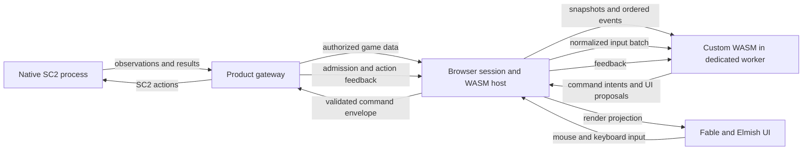
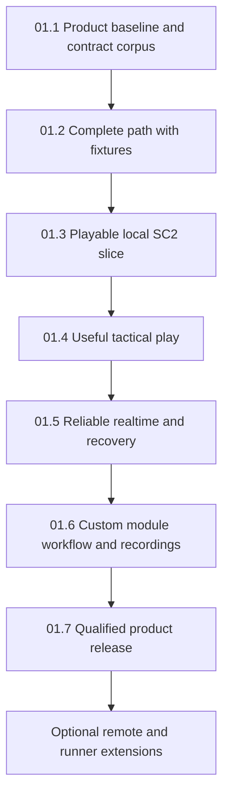

# Fable SC2 client with custom WASM control — design and roadmap

**Feature: SC2C-01. Status: proposed product design; implementation has not started.**
This document recommends a browser-first Fable/Elmish tactical client connected to a native
StarCraft II process through an F# gateway. Custom WebAssembly modules receive game data and
normalized user input, then return command intentions which the host and gateway validate before
sending SC2 actions. A bundled manual controller follows exactly that module path.

The requested work is this design, roadmap and documentation PR. Merging it does not publish an
ABI, create a product repository, install SC2, deploy a service, or change an existing template.
All message names, signatures, limits, package boundaries and acceptance criteria below describe
the proposed product. They become implementation contracts only through subsequent product work.

Proposed product name: **FS.GG.SC2.Client**, subject to selection when implementation begins.
There is no new repository behind that name yet. Until one exists, this is the feature's planning
home. It belongs to the independent product portfolio in section 15 of the
[Unified Roadmap](2026-09-07-154210-fs-gg-unified-development-roadmap.md), indexed from
[section 9.8](2026-09-07-154210-fs-gg-unified-development-roadmap.md#98-feature-parts-and-subroadmap-index).
It does not become a prerequisite for the V0–V6 coordination sequence.

## 1. Product outcome and scope

The client is a tactical interface and programmable controller for SC2's existing game simulation.
It is not a browser port of the proprietary SC2 engine or an attempt to reproduce its 3D renderer.
The starting resource, [awesome-sc2-ai](https://github.com/aiarena/awesome-sc2-ai), is a curated
catalogue of tools and learning material. The actual connection uses Blizzard's
[SC2 API protocol](https://github.com/Blizzard/s2client-proto).

The first supported journey is local play against the built-in computer, using raw observations
and non-realtime stepping. The browser offers a 2D tactical view with an accessible surrounding
interface. A user loads the bundled controller or a custom `.wasm` file, grants command authority,
and controls units with either mouse or keyboard. Realtime play and robust module replacement
follow after that complete path works against an actual SC2 installation.

| Requirement | Proposed behavior | Completion evidence |
|---|---|---|
| Fable game client | F# application compiled through Fable; Elmish UI with browser rendering and worker adapters | Clean product build and actual browser journey |
| Game data → client → WASM | Authorized observations, metadata, events and query results reach a versioned module interface | Fixture conformance and a live module reading an observed unit |
| Input → WASM | Pointer and keyboard actions enter one ordered, normalized input contract | Equivalent target/order journeys through the same manual module |
| WASM → SC2 commands | A module returns intents; the browser host and native gateway validate and translate them | Correlated input, module result, gateway submission, SC2 result and later observed effect |
| Custom modules | User-supplied core-WASM bytes and declarative configuration work without rebuilding the client | A separate example author builds, imports and runs a module |
| Usable mouse and keyboard UI | Session setup, module management, unit selection, targeting and ordinary play have keyboard paths | Keyboard-only journey plus pointer journey; focus and blur tests |
| Failure containment | Invalid, slow or trapped modules lose authority without freezing navigation | Adversarial fixtures and gateway rejection of stale generations |
| Inspectable behavior | Commands, module faults, stale data and ambiguous outcomes are visible | Diagnostic journey explains a rejected and an uncertain order |

Full retail-interface parity, omniscient competitive control, arbitrary JavaScript plugins,
browser-only SC2 simulation, and unqualified tournament compatibility are outside the initial
product. A module marketplace, multiwriter orchestration, remote multitenant hosting and feature/RGB
observation profiles are later extensions. The baseline still includes a complete custom-module
workflow, useful tactical play and both input methods; these requested capabilities are not optional.

## 2. Evidence and reuse assessment

### 2.1 Research baseline

Inspection date: **2026-09-08**. No live SC2 match or new browser/WASM benchmark was executed for
this design. Source inspection, an older recorded demonstration, and future qualification are
kept separate. Selected package releases, browser versions, SC2 binary/data versions and maps will
be locked during the first implementation slice.

| Source | Inspected identity and finding | Consequence |
|---|---|---|
| Blizzard protocol | [`7212ae5`](https://github.com/Blizzard/s2client-proto/tree/7212ae512d15aa93a708e025d3ab9af4a9c4138f); protobuf messages over WebSocket | Build a product adapter around the actual protocol; no gRPC server is implied |
| Blizzard reference API | [`614acc0`](https://github.com/Blizzard/s2client-api/tree/614acc00abb5355e4c94a1b0279b46e9d845b7ce); existing C++ client implementation | Consult reference behavior without requiring the C++ bot framework in the F# product |
| FS.GG.Net | [`e66d38d`](https://github.com/FS-GG/FS.GG.Net/tree/e66d38d7ed7fb5cc36984f4d33434bd9c6eaa802); real SC2 handshake sample exists | Reuse and harden the native transport path |
| FS.GG.Templates | [`6109107`](https://github.com/FS-GG/FS.GG.Templates/tree/61091078337689c6ab1aac139bc03f6a07ca8f99); Fable game provider exists | Start from the actual provider and preserve useful client/test conventions |
| FS.GG.Game | [`24f7908`](https://github.com/FS-GG/FS.GG.Game/tree/24f79084fdd289f34387f91b1d4398c78fde16eb); limited Fable source bundle | Qualify individual pure helpers; do not assume all native game/input APIs are browser-ready |
| FS.GG.Rendering | [`8610299`](https://github.com/FS-GG/FS.GG.Rendering/tree/86102999e7f60a494bed74e825e36b284fef6d62); scene, input and symbology source inspected | Reuse compatible concepts/assets selectively; browser support for the complete native stack is unproven here |
| S.I.R. | [`094c767`](https://github.com/EHotwagner/S.I.R./tree/094c7670b91f2e4ba3a22d3fd487acf62d11b823); WASM control architecture and browser verification research exist | Reuse isolation and observe/decide/request lessons; SC2 retains its own rules and authority |

The existing [SC2 handshake sample](https://github.com/FS-GG/FS.GG.Net/blob/e66d38d7ed7fb5cc36984f4d33434bd9c6eaa802/samples/Sc2Handshake/README.md)
documents Ping, CreateGame, JoinGame, Observation, Step, LeaveGame and Quit. It records an earlier
Linux Base75689/CyberForestLE run and says CI builds without running SC2. Its project references
point at sibling Net source projects. That is useful implemented prior art, not evidence that an
isolated consumer currently restores and runs the same journey from released packages. The first
slice must establish that consumer result. The sample's vendored protocol also needs an explicit
upstream identity/per-file hash lock rather than an assumed match to today's protocol HEAD.

The [Fable game provider](https://github.com/FS-GG/FS.GG.Templates/tree/61091078337689c6ab1aac139bc03f6a07ca8f99/templates/fs-gg-fable-game)
already uses Fable/Elmish, direct DOM work, HTTP bootstrap, named Thoth codecs, SignalR realtime
messages and browser tests. Reuse those engineering conventions. Its arena server owns a different
simulation; that authority must be removed or isolated in the SC2 product. A template dependency
pin is not evidence that every associated library surface can compile through Fable.

### 2.2 Relationship to existing designs

The [SVG game engine proposal](2026-09-07-064259-svg-game-engine-template-design-roadmap.md) and
[roadmap revision](2026-09-07-121207-svg-game-engine-roadmap-revision-proposal.md) support an
incremental browser product preview. This client can demonstrate real needs without waiting for
the entire proposed engine, changing a template default, or extracting speculative shared packages.

The earlier [SC2 symbology proposal](reports/2026-07-05-starcraft2-unit-symbology-library-design.md)
offers useful unit-to-symbol mapping ideas. It is not a delivered browser SDK or an authoritative
live unit catalogue. Use original tactical glyphs, inspect asset rights, and prefer runtime game
metadata for the selected SC2 build. Do not pull a Skia-backed raster helper into the browser or
inherit the earlier proposal's governance defaults.

S.I.R.'s [control architecture](https://github.com/EHotwagner/S.I.R./blob/094c7670b91f2e4ba3a22d3fd487acf62d11b823/docs/wasm-control-architecture.md)
describes a native Wasmtime host with isolated state and bounded outputs. Its
[browser verification spike](https://github.com/EHotwagner/S.I.R./blob/094c7670b91f2e4ba3a22d3fd487acf62d11b823/docs/research/browser-wasm-verification-spike.md)
records that browser WebAssembly does not reproduce the native deterministic fuel contract.
Carry that limitation forward. This design does not turn a browser worker deadline into a
deterministic instruction budget or import S.I.R.'s simulation, communication rules or per-unit ABI.

### 2.3 Ownership recommendation

| Area | Initial owner and reuse boundary |
|---|---|
| SC2 domain, gateway, session model and protocol projection | Proposed client product; consume FS.GG.Net where its released API qualifies |
| Browser tactical UI, input mapping and SC2 coordinate conversion | Product, using the current Fable template and proven pure/rendering helpers |
| Module manifest, ABI, SDK, reference controller and arbitration | Product until actual independent reuse justifies an extraction |
| Generic WebSocket/protobuf transport defects | FS.GG.Net through an ordinary producer change and subsequent product adoption |
| Generic browser renderer/input capability proven by this product | Existing producer named by the SVG design, through a separate scoped extraction |
| SC2 binaries, maps, replays and competitive runner integration | Explicit local installation or selected deployment/runner profile; not bundled by assumption |

Use Fable bindings for browser/runtime APIs where needed. Xantham can assist a TypeScript-backed
dependency through the existing optional bindings workflow, but it does not generate the SC2
protobuf protocol or define this WASM ABI. A generator update is never a reason to silently change
the qualified module contract.

## 3. System architecture and authority



SC2 owns simulation truth. The gateway owns the native connection, match lifecycle, request
scheduling, admission, authorization and transport recovery. The browser host owns module
lifetimes and the current client projection. WASM owns gameplay interpretation and command
generation. Elmish owns application state and presentation. None of these layers claims to
replace SC2's combat, economy, pathfinding or action legality.

The bundled **manual controller is a real WASM module** with the same ABI and limits as a custom
controller. Unit selection, control groups, ability choice and target confirmation reach that
module. It returns selection/targeting proposals and command intents. An autonomous controller
can process game data without input, but receives the same input stream when a user interacts.
An assisted controller can combine user intent with automation without a parallel host-generated
gameplay path.

Local focus, dialog navigation, theme, diagnostic filters and a display-only tactical camera may
update immediately in the browser. Any change to gameplay, including an SC2 camera command that
affects a spatial observation interface, follows the module capability path. Session creation,
disconnect and **stop issuing commands** are host lifecycle operations: a broken guest cannot
hold those controls hostage. **Stop selected units** is a different, ordinary WASM-generated
SC2 action. Revoking authority does not cancel orders SC2 already accepted.

The gateway treats every browser message as untrusted regardless of browser-side validation.
It cannot prove that a modified browser actually executed the declared WASM bytes. Module hashes
and trace lineage support local diagnostics; they are not remote attestation. Competitive or
adversarial deployments that must enforce a controller identity need a trusted native runner or
another separately qualified enforcement boundary.

### 3.1 Proposed component structure

The following is a responsibility map, not a scaffold created by this PR:

```text
src/Sc2.Client.Domain       Pure IDs, presence-aware DTOs, input/intent types
src/Sc2.Client.Protocol     Product schemas, codecs and version negotiation
src/Sc2.Client.Gateway      SC2 adapter, sessions, leases, admission, recordings
src/Sc2.Client.Browser      Elmish app, DOM/SVG view, connection and worker adapters
src/Sc2.Client.ModuleHost   Trusted browser worker loader and ABI supervision
sdk/                       Guest SDK and binary conformance fixtures
modules/manual/            Bundled manual controller
modules/examples/          Small controller and advisor examples
tests/                     Codec, host, gateway and browser journeys
fixtures/                  Synthetic or sanitized versioned observations/traces
```

Keep browser-compatible pure code separate from .NET process, filesystem and Google.Protobuf
dependencies. Fable interop wrappers should be small, typed and explicit about ownership. Large
immutable observation buffers live outside the ordinary Elmish model behind versioned references;
the UI model holds selections, panel state, status and revision IDs rather than copying a full
game snapshot on every pointer movement.

## 4. SC2 connection and gateway design

### 4.1 Selected protocol profile

Start with raw participant observations and raw actions. SC2 exposes setup, observation, action,
query, stepping and replay operations through distinct messages. The
[raw schema](https://github.com/Blizzard/s2client-proto/blob/7212ae512d15aa93a708e025d3ab9af4a9c4138f/s2clientprotocol/raw.proto)
uses 64-bit unit tags and presence-sensitive fields; the
[spatial schema](https://github.com/Blizzard/s2client-proto/blob/7212ae512d15aa93a708e025d3ab9af4a9c4138f/s2clientprotocol/spatial.proto)
defines different observation/action representations. The main protocol marks `action_render`
unimplemented, so RGB observations do not establish RGB action support.

The initial adapter uses protobuf over one native WebSocket connection. Begin with **one request
outstanding per connection**, following the conservative scheduling choice in the
[reference transport](https://github.com/Blizzard/s2client-api/blob/614acc00abb5355e4c94a1b0279b46e9d845b7ce/src/sc2api/sc2_proto_interface.cc).
Validate response type and status, correlate IDs when supported, and explicitly qualify missing-ID
behavior for each supported build. A request ID is a correlation value, not an idempotency key.
Do not parallelize protocol mutations merely to increase browser frame rate.

### 4.2 Startup and match lifecycle

The proposed local lifecycle is: discover a configured installation; launch or attach to an
explicitly selected process; ping and record build/data identity; create a game with an approved
map; join as the selected participant with the raw interface; load game information and metadata;
observe; initialize the module; then grant control. Create/attach are distinct choices so disconnect
does not accidentally quit a process the gateway does not own.

The implementation records actual protocol hash, application/gateway versions, SC2 base/build/data
versions, map identity, participant, race, opponent settings and realtime/interface options in a
session descriptor. Compatibility negotiation rejects unsupported combinations with an actionable
reason. A successful TCP/WebSocket connection alone is insufficient readiness.

Process launch is a gateway capability, never a module capability. Configuration identifies allowed
installations and maps; browser requests do not provide arbitrary executable paths, shell arguments
or unrestricted remote download URLs. The SC2 API socket remains on loopback or a private service
network. The gateway exposes the authenticated product protocol, not an unrestricted SC2 proxy.

Native replay uses a separate watching state and a compatible SC2 binary/data installation.
Participant control is disabled. Multiplayer is a later orchestration adapter involving the actual
SC2 participants/instances and port arrangement; a second browser tab is another UI subscription,
not automatically another SC2 player.

### 4.3 Clocks and scheduling

SC2 game loops, gateway monotonic time and browser animation frames have different meanings.
Gameplay freshness uses the reported game loop plus observation receipt age; display interpolation
does not invent authoritative state. Do not hard-code a wall-clock conversion as the scheduler's
source of truth.

In step mode, one gateway scheduler owns this cycle:

```text
observe → deliver data/input → bounded module decision → validate and submit → step → observe
```

The UI offers explicit pause, one-step and run controls. Waiting for a human can leave simulation
paused in this mode. Modules may request scheduling hints but cannot send independent `RequestStep`
calls. A module timeout disarms control; the configured step scheduler can remain paused without
pretending a gameplay stop order occurred.

In realtime mode, SC2 advances independently. The gateway samples observations, delivers frames and
submits admitted intents on a bounded schedule. A requested observation loop must remain close enough
to the current game that an outstanding observation cannot starve pending actions. Expensive queries
are rate-limited and lower priority than control/lifecycle work. Browser rendering never clocks SC2.

When a tab becomes hidden or loses focus, release held input and apply the visible session policy:
manual control suspends, while continuing automation requires explicit opt-in. A gateway lease handles
browser freezes and lost heartbeats. Realtime matches continue unless SC2 itself supports and accepts
the requested lifecycle operation. Browser scheduling is not an unattended service guarantee; browsers
throttle background work, as described by the [Page Visibility API](https://developer.mozilla.org/en-US/docs/Web/API/Page_Visibility_API).

### 4.4 Browser-to-gateway boundary

Use HTTP for authenticated bootstrap and asset/trace download, with named, versioned codecs following
the template conventions. Recommend one ordered browser WebSocket stream carrying a versioned product
binary envelope for live data, input-derived intents and feedback. This avoids routing bulk SC2
snapshots through the ordinary UI model or inventing two independent command authorities.

The first slice selects and verifies the Fable-compatible protobuf codec/generation path against
the .NET codec and guest SDK. Do not assume Google's .NET generated classes compile under Fable.
SignalR from the current template remains a viable measured alternative if its chosen binary path
meets the same fixtures and budgets. Select one live transport for the baseline; an abstraction is
not permission to maintain two unfinished implementations.

The connection negotiates protocol major/minor, perspective, interface profile, maximum message sizes
and compression policy. Major mismatches fail before control. A new module that requires unknown
fields/capabilities is rejected rather than silently downgraded. Decompressed size is bounded before
decoding. Separate typed messages represent snapshots, ordered events, module commands, results,
authority changes, gaps and resynchronization boundaries.

## 5. Game-data model and delivery

### 5.1 Proposed data surfaces

| Surface | Contents and behavior |
|---|---|
| `SessionDescriptor` | Epochs, game/build/map identities, player perspective, interface settings, capabilities and coordinate convention |
| `GameMetadata` | Runtime unit/ability/upgrade/buff/effect catalogues; map dimensions, terrain/pathing/placement layers and playable bounds |
| `ObservationFrame` | Sequence, game loop, receive time, resources, visible units, declared presence, current orders where available, score and other granted raw fields |
| `EventBatch` | Ordered action feedback, errors, death events, alerts, permitted chat, terminal result and explicit gap markers |
| `InputBatch` | Ordered normalized actions, input IDs, target coordinates and view/source-frame revisions |
| `QueryResultBatch` | Asynchronous ability, pathing and placement results with source request and freshness identity |
| `ModuleFeedback` | Host rejection, gateway admission, written/result/unknown status and module resource/fault notices |

`RequestData` and `RequestGameInfo` supply metadata associated with the selected game/interface
identity. Cache immutable data by that identity and map hash, not application version alone.
Large map/catalogue data arrives in bounded chunks with a completion digest. A module cannot become
command-active while a required dataset is incomplete. Unused optional layers are not repeatedly
copied into every frame.

Preserve original authorized protobuf data as an optional declared attachment for advanced modules
whose needs exceed the normalized SDK. Such modules must declare the supported protocol revision
and remain subject to size/perspective limits. The default SDK provides typed normalized data; it
does not force every author to decode Blizzard's entire schema.

### 5.2 Correctness rules

**Unit tags remain lossless.** On binary boundaries they are unsigned 64-bit values. JavaScript-facing
code exposes opaque decimal strings or another explicitly verified lossless representation; never
round-trip tags through `number`. Fixtures include values above `2^53`, zero, and the unsigned limit.

**Unknown stays unknown.** A missing enemy health value is not zero health; absent orders are not
proof of idleness. Live, remembered/fogged and confirmed-dead units have distinct representations.
Do not infer death solely from disappearance from an observation. Render stale memories differently
and identify their last observed loop. Modules only receive their granted participant perspective;
observer/replay data must not leak into a participant controller.

**Snapshots and events have different retention.** Observation responses carry action/error information
accumulated across observation boundaries in the
[response schema](https://github.com/Blizzard/s2client-proto/blob/7212ae512d15aa93a708e025d3ab9af4a9c4138f/s2clientprotocol/sc2api.proto).
Extract that information before replacing a pending snapshot. A slow renderer may display only the
newest snapshot. Ordered events must survive or be replaced by an explicit gap, never silently lost.
Overflow suspends control and resynchronizes. A fresh snapshot cannot reconstruct lost guest history.

**Coordinates are explicit.** The SDK uses world coordinates and map bounds with a documented origin,
axis orientation and unit scale. Pointer capture resolves screen-to-world coordinates using the
camera revision at capture time. Drag selection carries the resolved world rectangle and source
frame. Minimap, bitmap grids, cropped views and future spatial interfaces have separate tested
transforms. A later camera movement cannot retarget a previously captured click.

### 5.3 Queries and backpressure

Available abilities, pathing and placement are explicit protocol queries, as shown in the
[query schema](https://github.com/Blizzard/s2client-proto/blob/7212ae512d15aa93a708e025d3ab9af4a9c4138f/s2clientprotocol/query.proto).
A module emits a query intent; the gateway schedules it and returns a correlated result in a later
batch. No synchronous WASM host import waits on SC2. Results have game-loop provenance and may be
stale by the time an action is submitted. A static pathability preview does not replace the live
game's placement, collision or movement rules.

Each module has one outstanding invocation. Pending snapshots may coalesce; ordered input and events
use bounded queues. Pointer motion may coalesce only within an explicitly continuous gesture;
button/key transitions, target confirmation, cancellation and command feedback retain ordering.
The module reports consumed input/event/frame sequences. A skipped sequence, unsupported gap or
expired observation prevents admission until state is reconciled.

## 6. Session identity, admission and recovery

### 6.1 Separate state machines

| Domain | Proposed states |
|---|---|
| Connection | Disconnected, connecting, ready, closing, faulted |
| Match | No match, creating, joining, playing, ended; separate loading/watching replay branch |
| Subscription | Detached, synchronizing, current, resynchronizing |
| Authority | Unassigned, granted, revoked, expired |
| Module | Selected, validating, loading, ready, active, suspended, faulted, replacing, disposed |

The UI shows these separately. “Connected” must not hide a missing match, stale observation,
uninitialized module or absent command grant. A command envelope binds gateway session, match epoch,
connection identity, participant, controlling browser, authority generation, module hash/generation,
command ID, batch order, source frame/game loop and source input range.

New games, restart and any later quick-load/rewind support change the match epoch. Recovery after an
uncertain connection changes connection identity. Takeover, revocation and module replacement change
authority generation. Old messages cannot become valid merely because a unit tag or command counter
is reused. All authority checks run again immediately before native submission.

Initially there is **one command-authoritative module per participant**. Advisors and visualizers
can receive permitted data and return bounded suggestions. They do not acquire command authority
through a UI overlay. A controller must explicitly adopt an advisor's suggestion. Later unit-partitioned
multiwriter support requires explicit unit grants, conflict ordering and revocation behavior; never
concatenate arbitrary module outputs or use whichever module finishes last.

### 6.2 Action model and validation

The initial candidate action algebra is deliberately small:

```text
UnitCommand(units: UnitTag[], ability: AbilityId,
            target: None | WorldPoint | UnitTag, queue: bool)
ToggleAutocast(units: UnitTag[], ability: AbilityId)
```

The host validates the entire returned envelope before forwarding anything. The gateway independently
checks epochs, authority, participant mode, observation freshness, payload/action limits, finite
coordinates, map bounds, known abilities and ownership of commanded units. Target-unit checks respect
visibility and the chosen ability's semantics. Unit target and point target are mutually exclusive
in the normalized contract. An empty/duplicated/oversized unit list receives a defined outcome.

Ability/placement queries improve feedback but do not prove that a later action will succeed.
SC2 remains the final authority. A mixed batch can receive per-action SC2 results; successful local
validation is not a promise of atomic execution of all actions. Chat, debug, map triggers, lifecycle
and replay controls are separate capabilities. Normal guests receive no debug or arbitrary raw-request
capability.

### 6.3 Results and uncertain effects

Command progress has distinct states:

```text
Produced → HostValidated → GatewayAdmitted → WrittenToSC2 → SC2Response
```

Before writing, the command may be rejected, expire or be cancelled. After writing, disconnect can
make the outcome unknown. A successful action result and subsequently observed movement/order/effect
are separate evidence. Delayed game errors remain visible after earlier acceptance. If SC2 does not
provide exact causal correlation, display that uncertainty rather than attributing every later change
to one command.

The gateway deduplicates repeated browser command IDs within the session retention window and returns
the recorded status. Reusing an ID with a different payload is rejected. For restart recovery, a
durable “submission pending” record precedes the socket write; a crash between those steps is still
ambiguous. This is host deduplication, not exactly-once SC2 execution. Never automatically retry an
uncertain action, step or create-game mutation. Read-only recovery may use bounded retries.

After reconnect, expire buffered gameplay input, obtain a new authority generation and synchronize
current data before rearming. The baseline reinitializes the module and reports a continuity break.
Optional future checkpoint restoration must bind compatible code, ABI, state schema and event
position; arbitrary guest state cannot be reconstructed from the newest observation alone.

### 6.4 Failure behavior

| Failure | Immediate behavior | Recovery |
|---|---|---|
| Guest trap, malformed output or deadline | Discard unfinished output, revoke that generation, keep host navigation usable | Diagnose; reload a fresh instance and explicitly rearm |
| Input/event overflow or gap | Stop command admission and label state incomplete | Full synchronization and module reset unless a qualified recovery contract exists |
| Stale observation | Reject new intents with source-age explanation | Resume after a current frame and valid generation |
| Tab closes/freezes or connection drops | Gateway lease expires; no automatic buffered gameplay replay | Reconnect, synchronize and acquire control |
| SC2 exits | End native submission; report process/session failure | New session under a new epoch |
| Socket fails after write | Record unknown outcome; no automatic retry | Inspect new observations and report unresolved attribution |
| Candidate hot reload fails | Candidate never receives authority | Keep previous controller only while its state/grant remain valid; otherwise remain disarmed |
| Recording storage fills | Mark a recording gap/stop recording visibly; live control follows explicit policy | Clear storage or start a new recording; do not claim complete evidence |

## 7. Custom WASM hosting and SDK

### 7.1 Supported artifact profile

Start with **core wasm32**, one non-shared linear memory, a bounded table if present, and a small
versioned import/export surface. Accept raw `.wasm` bytes plus a declarative manifest/configuration.
The trusted application supplies the worker loader. Uploaded JavaScript glue, arbitrary module
URLs executed as scripts, general WASI access and implicit filesystem/network/DOM capabilities are
outside the baseline. Modules compiled for Emscripten, WASI, .NET or component-model runtimes require
an explicit compatible adapter; a `.wasm` extension does not establish compatibility.

The manifest declares content hash, module/SDK version, ABI major/minor range, payload schema,
controller/advisor/visualizer role, required data and capabilities, memory/table/output maxima,
configuration schema and optional checkpoint identity. Runtime inspection compares declarations
against actual imports/exports and binary structure. A hash identifies bytes; it does not establish
that those bytes are safe, trustworthy or authored by the claimed publisher.

Validate size and the supported feature profile before instantiation. The first profile rejects
imports, shared memory, threads, Memory64 and unqualified proposals, and requires finite declared
memory/table maxima within host policy. Reject a start section for the simple SDK profile, so
initialization occurs through the explicit entry point. Parsing validates section lengths/counts
without allocating from unchecked guest sizes. Browser import reflection alone is insufficient to
validate memory limits and the complete binary profile.

Core WebAssembly constrains guest access through its host interface, as described by the
[WebAssembly security model](https://webassembly.org/docs/security/). Application authorization,
resource ceilings, safe output interpretation and browser-origin protection remain host responsibilities.

### 7.2 Candidate ABI v1

Use a language-neutral byte ABI with a versioned product protobuf payload. Reuse binary conformance
fixtures across .NET, Fable/JavaScript and guest SDKs. SC2 proto2 presence is preserved during
projection; product optionality is explicit. The ABI transports normalized product data, not the
entire native SC2 request surface.

Candidate exports, shown as design notation rather than executable code:

```text
memory
sc2c_abi_version() -> u32
sc2c_alloc(length: u32) -> u32
sc2c_free(pointer: u32, length: u32)
sc2c_initialize(input: u32, length: u32, output_descriptor: u32) -> i32
sc2c_process(input: u32, length: u32, output_descriptor: u32) -> i32
sc2c_shutdown() -> i32
```

The candidate conventions are:

- Core-WASM `i32` represents each unsigned pointer/length/version field. Interpret it unsigned on
  the host, with overflow-safe bounds arithmetic. ABI version packs major/minor into a documented
  32-bit value; compatibility is negotiated before initialization.
- `alloc` receives a positive length and returns a nonzero pointer to at least that many writable
  bytes, aligned to at least four bytes. Zero means allocation failure. Zero-length input allocations
  are not used; an empty logical batch still has an encoded envelope.
- The host allocates input storage and an eight-byte output descriptor. The descriptor contains
  little-endian output pointer and length. These host-requested allocations remain valid until freed
  with the exact pointer/length pair.
- On success, output storage belongs to the guest and remains valid until the next guest call.
  The host validates and copies it before calling `free`, another export or another invocation.
  Output may not overlap the host-owned input or descriptor. A zero-length result uses pointer zero
  and means no output during initialization; nonempty output requires a nonzero in-bounds pointer.
  A successful `process` call returns an encoded envelope even when it proposes no action, so consumed
  sequences are acknowledged explicitly.
- Entry points return zero on success and a documented nonzero error code otherwise. Traps and
  nonzero results invalidate the whole result. No partially decoded command is forwarded.
- The host reacquires the memory buffer after calls that may grow memory and validates every span
  against its current size. It does not retain typed views across guest calls or trust alignment,
  payload counts or nested message lengths supplied by the guest.
- Calls are serialized and non-reentrant. Allocation, initialization, processing, freeing and
  shutdown all run under external deadlines; a hostile allocator or destructor is still guest code.

Memory growth can replace/detach ordinary memory buffers, as documented by the
[WebAssembly JavaScript API guide](https://developer.mozilla.org/en-US/docs/WebAssembly/Guides/Using_the_JavaScript_API).
Host-to-worker transfer uses copied/transferred `ArrayBuffer` messages initially. SharedArrayBuffer
and cross-origin isolation are not baseline deployment prerequisites.

`initialize` receives session/configuration and dataset identities. `process` receives ordered
metadata chunks, frames, events, input, asynchronous query results and feedback. Initialization is
not complete until all declared required datasets have passed their completion checks. Output is a
single bounded `ModuleOutput`: consumed sequences, command intents, query intents, structured UI
proposals and diagnostics. Unknown optional metadata can be preserved/ignored according to schema
rules; unknown command variants fail explicitly.

No ambient clock or randomness is imported. Game loop, host receipt time when needed, and a session
seed are explicit inputs. This makes bounded module runs more reproducible without claiming whole-game
determinism. Authoring starts with a Rust SDK and manual controller; a second language, preferably C,
must pass the same fixtures before the portable SDK release. Fable supplies the host; ordinary Fable
compilation is not presented as a guest-WASM compiler.

### 7.3 Isolation, budgets and lifecycle

Use one dedicated worker per guest instance and a supervisor outside that worker. Compilation and
initialization also occur away from the UI thread. The supervisor applies wall-clock deadlines and
terminates a stuck worker. A `Promise.race` scheduled inside a worker cannot interrupt its own
synchronous infinite loop. [Worker termination](https://developer.mozilla.org/en-US/docs/Web/API/Worker/terminate)
is immediate and offers no guest cleanup guarantee; cleanup of authority and host resources belongs
to the supervisor/gateway.

These are **starting qualification limits**, not measured product guarantees or SC2 protocol limits:

| Resource | Proposed initial ceiling/target | Enforcement or consequence |
|---|---|---|
| Active guests | 1 controller and at most 2 optional read-only advisors | Admission and aggregate resource budget |
| Artifact bytes | 8 MiB per module | Bound file/fetch and binary parsing before compilation |
| Linear memory | 64 MiB per guest; maximum 1,024 64-KiB pages | Require finite declared maximum and reject unsupported memories |
| Table entries | 4,096 maximum | Validate binary limits before instantiation |
| One guest input | 4 MiB; static-data chunks at most 1 MiB | Chunk metadata; reject oversized dynamic frames explicitly |
| One guest output | 256 KiB | Bounds and decoding limits before any effect |
| Command/query output | At most 64 actions and 32 query intents per invocation | Independent gateway rate/ownership policy still applies |
| Guest execution | 20 ms target; 100 ms process-call watchdog | Measure separately; timeout discards output and revokes authority |
| Startup | 5 s compile/load deadline; 2 s initialize deadline | Cancel candidate without blocking the current UI |
| Pending work | Latest snapshot plus 256 discrete inputs and 4 MiB ordered events per guest | Coalesce only permitted data; gap/suspend on overflow |
| Browser drawing | 60 Hz target; ordinary app work below 4 ms per frame at the declared reference load | Measure main-thread p95/p99 and input responsiveness |

Static datasets may cumulatively exceed an input chunk but must fit a separately admitted session
budget. Native response/decompressed-message ceilings and aggregate browser memory are established
using the first real map corpus; per-guest limits alone are not a total memory bound. Oversized
observations cause a visible unsupported-profile result, not silent unit/event truncation. Adjust
limits using measured representative armies/maps and preserve the profile identity in traces.

Browser workers do not provide hard realtime guarantees, deterministic fuel or full process-level
memory isolation. The gateway enforces lease expiry independently if the whole tab stalls. The initial
profile is suitable for user-selected local modules under browser constraints. Unattended or
adversarial remote execution needs a separately hosted native runner with instruction/resource
metering and process isolation. Wasmtime fuel/epoch mechanisms are distinct choices, as explained in
its [deterministic execution guidance](https://docs.wasmtime.dev/examples-deterministic-wasm-execution.html).

Hot replacement first validates and initializes a candidate without command authority. At a selected
observation boundary, stop admission from the old generation, invalidate queued output, preserve
known/unknown status for already-submitted commands, grant a new generation and dispose the old
worker. Candidate failure leaves the old controller active only if still valid; otherwise remain
disarmed. Automatic fallback is opt-in and uses an identified module, never hidden host-generated orders.

### 7.4 Author experience

The module panel supports local import, manifest validation, capability explanation, configuration,
load/arm/disarm, replacement and fault inspection. Display version/hash in diagnostics, with a readable
name in ordinary play. Loading is separate from granting control. Remembered modules can be cached
locally by hash with clear removal; do not silently replace their bytes from an upstream URL.

Provide a small SDK reference, minimal observe-and-log example, manual controller, advisor example,
fixture runner and ABI conformance suite. Diagnostics distinguish unsupported ABI/imports, allocation
failure, trap, deadline, malformed output, host rejection and game rejection. Safe overlays are typed
primitives with counts/text limits and host-owned styles; never render guest strings as HTML/SVG markup.

## 8. Tactical UI and input design

### 8.1 Workspace

The main view has a persistent session/control status strip, a tactical map, minimap, selection/unit
details, ability palette, resources/supply, and a collapsible module/command inspector. Status makes
match mode, active controller, stale data and disarmed/unknown outcomes obvious. The default play view
uses names and useful recovery actions; protocol IDs and memory diagnostics belong in the inspector.

Use product-owned DOM/SVG for menus, glyphs, selection and targeting initially. Cache terrain and large
grid layers as measured SVG or Canvas image layers; choose their implementation from actual map/army
profiling. Cull off-screen objects, reuse glyph definitions, batch layer updates and avoid rebuilding
all nodes on each observation. WebGL/WebGPU and the broader proposed SVG engine remain optional
performance/reuse outcomes, not prerequisites for the first playable screen.

The view presents authorized terrain/visibility, visible units, distinct remembered contacts, selected
orders where available, target previews and bounded module overlays. Tactical glyphs are original or
explicitly licensed. Do not imply full retail assets, hidden unit state or perfectly accurate prediction.
Path/placement previews carry their source and freshness and can be invalidated by the live game.

### 8.2 Input equivalence

These are proposed default mappings, configurable after the minimal slice. They are not a promise
to reproduce every race's retail hotkeys.

| Intent | Mouse path | Keyboard path | Interpretation |
|---|---|---|---|
| Select | Click unit; drag selection rectangle | Focus unit list/map cursor and confirm | Input to controller; selection proposal returned |
| Add/remove selection | Modifier plus click/drag | Modifier plus focused-unit confirmation | Same selection intent semantics |
| Control group | Group bar | Assign/recall configurable number bindings | Controller maintains group membership |
| Smart contextual order | Right click world/unit | Context-order mode, move target cursor, confirm | Controller selects valid intent using current data |
| Move | Ability button then target | M, target cursor, Enter | Module-generated ability/target command |
| Attack/attack-move | Ability button then unit/point | A, target cursor, Enter | Distinct unit/point target and availability checks |
| Stop / hold | Ability palette | S / H when bound | Ordinary gameplay commands through WASM |
| Queue order | Shift while confirming | Shift plus target confirmation | Explicit queue flag in input and intent |
| Cancel targeting | Cancel button or appropriate secondary click | Escape | Controller clears pending target mode |
| Produce/build/use ability | Palette; placement preview and click | Focus palette or configured binding; cursor and Enter | Runtime ability/query data, no fixed universal action list |
| Navigate view | Drag/pan, wheel, minimap | Arrow/navigation bindings, zoom controls, minimap focus | Display-only camera may remain host-local |
| Inspect/operate modules | Panel controls | Tab/Shift-Tab, activation keys and visible focus | Host lifecycle, outside guest gameplay |
| Stop issuing commands | Persistent control button | Dedicated remappable emergency binding | Immediate host revocation; does not cancel existing SC2 orders |

Mouse and keyboard adapters produce domain input rather than embedding SC2 commands in DOM handlers.
Record transitions, modifiers, pointer IDs, resolved coordinates, source view/frame and sequence.
Keyboard targeting offers coarse/fine movement, target cycling/snapping and a textual target summary.
Coordinate targeting must remain possible without a mouse; merely binding ability hotkeys is insufficient.

Use physical `KeyboardEvent.code` for configurable game-position bindings where appropriate, and
logical keys/text for text-entry behavior; the [browser reference](https://developer.mozilla.org/en-US/docs/Web/API/KeyboardEvent/code)
explains that physical codes do not represent the user's keyboard layout characters. Label/remap
bindings clearly. Suppress gameplay shortcuts in editable fields, dialogs and IME composition.
Allow intended key-repeat only for continuous navigation; orders are not emitted repeatedly by accident.

Pointer capture supports drag completion outside the map. Pointer cancellation, lost capture, blur,
visibility change and disconnect release held state and cancel unsafe unfinished gestures. Browser
shortcuts are intercepted only while the relevant game surface has focus and only for active bindings.
Opening module diagnostics must not leave a stuck movement/queue modifier behind.

### 8.3 Accessibility and feedback

Use semantic DOM controls, visible focus, configurable bindings, sufficient contrast, scalable text,
reduced-motion behavior and non-color-only unit/selection states. Maintain a keyboard-accessible unit
list and ability palette alongside the dense tactical graphic; do not expose thousands of rapidly
changing glyphs as noisy tab stops or live announcements. Announce meaningful selection, target,
rejection and authority changes at a bounded rate.

Selection/cursor previews can update promptly, but UI labels distinguish pending module interpretation,
gateway acceptance, SC2 result and observed effect. An optimistic target marker is not confirmed movement.
Errors name the recoverable condition: stale observation, missing authority, unavailable ability,
invalid module result or unknown submission outcome. Virtualize long lists and preserve selection/focus
across snapshot refreshes.

## 9. Deployment profiles and security boundary

| Profile | What runs where | Intended scope |
|---|---|---|
| Local companion — first | Native gateway serves its browser assets and manages/attaches to local SC2 | Simplest qualification of origin, process lifecycle and play |
| Static offline viewer | Fable assets, WASM examples and sanitized trace files on static hosting | Documentation, module fixture demo and read-only trace inspection |
| Remote single-user play | Browser over HTTPS/WSS; authenticated gateway and SC2 on a managed host | Later supported remote profile after lifecycle/authentication testing |
| Competitive/unattended runner | Trusted native host executes the qualified controller against SC2 | Separate enforcement/runner integration; browser is supervisory |
| Multitenant hosting | Isolated game processes, allocation, auth, quotas and storage per session | Separate operational product scope |

GitHub Pages can host the compiled client, `.wasm` assets and an offline viewer because it serves
static sites; it cannot run the gateway, SC2 process or a live SQLite service. See
[GitHub Pages documentation](https://docs.github.com/en/pages/getting-started-with-github-pages/what-is-github-pages).
A Pages-hosted live UI must connect to a separately hosted authenticated gateway. The first local
profile serves its own UI; Pages-to-loopback is a distinct browser compatibility gate, not an assumed
universal deployment path.

Remote mode uses HTTPS/WSS and an explicit allowed-origin policy. A browser WebSocket constructor
does not offer arbitrary HTTP authentication headers; use a suitable authenticated session or a
short-lived one-use bootstrap followed by authenticated application messages. Do not put durable
credentials in connection URLs. Cross-origin cookie, CORS, WebSocket origin and CSRF handling must
be tested for the chosen deployment. Browser APIs and mixed-content constraints are documented in
[WebSocket construction](https://developer.mozilla.org/en-US/docs/Web/API/WebSocket/WebSocket) and
[mixed-content guidance](https://developer.mozilla.org/en-US/docs/Web/Security/Defenses/Mixed_content).

Loopback is not authentication: a hostile website must not be able to create games or take control
through an unprotected local gateway. Pair the browser session, validate Origin/Host as applicable,
expire grants and restrict executable/map access. Remote gateways add authentication, TLS termination,
rate limits, participant ownership and session cleanup. Do not expose SC2's raw API socket publicly.

Fetched WASM requires normal origin/CORS handling. Streaming instantiation needs an appropriate
WASM response type; locally imported bytes use the buffer path. Qualify host response headers and
asset paths, including Pages project subpaths, against
[the streaming API](https://developer.mozilla.org/en-US/docs/WebAssembly/Reference/JavaScript_interface/instantiateStreaming_static).
Baseline workers use application-owned scripts and transferred buffers; they do not depend on a
static host supplying cross-origin isolation headers. Content policy and a separate plugin origin
can be evaluated for later profiles, but cannot substitute for gateway authorization.

AI Arena's [Docker base repository](https://github.com/aiarena/aiarena-docker-base) describes images
used by its match controller. It is useful deployment prior art, not a browser-session API or automatic
permission to join a ladder. Any integration qualifies the selected runner, map/build distribution
and current competition rules. Game binaries, maps and art require their own applicable rights;
the catalogue's licence does not cover every linked resource. This proposal ships no such assets.

## 10. Recordings, telemetry and reproducibility

Distinguish three products:

1. **Client trace:** versioned authorized observations, ordered events, normalized inputs, module
   identities/results, gateway decisions and known/unknown SC2 outcomes. It supports offline browser
   inspection and bounded module comparison with live command submission disabled.
2. **Native SC2 replay:** saved/played through a compatible SC2 runtime. It has a distinct UI mode,
   perspective and installation requirement.
3. **Module re-execution:** repeat recorded inputs through the exact guest bytes, SDK/profile and
   explicit seeds/state under a qualified host. Output comparison does not prove that SC2 would
   reproduce a hypothetical alternative match.

Neither a client trace nor native replay supplies browser-only counterfactual SC2 simulation.
Browser worker deadlines can differ between runs; record termination as evidence, not deterministic
fuel consumption. Hot reload, dropped data, reconnect and missing checkpoints create explicit
continuity boundaries. A trace header pins versions, module hashes, map/perspective, clock conventions,
capabilities, compression/schema and completeness status.

Automatically correlate observation receipt, host dispatch, input sequence, module duration/output,
validation, gateway admission, socket write, response and later observed evidence. Useful measurements
include snapshot/event bytes, coalescing/gaps, queue age, main-thread frame time, guest execution,
command rejection reasons, request latency, authority changes and recording loss. Use monotonic clocks
within each process; cross-host timing requires an offset/uncertainty estimate, not subtraction of
unsynchronized wall clocks. Logs are bounded and never block the control path indefinitely.

Keep full observations, chat, module bytes and raw input recordings local/private by default with
explicit export and retention. Public examples use synthetic or deliberately sanitized data; redact
credentials and identify any reduced perspective. A module can encode information it legitimately
sees into diagnostics, so log access is part of the same data boundary.

SQLite is a reasonable optional **gateway-local** store for session metadata, command journal and
analytics indexes. Large binaries/traces can be content-addressed files referenced by the store.
If a public dashboard is later desired, export sanitized static JSON or a deliberate public database
snapshot for Pages during a build. Repository SQLite snapshots are published copies, not a writable
multiuser command store or the live game's authority. This optional dashboard is not a prerequisite
for SC2C-01 and is separate from the programme's existing local telemetry work.

## 11. Verification strategy and release evidence

Verification should exercise the boundaries that can fail, not mirror every record or UI setter.
Fast product CI runs without proprietary SC2 installation; real-game qualification is a separate,
identified job/environment using legally provisioned assets. Fixtures establish codec/host behavior,
not successful live integration.

| Layer | Meaningful evidence |
|---|---|
| Protocol/codec | Cross-runtime bytes round-trip; uint64 extremes; proto2 absence vs defaults; unsupported major/command variants; bounded malformed lengths and decompression |
| Coordinates/data | Known map/grid orientation; camera moves between input capture and dispatch; fog memories; disappearance vs confirmed death; event preservation under snapshot coalescing |
| WASM host | External SDK module; rejected imports/features/start section; infinite allocation/process/shutdown loops; trap/OOB descriptor; memory growth; oversized/partially malformed output; no partial effect |
| Authority/scheduler | Two tabs contend; old generation submits directly to gateway; revoke just before write; delayed stale result; action timeout; reconnect/epoch reset; ordered step cycle |
| Browser interaction | Mouse and keyboard journeys; focus/IME/repeat; pointer cancellation; background transition; module fault leaves emergency/navigation controls usable |
| Live SC2 | Create/join/load metadata; both input methods move an actual unit through WASM; reject a bad action; inspect SC2 feedback and subsequent observations |
| Recordings | Sanitized trace opens offline with no live command route; gaps/version mismatch visible; compatible native replay remains read-only |
| Security/deployment | Unpaired/wrong-origin client cannot act; role escalation rejected; hostile module cannot access network/DOM imports; size/rate limits; remote TLS/auth recovery |
| Performance | Declared hardware/browser/map/unit counts; main-thread and guest p95/p99, memory, bandwidth and input-to-observed-effect with network/SC2 time separated |

The mouse live acceptance trace is: select a friendly unit, issue a target, see the input consumed by
the manual WASM module, see its command admitted and written, inspect the actual SC2 response, then
observe the unit's movement. Repeat with keyboard selection/targeting. Negative gateway tests submit
an unenveloped action or stale generation and prove rejection. Instrumented browser tests establish
that the shipped UI handlers obtain gameplay output through the registered guest path. This detects
a demo that loads WASM decoratively while DOM handlers still command the game; it does not remotely
attest the behavior of a modified browser.

Exercise connection loss after write and before response: the command becomes unknown, is not retried,
and new control waits for synchronization. Inject a guest infinite loop: navigation remains responsive,
the worker terminates, and its late/stale output cannot act. Slow rendering must preserve ordered
events or visibly suspend after a gap. These are release-critical behaviors, not optional polish.

For the small authority/recovery state machine, use property/state-machine tests and, if it materially
clarifies races, a bounded formal model. Core invariants are one active writer, old epochs never
submit, no invalid/unfinished guest output acts, no ambiguous mutation automatically retries, and
no hidden information crosses a perspective boundary. Choose the technique for those invariants;
it does not select a heavyweight delivery process.

A supported combination records client/gateway/SDK versions, protocol revision, browser/OS, SC2
binary/data identity, map and mode. The first candidate is a local Linux SC2/gateway installation
with a browser on the same machine; actually supported combinations follow measured evidence.
Do not extrapolate a Linux sample into verified Windows/macOS, remote or tournament support. Browser
matrix expansion begins with current stable Chromium and then Firefox; Safari and packaged desktop
hosts require explicit worker/codec/input qualification before being listed as supported.

## 12. Feature roadmap — SC2C-01

This section is the feature's single proposed execution outline. No checkbox is marked complete.
The detailed near-term window is SC2C-01.1–01.3; later outcomes have entry evidence and exit criteria
without pretending their full task breakdown is already reliable. The first window proves a playable
slice, not completion of all requested product capabilities.

### 12.1 Delivery sequence and dependencies



The critical uncertainty is clean real-SC2 qualification, followed by a stable input/data/ABI boundary
under actual load. UI work can use fixtures while the native adapter is qualified, once the shared
contract corpus exists. Do not create speculative framework extraction or a hosting platform on the
critical path. Wall-clock estimates are intentionally deferred until the first live slice supplies
installation, data volume and command-coverage evidence.

### 12.2 First executable window

- [ ] **SC2C-01.1 — Reproducible product baseline and contract corpus — route: routine.**
  **Depends on:** a subsequent implementation request identifying/authorizing the actual product
  workspace; inspection of selected current template/tool/package releases. No other roadmap feature
  is a prerequisite for read-only planning.
  **Scope:** scaffold from the current Fable game provider; isolate/remove its arena simulation;
  establish native SC2 adapter and browser boundaries; qualify FS.GG.Net released-package consumption;
  select the product binary codec and lock protocol/schema identities; implement the minimal guest
  ABI/SDK corpus and record a candidate SC2 installation/map profile.
  **Acceptance:** a clean checkout builds the selected product without sibling project references;
  .NET, browser and guest decode the same synthetic observation containing a large unit tag and absent
  fields; unsupported versions fail clearly; a minimal independently compiled guest initializes and
  returns an empty/valid intent envelope. The selected asset/toolchain provenance is reproducible.
  **Boundaries:** no public package release, SC2 redistribution or template-default change.
  **Handoff:** actual repository and dependency identities, conformance fixtures, ABI candidate,
  supported feature/limit choices, and any unresolved installation assumption. Stop downstream work
  if browser codec or required native packages cannot satisfy that boundary.

- [ ] **SC2C-01.2 — Complete interaction path with a fixture gateway — route: routine.**
  **Depends on:** SC2C-01.1's stable initial corpus and codec decisions.
  **Scope:** Fable/Elmish workspace, tactical projection, pointer/keyboard normalization, manual WASM
  controller, trusted worker supervisor, admission envelopes and an initial read-only trace view.
  **Acceptance:** an external guest consumes a fixture frame and either mouse or keyboard input,
  returns selection/targeting and equivalent command intents, and receives validation feedback. All
  gameplay controls follow the guest path. Infinite-loop, trap and malformed-output fixtures preserve
  navigation and produce no accepted command. An old authority generation is rejected by the gateway
  even when browser checks are bypassed.
  **Evidence:** browser journey, codec/host tests and bounded synthetic trace explicitly labelled
  fixture-based. This milestone makes no live SC2 or performance-support claim.
  **Handoff:** usable offline demonstration, input mapping, measured fixture costs and failure taxonomy.

- [ ] **SC2C-01.3 — First playable local SC2 vertical slice — route: routine.**
  **Depends on:** SC2C-01.2; access to the chosen legal SC2 installation and compatible map.
  **Scope:** harden the existing native handshake path into product create/join/observe/action/step/end;
  load real metadata, pair the local browser, and run one participant against the built-in computer
  in raw non-realtime mode. Record actual protocol optionality and response-ID behavior.
  **Acceptance:** from a clean supported setup, load the manual module, select/move a unit using mouse
  and keyboard separately, obtain actual SC2 action feedback and observe actual movement. Show a
  rejected command to both module and UI. Step scheduling has one owner; disconnect/restart changes
  identities and does not replay stale orders. Collect the real frame-size range for the chosen map.
  **Evidence:** exact browser/gateway/SC2/map/module identities plus a bounded sanitized diagnostic
  trace and observable result, separate from fixtures and the older FS.GG.Net sample.
  **Handoff:** working local slice, corrected compatibility/budget findings and a concise extension of
  only the next useful roadmap window. An unavailable binary/map blocks this live evidence, not a
  fabricated green result or unrelated browser work.

### 12.3 Remaining core outcomes

| Milestone | Product outcome and principal scope | Entry evidence | Exit examples |
|---|---|---|---|
| **SC2C-01.4 — Useful tactical play** | Selection groups, queued orders, move/attack/stop/hold, contextual targeting, ability discovery, production and placement, economy inspection, minimap, remapping and accessible unit/ability navigation | First real slice; runtime ability/target data and tested coordinates | Complete a representative playable scenario using mouse and separately keyboard; show unavailable/invalid orders; qualify representative race-specific production/targeting before stating coverage |
| **SC2C-01.5 — Reliable realtime and recovery** | Realtime scheduling, independent leases, bounded queues, takeover, stale rejection, ambiguous outcomes, resynchronization and transactional module replacement | Useful play and measured frame/command cost; stable local authority identities | Continue a real match under slow guest/render/network conditions; old tabs cannot act; after-write loss stays unknown; reconnect/hot reload cannot replay stale input; background policy is visible |
| **SC2C-01.6 — Supported custom-module workflow and recordings** | SDK/documentation, second-language conformance, configuration, controller/advisor roles, bounded overlays, offline traces and native replay integration | ABI exercised in real play; host faults and role boundaries qualified | A new author builds/imports a custom module without host changes, reads data/input and controls a real unit; an advisor cannot act; sanitized trace opens offline; compatible native replay stays read-only |
| **SC2C-01.7 — Qualified product release** | Install/upgrade experience, supported local platform matrix, measured envelope, privacy/retention, user help, recovery diagnostics and release artifacts | All core journeys above; explicit platform/dependency/asset decisions and required release authority | Clean installation reaches play; both input methods complete the defined scenario; hostile/stale module tests pass; version incompatibility is actionable; supported combinations and limitations match actual evidence |

Each expanded milestone names the product files/components it owns, its useful behavior, dependencies
and substantive tests. SC2C-01.4 should select a representative scenario rather than equating a move
demo with complete StarCraft command coverage. SC2C-01.6's author onboarding is part of the core user
request; release cannot ship only a hard-coded manual guest and call custom modules supported.

### 12.4 Optional extensions and entry gates

| Extension | Evidence needed before planning implementation | Additional outcome |
|---|---|---|
| Remote single-user gateway / Pages live UI | Local release foundations, a selected host/origin/auth model and actual demand | WSS/auth lifecycle, network limits, process cleanup, Pages subpaths and chosen browser connectivity verified |
| Feature layers or rendered observations | A concrete module/UI need and negotiated game support; raw profile measured | New coordinate/data profile, bandwidth limits and action compatibility qualified independently |
| True multiplayer / AI Arena runner | Selected current runner contract, installation/map profile and competition constraints | Correct participant orchestration and controller execution boundary; no browser identity attestation claim |
| Native unattended WASM host | A need for deterministic metering or execution after the browser closes | Same semantic fixtures with an explicitly different native resource profile and trust boundary |
| Multiple command writers | A useful unit-partitioning/arbitration case that advisors cannot satisfy | Explicit grants, conflict resolution, ordering, revocation and fairness; no last-response-wins behavior |
| Checkpoints / richer module languages | Stable state semantics and a demonstrated recovery/authoring need | Versioned state migration or runtime adapter with resource and cross-host conformance |
| Module distribution/catalogue | Local author workflow succeeds and a selected trust/update model exists | Immutable artifacts, explicit updates, provenance and permission review; no automatic remote code replacement |
| Shared browser engine/template capability | At least a concrete reusable slice proven in this product | Producer extraction, publication and clean receiver adoption without moving SC2 game rules into generic packages |
| Public dashboard from SQLite | A defined audience and sanitized dataset | Build-time export/static viewer; no live command dependency or accidental private-data publication |

Remote hosting, marketplace work and the wider SVG engine do not delay a useful local release.
Any later product scope change retains the delivered milestone identities and evidence; it does not
restart completed work or convert this feature into a parallel overall FS-GG roadmap.

## 13. Risks and decisions to resolve through evidence

| Decision/risk | Recommendation now | Evidence that can change it |
|---|---|---|
| Product home/name | New product, provisionally FS.GG.SC2.Client; retain this document until a real owner exists | User-selected implementation workspace or an existing suitable product home |
| First platform/build | Local Linux gateway/SC2 candidate with same-machine browser | Clean install and live handshake/action results; qualify alternatives explicitly |
| Binary browser codec | One versioned product protobuf path with shared fixtures | Fable compatibility, bundle cost and measured decode/transfer performance |
| Custom module languages | Small core-WASM Rust SDK first, C conformance second | Toolchain output actually fits the profile and an independent author succeeds |
| Tactical rendering | Product DOM/SVG plus measured terrain layers | Large-map/army p95/p99 frame and memory results justify an alternative |
| Browser resource containment | Worker supervision and independent gateway lease | Adversarial/unattended requirements require native execution or stronger isolation |
| Action correctness | Runtime ability data, queries and explicit result states | Real race/ability scenarios reveal gaps; preserve unknown outcomes rather than guess |
| Module state after a gap | Reset and visibly rearm | A qualified checkpoint/event recovery contract proves safe continuity |
| Compatibility drift | Pin game/protocol/SDK identities, review upstream changes during planned maintenance | New upstream revisions pass fixture and live compatibility gates; no automatic major upgrade |
| SC2 asset availability | User-provisioned legal installation/maps; no redistribution assumed | Selected deployment packaging and rights allow a specific alternative |
| Reuse becoming a dependency trap | Consume qualified existing APIs; keep SC2 semantics in the product | Demonstrated shared need justifies a separately adopted producer change |

## 14. Workspace impact and programme accounting

This PR changes only proposed design prose and its navigation links. It changes no generated
workspace, public ABI, template package, installed tool, lifecycle/default selection, renderer,
runtime behavior or protected deployment. It creates no product execution claim.

SC2C-01.1 would create the first selected product workspace from the current Fable provider and
record the actual published template/tool identities. SC2C-01.3 would enable the first actual SC2
session. These do not alter other generated Fable products. There is no provider publication or
existing-workspace upgrade in this documentation delivery.

If a later reusable capability moves into Net, Rendering, Game or Templates, its owner publishes a
qualified release and the product explicitly adopts it. Fresh-creation checks use the published
provider/tool and real package pins; existing-workspace upgrades have separate preservation and
compatibility evidence. Source merge, package publication, installed-tool update and receiver
adoption remain distinct under Unified Roadmap section 9.9. Default changes require their own
selected scope and are not implied by an experimental product preview.

Future implementation uses the ordinary routine route unless the user explicitly selects another
process. Resume this valid feature window without another initial planning pass. When implementation
is requested, the configured Sol-medium worker receives the actual owning repository's installed
`work-roadmap` entry point, SC2C-01.1–01.3 and a stop at that window; the roadmap driver extends the
next useful window with new evidence. This design PR does not launch that worker or authorize a release.

Use automatic runtime/provider/CI observation to correlate feature/item/attempt, model/effort,
implementation, useful tests, administration, repair and delivery. The existing
[local telemetry store roadmap](roadmaps/utel-local-telemetry-store.md) supplies programme context,
not the game's runtime journal. Current missing population or activity attribution stays **unknown**;
a local store or missing measurements do not prove low overhead or complete coverage.

Preserve the user's narrow **10% bureaucracy ceiling**, excluding useful test execution. Count each
distinct whole item above 10% once; good items do not reset the cumulative counter. After 15 cumulative
breaches, or any item above 25%, make one aggressive intervention targeting a return toward 5%.
Reset only after that improvement is deployed and verified. Do not add manual duplicate ledgers or
planning ceremony to manufacture the measurement. Record an owning repair reference for missing
automatic attribution rather than claiming compliance from absent data.

## 15. Completion boundary

The design delivery is complete when this proposal and its discovery links are merged into `.github`.
The product is complete only after SC2C-01.7's actual release qualification: a reproducible supported
installation, useful tactical play with both mouse and keyboard, a separately authored custom WASM
controller, validated commands reaching SC2, failure/recovery behavior, and honest recordings and
compatibility documentation. No part of that implementation is claimed by the documentation merge.
