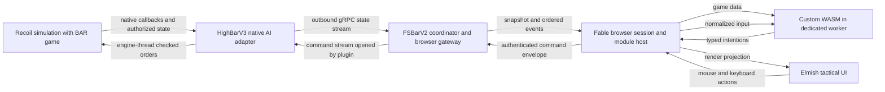
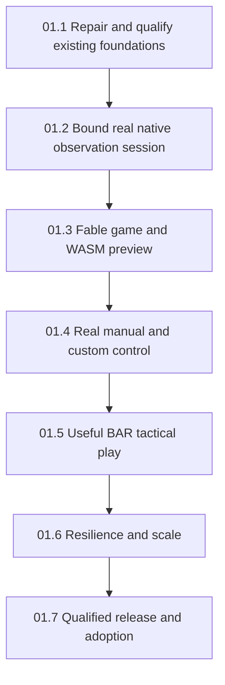

# Fable Beyond All Reason client — repository research, design and roadmap

**Feature: BARC-01. Status: proposed extension of existing products.**
Extend **EHotwagner/FSBarV2** with a Fable/Elmish tactical browser client and a custom WebAssembly
host. Retain **EHotwagner/HighBarV3** as the native Recoil Skirmish AI adapter. Game data and
normalized mouse/keyboard input reach WASM; WASM returns typed intentions; the browser host,
broker and native adapter validate those intentions before native game commands are submitted.

**The client must also run inside a generated FS.GG `fs-gg-fable-game` application.** That is an
explicit supported receiver with its own build and live-control acceptance, not merely a claim
that the client happens to compile with Fable.

This is the BAR analogue of the
[SC2 client design](2026-09-08-132131-fable-sc2-wasm-client-design-roadmap.md), grounded in the
user's existing BAR work. The engines have different integration, observation and command models.
Reuse the browser/WASM design ideas while retaining BAR's actual native boundaries.

The current request authorizes repository research, this design, its documentation PR and merge.
It does not start product implementation, upgrade another repository, publish packages, deploy a
service, or activate game control. Proposed schemas, signatures, limits and acceptance criteria
below are design candidates; this document does not publish a runtime contract or amend an accepted ADR.

Planning remains here until implementation is selected in the existing owner repositories. The
feature belongs to the independent section 15 product portfolio and is indexed from
[Unified Roadmap section 9.8](2026-09-07-154210-fs-gg-unified-development-roadmap.md#98-feature-parts-and-subroadmap-index).
It is not a prerequisite for the V0–V6 coordination sequence.

## 1. Recommended outcome

The first complete control journey is a deliberately configured local BAR match with one
HighBar-controlled AI team. A native simulating Recoil instance loads HighBarV3, which connects
outward to FSBarV2. A browser opens the broker's tactical UI, loads the bundled manual WASM
controller or a separately authored module, acquires a team control lease, and issues orders using
mouse or keyboard. A later observation shows what the game actually did.

The resulting product is a programmable tactical client, not a browser port of Recoil's simulation
or 3D renderer. Existing TUI and native visualization can remain useful operator tools. The browser
adds an accessible play surface and a portable controller interface without recreating the broker.

| User capability | Proposed behavior | Completion evidence |
|---|---|---|
| Fable client | F# compiled through Fable, Elmish application model and browser tactical rendering | Clean browser build and user journey in FSBarV2 |
| Fable game application target | The same BAR UI/WASM composition runs in a generated fs-gg-fable-game workspace | Clean scaffold, actual receiver build and live guest-derived control |
| Game data → client → WASM | Perspective-filtered snapshots, deltas/events, metadata and results reach the module | Actual native state observed by a separately built guest |
| Mouse/keyboard → WASM | Both adapters produce one ordered domain-input stream | Equivalent unit selection and target/order journeys |
| WASM → game commands | Guest output passes host, broker and engine-thread admission | Correlated guest intent, native submission and later observed effect |
| Custom modules | Import `.wasm` bytes with a declarative manifest; no client rebuild | Independent author builds and runs a controller against the SDK |
| Useful BAR play | Construction, economy, combat, repair, reclaim, queues and selected game commands | Representative live scenario with declared command coverage |
| Failure containment | Traps, stale state, revoked authority and disconnect cannot produce unchecked new orders | Adversarial and recovery journeys |
| Inspectable operation | Visible state freshness, controller ownership, command progress and unknown outcomes | User can explain a rejection and an uncertain submission |

Public lobby integration, ranked/tournament admission, multitenant hosting, arbitrary Lua execution,
module marketplaces and browser-only counterfactual simulation are outside the initial product.
They are separate extension outcomes, not assumptions hidden inside “BAR client.”

## 2. Repository research and existing work

### 2.1 Method and evidence limits

Research date: **2026-09-08**. The survey searched the authenticated user's repository inventory
and relevant FS-GG references, inspected default-branch source in the repositories below, compared
the two engine/game forks with their upstreams, and checked current open PRs in FSBarV2 and
HighBarV3. Neither of those two repositories had an open PR at inspection time. No new BAR game,
native build, broker build or product test suite was run for this documentation task.

The five vendored HighBar protobuf files in FSBarV2 were byte-compared against the inspected
HighBarV3 checkout and matched their recorded pin. That establishes source alignment, not behavioral
completeness. Historical synthetic tests, historical live failures and proposed future acceptance
remain separate throughout this document. Repository summaries and READMEs are not treated as
proof when the implementation says otherwise.

### 2.2 Lineage and reuse decisions

| Repository and inspected revision | Work found | Recommended use |
|---|---|---|
| [BARBot `76da12c`](https://github.com/EHotwagner/BARBot/tree/76da12c0771a3203907625f76b6b0c6391f5e4b5) | A small .NET 7 F# library scaffold; inspected source is a greeting module | Historical starting point, no reusable game integration claimed |
| [bar1 `7c02fa6`](https://github.com/EHotwagner/bar1/tree/7c02fa6125b7705bb01a105041bf94db734c43a0) | Lua Unit Announcer widget using creation/destruction/damage callbacks and a recoil-lua-library submodule | Small example of widget/event integration, not a remote controller |
| [BAR fork `b017ee0`](https://github.com/EHotwagner/Beyond-All-Reason/tree/b017ee0b8af10b07dd1652320a7cd21dc5453171) | CustomAI_Template with C++ exports, metadata, CMake and build documentation | Historical Skirmish AI starter; use current qualified engine/game content for the product |
| [Recoil fork `b16a1b2`](https://github.com/EHotwagner/RecoilEngine/tree/b16a1b26c28fd0a6cc9c89fa91f651923fcc5434) | .NET/F# wrapper design lineage; final upstream-relative changes are wrapper documentation and CMake, after implementation/test files were removed in history | Design prior art, not a currently delivered F# engine wrapper |
| [BarbPipes `ad7af1d`](https://github.com/EHotwagner/BarbPipes/tree/ad7af1dfe2f0512a5ec2c96108d96d4e9c126b85) | Named-pipe/JSON C++ communication managers and an F# economy example around BARb | Prior external-AI integration lessons; do not restore a second legacy transport |
| [HighBar `4a018be`](https://github.com/EHotwagner/HighBar/tree/4a018bea9e07c8713620c750392c1ff4f8802e60) | TCP/NDJSON bridge, unsynced Lua widget, synced executor gadget and Python client; custom stepping interface | Historical alternative adapter, requiring game-script integration; stepping is this bridge's behavior, not stock Recoil's browser API |
| [FSBar `8916d3c`](https://github.com/EHotwagner/FSBar/tree/8916d3c640e0e0dae816fe509d6a20bbf60f8662) | Typed F# TCP/NDJSON client and integration work for the original HighBar bridge | Earlier typed input/data/error examples; distinct from FSBarV2 |
| [HighBarV2 `ede0370`](https://github.com/EHotwagner/HighBarV2/tree/ede037019874f9dd3d1f666a62b6049e8d8ff123) | Native C Skirmish AI proxy, protobuf over Unix sockets, F# client/GameState, managers and unit-data corpus | Protocol/data/test lineage; static catalogues and coverage claims require selected-build verification |
| [FSBarV1_Archived `e3ac1d3`](https://github.com/EHotwagner/FSBarV1_Archived/tree/e3ac1d3429b45da45af3eb93d5e9489073de2258) | Typed client, SkiaSharp/Silk.NET visualization, synthetic scenes, six-tab hub, scripting gRPC and map/unit tools | Donor for interaction, glyph and test ideas; author explicitly archived it with UI/protocol concerns |
| [HighBarV3 `6648351`](https://github.com/EHotwagner/HighBarV3/tree/66483515a3333d6160bb5298e0d0bf6bb7188b4c) | C++ BARb/CircuitAI plugin with gRPC, snapshots/deltas, queues, command/admin machinery, Python/F# clients and native harnesses | Primary native producer, with route-specific gaps described below |
| [FSBarV2 `bbd3c4b`](https://github.com/EHotwagner/FSBarV2/tree/bbd3c4beb6009b32d456a921913f96042251dac0) | F# broker Core/Contracts/Protocol/App/Tui/Viz, scripting clients, coordinator pivot and synthetic integration tests | Primary product owner; add browser/WASM support and repair the existing boundaries |

The inventory also found [GRPCReview](https://github.com/EHotwagner/GRPCReview/tree/0ef942a0427dd0a00f42c89e99621ae44e672314)
and fsGRPCSkills. These are supporting gRPC experiments/guidance rather than another BAR runtime.
They do not justify another wire stack in this product.

At the comparison snapshot, the BAR fork had one unique commit and was 2,610 commits behind upstream;
the Recoil fork had 29 unique commits and was 599 behind. Those counts are dated research context,
not permanent compatibility rules. In particular, the Recoil fork's earlier F# implementation commits
do not establish an available current wrapper after their later removal. The selected native
installation must be qualified directly.

### 2.3 FSBarV2 is implemented, but its current projection is incomplete

The repository description still calls the specification/plan work in progress and its README is
a library-template README. Actual source is more substantial: `Broker.Core` models sessions,
participants, commands, snapshots and audit events; `Broker.Protocol` hosts the coordinator and
scripting services; `Broker.App` composes process/TUI/visualization behavior. Source project versions
were bumped to 0.1.2 in the inspected commit; this research did not verify published package feeds.

The [proto pin](https://github.com/EHotwagner/FSBarV2/blob/bbd3c4beb6009b32d456a921913f96042251dac0/src/Broker.Contracts/HIGHBAR_PROTO_PIN.md)
names HighBarV3 `66483515a3333d6160bb5298e0d0bf6bb7188b4c`. Its five files—common, commands, events,
state and coordinator—match the source inspected here. The direct `HighBarProxy`, `HighBarAdmin`
and callback service definitions are deliberately not part of that vendored coordinator subset.
Adding browser buttons for every direct-proxy RPC would therefore invent a route the broker does not have.

The [coordinator feature's task list](https://github.com/EHotwagner/FSBarV2/blob/bbd3c4beb6009b32d456a921913f96042251dac0/specs/002-highbar-coordinator-pivot/tasks.md)
and its [synthetic evidence inventory](https://github.com/EHotwagner/FSBarV2/blob/bbd3c4beb6009b32d456a921913f96042251dac0/specs/002-highbar-coordinator-pivot/readiness/synthetic-evidence.json)
explicitly distinguish loopback SyntheticCoordinator evidence from real BAR/HighBar qualification.
The real-game walkthrough tasks in phase 5 remain open. Reuse the synthetic regression net; do not
promote its latency figures or command-stream assertions into actual engine results.

The existing [Broker.Viz host](https://github.com/EHotwagner/FSBarV2/blob/bbd3c4beb6009b32d456a921913f96042251dac0/src/Broker.Viz/VizHost.fs)
uses SkiaViewer and detects a native graphical display. It currently ignores the viewer input stream.
Its scene concepts are useful, but this is not an existing Fable renderer or mouse/keyboard game client.

### 2.4 HighBarV3 has two materially different network routes

The direct route embeds `HighBarProxy` and `HighBarAdmin` gRPC services in the native plugin. The
coordinator route reverses the connection: the plugin is the gRPC client and calls an external
`HighBarCoordinator` server. The
[coordinator contract](https://github.com/EHotwagner/HighBarV3/blob/66483515a3333d6160bb5298e0d0bf6bb7188b4c/proto/highbar/coordinator.proto)
records the in-engine listener problem that motivated the pivot. Its current surface is heartbeat,
client-streaming state and server-streaming commands; comments about future phases are not an
implemented bidirectional SessionStream.

The [threading design](https://github.com/EHotwagner/HighBarV3/blob/66483515a3333d6160bb5298e0d0bf6bb7188b4c/src/circuit/grpc/README.md)
places game mutations/callbacks on the engine thread, with MPSC command submission and published
serialized state for worker consumption. Preserve that boundary. HighBarV3's README says built-in
BARb decision behavior is disabled so the external client is the decision authority; browser loss
must not be described as an automatic return to BARb strategy.

Historical [April 23 live reruns](https://github.com/EHotwagner/HighBarV3/blob/66483515a3333d6160bb5298e0d0bf6bb7188b4c/reports/2026-04-23-12h50min-017-live-rerun-status.md)
recorded bootstrap/resource/channel failures and no direct verified commands in those campaigns.
The later [viewer follow-up](https://github.com/EHotwagner/HighBarV3/blob/66483515a3333d6160bb5298e0d0bf6bb7188b4c/reports/2026-04-23-20h55min-018-live-run-viewer-follow-up-plan.md)
distinguished successful graphical spectator attachment from unresolved commander/state bootstrap.
Those reports do not prove every present path is broken; they do prevent treating a viewer window
or a synthetic stream as complete live command qualification. New work should reproduce a small
supported session before extending broad command campaigns.

## 3. Concrete gaps that change the design

These are findings from the inspected source, not changes made by this PR. The first product work
should turn them into targeted corrections and behavioral fixtures in their actual owners. Avoid
rebuilding infrastructure that already exists.

| Finding | Evidence and practical consequence | Proposed treatment |
|---|---|---|
| Ground-plane conversion is wrong for Recoil | [WireConvert](https://github.com/EHotwagner/FSBarV2/blob/bbd3c4beb6009b32d456a921913f96042251dac0/src/Broker.Protocol/WireConvert.fs) projects X/Y and drops Z; inverse conversion sets Z to zero. Recoil's ground plane is X/Z and Y is elevation | Explicit world/ground/grid types; asymmetric three-axis fixtures and live target verification before commands |
| Delta contents are ignored | The same converter advances sequence/frame for a delta while republishing unchanged unit state | Complete the materializer; ordered events and snapshot freshness are separate |
| A gap does not rebuild state | The converter advances its sequence on a gap; subsequent deltas can resume over the incomplete old view | Enter an invalid-baseline state until a complete accepted snapshot establishes continuity |
| Important state is lost or fabricated | Own/visible enemies collapse into one unit list; radar and many attributes disappear; team ID is projected as owner-player ID; a synthetic player zero gets placeholder telemetry | Preserve team/allyteam/perspective/presence and label unavailable values; no authoritative-looking fabricated economy |
| Features do not reach the current scripting snapshot | Core snapshots contain features, but `fromCoreSnapshot` does not serialize them in the current scripting wire shape | Extend the browser/product projection deliberately and qualify schema compatibility |
| Commands lose intent | Multi-unit orders use only the first ID; Guard omits its target; nonnumeric build definitions fall back to zero; unknown order enums become Stop | Strict typed decoding, complete target/definition mapping, explicit per-unit expansion and rejection |
| Correlation is shortened | Broker UUIDs are reduced to their lower 64 bits for native `client_command_id` | Maintain an explicit collision-checked session mapping; never claim reversible UUID identity |
| Stream identity is not fully enforced | [HighBarCoordinatorService](https://github.com/EHotwagner/FSBarV2/blob/bbd3c4beb6009b32d456a921913f96042251dac0/src/Broker.Protocol/HighBarCoordinatorService.fs) checks the heartbeat owner, but PushState lacks caller/session binding and OpenCommandChannel ignores its subscribe request | Authenticate and bind every stream to the same plugin/session incarnation; reject duplicate or stale subscriptions |
| Native coordinator ingestion skips richer validation | [CoordinatorClient](https://github.com/EHotwagner/HighBarV3/blob/66483515a3333d6160bb5298e0d0bf6bb7188b4c/src/circuit/grpc/CoordinatorClient.cpp) directly expands incoming batches into queue entries without the direct-service validator; batch/client/index provenance is not copied there | One native admission policy for all enabled routes; preserve correlation and recheck final authority on the engine thread |
| Native overload can be partial and silent to the caller | That reader drops/logs when its queue fills and breaks partway through a batch | Defined batch admission, bounded credit/queue behavior and per-command rejection/result feedback |
| Native option constants disagree | [CapabilityProvider](https://github.com/EHotwagner/HighBarV3/blob/66483515a3333d6160bb5298e0d0bf6bb7188b4c/src/circuit/grpc/CapabilityProvider.cpp) advertises `0x7`; [CommandDispatch](https://github.com/EHotwagner/HighBarV3/blob/66483515a3333d6160bb5298e0d0bf6bb7188b4c/src/circuit/grpc/CommandDispatch.cpp) passes numeric options through; upstream SHIFT is `0x20` | Repair/qualify mapping in the native producer; browser input modifiers never become raw engine bits |
| Generation presence is not enforcement | [CommandBatch](https://github.com/EHotwagner/HighBarV3/blob/66483515a3333d6160bb5298e0d0bf6bb7188b4c/proto/highbar/commands.proto) has optional generation/freshness fields, with generation enforcement described as future wiring | Implement and test lifetime/freshness checks at dispatch; do not infer safety from a field name |
| “Not visual” is emitted as radar | [SnapshotBuilder](https://github.com/EHotwagner/HighBarV3/blob/66483515a3333d6160bb5298e0d0bf6bb7188b4c/src/circuit/grpc/SnapshotBuilder.cpp) uses a non-LOS else branch for radar without an explicit radar check at that point | Audit enemy-manager retention and distinguish current radar from remembered contact; current leakage is not asserted without that qualification |
| Existing listener is a native local service | [ServerHost](https://github.com/EHotwagner/FSBarV2/blob/bbd3c4beb6009b32d456a921913f96042251dac0/src/Broker.Protocol/ServerHost.fs) defaults to loopback HTTP/2, maps native gRPC services and adds no authentication there | Keep native ingress private; add a deliberately authenticated browser endpoint and session binding |
| UI state can overstate engine state | Operator speed/pause presentation can change before engine confirmation; speed has no coordinator mapping | Show requested/pending/confirmed separately and disable unsupported operations |

Two subtler cases also belong in focused qualification: the scripting conversion uses zero as an
absent target-slot sentinel, and the command stream drain blocks through `Task.Result` inside an
asynchronous path. Validate real slot/ID semantics and cancellation/liveness rather than copying
those assumptions into the browser API. Repairs stay scoped to behavior needed by the product.

The [existing command-pipeline research](https://github.com/EHotwagner/HighBarV3/blob/66483515a3333d6160bb5298e0d0bf6bb7188b4c/reports/2026-04-27-command-storage-and-pipeline-research.md)
is a valuable detailed map of engine queues, AI wrappers and dispatch. Treat its historical source
paths and observations as research anchors, then verify the selected released engine and current
native adapter. Its existence is a reason to reuse that analysis, not to assume all paths agree.

## 4. Architecture and ownership



Recoil and the selected BAR game content own simulation truth and game rules. HighBarV3 owns the
native ABI, callback lifetime, perspective extraction and final engine-thread admission. FSBarV2
owns authenticated sessions, the materialized view, subscriber delivery, controller leases and
command routing. The browser host owns local module supervision and input sequencing; WASM owns
gameplay interpretation; Elmish owns application state and presentation.

The bundled manual controller is an actual module using the public candidate ABI. Selection,
groups, build/ability choice and gameplay targeting enter it just like a custom controller.
Commands do not originate directly from DOM handlers. An autonomous module can act on game data;
an assisted module can combine that data with user inputs. Neither receives hidden host shortcuts.

Focus, dialogs, theme, diagnostic filters and a display-only camera can remain host-local. Module
load/disarm, connection management and emergency **stop issuing commands** are host operations so
a stuck guest cannot prevent recovery. **Stop selected units**, factory cancellation and other
gameplay actions still pass through WASM. Disarm does not clear accepted game orders, pause Recoil,
or reactivate the disabled BARb decision system.

### 4.1 Reuse versus new code

| Component | Initial approach |
|---|---|
| Broker.Core/Protocol/App | Extend existing FSBarV2 responsibilities; repair fidelity/authority and expose a narrow browser-facing facade |
| Broker.Contracts | Preserve HighBar provenance and compatibility; add only the missing browser/product and native coordination contracts through their owners |
| Broker.Tui/Viz | Retain useful operator/native views; they share control policy rather than having hidden competing writers |
| Browser application | Add Fable/Elmish projects using the current FS.GG Fable provider's conventions; adapt into the existing repo rather than scaffold over it |
| WASM host and guest SDK | New product functionality informed by the SC2 proposal and S.I.R.'s host research |
| Native admission/results/metadata gaps | HighBarV3 producer changes, followed by explicit FSBarV2 pin/adoption |
| FS.GG.Net | Consider its qualified transport/lifecycle helpers where useful; the current broker already uses native gRPC and does not need a transport rewrite to adopt an org package |
| Generic browser rendering/input extraction | Later, after a useful shared slice is demonstrated; no mandatory new engine framework |

Conceptual additions include `Broker.Browser`, a browser protocol/codec boundary, a trusted module
worker loader, `sdk/barc`, a manual controller and fixture/example modules. These names are
proposals, not projects created here. Keep browser-compatible pure code separate from Google.Protobuf,
native gRPC, process launching, SkiaViewer and filesystem dependencies. Reuse ideas from the archived
hub's map/glyph/style panels without importing its native UI runtime.

The [SVG engine proposal](2026-09-07-064259-svg-game-engine-template-design-roadmap.md) and its
[incremental roadmap revision](2026-09-07-121207-svg-game-engine-roadmap-revision-proposal.md)
remain related design work. Neither SC2 nor BAR yet proves a shared browser game implementation.
Avoid a common game API that conflates SC2 tags/stepping with BAR entities/lockstep simply because
both clients use protobuf and WASM.

### 4.2 Native simulation, headless and multiplayer

Research inspected upstream Recoil
[`a53282a`](https://github.com/beyond-all-reason/RecoilEngine/tree/a53282aeebc707fd674a2161dd06b2cb49639025)
and BAR [`ae4b18d`](https://github.com/beyond-all-reason/Beyond-All-Reason/tree/ae4b18de0fe0b67ea9d885a3124391c6571c0e0c).
These source revisions support the design; no compatibility with the user's existing native binary
is claimed. Pin and qualify the actual engine executable, plugin, game content and map together.

Recoil headless runs the simulation without rendering; dedicated only relays game traffic and does
not simulate. HighBar's AI callbacks therefore require a simulating native instance, not merely a
dedicated relay. Recoil's native multiplayer protocol is lockstep input replication rather than a
browser-ready snapshot service. HighBar is the source of the proposed external observation feed.
See [headless/dedicated behavior](https://recoilengine.org/docs/guides/getting-started/headless-and-dedicated/)
and [netcode overview](https://recoilengine.org/articles/netcode-overview/).

The first session uses one selected local AI team and a reproducible opponent/scenario. A second
browser is a subscriber until it receives an explicit lease; a second plugin/player requires its
own session and team routing. A lobby account, room, game-content download and multiplayer start
script are separate adapters. BAR's
[infrastructure overview](https://beyond-all-reason.github.io/infrastructure/current_infra/)
describes an evolving lobby ecosystem; do not bake one legacy lobby into the initial local gateway.

### 4.3 Explicit Fable game application target

The inspected [fs-gg-fable-game template](https://github.com/FS-GG/FS.GG.Templates/tree/61091078337689c6ab1aac139bc03f6a07ca8f99/templates/fs-gg-fable-game)
already generates an ASP.NET Core server, Fable/Elmish browser client, explicit HTTP codecs,
SignalR connection handling, cross-runtime protocol tests and Playwright browser tests. This is
the concrete Fable game target for BARC-01.

Its [client project](https://github.com/FS-GG/FS.GG.Templates/blob/61091078337689c6ab1aac139bc03f6a07ca8f99/templates/fs-gg-fable-game/Client/Client.fsproj)
pins FS.GG.Game.Core 0.13.0, Fable.Core 5.2.0, Elmish 5.0.2 and browser bindings 2.20.0 at the
inspected source revision. The template package source declares FS.GG.Workspace.Template 0.10.0.
These are source identities, not verified published BAR support; implementation qualifies the actual
selected release and generated bytes before adopting them.

Provide an FSBarV2-owned browser composition and integration example mounted in the generated
`Client`: tactical view, session status, normalized input, worker/WASM host and intent diagnostics.
Both the product client and generated receiver consume the same compatible source/package surfaces,
protocol codecs and guest SDK. Do not create a separate BAR logic implementation for the template.

For the initial receiver composition, the generated application serves its client while that client
connects to the configured, paired FSBarV2 browser endpoint. Qualify its actual origin, authentication
and production worker/asset paths. A same-origin reverse proxy is an optional hosting composition;
it forwards to the existing broker and does not create another coordinator or command grant.
Native Google.Protobuf/process/Skia assemblies remain outside the generated Fable client.

The template's [server example](https://github.com/FS-GG/FS.GG.Templates/blob/61091078337689c6ab1aac139bc03f6a07ca8f99/templates/fs-gg-fable-game/Server/Program.fs)
uses RoomAuthority and a server tick for its toy arena. BAR composition selects native Recoil
frames and HighBar observations instead. Use a distinct game/session/protocol discriminator:
an arena credential or input message cannot authorize a BAR order, and a BAR session never enters
the arena movement/tick path. Where both demos remain present, their state and connection scopes
are separate. The browser may use qualified Game.Core preview helpers, but grid A* and a Fable
lockstep profile do not establish Recoil pathfinding or browser simulation authority.

Start with product-owned composition and a generated receiver example. Change FS.GG.Templates only
if integration demonstrates a reusable missing extension point or template defect. Any such change
needs its own producer release and receiver adoption; it does not silently replace the default arena.

## 5. Native and browser transport

### 5.1 Retain the outbound coordinator route

The native plugin establishes the coordinator channel and the existing three RPC flows:

| Flow | Existing purpose | Qualification or proposed extension |
|---|---|---|
| Heartbeat | Plugin identity, engine hash, schema version and frame | Authenticate; bind a process/session incarnation; use host monotonic liveness |
| PushState | Plugin sends a client stream of StateUpdate messages | Bind the caller explicitly; require a snapshot baseline; validate continuity and metadata completeness |
| OpenCommandChannel | Plugin subscribes; broker sends command batches | Validate plugin/schema/session on subscribe; admit one reader for the grant; retain correlation and bounded results |

The current state stream message lacks an explicit plugin identity, so a shared “last heartbeat
owner” is not a sufficient association. A selected implementation can bind authenticated RPC metadata
to an enrolled session or add a versioned initialization envelope. Whichever mechanism is chosen,
every stream must prove the same identity independently, and stale streams must not detach or write
into a newly attached session.

The direct service's Hello/static-map, callback queries, capability/admin RPCs and resume history
must not be assumed available through the coordinator. Define a supported coordinator capability
matrix. First deliver complete initial metadata and snapshot recovery. Add bounded asynchronous
query/result and command-result transport only as required; keep native dispatch results separate
from a transport write acknowledgment. Reusing an existing event field is preferable when it carries
the required identity and survives the entire route.

HighBar's strict schema handshake and the existing file hashes remain part of compatibility.
Optional wire additions need explicit capability negotiation; incompatible semantics require the
producer's appropriate versioned change. A matching `1.0.0` string alone cannot establish that two
implementations preserve generations, option bits or delta state. Record a qualified behavior/profile
identity alongside source and schema hashes.

### 5.2 Add a browser endpoint to the broker

Recommend HTTP bootstrap/assets plus one authenticated WebSocket endpoint carrying versioned product
protobuf envelopes. The endpoint adapts the broker's domain services in-process; it does not create
a second independent coordinator or publish native gRPC directly to guests. It also does not wrap
WebSocket messages and call them standard gRPC.

The existing native client-streaming and command-stream interfaces do not become browser-compatible
by generating TypeScript stubs. The official [gRPC-Web implementation](https://github.com/grpc/grpc-web/blob/master/README.md)
documents unary/server-streaming support and the absence of client/bidirectional streaming. A
separately designed unary-submit/server-stream browser API is an alternative, but choose and qualify
one baseline transport rather than maintaining two incomplete paths.

Use the Fable template's explicit codec/testing conventions and a measured Fable-compatible binary
codec. Generated F# Google.Protobuf models remain native unless independently qualified for Fable.
Cross-runtime fixtures verify optionality, integer representation and union variants across .NET,
browser code and guest SDKs. Xantham may assist an actual TypeScript binding dependency through the
existing optional workflow; it does not define the native protobuf contract or WASM semantics.

Bootstrap identifies session, perspective, supported data/command profile, control status, schema,
payload limits and assets. A browser connection can be healthy while the native session is missing,
stale or unsupported. The UI must display those separate states. Metadata chunks and subsequent
frames include dataset/frame identities so arrival across fetch and streaming boundaries cannot
activate an incomplete or mismatched map.

## 6. BAR data, coordinates and clocks

### 6.1 Preserve the native information model

| Proposed surface | Contents |
|---|---|
| Session descriptor | Match/process/plugin incarnations, engine/game/map/protocol identities, team/allyteam perspective, mode, profile and grants |
| Static metadata | Unit/weapon/feature definitions, build options, command descriptions, map grid/scale/height interpretation, known resource sites and dataset hashes |
| Materialized frame | Own-team units, permitted allied data, visual enemies, radar contacts, remembered contacts, features, economy and source frame/sequence |
| Ordered events | Lifecycle, transfer/capture, LOS/radar transitions, command dispatch/finish, economy, permitted messages and explicit gaps |
| Input batch | Ordered normalized actions, target geometry, modifiers as semantics, captured view/frame revisions and input sequence |
| Query/results | Bounded command-capability, build/terrain/path and metadata requests/results, with provenance and freshness |
| Command feedback | Host/broker/native admission, rejection, native submission, later evidence and unknown disposition |

The existing [HighBar state schema](https://github.com/EHotwagner/HighBarV3/blob/66483515a3333d6160bb5298e0d0bf6bb7188b4c/proto/highbar/state.proto)
already distinguishes snapshots, deltas, own units, visible enemies, radar blips, map features and
team economy. Preserve these distinctions rather than feeding guests the current lossy broker
dashboard projection. Add missing fields deliberately, including explicit presence where proto3
scalar defaults cannot distinguish unavailable information from actual zero.

Runtime command/build/unit definitions belong to the selected game/profile. Historical HighBarV2
catalogue counts are useful fixture material, not authority for a current BAR match. Include game
content identity in cache keys. Unknown definitions remain identifiable unknowns and do not become
definition zero, an invented building class or a fabricated icon.

### 6.2 Identity, team and visibility

Native unit and feature IDs occupy separate reusable integer namespaces. Represent an own unit by
session incarnation, kind, native ID and a verified lifetime token; feature references have their
own kind/lifetime. Complete HighBar's existing generation field rather than importing SC2's opaque
64-bit unit-tag model. Stream sequences, generations, native correlation and timestamps can still
be 64-bit, so browser codecs must preserve them losslessly.

The [native unit handler](https://github.com/beyond-all-reason/RecoilEngine/blob/a53282aeebc707fd674a2161dd06b2cb49639025/rts/Sim/Units/UnitHandler.cpp)
and [feature handler](https://github.com/beyond-all-reason/RecoilEngine/blob/a53282aeebc707fd674a2161dd06b2cb49639025/rts/Sim/Features/FeatureHandler.cpp)
recycle IDs. A late command must not act on a replacement entity. Hidden enemy lifecycle is more
limited: do not claim continuous physical identity across a period in which the observer could not
establish it. Expire or qualify a contact token when continuity is uncertain.

Player, team, allyteam, plugin instance, broker slot and browser controller are different identities.
Native callbacks distinguish AI-owned team units from friendly allyteam units and LOS contacts from
radar-visible information. A visible ally is not automatically controllable. Transfer/capture
invalidates pending unit authority, selection assumptions and commands at final dispatch. Consult
the [native callback interface](https://github.com/beyond-all-reason/RecoilEngine/blob/a53282aeebc707fd674a2161dd06b2cb49639025/rts/ExternalAI/Interface/SSkirmishAICallback.h).

Filter before data leaves the native/broker trust boundary. Distinguish visual, current radar,
last-seen and unavailable data; preserve degraded position and its provenance. A remembered
definition is not current health or exact position. A contact disappearing from LOS is not a death.
Replay/spectator/cheat perspectives are separate read-only or explicitly privileged profiles, never
an omniscient source silently reused for a participant WASM controller.

### 6.3 Coordinates, features and economy

Use explicit `WorldPosition(x, elevationY, z)`, `GroundPoint(x,z)`, grid cell and screen point types.
Keep map cell dimensions distinct from world extents. Heightmap bytes require a declared format,
scale, orientation and no-data convention before rendering or height sampling. The browser resolves
pointer targets using the camera revision at capture and a qualified terrain-height interpretation;
round trips must include unequal X, Y and Z so an axis swap cannot accidentally pass.

Recoil's [measurement documentation](https://recoilengine.org/articles/units-of-measurement/)
provides the engine unit context. The selected map/adapter still supplies actual bounds, cell scale
and sampling semantics. A minimap click, area radius, building footprint and factory rally location
must use the same world conventions; the UI may not treat raw width-cells as world coordinates.

Wrecks, heaps, trees and reclaimable objects are features, not units or buildings. Reclaim has typed
unit, feature and area targets. Destruction/replacement can create a new feature identity; resource
values and resurrection eligibility are observed attributes. Qualify the native adapter's polling/diff
events as well as engine callbacks. BAR's
[reclaim behavior](https://github.com/beyond-all-reason/Beyond-All-Reason/blob/ae4b18de0fe0b67ea9d885a3124391c6571c0e0c/luarules/gadgets/unit_reclaim_fix.lua)
is game logic, not something the browser approximates as authoritative.

Metal and energy displays distinguish current amount, storage, income, usage and derived net rate.
Construction progress, resource shortfalls and predicted completion are different values. A zero
income placeholder must not look like observed economic collapse. Estimates carry sample window,
source and freshness. Do not invent exact queue completion times from a snapshot of resources.

### 6.4 Continuous state and scheduling

Require a complete snapshot before applying deltas. Fold each supported state-changing event,
preserve ordered feedback separately and periodically reconcile with authoritative snapshots.
Events that do not contain enough replacement state trigger a bounded refresh; do not pretend the
event catalogue alone carries continuous positions and all attributes. Publish explicit attribute/frame
freshness between snapshots. Keepalives establish connection liveness, not fresh unit positions.

Duplicate/out-of-order sequences are detected. A gap, unknown state-changing variant, process restart
or failed dataset reset invalidates the baseline. Suspend command admission until a new snapshot
and compatible guest state establish continuity. A fresh snapshot repairs current state, but cannot
reconstruct missing input/event history in a stateful module; reset the module unless a qualified
checkpoint recovery contract exists.

A slow renderer may replace pending render snapshots. It may not drop raw deltas before materializing
them, or silently discard death/transfer/command-result events. Maintain bounded event/input queues
and emit an explicit gap on overflow. Discrete button/key transitions and target confirmation retain
ordering; continuous pointer motion may coalesce within a known gesture.

Native frames clock simulation; monotonic host time clocks leases/timeouts; animation frames clock
presentation. Recoil ordinarily uses 30 simulation frames per second at speed one, but pause, speed
and catch-up break fixed wall-clock conversion. The
[AI event contract](https://github.com/beyond-all-reason/RecoilEngine/blob/a53282aeebc707fd674a2161dd06b2cb49639025/rts/ExternalAI/Interface/AISEvents.h)
supplies frame and lifecycle events. There is no SC2-style RequestStep cycle in the selected
coordinator contract. The older Lua bridge's stepping mode is an alternative adapter feature that
would need independent qualification.

The native engine thread never waits for a browser/module decision. It drains bounded admitted work
at its safe update point. Paused engines need host-time liveness and a qualified control-plane path;
a pause must not prevent lease expiry or require a simulation frame that can never occur to resume.
Pause/speed support is shown only after the selected native path proves it, with requested and
confirmed states distinct.

## 7. Commands, authority and outcomes

### 7.1 Typed game intentions

The guest SDK describes permitted semantic intentions rather than exposing the complete HighBar
AICommand union. The native schema contains game-wide, Lua and cheat-related arms as well as unit
orders. Those arms are not implicitly legal because a browser claims an AI role.

| Intent family | Proposed typed targets and semantics |
|---|---|
| Move, patrol, fight | Owned unit references and a ground target; explicit replace/append policy |
| Attack/manual fire | Visible/permitted unit target or qualified ground target; no invented area radius |
| Stop, wait, fire/move state | Owned units, supported state choice and deliberate queue/state meaning |
| Guard/repair | A permitted unit or supported area target; relationship and capability checked |
| Build | Builder, runtime unit-definition identity, position, facing and explicit placement/queue policy |
| Factory production/rally | Factory capability, produced definition/count, production queue and rally semantics kept distinct |
| Reclaim/resurrect | Distinct unit, feature and area references with observed eligibility |
| Transport | Load/unload target, capacity/placement checks and a supported native command family |
| BAR custom command | Negotiated command descriptor, typed parameters and capability allowlist |

The first command slice enables only a small tested subset. Unknown kinds, contradictory targets,
unsupported modifiers and incomplete payloads reject explicitly; none defaults to Stop, unit zero
or a fabricated build definition. Multi-unit input expands into identified per-unit commands and
results. A ten-unit selection must never silently act on only one unit. Batch validation may be atomic
before enqueue, but native execution of several commands is not a rollback transaction.

Engine build commands use definition-derived negative command IDs, and native option bits carry
command-dependent semantics. At the researched engine revision, SHIFT is `32`, CONTROL `64`, ALT
`128`, META `4`, RIGHT_MOUSE `16` and INTERNAL `8`. These differ from comments/masks in HighBar's
current source. Repair and qualify the translation in the native producer; the WASM API exposes
semantic queue/modifier choices and grants no arbitrary INTERNAL-order bit. See
[native command definitions](https://github.com/beyond-all-reason/RecoilEngine/blob/a53282aeebc707fd674a2161dd06b2cb49639025/rts/Sim/Units/CommandAI/Command.h).

Queue replacement, append, insertion/removal, repeat and reject-if-busy require separate tests.
Native queue tags and callback IDs are not browser command IDs or globally stable entity identities.
Queue-edit operations bind unit lifetime and a current queue revision; a stale index cannot cancel
whatever happens to occupy that position later. The engine owns its actual order queue.

BAR-specific commands depend on game content as well as engine constants. The current game's
[custom command catalogue](https://github.com/beyond-all-reason/Beyond-All-Reason/blob/ae4b18de0fe0b67ea9d885a3124391c6571c0e0c/modules/customcommands.lua)
is behind a compatibility shim at the old customcmds path. Discover runtime capabilities and pin
the relevant game definitions; do not hard-code a historical list as complete support. A capability
report is verified behavior for the selected route, not merely a list of protobuf union arms.

### 7.2 Leases and final native admission

Start with one active controller lease per HighBar team/session. A lease binds browser session,
authenticated controller identity, module hash/generation, match/plugin/process incarnation and
authority epoch. The same rule covers the new browser, existing scripting clients and any TUI
gameplay surface. Native operator administration remains a separate permission, not a second
untracked gameplay writer. Initial advisors/visualizers have read-only data and bounded UI output.

Every command retains client ID, batch/command index, module generation, source input range, source
state sequence/frame, unit lifetime and selected freshness policy through the broker and native
queue. The broker checks shape, size, capabilities and authority. The native adapter checks again
at the engine-thread dispatch boundary, after any queue delay. Ownership transfer, entity reuse,
expired lease or changed match invalidates the command even if the broker previously admitted it.

Broker-only revocation is insufficient while native commands remain queued. Introduce or complete
native epoch/lease state and reject mismatched queued work before engine submission. Lost control
connections expire by monotonic time; avoid frame-only expiry while the game is paused. A revocation
cannot retract a command already submitted to the engine or cancel its existing orders. The UI
explains that distinction when disarming.

The [native callback implementation](https://github.com/beyond-all-reason/RecoilEngine/blob/a53282aeebc707fd674a2161dd06b2cb49639025/rts/ExternalAI/AICallback.cpp)
checks AI-team ownership on order submission, but application identity/freshness checks are still
needed before that call. Game rules can subsequently reject or remove an order—for example,
[BAR's cloak/reclaim restriction](https://github.com/beyond-all-reason/Beyond-All-Reason/blob/ae4b18de0fe0b67ea9d885a3124391c6571c0e0c/luarules/gadgets/unit_prevent_cloaked_unit_reclaim.lua).
The gateway does not replace that game authority.

### 7.3 Results, deduplication and recovery

Proposed user-visible progression is:

```text
GuestProduced → HostValidated → BrokerAdmitted → NativeQueueAdmitted
              → NativeSubmitted → LaterObservedEvidence
```

At each boundary a command can be rejected, expire or lose continuity. Keep native dispatch feedback,
engine callback results, command-finished events and observed gameplay changes as distinct evidence.
The current HighBar dispatch label `APPLIED` must not be rendered as “unit completed the order.”
Native callback submission success is not completed movement, a finished building or guaranteed
game-rule acceptance. Command-finished events do not always provide unique correlation; preserve
unknown attribution instead of inventing it.

Deduplicate the same command ID and payload within a bounded session window. Reject ID reuse with
different content. Preserve the broker UUID and its explicit native-ID mapping in the journal;
truncation alone is not a collision-free reversible mapping. A write, native admission and result
may be separated by a crash. Record unknown outcomes and do not automatically replay ambiguous
mutations when a stream reconnects. A result-retention window is a documented limit, not an
unconditional exactly-once guarantee.

The coordinator command route needs real backpressure and result feedback. Define atomic native
queue admission or explicit per-command acceptance before exposing a batch as accepted. Queue-full
must return an observable disposition, not a log-only mid-batch drop. Correlation survives the native
entry, dispatch event, materializer, browser and guest feedback path. Read-only query retries are
bounded and distinguish fresh results from cached ones.

On reconnect, establish a fresh authenticated attachment, snapshot baseline and authority epoch;
discard buffered gameplay inputs and stale outputs. Restore a module checkpoint only when code,
ABI, state schema, dataset and event-position identities match a qualified recovery contract.
Otherwise initialize a new instance and label the history break. Native release/process replacement
invalidates callback pointers, queues and previous session identity before new traffic is accepted.

### 7.4 State machines and failure behavior

Keep native connection, match, subscription, module and authority states separate. A healthy browser
WebSocket does not mean the game is running or its data is current. Useful states include native
detached/attaching/ready/faulted; match preparing/running/paused/ended; subscription synchronizing/current/gap;
module validating/ready/active/suspended/faulted/replacing; authority unassigned/granted/revoked/expired.

| Failure | Immediate behavior | Recovery |
|---|---|---|
| Guest trap, bad pointer or deadline | Discard unfinished output, revoke its generation, preserve host navigation | Diagnose, reload and explicitly rearm |
| Missing delta or unknown state-changing event | Invalidate state and dependent control | New accepted snapshot and guest continuity decision |
| Plugin heartbeat without valid state | Show attached but unsynchronized | Require bound snapshot/metadata, not a cosmetic ready flag |
| Stale or duplicate native stream | Reject its messages and prevent it detaching the new owner | Re-enroll with a new authenticated incarnation |
| Native queue full | Report rejected/partial status according to the defined admission policy | New explicit decision with current state; no silent retry |
| Connection loss after submission | Mark disposition/effect unknown | Inspect renewed state and known results; never blindly replay |
| Capture/transfer/entity reuse | Invalidate affected references and queued commands | Rebuild selection and capabilities for the new lifetime/owner |
| Hidden/frozen tab | Release held input and apply declared automation policy; independent lease expiry | Resume with current state and renewed authority |
| Native process exits | End its session and stop new submission | New native process and match incarnation |
| Recording storage fills | Mark recording incomplete without silently blocking simulation | Rotate/stop recording visibly; no complete-replay claim |

## 8. Custom WASM hosting

### 8.1 Portable candidate profile

Use a small core-wasm32 profile: one non-shared linear memory, bounded tables, no general WASI,
network, filesystem, DOM, ambient clock or arbitrary JavaScript imports. The trusted application
owns worker code. Imported artifacts are `.wasm` bytes plus declarative metadata/configuration;
uploaded JavaScript glue is not part of the baseline plugin mechanism.

The manifest declares module name/version/hash, BAR payload profile, ABI range, role, required
data/commands, memory/table/output maxima, configuration schema and optional checkpoint schema.
Validate actual imports/exports/features and finite memory/table limits against those claims before
activation. Reject an unsupported start section and unqualified threads, shared memory, Memory64
or other features in the initial SDK profile. A hash identifies bytes; it is not a safety certificate.

WebAssembly constrains guest access through its host interface, but application authorization and
resource handling remain host responsibilities. See the
[WebAssembly security model](https://webassembly.org/docs/security/). Modules compiled for a different
WASI/component/Emscripten/.NET runtime need a qualified adapter; filename compatibility is insufficient.
Fable implements the browser host and UI, not an assumed arbitrary F#-to-WASM guest compiler.

### 8.2 Candidate ABI and payload

The BAR profile follows the same small byte-ABI approach as the SC2 proposal, with BAR-specific
payloads and capabilities. This is design-level reuse, not a claim that an SC2 module understands
BAR data or that either proposed SDK is already published.

```text
memory
barc_abi_version() -> u32
barc_alloc(length: u32) -> u32
barc_free(pointer: u32, length: u32)
barc_initialize(input: u32, length: u32, output_descriptor: u32) -> i32
barc_process(input: u32, length: u32, output_descriptor: u32) -> i32
barc_shutdown() -> i32
```

All scalar exports use core `i32`; pointers/lengths are interpreted unsigned. The candidate output
descriptor is eight bytes of little-endian pointer and length. The host obtains positive-length,
four-byte-aligned input/descriptor allocations from the guest; zero means allocation failure.
An output span is guest-owned, does not overlap those host-owned spans and remains valid only until
the next guest call. The host copies validated output before calling free or any other export.
Nonempty buffers require nonzero in-bounds pointers and overflow-safe range checks.

Entry points return zero for success and defined nonzero errors otherwise; traps invalidate the whole
output. A successful process call returns an encoded envelope even with no action so consumed input,
event and frame sequences are acknowledged. Initialization may return no output while receiving
required metadata. No command authority is granted before required data and initialization complete.

Use a versioned product protobuf payload with explicit optionality and typed entity/target kinds.
The input contains session/configuration, metadata chunks, materialized observations, ordered events,
normalized inputs, asynchronous query results and feedback. Output contains consumed sequences,
typed intentions, bounded query requests, structured UI proposals and diagnostics. Do not expose a
general serialized AICommand or Lua blob escape hatch through a “custom” variant.

Serialize guest calls and avoid reentrancy. Validate the whole output before forwarding effects;
partial decoding followed by a trap has no game effect. Reacquire memory views after any call that
may grow memory, as described by the
[WebAssembly JavaScript API](https://developer.mozilla.org/en-US/docs/WebAssembly/Guides/Using_the_JavaScript_API).
Metadata and large frame chunks have revision/digest barriers; a partially assembled frame cannot
produce commands. Query requests return later results, never a synchronous network import.

Game frame, explicit host timing where needed and seeded randomness arrive as data. Shared conformance
fixtures cover .NET, Fable/JavaScript and guest SDKs, including 64-bit sequence/generation values and
presence. Start with a Rust manual controller and example; qualify a second language such as C before
claiming language portability. A guest can use autonomous policy while still receiving the same
mouse/keyboard stream and returning the same typed outputs.

### 8.3 Worker supervision and resource limits

Each module instance runs in a dedicated worker. Compilation, allocation, initialization, processing,
freeing and shutdown are all supervised outside that worker. A timeout scheduled inside the same
worker cannot interrupt its own synchronous infinite loop. External
[worker termination](https://developer.mozilla.org/en-US/docs/Web/API/Worker/terminate) has no guest
cleanup guarantee; lease revocation and host resource cleanup are independent responsibilities.

The following are **proposed initial qualification settings**, not measured BAR capacity or promised
hard realtime guarantees:

| Resource | Candidate setting | Qualification requirement |
|---|---|---|
| Active guests | One controller and up to two read-only advisors | Aggregate memory/CPU admission and per-role output checks |
| Module artifact | 8 MiB maximum | Bounded download/file read and pre-instantiation binary validation |
| Linear memory/table | 64 MiB memory and 4,096 table entries per guest | Finite declared maxima and supported feature validation |
| Guest input/output | 4 MiB input chunks, 256 KiB output | Explicit frame completion barrier; no silent truncation of armies/events |
| Metadata chunks | At most 1 MiB each | Dataset identity, total-size admission and completion digest |
| Guest process call | 20 ms target; 100 ms watchdog | Measure tail latency; discard unfinished output and revoke on timeout |
| Startup | 5 s load/compile and 2 s initialize deadlines | Candidate never blocks current host navigation |
| Action/query output | 64 per-unit actions and 32 query intents per invocation | Native queue capacity and per-team rate limits can be stricter |
| Pending input/events | 256 discrete inputs and 4 MiB ordered events per guest | Defined coalescing or visible gap/reset |
| UI work | 60 Hz display target; ordinary main-thread work below 4 ms/frame at a declared reference load | p95/p99 measurements on actual supported hardware/browser/content |

Large BAR armies, features and heightmaps make total memory and bandwidth admission as important as
per-message limits. Measure a small functional scene, a declared representative army, and a late-game
stress corpus; retain exact counts/map/settings with results. If a frame exceeds the admitted profile,
reject or explicitly renegotiate the profile. Do not quietly omit entities and call the view current.
Store bulk immutable data outside the Elmish UI model and transfer buffers between trusted workers.
SharedArrayBuffer and cross-origin isolation are not initial deployment prerequisites.

Browser workers do not supply deterministic instruction fuel or process-level isolation. The native
broker/plugin independently expires leases if the entire tab stalls. S.I.R.'s
[browser verification research](https://github.com/EHotwagner/S.I.R./blob/094c7670b91f2e4ba3a22d3fd487acf62d11b823/docs/research/browser-wasm-verification-spike.md)
already records the browser/native fuel distinction; carry it forward. A future trusted native
Wasmtime runner is a separately qualified host for unattended or adversarial execution, with its own
resource profile, not a prerequisite for the requested browser module host.

Hot replacement loads and initializes a candidate without authority, revokes the old generation at
a defined state boundary, invalidates queued old output, records submitted/unknown dispositions,
then grants the new generation and disposes the old worker. State transfer is optional and versioned.
Failed replacement stays disarmed unless the previous module still has a valid state and grant.
Any automatic fallback is an explicitly selected module, never hidden host-generated strategy.

### 8.4 Module author workflow

Provide local import, validation, readable capability explanations, configuration, load/arm/disarm,
replacement and diagnostics. Loading and granting control are distinct. Keep cached artifacts
immutable by hash and expose deletion/update choices; no silent upstream byte replacement.

Ship a manual controller, a small observe/decide example, an advisor/visualizer, an offline fixture
runner and SDK conformance fixtures. A new author must build and load a module without editing
FSBarV2 source. UI proposals are bounded typed glyphs/lines/labels and selection/targeting state,
not raw HTML/SVG. Escape text and cap diagnostic rates and overlay counts.

## 9. Tactical UI and mouse/keyboard interaction

### 9.1 Main workspace

The browser has a persistent native-session/control status strip, tactical map and minimap, selection
details, build/command palette, economy panel and a collapsible module/command inspector. Show the
controlled team, active module, state age, paused/running confirmation and lease state. Ordinary play
uses readable names and recovery actions; protocol hashes and memory statistics belong in diagnostics.

The map displays authorized terrain and resource sites, own/allied units, visual enemies, radar and
remembered contacts, construction, wrecks/features, current selection and target/queue previews.
Use distinct shapes/labels for uncertainty. A last-known contact must not look like an exact current
enemy. Local paths, economic forecasts and placement previews are advisory and visibly stale when
their source changes.

Start with DOM/SVG for controls, glyphs, selection and targeting, with measured cached image/Canvas
layers where large terrain grids make that useful. Cull off-screen objects, reuse glyph definitions,
batch changes and virtualize lists. The archived FSBar.Viz glyph/style concepts are donors after
source/licence and browser checks. Do not wait for a complete new rendering engine or pull its
Skia/Silk window backend into Fable. WebGL/WebGPU is a measured later rendering decision.

### 9.2 Input equivalence

These defaults are proposed and remappable; they do not claim complete retail BAR keymap parity.

| Intent | Mouse path | Keyboard path | Owner |
|---|---|---|---|
| Select/add/remove | Click or drag with modifiers | Unit-list focus or map cursor and confirmation | Controller interprets selection |
| Control groups | Group bar | Assign/recall number bindings | Controller state keyed by entity lifetime |
| Move/context order | Right click or palette then target | Move/context mode, target cursor, Enter | WASM intention through admission |
| Attack/fight/patrol | Command palette and unit/point | A/F/P or remapped action, cursor and Enter | Distinct supported native semantics |
| Stop/hold behavior | Palette controls | S or selected state binding | Ordinary module-generated game command |
| Queue orders | Shift while confirming | Shift plus target confirmation | Semantic append policy; no raw key-bit forwarding |
| Build | Build menu, footprint preview, facing control | Search/focus build menu, rotate/position/confirm | Runtime definition and placement capability |
| Guard/repair | Context or command plus unit | Command mode and target cycling | Typed unit relationship and ownership checks |
| Reclaim/resurrect | Feature/unit/area target | Target mode, kind selection, cursor/cycle and Enter | Explicit target namespace and eligibility |
| Factory queue/rally | Production panel and map | Focus queue/count/rally controls | Queue revision and factory capability |
| Cancel targeting | Cancel control or configured secondary click | Escape | Controller cancels pending gesture |
| Camera/minimap | Drag, wheel and minimap | Navigation/zoom bindings and minimap focus | Display-only host camera |
| Module/session UI | Panel controls | Tab/Shift-Tab and standard activation keys | Trusted host lifecycle |
| Stop issuing commands | Persistent disarm control | Dedicated remappable emergency binding | Immediate authority revocation, not an engine Stop order |

Both input adapters create domain input with sequence, modifiers as semantics, source frame, resolved
world geometry and camera revision. Keyboard targeting supports coarse/fine movement, target cycling,
snapping and a textual summary. Ability hotkeys alone do not satisfy keyboard play: selection,
placement, facing, target confirmation, module management and recovery all need complete paths.

Pointer capture preserves drag completion; cancel/lost capture/blur release held state. Keyboard
repeat applies only to intended continuous navigation. Suspend gameplay shortcuts in text fields,
dialogs and IME composition. Physical `code` bindings and logical text keys have different roles;
the [KeyboardEvent reference](https://developer.mozilla.org/en-US/docs/Web/API/KeyboardEvent/code)
explains layout-independent physical codes. Show/remap actual bindings and preserve normal browser
navigation outside the focused game surface.

On hidden-tab transitions, release input and apply a visible policy. Manual control suspends by
default; continuing automation requires explicit opt-in and remains subject to independent native
lease/liveness limits. Browser background scheduling can be throttled, as documented by the
[Page Visibility API](https://developer.mozilla.org/en-US/docs/Web/API/Page_Visibility_API).
The UI cannot promise unattended match control merely because a WebSocket remains connected.

### 9.3 Accessibility and feedback

Use semantic DOM panels, visible focus, scalable text, contrast, reduced motion and non-color-only
selection/contact states. Keep a keyboard-accessible unit list and command/build palette alongside
the tactical picture. Thousands of animated glyphs are not useful tab stops; announce meaningful
selection, target, rejection and authority changes at a bounded rate.

Preview selection and target geometry promptly, but distinguish guest-pending interpretation,
broker/native admission and observed game effect. Display per-unit failure when a group order partly
succeeds. A missing capability, stale feature, resource shortage, rejected queue edit and uncertain
submission need different explanations. Preserve focus across state refresh and list virtualization.

## 10. Deployment, trust and recordings

### 10.1 Supported deployment profiles

| Profile | Placement | Scope |
|---|---|---|
| Local companion — first | FSBarV2 serves browser assets and authenticated endpoint; local simulating Recoil runs HighBarV3 | Primary clean-install and gameplay qualification |
| Fable game workspace | Generated FS.GG Fable game client hosts the BAR UI/WASM composition and connects to FSBarV2 | Explicit supported target, qualified independently of a generic browser build |
| Static/offline site | Compiled client, examples and sanitized trace artifacts on static hosting | Fixture demo, documentation and offline analysis |
| Remote single-user play | HTTPS/WSS browser endpoint plus managed FSBarV2/native simulation | Later host/auth/network/cleanup qualification |
| Public multiplayer | Actual lobby/content/AI-hosting integration plus native participants/relay | Separate supported scope and rules; local success is insufficient |
| Trusted unattended runner | Native WASM runtime and HighBar/broker control | Separate resource/attestation profile, browser remains supervisory |

GitHub Pages can serve the compiled client, WASM files and offline recordings. It cannot execute
FSBarV2, native gRPC, Recoil or a live database service; a Pages live UI needs a separate authenticated
gateway. See [GitHub Pages hosting](https://docs.github.com/en/pages/getting-started-with-github-pages/what-is-github-pages).
The first local profile serves its own UI. Pages-to-loopback requires a tested browser/origin
configuration and is not assumed universally usable.

Keep the native gRPC listener private. Add paired local sessions, allowed origins and authenticated
browser command access; loopback alone is not authentication. Bind native streams to the enrolled
plugin and preserve process/session incarnation through reconnect. Remote mode adds TLS, ownership,
quota/rate limits and process cleanup. A modified browser can forge a declared module hash: the
gateway enforces commands and identity, not remote proof that those WASM bytes ran.

Only application-owned worker scripts execute. Uploaded modules cannot import DOM/network/filesystem
capabilities or emit executable markup. Browser tokens are not native operator/admin tokens. Map
selection, launch configuration and file export use approved identifiers/locations, not arbitrary
shell paths, synced Lua strings or unrestricted download URLs. General admin/cheat/test actions stay
outside the ordinary controller ABI even where the native union has such arms.

An optional Lua adapter must respect synced/unsynced authority rather than letting browser network
work enter deterministic simulation callbacks. Recoil documents the distinction in
[widgets and gadgets](https://recoilengine.org/docs/guides/getting-started/widgets-and-gadgets/).
The earlier HighBar bridge is a separate mod/script integration route, not an automatic fallback
that changes participant authority or bypasses a rejected native command.

Pin engine, game, map, native plugin, schema, broker, browser, SDK and guest hashes. Game/mod/map
licences and third-party notices are evaluated for the actual chosen distribution; do not assume
one repository's licence covers all assets or transplant GPL native/proto source into a differently
licensed package without resolving its obligations. This documentation task redistributes no
game binary or asset and does not select a public tournament deployment.

### 10.2 Recordings and reproducibility

Distinguish a **client trace**, a **native game demo/replay**, and **guest re-execution**. The client
trace contains authorized state/events, input, guest identity/output and command dispositions with
completeness markers. It can open offline with command submission disabled or routed to a comparison
sink. Native replay requires its compatible engine/game/map environment; it is a separate read-only
perspective. Guest re-execution repeats recorded data through exact code/profile/state identities.

Lockstep native simulation does not make the browser a counterfactual BAR simulator. A client trace
cannot determine the alternate match that would follow a different order. Browser deadlines are
wall-clock decisions and may vary; native instruction metering is a distinct profile. Missing events,
reconnect and replacement create explicit continuity breaks. Optional checkpoints include state
schema, guest bytes, input/event position and dataset identity before resumption can be trusted.

Automatically correlate native frame/sequence, broker materialization, browser dispatch, input,
guest duration/output, broker/native admission and later evidence. Record queue depth/age, event gaps,
coalescing, snapshot bytes, runtime faults and render p95/p99. Use monotonic timing within each host;
cross-host latency needs an offset/uncertainty estimate. HighBar's monotonic timestamp is not a
universally synchronized clock across remote machines.

Store full observations, chat, inputs and guest artifacts locally/privately by default with explicit
retention/export. Public fixtures are synthetic or deliberately sanitized. SQLite may index local
sessions, journals and analytics, with large traces/artifacts stored separately. A future Pages
dashboard can consume a sanitized static export; repository SQLite snapshots are published copies,
not a shared writable control store. Telemetry must not block engine callbacks or indefinitely stall
live control when storage is unavailable.

## 11. Verification strategy

Use focused tests that reveal incorrect boundary behavior. Preserve current synthetic coordinator
coverage and its honest labels; add adversarial cases the current successful path does not cover.
Native/live tests use a pinned installed game and separately identified evidence. This proposal did
not execute those tests.

| Boundary | Required product evidence |
|---|---|
| Projection | Unequal X/Y/Z round-trip; grid/world scale; own/allied/visual/radar/memory distinction; unavailable values; features reach browser/guest |
| Continuity | Snapshot plus real deltas updates units/economy; duplicate/out-of-order/gap cases; no fresh-looking frame over stale entities; new baseline/reset |
| Native identity | Heartbeat/state/command streams from wrong or stale plugin/session reject; old stream cannot close a replacement session |
| Command mapping | Multi-unit expansion, Guard target, build definition/facing, unknown-enum rejection, native append bits, queue-edit revision and typed feature target |
| Final admission | Transfer/capture, ID reuse, stale frame, lease expiry and revocation between broker enqueue and engine dispatch |
| Results/backpressure | Correlation survives coordinator queue; native overload has explicit disposition; dropped connection after write stays unknown and is not replayed |
| Guest isolation | Infinite loop in alloc/process/shutdown, trap, forbidden import, memory growth, bad descriptor, malformed/oversized output and safe overlay rendering |
| Input/UI | Mouse and keyboard complete selection/target/build journeys; IME/focus/repeat/capture/hidden-tab behavior; guest fault preserves emergency UI |
| Fable game target | Clean generated workspace builds and runs the BAR composition, including WASM workers and actual broker connection; arena authority is not used for BAR |
| Live engine | Observe → input → guest → broker → native submission → actual movement/order effect; both input methods and a separately authored module |
| BAR breadth | Build/production/repair/reclaim/queue scenarios with real capabilities and resource/game-rule feedback |
| Release | Clean supported installation/upgrade, exact compatible artifacts, private-data handling, diagnostics, offline trace and declared workload/browser matrix |

The decisive live journey selects an owned unit, resolves a world target, records the manual WASM
output, follows its ID through native queue/submission and observes actual movement. Repeat through
keyboard selection/targeting and with a custom module. The selected Fable game workspace must run
that same journey. Loading a WASM file decoratively while DOM code issues commands does not pass.

Instrument shipped browser adapters to establish the guest-only gameplay path. Negative gateway
tests reject unenveloped actions and stale/unowned leases; this does not attest the behavior of a
maliciously modified browser. Test a trap before a completed output and show no resulting command.
Test revocation after native enqueue and before dispatch, and show that the native fence—not only
the browser button—prevents submission.

Use state-machine/property tests for attachment, continuity and authority races. A bounded formal
model is an option if it materially helps verify one writer, old-epoch refusal, gap suspension and
no automatic ambiguous retry. Useful technical verification does not select a heavyweight process
or require a separate governance project.

Performance qualification identifies hardware, browser, OS, engine/game/map, unit/contact/feature
counts, guest count and event rate. Separate native simulation load, network time, broker decode,
guest work and UI drawing. Synthetic latency is not live gameplay latency. Browser support begins
with one measured Chromium configuration, then expands to Firefox and other hosts with worker,
codec, input and memory evidence; no untested platform is implied by using Fable.

## 12. Feature roadmap — BARC-01

FSBarV2 is the proposed existing product owner; HighBarV3 owns native producer changes. Only the
first three milestones form the detailed future execution window. Later milestones specify outcomes
and evidence needed for planning. The current documentation merge starts none of them.

The native gaps justify an observation/preview boundary before enabling browser commands. This is
a deliberate difference from a greenfield UI plan: the first window proves trustworthy data and
the requested host/input mechanism; the fourth milestone establishes live guest-derived control.



### 12.1 First executable window

- [ ] **BARC-01.1 — Qualify and repair the existing data/command foundation — route: routine.**
  **Depends on:** a subsequent implementation request selecting the existing FSBarV2/HighBarV3
  workspaces and their then-current baselines. Inspect current dependencies and the actual published
  Fable game provider/tool identities before choosing the browser composition.
  **Scope:** broker projection, identity/presence, delta materialization, gap state, strict command
  mapping and targeted compatibility fixtures. Narrow native producer changes address demonstrated
  option/generation/route defects; do not create another broker or reanimate legacy transports.
  **Acceptance:** asymmetric coordinate fixtures preserve X/Z/elevation; perspective, optional values
  and feature identity survive normalization; deltas change materialized state; a gap blocks dependent
  state/control until snapshot recovery. Unknown commands reject; multi-unit/Guard/Build retain all
  required targets and definitions. Record actual native option and generation enforcement verdicts,
  current unsupported capabilities and exact source/schema/binary/content candidates.
  **Handoff:** focused passing fixtures, corrected boundary model, chosen browser/Fable game composition,
  and precise native proof requirements. Maintain producer/receiver compatibility if any wire changes.

- [ ] **BARC-01.2 — Establish one correctly bound real-game observation session — route: routine.**
  **Depends on:** BARC-01.1's trustworthy state contract and access to a compatible installed game/map.
  **Scope:** use HighBarV3's outbound coordinator mode in a native simulating local engine, with every
  stream bound to the same authenticated process/plugin/session. Reuse existing headless scenarios
  and correct the smallest remaining bootstrap/state/metadata defect.
  **Acceptance:** a real match provides a complete snapshot plus correctly applied lifecycle/economy/
  visibility updates and qualified position refresh. Hidden enemy information does not reach the
  participant feed. Wrong/stale streams, reconnect and process restart cannot contaminate another
  session; a gap forces a new baseline. Browser-derived gameplay remains disabled in this milestone.
  **Evidence:** exact native/plugin/broker/game/map identities and a bounded actual trace, separate
  from SyntheticCoordinator fixtures and historical viewer attachment. Where this closes an existing
  FSBarV2 phase-5 requirement, record evidence in that owning feature rather than a duplicate ledger.
  **Handoff:** reproducible real observation session and capability/latency/size findings. Unavailable
  native assets or unresolved bootstrap blocks the live claim, not unrelated fixture repairs.

- [ ] **BARC-01.3 — Deliver the Fable game and custom-WASM preview — route: routine.**
  **Depends on:** BARC-01.2's qualified observation route, selected browser codec/transport and the
  current fs-gg-fable-game template/provider.
  **Scope:** additive Fable/Elmish client, broker browser endpoint, trusted worker host, manual and
  independently built example guests; an explicit composition running inside a generated Fable game
  workspace as well as the product's local companion development path.
  **Acceptance:** actual authorized BAR data and normalized mouse/keyboard actions reach the guest.
  Both input methods select an owned unit and resolve a correct ground target, producing equivalent
  typed intent previews. Radar, features, economy and stale status retain their meaning. A custom
  `.wasm` imports without a client rebuild. Invalid/trapped/hung modules cannot freeze navigation or
  issue native commands; focus loss releases input. A clean generated Fable game workspace builds
  and runs this preview through its actual browser toolchain with a real broker connection.
  The primary client and generated receiver consume the same BAR composition and example guest;
  receiver cross-runtime/browser checks reject arena messages or credentials in BAR sessions.
  **Boundary:** preview intentions only; native execution is not claimed. The template's arena
  simulation authority does not handle BAR state or commands.
  **Handoff:** usable Fable game receiver example, exact provider/tool/package identity, host/SDK
  fixtures and measured browser costs; expand only the next useful window from this evidence.

### 12.2 Remaining core outcomes

| Milestone | Outcome | Entry evidence | Exit examples |
|---|---|---|---|
| **BARC-01.4 — Real manual and custom-module control** | Native admission/epoch/generation checks, preserved correlation, bounded results and a narrow actual control slice | First three milestones; corrected native option/identity path and known coordinator result limitations | Stop, Move, queued Move and selected Attack through mouse and keyboard; an external module controls a real unit; revocation, stale IDs and overflow reject; the generated Fable game receiver runs the same live path |
| **BARC-01.5 — Useful BAR tactical play** | Construction, economy, guard/repair, reclaim/features, factory/rally queues, queue editing and selected BAR custom commands | Actual unit/feature/command definitions and live command-family evidence | Complete a representative build/economy/combat/reclaim scenario using either input method; explain game rejection and partial results; no silent first-unit or invented-definition behavior |
| **BARC-01.6 — Resilience, scale, SDK and recordings** | Reconnect/replacement/background behavior, late-game budgets, second-language guest conformance, advisor roles and offline/native recording workflows | Real workload and failure data, stable ABI from use, privacy/version decisions | Hung guest leaves UI usable; stale queued work never acts; unknown outcomes never auto-retry; a new author imports a module; offline trace needs no native game; measured frame/stream limits match supported claims |
| **BARC-01.7 — Qualified opt-in release and adoption** | Compatible browser/broker/native artifacts, clean install and upgrade, Fable game receiver support, docs and independent operator walkthrough | All core journeys plus actual release identities, supported engine/game/map matrix and release authority | Clean local and generated Fable game installations reach live custom-module play with both inputs; upgrade preserves user modules/configuration; unsupported combinations give actionable diagnostics; published artifacts and receiver pins match |

The first ready window is not feature completion. BARC-01 requires actual browser/WASM-to-native
commands, useful BAR play, independent custom module authoring, both input methods, the explicit
Fable game target and failure containment. A read-only viewer or a fixed manual guest alone is insufficient.

### 12.3 Optional extensions

| Extension | Entry evidence and additional outcome |
|---|---|
| Remote single-user / Pages live UI | Select actual host/origin/auth model; qualify HTTPS/WSS, process cleanup, browser restrictions and asset subpaths |
| Public lobby/multiplayer | Select current lobby/runner/content contract and rules; prove team/AI hosting and perspective separation with actual native participants |
| Multiple independent teams/plugins | Explicit per-stream enrollment/routing and resource boundaries; no global singleton-owner inference |
| Multiple command writers | A useful case beyond advisors; explicit unit partition, conflict ordering, fairness and lease revocation |
| Trusted native WASM runner | Need for unattended or metered execution; same semantic corpus with separately documented native resource/attestation guarantees |
| Richer guest runtimes/checkpoints | Stable state semantics and author demand; adapter/resource/migration qualification without arbitrary JS glue |
| Module catalogue/distribution | Successful local author workflow; immutable artifacts, provenance, explicit capability/update choices |
| Generic Fable/WASM template capability | Concrete reusable slice; producer publication, opt-in clean scaffold and upgrade evidence before any shared default discussion |
| SQLite-fed public dashboard | Defined sanitized dataset and retention; build-time export/static viewer, independent of live control |

Do not put remote hosting, marketplace work or speculative shared engine extraction on the local
product's critical path. Estimate delivery time after the early native and Fable game proofs expose
the actual installation/compatibility workload; this design invents no calendar commitments.

## 13. Decisions, ownership and workspace effects

The recommended owner is the existing FSBarV2 repository, not a new FS.GG.BAR.Client repository.
Its browser/WASM surface is additive product work. HighBarV3 retains native ABI/threading/schema
ownership. The user-selected FS.GG Fable game target adds an explicit receiver qualification path;
it does not require rewriting every generated arena or creating another authoritative simulator.

| Open decision | Preferred direction | Evidence that can change it |
|---|---|---|
| Native supported set | Pin an actually working local simulating Recoil/BAR/HighBar combination | Clean setup and real state/command evidence |
| Browser transport/codec | HTTP bootstrap plus product WebSocket/protobuf adapter in FSBarV2 | Fable game cross-runtime fixtures, bandwidth/bundle/latency measurements |
| Fable game composition packaging | Product-owned adapter/example first, compatible with the real current template | Clean generated receiver needs a justified reusable producer change |
| Guest language | Rust first, C conformance second | Actual toolchain artifact/import profile and independent author success |
| Native queries/results | Extend the coordinator's required subset through HighBarV3 | Direct-service route qualification or a smaller existing event path proves sufficient |
| Visibility/contact continuity | Conservative unknown/last-seen semantics | Native enemy-manager and callback evidence supports a stronger claim |
| Renderer | DOM/SVG and measured terrain layers | Declared late-game profile warrants another backend |
| Recovery | Reset after a gap/replacement unless qualified checkpoints exist | Complete compatible state/event recovery corpus |
| Native versus browser execution | Browser host for interactive modules; native host only when justified | Unattended/adversarial requirements demand stronger scheduling/isolation |

This design merge changes no installed runtime, public ABI, template default, provider package,
generated workspace or existing product dependency pin. BARC-01.3 is the first source milestone
adding the opt-in browser/Fable game composition. BARC-01.4 first enables its guest-derived native
gameplay. BARC-01.7 proves published clean installation and existing-installation upgrade separately.

The Fable game receiver records its actual scaffold tool/provider release and package pins. Product
examples or adapters are published from their owning source only when release work is authorized.
The release journey uses no sibling checkout references or unpublished local package substitution,
and verifies production asset/worker loading and reconnect in the generated receiver itself.
If a shared template change is necessary, FS.GG.Templates owns that producer change and publishes
it before receiver adoption. A source merge or copied local template is not proof that an installed
scaffolder creates the working client. Upgrades preserve unrelated arena/product code, user modules,
configuration and explicit lifecycle choice; BAR mode is opt-in, with no fleet-wide default change.

Follow [Unified Roadmap section 9.9](2026-09-07-154210-fs-gg-unified-development-roadmap.md#99-when-new-workspaces-change)
for source/publication/materialization/adoption distinctions. Existing HighBar/FSBar source and
historical task evidence retain their owners. This document supplies the new browser feature's
continuation, not a second completion authority for every old specification.

## 14. Programme logging and completion boundary

Future implementation uses the ordinary routine route unless the user explicitly selects another
process. Resume the valid BARC-01 window without another initial planning pass. The selected
Sol-medium implementation worker receives the actual owning repository's installed work-roadmap
entry point, current baselines, BARC-01.1–01.3 and the bounded stop. The present documentation task
does not launch that implementation or authorize protected publication/deployment.

Use automatic runtime/provider/CI observation for feature/item/attempt lineage, model/effort, useful
implementation/tests, administration, waits, repairs and delivery outcomes. Product game traces
are separate from programme accounting. Missing population or activity attribution stays unknown;
the [local telemetry store work](roadmaps/utel-local-telemetry-store.md) does not itself prove complete
collection or low bureaucracy for these product repositories.

Preserve the narrow **10% bureaucracy ceiling**, excluding useful test execution. Count each
distinct whole item above 10% once; good items do not reset the cumulative counter. After 15 cumulative
breaches or any item above 25%, make one aggressive intervention targeting a return toward 5%.
Reset only after a deployed and verified improvement. Do not add manual duplicate ledgers or
reconstruct unavailable usage to manufacture a compliance claim.

The documentation delivery is complete when this proposal and discovery links are merged in
FS-GG/.github. The product is complete only after BARC-01.7's real qualification, including the
explicit Fable game target, independently authored custom WASM, both input methods, useful BAR
commands and honest failure/recovery behavior. No implementation completion follows from this PR.
