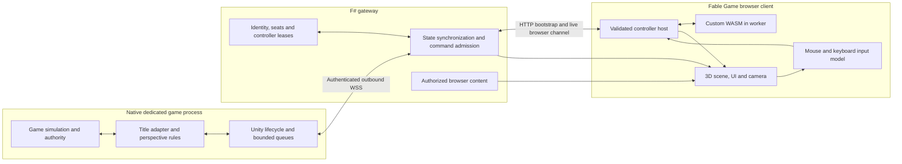

# Unity native shim and full Fable replacement client

Research and proposal dated **2026-09-08**. Feature identity: **UNITYC-01**.

## 1. Recommendation and delivery boundary

Build a reusable native Unity bridge and a complete browser gameplay client on the
**FS.GG Fable game** foundation. Keep the original game's dedicated server and simulation native.
Load a small C# shim inside that process, attach a game-specific adapter, and connect it to an F#
gateway. Compile the browser application from F# to JavaScript with Fable. Run custom controller
modules in browser WASM workers. The engine, shim and whole client do **not** need to become WASM.

The intended flow is:

**Game state → native perspective projection → gateway → Fable client → WASM controller.**
**Mouse/keyboard input → Fable input model → WASM controller.**
**WASM intent → host validation → gateway → native validation → game command → observed result.**

“Full replacement” means that a player can enter, play and finish the declared supported game mode
with our own rendering, camera, UI and input, while the original graphical client is closed. An
observer dashboard, RCON panel, remote video stream or automation layer over a running original
client does not meet that requirement. A native dedicated simulation process is explicitly part of
the architecture. Offline access to an authorized local asset installation can be qualified separately.

The recommended sequence is an owned, meaningful Unity reference game; early admission research
for **Nebulous: Fleet Command**; a complete client for the first admitted external title; and a
second unrelated external Unity title that demonstrates actual reuse. Nebulous is a strong tactical
candidate, but the public evidence reviewed here does not establish an external player session or
complete server-side observation/control API. Its admission remains an implementation experiment.

The reusable core should cover lifecycle, connection identity, queues, framing, state synchronization,
controller hosting and much of the browser shell. Player admission, visibility, gameplay commands,
prediction and presentation remain title-specific. Unity is an integration family, not one common
multiplayer protocol. Unreal is a later portability consideration; it is not a second implementation
track in this feature.

This document delivers research and a proposed design. No Unity server, Nebulous installation,
native shim, browser client or WASM integration was executed for this research. Repository inspection
and upstream source inspection are evidence about source, not product qualification. All message
shapes, limits, names and project boundaries below are **candidate design**, not installed APIs,
schemas, operator commands or changes to an accepted shared contract.

The feature belongs to the independent section 15 product portfolio of the
[Unified Development Roadmap](2026-09-07-154210-fs-gg-unified-development-roadmap.md), with its
[section 9.8 feature index](2026-09-07-154210-fs-gg-unified-development-roadmap.md#98-feature-parts-and-subroadmap-index)
and [section 9.9 workspace effect](2026-09-07-154210-fs-gg-unified-development-roadmap.md#99-when-new-workspaces-change).
It is not an additional V0–V6 migration prerequisite. The
[SC2 design](2026-09-08-132131-fable-sc2-wasm-client-design-roadmap.md) and
[BAR design](2026-09-08-134900-fable-bar-wasm-client-design-roadmap.md) retain their own requirements
and evidence. This proposal reuses their native bridge and module-host ideas without claiming their
protocols or implementation are a Unity adapter.

## 2. Research method and confidence

Research combined official engine and networking documentation, publisher/server/modding sources,
pinned upstream code, and existing FS-GG source. Each finding is interpreted narrowly:

| Evidence class | What it establishes | What remains unproved |
|---|---|---|
| Official engine/package documentation | Documented behavior for that version or documentation stream | Compatibility with an arbitrary game's shipped build |
| Publisher or framework modding documentation | A described server or extension route | A complete external player, entitlement or rendering API |
| Pinned source inspection | Actual code and declared dependencies at a revision | Successful compilation, installed publication or live behavior |
| Architectural inference | A reasoned design consequence of those facts | Measured feasibility, performance or feature completion |
| Proposed acceptance experiment | The evidence implementation must collect | A result before that experiment runs |

Sources were accessed on 2026-09-08. Several Unity manual pages identify Unity 6.3; some dedicated
server material is versioned 6.0. The NGO documentation inspected is 2.7, while the pinned NGO source
below is the current development branch. These are intentionally separate research references,
not a tested dependency combination. Historical Nebulous guides are explicitly dated below.

The principal result is conditional feasibility: a native shim removes the need to reproduce a game's
wire protocol in JavaScript, but it does not remove the need to establish a valid participant, preserve
game validation, reconstruct its presentation or support its actual control model. There is no
evidence here for a universal drop-in replacement client for all Unity games.

### 2.1 Upstream research snapshots

These default-branch revisions were resolved during research. Implementation must select released
versions or deliberately qualified source builds and preserve their exact artifact identities.

| Project | Inspected branch and revision | Purpose |
|---|---|---|
| [Netcode for GameObjects][ngo-source] | develop-2.0.0, `3f5d7a8f8816c888880c7f21b63c911ccdcdbdce` | Network object visibility and connection lifecycle |
| [Mirror][mirror-source] | master, `0eab9bdf779fa0e5d21bf751a43ab606aec80a5b` | Native player creation, ready state and command ownership |
| [FishNet][fishnet-source] | main, `dad140e6f3016402602825d2ade2faadd8786397` | Separate networking family; observer/prediction documentation |
| [BepInEx][bepinex-source] | master, `5b766a3b7f6c164d4798924a93f3acf4db769d06` | Loader ecosystem; backend-specific qualification |
| [NebulousModKit][neb-kit] | main, `531add484d4bd82e65d61ae920df256e0a7e4194` | Historical mapping/mod assembly example; last commit 2022-02-26 |
| [UnityGLTF][unitygltf] | main, `f0295f76355a3dbc6a9588ac3eb86f53531c4dd1` | Asset export/import candidate and format limitations |
| [ML-Agents][ml-source] | develop, `3ecb446f75d1e7400eb404c562dc005d3164cffc` | Observation/action prior art, not a complete-client dependency |

### 2.2 Engine and runtime findings

| Finding from primary sources | Consequence for this proposal |
|---|---|
| Unity's support page lists **6.3 LTS through December 2027** and 6.0 through October 2026. [Unity support][unity-support] | Use 6.3 LTS as the reference-project starting line; pin its actual patch at admission. Existing commercial games keep their own shipped engine version |
| Dedicated Server builds remove rendering-related work and can remove GPU-only asset data, including non-readable mesh/texture data. [Server optimizations][server-build] | Treat state and browser content as separate products. A headless server is not a complete source of visuals |
| Mono and IL2CPP have different execution/build paths; IL2CPP converts managed code ahead of time to native code. [Scripting backends][backends] | Separate loader and interop artifacts where necessary; do not assume a Mono reflection hook survives IL2CPP |
| Unity 6.3 exposes .NET Standard 2.1 or its documented .NET Framework compatibility profile. [API compatibility][dotnet-profile] | Keep the native shim's dependency closure small and qualified. A net10 gateway assembly is not a Unity runtime dependency by default |
| The linker analyzes code present at build time; preservation annotations can retain otherwise stripped code. [Managed stripping][stripping] | Test built players, including required AOT/stripping configurations. Editor success does not qualify shipping reflection or serialization |
| Unity has a defined Player loop, but equivalent callbacks on different object instances are not generally ordered. [Execution order][execution-order] | Choose an explicit game-authority scheduling boundary. An arbitrary MonoBehaviour Update callback does not prove a coherent snapshot |
| Unity AssetBundles carry platform-specific non-code assets for Unity to load. [AssetBundles][assetbundles] | Build a browser asset pipeline; do not treat an AssetBundle as a Babylon scene or a portable game assembly |

### 2.3 Networking is a set of adapter families

| Family | Observed facilities | Integration decision |
|---|---|---|
| Netcode for GameObjects | Connection approval, network object ownership/visibility, RPCs and anticipation. [Approval][ngo-approval], [visibility][ngo-visibility], [RPCs][ngo-rpc] | Preferred controlled-reference family, subject to exact package qualification; use explicit game-owned external-participant support |
| Mirror | Connection/player identity, ownership-checked commands and configurable interest management. [Commands][mirror-commands], [interest][mirror-interest], [source][mirror-source] | Good candidate for a second adapter family; preserve native ready/authority semantics |
| FishNet | Its own NetworkObjects, observers and prediction facilities. [Observers][fishnet-observers], [prediction][fishnet-prediction] | A distinct optional family; add only for an admitted game |
| Netcode for Entities | ECS ghost replication and a separate prediction architecture. [Ghosts][ecs-ghosts], [prediction][ecs-prediction] | Defer from the first GameObject-oriented core; an ECS adapter needs its own scheduling and state access |
| Photon Fusion | Distinct server, host and shared topologies. [Topologies][fusion-topology] | Admit the actual topology and provider path; “uses Photon” does not prove a dedicated authority hook |
| Custom/older middleware | No common contract established by Unity engine identity | Use a title adapter against supported game authority, or fail admission |

NGO's anticipation documentation expressly distinguishes anticipation from a complete prediction and
reconciliation loop. Therefore a generic Fable predictor cannot be promised merely because the server
uses NGO. Direct vehicle/avatar control requires independent title-specific work and latency evidence.
[NGO anticipation][ngo-anticipation]

Source inspection sharpens the participant problem. Mirror's `OnCommandMessage` checks readiness,
target identity and required ownership before dispatch. `AddPlayerForConnection` establishes the
connection/player relationship and related lifecycle. Calling a private gameplay method directly does
not reproduce those checks. NGO similarly maintains transport/client connection state alongside
network objects. Our adapter must enter a supported game authority path and reproduce every
necessary external-participant check explicitly, rather than fabricate a client ID or trust a browser's
claimed owner. [Mirror source][mirror-source], [NGO connection source][ngo-connection]

### 2.4 Mod loading is necessary but insufficient

For an owned Unity project, prefer an ordinary package/assembly integrated at build time. For an
external title, prefer its official code extension route. BepInEx can be an optional, qualified loader;
its master Mono and IL2CPP guides currently point to bleeding-edge builds. Historical stable 5.x
instructions and current IL2CPP instructions must not be conflated. [Mono installation][bep-mono],
[IL2CPP installation][bep-il2cpp], [historical 5.4.16 guide][bep-old]

A loader proves code can execute, not that a usable player can join. It also does not make that code
sandboxed: the native shim and title plugin execute with the server process's authority. Keep native
plugins operator-selected and pinned. User controller modules use the separate browser WASM host.
Per-build hooks are acceptable when supportable, but they must have explicit compatibility probes,
failure behavior and a maintenance owner. A browser-exposed generic reflection endpoint is excluded.

## 3. Candidate games and admission strategy

### 3.1 Shortlist

The ranking is a proposal based on integration evidence and tactical relevance, not a popularity
measurement or a claim that replacement clients already work.

| Candidate | Evidence established | Missing proof | Recommendation |
|---|---|---|---|
| Owned small tactical Unity game | We can define its external-participant and content contracts | Actual native build, meaningful gameplay and complete browser journey still need implementation | First reference and regression fixture |
| **Nebulous: Fleet Command** | Publisher-associated dedicated-server guide and modding guide describe headless hosting and code/content mods; historical mod kit exists | Current binary/backend/netcode/loader tuple; player/session entry; complete sensor/order/feedback access; browser assets | First external-title admission candidate because it matches the requested tactical experience |
| **Unturned** | Publisher documents a maintained Rocket-derived server plugin module and server module loading | Complete external participant, content and gameplay control, including actual movement authority | Strong fallback or second-title investigation; code plugin evidence is clearer than replacement-client evidence |
| **Rust** | Publisher documents dedicated hosting; Oxide documents C# server plugins | Client-free authenticated participation, full gameplay semantics/prediction/assets and compatible service requirements | Defer; server modding alone does not clear these gaps |
| **V Rising** | Publisher maintains dedicated-server instructions | Current extension/runtime path, external participant, simulation access and presentation coverage | Defer; do not infer complete support from a dedicated-server repository |

Primary title sources: [Nebulous server guide][neb-server], [Nebulous modding guide][neb-mods],
[Nebulous mod kit][neb-kit], [Unturned server plugins][unturned-plugins],
[Unturned launch/module options][unturned-options], [Rust server guide][rust-server],
[Oxide development guide][oxide], [V Rising server instructions][vrising].

The Nebulous server guide was last updated **2023-04-18** and the modding guide **2022-03-02**.
The latter's Unity 2020.3.19f1 setup is historical guidance, not this document's assertion about the
current shipped game. The server guide describes allowlisted mods and modded fleets, but it does
not specify an external player protocol. The mod kit's old map/control-point example likewise does
not establish one. A current installation must resolve these uncertainties before adapter commitment.

Unturned provides an instructive caution: its publisher's launch-option documentation describes a
flag that disables vehicle movement validation and anticipates possible future authority changes.
This demonstrates why a dedicated server alone is insufficient evidence that every movement rule
lives server-side. This proposal does not use that flag; admission must preserve validation and
establish the actual selected build's control model. [Unturned options][unturned-options]

### 3.2 Title admission record

Before implementing a commercial title's client, capture a compact, reproducible qualification packet
under the future product owner. It must answer these questions with live evidence:

| Admission dimension | Required evidence | Failure consequence |
|---|---|---|
| Build and loading | Exact server/content hashes, OS/architecture, Unity/backend, loader/interop pins; shim executes in the actual dedicated process | That tuple is unsupported |
| Participant | A game-supported playable identity/team/avatar or fleet joins without the original graphical client; required platform/session credentials are respected | Observer/bot-only integration remains a separately named mode; no full player claim |
| Authority | One allowed action changes native game state and one illegal action is rejected by the real validation boundary | Do not grow a command adapter around unchecked mutations |
| Entitlement | Two participants receive independently correct visible/private/contact state; hidden fields/events are absent | No competitive player release until the projection is sound |
| Lifecycle | Ready/loading, spawn, death/destruction, respawn/round end, disconnect and restart have identifiable transitions | Scope and repair the missing transition before complete-client qualification |
| Content | Gameplay-significant geometry, assets and cues have an available authorized conversion or replacement path | A minimal visualization may continue as a fixture; title completion remains blocked |
| Control model | Orders, direct input, prediction and client-only mechanics are inventoried | Unsupported direct control cannot be silently replaced with click-to-move |
| Native result oracle | Match/actor values and outcomes can independently confirm browser actions | Transport success is insufficient |

Use a bounded investigation with a recorded stop condition. If Nebulous lacks a workable participant
route or essential information, retain the findings and investigate the next candidate. The controlled
reference can continue independently. Neither success on the reference nor an impressive Nebulous
observer scene may be relabeled as an admitted full Nebulous client.

### 3.3 Meaningful reference scenario

Create a small two-side tactical skirmish in an owned Unity 6.3 LTS project, using a qualified NGO
release and a server-authoritative game model. Suggested scope: approximately 32 controllable units,
terrain/occlusion, selectable units, move/stop/attack orders, health and cooldowns, private information,
a capture objective and a result/restart screen. Use simple owned meshes and sounds so the full
content pipeline can ship. These are design parameters, not measured capacity.

The native reference exposes a deliberate external-participant API. External and native test
participants enter the same game-rule services for permissions, movement and combat. Browser users
must be able to complete the entire small game with mouse and with keyboard-accessible controls.
The reference's purpose is an inspectable authority and lifecycle oracle; two cubes moving over a
socket are only an earlier development probe.

## 4. Existing FS-GG work and ownership

The fresh feature-planning pass inspected these local source revisions. Package availability,
installed provider activation and Unity compatibility were not verified by that inspection.

| Source | Useful existing work | Boundary of the evidence |
|---|---|---|
| [Templates Fable game README][local-template] at `61091078337689c6ab1aac139bc03f6a07ca8f99` | Fable/Elmish/direct-DOM client, typed HTTP bootstrap, official SignalR binding, explicit versioned Thoth codecs and cross-runtime/browser tests | A small grid game scaffold, not a Unity gateway or full 3D client |
| [Fable game movement][local-movement] at the same revision | Game.Core 0.13.0 path preview; authoritative positions come from snapshots | Preview does not establish physics prediction or WASM input routing |
| [Fable bindings README][local-bindings] at the same revision | Narrow Babylon.js core/loaders 9.19.0 corpus, including scene/math/camera/light/box/glTF and emitted-Fable qualification | Good proposed 3D binding donor; not a complete renderer or Unity importer |
| [Game.Core README][local-game] at `24f79084fdd289f34387f91b1d4398c78fde16eb` | Deterministic primitives and a bounded Fable source profile | Does not reproduce Unity PhysX, title combat or fog semantics |
| [Net README][local-net] at `e66d38d7ed7fb5cc36984f4d33434bd9c6eaa802` | Domain-neutral .NET transport seams | net10 source; no demonstrated Unity/IL2CPP or browser dependency closure |
| [Rendering keyboard project][local-rendering] at `86102999e7f60a494bed74e825e36b284fef6d62` | Input/keymap mechanisms and concepts | Its Scene/native dependencies do not establish a browser package profile |
| [S.I.R. browser WASM result][local-sir] at `094c7670b91f2e4ba3a22d3fd487acf62d11b823` | Browser integer-WASM experiments and limits of deterministic fuel parity | Browser watchdog evidence cannot inherit native Wasmtime execution guarantees |
| [BAR repository research](2026-09-08-134900-fable-bar-wasm-client-design-roadmap.md) | Native shim → F# broker architecture, lifetime/freshness/queue concerns, explicit synthetic/live evidence distinctions | BAR/Recoil contracts and outstanding repairs remain in their own products |

The inspected [Fable provider declaration][local-provider] identifies
`FS.GG.Workspace.Template.FableGame`, short name `fs-gg-fable-game`, package
`FS.GG.Workspace.Template::0.10.0`, minimum SDD `1.4.0-preview.1`, and default lifecycle `sdd`.
It describes itself as not registry-active. These are source declarations; implementation must inspect
the live installed/provider path before asserting its current activation or published bytes.

Use one provisional product owner/workspace, working name **FS.GG.Unity.Client**, until the actual
repository is selected. That name is not an existing repository or package commitment. Initially keep
the shim, reference game, title adapters, gateway, Fable client, module SDK and qualification harness
together. Project/assembly seams are useful immediately; separate repositories are justified later
only by real ownership or demonstrated reuse.

| Owner | Responsibility |
|---|---|
| Native game/title | Game identity, simulation, collisions, combat, inventory/economy, information entitlement and final legal effects |
| Unity product owner | Initial bridge/runtime, title adapters, F# gateway, browser composition, WASM SDK and end-to-end evidence |
| FS.GG.Game | Any independently reusable and qualified game primitives extracted later |
| FS.GG.Rendering | Reusable presentation/input mechanisms with proven target compatibility |
| FS.GG.Net | Transport-only mechanisms, without title rules or assumed native runtime compatibility |
| FS.GG.Templates | Explicit provider/template composition, installed clean creation and upgrade support |

The selected Unity composition replaces the template's sample grid authority. Running both the grid
simulation and Unity as competing sources of actor truth would produce an incorrect architecture.
Retain useful scaffold lifecycle and tests while replacing the sample game boundary explicitly.

## 5. Runtime architecture

### 5.1 Seams that can be reused

The Unity core owns process/scene lifecycle, connection incarnation, bounded dispatch/capture queues,
serialization boundaries and native instrumentation. A networking-family adapter can help translate
connection, ownership and observer primitives. The title adapter owns their gameplay meaning and
supplies stable domain data. Avoid an API that serializes every GameObject/component automatically:
it would expose irrelevant implementation details, leak hidden state and couple browsers to unstable
assembly layouts.

The gateway owns authenticated browser sessions, role and control grants, message admission,
materialized perspective state, resynchronization, browser delivery and diagnostics. It is not an
alternate game simulation. The browser owns rendering, input interpretation, local UI, controller
execution and qualified presentation prediction. The WASM module sees explicit observations and
input, returns typed intents and optional bounded overlays, and never obtains native object pointers.

Game-specific families extend a common envelope. A fleet order, an inventory transaction and a
vehicle throttle sample may share identity, freshness and result machinery while retaining different
payloads and rules. The shared core should require only capabilities actually common to admitted
games. It should not force every title into an RTS unit abstraction.

### 5.2 Native loading and thread boundary

For the reference, package the shim as ordinary C# code with explicit assembly references and
registration of its title adapter. Choose the smallest compatible Unity API profile and test its actual
TLS, codec and allocation behavior in the built server. External adapters supply their documented
loader bootstrap, interop mapping and build fingerprint. A mismatch leaves the adapter unavailable
with an actionable diagnostic; it must not guess offsets or continue issuing partially understood calls.

Keep engine object access on the required engine thread and schedule. Background transport work
only handles immutable value DTOs or owned serialized buffers. Unity documents main-thread
requirements for many APIs and explicit background/main-thread continuation behavior; asynchronous
code does not by itself make engine access safe. [Awaitable continuations][awaitable]

Choose the title's actual authoritative frontier, for example its command-processing phase followed
by simulation completion. Drain a bounded number of intents before that phase, validate again there,
then capture permitted state after the relevant game update. Record physics step, network tick and
capture sequence separately. Do not assume Update, FixedUpdate, network ticks and browser frames
run at the same rate or that a server supports deterministic external stepping.

Use explicit lifecycle registrations, not unbounded scene scans each frame. Track scene epochs,
spawn/despawn and pooled object lifetimes. A recycled Unity instance identifier must receive a new
protocol lifetime. Dispose registrations and queued buffers on unload, server restart and adapter
replacement. Domain-reload-disabled Editor behavior and actual player teardown require separate
checks when those workflows are supported.

For large snapshots, either copy the relevant immutable state at one frontier before chunking or
use a title-supported consistent snapshot mechanism. Reading different actors over several frames
and labeling the result as one authoritative tick is invalid. If capture cannot be coherent, its explicit
per-item freshness model must be supported by consumers; the first implementation should prefer
small coherent perspective snapshots.

### 5.3 Participant and controller identity

Maintain distinct identities for browser authentication, any platform account, native game participant,
team/perspective, controlled actors and controller lease. A browser session token is not a Steam
credential or a native multiplayer connection. The adapter must bind these identities through the
game-supported route and retain any game-required ready, ownership and lifecycle state.

The reference can implement an explicit external-player service and direct it into the same rules as
native participants. A commercial title may require a code-supported external participant, a supported
server-side player controller or cooperation from its developer. Determine which path actually works.
A bot slot is acceptable only as an explicitly selected playable product mode with its limitations
documented; it does not automatically establish parity with a human player slot.

Grant one gameplay controller lease per declared participant/entity scope. An observer or advisor
module can read only its permitted perspective and cannot write. Multiple tabs or modules may not
silently race for the same scope. Lease transfer advances a generation, fences old queued output
and requires the receiving controller to have a current baseline. Revocation can block future dispatch;
it cannot reverse orders already accepted by the game.

Use an explicit session progression: connected → authenticated → participant admitted → baseline
ready → controller granted. The native adapter installs the control generation and acknowledges it
before the gateway reports that controller as armed. For revocation/transfer, the gateway immediately
rejects further old output and obtains a native fence acknowledgement before claiming that queued
old-generation work can no longer dispatch. A request still in transit is not an installed fence.
If the native channel is unavailable, its local lease expires independently; the UI reports pending
revocation or expired connectivity until the actual authority outcome is known. Losing the channel
never grants a new controller optimistically.

## 6. State, visibility and synchronization

### 6.1 Perspective is enforced at the native boundary

Project state before it leaves the trusted game process. Network observer sets can be an input to
that projection, but they are not a complete rule for fog, sensors or shared intelligence. NGO's
documented default permits visibility when no custom callback is supplied; Mirror likewise has
explicit interest management mechanisms. Neither substitutes for title-specific entitlement.
[NGO visibility][ngo-visibility], [Mirror interest management][mirror-interest]

Represent at least the distinctions required by the title: currently visible entity, sensor contact,
remembered information and unknown. A radar contact may have an uncertain position or classification
without a globally identifiable entity ID. Reveal only fields supported by that contact. Preserve age,
confidence and uncertainty instead of filling absent fields with exact server values.

Filtering includes transforms, targeting data, component values, spawns/despawns, damage events,
audio cues, overlays, debug logs, recordings and asset metadata. Do not prefetch a unique hidden
enemy hull only when it spawns if that reveals its existence through a network request. Prefer public
catalogue prefetch or a policy-equivalent content strategy. Observer/admin perspectives use separate
grants; switching perspective clears state and controller authority before rebuilding it.

The gateway can narrow data further, but it must not be the only guard between an all-world native
dump and a player channel. Server-side raw diagnostics are privileged and must never enter ordinary
browser records. Trusted native plugins themselves remain inside the process trust boundary.

### 6.2 Candidate state envelope

The initial wire design is **bounded, named JSON v1**, with explicit codecs in Unity C#, F# .NET and
emitted Fable JavaScript. Choose clarity and inspectable captures while discovering real semantics.
Candidate fields include:

| Area | Proposed fields and invariant |
|---|---|
| Compatibility | Protocol major/minor, title schema, adapter/build/content fingerprints and negotiated capabilities |
| Incarnation | Server instance, match, scene, adapter and perspective epochs; stale incarnations never apply |
| Ordering | Stream ID, sequence, baseline sequence, authoritative tick if meaningful, capture frontier and clock domain |
| Entity lifetime | Opaque entity ID plus generation; contacts can use perspective-local handles |
| State | Explicit component family/version and values; unknown, absent, cleared and zero remain distinct |
| Input/control | Controller lease, module generation, input sequence and observation dependency |
| Commands/results | Command ID, intent kind, target lifetime, expiry and typed result stage |

Serialize 64-bit identifiers/counters as validated decimal strings or another explicitly lossless
representation across JavaScript. Reject non-finite numeric inputs and out-of-range vectors. Define
coordinate handedness, world axes, meters/units, angles, quaternion order, origin shifts and time
units once per title profile. Test nontrivial rotations, heights and origin rebasing; a flat map with
identity rotations would not expose conversion errors.

Unity JsonUtility has structured-field serialization constraints and does not support Dictionary
directly. Its missing-field behavior also needs care for deltas. Therefore choose DTOs and an explicit
decoder deliberately; do not assume F# unions, arbitrary component graphs or patch semantics serialize
identically across runtimes. A general-purpose codec is possible only after Unity/AOT qualification.
[Unity JSON serialization][json]

Unknown optional fields may be ignored under a negotiated compatible version. Unknown required
component or command versions disable the affected capability or fail the session. Version selection
must never silently downgrade an authority or visibility requirement. Capability reports describe
available action types, limits and UI requirements; they are not browser-granted permissions.

### 6.3 Baselines, deltas and recovery

Start with one bounded full baseline and subsequent per-perspective deltas. A chunked baseline has
an identity, total bound, consistent frontier and completion marker; the client publishes it atomically
only when complete. Buffer a bounded suffix of later deltas while assembling it. If the buffer
overflows, discard the incomplete transfer and request a fresh baseline.

Every delta names its base sequence. A gap, wrong epoch, missing lifetime or invalid delta makes
state unusable for new gameplay output until resynchronized. The UI shows a stale/reconnecting state;
it does not continue presenting interpolation as fresh authority. Entity removal and loss of visibility
have distinct semantics where the title requires them. A later contact cannot inherit stale exact
state from an earlier visible entity accidentally.

Separate replaceable state from events whose loss changes meaning. Coalesce intermediate transform
updates before transmission, but retain bounded ordered spawn/lifecycle and command-result records.
An overflow that makes event history ambiguous requires resync or disconnect, not silent loss. Define
whether each effect cue is reconstructible from state, replayable once or deliberately ephemeral.

Keep rendered interpolation and speculative local values separate from authoritative observations
sent to the controller. Include source tick and local receipt age in observation metadata. Clock
domains are explicit: a browser monotonic timestamp cannot be subtracted directly from the native
clock as an end-to-end latency measurement.

## 7. Command lifecycle and failure semantics

All gameplay changes, including manual mouse/keyboard actions, go through the selected controller
module and typed intent pipeline. A bundled manual-controller WASM module supplies the default
behavior. Pure camera, menu, text editing and local selection actions stay in the browser unless the
title defines one as an actual gameplay action. Host disarm/revocation is a control-plane operation
that remains available even when a module hangs.

### 7.1 Validation stages

| Stage | Responsibility |
|---|---|
| WASM host | Validate output framing, count/size, schema, finite values, current module generation and available capability |
| Gateway | Authenticate session, check role/lease, bind perspective and actor scope, enforce rate/queue limits, deduplicate and reject stale observation dependencies |
| Native queued dispatch | Recheck current incarnation, lease/generation, target lifetime, deadline and ownership after queue delay |
| Game authority | Validate actual resources, range, cooldown, target legality, movement and mode rules, then apply or reject |
| Feedback | Correlate native acceptance/rejection and observable effect without overstating what was confirmed |

A gateway “accepted” response only means admission to its next stage. Distinguish received,
admitted, rejected, native-attempted, native-accepted and observed-effect outcomes where the title can
support them. A unit ordered to move may accept the order and later be blocked or destroyed. A fire
order may be accepted without a guaranteed hit. UI language and module callbacks must preserve this.

Use command IDs and a bounded deduplication window, with explicit behavior across reconnection.
Retries of a pending request can return its known status; they must not replay a purchase or fire
action. If the connection fails after native dispatch but before a result arrives, the outcome is
unknown until queried or observed. No generic exactly-once physical-effect guarantee is possible
from a socket acknowledgement. A gateway restart requires disarm/resync and explicit reconciliation
of uncertain commands; do not auto-replay a saved command queue.

Multi-actor orders return per-target results when partial application is possible. Use all-or-nothing
semantics only if the actual game supports that transaction. Never implement a fake rollback by
issuing guessed inverse commands after partial success.

### 7.2 Continuous controls and one-shot orders

Represent held input as sequenced current control state with a short, native-enforced expiry. Newer
throttle/steering samples replace obsolete ones; keydown events do not accumulate in an unbounded
queue. One-shot reload, purchase, fire-once and interaction actions have separate identities. A held
button can become repeated fire only under a declared game/controller policy and ordinary authority.

Blur, pointer-lock loss, hidden-tab suspension, disconnect and a guest deadline neutralize held input
and disarm as appropriate. The native deadman deadline uses monotonic wall time and continues when
the simulation pauses. It cannot depend on a cooperative browser sending keyup. Reacquiring focus
does not resurrect an old held state or silently re-arm a replacement module.

Distinguish neutralizing continuous control from canceling already accepted orders. A fleet may
continue toward its accepted waypoint after the controller disconnects. A supported stop command
is a separate game action; disarm cannot promise to stop missiles or undo a purchase. When the
adapter cannot safely neutralize a required direct-control channel, that control profile is unqualified.

## 8. Gateway and transport design

Use a **shim-initiated authenticated WSS connection** to the F# gateway for the proposed native
channel. It avoids a public command listener inside the game process and gives initial research
traffic a readable framing. Qualify TLS/certificate behavior and WebSocket support on each actual
Unity runtime. An older game can require a different small native transport implementation without
changing the title semantics or browser contract.

For the browser, start from the existing Fable game's typed HTTP bootstrap and official SignalR
binding. Qualify its high-rate delivery, cancellation and reconnect behavior with the new explicit
messages. Native WSS and browser SignalR do not need the same transport library. The browser
cannot directly use a game's arbitrary TCP/UDP protocol; a native gateway remains useful even if
a different browser channel is adopted later. [Unity browser networking][browser-networking]

Bound messages, outstanding requests, assembly buffers, per-session queues and total session memory.
Place asset downloads on a separate HTTP content path. Prioritize revocation and results before
unsent replaceable state, but recognize that application priority cannot preempt bytes already queued
on a TCP connection. Measure congestion before deciding whether a separate control channel is
needed. Binary framing, compression or WebRTC are later measured options, not initial prerequisites.

Prefer a local/private deployment first: an operator configures the native server and trusted shim;
the gateway serves the browser app and authorized content from the same origin. A hosted gateway
may accept an outbound paired server connection with scoped credentials and explicit server identity.
Bind pairing to the expected instance, expire one-time enrollment material and avoid credentials in
URLs, module observations or downloadable diagnostics. Match browser Origin and authenticated
session rules for command channels; do not expose an unauthenticated localhost control endpoint.

Static browser assets could later be hosted on GitHub Pages or another static host, but the native
game and gateway still need a running host. HTTPS/WSS origin, authentication and asset access must
be configured for that topology. A repository SQLite file is suitable only for an explicitly published
static report or snapshot, not the live game command channel or private session store.

The gateway's health view distinguishes process connection, title admission, valid baseline and armed
controller. A connected socket alone is not readiness. Keep live operation records bounded and
exclude session secrets. Native launch/update automation, if later added, accepts operator-configured
artifacts and arguments through a separate trusted administration surface, never arbitrary WASM
command text or a browser reflection/RCON escape hatch.

## 9. Complete Fable presentation and input

### 9.1 Browser composition

Use the existing Fable/Elmish application structure for session state, panels, action availability,
key bindings and controller status. Adopt Babylon.js as the initial **proposed** 3D backend because
the bindings template already contains a qualified narrow example. Expand and test the required
F# binding surface against emitted JavaScript. That donor does not establish complete terrain,
animation, instancing, picking, audio or device support. [Bindings source][local-bindings]

Keep semantic scene objects distinct from native GameObjects and rendered meshes. A visible actor
or contact maps to a stable presentation handle and a permitted visual definition. Transform and
status updates change that scene model; the renderer manages meshes, materials, interpolation,
effects and disposal. HTML/DOM controls can supply accessible menus and inspectors around the
canvas. Tactical SVG overlays may complement the 3D scene but cannot substitute for the geometry
needed to play a 3D title.

The client needs startup/configuration, loading, session entry, any fleet/loadout selection, match UI,
pause/settings where supported, results, reconnect and exit. Rendering a map and issuing movement
is an intermediate slice. Define a per-title feature inventory so every gameplay-significant interaction
and cue required by the supported mode has a client implementation and acceptance scenario.

### 9.2 Mouse and keyboard parity

Route device events into a versioned semantic input model before giving them to the guest. Include
current held controls, ordered one-shot actions, target/selection handles, modifier state and the
observation/picking context used to derive a world-space intent. Keep raw pixel position available only
when needed; a module should not have to understand the product's DOM to issue a move order.

| Interaction | Mouse route | Keyboard route |
|---|---|---|
| Camera | Drag/orbit, wheel zoom, selectable edge-pan policy | Rebindable pan/orbit/zoom and reset/focus |
| Selection | Click, box selection and additive modifiers | Cycle/list selection, control groups, select-all and explicit additive action |
| Targeting | Pick entity or world point; preview before confirmation | Focusable target list or keyboard cursor; confirm/cancel |
| 3D orders | Ground/plane picking with elevation control | Explicit plane/height adjustment or numeric coordinates with accessible confirmation |
| Commands | Context actions and command palette/buttons | Rebindable shortcuts and navigable command palette |
| Continuous movement | Pointer aim plus mapped axes/buttons where applicable | Held-state axes, aim controls and distinct one-shot actions |
| Module control | Load/configure/arm/disarm UI | Focusable controls and host-owned emergency disarm shortcut |

Resolve UI focus before gameplay routing. Text input, IME composition, key repeat and browser-reserved
shortcuts must not accidentally issue game actions. Pointer capture, lost capture, lock loss, blur and
keymap changes clear incompatible held state. Keyboard selection and targeting need visible focus
and the same legality feedback as mouse actions. Test the full supported journey using keyboard
alone where advertised, rather than testing only whether a few keys invoke handlers.

The bundled manual-controller module translates the semantic input into ordinary typed intents.
Custom modules can add formation control, targeting aids or automation within the same granted
capabilities. Show pending, rejected and confirmed actions separately. Module overlays are typed
markers/lines/text with count and lifetime limits; they cannot inject HTML or install input handlers.

### 9.3 Prediction and tactical latency

For tactical order games, begin with immediate local selection, order previews and camera response,
then interpolate authoritative motion. Present an order as pending until appropriate native feedback.
Avoid inventing a deterministic simulation merely to animate a command immediately.

Direct vehicle/avatar control may require a predictor, retained input sequence history, authoritative
acknowledgements, correction and remote interpolation. Keep this title-specific. A JavaScript physics
library or Game.Core primitive does not establish parity with the shipped Unity physics/controller.
The adapter must expose sufficient state and acknowledgement semantics, or a measured server-driven
control envelope must prove acceptable for the actual game experience. [NGO anticipation][ngo-anticipation],
[FishNet prediction][fishnet-prediction]

Store predicted and authoritative values separately. Reset prediction on teleport, spawn, possession,
scene change and authority transfer. Reconciliation ordinarily replays retained typed control samples
through a qualified predictor, not through an arbitrary stateful WASM guest with side effects. A
deterministic guest replay path would require its own state/ABI contract and evidence.

“Supports a tank game” must include its actual aiming, driving, collision and feedback requirements.
A tactical order-only mode can be released as that explicit mode, but it cannot be presented as full
replacement for an unsupported direct-control experience.

## 10. Assets and gameplay presentation data

Treat browser content as a versioned manifest independent of the live state stream. Each title needs
an authorized source: owned reference assets, developer-provided exports, permitted user-provisioned
content or purpose-authored equivalents. Public availability does not establish redistribution rights.
The product's distribution decision must name which route it uses; this design does not authorize
copying commercial asset packs into this repository.

Prefer an offline/editor export from available source into glTF and browser texture/audio formats.
UnityGLTF offers editor and runtime import/export and an extension mechanism, making it useful
prior art or a tool candidate. Its README also states that HDRP support is not actively maintained.
Consequently it is not evidence for automatic conversion of every Unity/HDRP shader or game effect.
[UnityGLTF][unitygltf]

| Content class | Proposed browser representation | Qualification concern |
|---|---|---|
| Meshes and terrain | glTF/static geometry, instancing/LOD where needed | Scale, handedness, origin, holes, elevation and gameplay-significant silhouettes |
| Materials/textures | Explicit supported PBR/material subset | Unsupported shader effects and texture encoding require conversion or replacement |
| Rigs/animation | Qualified skeletal clips and semantic animation events | Blend trees, procedural animation and inverse kinematics do not transfer automatically |
| Effects | Browser-authored typed effects keyed by permitted events | Preserve gameplay cues such as weapon arcs, damage, smoke or sensor indication |
| Audio | Authorized clips and permitted positional events | Occlusion, visibility and event timing may carry gameplay information |
| Picking/collision display | Simplified client query geometry with stable semantic IDs | Picking aids are not authoritative Unity physics |
| UI/localization | Product-owned layouts and approved text/icons/fonts | Essential statistics, feedback and settings must remain understandable |

A manifest binds title/content build, semantic visual IDs, hashes, dependencies, size budgets and
coordinate conventions. Verify hashes and bounds before parsing. Restrict external asset URIs and
supported glTF extensions; do not enable arbitrary embedded script/visual-scripting execution as part
of a model import. Missing critical content should produce an explicit unsupported/incomplete state.
A fallback marker is useful during development, but it does not satisfy a missing targeting cue.

Avoid runtime extraction work in the server's simulation loop. If a particular authorized runtime
export is necessary, qualify its CPU-readable source data, scheduling and cost independently.
Dedicated-server stripping may make that path unavailable. A local asset conversion step can use
an authorized installation without requiring its graphical client to remain running during gameplay.

For Nebulous, admission should specifically inventory 3D ship movement and orientation, elevation,
sensor/contact uncertainty, electronic warfare indicators, weapon mounts/arcs, missile planning,
damage-control information, fleets/loadouts, objectives and match results. These are proposed
qualification categories for a tactical replacement; public mod documentation has not established
that every needed value and action is exposed on today's server.

## 11. Custom WASM controller host and authoring

### 11.1 Proposed ABI

Start with a small **core wasm32** byte-buffer ABI and a versioned SDK. The module receives a
capability/configuration document, observation frames and semantic input frames; it returns intents,
bounded overlays and diagnostics. Use explicit exports for initialization, frame processing and
optional state transfer. Define buffer ownership and release rules in the implementation contract.
The draft does not fix installed symbol names or publish a `.wit`/binary schema.

Keep the initial ABI independent of F# object layouts and compiler-specific managed heaps. Provide
one bundled manual controller and at least two independently compiled examples, with Rust and a
small C/C++ example as sensible candidates. A module author should be able to build, import,
configure and debug a module without editing product source. F#-authored WASM can be investigated
as another compiler route; Fable-to-JavaScript alone does not produce a WASM guest.

Use the browser's standard WebAssembly import/export and memory model. Do not import filesystem,
network, DOM or an unrestricted WASI environment. The host controls observations and all effectful
outputs. [WebAssembly JavaScript API][wasm-api]

### 11.2 Isolation, deadlines and replacement

Compile, instantiate and execute modules inside a dedicated worker. Instantiation can execute start
code, so its deadline begins before initialization. Preflight module byte size, allowed imports,
memory/table declarations and supported features; reject unbounded memories and features outside
the qualified profile. Initial policy can exclude threads/shared memory, memory64 and dynamic linking.
Validate every guest pointer/length against current linear memory and copy bounded data across the
trust boundary. Reacquire views after memory growth and never retain guest-owned mutable buffers
as authoritative host state.

A watchdog outside the worker terminates a hung guest and disarms its controller. Browser worker
termination is available, but it is not a deterministic instruction-fuel budget or process-level memory
quota. Browser suspension may delay local timers; the native lease/held-control expiry remains
independent. Excess output is rejected before it becomes an unbounded gateway workload.
[Worker termination][worker-terminate], [existing S.I.R. findings][local-sir]

Load a candidate module without authority, validate its manifest and initialize it with bounded data.
On replacement, revoke the old generation, fence its queued outputs, establish a current baseline
and explicitly grant the new controller. A crash/restart returns to disarmed state. Optional module
state transfer is versioned, size-bounded and treated as untrusted input. The host does not infer that
two builds with similar names have compatible heaps.

Module hashes identify local artifacts and help reproduce diagnostics. They do not attest which code
a remote browser executed. Server validation must remain correct for a hostile client that bypasses
our UI and WASM host entirely. Any future competitive module-only policy needs a separate trusted
execution design; it is not established by browser hashing.

### 11.3 Author and player journeys

The player can inspect a module's requested capabilities, configure it, observe its preview/advisor
output, arm it for a declared scope, disarm it and return to the manual controller. Unsupported
capabilities are visible before arming. Present useful reasons such as “current game does not expose
missile planning,” without requiring players to understand adapter assembly names.

The author SDK needs versioned fixtures, a local runner for observations/input, error reports with
bounded excerpts, example modules and compatibility guidance. Offline fixtures enable repeatable
module development. They do not prove native behavior. Record accepted-intent and observation
traces for review, with entitlement-sensitive retention. Such traces support playback/debugging;
they are not deterministic Unity replay or counterfactual simulation.

## 12. Performance, recovery and operational evidence

### 12.1 Proposed measurement envelope

The following are starting hypotheses for the owned reference, **not measured claims or promised
commercial-title limits**. UNITYC-01.1 chooses the actual hardware/browser/native build and .2/.3
replace hypotheses with measurements and justified limits.

| Dimension | Initial investigation target | Evidence to retain |
|---|---|---|
| Reference size | Two participants, roughly 32 units, complete objective loop | Real native scenario and rendered content inventory |
| Cadences | Game-owned simulation; try 50 Hz reference simulation and 10 Hz state publication | Actual tick distribution, capture cost and behavior during pause/load |
| Browser presentation | Aim for 60 fps on named desktop hardware | Frame-time p50/p95/p99, allocation/GC and representative scene load |
| Native shim cost | Aim for p95 below 5% of the selected simulation-step budget | Dispatch, projection and copy timings; baseline server comparison |
| Controller work | Try 20 Hz tactical evaluation with a 5 ms ordinary work target | Guest timing distribution, missed deadlines and crash recovery; watchdog separately configured |
| Network envelope | Local baseline plus 50/100/200 ms RTT experiments, jitter and constrained bandwidth | Pending/feedback/effect latency, state age, bandwidth and corrections |
| Capacity | Bound sessions, entity counts, message sizes and queue bytes explicitly | Saturation behavior, dropped/coalesced state and recovery |

As a sizing illustration only, 500 projected entities × 256 bytes × 10 updates/second is
**1.28 MB/second before framing and transport overhead**. This motivates perspective filtering,
deltas and measured schemas; it is not a benchmark of JSON, Unity or a selected title. Compression
and binary framing add CPU and complexity, so adopt them only when the measured traffic warrants it.

Choose negotiated maximum frame/chunk/module/overlay sizes before implementation accepts input.
Keep baseline assembly bounded in bytes and time, with no unlimited “just this one snapshot” exception.
Specify queue overflow behavior per message family. Include native frame spikes, garbage collection,
browser tab suspension and gateway CPU pressure, not only an idle LAN timing average.

### 12.2 Failure behavior

| Failure | Required observable behavior |
|---|---|
| Guest trap/hang or excessive output | Disarm, terminate/reject, preserve usable host UI and allow manual-controller recovery |
| Browser loses focus or suspends | Clear held input locally where possible; native expiry protects independently |
| Browser/gateway disconnect | Native lease expires; no automatic replay of uncertain one-shot commands |
| Delta gap or baseline overflow | Mark state stale, suspend dependent output and obtain a fresh bounded baseline |
| Server/scene restart | New incarnation invalidates old actors, commands, leases and prediction |
| Ownership/team change | Rebuild entitlement and control scope before new output is admitted |
| Title or loader update | Fail the unsupported tuple clearly; retain the last qualified artifact/configuration path |
| Slow receiver | Coalesce replaceable state; preserve bounded essential events or force resync/disconnect |
| Missing essential asset/schema | Explain the unavailable capability/mode; avoid misleading playable readiness |

Use a native monotonic clock for deadlines, and record tick/clock domains in traces. Latency reporting
should separate browser input-to-preview, input-to-gateway/native acceptance and input-to-observed
effect. For cross-process timing, use correlated spans with stated synchronization/error bounds or
round-trip measurements. Report sample counts and tails, not an unexplained single “latency” value.

## 13. Validation and completion evidence

The implementation needs a small set of meaningful contract fixtures plus real native acceptance
journeys. Useful tests exercise independently meaningful failure modes; they should not merely echo
the same serializer or validator implementation on both sides.

| Level | Required checks | Claim it can support |
|---|---|---|
| Wire/coordinate fixtures | C# native codec, F# .NET codec and emitted Fable JS agree on independent examples, malformed inputs, null/absent, large IDs, lifetimes and rotations | Cross-runtime contract behavior |
| Built reference server | Actual player build loads shim, preserves required code and dispatches at the intended frontier; required Mono/IL2CPP variants tested separately | Qualified native tuple |
| Native authority scenarios | Allowed/rejected commands, post-enqueue revocation, stale/recycled targets, partial orders and ambiguous acknowledgement | Correct effects and failure semantics |
| Two-perspective scenarios | Enemy/contact/private fields, lifecycle events, audio and metadata withheld correctly through records and browser outputs | Entitlement boundary for tested cases |
| Browser/module scenarios | Keyboard/mouse journeys, focus loss, malformed/start-hung/frame-hung guests, memory/output bounds and replacement fencing | Client/controller behavior in named browsers |
| Complete game scenario | Enter/loadout/play/objective/result/reconnect/leave with original graphical client closed | Full replacement for the declared mode and tuple |
| Adverse runtime envelope | Jitter, bandwidth constraints, pauses, restarts, crowded scenes and slow consumers | Measured performance/recovery limits |
| Second external title | Its separate complete scenario reuses identified common components | Concrete cross-game reuse |
| Installed receiver journeys | Clean creation and existing-project upgrade with published artifacts, no sibling source dependencies | Actual Fable game adoption |

Use native game state and results as the oracle for effects. A WebSocket send, an accepted queue
entry or a screenshot of a moving marker does not prove an order reached the simulation. Likewise,
fixture observations do not qualify a real title. Evidence records should name the source/artifact
tuple, scenario, expected native result, observed result, logs and any synthetic portions.

Keep a full-client capability inventory with supported, unavailable and explicitly out-of-mode entries.
Every essential entry for the selected mode must pass before calling that mode a full replacement.
Product claims should name the supported title/build/mode and runtime envelope, not “all Unity games.”
Visual fidelity may differ from the original, but gameplay-significant geometry, information and cues
cannot be omitted to make completion easier.

## 14. Design decisions and unresolved tradeoffs

| Decision | Rationale | Revisit when |
|---|---|---|
| Native Unity shim, F# gateway and Fable browser | Preserves the game simulation while allowing our own client and controller modules | An admitted title supplies an adequate supported external protocol |
| Small C# native core with title adapters | Fits Unity's actual runtime and makes semantic ownership explicit | Two-game evidence identifies an independently useful shared package |
| Owned tactical reference plus early Nebulous admission | Produces controllable end-to-end evidence without hiding commercial-title uncertainty | A real title passes all admission gates and supplies a stronger primary fixture |
| Named JSON native WSS, existing browser HTTP/SignalR first | Reuses available browser practice and makes unfamiliar title data inspectable | Profiling identifies serialization, transport or congestion as a material bottleneck |
| Babylon.js as proposed 3D renderer | Existing narrow bindings donor and a browser-native rendering path | Required title features or measured performance favor another qualified backend |
| Manual gameplay also passes through WASM | Gives the requested data/input/module/command pipeline one ordinary path | A future explicit product requirement changes this behavior |
| Native entitlement and final validation | Protects the game independently of browser cooperation and queue delay | No weaker replacement is acceptable; only implementation details vary |
| Per-title prediction and presentation | Game controllers, physics, shaders and cues are not uniform engine services | Repeated qualified behavior supports a narrower reusable abstraction |
| One initial product owner/workspace | Keeps end-to-end accountability while semantics are still being discovered | Actual ownership or two-title reuse justifies extraction |
| Unreal deferred | Keeps Unity delivery finite while retaining neutral state/command/WASM seams | A separate Unreal title passes admission and the Unity reuse result is available |

Alternatives evaluated include reproducing each native wire protocol in the browser, embedding a
Unity WebGL build, remote rendering, and exposing generic scene reflection. Protocol reimplementation
adds native handshake/serialization/version work without removing gameplay or asset gaps. A Unity
WebGL build requires a buildable game client and changes the chosen Fable ownership model. Remote
rendering does not meet the full replacement requirement. Generic reflection exposes unstable and
overpowered mechanics. None is the proposed first delivery route.

ML-Agents provides useful examples of observations and actions in owned Unity environments, but
its training/toolkit model does not establish a commercial game's full player or rendering contract.
It is optional research material rather than a dependency of this client. [ML-Agents][ml-source]

The largest remaining uncertainties are current Nebulous participant access, complete entitlement
and command hooks, browser content availability, and direct-control prediction for later titles. Resolve
them through the admission packet and measured scenarios. No percentage of engine-wide reuse or
calendar delivery promise is defensible before those results; track actual unchanged components and
measured integration effort instead.

## 15. Seven-milestone feature roadmap

This subroadmap was planned with a fresh `gpt-6-astra` high-effort feature planner and synthesized
with the primary-source research above. Default execution route is **routine**. Only UNITYC-01.1 is
dependency-ready after implementation is separately authorized and a real product owner/workspace
and reference toolchain are available. This documentation PR does not begin implementation,
publication, deployment or receiver activation.

Detail the immediate qualification window and its two conditional follow-ons. Later milestones retain
outcomes and entry evidence; expand them just in time using the owning roadmap process. Keep stable
item/feature identity through repairs. Do not replan the entire feature for an ordinary test failure.

### 15.1 UNITYC-01.1 — Reference qualification and external-title admission

- [ ] **UNITYC-01.1 — Qualify a meaningful owned Unity reference and investigate Nebulous admission.**

**Dependencies:** actual product ownership, usable Unity toolchain and owned reference content.
Nebulous investigation separately needs an accessible authorized current installation/server. Lack
of that installation blocks its admission evidence, not useful owned-reference work.

**Scope:** select and pin the actual Unity 6.3 LTS patch, compatible released NGO package, server
platform/backend and initial codec/transport implementation. Create the bounded tactical scenario
from section 3.3 and the smallest native shim/adapter/harness needed to test its authority boundary.
Record the same qualification tuple independently for Nebulous; do not require it to upgrade Unity.

**Immediate work and acceptance:**

1. Establish the real product workspace and compact title capability/admission record. Identify
   source-owned integration code and user-provisioned game/content configuration.
2. Build and run the actual reference dedicated process with the shim loaded. Capture at least two
   meaningful native state values at a named frontier and prove clean unload/restart behavior.
3. Create a valid external playable participant with the original graphical client closed. Execute
   one legal order through the game-rule boundary and show one illegal order rejected. Observe the
   actual native result independently of the transport response.
4. Demonstrate distinct private information for two perspectives and identify lifecycle, content,
   coordinate and control requirements for the complete small reference game.
5. Apply the same admission questions to current Nebulous: loader/build, participant, credentials,
   state/commands, sensors, assets and lifecycle. Record pass/fail/unknown separately. If a required
   path is unavailable, retain findings and select a fallback investigation rather than invent a
   native client identity or declare an observer feed sufficient.

**Exit evidence:** reproducible reference build/start packet, exact source/artifact pins, native
observation/action trace, legal/illegal result evidence, two-perspective case and named first supported
mode. Nebulous has an independent admission verdict with unresolved evidence stated. No producer
publication or template-default change is required at this milestone.

### 15.2 UNITYC-01.2 — Complete browser/WASM reference slice

- [ ] **UNITYC-01.2 — Play the owned tactical reference through Fable, WASM and the native shim.**

**Dependencies:** .1's admitted reference tuple, participant/authority route and content contract.
This milestone can proceed while the external title remains unqualified.

**Scope:** product gateway, explicit wire codecs, native queues, browser state/rendering/input,
manual-controller WASM sample and worker host. Replace the selected composition's sample grid
authority with the native reference source of truth. Add actual 3D geometry and meaningful feedback,
using qualified Babylon bindings as needed.

**Acceptance:** enter/load → render permitted gameplay → select/order with mouse and keyboard →
guest intent → gateway admission → final native validation → observed objective/result. The player
completes the entire bounded reference without the original graphical client. Also prove malformed
codec rejection, coordinate/lifetime cases, a delta gap followed by resync, hung-guest recovery,
held-input expiry, duplicate one-shot handling and authority revocation after native enqueue.

**Exit evidence:** emitted-Fable browser journey, native game oracle, separate fixture/component
results and measured reference performance envelope. This is the first enabled Unity gameplay in the
selected source product. It does not imply published scaffold adoption or commercial-title support.

### 15.3 UNITYC-01.3 — First external title's complete replacement scenario

- [ ] **UNITYC-01.3 — Deliver the first admitted external title's full declared game mode.**

**Dependencies:** .2 plus that title's independent .1 admission, available content path and measured
control/presentation scope. Reference success cannot waive the external-title gate.

**Scope:** choose one representative, complete supported mode before implementation begins. List
every required participant/loadout, world presentation, command, feedback, objective and lifecycle
interaction in its capability inventory. Implement the title adapter and missing browser UI/assets,
with title-appropriate interpolation or prediction. Nebulous is preferred if its admission succeeds;
otherwise name the admitted replacement candidate and explain the evidence-based choice.

**Acceptance:** a player starts, joins, configures any required fleet/loadout, observes only permitted
information, controls the game, reaches a result, reconnects and leaves in the browser with its own
camera and mouse/keyboard UI. No hidden graphical client may be required. Exercise the declared
latency/jitter/bandwidth and browser/hardware envelope and retain p95/p99 feedback/effect, correction,
rendering, guest and native costs. Essential missing controls or cues prevent the complete-mode claim.

**Exit evidence:** full capability inventory, reproducible native/browser scenario, asset provenance,
exact supported build/mode and measured limitations. A movement demo or selected successful commands
are progress evidence, not this milestone's completion.

### 15.4 Later outcome horizon

| Milestone | Entry evidence and scope | Required outcome |
|---|---|---|
| **UNITYC-01.4 — Reliable full client and independent module authorship** | First external scenario and stabilized ABI; complete remaining declared mode coverage, author tools, advisor output, module replacement, recovery and recordings | A new author builds/imports a second-language module without product source edits; hostile/stale/hung modules remain contained; complete first-title inventory and supported runtime envelope are evidenced |
| **UNITYC-01.5 — Second unrelated external Unity game and measured reuse** | First-title full client; another actual title independently passes loading, participant, authority, entitlement and asset admission | Complete its own representative browser scenario with the original client closed. Identify unchanged shim/gateway/host components, new title semantics and required shared changes. Two self-authored samples, mods or versions of one game do not establish external cross-game reuse |
| **UNITYC-01.6 — Published producers and Fable game receiver adoption** | .5's stable reusable surfaces, ownership and intended opt-in composition | Publish coherent qualified artifacts under the applicable release process, then Templates/provider adoption. Prove clean installed creation and a separate existing-workspace upgrade using actual published bytes without sibling checkouts |
| **UNITYC-01.7 — Qualified product release** | First/second-title, module-author, clean/upgrade and performance/recovery outcomes complete | Exact support matrix and artifacts, fresh deployment, restart/reconnect, install/uninstall/rollback and game-update diagnostics. Distinguish merged source, publication, receiver adoption and operating activation; record Unreal only as a later adapter decision |

Prefer a second title with materially different gameplay and, if feasible, a different networking
family, while retaining a tractable GameObject-based scope. Do not add ECS solely to make a matrix
look broad. Extract common code only after recording what the second title actually reused; title
enums, sensors, weapons and rules remain in its adapter.

Feature delivered means .7, including .5's reuse proof and .6's receiver outcomes. Completing .1–.3
means the **ready window completed**, not the entire feature. Publication/adoption awaiting their
required work remain explicitly pending. Future implementation should use the owning installed
`work-roadmap` route with a `gpt-5.6-sol` medium worker, preserving valid active work and useful
planner context when expanding the horizon.

## 16. Exact Fable game workspace effect

The primary receiver is the **fable-game provider selecting `fs-gg-fable-game`**. The bindings
template is a donor for renderer bindings, not a second mandatory product scaffold. The initial
receiver retains the existing `sdd` lifecycle; other lifecycle profiles require their own qualification.
No omitted lifecycle default changes through this proposal.

| Boundary | Before | Proposed after | First milestone |
|---|---|---|---|
| Selected implementation product | Small generated grid arena and its own sample server authority | Explicit Unity composition: native-authority gateway, title capability/configuration, browser scene/input and WASM host/SDK | .2 for the owned reference; .3 for an admitted external title |
| Fresh installed `fs-gg-fable-game` creation | Current published provider/template behavior, to be verified live | Explicit opt-in Unity composition using coherent published dependencies and user-supplied native/content configuration | .6 |
| Existing Fable game workspace | User-owned application and settings | Reviewed/tested migration adds the selected composition while preserving user work and disabling conflicting sample authority for that composition | .6, separately from clean creation |
| Other workspace families and default game creation | Their owners' current behavior | No implicit Unity support or new product default from this feature | No change proposed |

Parameter names and CLI syntax are deliberately unassigned until real provider/materializer support
is implemented. Do not document a nonexistent switch as an installed recipe. The inspected source
baseline is Workspace.Template 0.10.0 and Game.Core 0.13.0; release numbers for this feature are not
yet assigned. Verify actual feeds, provider registry and applicable SDD/wizard pins at adoption time.

Publication is a sequence of distinct evidence boundaries: qualified source; producer packages/native
artifacts; Templates package bytes; actual provider/scaffold pin adoption; then use of those installed
bytes. Clean creation must work with isolated caches/feeds as appropriate, emitted Fable output and
no sibling repository source dependency, and must reach the reference's actual native gameplay
journey with the required content. A static fixture can test scaffolding but cannot replace that proof.

Existing-project migration needs a backup/diff, an explicit source-owned/user-owned file policy,
preserved settings/content/keymaps, compatible protocol/module changes and rollback. Reinstalling a
template package does not rewrite an existing application. Test the upgraded project through the
same native authority and full browser journey as the clean receiver.

## 17. Logging, maintenance and evidence accounting

Use existing automatic execution, provider, CI and operation logs with feature/item/attempt lineage,
model/effort, timestamps, useful implementation/test time, administration, retries/causes and native
outcomes. Keep runtime diagnostics sufficient to correlate input, command admission, native dispatch
and observations without recording unnecessary private state or secrets. This planning pass did not
verify a complete automatic bureaucracy collector; its measurement coverage is **unknown**.

Apply the Unified Roadmap's **10% bureaucracy ceiling**, excluding useful test execution from
overhead. Fifteen cumulative distinct whole items above 10%, or any item strictly above 25%, trigger
one aggressive intervention targeting a return toward 5%. Good items and retries do not reset the
counter; only a deployed, verified intervention does. Further breaches join the open intervention.
Missing measurement does not certify compliance and should be recorded once through existing
evidence rather than creating a parallel manual registry.

Maintain one support tuple per admitted title/build/runtime, with exact source/artifact pins and
repeatable probes. At a game, Unity package, loader, browser renderer or WASM toolchain update,
review upstream changes, run the affected compatibility and native journey checks, and record whether
to adopt, defer or reject the update. Do not auto-upgrade a commercial game's interop assumptions
because its engine family is unchanged. Reuse any existing binding-generation/Xantham workflow
through its owner; generated candidates still need emitted-Fable runtime qualification.

This document's delivery is complete when its focused documentation checks and required repository
checks pass and its PR is merged. That establishes a durable proposal only. Product implementation,
release readiness and receiver activation remain the outcomes of the milestones above.

## 18. Primary-source reference register

The links below are the research sources cited next to their findings. Versioned manuals and pinned
code are preferred where available; unversioned publisher/framework guides must be rechecked during
admission. Failed or unavailable search pages are not evidence for a game's inability to integrate.

### Engine and runtime

- [Unity 6 support periods][unity-support]; [Unity 6.3 LTS announcement][unity-release].
- [Dedicated Server optimizations][server-build]; [Mono and IL2CPP backends][backends].
- [Unity .NET API profiles][dotnet-profile]; [managed stripping][stripping]; [execution order][execution-order]; [Awaitable continuations][awaitable].
- [JSON serialization][json]; [AssetBundle introduction][assetbundles]; [browser networking restrictions][browser-networking].

### Networking and loading

- [NGO connection approval][ngo-approval], [visibility][ngo-visibility], [RPCs][ngo-rpc], [anticipation][ngo-anticipation], [pinned NetworkObject source][ngo-source] and [connection source][ngo-connection].
- [Mirror remote actions][mirror-commands], [interest management][mirror-interest] and [pinned server source][mirror-source].
- [FishNet observers][fishnet-observers], [prediction][fishnet-prediction] and [source snapshot][fishnet-source].
- [Netcode for Entities ghosts][ecs-ghosts] and [prediction][ecs-prediction]; [Photon Fusion topologies][fusion-topology].
- [BepInEx Mono][bep-mono], [IL2CPP][bep-il2cpp], [historical stable instructions][bep-old] and [source snapshot][bepinex-source].

### Games, content and controller execution

- [Nebulous dedicated server guide][neb-server], [modding guide][neb-mods] and [historical mod kit][neb-kit].
- [Unturned plugin modules][unturned-plugins] and [launch options][unturned-options].
- [Rust dedicated hosting][rust-server], [Oxide plugin development][oxide] and [V Rising publisher server instructions][vrising].
- [UnityGLTF source/README][unitygltf]; [ML-Agents source][ml-source].
- [WebAssembly JavaScript API specification][wasm-api]; [Worker termination][worker-terminate].

[unity-support]: https://unity.com/releases/unity-6/support
[unity-release]: https://unity.com/blog/unity-6-3-lts-is-now-available
[server-build]: https://docs.unity3d.com/6000.0/Documentation/Manual/dedicated-server-optimizations.html
[backends]: https://docs.unity3d.com/6000.0/Documentation/Manual/scripting-backends.html
[dotnet-profile]: https://docs.unity3d.com/6000.3/Documentation/Manual/dotnet-profile-support.html
[stripping]: https://docs.unity3d.com/6000.3/Documentation/Manual/managed-code-stripping.html
[execution-order]: https://docs.unity3d.com/6000.3/Documentation/Manual/execution-order.html
[awaitable]: https://docs.unity3d.com/6000.3/Documentation/Manual/async-awaitable-continuations.html
[json]: https://docs.unity3d.com/6000.3/Documentation/Manual/json-serialization.html
[assetbundles]: https://docs.unity3d.com/6000.3/Documentation/Manual/AssetBundlesIntro.html
[browser-networking]: https://docs.unity3d.com/6000.3/Documentation/Manual/webgl-networking.html
[ngo-approval]: https://docs.unity3d.com/Packages/com.unity.netcode.gameobjects@2.7/manual/basics/connection-approval.html
[ngo-visibility]: https://docs.unity3d.com/Packages/com.unity.netcode.gameobjects@2.7/manual/basics/object-visibility.html
[ngo-rpc]: https://docs.unity3d.com/Packages/com.unity.netcode.gameobjects@2.7/manual/advanced-topics/message-system/rpc.html
[ngo-anticipation]: https://docs.unity3d.com/Packages/com.unity.netcode.gameobjects@2.7/manual/advanced-topics/client-anticipation.html
[ngo-source]: https://github.com/Unity-Technologies/com.unity.netcode.gameobjects/blob/3f5d7a8f8816c888880c7f21b63c911ccdcdbdce/com.unity.netcode.gameobjects/Runtime/Core/NetworkObject.cs
[ngo-connection]: https://github.com/Unity-Technologies/com.unity.netcode.gameobjects/blob/3f5d7a8f8816c888880c7f21b63c911ccdcdbdce/com.unity.netcode.gameobjects/Runtime/Connection/NetworkConnectionManager.cs
[mirror-commands]: https://mirror-networking.gitbook.io/docs/manual/guides/communications/remote-actions
[mirror-interest]: https://mirror-networking.gitbook.io/docs/manual/interest-management
[mirror-source]: https://github.com/MirrorNetworking/Mirror/blob/0eab9bdf779fa0e5d21bf751a43ab606aec80a5b/Assets/Mirror/Core/NetworkServer.cs
[fishnet-source]: https://github.com/FirstGearGames/FishNet/tree/dad140e6f3016402602825d2ade2faadd8786397
[fishnet-observers]: https://fish-networking.gitbook.io/docs/guides/features/observers
[fishnet-prediction]: https://fish-networking.gitbook.io/docs/guides/features/prediction/what-is-client-side-prediction
[ecs-ghosts]: https://docs.unity3d.com/Packages/com.unity.netcode@1.10/manual/ghost-snapshots.html
[ecs-prediction]: https://docs.unity3d.com/Packages/com.unity.netcode@1.10/manual/prediction.html
[fusion-topology]: https://doc.photonengine.com/fusion/v2/manual/network-topologies
[bep-mono]: https://docs.bepinex.dev/master/articles/user_guide/installation/unity_mono.html
[bep-il2cpp]: https://docs.bepinex.dev/master/articles/user_guide/installation/unity_il2cpp.html
[bep-old]: https://docs.bepinex.dev/v5.4.16/articles/user_guide/installation/index.html
[bepinex-source]: https://github.com/BepInEx/BepInEx/tree/5b766a3b7f6c164d4798924a93f3acf4db769d06
[neb-server]: https://steamcommunity.com/sharedfiles/filedetails/?id=2963605370
[neb-mods]: https://steamcommunity.com/sharedfiles/filedetails/?id=2633083900
[neb-kit]: https://github.com/amelim/NebulousModKit/blob/531add484d4bd82e65d61ae920df256e0a7e4194/README.md
[unturned-plugins]: https://docs.smartlydressedgames.com/en/stable/servers/rocket.html
[unturned-options]: https://docs.smartlydressedgames.com/en/stable/about/launch-options.html
[rust-server]: https://wiki.facepunch.com/rust/Creating-a-server
[oxide]: https://docs.oxidemod.com/guides/developers/getting-started
[vrising]: https://github.com/StunlockStudios/vrising-dedicated-server-instructions
[unitygltf]: https://github.com/KhronosGroup/UnityGLTF/blob/f0295f76355a3dbc6a9588ac3eb86f53531c4dd1/README.md
[ml-source]: https://github.com/Unity-Technologies/ml-agents/tree/3ecb446f75d1e7400eb404c562dc005d3164cffc
[wasm-api]: https://webassembly.github.io/spec/js-api/
[worker-terminate]: https://developer.mozilla.org/en-US/docs/Web/API/Worker/terminate
[local-template]: https://github.com/FS-GG/FS.GG.Templates/blob/61091078337689c6ab1aac139bc03f6a07ca8f99/templates/fs-gg-fable-game/README.md
[local-movement]: https://github.com/FS-GG/FS.GG.Templates/blob/61091078337689c6ab1aac139bc03f6a07ca8f99/templates/fs-gg-fable-game/Client/Movement.fs
[local-bindings]: https://github.com/FS-GG/FS.GG.Templates/blob/61091078337689c6ab1aac139bc03f6a07ca8f99/templates/fs-gg-fable-bindings/README.md
[local-provider]: https://github.com/FS-GG/FS.GG.Templates/blob/61091078337689c6ab1aac139bc03f6a07ca8f99/providers/fable-game.providers.yml
[local-game]: https://github.com/FS-GG/FS.GG.Game/blob/24f79084fdd289f34387f91b1d4398c78fde16eb/src/Game.Core/README.md
[local-net]: https://github.com/FS-GG/FS.GG.Net/blob/e66d38d7ed7fb5cc36984f4d33434bd9c6eaa802/README.md
[local-rendering]: https://github.com/FS-GG/FS.GG.Rendering/blob/86102999e7f60a494bed74e825e36b284fef6d62/src/KeyboardInput/KeyboardInput.fsproj
[local-sir]: https://github.com/EHotwagner/S.I.R./blob/094c7670b91f2e4ba3a22d3fd487acf62d11b823/docs/research/browser-wasm-verification-spike.md
