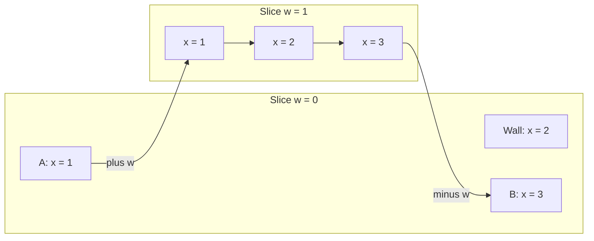

# Four-spatial-dimensional grid tactics

Feature identity: **FOURD-01**. Design dated **2026-09-08**.

## 1. Purpose and confirmed requirements

Design the algorithms and gameplay mechanisms for an original, **grid-based, turn-based squad tactics
game in four spatial dimensions**, with XCOM-like positional decisions, cover, action budgets and
reaction fire. The user explicitly confirmed both four spatial dimensions and grid-based play.
Time remains the sequence of turns and actions; it is not the fourth spatial coordinate.

The core recommendation is a bounded grid of cells **`(x, y, z, w)`**. Gravity points along `−z`.
Soldiers normally move across `x`, `y` and `w` on supported ground, with explicit ways to change
height `z`. Geometry, movement, range, sight, projectiles and effects all retain all four coordinates.
Players inspect the world through linked 3D slices and a tactical overview. Changing a view never
moves a soldier or grants new intelligence.

The fourth axis should create understandable tactical consequences:

- Maneuver around the `w` end of a wall to expose a new firing direction.
- Protect a position against threats from more directions, including different `w` coordinates.
- Separate units that overlap in a 3D projection but occupy distinct 4D cells.
- Control passage through a volume with a barrier or reaction-fire zone that has explicit `w` extent.
- Discover routes and firing lanes that are invisible in one slice, while preserving fair fog of war.
- Choose whether to spread through `w` for safety or remain close enough for support and objectives.

This is a design for a **validated 4D tactical foundation and playable vertical slice**, not a complete
retail campaign, strategic base layer, content catalogue or multiplayer service. F# with .NET/Fable
consumers is the recommended implementation direction given the existing workspace, but the rules
do not require Unity, a native-game shim or custom WASM. Those belong to separate proposals.

All types, formulas, tuning values, algorithms and milestones below are proposals. No game algorithm,
package, template default or installed contract is changed by this document. Existing source was
inspected and primary research consulted; no playable 4D prototype or player study was executed.

This is an independent section 15 product/algorithm track in the
[Unified Development Roadmap](2026-09-07-154210-fs-gg-unified-development-roadmap.md), indexed under
[section 9.8](2026-09-07-154210-fs-gg-unified-development-roadmap.md#98-feature-parts-and-subroadmap-index).
Its workspace effect is described in section 17 below, following
[Unified section 9.9](2026-09-07-154210-fs-gg-unified-development-roadmap.md#99-when-new-workspaces-change).
It is not a V0–V6 migration prerequisite and does not depend on the
[Unity replacement-client roadmap](2026-09-08-144823-unity-native-shim-fable-client-design-roadmap.md).

## 2. Design choices that make this an actual 4D game

### 2.1 One space, four independent coordinates

`w` is a direction of travel with distance, adjacency, obstruction and finite object extent. It is not
a map identifier, timeline, teleport destination or decorative alternate-world state. Start with three
`w` cells in teaching maps and five in a reference benchmark; a finite fourth extent is still spatial,
just as a finite number of floors does not make height non-spatial.

The minimum evidence of four-dimensional rules is a family of scenarios in which changing only `w`
changes movement, distance, collision and firing geometry correctly. A ray from one `w` coordinate
to another must test the intervening 4D space. Simultaneous units at the same `(x,y,z)` but different
`w` must remain distinct. A floor, wall, blast or smoke volume must say which `w` interval it occupies.

### 2.2 Gravity is a deliberate asymmetry

Choose `z` as physical height, with gravity `g = (0,0,−g0,0)`. Ground is consequently a supported
three-dimensional set parameterized by `x`, `y` and `w`. Ground soldiers have six ordinary lateral
directions: `±x`, `±y`, `±w`. The underlying 4D grid has eight axis neighbors, with `±z` available
through ladders, steps, drops or an explicitly capable flying unit.

This is a physically intelligible 4D world with a preferred gravity direction, rather than a requirement
that all four axes have identical gameplay. A normal 3D tactics game also treats height differently
from horizontal movement. Preserve symmetry among `x`, `y` and `w` in the foundational rules unless
a particular material or ability explicitly breaks it.

### 2.3 Units and terrain have fourth-axis thickness

Ordinary soldiers are represented by stylized bodies with nonzero extent along `w`, even if the art
resembles familiar humans. A default unit reserves one `Cell4`; its collision body and aim anchors
are defined inside that cell. Two units in adjacent `w` cells do not collide merely because their
3D projections overlap. A later multi-cell creature reserves an explicit 4D footprint.

Terrain can occupy full hypercells or bounded subcell boxes. A 4D hypercube has eight cubical
boundary facets, corresponding to the two ends of each axis. A fully enclosing room needs to seal
its `w` ends as well as its familiar sides, floor and ceiling. A barrier normal to `x` needs stated
extent across `y`, `z` **and `w`**. Going around its finite `w` end is ordinary movement, not phasing
through a solid wall.

Use finite authored bounds with impassable outer boundaries in the first game. Wrapping space,
portals, non-Euclidean topology and time manipulation are separate optional mechanics; they would
change pathfinding, information and explanation rules and are not needed to establish 4D play.

### 2.4 All ordinary combatants can participate in 4D

Give baseline enemies the same spatial movement and ordinary weapon geometry as the squad.
Otherwise moving one cell along `w` risks becoming a universal escape from enemies artificially
restricted to one slice. Later enemy types may have a clearly signaled dimensional limitation, but
that is an explicit asymmetry to balance, not the baseline definition of the world.

Do not charge extra for every `w` step merely because it is unfamiliar. Start ordinary lateral
steps at the same cost. Test whether map geometry, cover, objectives and reaction fire create useful
tradeoffs. A special strain meter or expensive dimensional ability is a later tuning experiment if
the spatial game remains degenerate, not an assumption needed by the geometry.

## 3. Research and reusable ideas

The mathematical and gameplay extensions in this document are original design proposals informed
by the following sources. A source's existing 3D algorithm is not evidence that our 4D implementation
already exists or is correct.

| Primary source | Useful finding | Consequence for this design |
|---|---|---|
| [Miegakure developer explanation][miegakure] | Demonstrates a 4D world presented through 3D slices; explains why translating a slice can hide the destination | Provide adjacent-slice previews, target identity and path continuity before permitting blind moves |
| [Marc ten Bosch on slicing versus projection][mtb-design] | Discusses overlap and comprehensibility problems with projecting all dimensions together | Make a selected slice the detailed play view; use projections as labeled analysis aids |
| [Hollasch's four-space visualization thesis][hollasch] | Develops 4D vectors, plane rotations, projection and ray intersection methods | Separate authoritative 4D geometry from its lower-dimensional display; use proper 4D transforms where needed |
| [Amanatides and Woo's voxel traversal paper][amanatides] | Establishes incremental grid traversal for ray candidate enumeration in 3D | Generalize the axis bookkeeping, then independently qualify four-axis ties and boundary conventions |
| [Shewchuk's robust predicates research][shewchuk] | Explains how near-degenerate floating-point decisions can corrupt geometry | Prefer bounded integer/rational authoritative grid predicates; do not rely on a renderer epsilon for legal actions |
| [Red Blob Games' A* explanation][astar] | Explains graph modeling and admissible heuristic requirements | Put terrain/unit rules in neighbor generation; prove heuristics against actual move costs |
| [Cavallo, Higher Dimensional Graphics][cavallo] | Discusses authoring and interaction in hybrid 3D/4D applications | Treat the editor, content representation and interaction model as substantive work |
| [4D Miner's official description][miner] | Provides another existing example of a four-dimensional voxel-style world | Useful prior art for world comprehension; does not establish turn-based tactical usability |

The sources support feasibility and identify useful techniques. They do not demonstrate that an
XCOM-like 4D game will be enjoyable. Tactical readability, meaningful cover and fair information
remain hypotheses requiring a playable prototype and observed player behavior.

## 4. World representation and deterministic rules

### 4.1 Core model

| Proposed concept | Representation and role |
|---|---|
| Cell | Four bounded integers `(x,y,z,w)`; canonical ordering and stable encoding |
| Terrain | Sparse or dense per-cell records plus subcell shapes, material channels and revisions |
| Boundary feature | Canonical cell face/edge transition: door, floor support, ladder, barrier or permitted traversal |
| Unit | Stable ID/lifetime, cell, stance, footprint, AP, capabilities, inventory/status and side |
| Query context | Rules version, terrain revision, unit footprint, relevant state and observer knowledge |
| Observation | Current visible state, remembered state and unknown cells/contacts, with explicit age |
| Action | Typed intent with actor, target/path, cost, preconditions and source state revision |
| Event | Ordered authoritative movement, detection, reaction, attack, damage and terrain-change result |

Store material channels separately: movement blocking, optical blocking, projectile blocking, blast
occlusion and hazard propagation. Glass, railings and smoke need not share all channels. Every query
names its channel. Shared geometry does not imply that sight and bullets always pass through the
same materials.

Define a canonical face by an axis and the lower adjacent cell, so a barrier between two cells is
stored once. Querying it from either side must produce compatible geometry; explicitly one-way
mechanics may add direction as a rule. Floor support is a property of the `−z` contact face and the
unit footprint, not “any occupied neighbor.” A unit next to a wall along `w` is not thereby supported.

### 4.2 Grid and subcell coordinates

Treat a cell as the half-open region `[x,x+1) × [y,y+1) × [z,z+1) × [w,w+1)` for ownership and
indexing. Use exact integer subcell coordinates, initially quarters of a cell, for authored blockers
and aim samples. Occupancy conventions and intersection conventions are distinct: obstacle surfaces
can block a tangent shot even though cells use half-open indexing to avoid duplicate ownership.

The initial small soldier has one-cell reservation and a fixed stance profile. Terrain clearance and
support are evaluated over its defined body/footprint, rather than only its center. Geometric origins
and target anchors are inside legal free space. Invalid spawns intersecting terrain are rejected by
map validation instead of being repaired by ignoring the starting cell during every ray query.

Use integers for coordinates, costs, AP, damage, random words and authoritative ordering. For segment
parameters, compare rational values with cross multiplication under proven bounds or a qualified
exact-integer backend. Establish maximum map/subcell sizes and intermediate products before choosing
machine integers. JavaScript's safe-integer limit applies to intermediate products, not just stored
coordinates. Out-of-profile content must fail validation rather than overflow silently.

Rendering can use floating point for animation, camera interpolation and mesh positions. It cannot
decide legal movement, hits, visibility or cover. Stable random and arithmetic behavior across .NET
and emitted Fable JavaScript requires independent tests; existing package names are insufficient.

### 4.3 State and knowledge must stay separate

The authoritative world owns real occupancy and events. The player's planner receives a knowledge
projection. Public/static terrain can be preknown by mission design, while units and dynamic changes
remain hidden until sensed. Unknown terrain policy must be explicit: either prohibit planning through
it or permit a clearly marked speculative route. Do not query real hidden occupancy to color a tile,
choose a path or display an exact hit percentage.

The same rule applies to AI. An enemy may reason from its observations and remembered contacts;
it should not use an all-world object list to choose a perfect fourth-axis flank against an unseen
soldier. Intentionally omniscient puzzle enemies would need an explicit different mode.

## 5. Movement, support and pathfinding

### 5.1 Legal transitions

Generate ground neighbors in a stable order over `±x`, `±y`, `±w`. A transition exists only if the
actor can traverse the connecting boundary, its swept body fits, its destination reservation is legal
and the required support exists. Vertical changes come from explicit transition primitives such as
a ladder, a one-level step or a permitted drop. The first implementation has no free diagonal moves.

A 4D Moore neighborhood contains `3^4 − 1 = 80` surrounding cells, compared with eight cardinal
neighbors. Adding all diagonals immediately would multiply corner-cutting and pricing questions.
Start with the smaller, explainable graph. Later diagonals require a swept-footprint check and a
cost model that remains consistent with pathfinding; they are not a checkbox labeled “diagonals.”

For a constant-size axis-aligned body following an axis-aligned step, test collision against the
terrain using its swept volume, or equivalently expand each blocker by the body offsets and trace
the reference point. Use the chosen boundary/contact convention consistently. An empty destination
does not imply a body can cross a thin intervening barrier.

For movement, permitted support contact is not penetration: touching the supporting floor is legal,
while entering blocking terrain is not. Specify clearance and side-contact rules independently of
the conservative tangent-blocks convention used for firing samples. A generic closed-box overlap
test must not declare every standing unit colliding with its own floor.

Ground moves require support along the traversed path and at the destination. Where a move crosses
a gap, it needs an explicit jump/bridge rule. Stepping along `w` over unsupported ground is not safe
because an adjacent displayed slice contains a floor. Initially prohibit unsupported ordinary moves;
resolve forced movement and destruction-induced falling with a discrete downward search along `−z`,
including collision, landing and damage rules. Do not add a general 4D rigid-body simulator for this.

### 5.2 Costs and action budgets

Use positive integer traversal costs. Start ordinary lateral steps at cost 1; terrain and vertical
transitions can add declared costs. A suggested test ruleset gives a soldier two AP, a normal move
up to six movement-cost units for one AP, and a dash up to twelve for two AP. Firing and overwatch
use declared AP and end-action rules. These are tunable prototype values, not an attempt to reproduce
every XCOM edition's rules.

Each submitted move action has one cost budget and a validated path. Unused budget from that action
does not become a free new action. Define interruption policy explicitly: in the first prototype,
committing a move spends its AP; interruption stops at the last committed legal cell and does not
refund the action. The preview must explain this. A future partial-refund policy needs its own
exploit and replay tests.

### 5.3 Dijkstra for reachable cells; A* for a selected route

Use bounded Dijkstra search to compute every reachable cell within a movement-cost budget and
store predecessors for previews. Use A* when a selected destination merits a focused search. The
graph encodes four-dimensional cells, terrain and legal transitions; the search algorithm itself is
not tied to a specific number of dimensions. [A* graph and heuristic principles][astar]

For the initial transitions, a safe heuristic is:

`h(p,q) = c_min × (abs(dx) + abs(dy) + abs(dw))`.

It deliberately omits height. Require each graph edge's cost to be at least `c_min` times its total
horizontal displacement in `x,y,w`; the triangle inequality then makes this a lower bound. A vertical
ladder contributes no heuristic decrease. An optional `z` term is valid only after proving the same
edge-cost inequality for the chosen vertical weight. Never reuse a four-coordinate Manhattan formula
after adding a cheap multi-cell jump or portal without rechecking admissibility; `h = 0` is the safe
fallback.

Use stable priority ties, neighbor order and predecessor replacement so equal-cost paths replay
identically. Compare A* path cost with independent Dijkstra results on small maps. Both searches
must use the same legal-transition definition as action validation, but their correctness oracles
should not simply call the same flawed neighbor implementation and declare agreement sufficient.

If traversal consumes another finite resource, state may become `(cell, remaining resource, stance)`.
Keep nondominated states when one route is cheaper but leaves less of that resource. A single best
cost per cell is then insufficient. Delay this expansion until an actual mechanic requires it.

### 5.4 A canonical fourth-axis flank

Take a corridor with all required floor support at `z=0`, `y=1`, and `w=0,1`. At `w=0`, a wall
occupies `x=2` across every available `y` route. It does not extend into `w=1`. A unit at
`A=(1,1,0,0)` can reach `B=(3,1,0,0)` in four ordinary steps:

`(1,1,0,0) → (1,1,0,1) → (2,1,0,1) → (3,1,0,1) → (3,1,0,0)`.

The arrows are ordinary adjacent-cell transitions; the disconnected wall node marks the blocked
direct route. Extending the wall through every available `w` cell removes this bypass. Removing the
floor along that route also removes it for a ground soldier. These are separate acceptance cases.

## 6. Four-dimensional ray queries and geometric correctness

### 6.1 Build a simple exact oracle before optimizing traversal

For the initial axis-aligned terrain, the reference query intersects a segment with every relevant
blocking box using a four-axis interval test. Let the segment be `r(t)=a+t(b−a)`, `0≤t≤1`, and the
box intervals be `[L_i,U_i]` for `i ∈ {x,y,z,w}`. For each axis:

1. If `d_i=b_i−a_i` is zero and `a_i` is outside its interval, there is no intersection.
2. If `d_i` is zero and inside the interval, that axis imposes no further parameter bound.
3. Otherwise form the two rational crossing parameters `(L_i−a_i)/d_i` and `(U_i−a_i)/d_i`,
   sort them, and intersect their interval with the running `[t_enter,t_exit]`, initially `[0,1]`.
4. The segment intersects the closed blocker exactly when the final interval is nonempty.

This interval construction works over four independent coordinates without projecting away `w`.
Return the earliest blocking parameter, blocker identity and a stable set of tied entry faces for
explanations. The initial shooting convention is conservative: touching an opaque blocker, even at
an edge or corner, blocks that sample. Source and target anchors must be valid free points; do not
exclude whole endpoint cells to hide invalid geometry.

Use an independently written brute-force rational oracle on small maps. The production broad phase
may enumerate candidate cells, but the narrow phase decides actual material-box intersection.
Partial-height cover and thin barriers require this distinction; a ray entering a cell does not
necessarily intersect every shape stored in it.

### 6.2 Four-axis DDA as a later acceleration

Generalize the incremental boundary-crossing idea of Amanatides–Woo with four `step`, `tMax` and
`tDelta` components. At each event, find the smallest next boundary parameter. The original paper
provides 3D traversal; this proposal's four-axis boundary semantics require additional work.
[Amanatides–Woo][amanatides]

Equal parameters are not rare errors: diagonal grid lines meet multiple boundaries simultaneously.
For conservative contact semantics, inspect all incident cells at that event, up to `2^k` for a
`k`-axis crossing, deduplicate their shapes, and then advance all tied axes. A four-axis event can
have sixteen incident cells. Rays lying on a grid plane for an interval also need candidates on both
sides of that plane; handling only isolated ties is insufficient.

The acceleration must return the same blocked/clear answer and nearest blocker as the oracle for
reversed rays, negative directions, zero components, plane-aligned segments, corner tangency and
subcell boxes. Compare rational parameters exactly within supported bounds. Do not add a small
floating tolerance until the desired geometric policy has been stated and its consequences tested.

Start with bounded scans if they are fast enough. An indexed 4D AABB hierarchy is another candidate
when terrain is sparse; a 3D physics engine's raycast cannot be the authority merely because its
rendered slice looks correct. Optimize only after measuring the actual target-query workload.

### 6.3 Separate geometry tests from gameplay symmetry

A segment/blocker intersection should be invariant under swapping its endpoints, though its first
hit may change. Observer-to-target detection can legitimately be asymmetric because sensor origins,
stances or capabilities differ. Test both statements correctly; do not “fix” legitimate asymmetric
game rules by canonicalizing all shooter/target inputs.

The existing Game.Core routine named `supercover` is a 2D boundary walk with its own tie and endpoint
policy. Its name does not establish conservative all-touched-cell traversal in four dimensions.
The source reuse assessment in section 15 identifies this explicitly.

## 7. Visibility, fog and dimensional awareness

### 7.1 Physical visibility and display visibility are different

A unit may be physically visible to a soldier while outside the currently displayed `w` slice.
Conversely, an object geometrically inside the selected slice may remain hidden behind cover or
outside sensor range. The renderer receives only the side's permitted observation. Moving the view
slider must not discover a hidden enemy, update its remembered position or reveal fresh terrain.

For the first ruleset, give ordinary soldiers omnidirectional 4D sight within a bounded range.
Use squared Euclidean distance:

`distance4_squared(a,b) = dx² + dy² + dz² + dw²`.

Then test optical-channel segments from the observer's stance-defined eye point to a fixed target
anchor set. Range and anchors belong to one versioned sensor profile. Avoid inventing a special
cross-`w` detection penalty before the baseline has been played. Finite map depth, occlusion and the
information UI already constrain understanding.

For a one-cell target, start with nine body anchors: cell center and offsets of one quarter cell in
each of the eight positive/negative axis directions. A stance-defined observer eye can initially sit
three quarters up the cell in `z`, centered in the other axes. This is a **discrete rules approximation**,
not an estimate with guaranteed physical volumetric accuracy. It may miss a very narrow slit or
change in steps near an edge. Author terrain around its declared resolution and test sample artifacts.

A target is currently detected if at least one optical sample passes the sensor's range and material
rules. Terrain discovery uses visible surface/first-hit information or separately defined free-cell
samples; tracing only to the center of an opaque wall cannot reveal its surface correctly. Unit
detection, terrain exploration and projectile eligibility are distinct queries built on the same
geometric kernel.

### 7.2 Information states

| Knowledge state | What the player sees | What it permits |
|---|---|---|
| Currently observed | Exact permitted actor/cell/status plus which squad members sense it | Ordinary target selection subject to weapon rules |
| Remembered | Last seen cell/shape with turn/action age; clearly marked as stale | Planning hypotheses, not a silently current firing solution |
| Uncertain contact | An explicitly uncertain region or signal supplied by a sensor ability | Investigation or a declared area attack, not exact hidden coordinates |
| Unknown | No current state | No position/health/cover disclosure through previews or AI helpers |

Share currently valid squad observations in the initial single-player prototype. Recompute after
committed movement steps, stance/sensor changes, door/terrain changes and relevant attacks. An enemy
leaving sight does not remain targetable at its exact new `w`. Maintain observation provenance for
tooltips such as “seen by Scout 2” and eliminate stale shared visibility when that observer loses it.

Constrain caches by observer state, sensor profile and all relevant terrain/material revisions. Later
region-based invalidation must include every dimension touched by the query. A change one slice
away can invalidate a diagonal 4D shot in the selected view. Never key a cache by `(x,y,z)` alone.

### 7.3 Prototype workload

For `U` observers, `T` candidate targets, `S` samples and traversal cost `L`, direct target visibility
costs roughly `O(U·T·S·L)`. Full per-cell fog can be much more expensive because candidate volume
grows in four axes. Use range bounds and dirty observers first. Separate a target-only combat query
from the coarser terrain exploration representation, and profile before designing a 4D shadowcasting
algorithm. Existing 2D octants and 3D frustum methods do not transfer by renaming an axis.

## 8. Cover, flanking and weapon resolution

### 8.1 Cover is directional and relational

Calculate obstruction for a particular shooter, target, stance and weapon. Reuse the target anchors
and trace through the weapon's material channel. Let `n` be the number of permitted in-range target
anchors and `k` the number of those anchors with a clear firing segment. For a weapon that tests all
nine anchors at the same center-based range, `n=9`; profiles with per-anchor range must state their
denominator policy rather than improve exposure by dropping blocked/out-of-range samples.

The suggested first profile uses center-based range and all nine anchors, so **`exposure = k/9`**.
If `k=0`, no ordinary shot is legal. If `k=9`, geometry supplies no obstruction benefit. Intermediate
values can be labeled light/heavy obstruction with the exact fraction available in the preview.
Do not store a permanent “this cell has full cover” flag and reuse it against every firing direction.

To keep the initial chance model explainable, compute the ordinary range/weapon/stance hit value
as an integer probability `P_base`, then apply the geometric factor once:

`P_hit = floor(P_base × k / 9)`.

This is a balance proposal rather than a physical ballistics model. Do not also apply a second cover
penalty for the same blocked samples. Later alternative cover bands or armor systems should be
compared against this simple baseline. Show enough explanation for the player to predict why changing
`w` raises or lowers the chance.

Use “flank” to describe a real change in the target's protective geometry, not merely `attacker.w !=
target.w`. A finite wall may still block an oblique cross-`w` shot. Two units in one `w` slice can
already be flanked through familiar `x/y` routes. If a later ability grants a special flanking bonus,
define its trigger from the obstruction/position model and avoid double-counting the same advantage.

### 8.2 Authoring cover that survives the extra direction

| Cover pattern | Geometry | Tactical consequence |
|---|---|---|
| Short ordinary wall | Finite extent in `w` | Can be bypassed around its fourth-axis end |
| Extended wall | Covers several contiguous `w` cells | Protects a broader approach but still has finite endpoints |
| Corner/shelter | Intersecting bounded barriers | Protects against a set of directions, not automatically all directions |
| Sealed enclosure | Side barriers plus floor/ceiling and `w` caps | Requires a door, breach or other actual opening |
| Partial-height barrier | Blocks lower target anchors across a stated extent | Offers partial obstruction with height- and direction-dependent exposure |
| Aperture | Actual opening in a four-dimensional barrier | Creates a constrained, inspectable firing/movement route |

The player should be able to inspect a shelter's `w` extent before relying on it. Provide coverage
against **known** threats, with unknown directions marked uncertain rather than secretly evaluated
against hidden enemies. Cover does not have to make every position safe; it must make danger legible.

### 8.3 Shots and actor occupancy

An ordinary shot requires a currently observed target, sufficient AP/ammunition, a valid center-based
4D range and at least one clear weapon sample. Resolve the authoritative result from the versioned
chance rule and deterministic random stream. On a hit, associate it with a clear target anchor for
feedback; do not animate a successful bullet through an opaque blocker simply to reach the model's
center. Initial misses have no secondary environmental damage unless explicitly authored.

Use nonblocking units for sight/projectile occlusion in the first ruleset while retaining exclusive
movement reservations. This is a declared simplification; it avoids an unplanned friendly-body/cover
system. Friendly fire for area effects remains an explicit separate rule. Adding units as projectile
blockers later needs target ordering, footprint and hit-interception tests in all four axes.

Range bands should use squared distances where possible to avoid square-root rounding. Weapon
spread, beam width and penetration are separate advanced profiles. Four-dimensional distance is
Euclidean for these weapons even though walking cost is graph/Manhattan-like; do not use AP cost
as bullet range or a 3D projected distance as either.

## 9. Area effects, fields and destruction

### 9.1 Distinguish a 4D blast from a stack of identical 3D blasts

For a simple radius-`R` area ability centered at `c`, the 4D ball criterion is
`distance4_squared(p,c) ≤ R²`. Choose a clear membership rule: the first prototype uses unit cell
centers, with damage/occlusion evaluated once per unit ID. Do not count an actor once for each slice
in which its representation appears. Multi-cell targets later need a declared footprint/volume rule.

In a view at constant `w=s`, a continuous 4D ball centered at `c_w` intersects as a 3D ball with
radius `sqrt(R² − (s−c_w)²)` when `abs(s−c_w)≤R`; otherwise the slice is empty. This is useful
visual feedback, while the actual affected-cell list is computed by the discrete membership rule.
A radius-3 preview has cross-section radii `3`, `sqrt(8)`, `sqrt(5)`, `0` at fourth-axis offsets
`0`, `1`, `2`, `3`. Identical radius circles on every slice would depict the wrong effect.

For the initial radial attack, use a specified center-to-target blast-channel segment to determine
whether a blocker shields a center-selected unit. This deliberately simple rule is not pressure
simulation. Show shielded cells and friendly-fire results from the same evaluator used on commit.
Do not accidentally use movement flood-fill for radial weapons merely because it is already available.

### 9.2 Different propagation laws support different tactics

| Effect | Proposed algorithm | Why its fourth-axis behavior matters |
|---|---|---|
| Radial blast | 4D squared-radius membership plus declared blast occlusion | Neighboring slices have changing affected regions; finite walls can shield some rays |
| Gas/smoke | Bounded graph propagation through material-permitted connections | Can flow around a wall through `w`; a Euclidean radius alone would ignore that route |
| Beam | Segment with explicit thickness, tested against 4D blockers/targets | Can cross slices; projected overlap alone is not a hit |
| Suppression/overwatch zone | Range plus a direction/shape profile and line of fire | Defends a genuine 4D region rather than the current camera view |
| Temporary barrier | Authored bounded hyperbox/face assembly | Must specify which approaches and `w` intervals it seals |
| Forced displacement | Grid transition sequence along a declared axis/path | Every crossed boundary, occupancy conflict and fall is resolved |

A pressure/gas field can use bounded Dijkstra distances or fixed-turn propagation. If real diffusion
is later introduced, specify its discrete stencil, material permeability, timestep and conservation
rules; copying a six-neighbor 3D diffusion stencil would omit `w`. The first playable slice needs
only one well-tested area effect and one controlled terrain-change example, not every row at once.

### 9.3 Destruction affects four-dimensional connectivity

Destroying part of a barrier removes a particular 4D region or boundary feature. It may open paths
and shots in several slices while leaving others protected. Update the terrain revision, recompute
affected movement/sight/cover results and resolve unsupported occupants. A visual hole in one slice
is not sufficient authority to remove an entire wall's fourth-axis extent.

Apply simultaneous area damage from a declared pre-effect snapshot, then settle destruction,
occupancy/support and derived visibility in a stable order. Do not let iteration order make a later
target take more damage because an earlier target's explosion opened a hole mid-calculation, unless
chain explosions are an explicit sequential mechanic. Retain source unit/effect identity to prevent
double damage from multi-slice render instances.

## 10. Turns, movement events and reaction fire

The turn-based simulation commits logical grid states independently of animation. A movement action
is a sequence of legal grid transitions, with an opportunity for observation and reactions at each
committed destination. The first version uses endpoint-based tactical reactions: it does not claim
continuous substep interception during the visual interpolation between cells.

For each step:

1. Validate the next transition against the current authoritative state, including any changes caused
   by earlier reactions. If blocked, stop at the current cell under the declared AP policy.
2. Commit the move, occupancy and step event; then settle immediate terrain hazards/support rules.
3. Recompute relevant observations at the committed cell.
4. Gather eligible watchers using their actual 4D range, target knowledge and firing rules.
5. Resolve watchers in a stable initiative/ID order, rechecking each before it fires.
6. If the mover is still alive and able to act, continue the path; otherwise stop and publish the result.

An initial watcher has one reserved reaction and can fire at most once during the triggering movement
action. Reaction shots do not recursively trigger more reaction shots in the first ruleset. Every
reaction consumes its declared ammunition/reservation, and death or disabled state invalidates later
shots. Animation speed, selected slice and camera visibility cannot change any of these decisions.

Moving from `w=0` to `w=1` is a normal trigger opportunity. A watcher need not appear in the current
slice to react, but the event presentation must identify the observed source/target and relevant
geometry without revealing unearned hidden information. If a hidden shooter becomes revealed by
firing, that disclosure comes from a declared observation event, not renderer convenience.

Save/replay state includes rules and map versions, entity lifetimes, AP/reservations, terrain revisions,
random state and the ordered action/event sequence. A seeded random generator alone does not ensure
replay: candidate ordering, cache-independent results and reaction sequencing must also be stable.
Preview queries never consume authoritative random draws or change simulation state.

## 11. Views, picking and explaining four-dimensional decisions

### 11.1 Recommended first interface

Use one detailed **fixed-`w` 3D slice**, plus compact neighboring-slice panels and a linked orthogonal
map. A prototype may begin with 2D `(x,y)` panels at explicit `(z,w)` values; it still needs an
unambiguous height inspector and should advance to the display that best supports the encounter.
The chosen display is a user study question, not a reason to reduce authoritative state to 2D.

| View element | Purpose | Required behavior |
|---|---|---|
| Main slice | Detailed terrain, units, cover and actions at selected `w` | Persistent axis labels, slice identity and height; no hidden-state disclosure |
| Neighbor slices | Show continuity and routes before a `w` move | Same scale/orientation, visible path handoff and explicit unknown areas |
| Orthogonal map | Show `x/w` or `y/w` relationships at selected other coordinates | Linked cursor and consistent actor/cell IDs |
| Off-slice contacts | Keep currently known threats and squad members discoverable | Clearly labeled `w` offset; not fake occupancy in the main slice |
| Path preview | Explain every coordinate transition and AP cost | Marks slice changes, height/support transitions, uncertain segments and interruption policy |
| Shot inspector | Explain range, blocked samples and cover | Shows the actual 4D path through linked views, not only its ambiguous shadow |
| Effect preview | Show affected cells across slices | Uses authoritative membership/occlusion; labels friendly fire and unknown information |

A soldier off the main slice can be represented by a labeled edge marker or a ghost overlay, but
ghosts must be visually distinct from occupying units. A target list provides stable selection when
several actors overlap in projection. Never infer the selected `w` coordinate from whichever rendered
mesh happens to be nearest the camera.

### 11.2 Mathematical view model

For an axis-aligned slice, set `w=s+1/2` and render intersections with that hyperplane. Units/cells
in the selected band map to familiar `(x,y,z)` coordinates; terrain intersections retain actual
material and known-state identity. A finite-width slab or an exploded multi-slice view is a different
display mode and must be labeled as such. It may contain several distinct actors at one 3D location.

A later general slice can be represented by origin `o` and a `4×3` orthonormal basis `B`, with unit
normal `n`. Its points satisfy `p=o+B·u` and `n·(p−o)=0`. The 3D coordinate of a point actually on
the slice is `u=Bᵀ(p−o)`. Orthogonally projecting an arbitrary point with that formula does not make
it part of the slice. Keep intersection, projection and ghost display as separate operations.

For axis-aligned grid geometry, fixed-`w` slicing is inexpensive. For a later oblique view of a convex
4D cell, intersect its edges with the hyperplane, deduplicate intersections, and construct the
resulting convex 3D cross-section with robust topology. A tesseract has 16 vertices and 32 edges;
the intersected solid is not always a cube. Deduplicating vertices without constructing the correct
faces is insufficient. Floating-point mesh tolerances are presentation concerns; the authoritative
grid does not acquire rotated fractional cells merely because the camera slice is oblique.

4D geometry and plane rotations are described in [Hollasch's thesis][hollasch]. The formulas here
define the proposed client view boundary; they are not a requirement for a full 4D raytraced renderer.

### 11.3 Picking has to recover a full cell

In a fixed slice, unproject the pointer into a 3D ray, intersect it with rendered known terrain or an
explicit targeting plane, recover `(x,y,z)` and attach the slice's explicit `w`. Validate the resulting
`Cell4` or actor ID in the rule core. In a general slice, lift a 3D ray `u(t)` to `o+B·u(t)` in 4D,
then apply the view's qualified picking query. In an exploded view, also identify which panel/slab
was picked; screen position alone is ambiguous.

Targeting unknown space is possible only through an explicit ground-target/area ability. A hidden
actor's render proxy must not exist in a browser picking buffer. Hover feedback, path costs and
occlusion explanations must consume the same knowledge projection as ordinary play.

Mouse and keyboard routes should both support unit selection, destination targeting, `w` and height
selection, path confirmation/cancellation, attack, overwatch and end turn. Provide rebindable `+w/−w`
controls, a focused cell cursor and coordinate/axis readouts. Slice controls move the view; a unit
move requires an explicit action confirmation. Text focus, key repeat, blur and camera drag must not
accidentally confirm a gameplay action.

### 11.4 Readability is an algorithm acceptance condition

Every preview should be able to answer: “Which cell?”, “Through which slices?”, “Why this cost?”,
“What blocks the shot?”, and “Which part is unknown?” Return compact explanation data from queries:
path steps, cost components, blocker/facet IDs, sample counts and state revision. Do not implement
an unrelated UI approximation that can disagree with the actual action evaluator.

Compare three displays on matched tasks: fixed-slice plus neighbors, an exploded view and linked
orthogonal panels. Measure coordinate mistakes, correct route/range/cover predictions, time spent
switching slices and ability to explain a successful flank. For a small formative study, use roughly
5–8 unfamiliar players; report observations and task outcomes without population-level claims.
Choose acceptance criteria before the evaluated round and revise when failures cluster.

The teaching sequence should begin with one additional accessible `w` cell, then introduce an
extended wall, cross-slice shooting, cross-slice danger and a shrinking blast cross-section. Use
non-color-only axis labels, patterns and numeric offsets. The first goal is deliberate tactical use
of the axis, not memorization of the word “tesseract.”

## 12. Tactical AI and search in four-dimensional space

### 12.1 Candidate generation must include fourth-axis opportunities

Start with a bounded utility AI over the same legal move/shot queries as the player. Compute the
unit's reachable set once, then generate candidate attack positions, support positions, objective
positions and safe retreats. A candidate filter restricted to the selected slice or to `(x,y)` distance
would miss the feature the game is meant to explore.

Score candidates using actual movement cost, known enemy firing geometry, outgoing exposure,
objective progress, friendly support and observed hazards. The fourth axis changes those inputs;
it does not need a hardcoded bonus for “being on a different slice.” Include candidate diversity across
`w`, objectives and attack directions when limiting the frontier, so pruning does not erase all
dimensional flanks before evaluation.

Use expected attack value only from permitted target information and the actual hit/damage rules.
For defense, query threat from known/remembered enemies with the uncertainty explicitly represented.
Do not add exact hidden opponents to a threat map and then claim the AI is observation-limited.
Difficulty can change search depth, resource budgets and risk preference instead of information access.

### 12.2 Squad coordination and contact memory

A squad planner can reserve intended destinations and penalize friendly clustering within the real
4D blast radius. It can build an attack/threat graph whose nodes are candidate actor positions and
whose edges carry legal-shot/exposure data. A position visually overlapping an ally can be physically
separate, yet still close enough in four dimensions for the same grenade; projected distance is not
a sufficient coordination metric.

Remembered contacts can maintain a bounded set of plausible cells by expanding the last known
position through observed/legal movement, including `w`. This is a belief approximation, not truth.
Collapse or prune it using new observations and declared movement assumptions. A last-seen contact
must not freeze forever at its old `w`, nor update invisibly to the true current cell.

Start with one-action evaluation or a shallow move-then-shoot search and fixed computation budgets.
Use deterministic candidate order and return an explicit budget-limited result. A large four-axis
state space is not a reason to start with an unbounded multi-turn planner or a machine-learning
training project. Compare against simple random/legal and greedy policies to measure actual benefit.

### 12.3 AI acceptance scenarios

Require the AI to find the authored `w` bypass when useful, refuse an unsupported or blocked bypass,
extend/choose cover against a known cross-`w` shooter, avoid a multi-slice friendly blast and react
to a new opening after terrain changes. Hide an enemy and vary its true `w` while keeping the AI's
observation identical: the AI's decision should remain identical given the same random state and
budget. Changing only the player's selected view must never change the AI's decision.

## 13. Map construction, balance and specifically 4D mechanics

### 13.1 Build authored scenarios before procedural generation

Begin with a small library of 4D patterns, each with geometry, objective, expected route/shot
consequences and a short explanation. Copying an identical 3D map into several `w` cells can help
teach continuity, but if every copy is identical and disconnected in gameplay, it fails the intended
spatial depth. Include finite extents, connected routes and cross-`w` interactions deliberately.

| Pattern | Decision it teaches | Algorithm dependence |
|---|---|---|
| Finite wall bypass | Spend movement/AP to change the attack direction | Legal support, reachability and directional cover |
| Extended barrier | Seek an opening rather than assuming every wall has a nearby bypass | Full four-axis occupancy and path failure |
| Cross-slice fire lane | Position against threats not drawn in the main view | 4D ray/range and off-slice contact UI |
| Split squad route | Trade route safety against ability to support teammates | 4D path and distance, knowledge and objectives |
| Sealed shelter with breach | Create a real opening and exploit changed connectivity | Boundary geometry, destruction and cache invalidation |
| Shared blast danger | Avoid clustering across apparently separate panels | 4D radius membership and actor deduplication |
| Missing floor across `w` | Inspect support before committing a lateral move | Gravity/support and path preview |
| Cross-`w` overwatch | Defend a route through the extra dimension | Per-step reaction and threat explanation |

For each map, validate spawn/support, bounds, objective reachability, legal exits, terrain samples,
actor footprint and intended visibility. Analyze the four-dimensional movement graph directly:
connected components reveal disconnected regions; articulation/cut structures can identify mandatory
chokes under the chosen undirected/directed movement rules. A bottleneck in one slice may disappear
when the full graph includes `w`.

Once authored patterns produce good encounters, assemble them with explicit boundary sockets and
validate the combined graph. A procedural generator should guarantee a playable objective route and
control information density, not merely fill a 4D array with noise. Keep a seed and generated artifact
for reproducibility; graph reachability alone does not establish tactical quality.

### 13.2 Counter degenerate tactics through space and rules

| Possible failure | Evidence to look for | First design response |
|---|---|---|
| Every wall is trivial to bypass | Most winning routes add the same two `w` steps | Vary finite extents, supports and objectives; give enemies the same routes |
| Cover stops mattering | Players cannot find useful exposure reductions | Author shelters/extended barriers and inspect sample geometry; test map density |
| Fourth axis rarely matters | Good decisions remain entirely in one slice | Add objectives and firing geometry with genuine cross-`w` consequences |
| Every decision is overwhelming | Excess view switching, missed off-slice threats and wrong-cell actions | Reduce active `w` extent/units, improve linked views and constrain tutorial content |
| Overwatch becomes unavoidable | All useful routes trigger equivalent dominant reaction zones | Test range/LOS, alternate geometry, action tradeoffs and suppression/counterplay |
| Information UI cheats | Exact hidden threats appear in chance/path/cover hints | Repair knowledge boundaries; do not balance around leaked information |

Balance dimensions through tested scenarios, not a blanket claim that extra space is always good.
The added lateral direction increases routes and threat directions; the game must give the player
tools and incentives to reason about both.

### 13.3 Candidate abilities after the baseline works

Prefer a few abilities built from the same algorithms: an extended barrier with explicit `w` ends,
a sensor that reports a bounded uncertain contact region, a beam crossing several slices, a controlled
push along `w`, or a support ability with genuine 4D range. Their previews should reuse the query
kernel. A special ability should change a declared rule, not bypass geometry accidentally.

Optional **grid-preserving fourth-plane rotation** is a distinct later experiment. A quarter-turn in
the `xw` plane transforms an offset by `(dx,dw) → (−dw,dx)` while leaving `y,z` unchanged. It can
rotate a bounded room or object footprint on the lattice if the pivot maps cell centers back to cell
centers. Check the pivot and extents explicitly; an arbitrary-angle rotation produces off-grid geometry.

Four-space rotations have six coordinate planes: `xy`, `xz`, `xw`, `yz`, `yw`, `zw`. A single ordinary
3D quaternion does not represent arbitrary SO(4) rotation. [Hollasch][hollasch] For grid mechanics,
signed-permutation/quarter-turn transforms are sufficient. Preserve `z` in the first physical rotation
experiment so gravity stays understandable. Camera rotations are presentation-only and can be added
independently.

Before committing a rotated room/object, test every destination footprint and choose a displacement
policy. For a first discrete rotation ability, reject the action if the destination configuration is
invalid and define it as an instantaneous grid transformation. If a future version claims a continuous
physical sweep, endpoint collision checks are insufficient. Moving occupants, support, doors, fog and
reaction rules all need explicit settlement. Room rotation is not required for FOURD-01's baseline exit.

Other later questions include multi-cell hypercreatures, sensor direction/cones in 4D, penetration,
hazard diffusion and flying units with eight cardinal moves. General convex 4D physics, arbitrary
dynamic rotations, photorealistic 4D optics, portals and a strategic campaign remain outside the initial
algorithm/vertical-slice scope.

## 14. Validation, benchmarks and algorithm development order

### 14.1 Build independent mathematical and tactical fixtures

| Test family | Required examples and invariants |
|---|---|
| Identity/topology | Different `w` means different cell; no bound wrapping; inverse ordinary step returns to start; canonical facet lookup agrees from both sides |
| Movement/support | Finite-wall bypass, extended-wall failure, missing floor, thin barrier, body clearance, legal vertical transition and occupied destination |
| Search | Weighted path cost equals reconstructed cost; compare tiny graphs with an independent reference; distinguish unreachable from computation-budget exhaustion |
| Metric | Changing only `w` changes distance; symmetric squared distance; no alias from equal 3D projection |
| Segment geometry | Axis/plane alignment, negative/zero components, point segment, endpoint contact, grazing and 2/3/4-axis boundary ties |
| Four-axis obstruction | Intermediate-`w` blocker stops a diagonal shot; finite extent permits a true bypass; acceleration agrees with exact oracle |
| Cover | Sample count matches known geometry; shooter-relative values can differ; no automatic flank bonus from a different `w` |
| Effects | Correct 4D radius membership, shrinking slices, occlusion and one result per actor; destruction has bounded extent |
| State/knowledge | View changes reveal nothing; stale contacts stay stale; hidden-state variations do not change a knowledge-limited query |
| Actions/reactions | Stable per-step ordering, interrupted paths, death/occupancy changes, no animation dependence and no accidental recursive reactions |
| Cross-runtime | Authored canonical outputs match .NET, emitted Fable/Node and named browser runs; integer/rational/RNG bounds tested |
| Save/replay | Same initial state and committed action sequence reproduce final state/events across supported runtimes |

Use translation, reflection and coordinate permutation properties for the geometry kernel. For
ground gameplay, apply only symmetries preserving the gravity/material/cost rules, or transform those
rules together. Swapping `z` with `w` while leaving gravity fixed is not expected to preserve legal
standing moves. Shewchuk's research motivates exact decisions near degeneracies, but its supplied
2D/3D predicates are not an already qualified 4D library. [Robust predicates][shewchuk]

Do not rely solely on differential agreement between the same source compiled twice: both can share
the same mathematical bug. Use authored expected results, small exhaustive graphs, independent exact
intersection and deliberately adversarial cases. Keep renderer golden images separate from rules
tests; attractive graphics cannot certify geometry.

### 14.2 Initial benchmark envelope

Use a proposed benchmark of **`32×32×4×5 = 20,480` cells**, around 12–16 actors and three visible
slice panels. At sixteen bytes of hypothetical terrain payload per cell, raw terrain alone would be
327,680 bytes; language objects, indices, observations, caches and render data add overhead. These
are arithmetic sizing examples, not measured memory results. A uniformly scaled `32^4` world has
1,048,576 cells, illustrating why the fourth extent should remain bounded initially.

Measure reachability, selected-path reconstruction, target/cover queries, observation refresh, one AI
decision, terrain invalidation and slice meshing separately. Record p50/p95/p99, input sizes, device,
browser and warm/cold conditions. Proposed interaction goals are a path/shot preview under 50 ms
at p95 and a bounded AI action decision under 500 ms on a named reference desktop; select and
adjust budgets from real prototype evidence, not from the presence of a fast data structure.

Avoid recomputing all pairs of cells after every pointer move. Cache one reachable set per current
actor/state, prioritize hovered/selected shot queries, and invalidate on all relevant four-dimensional
state changes. Background workers may help presentation responsiveness later, but committing stale
results requires a state-revision check. Cancel obsolete queries instead of queuing unlimited work.

### 14.3 Algorithm sequence

Build integer identity and topology first; legal transitions/support second; bounded reachability and
path explanations third; exact 4D segment queries fourth; visibility and cover fifth. Only then combine
AP, random attacks and reactions into a playable encounter. Add simple observation-limited AI and
the selected area effect, evaluate readability, and optimize the actual bottlenecks. Oblique slice
meshing, arbitrary convex geometry, procedural generation and room rotation can follow useful evidence.

This ordering lets an incorrect firing result be traced to geometry, samples, knowledge or game rules
instead of debugging all four at once. The roadmap below packages these dependencies into a small
number of meaningful delivery outcomes.

## 15. Existing FS-GG source, ownership and implementation seams

A fresh feature-planning pass inspected clean local source checkouts at the following revisions.
This is source evidence, not a claim of current remote HEAD, installed package availability or passing
4D behavior. No builds or product tests were run in that planning pass.

| Repository | Inspected revision |
|---|---|
| FS.GG.Game | `24f79084fdd289f34387f91b1d4398c78fde16eb` |
| FS.GG.Rendering | `86102999e7f60a494bed74e825e36b284fef6d62` |
| FS.GG.Templates | `61091078337689c6ab1aac139bc03f6a07ca8f99` |

### 15.1 Reuse assessment

| Existing source | Useful precedent | Required new work |
|---|---|---|
| [Game.Core primitives][game-primitives] | Typed cells/points and ordering | Existing `Cell={Col;Row}` and `Point={X;Y}` are 2D. Define real `Cell4`; packing coordinates into two fields does not preserve geometry |
| [Pathfinding contract][game-path-contract] and [implementation][game-path] | Bounded search, integer costs, stable ties and weighted reach/predecessors | Existing graph and heuristics are concretely 2D. Public `astar` does not supply weighted terrain optimization; qualify new 4D reach/path behavior |
| [Edges][game-edges] | Canonical boundary identity and traversal concepts | Existing directions/vertices are 2D. A 4D cell boundary is a 3D facet with its own material/transition semantics |
| [LoS][game-los] | Explicit visibility semantics and deterministic behavior | Existing endpoint canonicalization/exclusion and x-first corner handling cannot be treated as the new conservative 4D policy |
| [Fable compatibility profile][game-profile] | Explicit classification of exact, portable, .NET-only and unclassified operations | Exact qualification is narrow; existing RNG, visibility/AI/geometry and other listed modules are not a browser-ready 4D rules core |
| [Fable fixture protocol][game-fixture] and [consumer gate][game-consumer] | Cross-runtime/package consumer qualification patterns | Add independently expected FOURD cases and actual emitted-Fable/browser execution |
| [Game rendering adapter][game-render] | Dependency direction from renderer to pure game types | Existing conversion is 2D; implement 4D view/picking adapters at the boundary |
| [Rendering Scene types][render-scene] and [README][render-readme] | Screen-oriented vocabulary and UI mechanisms | Existing source does not establish a complete Fable 3D/4D renderer; qualify only selected reusable surfaces |
| [Fable game client][template-client], [domain][template-domain] and [Room][template-room] | Project/tooling and explicit protocol patterns | The sample is a 2D arena; its server-only Domain is not automatically shared Fable authority |

The inspected Game.Core Fable profile grades a limited set including cell/order, `Edges.edgeBetween`,
`Los.lineOfSightBy` and `Pathfinding.astar` as `LockstepExact`. Packaged source presence does not
extend that grade to every method: for example, `reachable` and `pathTo` remain outside those exact
method declarations. `Rng`, `Dice`, `Fov`, `Visibility`, `Ai`, `Geometry`, `Physics` and `MapGen` are
among the `.NET`-only entries. Carry the qualification discipline forward instead of silently widening
the existing profile. [Compatibility profile][game-profile]

Do not adapt a 2D Jump Point Search pruning rule to 4D without deriving it for the exact new movement
graph. Do not reconstruct a weighted route using an unweighted path routine because both happen
to return cell lists. Reuse established contracts and test patterns where useful, then implement the
new dimension-aware kernel on its actual semantics.

### 15.2 Product-first ownership

Name one original-game product workspace when implementation begins; its repository/name is not
assigned by this document. Keep the first grid model, query kernel, turn reducer, tactical rules,
authored maps, AI and browser inspector together under that owner. Separate pure rule source from
rendering and I/O, with the same intended rules compiled for .NET and Fable and independently checked.

| Proposed boundary | Initial responsibility |
|---|---|
| Pure 4D core | Cell/facet identity, materials, legal transitions, search, ray/effect geometry and versioned numeric rules |
| Tactical rules | Knowledge, AP, attacks, cover profile, reactions, objectives and deterministic events |
| AI | Observation-limited candidate generation/evaluation using the rule queries |
| Client/view layer | Slice/panel geometry, picking, previews, input, animation and explanation UI |
| Authoring/harness | Scenario construction, expected outcomes, exact oracles, replay and measurements |

FS.GG.Game is the appropriate owner for later independently useful generic extraction and any
expanded public Fable qualification. Keep the current `Cell` API intact unless a separately designed
public change is justified. FS.GG.Rendering owns any reusable display/input backend contribution;
the product owns the interpretation of fourth-axis tactical information. Templates owns any eventual
opt-in sample composition and its installed adoption. FS.GG/.github owns this proposal/navigation.

An existing `fs-gg-fable-game` layout can be a starting point, or a small standalone Fable product
can be used. The original game does not need SignalR/network authority to test a deterministic local
encounter. Neither Unity, Net, WASM nor a native shim is a required dependency. If network play is
later selected, the pure rule/observation boundary supplies useful groundwork without adding it to
this feature's completion requirements.

## 16. Six-milestone development roadmap

The roadmap was developed with a fresh `gpt-6-astra` high-effort feature planner and integrated with
the geometry/gameplay design above. Use the **routine** route for future delivery. Only the first
two milestones are detailed now; expand the later horizon after those results and early interaction
evidence exist. Implementation needs an actual product owner/workspace and a request to begin it.
This document does not start that implementation or any publication.

### 16.1 FOURD-01.1 — Grid, support and movement kernel

- [ ] **FOURD-01.1 — Prove four-axis identity and affordable legal movement on .NET and Fable.**

**Dependencies:** chosen bounded map/numeric profile, confirmed grid/axis/support rules and named
product workspace. No Unity integration or programme-wide migration prerequisite is required.

**Scope:** pure cell/facet/material/map types, legal transitions and footprints, bounded weighted
reachability with predecessors, no-route versus search-limit results, small authored fixtures and
cross-runtime runners. Use Dijkstra and a simple independent tiny-graph oracle first. Add A* only
when useful and after proving the heuristic against actual edges.

**Acceptance:**

1. Same `(x,y,z)` with different `w` remains distinct in storage, equality, ordering and occupancy.
2. `±w` is a one-cell spatial transition with ordinary lateral cost; bounds do not wrap.
3. The finite-wall scenario has its four-step supported bypass; extending the wall removes it.
4. Missing support, thin barriers, illegal vertical transitions and occupied destinations are rejected.
5. Reconstructed path cost agrees with the highlighted reachable cost under terrain weights.
6. Tiny maps agree with independent expected routes/costs, including no-route and exhausted-budget cases.
7. Canonical results match authored expectations on .NET and emitted Fable/Node, with a real-browser
   smoke run. Changing a view-selection value changes no core output.

**Deliverable:** reusable-within-product movement/query foundations and evidence. The prototype may
show a read-only grid/path inspector. Full AP combat, package extraction and generated-template
publication are not necessary to accept this milestone.

### 16.2 FOURD-01.2 — Ray, visibility and cover laboratory

- [ ] **FOURD-01.2 — Prove four-dimensional obstruction and show why a shot is clear or blocked.**

**Dependencies:** .1 plus explicit endpoint/contact, numeric-bound and sample policies from this design.

**Scope:** the four-axis segment/box query and independent exact oracle, range checks, optical versus
weapon material channels, target samples, knowledge projection and a linked slice/cell inspector.
DDA or another broad phase is optional after a measured need and oracle parity. Provide compact
explanations identifying cells/facets/blockers and source state revision.

**Acceptance:**

1. A cross-`w` segment hits an intermediate blocker; removing that blocker changes the result.
2. Equal 3D projection does not imply zero distance, collision or an automatic hit.
3. Moving only along `w` can change range and cover without any special-case “phase” rule.
4. Axis/plane-aligned, reversed, point, endpoint and multi-boundary/tangent cases match the exact policy.
5. A `w`-normal barrier works independently of `x/y` barriers; finite extents produce correct bypasses.
6. Known sample arrangements produce the expected exposure; optical transparency and bullet blocking
   remain distinct where material rules require them.
7. Changing the selected view does not reveal a hidden actor or change query results; the inspector
   can explain a path and shot involving at least two `w` cells.
8. .NET and emitted-Fable/browser outputs match independent expected results within the stated numeric profile.

**Deliverable:** a query laboratory that makes the fourth axis inspectable and correct before random
combat hides geometric mistakes. This is not yet a complete tactical encounter.

### 16.3 Later outcome horizon

| Milestone | Outcome | Entry evidence and completion examples |
|---|---|---|
| **FOURD-01.3 — Play one deterministic tactical encounter** | Squad, simple opposing AI, move/shoot/overwatch/end-turn, cover, one 4D area effect and a win/loss objective | .1–.2 correct queries and minimally usable views; pin AP/chance/RNG policy. Prove per-step reactions, death/occupancy, hidden-state-limited AI, one bounded terrain-change case and exact save/replay across qualified runtimes |
| **FOURD-01.4 — Teach and evaluate fourth-axis tactics** | A short tutorial suite and complete mouse/keyboard interaction support intentional dimensional play | Playable .3 build. Compare views on matched tasks with a small formative player group; record correct predictions, coordinate mistakes and explanations. Players deliberately use at least two fourth-axis tactics. Set acceptance criteria before the evaluated round; repair clustered failures |
| **FOURD-01.5 — Qualify the tactical vertical slice** | Correct and responsive route/shot/AI queries, coherent observations, usable views and reproducible encounters at a measured map/unit budget | .3–.4 outcomes determine the real load and usability limits. Measure the proposed benchmark on named devices/browsers, retain correctness oracles through optimization, test restart/save/replay and invalidation after terrain changes |
| **FOURD-01.6 — Deliver the foundation and decide optional reuse** | Documented supported encounter, algorithms, tests, measurements and source/product handoff; evidence-based extraction decision | .5 evidence and chosen distribution. Identify proven candidates for Game/Rendering and whether a maintained Fable template sample is wanted. Publication and installed adoption remain separately evidenced if selected; they are not speculative prerequisites to the vertical-slice result |

FOURD-01 is complete when four-dimensional position, movement, range, visibility, cover and a complete
bounded encounter work; players can perceive and deliberately exploit the extra axis; claimed
.NET/browser rule behavior is qualified; and scope, performance and reproducibility are documented.
It does not mean a full campaign, arbitrary 4D physics, multiplayer, mod support or retail polish.

The first executable window is .1–.2. Future implementation should use the owning `work-roadmap`
process with a `gpt-5.6-sol` medium worker. Reuse the valid plan and expand the next window from
observed results. Replan for a material change to grid, gravity, information or numeric/geometry rules,
not an ordinary failed test or source revision change. Completing the ready window is distinct from
delivering the whole foundation.

## 17. Workspace effect and optional publication

This design has no installed workspace effect. .1–.2 create capability in the selected product source;
.3 first enables a complete encounter there. Other freshly generated FS-GG workspaces do not receive
FOURD source or changed defaults from those milestones.

An existing Fable game scaffold may supply layout/tooling, but its server-only Domain must not be
mistaken for a shared .NET/browser rule core. Add the intended pure product core explicitly. Preserve
the selected lifecycle, including the existing omitted-lifecycle `sdd` behavior; no general template
default or provider activation is proposed.

If .6 selects reusable distribution, describe the actual producer/receiver path then:

| Boundary | Required distinction |
|---|---|
| Product or Game source | Qualified source exists; no package availability implied |
| Producer publication | Exact package/artifact versions and expanded Fable grading, if any, are recorded |
| Templates composition | Explicit opt-in FOURD sample with owned content and coherent pins; no implicit default flip |
| Clean installed creation | Published dependencies, no sibling source links, successful Fable build and actual teaching encounter |
| Existing-workspace upgrade | Separate migration preserves user code/settings/saves and handles versioned rule/map changes |

Exact release identities are not assigned today. Publishing new scaffold bytes does not upgrade
existing projects. If no independent reuse or receiver demand emerges, keep the algorithms product-owned
and deliver the validated foundation without creating a package fleet solely for this feature.

## 18. Decisions to revisit and research limits

| Decision | Current proposal | Evidence that could change it |
|---|---|---|
| Gravity/support | `−z` gravity; lateral `x/y/w` moves | A clear gameplay need for flight, alternate gravity or a different spatial fiction |
| Movement neighborhood | Cardinal lateral moves and explicit height transitions | Playtests show a benefit that justifies diagonal collision/cost complexity |
| Fourth-axis budget | Ordinary `w` movement has ordinary cost | Measured dominant tactics persist after map and opponent counterplay changes |
| Visibility | Finite-range omnidirectional 4D sensing with occlusion | Readability or stealth goals justify a declared directional/special sensor profile |
| Cover | Nine target anchors and one geometric chance factor | Artifacts or balance tests justify different authored anchors/bands without losing predictability |
| Reactions | Per committed grid-step endpoints | A specific mechanic requires continuous swept interception and its costs are justified |
| Rendering | Fixed slices with linked context first | Comparative player tasks support another display or oblique views |
| Reuse | Product-first implementation | At least one real consumer benefits from a stable extracted seam |

The current design deliberately separates geometric facts, proposed game rules and empirical
questions. Four coordinates and exact tests can establish a consistent simulation; they cannot prove
that players will understand a battle or enjoy its decisions. The player evaluation and bounded
vertical slice are therefore required substantive work, not polish postponed until after a campaign.

Use existing automatic runtime/provider, CI and operation logs for feature/item/attempt lineage,
model/effort, timing, useful implementation/test work, administration, repairs and outcomes. This
planning pass did not verify a complete automatic collector, so coverage remains unknown. Preserve
available logs and report missing wiring once through existing evidence rather than a new manual ledger.

Apply the Unified Roadmap's 10% bureaucracy ceiling, excluding useful test execution from overhead.
Fifteen cumulative distinct items above 10%, or any item strictly above 25%, trigger one intervention
toward 5%; good items do not reset the count, and only a deployed verified intervention does. These
accounting requirements do not substitute for the mathematical, runtime and player evidence above.

## 19. Sources

Primary online sources were accessed on 2026-09-08. Source-code links are pinned to the inspected
local revisions. The algorithms and tuning in this document are proposed adaptations; none of the
referenced games or papers supplies an already validated XCOM-like 4D tactics implementation.

- [Miegakure: developer explanation of four-dimensional play and slicing][miegakure].
- [Marc ten Bosch: Nature as Designer, including slicing/projection tradeoffs][mtb-design].
- [Steven Hollasch: Four-Space Visualization of 4D Objects, 1991][hollasch].
- [John Amanatides and Andrew Woo: A Fast Voxel Traversal Algorithm for Ray Tracing, 1987][amanatides].
- [Jonathan Shewchuk: Adaptive Precision Floating-Point Arithmetic and Fast Robust Predicates][shewchuk].
- [Amit Patel / Red Blob Games: Introduction to A*][astar].
- [Marco Cavallo: Higher Dimensional Graphics, 2021][cavallo].
- [4D Miner: official game description][miner].
- [Game.Core primitives][game-primitives], [pathfinding contract][game-path-contract], [pathfinding source][game-path], [edges][game-edges] and [LoS][game-los].
- [Game.Core Fable profile][game-profile], [fixture protocol][game-fixture] and [package consumer gate][game-consumer].
- [Game rendering adapter][game-render], [Rendering Scene types][render-scene] and [Scene README][render-readme].
- [Fable game client project][template-client], [domain project][template-domain] and [server-only Room][template-room].

[miegakure]: https://miegakure.com/
[mtb-design]: https://marctenbosch.com/news/2014/10/nature-as-designer-there-was-only-one-way-to-design-miegakure/
[hollasch]: https://hollasch.github.io/ray4/Four-Space_Visualization_of_4D_Objects.html
[amanatides]: https://physique.cmaisonneuve.qc.ca/svezina/projet/ray_tracer/download/A_Fast_Voxel_Traversal_Algorythm_For_Ray_Tracing.pdf
[shewchuk]: https://www.cs.cmu.edu/~quake/robust.html
[astar]: https://www.redblobgames.com/pathfinding/a-star/introduction.html
[cavallo]: https://arxiv.org/abs/2103.14627
[miner]: https://4dminer.com/
[game-primitives]: https://github.com/FS-GG/FS.GG.Game/blob/24f79084fdd289f34387f91b1d4398c78fde16eb/src/Game.Core/Primitives.fs
[game-path-contract]: https://github.com/FS-GG/FS.GG.Game/blob/24f79084fdd289f34387f91b1d4398c78fde16eb/src/Game.Core/Pathfinding.fsi
[game-path]: https://github.com/FS-GG/FS.GG.Game/blob/24f79084fdd289f34387f91b1d4398c78fde16eb/src/Game.Core/Pathfinding.fs
[game-edges]: https://github.com/FS-GG/FS.GG.Game/blob/24f79084fdd289f34387f91b1d4398c78fde16eb/src/Game.Core/Edges.fs
[game-los]: https://github.com/FS-GG/FS.GG.Game/blob/24f79084fdd289f34387f91b1d4398c78fde16eb/src/Game.Core/Los.fs
[game-profile]: https://github.com/FS-GG/FS.GG.Game/blob/24f79084fdd289f34387f91b1d4398c78fde16eb/src/Game.Core/Fable/compatibility-profile.v1.json
[game-fixture]: https://github.com/FS-GG/FS.GG.Game/blob/24f79084fdd289f34387f91b1d4398c78fde16eb/tests/Game.Core.Fable.Tests/shared/FixtureProtocol.fs
[game-consumer]: https://github.com/FS-GG/FS.GG.Game/blob/24f79084fdd289f34387f91b1d4398c78fde16eb/scripts/test-fable-package-consumer.sh
[game-render]: https://github.com/FS-GG/FS.GG.Game/blob/24f79084fdd289f34387f91b1d4398c78fde16eb/src/Game.Render/Adapter.fs
[render-scene]: https://github.com/FS-GG/FS.GG.Rendering/blob/86102999e7f60a494bed74e825e36b284fef6d62/src/Scene/Types.fs
[render-readme]: https://github.com/FS-GG/FS.GG.Rendering/blob/86102999e7f60a494bed74e825e36b284fef6d62/src/Scene/README.md
[template-client]: https://github.com/FS-GG/FS.GG.Templates/blob/61091078337689c6ab1aac139bc03f6a07ca8f99/templates/fs-gg-fable-game/Client/Client.fsproj
[template-domain]: https://github.com/FS-GG/FS.GG.Templates/blob/61091078337689c6ab1aac139bc03f6a07ca8f99/templates/fs-gg-fable-game/Domain/Domain.fsproj
[template-room]: https://github.com/FS-GG/FS.GG.Templates/blob/61091078337689c6ab1aac139bc03f6a07ca8f99/templates/fs-gg-fable-game/Domain/Room.fs
