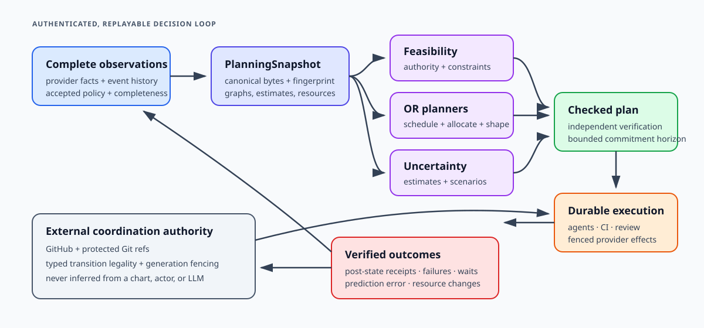
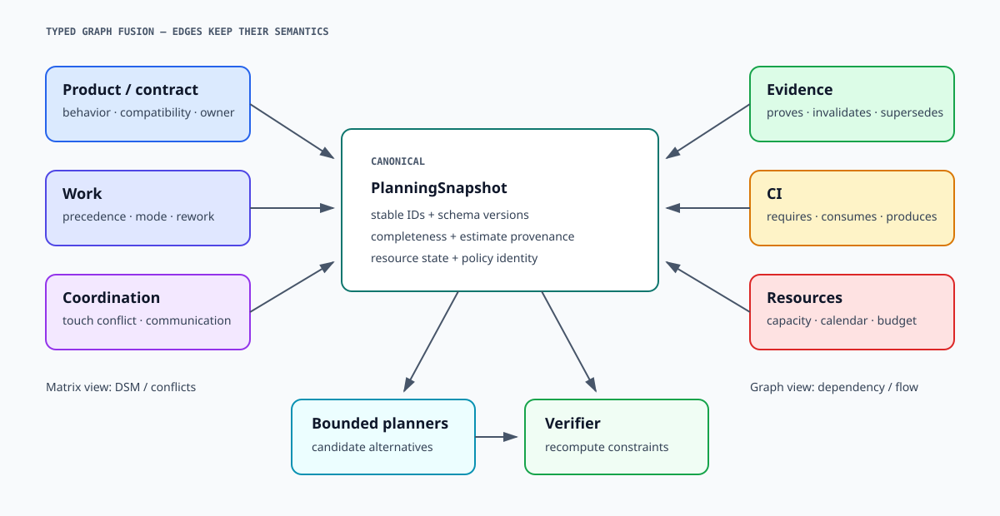
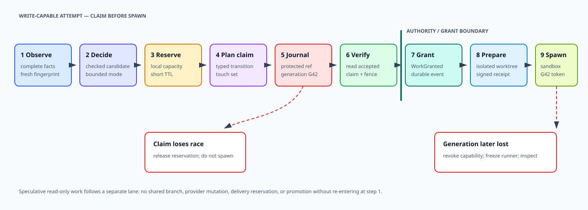
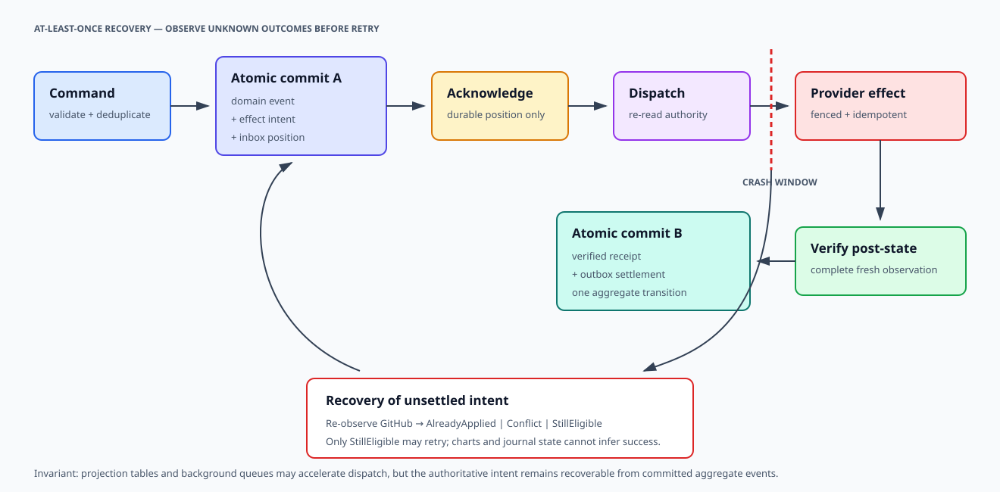
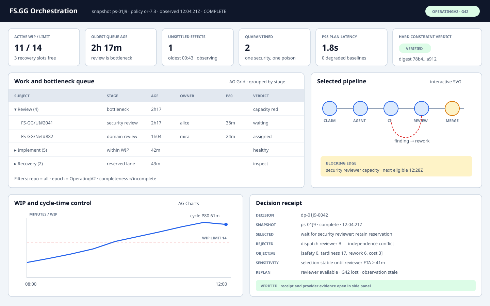

# Design: operations-research-first agent orchestration

This design adds a continuously running, authenticated agent harness above the existing FS.GG GitHub
coordination substrate. A pure operations-research control kernel models the delivery system, shapes work,
chooses information-gathering and execution modes, schedules constrained resources, and emits independently
checkable plans. ASP.NET Core and SignalR form the public WebSocket boundary; Akka.NET supplies durable
workflow actors, supervision, workflow isolation, timers, and an optional path to multi-node availability;
disposable coding agents perform bounded creative tasks; and the
existing typed coordination engine plus GitHub/Git remain the authority for claims, fencing, mutation
legality, durable evidence, and recovery visible outside the orchestrator. The orchestrator improves
execution without discarding the already-built distributed control plane or allowing an LLM, socket,
process, actor, timer, or database lease to authorize an external mutation by itself.

| Field | Value |
|---|---|
| Status | Proposed architecture; records direction and implementation preparation, not production authorization |
| Authored | 2026-08-31 11:48 CEST (09:48 UTC) |
| Revised | 2026-09-01 — recentered on an OR-first closed-loop controller; hardened authority, cutover sequencing, determinism, claim ordering, crash consistency, and runner boundaries; and added the SVG/dashboard visualization architecture |
| Federation extension | 2026-09-07 — added proposed peer contribution, assignment-bound receipts, independent verification, bilateral isolation, and staged qualification in §8A; no production permission or existing contract is changed |
| Review hardening | 2026-09-07 — narrowed the first slice, separated replay from optimization, clarified review and effect authority, and added observation, recovery, verification-security and outcome-measurement proposals; existing controls and accepted ADRs are unchanged |
| Scope | Agent creation and communication, deterministic planning, GitHub mediation, persistence, authentication, supervision, liveness, availability, observability, and staged adoption |
| Preserves | GitHub-native multi-host coordination, typed transition checks, Git-ref fencing, exact-head evidence, durable receipts, and scheduled reconciliation |
| Builds on | [ADR-0034](../adr/0034-typed-coordination-engine.md), [ADR-0053](../adr/0053-roadmap-driven-milestone-loop-disposable-sdd-subagents.md), [ADR-0077](../adr/0077-quint-first-typed-specification-authority.md), [ADR-0078](../adr/0078-github-substrate-v2-new-only-coordination-authority.md), [ADR-0079](../adr/0079-single-accountable-delivery-authority.md), and the [remaining-v2 architecture review](2026-08-30-github-substrate-v2-remaining-migration-architecture-review.md) |
| Candidate runtime | ASP.NET Core + SignalR + Akka.Hosting + Akka.Persistence; PostgreSQL first, Akka.Cluster deferred; AG Grid/AG Charts for operational grids and conventional charts; SVG + ELK layered layout for complex graphs |
| Lifecycle placement | Independent of the GitHub Substrate v2 critical path; read-only and shadow work may prepare the runtime, but normal mutation requires the external epoch and a separately accepted operating boundary |
| Primary decision | Treat the OR kernel as the execution-decision control plane, Akka.NET as its preferred durable realization, and FS.GG/GitHub as external coordination authority |

## 1. Context and decision

FS.GG already contains valuable coordination behavior developed from real multi-agent failures: worker
identity, claim fencing, touch-set exclusion, dependency classification, exact-head review, post-write
verification, release recovery, typed unknown/incomplete observations, durable receipts, and an externally
inspectable GitHub representation. Rebuilding those semantics inside a daemon would spend completed work,
create two authorities, and make correctness depend on one machine.

The current operator experience nevertheless asks short-lived agents and their prompts to carry too much
runtime responsibility. They reconstruct state, poll GitHub, remember heartbeats, coordinate reviews,
retry effects, and decide what to do next. A terminated agent can leave durable work behind. A new agent
must recover context from GitHub and prose. Long waits consume interactive turns, and procedural guidance
grows as each incident adds another instruction.

FS.GG therefore adopts the following target direction:

1. **Keep the existing GitHub/Git substrate.** It remains the externally durable coordination and fencing
   authority, usable by independent machines and by the emergency CLI when the orchestrator is unavailable.
2. **Make operations research the execution-decision center.** A versioned OR kernel models work,
   information, uncertainty, dependencies, resources, queues, and risk; it chooses the shape and timing of
   admissible SDD, agent, CI, review, delivery, and recovery actions.
3. **Add one preferred normal executor.** A hosted orchestrator becomes the default path for agent
   creation, scheduling, communication, GitHub access, retry, and recovery. It is not an authorization
   authority, the sole store of coordination truth, or proof that an external transition is legal.
4. **Use actors for lifecycle, not policy authorship.** Akka.NET actors serialize work, persist events,
   supervise children, and schedule wakeups. Pure reducers and constraint solvers decide; actors do not
   hide mutable policy inside callbacks.
5. **Use deterministic admissibility around probabilistic agents.** LLMs may propose, implement, explain,
   and critique. Deterministic code decides whether a proposal is complete, safe, current, affordable,
   and legal to execute.
6. **Expose a narrow authenticated WebSocket protocol.** Clients never address arbitrary actor paths,
   submit arbitrary runtime objects, or receive GitHub credentials.
7. **Persist intent before effects and verify after effects.** Recovery is at-least-once. Idempotency,
   generation fencing, and post-state observation make duplicate execution safe.
8. **Begin as one durable node.** systemd restarts it; clients reconnect and replay. Akka.Cluster is added
   only after a measured availability requirement and an accepted split-brain/fencing design.

This is an additive architecture proposal. It does not amend the GitHub Substrate v2 cutover sequence or
authorize a continuously hosted service for that safety-critical cutover. The runtime operational boundary
must receive its own acceptance before it can become a required production writer.

Design, pure-kernel, read-only, and shadow work may proceed without putting this service on the v2 critical
path. The default sequencing is that bounded mutation canaries begin only after `OperatingV2`. An earlier
mutation role would require a separate accepted decision that names the epoch, writer class, rollback
posture, and reason it does not weaken the cutover. No harness milestone is an implicit prerequisite for
`OpenV2`, and no incomplete harness milestone may delay the independently qualified v2 cutover.

### 1.1 Decision posture

This document deliberately separates architectural commitments from product selections that still need
evidence:

| Posture | Decisions |
|---|---|
| Direction fixed by this proposal | OR-first execution decisions; external GitHub/Git fencing; typed-engine legality; disposable agents; deterministic plan verification; durable intent before effects; one preferred normal executor; emergency CLI retained; AG Grid/AG Charts for grids and conventional charts; an accessible SVG graph surface for complex pipelines and topology |
| Candidate pending a vertical slice | Akka.Persistence plugin and serializer; PostgreSQL schema and outbox realization; SignalR replay implementation; identity provider; sandbox/runner technology; artifact store; optimizer and solver libraries; exact AG Grid/AG Charts edition and licence; ELK.js/D3 packaging and SVG export implementation |
| Separately accepted before production | operational owner and SLO; data classification and retention; GitHub App principal split; mutation canary scope; disaster recovery; any required hosted-service dependency |
| Deferred by design | Akka.Cluster, sharding, remote actor transport, learned scheduling policy, and a mandatory webhook runtime |

A candidate selection becomes binding only when its named qualification evidence is accepted. Replacing a
candidate must not change the authority split or the public domain contracts silently.

## 2. Goals and non-goals

### 2.1 Goals

The harness must:

- accept authenticated human and machine clients over `wss://`;
- maintain durable logical sessions independently of transient WebSocket connections;
- create a fresh, bounded agent for each unit of creative work;
- supervise agent processes and correlate them with GitHub claims, branches, worktrees, pull requests,
  checks, review epochs, and receipts;
- select and sequence work through inspectable deterministic policy;
- centralize normal GitHub API access, credentials, pagination, rate budgets, mutation serialization,
  retries, and postcondition checks;
- replay local state deterministically and recover safely after process termination, machine reboot, lost
  messages, duplicate commands, and changed external facts;
- retain the existing CLI and GitHub-visible protocol as emergency, diagnostic, and multi-host paths;
- expose why each action was selected, refused, deferred, retried, or escalated;
- expose the same versioned read models through coordinated grids, conventional charts, and accessible SVG
  pipeline/graph views without making a visualization authoritative;
- isolate one failed issue, agent, repository, or provider without corrupting unrelated workflows; and
- provide a measured path from one node to passive failover or clustering without changing domain policy.

### 2.2 Non-goals

The harness does not:

- replace GitHub issues, Projects, protected refs, checks, releases, or attestations as authoritative facts;
- replace the typed coordination engine or reimplement its transition predicates in actor code;
- treat actor existence, socket connectivity, heartbeat, lease expiry, or agent confidence as delivery evidence;
- provide exactly-once external effects;
- expose Akka.Remote to browsers, agents, or any untrusted network;
- give an agent the GitHub App private key, installation token, database credential, or unrestricted shell;
- make utility optimization capable of overriding a hard invariant;
- require Akka.Cluster, sharding, distributed data, or multi-node discovery in the first release; or
- make a second agent or reviewer an independent delivery authority contrary to ADR-0079.

## 3. Authority and trust boundaries

The architecture has five distinct authorities. Keeping them separate prevents a convenient runtime
mechanism from becoming an accidental source of truth.

| Authority | Owns | Must not own |
|---|---|---|
| Quint / compiled FS.GG contract | Declared process behavior, invariants, model traces, stable semantic identities | Runtime scheduling, credentials, live GitHub facts |
| OR control kernel | Feasibility, work shape, information choice, scheduling, resource allocation, plan verification, explanation | External mutation or transport retry |
| Akka.NET execution plane | Serialization, lifecycle, supervision, timers, persistence, routing, recovery | GitHub transition legality or identity authentication |
| Typed coordination engine | Complete observation classification, claim/effect legality, mutation plans, receipts | Agent creativity or network session management |
| GitHub/Git | Native work facts, protected history, checks, externally visible journals and fencing generations | Agent runtime state or unverified inferred intent |

The public network, agent sandbox, orchestrator process, persistence store, GitHub API, and Git authority
repository are separate trust zones:

```text
Human or machine client
        │  untrusted network
        ▼
TLS / authentication / authorization boundary
        │  typed command envelope
        ▼
ASP.NET Core + SignalR gateway
        │  internal typed messages only
        ▼
Akka.NET actor system ───── durable journal / snapshot / outbox
        │                              │
        │ spawn contract               │ encrypted storage boundary
        ▼                              │
isolated agent worker                  │
        │ proposal/artifact only       │
        └──────────────► deterministic policy
                                      │ guarded plan
                                      ▼
                             typed GitHub adapter
                                      │ short-lived App token
                                      ▼
                              GitHub + protected Git refs
```

An agent response is untrusted content. A WebSocket command is authenticated input, not automatically an
authorized effect. A persisted actor event proves what the orchestrator recorded, not what GitHub accepted.
A GitHub projection may describe a claim, while the protected journal generation fences it. Each boundary
retains its own receipt and identity.

### 3.1 Authority precedence and disagreement

When durable views disagree, precedence is explicit:

1. protected Git history and complete current GitHub observations decide external facts and fencing;
2. the versioned typed coordination engine decides whether those facts admit a transition;
3. the orchestrator journal decides which local command, plan, or attempt it recorded;
4. caches, dashboards, WebSocket state, agent reports, and Project projections are hints or views.

Reconciliation never overwrites an external fact merely to make it agree with the actor journal. It records
the divergence, re-runs the typed reducer over a complete observation, and either adopts the external result,
continues a still-current intent, or quarantines the workflow. A local workflow revision, actor identity,
database lock, or scheduler reservation cannot substitute for the external fencing generation.

## 4. Operations-research control architecture

FS.GG treats software delivery as a partially observed, stochastic, resource-constrained flow system. The
controller repeatedly decides four things: what information to acquire, how to shape the work, which
admissible execution mode to use, and when to commit scarce resources. It does not optimize one backlog
score or ask an LLM to improvise the workflow.

The closed loop is shown below. The external-authority lane is deliberately distinct from the planning and
execution loop: it supplies facts and fencing, and receives only typed, revalidated effects.



Only a bounded first part of a plan is committed. New provider facts, completions, failures, claims,
deadlines, estimates, or resource changes create a new planning snapshot. This rolling-horizon design
retains strategic intent without pretending that long software plans execute exactly as estimated.

### 4.1 Controlled system

The OR kernel models six coupled graphs:

| Graph | Nodes | Edges or capacities | Decisions supported |
|---|---|---|---|
| Product/contract | behaviors, contracts, components, repositories | dependency, compatibility, ownership | release scope and coherent change boundaries |
| Work | SDD and delivery activities | precedence, alternative mode, rework, cancellation | work-item shape and execution sequence |
| Coordination | people, agents, teams, repositories | communication need, touch conflict, independence | decomposition and assignment |
| Evidence | claims, observations, tests, reviews, receipts | proves, invalidates, supersedes | next information and acceptance actions |
| CI | build/test/policy obligations | consumes, produces, requires | selection, partitioning, ordering, runner placement |
| Resources | agent profiles, humans, runners, APIs, mutation lanes, budgets | capacity and calendars | admission, reservation, fairness, and recovery headroom |



The dependency and coordination graphs are distinct. Two tasks may be technically independent yet compete
for one touch set, reviewer, runner, or API budget. Conversely, related tasks may execute in parallel when
their contracts and integration evidence are explicit. [Design-structure-matrix analysis](https://doi.org/10.1109/17.946528)
supplies candidate partitions, while the protected coordination substrate decides actual claims.

### 4.2 Canonical planning snapshot

Every planning decision consumes one immutable snapshot:

```fsharp
type Estimate =
    { Samples: int
      P50: decimal
      P80: decimal
      P95: decimal
      DistributionId: string
      CalibrationWindow: string }

type ExecutionMode =
    { ModeId: string
      RequiredCapabilities: Set<string>
      Duration: Estimate
      Cost: Estimate
      FailureProbability: decimal option
      ReworkProbability: decimal option
      InformationGain: decimal option
      SetupClass: string
      Recoverability: string }

type PlanningSnapshot =
    { SnapshotId: string
      DecisionTime: System.DateTimeOffset
      FleetEpoch: string
      PolicyVersion: PolicyVersion
      WorkGraph: WorkGraph
      CoordinationGraph: CoordinationGraph
      EvidenceGraph: EvidenceGraph
      CiGraph: CiGraph
      ResourceState: ResourceState
      ExecutionModes: Map<string, ExecutionMode list>
      ObservationCompleteness: Map<string, Completeness>
      EstimateSetId: string }
```

Point estimates without provenance are not planning facts. Initially, an estimate may be an explicit wide
prior or a declared unknown. Completed and failed attempts update versioned empirical distributions by
work class, repository, execution mode, agent profile, CI shape, and review path. Censored observations such
as cancellation and timeout remain censored; they are not rewritten as successful durations.

#### Observation coherence

The canonical snapshot is an immutable observation bundle, not necessarily an atomic snapshot of GitHub.
Its materializer would retain per-fact revision, observation time and provenance, then check cross-fact
compatibility and a decision-class-specific maximum observation skew. Individually fresh facts can still
describe a combination that never existed simultaneously. Safety-relevant facts need effect-time
revalidation; an incompatible bundle cannot acquire authority merely by hashing it. The product/contract
graph described in §4.1 must also be bound into the snapshot, directly or by an immutable graph reference;
the illustrative record above is not yet a complete published schema.

### 4.3 Decision variables

The controller may choose:

- whether to admit, defer, cancel, recover, or quarantine a work subject;
- whether a candidate scope remains one item or is partitioned into independently qualifiable slices;
- which SDD action comes next: clarify, specify, model, prototype, plan, decompose, implement, or review;
- which execution mode and agent profile, if any, performs each activity;
- agent count, context package, tool surface, budget, deadline, and join contract;
- start time, capacity reservation, and dependency order;
- CI obligation closure, job partition, ordering, batching, runner class, and retry policy;
- reviewer set, role coverage, assignment, and review timing;
- whether another observation, experiment, test, or critique is worth its delay and cost;
- whether an uncertain operation should be observed, resumed, compensated, rolled forward, or escalated; and
- which near-term actions are committed before the next replanning boundary.

An LLM may propose work, estimates, decompositions, or model features. It cannot insert them into the
accepted planning snapshot without schema validation, provenance, and deterministic checks.

### 4.4 Constraints before objectives

The feasible set is defined before any optimization. Hard constraints include:

- authority epoch, claim generation, touch-set exclusion, and typed transition legality;
- complete-enough observations for the proposed decision class;
- work and contract precedence;
- independently verifiable vertical-slice and delivery routes;
- fresh critique/evidence phases, review-epoch freshness, and one accountable delivery owner; organizational
  separation only when an applicable external control explicitly requires it;
- mandatory SDD, formal, CI, security, release, and post-merge obligations;
- agent, runner, human, repository, API, mutation, disk, time, token, and money capacity;
- sandbox, credential, data-residency, and provider restrictions;
- WIP ceilings plus reserved recovery and incident capacity; and
- explicit stop-the-world and quarantine conditions.

Safety and authority are not penalties. No expected value, deadline, aging debt, or solver objective can buy
permission to violate them. Operational uncertainty inside the feasible set may use robust or chance-bounded
constraints—the adjustable conservatism in [robust optimization](https://doi.org/10.1287/opre.1030.0065)
is useful here—but missing legal authority is never modeled as a probability.

Within the feasible set, objectives are lexicographic:

| Tier | Objective |
|---:|---|
| 1 | Minimize worst-case or bounded probability of missing accepted safety, recovery, and service targets |
| 2 | Minimize weighted tardiness, blocking time, and age of admitted work; protect the critical path |
| 3 | Minimize expected rework, coordination delay, failure recovery, and review/CI feedback time |
| 4 | Minimize money, tokens, runner/API use, duplicated setup, and energy proxies |
| 5 | Reduce fairness and knowledge-concentration debt and prefer information-rich actions where otherwise equivalent |

Scalar weights are allowed only within one declared tier. The receipt preserves the Pareto alternatives and
sensitivity ranges when materially different plans remain feasible.

Where starvation is unacceptable, the proposed policy also needs explicit minimum-service or maximum-wait
constraints over eligible work, with feasibility and outage assumptions disclosed. Aging in tier two helps,
but fairness in tier five alone cannot guarantee service. Safety constraints remain non-negotiable when a
service target becomes infeasible; the result is an explained escalation, not an unsafe dispatch.

### 4.5 Decomposed planner stack

One giant model would be difficult to explain, calibrate, and recover. The kernel therefore composes bounded
planners with explicit contracts:

| Planner | Primary model | Output |
|---|---|---|
| `WorkSizer` | DSM/graph partitioning plus setup, cut, variance, and rework costs | candidate independently qualifiable work packages |
| `SddPlanner` | mandatory-stage rules plus value of information and bounded optimal stopping | next design, experiment, or implementation action |
| `PortfolioScheduler` | robust multi-mode resource-constrained project scheduling | rolling start, mode, capacity, and WIP plan |
| `CiPlanner` | sound obligation closure, set cover, bin packing, and parallel-machine scheduling | CI jobs, order, runner placement, and sentinels |
| `ReviewPlanner` | constrained bipartite matching/min-cost flow | reviewers, roles, deadlines, and knowledge-spread disposition |
| `AgentAllocator` | generalized assignment/contract-net selection | content-addressed agent specifications and reservations |
| `RecoveryPlanner` | shortest-path or bounded stochastic planning over saga states | observe, retry, adopt, replace, compensate, roll forward, or escalate |

Each planner reports `Feasible`, `Infeasible`, `Unknown`, or `TimedOutWithCandidate`. A timed-out candidate
is never called optimal. Its plan must still pass the same independent feasibility checker.

### 4.6 Rolling horizon, commitment, and stability

The controller plans farther than it commits. The committed horizon normally contains only:

- capacity and external-claim acquisition for the next dispatches;
- already-approved CI/review actions;
- effect intents whose external preconditions are about to be revalidated; and
- wakeups or observations needed before another decision.

Activities beyond that horizon are forecasts, not promises. Replanning is triggered by material events or a
bounded clock, not every telemetry sample. Already running work has a switching cost, and the planner uses
hysteresis so small estimate changes do not churn agents, reviewers, or CI jobs. A changed hard constraint,
lost generation, safety finding, or newly blocked critical path overrides that stability preference.

Queue control uses bottleneck-specific WIP ceilings rather than maximizing utilization.
[Little's law](https://doi.org/10.1287/opre.9.3.383) makes cycle time, throughput, and WIP jointly accountable;
[heavy-traffic queueing](https://doi.org/10.1017/S0305004100036094) explains why small remaining capacity can
have disproportionate latency value. The policy therefore reserves explicit recovery capacity and treats
persistent near-saturation as an admission defect, not evidence that the system is efficient.

### 4.7 Independent plan verification

Solver output is untrusted until checked by a small deterministic verifier that does not reuse the solver's
search code. The verifier confirms:

- every selected activity and execution mode exists in the snapshot;
- every hard constraint and precedence edge holds;
- all resource intervals fit declared calendars and capacities;
- touch conflicts and independence rules are respected;
- CI obligations and evidence routes are complete;
- committed actions have stable identities and executable recovery dispositions; and
- objective terms and explanation totals recompute from canonical bytes.

For high-risk changes, named semantic mutations remove a dependency, capacity constraint, required gate,
claim generation, reviewer role, or recovery step and must make verification red. Feasibility verification
is required even when a human chooses a non-optimal alternative.

Independent code is not independent evidence if the planner and checker consume the same incomplete graph.
The checker would reconstruct mandatory obligations from authoritative contract inputs independently of
planner-selected edges, retain provenance for each obligation, and reject unsupported completeness claims.
Qualification therefore includes deletions and corruptions in snapshot construction, not only mutations in
solver constraints. The trusted checking core and its assumptions should remain small and explicit; a
shared omission must not produce two agreeing green results.

### 4.8 Decision and execution receipts

```fsharp
type OrDecisionReceipt =
    { DecisionId: string
      SnapshotId: string
      PolicyVersion: PolicyVersion
      ModelVersions: Map<string, string>
      SolverIdentity: string
      SolverSettingsDigest: string
      FeasibleAlternatives: string list
      RejectedByConstraint: ConstraintFailure list
      ObjectiveVector: decimal list
      Sensitivity: string list
      SelectedPlanDigest: string
      VerificationDigest: string
      CommittedActions: string list
      NextReplanTriggers: string list }
```

Execution receipts later join predicted and observed duration, cost, failure, rework, queue delay, CI yield,
review yield, and delivery outcome. The estimator never trains on an agent's self-reported success; it uses
verified workflow and provider facts.

### 4.9 Simulation and policy promotion

No new policy moves directly from a notebook or LLM proposal into live dispatch. Promotion proceeds through:

1. deterministic unit and feasibility tests;
2. replay over historical snapshots and named incidents;
3. discrete-event simulation with arrival, duration, failure, rework, and outage scenarios;
4. adversarial/mutation cases for hard constraints and estimator error;
5. live shadow decisions against the incumbent policy;
6. a bounded canary with explicit rollback; and
7. an accepted versioned policy receipt.

Historical replay cannot prove counterfactual outcomes, so policy comparison reports uncertainty and relies
on simulation or controlled canaries for causal claims. The simulator follows a declared modeling method
rather than an ad hoc queue script; prior work provides a
[systematic discrete-event method for software processes](https://arxiv.org/abs/1403.3559). Online learning
may update advisory estimates inside accepted bounds; it may not rewrite constraints, objectives, or
promotion criteria.

### 4.10 Solver realization

[Google OR-Tools CP-SAT](https://developers.google.com/optimization/cp/cp_solver) is the first candidate for
finite-horizon scheduling, alternative execution modes, interval capacities, and assignment because it has
a supported .NET surface and established [scheduling](https://developers.google.com/optimization/scheduling/job_shop)
and [assignment](https://developers.google.com/optimization/assignment/assignment_example) models. Graph
partitioning, transitive closure, min-cost flow, and small value-of-information enumerations remain dedicated
pure algorithms rather than being forced into CP-SAT.

Every production solve pins solver binary, parameters, worker count, seed, canonical input, stopping budget
and objective hierarchy. Section 6.1 distinguishes deterministic reruns from recorded bounded search results;
accepted plan bytes and independent verification remain the execution input in either case. Upgrade
qualification compares feasible sets and objective bounds before changing the solver identity. A simple baseline heuristic remains available
when the optimizer is unavailable, but it must satisfy the same hard constraints and disclose its degraded
objective quality.

## 5. Runtime topology

### 5.1 ASP.NET Core host

One .NET Generic Host runs:

- Kestrel behind a TLS-terminating reverse proxy or with direct TLS;
- SignalR hubs and small HTTP control endpoints;
- authentication and authorization middleware;
- liveness, readiness, dependency, and metrics endpoints;
- Akka.Hosting and the actor system;
- PostgreSQL connectivity for Akka.Persistence and the transport inbox/outbox;
- the GitHub App credential broker; and
- graceful startup and shutdown coordination.

Akka.Hosting is the preferred integration package because it binds Akka.NET to
`Microsoft.Extensions.Hosting`, configuration, dependency injection, logging, OpenTelemetry, and health
checks. The public service remains an ordinary ASP.NET Core application; actors do not replace its security
middleware or HTTP lifecycle.

### 5.2 Actor hierarchy

```text
/user/orchestrator
├── decision                       canonical snapshot and pure OR facade
│   ├── policy                     policy/model/estimate version registry
│   ├── planners                   work, SDD, portfolio, CI, review, agent, recovery
│   └── verifier                   independent feasibility and receipt checker
├── scheduler                      committed capacity, dispatch, and replan wakeups
├── reconciler                     complete audits and subject reconciliation
├── github
│   ├── observations               bounded concurrent, cache only immutable facts
│   ├── mutations/<aggregate>      serialized guarded mutation lanes
│   ├── rate-budget                REST/GraphQL/install budget and backpressure
│   └── credential-broker          mints scoped short-lived installation tokens
├── sessions/<session-id>          durable logical human/agent sessions
│   └── connections/<connection>   transient SignalR connection proxies
├── work/<repo>/<issue>            durable issue process entities
│   ├── agent/<attempt>            one disposable creative-agent attempt
│   ├── critic/<epoch>             optional fresh critique phase identity
│   └── delivery/<generation>      exact-head delivery process
├── operations/<operation-id>      cross-step mutation saga
├── audit                          evidence and invariant projections
└── quarantine                     failed entities requiring operator decision
```

The top-level guardian applies supervision policy. An issue actor owns one logical workflow and is the
only actor allowed to evolve that workflow's local state. GitHub mutation actors are partitioned by
conflict aggregate rather than represented by one global bottleneck. Connection actors are disposable;
session and work actors are durable.

### 5.3 Actor responsibilities

| Actor | Persistent | Responsibility |
|---|---:|---|
| `Decision` | Receipt/pointer | Materialize a canonical snapshot, invoke pure planners/verifier, and publish a checked plan |
| `Scheduler` | Yes | Execute only committed checked-plan actions; maintain capacity reservations and replan wakeups |
| `WorkItem` | Yes | Execute one issue lifecycle and correlate every attempt and external artifact |
| `AgentAttempt` | Partly | Supervise one sandbox/process; durable facts live in its parent work item |
| `Session` | Yes | Identity, capability generations, replay cursor, and connection replacement |
| `Connection` | No | Translate outbound actor events to one SignalR connection and report transport state |
| `GitHubObservation` | No/cache | Perform bounded typed reads; never turn incomplete data into absence |
| `GitHubMutation` | Intent/receipt | Serialize by aggregate, mint token, re-read, apply, verify, record |
| `Operation` | Yes | Manage a resumable multi-step saga and compensation plan |
| `Reconciler` | Cursor/receipt | Repair missed events and out-of-band changes through complete audits |
| `Policy` | Version pointer | Resolve exact constraint, objective, model, estimate, solver, and baseline identities |

### 5.4 Durable ownership inside the execution plane

Actor serialization is local to one persistence identity. Cross-entity decisions therefore use explicit
protocols rather than assuming that the hierarchy supplies a transaction:

- `Scheduler` owns bounded local capacity reservations and fairness accounting;
- `WorkItem` owns the lifecycle revision and agent-attempt lineage for one canonical issue subject;
- protected coordination journals own claims, touch-set grants, review epochs, and operation generations;
- mutation lanes serialize provider calls but do not own the domain decision; and
- `Operation` owns saga progress while each external step remains independently fenced and verified.

Messages between these owners carry stable command identities and expected revisions. A timeout produces an
unknown outcome followed by inspection, not an inferred rollback. Capacity reservation and external claim
acquisition form a resumable saga: either may need compensation, and neither alone is a work grant. The
canonical work-item persistence ID and conflict aggregate are derived by one versioned normalizer so aliases,
case differences, repository transfers, or issue URL forms cannot create parallel actors for one subject.

## 6. Domain model and deterministic core

Actor messages are commands and observations. Persisted records are domain events. External writes are
effects. These categories must not share a catch-all object type.

Illustrative F# contracts:

```fsharp
type WorkflowRevision = WorkflowRevision of int64
type PolicyVersion = PolicyVersion of string
type IdempotencyKey = IdempotencyKey of string
type FencingGeneration = FencingGeneration of int64

type Completeness =
    | Complete
    | Incomplete of reason: string * cursor: string option
    | Unauthorized of reason: string
    | Unsupported of capability: string
    | Indeterminate of reason: string

type CommandEnvelope<'command> =
    { CommandId: IdempotencyKey
      CausationId: string
      CorrelationId: string
      PrincipalId: string
      SessionId: string
      SessionGeneration: int64
      Subject: string
      ExpectedRevision: WorkflowRevision option
      IssuedAt: System.DateTimeOffset
      ExpiresAt: System.DateTimeOffset
      Command: 'command }

type Decision<'action> =
    | Act of actions: 'action list * explanation: DecisionExplanation
    | Wait of wakeups: Wakeup list * explanation: DecisionExplanation
    | Refuse of reasons: Refusal list * explanation: DecisionExplanation
    | Escalate of question: Escalation * explanation: DecisionExplanation

type SolveStatus =
    | Optimal
    | FeasibleWithBound of bound: decimal option
    | TimedOutWithCandidate of bound: decimal option
    | Infeasible
    | Unknown of reason: string

type CandidatePlan =
    { PlanId: string
      SnapshotId: string
      Status: SolveStatus
      ObjectiveVector: decimal list
      Actions: DomainAction list
      CommittedActionIds: string list }

type PlanningDecision =
    | Proposed of plan: CandidatePlan * explanation: DecisionExplanation
    | WaitForPlanningInput of wakeups: Wakeup list * explanation: DecisionExplanation
    | PlanningRefused of reasons: Refusal list * explanation: DecisionExplanation
    | PlanningEscalated of question: Escalation * explanation: DecisionExplanation

type CheckedPlan =
    { Candidate: CandidatePlan
      VerificationDigest: string }

type EffectIntent<'effect> =
    { IdempotencyKey: IdempotencyKey
      Subject: string
      ExpectedWorkflowRevision: WorkflowRevision
      ExpectedExternalGeneration: FencingGeneration option
      PolicyVersion: PolicyVersion
      Effect: 'effect }
```

The central functions remain pure:

```fsharp
val evolve : WorkflowState -> WorkflowEvent -> WorkflowState
val materializeSnapshot : Policy -> ObservationSet -> WorkflowState list -> Result<PlanningSnapshot, Refusal list>
val plan : Policy -> PlanningSnapshot -> PlanningDecision
val verifyPlan : Policy -> PlanningSnapshot -> CandidatePlan -> Result<CheckedPlan, ConstraintFailure list>
val compileEffects : PlanningSnapshot -> CheckedPlan -> EffectIntent<ProviderEffect> list
```

`evolve` is replayed by persistence recovery and property-tested for determinism. `plan` is called only with
a canonical fingerprinted snapshot. `verifyPlan` uses independent constraint-checking code before any
commitment. `compileEffects` sees only verified committed actions and cannot manufacture a missing generation
or convert an incomplete observation into permission.

### 6.1 Determinism envelope

Determinism is a contract over recorded inputs, not a claim that wall clocks, APIs, solvers, or model
providers are naturally deterministic. Every policy evaluation binds:

- canonical state and observation bytes plus their schema versions and completeness proofs;
- an explicit decision time or logical tick rather than a direct wall-clock read;
- policy, compiled-contract, rule-corpus, solver, and tool versions;
- a recorded random seed for any permitted randomized tie-break or search;
- canonical collection ordering, string normalization, and identifier comparison;
- numeric representation, rounding, timeout, and solver optimality settings; and
- declared resource budgets and capability inventory.

The decision receipt contains those identities and the selected plan digest. Stable ordering resolves equal
solutions unless a recorded seed is an intentional policy input. Time passing changes a decision only after
a durable tick or fresh observation is admitted. Three guarantees are distinct:

- event replay reproduces recorded workflow state without rerunning the optimizer;
- verification of recorded plan bytes reproduces the same semantic verdict and explanation; and
- optimization reruns reproduce a selected plan only under an explicitly qualified deterministic search
  profile. Otherwise the plan is a recorded search result whose feasibility and objective quality can be
  checked, not a promise that another solve chooses identical bytes.

Pinning seed and worker count alone does not establish deterministic parallel, wall-clock-limited search.
[OR-Tools distinguishes deterministic and nondeterministic search paths](https://github.com/google/or-tools/blob/stable/ortools/sat/cp_model_solver.cc).
Qualification would pin the actual execution profile, numeric environment and stopping semantics. A hard
wall-clock cancellation can yield a different incumbent even when the search policy is repeatable; retain
the selected candidate and its status. Elapsed-time telemetry is separate from byte-stable semantic records.
Obtaining a different live observation correctly creates a new envelope.

Deterministic replay proves reproducibility, not correctness or freshness. Invariants, independent oracles,
and provider re-observation remain mandatory.

### 6.2 Why pure policy remains outside actors

Putting decisions directly in actor receive handlers would make concurrency safe but meaning difficult to
test, compare, simulate, or model-check. The actor should perform a small protocol:

```text
receive command or observation
→ validate envelope and expected revision
→ materialize canonical planning snapshot
→ call pure planners and independent verifier
→ persist decision receipt and committed domain events atomically
→ update state by evolve
→ dispatch persisted effect intents
→ receive verified receipts
→ persist outcomes
```

The same policy package can then drive simulation, replay an incident, explain a live refusal, generate
counterexamples, and compare proposed versions without starting Akka or contacting GitHub.

## 7. OR models for the delivery lifecycle

The common planning snapshot does not imply one common algorithm. Each lifecycle surface receives the
smallest model that captures its real decision, uncertainty, and failure cost.

### 7.1 Work-item shape and decomposition

`WorkSizer` begins from required behavior, contract boundaries, evidence obligations, and a design structure
matrix—not a target number of lines, files, or hours. Candidate cuts must preserve an independently
qualifiable vertical slice and name the integration contract between slices. Empirical work on
[coordination requirements](https://doi.org/10.1145/1180875.1180929) supports modeling the communication
created by technical dependencies rather than assuming repository or team boundaries contain it.

For a candidate partition `P`, the model estimates:

```text
ShapeCost(P) = fixed claim/branch/context/setup cost
             + expected implementation and integration time
             + cut-edge coordination and contract cost
             + expected CI and review cost
             + expected contention delay
             + expected rework and recovery cost
             + critical-path and tail-latency penalty
```

Very small items repeatedly pay setup, claims, context compilation, CI startup, review, and merge overhead.
Very large items increase duration variance, time to feedback, review context, touch contention, stale-base
risk, and failure blast radius. The minimum is learned per work class and repository; it is not a universal
size threshold. A [large multi-platform empirical study](https://arxiv.org/abs/2203.05045) found no general
relationship between pull-request size and merge time, reinforcing the decision not to use LOC as the
sizing authority.

The planner proposes `Keep`, `Split(partition)`, `Merge(subjects)`, or `Probe(question)`. Splitting is admitted
only when the expected flow/rework gain exceeds the added coordination cost across credible estimate ranges.
A human or agent may propose a partition, but the graph, constraints, evidence routes, and estimate provenance
must compile independently.

### 7.2 Portfolio flow, WIP, and robust scheduling

`PortfolioScheduler` solves a rolling multi-mode resource-constrained project scheduling problem. Activities
have alternative execution modes, precedence, calendars, shared resources, touch conflicts, setup classes,
and uncertain duration/rework. Robust scenarios cover credible duration, outage, and rework variation; the
nominal fastest schedule is not accepted if small perturbations collapse it. A
[two-stage robust RCPSP formulation](https://arxiv.org/abs/2004.06547) demonstrates that adjustable robust
project scheduling can remain computationally tractable enough to serve as a candidate basis.

Admission control is bottleneck-specific:

- cap active implementation by agent and touch-set capacity;
- cap review-ready work by reviewer capacity;
- cap merge-ready work by CI and mutation capacity;
- reserve capacity for recovery, incidents, and critical unblockers;
- admit new work from measured departure and aging behavior rather than utilization targets; and
- refuse dispatch when required authority observations are incomplete; apply the explicit cold-start and
  calibration-degradation policy below to uncertain performance estimates.

The proposed cold-start policy distinguishes legality from prediction quality. Missing authority refuses
work; sparse duration evidence uses conservative priors, a deterministic baseline and lower WIP. A new mode
can receive a bounded experiment when its safety obligations are satisfied. Demonstrably unsafe calibration
disables that mode pending investigation. Insufficient samples alone must not create the circular condition
of requiring calibrated execution data before any safe execution can collect it.

Little's law provides the accountability identity between throughput, WIP, and cycle time. Heavy-traffic
queueing supplies the warning that high utilization plus variable service time creates nonlinear waiting.
The controller therefore reports bottleneck queue age, utilization distribution, service-time variation,
and capacity headroom together. It does not celebrate throughput purchased with an exploding review queue.

The first baseline remains transparent: feasible critical-path work, recovery reserve, earliest accepted
deadline, aging, downstream unblock count, setup affinity, weighted fair allocation, then canonical tie-break.
The robust solver must beat that baseline in replay and simulation before taking dispatch authority.

### 7.3 SDD as sequential value of information

The SDD lifecycle is a sequential decision problem, not a mandatory amount of prose. Its action set includes:

```text
Clarify | Specify | Model | Prototype | Research | Plan | Decompose
ImplementSlice | Review | Reobserve | AskHuman | StopAsReady | Refuse
```

Mandatory constitutional, authority, safety, and evidence gates remain hard constraints. Within them,
`SddPlanner` compares the expected value of another information action with its cost and delay. The value of
sample information is the expected reduction in downstream decision loss after observing its result. A
clarification, model, prototype, research pass, or critique proceeds when that reduction plausibly exceeds
the action cost and the result can change a real decision.

Examples:

- model a concurrency protocol when counterexamples could change the authority or fencing design;
- prototype an uncertain provider capability before writing a fleet migration plan around it;
- clarify an ambiguity when alternative answers produce materially different work or acceptance paths;
- stop elaborating when remaining uncertainty cannot change the selected feasible plan;
- return from implementation to specification when a finding invalidates a bound assumption; and
- reject ceremonial artifacts that add no information, constraint, or executable evidence.

This combines [Boehm's risk-driven spiral](https://doi.org/10.1109/2.59) with
[formal value-of-information accounting](https://doi.org/10.1214/aoms/1177728069). Requirements and
release choices use cost, value, dependency, risk, and uncertainty together rather than prioritizing value
alone; this extends established [cost-value requirements prioritization](https://doi.org/10.1109/52.605933)
and [robust next-release planning](https://doi.org/10.1145/2576768.2598334). The decision receipt records the
uncertain decision, candidate information actions, expected decision change, cost/delay, chosen action, and
stopping reason.

### 7.4 CI and qualification shape

`CiPlanner` separates four decisions that are often conflated:

1. **Obligation closure:** derive every required build, test, formal, policy, security, package, release, and
   post-merge obligation from changed semantic subjects and non-file inputs. This is a soundness constraint.
2. **Selection:** remove an obligation only when the accepted dependency model proves it not applicable.
3. **Partition and placement:** group selected obligations into jobs and runners.
4. **Ordering and cadence:** decide which failures can be surfaced first and which full sentinels run later.

Job partitioning minimizes expected feedback makespan, runner cost, repeated checkout/restore/setup,
retry amplification, artifact transfer, and failure-localization penalty. Constraints preserve dependency
order, job limits, required aggregate outputs, independent-control separation, runner capability, and full
merge-group behavior. More parallel jobs can reduce makespan, but queue and setup overhead create a measured
point of diminishing returns.

Regression selection starts with dependency-based sound closure. Historical predictive selection may rank
or supplement tests only after its miss rate, flakiness behavior, and drift are measured. Test ordering
maximizes expected fault detection per unit feedback time while the complete selected gate continues. Prior
CI research supports both [cost-aware selection and failure-early prioritization](https://doi.org/10.1145/2635868.2635910)
and [dynamic dependency selection](https://doi.org/10.1145/2771783.2771784). An industrial
[predictive-selection deployment](https://arxiv.org/abs/1810.05286) shows large cost savings are possible but
also demonstrates why explicit detection guarantees and full sentinels remain necessary.

Batching is an execution mode, not a default. The planner compares single-change runs, fixed/dynamic batches,
and shared test-case batches using arrival rate, setup cost, failure prevalence, localization/retest cost,
runner count, and deadline. Every batch preserves exact change membership and a deterministic isolation plan
for failures. [Large-scale CI batching research](https://arxiv.org/abs/2308.13129) shows that feedback time
and machine use respond nonlinearly to batch and runner count, supporting empirical policy calibration.
Scheduled full-suite sentinels compare selected closure with actual failures; a miss disables selection for
the affected policy scope.

### 7.5 Review and delivery pipeline

`ReviewPlanner` treats review as constrained information acquisition plus human capacity allocation. It uses
a bipartite assignment/min-cost-flow model with:

- required architecture, security, operations, domain, migration, or delivery roles;
- applicable authorization and conflict constraints, including organizational independence only when an
  external control actually requires it;
- expertise over the changed contracts and fault classes;
- active workload, queue age, calendars, and service targets;
- knowledge-concentration and succession risk;
- review-epoch freshness and change invalidation; and
- setup/context affinity while preserving a fresh critique phase and preventing stale evidence reuse.

The objective balances time to qualified review, fault-domain coverage, workload concentration, and knowledge
spread. [Large-scale reviewer-recommendation evidence](https://arxiv.org/abs/1806.07619) shows that no one
model is best across repositories, and [expertise/workload/turnover simulation](https://arxiv.org/abs/2312.17236)
demonstrates that reviewer choice can deliberately reduce knowledge risk.
Recommendations remain advisory until the selected human or agent identity satisfies the real authority rule.

Review size is measured by semantic and evidence surface, not LOC. The model considers changed behaviors,
contracts, authority boundaries, generated evidence, novelty, reversibility, and reviewer context. It may
request an early architecture critique before implementation, focused independent critiques in parallel, or
one consolidated exact-snapshot review. [Fagan's inspection process](https://doi.org/10.1147/sj.153.0182)
separates preparation, inspection, rework, and follow-up: a finding is not a fix, and a fix is not closed until
independently re-observed. Modern review research also shows that understanding and knowledge transfer are
material outcomes beyond defect discovery ([Microsoft](https://doi.org/10.1109/ICSE.2013.6606617),
[Google](https://doi.org/10.1145/3183519.3183525)).

The OR controller never creates a second delivery authority. It schedules critique and review evidence around
the single accountable delivery owner required by ADR-0079.

Fresh phase identity, independent verification mechanism, optional independent reviewer and accountable
owner are different concepts. Under ADR-0079 the owner may implement, critique, repair and deliver. A fresh
critique can use the same owner without pretending it is independent organizational review; an unavailable
second person or agent is not a routine blocker. Owner-controlled verification of remote work in §8A means
independence from the contributor's assertions, not a second authorizer.

### 7.6 Agent allocation and context compilation

Agents are stochastic execution modes, not workflow owners. `AgentAllocator` chooses among no agent, one
agent, sequential specialist agents, bounded parallel agents, a human, or a deterministic tool. Each profile
is described by measured capability, duration, token/money cost, success, rework, tool needs, context limits,
and failure/recovery behavior.

The assignment resembles generalized assignment and the
[contract-net pattern](https://doi.org/10.1109/TC.1980.1675516): a work contract declares the
objective and constraints, eligible profiles expose capabilities and estimates, and the controller awards a
bounded attempt. No agent negotiates away authority, evidence, sandbox, or budget constraints.

Context compilation has two classes:

- **mandatory:** authority boundary, exact snapshot, objective, dependencies, touch set, allowed paths/tools,
  governing contracts, safety rules, required outputs, and completion/evidence contract;
- **selectable:** source excerpts, history, examples, logs, research, prior attempts, and specialized skills.

Selectable context is a budgeted information problem. The compiler prefers evidence expected to change the
agent's decision or reduce error, discounts redundant material, and records omitted candidates. The immutable
context manifest, custom instructions, model/reasoning profile, sandbox, skills, tools, token budget, and
deadline form the `AgentSpecification`. Current
[Codex subagent facilities](https://learn.chatgpt.com/docs/agent-configuration/subagents) already support
specialized instructions and per-agent model, reasoning, sandbox, MCP, and skill configuration; the harness
adds durable work identity, external claims, resource accounting, and evidence contracts around that
execution surface.

Parallelism is selected only when expected critical-path or information-diversity benefit exceeds duplicated
setup, context, merge, review, and reconciliation cost. Write-heavy agents require disjoint touch sets or
isolated speculative outputs. Results join through typed artifacts/findings, never natural-language success.

### 7.7 Recovery, release, and reconciliation

`RecoveryPlanner` searches a bounded state graph whose actions include `Observe`, `Wait`, `Resume`, `Adopt`,
`Replace`, `RetryIdempotent`, `Compensate`, `RollForward`, `AskHuman`, and `Quarantine`. Every edge declares
preconditions, expected observations, irreversible effects, cost, deadline, and terminal evidence. An unknown
effect outcome always selects observation before retry.

Release planning extends the same model across coherent package sets, two feeds, tags, attestations, clean
consumer verification, and recovery capacity. It may optimize start time, sequencing, and reserved capacity,
but byte identity, version coherence, provenance, and protected environment requirements remain constraints.

Webhooks, scheduled audit, and emergency CLI actions all feed reconciliation. The planner does not assume its
previous plan still owns reality; it rebuilds from complete external observations and records adoption or
divergence explicitly.

### 7.8 Policy integrity and Goodhart resistance

Agents and optimizers never receive one naked completion score. Controls include:

- keep evidence predicates independent of agent and planner self-report;
- calculate delivery only from verified GitHub, build, review, and receipt facts;
- retain the lexicographic objective vector and Pareto alternatives;
- bound retries, WIP, tokens, money, and wall time independently of claimed progress;
- audit predicted versus observed duration, cost, yield, failure, and rework;
- preserve refused, failed, cancelled, timed-out, and censored outcomes;
- prohibit a policy change from editing its own acceptance corpus or estimator history; and
- require independent feasibility checks even for incumbent and human-selected plans.

### 7.9 Explanation contract

Every result emits a stable explanation:

```fsharp
type DecisionExplanation =
    { PolicyVersion: PolicyVersion
      PlanningSnapshot: string
      ObservationFingerprint: string
      Considered: CandidateSummary list
      RejectedByConstraint: ConstraintFailure list
      ObjectiveVector: ObjectiveTerm list
      Sensitivity: string list
      Selected: string option
      TieBreak: string option
      CommitmentHorizon: string list
      NextReplanTriggers: string list }
```

An operator must be able to answer: what was known and unknown, which constraints applied, which alternatives
were considered, why this action won, how robust the choice is to estimate error, what has actually been
committed, and what observation would change the decision.

## 8. Agent harness lifecycle

### 8.1 Work admission

Work enters from an authenticated human command, GitHub event, scheduled audit, roadmap driver, or follow-up
generated by an existing workflow. The gateway normalizes it to a subject key and causation identity. The
decision facade performs a fresh inventory read or consumes a complete fingerprinted snapshot, asks the OR
kernel for a checked admission and execution-mode decision, and persists `WorkAdmitted` or a typed refusal.

No agent is spawned merely because an issue exists. The work item must be schedulable, scoped, and assigned
a capability and resource envelope.

Admission is not a claim. For ordinary write-capable work, the ordering is:



The local reservation has a short bounded lifetime and is released if the external claim loses a race. The
verified external claim—not the scheduler row—authorizes the attempt to begin write-capable work. Every
privileged tool request and delivery transition rechecks that the attempt still names the current
generation. Losing the generation revokes the session capability, freezes or terminates the runner, closes
provider-effect capabilities, and sends the workflow through adoption, replacement, or quarantine policy.
Files the process managed to change locally remain untrusted stale artifacts and cannot be promoted without
a fresh claim and base inspection.

Explicit speculative work may skip the external claim only when its specification is read-only, produces no
shared branch or provider mutation, cannot reserve a delivery route, and labels every artifact uncommitted.
Promotion of speculative output requires the ordinary claim sequence against a fresh base and observation.

### 8.2 Agent specification

The orchestrator creates an immutable `AgentSpecification`:

```fsharp
type AgentSpecification =
    { AgentSpecId: string
      PlanningSnapshotId: string
      DecisionPlanId: string
      ExecutionModeId: string
      ResourceReservationId: string
      WorkItem: string
      Attempt: int
      Objective: string
      AllowedRepositories: string list
      BaseRevisions: Map<string, string>
      AllowedPaths: string list
      ForbiddenPaths: string list
      RuntimeProfile: string
      ModelProfile: string
      Skills: SkillBinding list
      ContextManifestId: string
      ReadCapabilities: Capability list
      WriteCapabilities: Capability list
      ToolAllowlist: ToolContract list
      TokenBudget: int option
      WallClockDeadline: System.DateTimeOffset
      HeartbeatInterval: System.TimeSpan
      RequiredOutputs: OutputContract list
      JoinContract: JoinContract option
      PolicyVersion: PolicyVersion
      SpecificationFingerprint: string }
```

The specification is content-addressed. Any change creates a new attempt or explicit amendment event; it
does not silently alter the running agent's authority.

### 8.3 Workspace preparation

Before process creation, a workspace provisioner:

1. verifies the exact base revision and repository identity;
2. creates an isolated worktree or disposable checkout;
3. applies path and tool policy;
4. materializes only the required skills and context;
5. writes no secret into the workspace;
6. records environment, toolchain, dependency-lock, and policy fingerprints;
7. allocates CPU, memory, disk, process, network, and time limits; and
8. returns a signed `WorkspacePrepared` receipt.

Arbitrary deterministic code runs in the same sandbox class as agent-authored code, not in the
credential-bearing orchestrator. It receives explicit input files or messages and returns artifacts plus
digests. Network is denied by default and granted per tool contract.

### 8.4 Runner trust boundary

The runner is a separate security principal from the credential broker and Web host even if the first
deployment places them on one machine. A compromise of agent-authored code must not expose the App private
key, session-signing key, database credential, host container/runtime socket, another workspace, or a
provider token. The selected isolation mechanism must explicitly address process, filesystem, device,
network, IPC, kernel, and resource boundaries; a different working directory alone is not isolation.

Workspace ingress rejects or neutralizes executable Git hooks, unsafe configuration includes, symlink or
hard-link escapes, device files, sockets, path traversal, archive expansion bombs, and artifacts whose
declared size or digest does not match the transferred bytes. Workspace egress enters a quarantine area and
is inspected before the credential-bearing process parses or publishes it. Large or untrusted content is
passed by immutable object reference, never embedded in actor messages or privileged logs.

Model-provider access follows the same rule as GitHub access. The agent receives either a narrowly scoped,
short-lived provider capability or a brokered inference tool; it does not receive the orchestrator's durable
model credential. Provider prompts, responses, retention, region, and training-use policy are part of the
data-classification decision, not merely runner configuration.

### 8.5 Process creation

The `AgentAttempt` actor requests process creation from a narrow runner service. The runner starts the
configured harness with:

- a one-time bootstrap token;
- orchestrator WebSocket URL;
- durable session ID and generation;
- specification fingerprint;
- workspace path visible only inside the sandbox;
- no GitHub credential; and
- an initial context bundle reference.

The agent exchanges the bootstrap token for a short-lived session capability after mutually establishing
the expected specification fingerprint. Reusing the bootstrap token or connecting with the wrong
fingerprint is refused and audited.

### 8.6 Context delivery

Context is layered and pullable:

1. **Invariant envelope:** authority boundary, security rules, completion contract, and stop conditions.
2. **Work envelope:** issue, exact snapshot, dependencies, touch set, expected outputs, and accepted design.
3. **Skill bindings:** content-addressed skill identities and only the references selected by those skills.
4. **On-demand evidence:** source files, logs, CI results, GitHub observations, or model traces requested
   through typed read capabilities.

The orchestrator stores context manifests and digests, not an assumption that a conversation transcript is
a stable protocol. A reconnecting or replacement agent receives the same immutable envelope plus subsequent
durable events.

### 8.7 Agent communication protocol

The WebSocket protocol is a versioned discriminated union, serialized with a schema-bound format. Clients
cannot submit CLR type names or arbitrary Akka messages.

Client-to-server messages include:

- `Hello(specificationFingerprint, protocolVersion, resumeCursor)`;
- `Heartbeat(activity, progressRevision, resourceUse)`;
- `ObservationRequest(subject, fields, reason)`;
- `Proposal(plan, assumptions, expectedOutputs)`;
- `Progress(summary, changedArtifacts, nextStep)`;
- `ArtifactProduced(kind, digest, location, provenance)`;
- `ToolRequest(toolContract, arguments, idempotencyKey)`;
- `Finding(severity, subject, evidence, suggestedAction)`;
- `CompletionCandidate(outputs, tests, residualRisks)`;
- `Blocked(reason, missingCapability, requestedDecision)`; and
- `CancelAcknowledged(checkpoint)`.

Server-to-client messages include:

- `Accepted(sessionGeneration, capabilities, serverCursor)`;
- `ContextManifest(manifest)`;
- `ObservationResult(completeness, fingerprint, facts)`;
- `ProposalAccepted(planRevision)` or `ProposalRejected(reasons)`;
- `ToolReceipt(outcome, evidence)`;
- `CapabilityChanged(newGeneration, capabilities)`;
- `Pause(reason, checkpointRequired)`;
- `Resume(contextDelta)`;
- `Cancel(reason, deadline)`;
- `Replace(reason, handoffContract)`; and
- `SessionClosed(disposition, durableReceipt)`.

Every message carries `messageId`, `sessionId`, `sessionGeneration`, `sequence`, `causationId`, `issuedAt`,
and `expiresAt`. The server durably deduplicates message IDs before acknowledgment. On reconnect the client
presents its last contiguous received sequence; the server replays retained events or supplies a new
content-addressed snapshot plus its first subsequent sequence.

### 8.8 Tools and deterministic code

Agents never invoke privileged provider operations directly. They request a named tool contract:

```fsharp
type ToolContract =
    { ToolId: string
      Version: string
      InputSchema: string
      OutputSchema: string
      RequiredCapability: string
      SideEffectClass: SideEffectClass
      Timeout: System.TimeSpan
      MaximumOutputBytes: int
      NetworkPolicy: NetworkPolicy }
```

Tool classes are:

- **pure:** deterministic transformation over explicit inputs;
- **read:** external observation with completeness and freshness metadata;
- **workspace-write:** mutation confined to the assigned worktree;
- **provider-plan:** creates a sealed effect plan but performs no external mutation;
- **provider-effect:** privileged, actor-executed, fenced, and never available directly to agents.

Pure tools record input, executable, configuration, and output digests. A claimed deterministic tool is
qualified by replaying a corpus in clean environments. Nondeterministic outputs are either normalized or
named honestly.

### 8.9 Subagents

A work agent may propose decomposition, but only the parent `WorkItem` actor may authorize another process.
Each subagent receives its own specification, session generation, workspace boundary, capability token,
budget, and completion contract. Parent and child do not share a mutable identity or an unrestricted
mailbox.

`AgentAllocator` admits subagents when parallelism provides value and touch sets, dependencies, and
resources permit it. Fan-out is bounded. Results are joined through explicit artifact or finding contracts;
the parent agent does not treat a child's natural-language success claim as evidence.

### 8.10 Completion and disposal

An agent's `CompletionCandidate` starts verification; it does not complete the workflow. The work actor:

1. checks required output contracts and artifact digests;
2. inspects the workspace diff and touch-set compliance;
3. runs selected deterministic tests and model correspondence checks;
4. requests an independent policy verdict over current observations;
5. persists accepted artifacts and the agent disposition;
6. closes the agent capability generation;
7. terminates the sandbox; and
8. proceeds to delivery or records a typed refusal.

Fresh disposable agents remain the norm. Durable workflow state belongs to the harness, not to a long-lived
LLM context.

## 8A. Federated cooperative orchestrators — proposed extension

### 8A.1 Purpose, status, and trust posture

A user's orchestrator should be able to connect outward in client mode to a project-owner orchestrator,
offer bounded capacity, accept a work item, supervise local agents, and return a verifiable contribution.
The same installation may own its own projects while contributing to several others. Client and server
are relationship roles, not permanent machine classes or levels of trust.

This section records a design proposal and its future qualification criteria. It does not introduce a wire
schema, amend an accepted ADR, enable peer access, change current required evidence, or authorize deployment.
The starting posture is **federated contribution with project-owner-controlled verification and delivery**.
Remote creativity is useful without treating the remote machine as a trusted test runner or delivery owner.

The security claim is deliberately bounded: a checked digest and authenticated statement can detect
substitution relative to the bytes and identities they bind. They cannot prove that the signer honestly ran
the claimed process, that arbitrary code is correct, or that a particular model authored a patch. A malicious
contributor can sign fabricated evidence. Acceptance therefore depends on independently observed checks,
not on the impressive appearance of a receipt chain.

### 8A.2 Reuse of existing mechanisms and remaining gaps

| Existing foundation | Proposed reuse | What it does not establish |
|---|---|---|
| [ADR-0035 observed-run receipts](../adr/0035-observed-run-receipts.md) | parse reports, bind their exact bytes, distinguish observed artifacts from typed success | the ADR explicitly permits the possibility of fabricated TRX; report provenance is a separate trust decision |
| [ADR-0082 durable private receipts](../adr/0082-durable-private-content-addressed-telemetry-receipts.md) | immutable digest-addressed evidence retention and revalidation | authenticity of remote metering, availability after unbacked host loss, or permission to disclose private evidence |
| Typed claims, protected generations, exact-head checks and receipts | keep one externally fenced delivery subject and bind verification to its candidate | authority for an arbitrary remote peer to mutate project state |
| §8 content-addressed agent specifications | derive local agent attempts from the accepted assignment | proof that an uncontrolled host executed that specification |
| §9–§11 authenticated sessions, durable effects and reconciliation | bounded peer transport, deduplication, recovery and guarded owner-side effects | trust in peer-authored payloads or safe execution of submitted code |
| [ADR-0079 accountable delivery owner](../adr/0079-single-accountable-delivery-authority.md) | retain one owner; verification services supply evidence | a second contributor, verifier or peer quorum becoming an additional authorizer |

Hashes, signatures, authenticated transport, protected Git history and observed-run receipts are different
mechanisms. Existing GitHub event-signature checks authenticate their event channel; they are not a portable
attestation of agent execution. The federation envelope, enrollment policy, portable evidence packaging and
trusted verification boundary remain new work, not capabilities inferred from existing receipt terminology.

### 8A.3 Roles and ownership

The **project-owner orchestrator** selects assignments, retains external claims, owns project acceptance
policy, and uses the typed coordination engine for all protected mutations. The **contributor orchestrator**
owns its local resource calendar, user consent, sandbox admission, agent supervision and outbound submissions.
A **verification service** runs owner-selected checks in isolated infrastructure and emits evidence through
a control plane unavailable to submitted code. It can initially be the owner's existing qualified CI.

Each peer has its own durable actors and journal. Neither joins the other's Akka cluster, addresses remote
actor paths, shares persistence, nor imports executable actor messages. SignalR carries a narrow versioned
application protocol. Outbound connection initiation supports contributors behind NAT without requiring an
inbound public service; transport topology grants no additional permission.

For a remote attempt, the owner retains the external claim and delegates a bounded contribution under its
generation. The contributor does not acquire a competing claim or receive project GitHub credentials. A
change requiring direct peer provider access would need a separate authority decision. Multiple proposals
may exist, but only the owner can select a candidate and attempt delivery through the current external fence.

Conceptually the owner adds peer-session, assignment, submission-intake and verification-workflow actors;
the contributor adds a remote-project session and local assignment supervisor. These realize pure protocol
transitions. They do not introduce an alternative scheduler, claim service or trust-policy interpreter.

### 8A.4 User experience and bilateral admission

The user enrolls an explicitly identified project owner, sees its project scope and data terms, and chooses
capacity, cost, model/tool permissions, availability, and which work classes may be accepted automatically.
Initial enrollment should require explicit confirmation of the authenticated peer identity; receiving a
URL, invitation or public issue is not consent to run it. Either side can pause new work without erasing
in-flight state. Disconnect, revoke, cancel and permanently remove a peer have distinct consequences.

The contributor advertises capabilities and bounded availability, not unrestricted access to its machine.
The owner offers work; the contributor can decline with a typed reason or accept within its own policy.
Accepted work appears locally with baseline, scope, budget, provenance status and cancellation controls.
The owner sees offered, reserved, executing, submitted, verifying and delivered work separately. A remote
agent's confident completion message never makes the owner's board green.

Enrollment is bilateral: contributors allowlist project owners and owners allowlist contributors. Initial
automatic admission is limited to explicitly enrolled peers; public anonymous workers, payments and a
reputation marketplace are deferred. A contributor's reputation may influence scheduling but cannot waive
verification, authorize new data access, or turn several identities controlled by one operator into
independent evidence.

### 8A.5 Assignment, submission and acceptance identities

The following are conceptual records, not a published schema. Before implementation, one versioned encoding,
identity normalization and signature profile would be selected and qualified.

| Record | Proposed bound content |
|---|---|
| Work offer | owner/project identity, work subject, scope summary, classification, estimated resources, offer expiry; no execution authority |
| Assignment | issuer and intended contributor, unique assignment and attempt IDs, external claim generation and fleet epoch, exact source baseline/tree manifest, specification and compiled-contract digests, verification-policy identity, allowed touch set and operations, input/dependency manifests, budgets, expiry, disclosure terms and delegation policy |
| Contributor acknowledgment | assignment digest, contributor identity, accepted execution profile and reservation, explicit limitations; not a claim that execution occurred |
| Submission | assignment digest and generation, immutable candidate tree/commit and complete artifact manifest, evidence digests, declared changes and dependency resolutions, claimed execution provenance, omitted/unsupported evidence and local attempt identity |
| Verification receipt | submission and candidate digests, verifier identity, policy/toolchain/environment identities, independently observed obligations/results, evidence references and trust classification |
| Acceptance and delivery receipts | selected submission, exact integration candidate, accepted verification set, owner decision and current fence; subsequent provider observation identifies whether protected delivery actually occurred |

Protocol/schema version, payload type, issuer, audience and project namespace prevent a valid statement for
one use being interpreted as another. Source identity includes canonical repository identity and immutable
content, not a branch name alone. Manifests resolve submodules, large-file objects and required dependencies
by content; missing or mutable inputs remain an explicit refusal/unsupported condition rather than an
implicit fetch of whatever is current. A content manifest uses the selected modern digest independently of
the repository's Git object-ID format.

An assignment nonce prevents accidental cross-assignment reuse, but does not prove that computation happened
after the nonce was issued. Retries retain logical operation identity; a new attempt has a new identity and
explicit predecessor. Accepted results may reuse an artifact only when the owner's policy permits it and
all applicable bindings and checks are satisfied. Useful reuse is not cheating; undisclosed substitution
that defeats a requirement is the threat.

### 8A.6 Cryptographic envelope and key lifecycle

Candidate building blocks are [in-toto statements](https://github.com/in-toto/attestation/blob/main/spec/README.md)
for subject-bound claims and [DSSE](https://github.com/secure-systems-lab/dsse/blob/master/protocol.md) for
typed signed payloads. Adoption would use reviewed implementations and an explicitly pinned profile, not
custom signature algorithms. A statement would sign exact payload bytes; deterministic serialization and
digest rules would be specified separately, with ambiguous encodings, duplicate keys and unsupported
critical fields rejected. Signature validity alone does not select a trusted issuer or permitted predicate.

Transport credentials, contributor submission keys, verifier attestation keys and owner acceptance keys
have separate roles and scopes. Peer keys are enrolled through an authenticated trust decision, not trusted
because a submission includes a public key. Short-lived audience-bound capabilities constrain uploads and
session operations; portable signatures preserve attribution after a connection ends. Key custody belongs
outside agent sandboxes. A contributor-controlled host key nevertheless remains contributor-controlled:
moving it outside the agent process does not make the machine an independent verifier.

Rotation, compromise and revocation need explicit effective-time and historical-verification semantics.
Server-observed receipt time and a protected receipt index anchor ordering; a client timestamp is not trusted
time. Existing accepted artifacts retain audit history after revocation but may require requalification
under the owner's incident policy. New submissions or effects cannot rely on revoked capabilities. Unknown
revocation state blocks authority-increasing transitions; disconnected local computation may continue only
within the previously accepted local budget and disclosure policy.

An append-only receipt index can expose inconsistent submissions and aid audit, but a hash chain alone
cannot prevent its owner presenting different histories to different peers. A shared transparency service
or cross-witnessing would need separate privacy, availability and trust decisions; it is not required for
the initial owner-verifies-result model. No blockchain or proof-of-work mechanism is proposed.

### 8A.7 Assignment lifecycle, recovery and cancellation

The proposed happy path is:

```text
Offer → Local reservation → Owner-fenced assignment → Contributor acknowledgment
      → Isolated execution → Quarantined submission → Owner-side verification
      → Owner acceptance → Protected delivery → Observed delivery receipt
```

Offers and reservations are not permission to start write-capable project work. The owner observes a valid
external claim before issuing the assignment; the contributor starts only after durable admission of that
assignment. Allocation and claim acquisition form a recoverable saga, not a cross-peer transaction. A lost
acknowledgment triggers lookup by assignment ID, not duplicate work creation. Expired unused reservations
can be released without implying that an externally claimed assignment was abandoned.

Both peers durably deduplicate incoming commands before acknowledgment, resume from scoped cursors, and
reconcile assignment state after reconnect. Upload completion, submission recording, verification completion,
acceptance and delivery are separate durable events. Interrupted uploads can resume under bounded storage
leases; unreferenced blobs are collected only after retention and unsettled-operation checks.

Cancellation records a request and its observed disposition. The owner can revoke acceptance authority
immediately without claiming it remotely stopped a process. The contributor eventually stops or quarantines
the local attempt when it learns of revocation. A disconnected or malicious machine cannot be forced to
erase code already disclosed; the owner can prevent later privileged effects, not retract knowledge.
Reassignment increments the appropriate generation and preserves late submissions as stale evidence only.

Acceptance and revocation racing are resolved against authoritative revisions at the effect boundary.
Accepted is not delivered: a later generation change or changed integration head can still block delivery.
Uncertain provider effects are reconciled before retry. Timeout never means that an acceptance, merge or
release did not occur. Neither peer rewrites the other's journal to manufacture agreement.

### 8A.8 Independent verification and anti-substitution

The initial acceptance path treats contributor reports as advisory. The owner retrieves the submitted bytes
into quarantine, recomputes their digests, validates assignment scope, reconstructs the exact candidate, and
selects checks from protected owner policy. Tests execute in disposable, resource-bounded environments without
delivery credentials. Results are captured by the verification control plane rather than trusting a report
file the submitted process can overwrite. Builds and tests still execute hostile code; process isolation,
network limits, fresh workspaces and cache separation are part of the proposed verification boundary.

Verification binds both the candidate and its integration base. A rebase, merge conflict resolution, squash
with changed tree, dependency change or policy change creates a new verification subject where affected
checks must be reevaluated. Immediately before delivery the owner rechecks the exact candidate, external
generation and required provider facts. After delivery it observes the protected result and links it to the
verified tree. A green check attached to a different commit is not transferable evidence.

Changes to tests, build recipes, workflow files, fixtures, dependencies or specification sources receive
explicit scrutiny. The candidate cannot choose a weaker acceptance policy. Owner-maintained checks, model
correspondence tests, mutation controls and review complement contributor tests; none claims exhaustive
correctness of arbitrary software. Running a build again is reproducibility evidence only when the input
and environment envelope is sufficiently pinned; expected nondeterminism needs an explicit comparison
policy, not a convenient normalization that discards security-relevant differences.

An optional later mode could accept evidence from an enrolled independent builder rather than rerun every
check. That mode would verify artifact subject, signer/builder trust and expected parameters, following the
[SLSA verification model](https://slsa.dev/spec/v1.2/verifying-artifacts). Trust in a builder remains an
assumption: valid provenance does not exclude compromise of the trusted build platform itself. Hardware
attestation could narrow particular execution claims but would add hardware/vendor, measurement, freshness
and workload-binding assumptions; it is neither required initially nor proof of semantic correctness.

| Adversarial case | Proposed response | Residual limit |
|---|---|---|
| Files replaced after receipt creation | recompute manifest digests at intake, verification and delivery | trust still rests on verifier/key/digest implementation |
| Another project's successful receipt reused | check audience, project, assignment, baseline, spec and candidate bindings | identical useful artifacts can legitimately recur under newly satisfied obligations |
| Fabricated test report or claimed model execution | owner-controlled observed checks; classify client claims separately | tests do not establish authorship, time spent or all behavior |
| Tests weakened to manufacture green | protected policy and independent obligations; explicit review of changed verification surfaces | incomplete specifications can miss malicious behavior |
| Old worker submits after reassignment | current generation and revocation checks at acceptance and delivery | already disclosed source cannot be recalled |
| Client signs two different submissions | immutable submission IDs and one fenced selected candidate; retain both claims | global equivocation needs shared witnesses to detect across owners |
| Several colluding peers agree on a result | independent owner checks; do not equate identity count with independence | external verification infrastructure remains a trust root |
| Valid artifact bundled with hostile metadata | bounded parsers, inert rendering and isolated extraction | parser and sandbox vulnerabilities require ongoing qualification |

### 8A.9 Bilateral security, privacy and delegation

The contributor treats assignments, repositories, skills, dependency scripts and model prompts as untrusted
project content. Enrollment does not grant host-shell access, ambient credentials, personal repository access
or the ability to modify local orchestration policy. User resource and network limits remain authoritative
even if an assignment asks for more. Incoming project instructions cannot enroll another peer or expand scope.

The owner similarly treats patches, archives, logs, SVG, reports and URLs as hostile input. Intake rejects
path traversal, escaping symlinks, archive bombs, dangerous external references and oversized manifests;
artifact retrieval uses scoped storage access rather than arbitrary contributor-supplied fetch URLs. Submitted
SVG is not inserted into the privileged dashboard DOM. Verification caches are isolated from trusted release
caches, and promotion occurs only through the accepted artifact path.

Assignments minimize disclosure by classifying source, data, prompts and artifacts before transmission.
Private source cannot be made confidential from an ordinary contributor host that must read it; encryption
in transit and at rest does not change that. Work needing stronger confidentiality stays on owner-controlled
compute unless a separately qualified confidential-computing arrangement is accepted. Receipt exports use
opaque identities and access-controlled references where necessary; hashes of guessable private values can
also disclose information and are not automatic anonymization.

Each party records who retains which evidence, for how long, who can retrieve it, and what happens on account
closure or host loss. The owner retains the complete acceptance-critical bundle it needs rather than relying
on a contributor's temporary path. Private raw telemetry is not automatically federated under ADR-0082.
Missing evidence is classified as unavailable, never regenerated and relabeled as original measured evidence.

Verifier isolation is an early qualification deliverable, not an assumption that a CI job is trusted by
location. [GitHub warns that untrusted code can persistently compromise self-hosted runners](https://docs.github.com/en/actions/reference/security/secure-use).
The proposed boundary includes disposable isolation appropriate to hostile code, denied host/metadata-service
access, no signing or delivery credentials in the job, external result collection, and separately controlled
artifact parsing and promotion. Qualification would attempt cache poisoning, credential theft and escape,
not only forged report submission. A valid signature also does not entitle a peer to unlimited verification
compute: per-peer/project quotas, bounded resubmissions, upload limits and cheap envelope/manifest checks
precede expensive execution, while preserving the full required checks for an admitted candidate.

Onward delegation is denied in the initial mode. A later permitted mode would bind downstream audience,
scope, data rights, budget and depth to the parent assignment, with attenuation only and explicit lineage.
The contributor remains accountable for its submission; delegation does not transfer project delivery
authority. Recursion limits, cycle detection and total budget accounting prevent delegation loops and
oversubscription. Paid work and billing disputes require separate metering and commercial design; signed
self-reported tokens or hours are not a basis for asserting verified expenditure.

### 8A.10 OR integration, evidence quality and dashboard

Remote contribution becomes an execution mode in the existing OR kernel, with local and remote compute,
input transfer, queue time, verification, review, integration and recovery represented in the resource graph.
The objective is accepted useful work per constrained resource, not number of connected agents. Mandatory
owner-side verification is included in the cost model; optimizing it away would change the trust boundary.
Remote capacity offers are observations with expiry, not globally locked resources. Local admission can
refuse a stale offer, and the owner replans without treating that refusal as successful execution.

Eligibility includes enrollment, data classification, tool capability, allowed jurisdictions where applicable,
verification availability and accepted execution profile. Calibration distinguishes client-reported progress
and usage from owner-observed outcomes; cancellation remains censored and stale/invalid submissions do not
inflate successful throughput. Peer history may inform duration/rework estimates but cannot relax hard
constraints. Reserve verification and recovery capacity so added contributors do not simply move the queue.

The existing dashboard read model gains proposed peer and assignment projections, not another authority.
Useful fields include owner/contributor, assignment and generation, trust/evidence class, source and candidate
identity, disclosure scope, reservation, last contact versus actual progress, verification queue, refusal
reason and receipt chain. SVG depicts the cross-peer trust boundary and causal handoff; grids expose exact
values. Claimed, received, independently verified, accepted and delivered have distinct visual states.
Private local projects and other tenants never appear in a remote owner's read model.

### 8A.11 Quint specification and adversarial qualification proposal

A future implementation would first model this protocol through the accepted Quint-first lifecycle, with
generated compiled contracts and runtime correspondence tests rather than handwritten competing authorities.
Model state includes peer enrollment/revocation, assignment generation, reservations, disclosure grants,
submission subjects, verification obligations, selected acceptance, pending effects and delivery observations.
Actions cover offer/admit/decline, issue/acknowledge, disconnect/resume, submit/retry, verify/refuse, revoke,
reassign, accept, deliver and reconcile. Network messages may be dropped, duplicated, delayed or reordered.

Candidate invariants are:

- accepted evidence binds the same project, assignment, specification and exact candidate as acceptance;
- client assertions alone never satisfy independently observed verification obligations;
- no stale generation or revoked capability authorizes a new protected effect;
- at most one candidate is selected for a delivery revision; duplicates do not create a second logical effect;
- scope and budgets cannot grow through retries or delegation;
- delivery requires the owner's current typed legal verdict and external fence, not either peer's actor state;
- missing receipts, unknown verification and interrupted effects never become success by timeout; and
- dashboards preserve evidence class and cannot upgrade a client claim into an observed fact.

Liveness claims would state fairness and availability assumptions explicitly: permanent disconnection,
malicious nonresponse or unavailable verification cannot guarantee successful completion. The attainable
outcome is bounded refusal, cancellation or escalation without unsafe delivery. Quint explores the protocol
model; it does not prove cryptographic primitives, sandbox isolation or an uncontrolled peer's honesty.

Qualification would pair bounded model traces with real runtime tests: corrupt bytes, wrong audience/spec,
expired key, revoked assignment, duplicate submission, equivocation, forged TRX, replaced build recipe,
altered candidate after green, moving integration base, poisoned cache, malicious archive/SVG, exhausted
quota and crashes at every durable acknowledgment/effect boundary. Key rotation, lost contributor storage,
unavailable evidence, owner restart and late revocation need named recovery outcomes. Removing each critical
binding or trust check should produce a failing adversarial test, not a vacuously green model run.

### 8A.12 Staged adoption and decisions still open

This is a subordinate extension of H0–H8, not a prerequisite for that roadmap or for GitHub Substrate v2.
It inherits the `OperatingV2` mutation-canary boundary and separately accepted operational authorization.

| Stage | Proposed scope and evidence before promotion |
|---|---|
| F0 — protocol and threat model, alongside H0–H1 | accept ownership and data boundaries; specify Quint model, conceptual records, cryptographic profile, replay/revocation semantics and baseline cost model; no peer runtime required |
| F1 — bilateral read-only sessions, after H2 foundations | explicit enrollment, offers, capacity observations, reconnect, tenant isolation and hostile-message qualification; no project execution or mutation |
| F2 — sandboxed contribution laboratory, after H3 foundations | synthetic/public fixtures, bounded local execution, signed submissions and quarantine; no production delivery; demonstrate malicious client cannot self-certify |
| F3 — independent verification shadow, alongside H4–H5 | owner-controlled checks and receipt retention; compare remote proposals with incumbent outcomes; qualify exact-candidate bindings, crash recovery and verification bottlenecks |
| F4 — bounded federation canary, no earlier than H6 eligibility | one enrolled peer/project/work class, explicit owner selection, immediate revocation, independently verified results and ordinary protected delivery; separate accepted canary scope |
| F5 — measured normal contribution | promote only proven work classes with accepted ownership, privacy, SLO, cost and incident bounds; optional trusted builders or delegation require separate qualification |

Initial success means a user can contribute through an outbound session, the owner can safely reject a
fabricated or substituted submission, and a valid contribution can pass independent checks and the ordinary
delivery boundary after reconnect or restart. It does not mean anonymous internet-scale compute, verified
model authorship, payment-grade usage accounting or zero-trust proof of arbitrary computation.

An optional interoperability study would map offers, task status, messages and artifacts to an
[A2A adapter](https://a2a-protocol.org/dev/specification/). A released protocol version and extension profile
would be pinned before implementation; the development specification is research input, not a dependency.
Discovery and task transport do not replace bilateral enrollment, assignment bindings, FS.GG claims or
acceptance evidence. The adapter would terminate at the same typed ingress rather than exposing actor paths
or downgrading unknown extension requirements. It is not a prerequisite for the first enrolled-peer slice.

Open selections include peer identity bootstrap, credential issuer and rotation profile, DSSE/in-toto library
and predicate versions, artifact transport/store, verification isolation platform, source disclosure policy,
evidence retention duration and acceptable transfer/verification overhead. F0 would assign accountable owners
and measurable acceptance criteria to each. Start with owner-side reruns and no onward delegation; introduce
additional trust only where measured benefit justifies a separately reviewed boundary.

## 9. WebSocket authentication and authorization

### 9.1 Three identities

The service keeps separate:

1. **connection identity:** the authenticated principal at the network boundary;
2. **session/workflow identity:** the durable agent or human session and its capabilities; and
3. **provider identity:** the GitHub App installation principal used for external effects.

A connection may be replaced without changing the session. A session generation may be revoked without
changing the human identity. A provider token may rotate without changing either.

### 9.2 Human authentication

Human clients use an authorization-code flow with PKCE through an accepted identity provider. GitHub
identity is suitable when organization membership and repository access are the relevant facts. The
orchestrator maps the provider's stable immutable user ID to local roles and revalidates authorization at
bounded intervals and before privileged operations.

Local roles are intentionally small: observer, operator, delivery owner, emergency operator, and service
administrator. Authentication does not imply any of them.

### 9.3 Machine authentication

Machine clients use mutually authenticated TLS where practical, then exchange a one-time bootstrap token
for a short-lived, audience-bound session capability. A capability contains:

- issuer and audience;
- immutable subject and session generation;
- work item and allowed repositories;
- exact capabilities;
- issue and path constraints where applicable;
- issued, not-before, and expiry times;
- unique token ID; and
- policy/specification fingerprint.

Static API keys and bearer tokens without expiry are prohibited. Revocation increments the durable session
generation and disconnects every older connection.

### 9.4 Per-message authorization

SignalR authenticates the connection, but the gateway authorizes each command envelope. It verifies token
expiry, session generation, subject, capability, expected workflow revision, command schema, size, and rate
limit before forwarding an internal typed message.

Browser WebSocket implementations may transmit bearer tokens as an `access_token` query value. TLS is
mandatory; reverse-proxy, ASP.NET, tracing, exception, and analytics logs must redact it. Connections have
a bounded maximum age because the principal established at connection time does not automatically change
when external authorization changes.

### 9.5 GitHub authentication

Normal automation uses a GitHub App rather than a PAT. The credential broker holds the App private key
outside agent workspaces and mints installation tokens restricted to the required installation,
repositories, and permissions. Tokens are cached only until a conservative pre-expiry boundary and never
persisted in actor events, logs, traces, or command envelopes.

The production design does not assume one broad App principal. Read-only observation, normal coordination
journal writes, repository mutations, release operations, and administration are distinct permission
classes. H0 must decide which classes require separate Apps or protected environments and must document any
temporary shared-principal risk acceptance. A token minted for one class cannot be reused to cross into
another merely because the credential broker can technically request both permissions.

Where a GitHub action must be attributed to a human, the design either records the initiating principal in
the immutable FS.GG receipt or uses an explicitly accepted user-to-server flow. A client-supplied GitHub
token is never proxied through an agent tool request.

### 9.6 Akka transport security

Akka.Remote is disabled in the initial deployment and never serves public clients. If clustering is later
enabled, nodes communicate only on a private network with mutual TLS, explicit schema-bound serializers,
and registered message types. Polymorphic deserialization and fallback serialization are disabled. The
SignalR gateway remains the only client ingress.

## 10. Persistence and effect protocol

The proposed application protocol remains responsible for durable acknowledgment, reconnect cursors and
revocation independently of SignalR convenience features. SignalR's stateful reconnect temporarily buffers
messages; it does not replace journal-backed recovery after host loss. Its authenticated principal is cached
for a connection, so current permissions require explicit revalidation or connection closure. Qualification
would test expired/revoked sessions across reconnect and restored hosts rather than treating a transport ACK
as durable acceptance. See [SignalR configuration](https://learn.microsoft.com/en-us/aspnet/core/signalr/configuration?view=aspnetcore-10.0)
and [authorization behavior](https://learn.microsoft.com/en-us/aspnet/core/signalr/authn-and-authz?view=aspnetcore-10.0).

### 10.1 Event sourcing

Each durable entity has a stable persistence ID derived from a canonical subject, not from an actor's
physical location. Events are append-only and versioned. Snapshots accelerate recovery but are disposable
projections of the event stream.

Persistence rules:

- persist facts and decisions, not secrets or actor references;
- use explicit schema versions and upcasters;
- make event application pure and total;
- reject an unknown event version rather than partially recover;
- snapshot only after a confirmed journal position;
- test recovery from every supported historical schema; and
- keep provider evidence by immutable reference and digest when storing full bytes is inappropriate.

### 10.2 Durable inbox and outbox

Transport messages and provider effects use durable inbox/outbox semantics:



If the process dies after GitHub accepts an effect but before the receipt is persisted, recovery sees an
unsettled intent, re-observes GitHub, and records `AlreadyApplied` or a conflict. It does not blindly repeat
the mutation.

The arrows above require one precise write-side transaction boundary. `domain event + effect intent` is
one committed aggregate event or one atomic journal transaction; an inbox position is not acknowledged
before that commit. Likewise, the verified receipt and settlement of its outbox identity are recorded by
one committed aggregate transition. A projection table, background queue, or separately committed SQL row
cannot be the only copy of an intent.

If the selected persistence plugin cannot atomically commit arbitrary outbox rows with actor events, the
event stream is authoritative and the dispatcher derives or rebuilds its pending outbox from those events.
The implementation must not approximate atomicity with write ordering. H0 must publish the exact plugin and
transaction semantics, and qualification must kill the process at each boundary to prove that no accepted
command is lost and no unpersisted intent causes an effect.

### 10.3 Delivery guarantees

Ordinary actor messages are treated as at-most-once. Akka reliable delivery may be used for internal
cross-node paths later, but consumers still deduplicate because at-least-once delivery can redeliver after
recovery. Public WebSocket messages use the harness sequence/ack protocol, not assumptions about Akka
mailboxes.

### 10.4 Storage

PostgreSQL is the first production journal, snapshot, inbox/outbox, and projection store. It provides a
well-understood backup and transactional boundary without making its rows the GitHub coordination
authority. SQLite is acceptable for developer and single-process prototypes only after crash and locking
behavior is qualified.

Backups require encrypted storage, retention policy, point-in-time recovery where available, and scheduled
restore rehearsals. A backup that has never been restored is not availability evidence.

### 10.5 Data classes and deletion

The store distinguishes protocol metadata, security audit records, prompts and responses, source artifacts,
build logs, human identity data, and secrets. Each class has a named owner, purpose, retention period,
encryption requirement, export rule, and deletion mechanism. Content needed for a durable FS.GG receipt is
kept by digest or moved to the accepted evidence store; that requirement does not justify retaining every
conversation or workspace indefinitely.

Deleting a session, workspace, or personal-data projection must not corrupt an append-only protocol chain.
Where erasure and audit requirements conflict, the design stores a pseudonymous stable reference in the
chain and keeps the separately controlled identity mapping only for its accepted lifetime. Backups and
telemetry follow the same classification rather than silently extending retention.

## 11. GitHub gateway and mutation safety

### 11.1 Observation path

The gateway centralizes:

- GitHub API version and media types;
- REST and GraphQL pagination;
- completeness, permission, unsupported, and indeterminate outcomes;
- conditional caching of immutable observations;
- primary and secondary rate budgets;
- request correlation and sanitized telemetry;
- bounded retries that respect `Retry-After` and reset metadata; and
- normalization into typed facts consumed by the existing engine.

Mutable facts are re-read at the decision/effect boundary. A webhook or cached actor event is a wakeup, not
permission.

### 11.2 Mutation lanes

Mutations are serialized by installation and conflict aggregate. There is not one global GitHub actor.
Reads may run concurrently under a bounded pool; mutations use conservative concurrency and provider
backpressure.

Each mutation receives a sealed plan containing:

- stable operation and idempotency identity;
- initiating principal and causation chain;
- exact subject and intended change;
- expected workflow revision;
- expected fleet epoch and provider generation;
- policy and compiled-contract versions;
- precondition observation fingerprint;
- compensation or roll-forward procedure; and
- required postcondition.

The adapter asks the typed coordination engine whether the transition remains legal immediately before
the effect. A red, incomplete, unauthorized, unsupported, indeterminate, or stale verdict settles as a
refusal or retryable observation state, never as success.

### 11.3 Existing GitHub/Git fencing

Actor ownership and a database lease reduce duplicate execution but do not fence a paused or partitioned
writer. External mutation authority remains bound to the protected FS.GG epoch and operation/claim
generation. Every effect validates those values at the provider boundary. Comments and Project fields are
human projections; protected Git history supplies strong ordering where selected by GitHub Substrate v2.

### 11.4 Operation-specific atomicity and revocation qualification

Reading the current generation immediately before a write is necessary but is not itself atomic fencing:
a paused writer could resume after the generation changed. The existing journal expected-parent primitive
orders journal transitions; it does not automatically create a transaction with a merge, publication or
Project update. The implementation proposal therefore requires an operation-specific account of the
authoritative commit point, expected revision, revocation ordering, enforcement mechanism and residual race.
This records a qualification gap, not a claim that the current coordination implementation is defective.

| Operation class | Proposed evidence needed before that class can be enabled |
|---|---|
| Protected journal transition | exact expected-parent atomic update, current epoch binding, conflict result and observed accepted commit |
| PR merge/integration | expected candidate and integration-base semantics, protection predicates, and a demonstrated ordering between delivery authorization and claim revocation |
| Package/release publication | exact artifact identity, accepted publication authority, duplicate handling and reconciliation of uncertain provider outcomes |
| Comments and Project projections | explicitly classify stale-write prevention versus detection/repair; projections cannot serve as the atomic authority |

[GitHub's merge API](https://docs.github.com/en/rest/pulls/pulls#merge-a-pull-request) accepts an expected
PR head SHA, not an arbitrary FS.GG claim generation. The qualification must explain how the chosen
protected primitive or delivery protocol closes that distinction. Where atomic provider enforcement is
unavailable, select and justify a restricted authority protocol or refuse to enable that effect class;
pre/post reads alone cannot be relabeled prevention. Once an effect is irrevocably committed, later
revocation cannot retroactively cancel it: the protocol must identify that boundary and reconcile the result.
Fault tests pause execution between every generation read, authorization commit and provider call while a
successor or emergency writer advances authority. The model must include those intermediate states rather
than representing check-plus-write as one unrealistically atomic action.

### 11.5 Emergency and multi-host operation

The existing CLI remains available when the orchestrator is down. Emergency actions:

- use the same typed engine and provider primitives;
- acquire or present the same external generation;
- record an emergency principal and reason;
- produce ordinary receipts; and
- are discovered by the next orchestrator reconciliation.

The orchestrator never assumes that all valid changes originated from its journal. GitHub reconciliation
is therefore a permanent correctness mechanism, not migration scaffolding.

## 12. Supervision, liveness, and availability

### 12.1 Failure classification

| Failure | Local response | Durable response |
|---|---|---|
| Malformed or unauthorized client message | Reject and rate-limit connection | Audit refusal; preserve session |
| Agent tool/process failure | Restart within attempt budget or replace | Persist attempt outcome and new generation |
| Poison workflow command | Stop/quarantine entity | Preserve event position and diagnostic envelope |
| GitHub transient/rate limit | Circuit-break and schedule wakeup | Persist wait reason and next eligible time |
| GitHub incomplete read | Refuse inference | Persist incomplete observation and bounded retry |
| Journal write failure | Stop affected persistent actor; fail readiness | No external effect from unpersisted intent |
| Snapshot failure | Recover from journal if safe | Alert and repair snapshot path |
| Actor system termination | Terminate host | systemd restarts and journal replays |
| Host or machine loss | Clients reconnect later | Journal recovery plus complete reconciliation |
| Duplicate orchestrator | External generation rejects stale effect | Audit conflict and stop losing writer |

Supervision strategy is explicit per child class. Restart budgets prevent infinite crash loops. A repeated
programming defect moves one work item to quarantine rather than repeatedly consuming fleet capacity.

### 12.2 Liveness hierarchy

| Signal | What it proves | What it does not prove |
|---|---|---|
| WebSocket connected | A network path exists | Agent is progressing or authorized now |
| Ping/pong | Endpoints recently processed transport traffic | Workflow code is healthy |
| Agent heartbeat | Agent runtime can send a protocol event | Work is correct or useful |
| Progress event | Agent reports a new revision/artifact | Artifact satisfies its contract |
| Process watch / DeathWatch | Local process or actor terminated | Remote durable work is absent |
| Journal health | Persistence endpoint responds | Every actor recovered correctly |
| Workflow deadline | Inspection is due | Abandonment is proven |
| Fresh provider inspection | Current external facts are known completely | A later effect remains legal indefinitely |
| Fencing generation | Holder is current at validation | Effect succeeded |
| Post-state receipt | Required external result was observed | Unrelated workflow invariants hold |

The policy treats expiry as evidence prompting inspection, not proof authorizing cleanup. An open pull
request, branch, worktree receipt, or unknown provider observation changes the recovery action.

### 12.3 Health endpoints

- `/health/live`: process event loop, actor system, and watchdog are responsive;
- `/health/ready`: startup replay completed, required actors registered, journal writable, schemas current,
  credential material loadable, and this node may accept its configured traffic class;
- `/health/dependencies`: GitHub, database, disk, runner, authority ref, and model/toolchain status with
  typed `Healthy`, `Degraded`, or `Unhealthy` reasons;
- `/health/workflows`: counts and oldest age for waiting, retrying, quarantined, and uncertain-effect states.

A GitHub outage degrades provider readiness but must not cause a process restart loop. Liveness measures the
process; readiness controls traffic; dependency health guides operations.

### 12.4 systemd

The initial service uses:

- `Type=notify` and startup readiness only after recovery;
- `Restart=on-failure` with bounded restart delay and rate limit;
- `WatchdogSec` fed only by a healthy top-level runtime loop;
- an unprivileged service account;
- `LoadCredential` or an equivalent secret mechanism;
- filesystem, device, syscall, privilege, and network hardening compatible with the selected sandbox;
- explicit graceful-stop timeout; and
- logs and metrics shipped outside the unit's ephemeral lifetime.

systemd restores the process. It does not persist mailboxes, prove effect outcomes, or prevent split brain.

### 12.5 Single-node availability

Release one runs one active orchestrator. Availability comes from:

- durable PostgreSQL events;
- systemd restart;
- reconnecting clients with resume cursors;
- replayable work actors;
- persistent effect intents;
- post-restart GitHub reconciliation; and
- an emergency CLI over the external authority.

The proposed zero-loss target for durably acknowledged commands applies to qualified process/OS-crash
scenarios with intact durable storage, not automatically to disk destruction or an older backup restore.
The recovery-time target is measured from process loss to replay completion, readiness, and settlement of
uncertain effects. The operating acceptance would name separate targets and evidence for each failure domain:

| Failure domain | Recovery question |
|---|---|
| Process or OS crash | were acknowledged journal writes durably flushed, and do intent/receipt transitions recover? |
| Journal disk or whole-host loss | what survives on independent storage, with what recovery point and restore time? |
| Artifact-store loss | can acceptance-critical bytes be recovered independently of journal pointers? |
| Credential compromise | which capabilities and signatures are invalidated, and which outcomes require requalification? |
| Restore from an older backup | how are externally completed effects, superseded generations and revoked sessions rediscovered before readiness? |

PostgreSQL's [WAL and synchronous-commit settings](https://www.postgresql.org/docs/current/runtime-config-wal.html)
affect durability; asynchronous acknowledgment is not evidence of zero acknowledged-command loss. The selected
storage and plugin configuration must be tested rather than inferred from the database name. A restored
instance starts without mutation authority, invalidates or reauthorizes restored session capabilities against
current identity/epoch facts, and reconciles operation outcomes before dispatch. Old journal state cannot
resurrect a revoked peer or retry a settled external effect. This restore admission protocol and cross-store
backup consistency would be specified and rehearsed before the service becomes required.

### 12.6 Multi-node availability

Akka.Cluster, sharding, singleton, discovery, and distributed data are deferred. If machine-level failover
is later required, the design must specify:

- failure detector and split-brain resolver;
- minimum node count and failure domains;
- journal availability and consistency;
- singleton or sharding handoff behavior;
- serialization compatibility during rolling upgrades;
- client ingress routing and session reconnection;
- maximum unavailable interval;
- external lease if used; and
- mandatory GitHub/Git fencing against overlapping writers.

Cluster Singleton improves placement and eventual availability; it does not prove an eternal single writer
during every partition. Actor delivery can lose or duplicate messages depending on the selected mechanism.
The external generation remains decisive.

## 13. Backpressure and resource governance

Every ingress and work queue is bounded. When capacity is exhausted the system returns an explicit deferred
or overloaded response; it does not accept unbounded memory growth.

Resource governors include:

- maximum active agents globally, per repository, and per principal;
- maximum pending commands per connection and session;
- artifact and message byte limits;
- per-tool time, CPU, memory, disk, process, and network limits;
- REST and GraphQL request/cost buckets;
- concurrent GitHub mutation limit;
- build-runner and model-provider quotas;
- monetary and token budgets;
- retry and replacement budgets; and
- quarantine thresholds.

Akka Streams may be introduced for high-volume event, log, or artifact pipelines where its bounded
non-blocking backpressure is useful. Ordinary domain workflows remain actors with small typed messages;
large artifacts travel through content-addressed storage, not mailboxes.

## 14. Observability and audit

### Delivery outcomes before activity counts

The primary proposed success measures are accepted behavior delivered, escaped defects and post-acceptance
rework, accountable-owner attention per accepted item, total execution/verification/integration cost, time
from request to useful outcome, and recovery cost/unresolved uncertainty. Counts of agents, tokens, receipts
or merged PRs are diagnostic measures, not a substitute for product quality. Each outcome needs a definition,
measurement window, baseline, provenance and treatment of censored/missing data before policy promotion.

This matters empirically: [Anthropic's multiagent experiments](https://www.anthropic.com/research/multiagent-systems)
reported coordination and correlated-behavior failures, and poor game outcomes despite differences in merge
throughput. Those experimental results motivate local qualification, not a universal forecast for FS.GG.
[METR's February 2026 update](https://metr.org/blog/2026-02-24-uplift-update/) identifies selection effects
and concurrent-agent time measurement as obstacles to estimating productivity. FS.GG would therefore compare
like work classes under declared rollout conditions, include human attention and downstream rework, and avoid
importing a universal speedup multiplier. Controlled canaries still need explicit confounders and limitations.

### Correlation and operational measures

Every command, decision, agent attempt, effect, and receipt shares stable correlation fields:

```text
traceId
causationId
correlationId
commandId
principalId
sessionId + generation
workItem
agentAttempt
operationId
workflowRevision
policyVersion
providerGeneration
```

Metrics include:

- authenticated connections, reconnects, expiry, and authorization refusals;
- command ingress rate, durable acknowledgment latency, duplicates, and replay depth;
- actor restarts, quarantines, recovery duration, and mailbox pressure;
- active agents, heartbeat age, progress age, replacements, and completion dispositions;
- arrivals, departures, WIP, queue/flow/tail time, service-time variation, and capacity headroom by bottleneck;
- solver status, feasible gap/bound, runtime, objective vector, sensitivity, degraded-baseline use, and
  independent-verifier outcome;
- scheduling feasibility reasons, critical-path delay, replan churn, commitment changes, fairness debt, and
  capacity utilization;
- work-shape setup/cut/rework estimates versus outcomes and split/merge dispositions;
- SDD information actions, stopping decisions, downstream assumption invalidation, and rework avoided/created;
- CI obligation count, job/setup duplication, time-to-red, makespan, selection rate, sentinel misses, and retries;
- review queue age, assignment latency, role coverage, review yield, workload concentration, and knowledge risk;
- GitHub rate budget, incomplete observations, circuit state, mutation latency, and conflicts;
- unsettled effect age and reconciliation outcomes;
- journal write/replay/snapshot latency and storage growth; and
- predicted versus observed duration, cost, failure, and utility.

Logs must exclude bearer tokens, GitHub tokens, App private keys, cookies, raw secrets, and unbounded agent
content. Security-relevant records are immutable or exported to a protected sink. Operator dashboards link
runtime state to the GitHub-visible subject and receipt without making the dashboard authoritative.

### 14.1 Visualization decision and renderer boundary

Visualization is a first-class projection of the canonical planning, workflow, and evidence models. It is
not a screenshot layer added after the runtime is built. Every view binds a `DashboardSnapshotId`, observation
fingerprint, completeness verdict, policy version, decision time, and freshness time. A chart selection,
expanded row, zoom, or highlighted edge is client state; it cannot grant a claim, settle an effect, or amend
a receipt.

The renderer split is deliberate:

| Surface | Selected technology | Appropriate use | Explicit boundary |
|---|---|---|---|
| Operational tables | [AG Grid](https://www.ag-grid.com/javascript-data-grid/) | work queues, receipts, resources, attempts, effects, audit records | read-only by default; commands leave the grid through separately authorized typed endpoints |
| Conventional charts | [AG Charts](https://www.ag-grid.com/charts/) and AG Grid Integrated Charts | line/bar/range/box/heatmap/treemap and bounded acyclic Sankey views | AG Charts is canvas-based, so it is not the SVG pipeline renderer |
| Complex topology and pipelines | SVG elements positioned by [ELK Layered](https://eclipse.dev/elk/reference/algorithms/org-eclipse-elk-layered.html) and drawn with a narrow D3/SVG adapter | cyclic workflow, dependency, compound actor, authority, evidence, and saga graphs | layout computes geometry only; domain types decide nodes, edges, groups, labels, and legal interactions |
| Static design assets | deterministic committed SVG generated from the same diagram grammar | architecture, protocol, trust-boundary, and failure-window explanations | no live state and no authority; source fingerprint is recorded in the asset manifest |

ELK Layered is a good match for complex delivery pipelines because it emphasizes direction, minimizes edge
crossings, supports orthogonal routing, ports, compound graphs, and cross-hierarchy edges. The SVG adapter
owns semantic DOM, focus, styling, markers, and details-on-demand; ELK never receives secrets or decides what
an edge means. D3 is restricted to scales, paths, selection, zoom, and transitions rather than becoming a
second domain model.

AG Charts remains the standard for conventional live charts because it shares the AG Grid data/configuration
family and supports the required range, box, heatmap, treemap, sunburst, waterfall, funnel, and flow forms.
Its Sankey view is used only for acyclic quantity flow: the documented implementation removes circular links,
so it must not depict the real retry/rework/reconciliation topology. Complex pipelines use SVG, where cycles,
edge identity, generations, and failure paths remain visible.

AG Grid Tree Data, Server-Side Row Model tree operations, Master/Detail, sparklines, Integrated Charts, and
several AG Charts series are edition-dependent. H0 records the exact Community/Enterprise feature matrix,
compatible version set, procurement owner, licence scope, and fallback before these features become acceptance
dependencies. A trial watermark or unlicensed production bundle is not an acceptable deployment state.

### 14.2 Required visualization catalogue

The same concept may need a grid, chart, and graph because each answers a different question. The grid is
always the exact-value and accessible fallback for a chart or graph.

| Decision question | Primary visualization | Required encodings and interactions | Canonical data |
|---|---|---|---|
| Is the controller operating on current authority? | status strip plus trust-boundary SVG | epoch/generation, completeness, observation age, policy, kill-switch state; open source receipt | `DashboardSnapshot`, `AuthorityFact`, health facts |
| Why did this plan win? | alternatives grid plus objective/Pareto view | feasible/refused/unknown separated; lexicographic vector, bound, sensitivity, selected alternative | `OrDecisionReceipt` and rejected constraints |
| What is on the critical path? | layered work DAG | precedence versus touch conflict by edge style; slack, P50/P80/P95, committed horizon; collapse groups | `WorkGraph`, `CoordinationGraph`, checked plan |
| Where is flow accumulating? | stage grid plus WIP/age heatmap and control line | arrivals, departures, queue age, WIP limit, recovery reserve, throughput and cycle-time window | event-derived flow windows, never current-row counts alone |
| Is a decomposition good? | DSM matrix plus candidate partition graph | dependency kind, cut edges, setup/rework range, evidence closure, proposed groups | product, work, coordination, and evidence graphs |
| When do activities and resources overlap? | range-bar schedule plus resource heatmap | start/end range, uncertainty band, capacity, calendar, touch conflict, committed versus forecast | checked schedule intervals and resource calendars |
| Is estimate uncertainty calibrated? | box/range chart and reliability plot | sample count, P50/P80/P95, censored count, prediction versus outcome, calibration window | versioned `Estimate` and verified outcomes |
| Which agent/mode should run? | assignment grid plus capability matrix | eligibility, expected time/cost/failure/rework, context/tool requirements, reason rejected | execution modes, profiles, reservations |
| Why is review blocked? | reviewer-work bipartite graph plus workload grid | required roles, independence conflicts, expertise, calendar, queue age, knowledge concentration | review candidates and `ConstraintFailure`s |
| Which CI work buys the earliest evidence? | CI DAG plus job timeline | obligation closure, job packing, setup duplication, failure probability, critical result, sentinel coverage | `CiGraph`, selected jobs, run receipts |
| Where did work or evidence go? | acyclic Sankey | counts/cost/time between normalized stages; fixed denominator and interval; click to exact rows | aggregated verified transitions only |
| What happened to an effect? | saga/sequence SVG plus receipt grid | intent, attempts, crash window, observation, generation, provider result, settlement; causal order | operation events and provider receipts |
| What is failing repeatedly? | small-multiple line/heatmap plus finding grid | failure class, repository/profile, rate denominator, retry and quarantine outcome | verified failures including cancelled and censored attempts |
| Does the policy improve delivery? | baseline/candidate small multiples | identical scenario seed, uncertainty interval, safety/fairness first, cost and flow second | replay/simulation/shadow/canary comparison receipts |

Pie/donut charts, decorative gauges, three-dimensional encodings, animation without a state purpose, and one
scalar fleet score are excluded from the default dashboard. They hide denominators, compare angles poorly,
or encourage optimization of a proxy. A gauge is admissible only for a bounded operational limit with the
numeric value, threshold, direction, and observation time shown beside it.

#### 14.2.1 Further visualization candidates

These are useful candidates for the policy laboratory, drill-downs, and incident analysis. They are not all
default dashboard widgets; each must first demonstrate a real operator question, an accessible tabular/textual
equivalent, and acceptable behavior at the declared data budget.

- [Chord diagram](https://www.ag-grid.com/charts/javascript/chord-series/) — symmetric cross-repository,
  reviewer, tool, or failure-class exchange when direction and quantity matter more than stage order.
- [Treemap](https://www.ag-grid.com/charts/javascript/treemap-series/) — hierarchical allocation of cost,
  tokens, runner minutes, artifact bytes, or WIP; pair area with labels and exact values because small areas
  are difficult to compare.
- [Sunburst](https://www.ag-grid.com/charts/javascript/sunburst-series/) — repository/component/obligation
  hierarchy with a selected path; prefer a tree grid when exact sibling comparison is the task.
- [Box plot](https://www.ag-grid.com/charts/javascript/box-plot-series/) — duration, queue-time, cost, retry,
  or review-yield distributions by execution mode while retaining median, quartiles, and tails.
- [Range area](https://www.ag-grid.com/charts/javascript/range-area-series/) — P50–P95 forecast or calibration
  bands over time, with observed values overlaid and forecast boundaries explicitly marked.
- [Waterfall](https://www.ag-grid.com/charts/javascript/waterfall-series/) — additive explanation of where
  cycle time, objective cost, capacity, or budget changed between a baseline and selected plan.
- [Histogram](https://www.ag-grid.com/charts/javascript/histogram-series/) — empirical duration, cost, queue,
  and solver-latency shape; always disclose bin policy, sample count, censoring, and tail clipping.
- [Scatter/bubble](https://www.ag-grid.com/charts/javascript/scatter-series/) — cost/latency/rework trade-offs
  and Pareto candidates, with bubble area reserved for a third quantitative value and exact rows on selection.
- [Funnel](https://www.ag-grid.com/charts/javascript/funnel-series/) — cohort attrition through admission,
  implementation, qualification, review, and delivery only when the same starting cohort and interval are used.
- [Organization chart](https://www.ag-grid.com/charts/javascript/org-chart/) — actor/work/attempt hierarchy or
  accountable-owner relationships; never use it to imply provider authority or technical dependency.
- [Calendar heatmap](https://observablehq.com/notebook-kit/gallery) — arrival, incident, review, or CI-load
  seasonality by hour/day, useful for capacity calendars and on-call planning.
- [Ridgeline or small-multiple density](https://observablehq.com/notebook-kit/gallery) — compare duration or
  queue distributions across repositories/modes without collapsing them into one fleet average.
- [Hexbin density](https://observablehq.com/plot/transforms/hexbin) — dense estimate-versus-outcome or
  cost-versus-cycle scatter where individual points overplot; disclose bin size and counts.
- [Parallel coordinates](https://observablehq.com/notebook-kit/gallery) — exploratory comparison of plan
  alternatives across many normalized objectives; keep it in the lab because axis ordering can change the story.
- [Scatterplot matrix](https://observablehq.com/notebook-kit/gallery) — estimator diagnostics and correlated
  resource/flow measures before choosing model features; not an operational status display.
- [Horizon chart](https://observablehq.com/notebook-kit/gallery) — compact long-window comparison of many
  resource or queue time series; requires a simpler line-chart drill-down because folded bands are unfamiliar.
- [Icicle/zoomable hierarchy](https://observablehq.com/notebook-kit/gallery) — evidence, context-manifest, or
  cost provenance across nested packages with stable breadcrumbs and a companion tree grid.
- [Force-directed network](https://d3js.org/d3-force) — exploratory discovery of unexpected coordination or
  failure clusters; never use force position as a stable pipeline order or decision receipt.
- [Arc diagram](https://observablehq.com/notebook-kit/gallery) — compact dependency or cross-stage coupling
  over a stable sorted order, especially when a layered graph has too many long crossing edges.
- [Flame graph](https://www.speedscope.app/) — solver, policy, rendering, or agent-tool CPU profiles during
  performance diagnosis; profiling samples are operational evidence, not workflow progress.
- [Trace waterfall](https://opentelemetry.io/docs/concepts/signals/traces/) — causally nested command,
  planning, persistence, tool, and provider spans; link spans to domain receipts without treating telemetry as
  delivery authority.

Observable examples are references for visual form, not an additional production dependency. Any candidate
implemented in the product should first be expressed through AG Charts or the selected SVG/D3 layer; adding a
third renderer requires a separate bundle, security, accessibility, performance, and maintenance decision.

### 14.3 Dashboard information architecture

The primary dashboard has seven routes backed by one coordinated selection model:

1. **Overview** — authority/freshness strip, bottleneck cards, work grid, selected pipeline, WIP/cycle-time,
   and the selected decision receipt.
2. **Flow** — arrivals, departures, WIP, age, throughput, cycle/tail time, rework, stage flow, and recovery reserve.
3. **Plan** — six-graph explorer, critical path, schedule, alternatives, objective vector, bounds, sensitivity,
   commitment horizon, and replan triggers.
4. **Execution** — agents, runners, CI, review, resource calendars, claims, attempts, budgets, and live deadlines.
5. **Recovery** — unsettled effects, sagas, stale generations, retries, compensation, quarantine, and reconciliation.
6. **Policy lab** — historical replay, simulation, calibration, constraint mutations, baseline comparison, and shadow drift.
7. **Audit** — causation timeline, exact receipts, external evidence links, exports, and emergency-CLI reconciliation.

Selecting a grid row highlights the same stable subject in SVG and charts; selecting a graph node filters the
grid without discarding the unfiltered count; selecting a time range rematerializes every panel from the same
window. The URL stores only non-sensitive view state and stable opaque IDs so an operator can share a view
without copying provider data into query parameters.



The mockup is illustrative, but its values are intentionally concrete. It demonstrates the minimum global
context (`ps-01J9`, `or-7.3`, observation time, completeness, `OperatingV2`, generation `G42`), bottleneck
and recovery state, exact work rows, a cyclic finding/rework edge, a WIP limit, and a decision explanation.
No production view may omit those identities merely to gain screen space.

### 14.4 Canonical visualization read model

The server materializes bounded visualization projections from authoritative events and complete external
observations. Browsers do not join actor state, GitHub calls, and metric queries themselves.

```fsharp
type VisualCompleteness =
    | VisualComplete
    | VisualIncomplete of reasons: string list
    | VisualStale of observedAt: System.DateTimeOffset * maximumAge: System.TimeSpan

type VisualNode =
    { NodeId: string
      SubjectId: string
      Kind: string
      GroupId: string option
      Label: string
      Status: string
      Metrics: Map<string, decimal option>
      ReceiptIds: string list }

type VisualEdge =
    { EdgeId: string
      SourceId: string
      TargetId: string
      Kind: string
      Label: string option
      Critical: bool
      Quantity: decimal option
      ReceiptIds: string list }

type DashboardSnapshot =
    { DashboardSnapshotId: string
      PlanningSnapshotId: string
      ObservationFingerprint: string
      Completeness: VisualCompleteness
      ObservedAt: System.DateTimeOffset
      MaterializedAt: System.DateTimeOffset
      FleetEpoch: string
      PolicyVersion: PolicyVersion
      SchemaVersion: string
      Rows: WorkRow list
      Series: Map<string, DataPoint list>
      Nodes: VisualNode list
      Edges: VisualEdge list
      ReceiptIndex: Map<string, EvidenceReference> }
```

`null`/`None`, incomplete, unauthorized, indeterminate, zero, and an empty set are different visual values.
Every aggregate carries its numerator, denominator, unit, interval start/end, timezone, grouping keys, sample
count, censored count, and estimate/calibration identity. Rates do not silently change denominators when a
filter is applied. Current state, interval flow, forecast, and counterfactual simulation use distinct record
types and visual grammar.

An illustrative payload for the pipeline panel is:

```json
{
  "dashboardSnapshotId": "ds-01J9",
  "planningSnapshotId": "ps-01J9",
  "observationFingerprint": "sha256:8af0...91c2",
  "completeness": { "case": "complete" },
  "observedAt": "2026-09-01T12:04:21Z",
  "fleetEpoch": "OperatingV2",
  "policyVersion": "or-7.3",
  "graph": {
    "nodes": [
      { "id": "claim", "kind": "claim", "label": "Claim G42", "status": "verified" },
      { "id": "agent", "kind": "attempt", "label": "Agent A3", "status": "complete" },
      { "id": "ci", "kind": "gate", "label": "CI 8127", "status": "green" },
      { "id": "review", "kind": "review", "label": "Security review", "status": "waiting" },
      { "id": "merge", "kind": "effect", "label": "Merge", "status": "forecast" }
    ],
    "edges": [
      { "id": "e1", "source": "claim", "target": "agent", "kind": "authorizes" },
      { "id": "e2", "source": "agent", "target": "ci", "kind": "produces" },
      { "id": "e3", "source": "ci", "target": "review", "kind": "precedes" },
      { "id": "e4", "source": "review", "target": "ci", "kind": "rework", "status": "possible" },
      { "id": "e5", "source": "review", "target": "merge", "kind": "guards" }
    ]
  }
}
```

### 14.5 Concrete AG Grid and chart configuration

Grid identity must be domain identity, not row position. Updates are immutable by `subjectId`; sorting and
filtering never change selection identity. The first implementation uses a bounded client-side row model for
the active operational window and pages historical audit data. Server-Side Row Model is admitted only after
its incomplete-row-count accessibility behavior, cache invalidation, and Enterprise licence are accepted.

```typescript
type WorkRow = {
  subjectId: string;
  path: string[];
  stage: 'admission' | 'implementation' | 'ci' | 'review' | 'delivery' | 'recovery';
  verdict: 'verified' | 'waiting' | 'refused' | 'unknown' | 'quarantined';
  queueAgeSeconds: number;
  durationP80Seconds?: number;
  generation?: number;
  completeness: 'complete' | 'incomplete' | 'stale';
  recentQueueAge: number[];
};

const columnDefs: ColDef<WorkRow>[] = [
  { field: 'subjectId', headerName: 'Subject', pinned: 'left', minWidth: 240 },
  { field: 'stage', filter: true, rowGroup: true, hide: true },
  { field: 'queueAgeSeconds', headerName: 'Queue age (s)', filter: 'agNumberColumnFilter' },
  { field: 'durationP80Seconds', headerName: 'P80 (s)' },
  { field: 'generation', headerName: 'Fence' },
  { field: 'completeness', headerName: 'Facts' },
  { field: 'verdict', headerName: 'Verdict' },
  { field: 'recentQueueAge', headerName: 'Age trend', cellRenderer: 'agSparklineCellRenderer' }
];

const gridOptions: GridOptions<WorkRow> = {
  columnDefs,
  getRowId: ({ data }) => data.subjectId,
  rowModelType: 'clientSide',
  readOnlyEdit: true,
  rowSelection: { mode: 'singleRow', enableClickSelection: true },
  ensureDomOrder: true,
  defaultColDef: { sortable: true, resizable: true, filter: true },
  getRowClass: ({ data }) => data ? `verdict-${data.verdict} facts-${data.completeness}` : undefined
};
```

`rowGroup` and the sparkline renderer shown above make the desired production configuration concrete, but
both are feature-matrix gates rather than assumptions. If the accepted licence excludes them, the fallback
is a flat sorted Community grid plus the separate chart panel; the domain read model does not change.

AG Charts consumes the same explicit rows and never re-derives WIP from what happens to be visible in the
grid. The control chart must carry the accepted limit and observation window:

```typescript
type FlowPoint = { at: Date; wip: number; cycleP80Minutes: number; wipLimit: number };

const flowChart: AgChartOptions<FlowPoint> = {
  data: flowPoints,
  title: { text: 'WIP and cycle-time control' },
  subtitle: { text: 'OperatingV2 · 08:00–12:00 UTC · complete observations' },
  series: [
    { type: 'line', xKey: 'at', yKey: 'wip', yName: 'WIP' },
    { type: 'line', xKey: 'at', yKey: 'wipLimit', yName: 'Accepted WIP limit' },
    { type: 'line', xKey: 'at', yKey: 'cycleP80Minutes', yName: 'Cycle time P80 (min)' }
  ],
  axes: { x: { type: 'unit-time' }, y: { type: 'number', min: 0 } },
  legend: { enabled: true }
};
```

The actual implementation separates WIP count and duration onto compatible axes or coordinated panels; the
compact example shows the binding contract, not permission to imply that unlike units share a scale. Range
bars represent schedules and credible duration intervals; box plots represent outcome distributions; heatmaps
represent DSM/touch/resource matrices; and small multiples compare repositories or policies without mixing
their denominators.

### 14.6 Complex SVG graph contract

The graph renderer receives only a typed `VisualGraph`, then maps its stable identity and groups to ELK. A
pipeline starts with this bounded layout configuration:

```typescript
const layoutOptions = {
  'elk.algorithm': 'layered',
  'elk.direction': 'RIGHT',
  'elk.edgeRouting': 'ORTHOGONAL',
  'elk.hierarchyHandling': 'INCLUDE_CHILDREN',
  'elk.spacing.nodeNode': '36',
  'elk.layered.spacing.nodeNodeBetweenLayers': '64'
};
```

Semantic edge kinds have a fixed visual vocabulary: `precedes` solid gray, `authorizes` solid teal with a
generation badge, `blocks` red with a stop marker, `rework/retry` dashed orange/red, `proves` green, `consumes`
blue, and `forecast` dotted. Color is redundant with label, dash, marker, and shape. Critical-path emphasis is
a separate halo and never overwrites authority or failure semantics. Node shapes distinguish work, evidence,
decision, resource, human, provider effect, and trust boundary.

The initial interactive budget is 500 visible nodes, 1,500 visible edges, and 250 KB of labels/metadata per
panel. Larger graphs must aggregate by repository, stage, actor subtree, or connected component and disclose
the hidden counts; an operator expands on demand. Layout runs in a Web Worker, is cancellable, preserves
model order where practical to reduce mental-map churn, and caches by graph fingerprint plus layout settings.
No incremental patch is shown until its base `DashboardSnapshotId` matches; otherwise the client requests a
fresh snapshot.

Committed SVG assets and exports contain a `viewBox`, `<title>`, `<desc>`, stable element IDs, source and
schema fingerprints in metadata, and no scripts, event attributes, external references, embedded credentials,
or `<foreignObject>`. Labels are text nodes, not paths. Inbound labels and links are allowlisted and escaped;
agent-authored SVG is never inserted into the privileged dashboard DOM.

### 14.7 Accessibility, truthfulness, and degraded states

The dashboard targets WCAG 2.2 AA and uses the following non-negotiable projection rules:

- every SVG has a concise title and description, and every interactive node/edge is keyboard reachable with
  a textual detail panel and a "show rows" action;
- every chart has a nearby exact-value grid or downloadable table, summary sentence, units, time window,
  timezone, source identity, and freshness/completeness status;
- status never depends on color alone; shape, text, marker, and line style remain meaningful in monochrome;
- canvas charts are `aria-describedby` by their title, summary, and companion table rather than pretending
  that pixels form a useful accessibility tree;
- AG Grid keyboard behavior and ARIA output are tested with supported screen readers; custom cell renderers
  implement their own focus behavior, and virtualization trade-offs are documented;
- incomplete, stale, unauthorized, unsupported, and indeterminate panels render an explicit hatched state
  and reason instead of an empty chart, zero, last-known green, or interpolated line;
- axes, bins, logarithmic scales, smoothing, excluded outliers, truncated windows, and forecast boundaries are
  visible; tooltips may add detail but never contain the only copy of a fact; and
- animation is disabled under reduced-motion preference and never implies causal order unless events actually
  carry that order.

The [AG Grid accessibility guidance](https://www.ag-grid.com/javascript-data-grid/accessibility/) documents
both its ARIA approach and limitations, including server-side row-count announcement. SVG follows the W3C
guidance for text alternatives, including a referenced `<title>` for inline graphics. Accessibility checks
therefore cover the assembled dashboard rather than assuming library defaults prove conformance.

### 14.8 Export, testing, and promotion

Every dashboard route supports a reproducibility bundle containing the canonical filtered JSON/CSV data,
`DashboardSnapshotId`, observation and policy identities, view configuration, receipt references, and an
image appropriate to the renderer. Complex graphs export sanitized SVG. AG Charts exports a raster image
because its renderer is canvas-based; calling that file SVG or converting pixels into an SVG wrapper is
forbidden. A static report may instead render a separately qualified deterministic SVG chart from the same
data contract and record that renderer identity.

Visualization qualification includes:

- schema/property tests proving that every visual row, point, node, and edge resolves to its canonical subject;
- golden SVG and browser screenshot tests at named widths, light/dark/high-contrast themes, and 100–400% zoom;
- deterministic layout tests over graph fixtures, cycles, compound groups, long labels, missing nodes, parallel
  edges, self-loops, and stable-order updates;
- semantic mutation tests that remove completeness, generation, units, denominator, uncertainty, or a critical
  edge and require the projection/verifier to fail;
- keyboard-only, screen-reader, color-vision, reduced-motion, and forced-colors tests;
- performance tests at the declared row/node/edge budgets, update bursts, reconnect, stale patch, and worker
  cancellation boundaries;
- security tests for hostile labels, URLs, SVG/XML, oversized graphs, prototype-pollution keys, external
  resources, scripts, CSS escape, and cross-subject selection; and
- comparison of every aggregate against an independent query over the same immutable snapshot.

Visualization versions promote through the same replay, shadow, canary, and rollback discipline as policy.
A misleading view, missing authority identity, wrong denominator, stale-green rendering, inaccessible critical
path, or graph/data disagreement is a correctness defect and can stop the canary.

## 15. Testing and formal assurance

### 15.1 Pure model tests

- property-test `evolve` determinism and invariant preservation;
- canonicalize logically equivalent planning snapshots to identical bytes;
- compare planner feasibility with brute-force enumeration on bounded generated instances;
- run every solver result and every human-selected alternative through the independent checker;
- mutate dependency, capacity, touch, evidence, independence, budget, and authority constraints and require red;
- prove CI obligation closure and work-slice evidence closure on generated graphs;
- reproduce baseline and qualified deterministic solver results from exact envelopes; otherwise verify
  retained plan bytes and compare feasibility/objective bounds without claiming identical search results;
- replay every accepted historical event schema;
- generate workflow action sequences and compare with the Quint model where correspondence exists;
- retain historical coordination defects as regression cases;
- mutation-test high-risk predicates with named non-vacuity controls; and
- compare policy explanations and chosen actions against golden decision fixtures.

Snapshot-construction mutations also remove or corrupt an authoritative obligation before planning; the
independent completeness check must detect the omission. Formal receipts identify backend, model bounds,
fairness assumptions and runtime correspondence coverage. A clean bounded run is not an unbounded proof;
Quint's [model-checker documentation](https://github.com/quint-co/quint/blob/main/quint/docs/content/docs/model-checkers.mdx)
distinguishes symbolic bounded checking from finite-state exploration. Cryptography, sandbox isolation and
provider atomicity need their own evidence; abstracting them into trusted model actions does not verify them.

### 15.2 OR policy and simulation qualification

- backtest duration, cost, failure, rework, CI-yield, and review-yield distributions with calibration plots
  and proper handling of censored outcomes;
- verify Little's-law aggregates over stable windows and explain material conservation mismatches;
- compare incumbent, candidate, and deliberately bad policies over identical scenario seeds;
- vary arrival, service, outage, reviewer, runner, agent, rework, and estimate-error distributions;
- test robust schedules against nominal, tail, correlated-delay, and capacity-loss scenarios;
- measure policy sensitivity and reject cliff-edge parameter regions without an operational disposition;
- demonstrate that additional agents/runners, smaller work, or more review are not assumed monotonically better;
- shadow live decisions and adjudicate all constraint and material objective disagreements; and
- prohibit causal or counterfactual claims from historical replay alone.

### 15.3 Runtime tests

- kill an agent before and after every protocol message;
- kill the orchestrator before and after event persistence, effect dispatch, provider acceptance, and receipt;
- drop, duplicate, reorder, delay, and reconnect WebSocket messages;
- expire and revoke session generations during active connections;
- inject poison messages and persistence failures;
- exhaust each resource and GitHub rate budget;
- rotate App and data-protection keys;
- restore from snapshots plus subsequent events and from full replay;
- perform database backup restoration in an isolated environment; and
- verify that one quarantined actor does not stop unrelated work.

Visualization/runtime integration additionally verifies that a reconnect resumes on one coherent dashboard
snapshot, stale deltas are refused, coordinated selection retains stable subject identity across grid/chart/SVG,
and no panel silently combines different observation fingerprints or time windows.

### 15.4 Security tests

- attempt cross-issue and cross-repository capability use;
- replay bootstrap and session tokens;
- forge session generation, sequence, subject, and expected revision;
- submit oversized, malformed, unknown-version, and polymorphic payloads;
- confirm token redaction across every log and trace path;
- verify agents cannot read host credentials or contact denied networks;
- attempt arbitrary actor-path addressing and Akka.Remote access;
- test authorization revocation on an established socket; and
- verify provider tokens are narrowed and absent from persistence.

### 15.5 Availability tests

Single-node qualification must demonstrate:

1. accepted commands survive `SIGKILL` and reboot;
2. clients reconnect and resume without duplicating logical commands;
3. every uncertain GitHub effect converges to applied, refused, or escalated;
4. no actor begins external effects before recovery readiness;
5. watchdog termination recovers a deliberately wedged runtime;
6. a GitHub outage degrades without a restart storm; and
7. emergency CLI mutations are discovered and reconciled.

Multi-node qualification, if ever selected, adds partition, asymmetric reachability, clock skew, rolling
upgrade, stale singleton, sharding relocation, journal failover, and external-fence tests.

## 16. Deployment and operational model

Production operation requires named ownership for:

- service availability and incident response;
- GitHub App registration, permissions, key rotation, and installation scope;
- database upgrades, backup, restore, retention, and capacity;
- TLS, identity provider, session signing, and revocation;
- agent runner images, sandbox controls, and toolchain patching;
- Akka.NET, persistence plugin, SignalR, and .NET upgrades;
- policy versions, optimization parameters, and decision regressions;
- observability retention and privacy; and
- emergency disable, degraded mode, and disaster recovery.

Operational modes are explicit:

| Mode | Reads | Agent creation | GitHub mutations | Use |
|---|---:|---:|---:|---|
| Observe | Yes | No | No | Initial qualification and audit |
| Assist | Yes | Yes | Agent/manual path only | Prove harness lifecycle |
| Plan | Yes | Yes | Human invokes sealed plans | Prove deterministic decisions |
| Normal writer | Yes | Yes | Orchestrator through typed adapter | Target steady state |
| Read-only degraded | Cached/fresh where possible | Optional pause | No | Credential/provider/authority incident |
| Emergency CLI | Direct typed reads | No | Explicit operator path | Orchestrator outage or repair |
| Stop-the-world | Audit only | No | No | Epoch, security, or systemic invariant breach |

The kill switch reduces authority without deleting state. Revoking the GitHub App installation or moving
the fleet epoch must stop mutations even if the process remains alive.

## 17. Implementation roadmap

The optional cooperative-orchestrator track in §8A.12 attaches F0–F5 to these foundations. Its protocol,
security and verification work is additional scope, not implicitly included in completion of H0–H8.
Neither roadmap authorizes peer access or provider mutations by publication of this proposal.

The first implementation target is one durable vertical slice: assignment, execution, quarantined submission,
owner-controlled verification, acceptance and protected delivery. It begins with a deterministic baseline,
one work class and a local execution mode; one enrolled remote mode exercises the same path through F0–F4.
Production delivery remains gated by H6 eligibility. The first UI needs exact work/receipt rows and one
accessible causal graph, not the entire visualization catalogue. OR-first means explicit decisions and
constraints first, not advanced optimization everywhere before useful operation.

### H0 — OR domain, measurement, and authority specification

- Accept or amend the OR-first architecture and name the policy, data, security, and operational owners.
- Specify one end-to-end issue lifecycle in Quint and the compiled FS.GG contract.
- Define the six graphs, canonical `PlanningSnapshot`, execution modes, stable IDs, distributions, censored
  outcomes, decision receipts, and authority boundaries.
- Freeze hard constraints, lexicographic objectives, WIP/recovery-capacity policy, and replan triggers.
- Define planner/verifier contracts for work shape, SDD, portfolio, CI, review, agent allocation, and recovery.
- Build the historical corpus inventory and document missing, selected, censored, and biased observations.
- Define the incumbent heuristic and the replay, simulation, mutation, shadow, and canary comparison protocol.
- Define operation-specific effect/revocation guarantees, coherent-observation rules, cold-start policy,
  outcome measures and failure-domain recovery targets for the first slice.
- Run the bounded runtime comparison in §20 before committing to candidate-specific persistence machinery.
- Define the visualization schema, visual grammar, accessibility target, diagram asset manifest, view budgets,
  and exact Community/Enterprise feature and licence decision for AG Grid/AG Charts.

**Exit:** an independently reviewable mathematical/domain specification and measurement contract exist;
unknown data is explicit; no hosted runtime or provider mutation is required.

### H1 — baseline and first-slice decision laboratory

- Implement the pure feasibility checker and incumbent baseline first.
- Provide explicit baseline implementations for the first slice behind the planner interfaces; optional
  modes not implemented yet return a visible unsupported/refused result rather than an invented plan.
- Build bounded simulation fixtures for its arrivals, duration uncertainty, rework, outages and recovery.
- Retain the full planner catalogue as incremental scope. Qualify CP-SAT or another advanced planner only
  when a measured bottleneck justifies it; solver deployment is not required to complete H1.
- Replay historical board and incident snapshots and publish objective, sensitivity, calibration, and
  constraint-mutation evidence.
- Generate a deterministic causal SVG and exact-value rows for the first slice and named incident traces;
  verify each visual aggregate against an independent query.

**Exit:** the first-slice baseline is deterministic, independently checked and explainable; its hard
constraints and recovery cases are qualified and unsupported modes are explicit. The laboratory still
cannot dispatch work. Completion of every advanced planner is not a prerequisite for H2.

### H2 — authenticated read-only host

- Build ASP.NET Core + SignalR with the qualified runtime selection; Akka.Hosting remains preferred pending
  the bounded comparison, and any alternative must preserve the same domain and authority boundaries.
- Implement human and machine authentication, per-message authorization, session generations, and replay.
- Add actor-system, journal, dependency, OR-decision, and workflow health endpoints.
- Observe GitHub through the typed engine without mutation and materialize canonical planning snapshots.
- Persist shadow decisions and compare them with actual operator/CLI choices and outcomes.
- Deliver a bounded read-only Overview/Audit slice with exact-value rows, an accessible SVG pipeline,
  coherent snapshot/reconnect behavior and reproducibility exports; add conventional charts where they
  answer an observed operator question rather than making the full dashboard a hosting prerequisite.

**Exit:** restart, reconnect, revocation, malformed-message, read-completeness, snapshot, and shadow-decision
tests pass; the service cannot mutate GitHub or create a write-capable agent.

### H3 — durable agent execution

- Add workspace provisioning and the credentialless sandboxed runner.
- Compile content-addressed `AgentSpecification` packages from accepted OR decisions.
- Create, supervise, heartbeat, cancel, replace, and dispose agents.
- Collect typed artifacts/findings and measure duration, cost, failure, rework, and context use.
- Correlate agents with claims, branches, worktrees, and PRs read-only.

**Exit:** agent and host kill tests recover without losing accepted commands or falsely abandoning work;
agent observations feed estimates but do not self-certify success.

### H4 — closed-loop OR shadow operation

- Run the first-slice baseline decisions on coherent live observation bundles; shadow candidate work-shape,
  SDD, scheduling, CI, review or allocation optimizers individually as evidence justifies them.
- Replan on real events without dispatching provider effects.
- Adjudicate every divergence from actual operator choices and every infeasible or unstable plan.
- Measure queueing, WIP, throughput, cycle/tail time, CI feedback, review delay, rework, cost, fairness,
  knowledge concentration, and forecast calibration.
- Promote no learned estimate or parameter outside the accepted policy-update workflow.
- Expand Flow, Plan, Execution and Policy Lab views around measured bottlenecks; qualify aggregation,
  coordinated selection, incomplete/stale states, uncertainty, accessibility and declared performance budgets
  for enabled views. Unimplemented catalogue entries are not first-slice exit gates.

**Exit:** the enabled first-slice loop is stable and explainable over the declared observation window,
hard-constraint mutations are caught, and material shadow divergences have explicit dispositions. Each later
optimizer repeats the relevant qualification and promotion steps instead of inheriting baseline approval.

### H5 — sealed plans and shadow effects

- Compile committed OR actions into durable effect intents.
- Demonstrate the event/inbox/outbox crash boundary with the candidate PostgreSQL persistence plugin and
  document its exact transaction and schema-evolution semantics.
- Simulate provider acceptance, loss, duplication, stale generations, compensation, and roll-forward.
- Run shadow comparison against real typed-engine verdicts.
- Qualify token minting, rate limits, circuit breakers, postcondition reads, principal separation, and kill switch.
- Complete the runner/WebSocket/database/App/Git threat model, data classification, and disaster-recovery proof.
- Qualify the hostile-code verifier, verification quotas, per-operation atomicity/revocation cases and
  old-backup restore admission before increasing concurrency or enabling remote production contributions.
- Deliver the Recovery route with causally ordered saga/effect SVGs and prove that the display cannot infer
  success, trigger a retry, or cross an authority boundary from journal/chart state alone.

**Exit:** every injected interruption converges without an unfenced effect; shadow divergence is adjudicated;
no production mutation permission exists.

### H6 — bounded mutation canary

- Require `OperatingV2` unless a separate accepted sequencing decision explicitly authorizes an earlier epoch.
- Enable one low-risk repository, execution mode, and operation class.
- Require explicit operator selection among verified alternatives and approval of the sealed plan.
- Retain CLI parity, complete reconciliation, immediate kill switch, and incumbent-policy fallback.
- Compare predicted and observed outcomes and stop on unexplained effects, constraint misses, or drift.

**Exit:** canary duration and volume targets pass with zero unexplained effects, stale writes, lost commands,
or hard-constraint violations and with accepted objective/calibration bounds.

### H7 — normal single-node writer

- Route separately approved operation classes through the OR controller and orchestrator by default.
- Retain external GitHub/Git fencing, independent plan verification, and emergency CLI.
- Establish SLOs, on-call/incident ownership, backup restoration, key rotation, policy rollback, and upgrades.
- Remove only prompt choreography proven redundant; keep typed provider and evidence semantics.

**Exit:** the accepted operational boundary permits the service and exact policy set to become the normal writer.

### H8 — optional availability expansion

- Measure whether host recovery fails the availability target.
- Compare passive standby, service-manager failover, and Akka.Cluster as execution alternatives.
- If clustering wins, qualify split-brain resolution, sharding/singleton behavior, rolling compatibility,
  reliable delivery, solver-version placement, and external fencing.

**Exit:** a separate accepted decision authorizes multi-node deployment. Otherwise remain single-node.

## 18. Acceptance criteria

The architecture is ready for normal-writer consideration only when:

- every decision binds one canonical observation bundle with checked completeness and cross-fact compatibility,
  an accepted policy/estimate set, and exact solver or baseline identity;
- each enabled work-shape, SDD, portfolio/WIP, CI, review, allocation and recovery mode has a bounded model,
  incumbent baseline, independent checker and stable explanation; unsupported modes remain explicit;
- hard constraints remain separate from objectives and named constraint-removal mutations fail;
- rolling plans commit only a bounded horizon, reserve recovery capacity, and avoid replanning churn without
  hiding material state changes;
- historical replay, discrete-event simulation, live shadowing, and a canary establish declared safety,
  calibration, flow, fairness, and cost bounds without claiming unsupported counterfactual certainty;
- no public endpoint exposes Akka.Remote or arbitrary actor messages;
- every WebSocket command is authenticated, authorized, bounded, versioned, deduplicated, and durably acknowledged;
- reconnecting clients resume from a durable cursor;
- session revocation prevents all older generations from issuing commands;
- agents receive no GitHub, durable model-provider, or shared service credential and cannot escape their
  sandbox contract;
- every agent is created from a content-addressed OR-selected specification with measured execution-mode,
  context, capability, budget, output, and join contracts;
- write-capable agents start only after a verified external claim and stop provider capabilities when its
  generation is lost;
- deterministic policy explains feasible alternatives, rejected constraints, objective vector, sensitivity,
  commitment horizon, and next replan triggers;
- event replay and verification of retained plans reproduce byte-identical semantic state/verdict records;
  optimizer reruns claim identical selected plans only under their qualified deterministic profile;
- persistent actors recover across supported event versions and snapshots;
- no command is acknowledged before its event and effect intent are durable, and no external effect begins
  from a projection-only or separately committed intent;
- uncertain effects reconcile rather than blindly retry;
- the typed coordination engine authorizes every provider mutation;
- the current GitHub/Git generation fences every concurrency-sensitive effect;
- GitHub outage, database degradation, and one poisoned workflow fail in their intended isolation domains;
- systemd restart and full machine reboot meet measured recovery targets;
- database restore and key rotation are rehearsed;
- stored prompts, artifacts, identities, audit records, telemetry, and backups have accepted classification,
  retention, export, and deletion rules;
- emergency CLI use remains possible and is reconciled;
- each enabled provider operation has demonstrated authority/revocation ordering rather than relying on a
  pre-read as atomic fencing, and backup restoration cannot resurrect stale capabilities or effects;
- first-slice delivery is assessed by useful accepted behavior, downstream quality, human attention and total
  cost, not solely by agent activity or merged-PR counts;
- every operational view names its dashboard/planning snapshot, observation fingerprint, completeness,
  freshness, policy, epoch, units, window, and denominator where applicable;
- grid, chart, and SVG coordinated views resolve to the same stable subject and immutable evidence references;
- complex cyclic pipelines retain cycle, edge-kind, group, generation, critical-path, and hidden-count semantics;
- every chart/graph has an accessible exact-value or textual equivalent, and keyboard/screen-reader/high-contrast/
  reduced-motion qualification passes at the declared data and rendering budgets;
- SVG and dashboard hostile-content tests pass, export bundles reproduce their source view, and a visualization
  cannot authorize, settle, or retry an external effect; and
- an accepted owner, SLO, incident process, retention policy, cost envelope, and disaster-recovery proof exist.

## 19. Consequences and trade-offs

### Benefits

- Work size, WIP, SDD depth, CI shape, reviewer assignment, and agent parallelism become explicit,
  evidence-backed decisions rather than accumulated conventions.
- Rolling robust schedules expose bottlenecks, uncertainty, and recovery headroom instead of optimizing
  nominal utilization.
- Independent plan verification keeps solver sophistication outside the authority boundary.
- Agents become disposable compute rather than fragile workflow owners.
- GitHub credentials and API behavior are centralized and narrowed.
- Supervision and persistence become standard runtime capabilities instead of custom prompt procedures.
- Deterministic policy makes scheduling, retry, and escalation inspectable and replayable.
- WebSocket clients can disconnect, reconnect, and change machines without losing workflow identity.
- Failures are isolated per actor/work item while durable state survives process loss.
- Existing FS.GG coordination work remains useful as the externally verifiable control plane.
- Akka.NET provides credible expansion paths for streams, reliable delivery, sharding, and multi-node
  availability if later measurements justify them.
- Shared visualization read models make topology, bottlenecks, uncertainty, decisions, and recovery paths
  inspectable without reducing them to prose or one opaque fleet score.

### Costs

- The organization acquires a real hosted-service security and operational boundary.
- Akka.NET and persistence add concepts, configuration, serialization, schema evolution, and upgrade work.
- PostgreSQL, TLS, identity, GitHub App, sandbox, backup, and monitoring need named ownership.
- There are intentionally two durable views: internal execution history and external GitHub coordination
  history. Reconciliation is permanent.
- At-least-once recovery requires idempotency and effect verification throughout.
- The organization must operate an OR product: graph/schema governance, estimators, censored data, solvers,
  simulation, calibration, policy promotion, and independent verification.
- Optimization models can become opaque, brittle, or misaligned unless kept versioned, constrained, measured,
  sensitivity-tested, and explainable.
- A future cluster would add partition and rolling-compatibility risks and therefore remains deferred.
- AG Grid/AG Charts licensing, a second SVG rendering path, accessible alternatives, deterministic diagram
  fixtures, and visual-regression infrastructure add cost and upgrade coupling.

## 20. Alternatives considered

### Akka.NET as an investment in system evolution

The strongest argument for Akka.NET is the lifetime cost of an evolving execution system. A bespoke
implementation may be smaller or more efficient for a fixed workload, while a common runtime model can
reduce the cumulative implementation and reasoning cost of successive lifecycle changes. Akka.NET's
[actor abstraction](https://getakka.net/articles/concepts/actors.html) combines private state, message
handling, identity, lifecycle, children and supervision. This gives new capabilities a shared vocabulary
for ownership and failure handling. It is a runtime building block; an LLM agent's context, tools,
permissions and execution protocol remain application responsibilities.

This argument has concrete support in the proposed topology: durable work items and sessions coexist with
transient attempts, mutation lanes and resumable operations. Their lifecycle needs already interact.
Persistence, reliable delivery and streams offer established extension mechanisms within the same ecosystem,
potentially avoiding a growing collection of custom recovery and coordination conventions. Team familiarity
can make extensions and reviews more predictable, and keeping pure policy outside actors preserves domain
testability as runtime capabilities expand.

The benefit is conditional. Local state ownership simplifies local reasoning, but interactions between
actors still need protocols for races, cancellation and partial failure. Persistence needs event schemas,
storage configuration, upgrade compatibility and recovery testing; reliable delivery and streams need
explicit integration. Ordinary messages are at-most-once, and these extensions do not remove external
fencing, idempotency, reconciliation or authorization obligations. Framework learning, operational ownership
and coupling are upfront and continuing costs. A disciplined bespoke implementation may remain simpler when
its workload and failure model stay narrow.

“Dynamic” therefore matters in a specific sense: growth in independently stateful entities, lifecycle
variants, concurrent interactions and failure policies strengthens the actor case. Adding mostly sequential
durable business-workflow steps may favour a workflow engine; changing prompts or model providers alone
does little to justify actors. Future capability breadth is an option whose value depends on likely use,
not evidence that clustering or other deferred mechanisms should be adopted now. Akka.NET remains preferred
because the proposed system already has interacting lifecycle needs and plausible extensions along those
dimensions, subject to the bounded runtime comparison below. This rationale changes no accepted authority,
production permission or required qualification evidence.

### Workflow-first runtime compared with Akka.NET

Akka.NET remains the preferred candidate for actor-local state and supervision, but the runtime decision
needs a bounded comparison with a workflow-first engine such as [Temporal's .NET SDK](https://github.com/temporalio/sdk-dotnet).
Temporal provides durable workflow/activity abstractions; it would not replace the OR kernel, provider
adapters, external fencing or owner acceptance. Its deployment and workflow-versioning trade-offs also need
measurement rather than assuming that a workflow engine is simpler in this environment.

The proposed comparison implements the same small failure-heavy lifecycle in each candidate: duplicate
submission, process loss, lost provider response, cancellation, workflow/schema upgrade and recovery after
extended downtime. Compare implementation effort, operational footprint, debugging, upgrade/replay behavior,
F# integration and remaining custom recovery code. Neither candidate gets credit for guaranteeing an external
effect it cannot atomically control. Select on this evidence before candidate-specific persistence work;
do not implement two production runtimes or delay the domain baseline for an exhaustive platform survey.

To evaluate the evolution argument, a useful extension of that comparison would measure cost of change as
well as cost of the first implementation. After the common baseline, add one credible requirement, such as
concurrent child attempts with cancellation and recovery, and compare the additional code, concepts,
operational burden and failure cases. This would test whether the shared abstraction makes an expected
change cheaper to implement and reason about, rather than awarding value merely for a longer feature list.

### Start with the actor runtime and add optimization later

Would deliver process supervision quickly, but actor handlers and queues would silently encode decomposition,
admission, WIP, retry, CI, and review policies before their objectives and constraints are understood.
Rejected because the execution mechanism would become the de facto planning architecture. The offline OR
domain and decision laboratory therefore precede the hosted runtime.

### Fix one standard workflow for every work item

Would simplify observability and qualification. Rejected because uncertainty, contract surface, review need,
CI cost, recovery risk, and information value differ materially across work. Mandatory authority and safety
gates stay standard; optional depth and execution mode are selected from a bounded, versioned action set.

### Continue with agent-driven skills only

Retains no hosted service and uses the existing substrate directly. Rejected as the target because agents
continue carrying runtime supervision, polling, retry, and recovery obligations in prompts and ephemeral
contexts. Retained as the emergency and compatibility path.

### Replace the GitHub substrate with the orchestrator database

Creates a simpler centralized implementation. Rejected because it discards completed protocol work,
removes external inspectability and multi-machine operation, and makes one service necessary for correctness.

### F# `MailboxProcessor` or `System.Threading.Channels` only

Provides a small dependency surface and sufficient local message passing. A reasonable implementation for
a small daemon, but the harness already requires durable entities, restart semantics, supervision,
backoff, health integration, and likely future availability features. Recreating those selectively would
grow a local actor runtime. Retained for narrow queues outside domain entities.

### Hopac

Provides elegant Concurrent-ML alternatives and efficient F# jobs. It is attractive for selecting among
timeouts, cancellation, agent messages, and provider events, but it does not supply durable actors,
supervision, hosted-service integration, or cluster lifecycle. Its public package has a materially older
release cadence than the candidate Akka.Hosting stack. Rejected as the primary runtime; admissible behind a
narrow internal interface if a measured subsystem benefits.

### Akka.NET from the public edge inward

Exposing Akka.Remote to clients would unify transport and actors. Rejected because actor remoting is not an
application authentication/authorization protocol, arbitrary deserialization is a security boundary, and
clients must not address internal actor topology. SignalR remains the edge.

### Akka.Cluster from release one

Provides machine-level failover and entity distribution. Rejected initially because systemd plus durable
recovery likely satisfies the first availability target, while clustering introduces split-brain,
discovery, journal, serializer, deployment, and rolling-upgrade concerns before they are measured needs.

### Put policy directly in LLM prompts

Maximizes adaptability and minimizes deterministic implementation. Rejected because prompts cannot supply
replayable legality, stable optimization, complete observation semantics, or reliable external mutation
authorization. Agents remain proposal and implementation engines inside deterministic rails.

### One scalar utility optimizer

Offers simple global ranking. Rejected because safety, authority, and completeness are constraints rather
than prices, and one exposed proxy invites Goodhart behavior. Use lexicographic constraints and factored
objectives with a stable explanation.

### Canvas charts for every visualization

Would minimize renderer count and use AG Charts for most dashboard pixels. Rejected because canvas is a poor
semantic/export substrate for compound cyclic pipelines, trust boundaries, exact edge identity, keyboard
navigation, and committed architecture assets. Retained for high-performance conventional charts, always with
text/grid equivalents.

### SVG for every table and time series

Would make every visual inspectable and exportable as vectors. Rejected because it would recreate grid
virtualization, sorting, filtering, accessibility, and conventional chart behavior while performing poorly on
large live series. AG Grid/AG Charts own those cases; SVG owns complex graphs and documentation diagrams.

## 21. External references

### OR and decision foundations

- [Little, “A Proof for the Queuing Formula L = λW”](https://doi.org/10.1287/opre.9.3.383) — accountable
  relationship among average WIP, throughput, and cycle time.
- [Kingman, “The single server queue in heavy traffic”](https://doi.org/10.1017/S0305004100036094) —
  theoretical grounding for utilization/variability-driven queue delay.
- [Bertsimas and Sim, “The Price of Robustness”](https://doi.org/10.1287/opre.1030.0065) — adjustable
  protection against uncertain coefficients without treating every risk as worst case.
- [Bold and Goerigk, robust resource-constrained project scheduling](https://arxiv.org/abs/2004.06547) —
  compact two-stage formulation for uncertain activity durations.
- [Lindley, “On a Measure of the Information Provided by an Experiment”](https://doi.org/10.1214/aoms/1177728069)
  — Bayesian information value for choosing experiments.
- [Browning, design structure matrices for decomposition and integration](https://doi.org/10.1109/17.946528)
  — product, organization, activity, and parameter dependency models.
- [Smith, the Contract Net Protocol](https://doi.org/10.1109/TC.1980.1675516) — task announcement,
  capability matching, and bounded award in distributed problem solving.
- [Google OR-Tools CP-SAT](https://developers.google.com/optimization/cp/cp_solver),
  [job-shop scheduling](https://developers.google.com/optimization/scheduling/job_shop), and
  [assignment](https://developers.google.com/optimization/assignment/assignment_example) — candidate .NET
  solver and reference formulations.

### Software-delivery and process evidence

- [Boehm, spiral software-development model](https://doi.org/10.1109/2.59) — risk-driven iteration rather
  than a fixed linear process.
- [Karlsson and Ryan, cost-value requirements prioritization](https://doi.org/10.1109/52.605933) and
  [Xuan et al., robust next-release planning](https://doi.org/10.1145/2576768.2598334) — requirements and
  release selection under value, cost, and uncertainty.
- [Sullivan et al., modularity, design structure matrices, and real options](https://doi.org/10.1145/503209.503224)
  — valuing decompositions by the options they preserve.
- [Cataldo et al., identification of coordination requirements](https://doi.org/10.1145/1180875.1180929) —
  technical dependencies imply volatile cross-team communication needs.
- [Do small code changes merge faster?](https://arxiv.org/abs/2203.05045) — large multi-language and
  multi-platform evidence against a universal PR-size/merge-time rule.
- [Elbaum et al., CI regression selection and prioritization](https://doi.org/10.1145/2635868.2635910),
  [Ekstazi dynamic dependency selection](https://doi.org/10.1145/2771783.2771784), and
  [Rothermel et al., fault-detection prioritization](https://doi.org/10.1145/347324.348910) — sound
  selection and faster failure feedback.
- [Predictive Test Selection at Facebook](https://arxiv.org/abs/1810.05286) — production cost/failure-detection
  trade-offs including flaky outcomes.
- [Parallel Batch Testing](https://arxiv.org/abs/2308.13129) — non-linear feedback and machine-use effects
  of CI batch and runner count.
- [Build Systems à la Carte](https://doi.org/10.1145/3236774) — executable framework for separating build
  dependency, scheduling, rebuilding, and caching choices.
- [Fagan, design and code inspections](https://doi.org/10.1147/sj.153.0182) — staged preparation,
  inspection, rework, follow-up, and process control.
- [Modern code review at Microsoft](https://doi.org/10.1109/ICSE.2013.6606617) and
  [Google](https://doi.org/10.1145/3183519.3183525) — empirical review purposes, understanding needs, and
  industrial practice.
- [Large-scale reviewer recommendation](https://arxiv.org/abs/1806.07619) and
  [expertise/workload/turnover-aware recommendation](https://arxiv.org/abs/2312.17236) — project-specific
  reviewer models and multi-objective knowledge/workload effects.
- [Software-process discrete-event simulation methodology](https://arxiv.org/abs/1403.3559) — systematic
  construction of simulation-based decision models.

### Agent and runtime substrate

- [Codex subagents and custom agents](https://learn.chatgpt.com/docs/agent-configuration/subagents) —
  specialized instructions plus per-agent model, reasoning, sandbox, MCP, and skill configuration.
- [Akka.NET persistence architecture](https://getakka.net/articles/persistence/architecture.html) — event
  replay, snapshots, and at-least-once delivery semantics.
- [Akka.NET persistence failure behavior](https://getakka.net/articles/persistence/event-sourcing.html) —
  stop-on-persist/recovery-failure and backoff supervision.
- [Akka.Hosting](https://github.com/akkadotnet/Akka.Hosting) — .NET hosting, DI, logging, OpenTelemetry, and
  health-check integration.
- [Akka.NET reliable delivery](https://getakka.net/articles/actors/reliable-delivery.html) — ordering,
  durable queues, confirmation, and possible duplicate delivery after recovery.
- [Akka.NET Cluster Singleton](https://getakka.net/articles/clustering/cluster-singleton.html) and
  [Split Brain Resolver](https://getakka.net/articles/clustering/split-brain-resolver.html) — availability
  capabilities and partition limitations.
- [Akka.NET serialization security](https://getakka.net/articles/serialization/serialization.html) —
  schema-bound serialization and disabling unregistered-type fallback.
- [Akka Streams backpressure](https://getakka.net/articles/streams/basics.html) — bounded asynchronous flow.
- [SignalR authentication and authorization](https://learn.microsoft.com/aspnet/core/signalr/authn-and-authz)
  and [configuration](https://learn.microsoft.com/aspnet/core/signalr/configuration) — bearer transport,
  principal lifetime, keepalive, and timeout behavior.
- [GitHub App permissions](https://docs.github.com/en/apps/creating-github-apps/registering-a-github-app/choosing-permissions-for-a-github-app)
  and [installation access tokens](https://docs.github.com/en/apps/creating-github-apps/authenticating-with-a-github-app/generating-an-installation-access-token-for-a-github-app) — least privilege and short-lived provider identity.

### Visualization and dashboard substrate

- [AG Grid chart types](https://www.ag-grid.com/javascript-data-grid/integrated-charts-chart-types/),
  [Tree Data](https://www.ag-grid.com/javascript-data-grid/tree-data/),
  [Server-Side Tree Data](https://www.ag-grid.com/javascript-data-grid/server-side-model-tree-data/), and
  [sparklines](https://www.ag-grid.com/javascript-data-grid/sparklines-overview/) — grid-linked conventional
  visualization, hierarchy, bounded remote data, and row-level trends.
- [AG Charts data binding](https://www.ag-grid.com/charts/javascript/data-configuration/),
  [range bars](https://www.ag-grid.com/charts/javascript/range-bar-series/),
  [heatmaps](https://www.ag-grid.com/charts/javascript/heatmap-series/), and
  [Sankey](https://www.ag-grid.com/charts/javascript/sankey-series/) — typed point/series binding, interval and
  matrix encodings, and the documented acyclic boundary for flow diagrams.
- [AG Grid accessibility](https://www.ag-grid.com/javascript-data-grid/accessibility/) and
  [keyboard interaction](https://www.ag-grid.com/javascript-data-grid/keyboard-navigation/) — ARIA/keyboard
  behavior plus known limitations that require assembled-product testing.
- [AG Grid/AG Charts licensing](https://www.ag-grid.com/license-pricing/) and
  [AG Charts Enterprise licensing](https://www.ag-grid.com/charts/javascript/licensing/) — feature/edition and
  production-licence boundary to qualify before advanced views become required.
- [ELK Layered](https://eclipse.dev/elk/reference/algorithms/org-eclipse-elk-layered.html) and the
  [ELK layout-option reference](https://eclipse.dev/elk/reference/options.html) — layered, compound, port-aware,
  orthogonally routed geometry for complex pipelines and topology.
- [D3 shape](https://d3js.org/d3-shape) and [D3 force](https://d3js.org/d3-force) — data-driven SVG path
  generation plus an exploratory network layout kept outside stable pipeline ordering.
- [Observable visualization gallery](https://observablehq.com/notebook-kit/gallery) and
  [Plot hexbin](https://observablehq.com/plot/transforms/hexbin) — candidate visual forms for diagnostic and
  policy-laboratory views, not an implied production dependency.
- [OpenTelemetry traces](https://opentelemetry.io/docs/concepts/signals/traces/) — causal span structure for
  diagnostic trace waterfalls that remain distinct from domain receipts.
- [W3C image/SVG accessibility tips](https://www.w3.org/WAI/tutorials/images/tips/) — text alternatives and
  `<title>` association for SVG content.

## 22. Further reading

- [Native collaboration-runtime supervision design history](../reports/2026-07-30-150617-native-collaboration-runtime-supervision-design-and-roadmap.md)
- [GitHub Substrate v2 fleet-cutover design](2026-08-25-github-substrate-v2-fleet-cutover-design.md)
- [GitHub Substrate v2 remaining-migration architecture review](2026-08-30-github-substrate-v2-remaining-migration-architecture-review.md)
- [Coordination engine design](../design/coordination-engine.md)
- [Parallel-work protocol](parallel-work.md)
- [Untrusted-content boundary](untrusted-content-boundary.md)
- [ADR-0053: disposable milestone agents](../adr/0053-roadmap-driven-milestone-loop-disposable-sdd-subagents.md)
- [ADR-0077: Quint-first typed authority](../adr/0077-quint-first-typed-specification-authority.md)
- [ADR-0078: GitHub Substrate v2 authority](../adr/0078-github-substrate-v2-new-only-coordination-authority.md)
- [ADR-0079: one accountable delivery owner](../adr/0079-single-accountable-delivery-authority.md)
