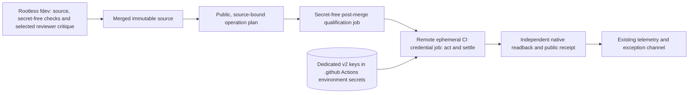
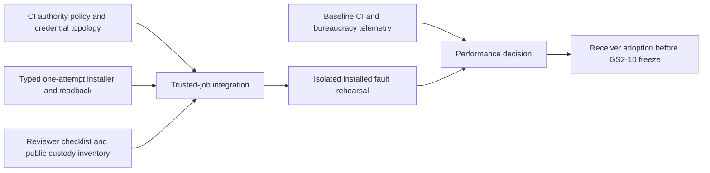

# Unattended CI-owned v2 credential execution interlude

Status: **implemented and qualified in the isolated installed sandbox on 2026-09-24**. The
[qualification record](../operations/v2-ci-i1-installed-qualification.md) gives the exact evidence.
Production credential execution stays inactive until the protected `OpenV2` and GS2-10 candidate gates.
This is the `V2-CI-I1` planning part in the [v2 roadmap](../github-substrate-v2-roadmap.md#v2-ci-i1--unattended-credential-execution-interlude).
[ADR-0088](../adr/0088-ci-owned-unattended-credential-execution.md) owns the cross-repository decision.

## 1. Problem, scope and trust assumption

The current one-time v1 admission path has deterministic approval, signature and installer checks, but
an agent session on Main must stage the exact helper, sign a public payload, issue a short-lived App
JWT through a pipe, coordinate one apply attempt and report readback. The host conversation is a
large, error-prone credential-adjacent operating surface. It is not a required second human
authority. The protected workflow currently publishes a public receipt only; moving credential use
into CI is **new implementation**, not a property of that workflow.

This interlude targets **zero routine human prompts, zero interactive host dependency, zero
host-agent credential sessions, zero polling/status-restatement turns and zero receipt-only PRs**
for the v2 credential-bearing route. Development and secret-free local CI remain inside the
rootless fdev Podman container. The host is not a signer, token issuer, installer or mailbox
on the normal path; its wallets, DBus/Secret Service, SSH agent and Podman control socket are
not mounted into fdev. An ordinary source-worktree mount is not a credential interface.
It assumes the selected protected repository writer and trusted post-merge CI are within the
operating trust boundary, as the routine profile of [ADR-0079](../adr/0079-single-accountable-delivery-authority.md)
does. It does **not** claim resistance to compromise of that writer, its GitHub account or the
credential-bearing runner. A reviewer subagent sharing fdev's tools or environment cannot turn
that assumption into independent control. Incident response, exceptional ambiguity and any
currently required irreversible human decision remain distinct from routine operation.

The one-time v1 genesis governed by [ADR-0087](../adr/0087-single-owner-v1-admission-genesis-approval.md)
and the present GS2-13 `OpenV2` human gate are unchanged by this design merge. Removing either
requires its own explicit policy amendment and qualified replacement before activation. No
private key, wallet record, workflow secret, JWT or live ref is provisioned by this document.

## 2. Target path and ownership

| Owner | Responsibility | Not a permission |
|---|---|---|
| `.github` | Versioned trigger/eligibility policy, trusted protected workflow, secret scope and stable required context | A PR check or agent comment cannot expose a credential or authorize a protected effect |
| `FS.GG.Coordination` | Typed operation plan, canonical intent, verifier, expected-absent/CAS effect, reconciliation and independent readback | Caller-supplied digest, review prose or a green build is not operation authority |
| Credential-steward reviewer subagent | Apply a fixed review checklist to credential-bearing changes; report key/permission drift, unsafe logs, missing refusal tests and policy mismatch; maintain public custody inventory/rotation proposal | No raw key, JWT, installation token, wallet access or independent approval identity; not on every routine attempt |
| Remote trusted CI jobs | A secret-free predecessor verifies immutable source, accepted CI evidence and operation policy; only its exact receipt admits the credential job, which rereads current Authority state before effect | Cannot execute PR-head code or arbitrary agent-authored commands with secrets; no Main/Work/fdev-host process is on the routine path |

Use a GitHub-hosted ephemeral job with a dedicated **machine-only ordinary-v2** environment,
protected-main branch restriction, no required human reviewer, and a pinned post-merge installer
artifact. Trigger it only from the protected main commit or a typed authenticated operation queue,
never a PR comment or PR artifact. A local/self-hosted runner on Main, Work or the fdev host is
**not** an alternative in this design: it would restore the host dependency and weaken the
stated container/host boundary. Provision **new, dedicated v2** authorizer and ordinary App
credentials as `.github` Actions environment secrets, with their public identities/trust
anchor accepted before activation. The current v1 admission keys stay under their existing
custody until governed retirement; do not export them into fdev or silently reuse them for v2.
The CI job may use a short-lived GitHub App installation token restricted to the one repository and required
permissions; it must not hand the token to an agent. Initial secret provisioning and public
anchor enrollment are distinct setup operations, not hidden routine steps; future routine runs
must succeed with the Main/Work hosts unavailable. Under the trusted-writer assumption, a
writer who can change the protected workflow on main is trusted with that environment's
credential capability; branch restriction alone is not an adversarial defense against them.
The secrets are not directly readable from or mounted into fdev. Code running in the remote
credential job can read them, however, and a compromised trusted fdev writer may be able to
commit a workflow that exfiltrates them. This is an explicit limit, not a protected claim.

## 3. One-attempt state machine

1. **Plan, without secrets.** Derive operation ID, exact merged commit/tree, published installer
   identity, workflow revision, current Authority head/epoch, intended objects/ref and digest.
   The normal PR lane remains secret-free. A reviewer subagent is selected for material
   credential/workflow/policy changes or sampled critique, not mandatory role choreography on
   every ordinary source change.
2. **Qualify without secrets.** A predecessor CI job reads exact-head required checks and
   content-addressed qualification receipts; it rejects stale heads, wrong policy/workflow, failed or missing evidence, changed current
   Authority state and unsupported operation classes. An agent verdict is evidence, never a
   substitute for these predicates. Only an exact, successful predecessor receipt can start the
   separate credential-bearing job; no secret is present in the predecessor job.
3. **Acquire and act once.** In the trusted post-merge job, look up only the exact current
   authorizer and ordinary App identity, recompute the public SPKI/trust binding, sign only the
   canonical operation intent, create a narrowly scoped short-lived token and execute the
   expected-absent/CAS write. No general `sign bytes` or `issue token` endpoint is exposed to
   PR code or an agent. Record attempt identity durably before an external effect.
4. **Settle.** Independently reread the ref, commit and every required object. Publish a public,
   content-addressed receipt or typed refusal. A timeout, ambiguous response or process death is
   `unknown`, never an invitation to rerun blindly: reconcile the same attempt against live
   state first. At most one automatic **safe** recovery attempt is allowed, and it cannot mint a
   second write identity.
5. **Escalate only exceptions.** Missing custody, uncertain effect, policy drift, signer mismatch,
   expired evidence or incident suspicion stops the job with a narrow diagnostic and a named
   owner. No agent or CI retry may waive the failed predicate. Existing protected irreversible
   gates remain until separately replaced.

The source/policy inputs are immutable and pinned, but an approved source can itself be faulty.
The trusted CI job therefore executes only an installed, reviewed artifact with refusal controls,
not arbitrary scripts from a request body or an unreviewed PR. Keep the ordinary-v2 operation
profile separate from one-time admission, release, cutover and destructive classes.

## 4. Implementation slices that can overlap

- **Policy/credential topology (`.github`)**: name the secret-owning repository/environment,
  exact trigger, immutable installer pin, new v2 key identities, public anchor, permission
  ceiling, initial provisioning, rotation and revocation path.
  Prove PR/fork/agent contexts cannot access the credential and that the selected machine-only
  environment is not the current v1 admission or cutover environment. Assert the fdev container
  has no credential-bearing host mount, DBus/Secret Service route, SSH agent or Podman socket;
  exercise the normal CI path while the host wallet is unavailable. Retain current native gates until
  a separately accepted amendment removes them for a named operation class.
- **Installer (`FS.GG.Coordination`)**: compose existing typed source/Authority readers,
  canonical signer checks, scoped App transport, one-attempt CAS and independent readback behind
  one non-interactive command. Test wrong key, wrong anchor, stale head, altered payload, wrong
  workflow, changed environment/policy, duplicate attempt and unknown-result recovery. Do not
  make an LLM reviewer a security predicate.
- **Reviewer guidance (`.github` owner, received by fdev)**: a short checklist for credential-
  bearing source changes, with an exact-head evidence link and no private values. The subagent
  may request repair but cannot sign, approve as another person or operate a secret-bearing job.
- **Installed join**: exercise synthetic keys and fake GitHub first, then an isolated real
  installed runner with bounded credentials and a deliberately non-production ref. Test
  crash-before-write, crash-after-write/unknown reply and replay. Production activation is a
  distinct, source-bound decision under the policy then in force.

GS2-09.7/09.8 source and representative-copy planning can continue while these slices run;
the credential-bearing receiver/candidate adopted by GS2-10 waits for the installed join.
If the interlude misses candidate freeze, explicitly defer its profile rather than silently
changing a frozen workflow or credential set.

## 5. Bureaucracy and CI performance acceptance

Use the **existing narrow definitions and intervention rule** in the
[unified roadmap §7.4](../2026-09-07-154210-fs-gg-unified-development-roadmap.md#74-narrow-bureaucracy-budget-tests-excluded):
target 5%, ceiling 10% for administrative effort/usage and added critical-path delay; useful
tests and substantive review are not bureaucracy. Report their cost separately. The normal
path must have zero human prompts and zero agent turns whose sole purpose is waiting,
credential relay or status copying. Do not claim the ceiling from a single fast run or
unknown timing attribution; reuse the established cohort/coverage rules.

The current Coordination PR path has both `bootstrap-qualification` and
`optimistic-parallel-validation`; the latter already classifies reusable evidence, shares a
build and fans out formal/other partitions. The first performance task is a measured
critical-path/runner-minute breakdown: queue, repeated checkout/SDK setup, duplicated
compiler/tests/formal work, artifact transfer, useful checks, and administrative delay.
Optimize in this order: remove manual handoff and receipt-only work; preserve sound
content-addressed reuse; eliminate duplicate execution for the same exact subject with a
verified receipt; balance formal shards from observed duration; then change fan-out only
if queue/capacity data supports it. Keep the comprehensive cold closure and protected
authority gates from ADR-0080/0084. Do not share untrusted PR caches/artifacts with a
secret-bearing job, or relabel a useful test as bureaucracy to meet the percentage.

Exit evidence is: one green exact-head policy/installer test set, an isolated installed
success and all named refusal/recovery cases, public receipt/readback, measured before/after
critical path and administrative overhead, and a receiver/candidate decision. A real
protected operation is not an acceptance fixture. No source merge alone declares the
credential topology installed or the v2 writer opened.
