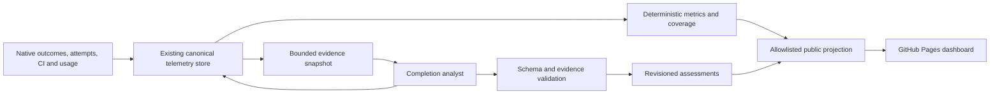

# Process efficiency telemetry and dashboard

Identity: **V2-EFF-01**. Authored: **2026-10-06**. Status: **proposed; not implemented by this document**.
Owners: Coordination telemetry maintainers for canonical records and adapters; `.github` telemetry
and dashboard maintainers for projection, analysis integration and presentation.
Evidence: [prior-art review](../research/2026-10-06-process-efficiency-telemetry-prior-art.md).
Delivery: [six-milestone roadmap](../roadmaps/process-efficiency-telemetry.md).

## Outcome

For each delivered item, explain what changed, how much work it consumed, which problems occurred,
what caused avoidable repetition, and what improvement is worth trying next. At programme level,
show useful engineering, necessary process, avoidable work, repair and waiting alongside quality and
coverage. A user should be able to move from an expensive item to the underlying evidence without
reading a whole agent transcript.

This proposal changes no current schema, thresholds, completion authority, required checks, release
facts or installed behavior. It extends the existing telemetry system and GitHub Pages dashboard.
It selects no new hosted analytics platform, scheduler or model provider. Agent explanations are
assessments; canonical authorities still establish delivery, execution, usage and accounting facts.

## Frozen measurement declarations (V2-EFF-01.1)

The additive [version 1 contract](../../contracts/process-efficiency/README.md) now declares
concrete schemas, legacy mappings, policy aliases and population/accounting rules against protected
`8a60856075aaff7614b1286ddc41ef204fe605cc` schema 13. Its synthetic corpus and hand-calculated
fixtures provide the shared consumer boundary for .2–.4; they do not activate production collection,
analysis or publication, or demonstrate calibration/installed acceptance. The implementation
sections below remain proposed until their respective milestones land.

## Current capability and the gap

The source audit uses `.github` protected main
[`d97ad7eb485979afbc4fabfe8282971d8c4261c9`](https://github.com/FS-GG/.github/tree/d97ad7eb485979afbc4fabfe8282971d8c4261c9).
This is a source inspection, not proof of fleet installation or a census of live records.

| Existing surface | What it already provides | Missing capability |
|---|---|---|
| [TelemetryStoreApplication](https://github.com/FS-GG/.github/blob/d97ad7eb485979afbc4fabfe8282971d8c4261c9/src/FS.GG.Coord.Cli/TelemetryStoreApplication.fs) | Process reviews with synopsis, problems, avoidable rework, improvements, evidence, coverage, confidence and reviewer provenance; activity spans, usage attribution, complications and budget intervals | Structured, evidence-linked problem classification and reproducible item economics across these facts. Existing review storage does not prove an agent automatically writes a review on completion. |
| [SkillTelemetryAdapter](https://github.com/FS-GG/.github/blob/d97ad7eb485979afbc4fabfe8282971d8c4261c9/src/FS.GG.Coord.Cli/SkillTelemetryAdapter.fs) | Versioned review/activity/usage/complication inputs and terminal-phase review routes | Reliable completion analysis scheduling, recovery, bounded evidence assembly and public-safe explanation. Item reviews require root authority and the expected terminal population. |
| [Dashboard projection](https://github.com/FS-GG/.github/blob/d97ad7eb485979afbc4fabfe8282971d8c4261c9/tools/telemetry-dashboard.py) | Bounded process detail, activity and usage summaries, generic complications and explicitly approved public labels | Public reviews largely expose counts and coverage, not explanatory findings. Repeated runs do not have demonstrated causes or allocated repair cost. |
| [UTEL dashboard roadmap](../roadmaps/utel-telemetry-dashboard.md) | Privacy boundaries, native eligibility, budgets, source health and Pages refresh | A fresh publication does not establish that every producer emitted current facts. Outcome, analysis and coverage freshness need separate indicators. |
| [V2 context efficiency](../roadmaps/2026-10-05-programme-context-efficiency.md) | Typed returns, bounded evidence and reduced coordination proposals | Whole-item measurements that can test whether those mechanisms actually reduce duplication rather than move cost to another participant. |

Existing process-review admission is intentionally strict: an item review needs the complete expected
terminal population. A merged PR whose runtime accounting is missing must not be silently promoted
to a fully observed completed item. The new UI needs a truthful partial explanation for that case,
without weakening the existing review or completion contract.

## Architecture and identities

The analyst-to-store edge records the analyst's own usage through ordinary instrumentation. It does
not grant permission to change source facts. Existing outcome identity remains authoritative.
Associate item, attempt, invocation, operation, PR, CI run, release and adoption identities explicitly.
Retain cross-object links where a run serves more than one item; do not flatten all events into one
parent chain. This follows the object relationships in
[OCEL](https://www.ocel-standard.org/specification/overview/) and cross-trace links in
[OpenTelemetry](https://opentelemetry.io/docs/specs/otel/trace/api/), without adopting either as a new store.

Every metric carries its source revisions, calculation version, unit, coverage and observation cutoff.
Every assessment carries its subject, evidence digest, taxonomy/rubric/prompt versions, model alias,
producer identity and revision. Keep observation time separate from event time and projection time.
An older delayed event cannot overwrite newer source state merely because it arrived later.

Corrections use a supported append-only supersession operation: identify the mistaken record and
replacement lineage, retain both in the audit, and select one current attribution in reducers.
Reassignment across items must atomically retract the old current contribution and introduce the
correct one. Replaying a correction is idempotent. Reconciliation that creates another outcome is
not a correction. If the installed interface lacks this operation, report `correction unsupported`
and retain an audit annotation; do not mutate the database out of band or claim the totals are repaired.
This applies the revision/provenance distinction in [PROV-O](https://www.w3.org/TR/prov-o/).

## Classification: what happened, why, and whether it was avoidable

Use independent axes, not one overloaded label. The names below are proposed vocabulary; milestone
.1 resolves their mapping to existing categories before any schema change.

| Axis | Proposed values | Meaning |
|---|---|---|
| Lifecycle activity | Planning, implementation, review, validation, delivery, repair, operations, coordination, context recovery, other, unknown | What the participant was doing. Preserve existing activity vocabulary through explicit mappings. |
| Purpose | Direct product work, useful assurance, necessary coordination, process improvement, avoidable process work, unknown | Why the effort was spent. Failed validation can still be useful assurance. |
| Problem trigger | Check failure, retry, timeout, cancellation, refusal, handoff return, reopen, data conflict, missing observation | Observable event; it is not its own cause. |
| Contributing cause | Product defect; unclear/changed requirement; dependency/version drift; test nondeterminism; environment/infrastructure; credentials/permission; capacity/custody; orchestration/handoff; context loss; duplicate process/proof; bookkeeping/lineage; telemetry loss; unknown | Evidence-backed problem classification. Several causes can contribute to one episode. |
| Necessity | Required, avoidable, uncertain | Whether a feasible route under the then-applicable requirements could have avoided the work. |
| Epistemic status | Observed, supported inference, hypothesis, unknown | Separate the evidence from interpretation. Model confidence is an ordinal assessment, not a probability. |

“Bureaucracy” in the UI means **avoidable process work**: repeated administration, proof assembly,
coordination or checking that contributes no required new product, evidence or decision. Its assessment
must name the feasible alternative and the evidence supporting it. A mandated duplicate check remains
necessary under the current policy; a proposal to change that policy is a separate opportunity.

| Episode | Appropriate interpretation | Unsupported shortcut |
|---|---|---|
| A failing test exposes a real defect; the fix passes | Useful validation plus product repair | Mark every failed test as bureaucracy |
| An identical check is repeated with unchanged complete inputs and reusable valid evidence | Candidate avoidable replay, subject to then-current reuse rules | Infer waste from a matching job name alone |
| A check fails and later passes, with environment differences unknown | Retry observed; cause unknown | Assert flakiness or infrastructure failure |
| A head or dependency changed before revalidation | Changed-input validation; assess necessity separately | Count all reruns as redundant |
| A worker reloads context after interruption | Context recovery; assess whether the interruption/reload was avoidable | Treat every handoff or context read as waste |
| A native operation is observed twice | Duplicate observation, deduplicated | Count another executed attempt |
| The PR merged but no runtime record arrived | Delivery observed; accounting incomplete | Publish zero runtime cost or fabricate a terminal attempt |

Problem episodes carry a primary cause only when supported, optional contributing causes, severity,
affected operations and recovery evidence. Cause charts distinguish exclusive primary-cause totals
from nonexclusive contributing-factor counts. Multiple labels must never multiply a single episode's
cost. The taxonomy borrows failure analysis from [MAST](https://arxiv.org/abs/2503.13657) and the
purpose distinction from [SRE toil](https://sre.google/workbook/eliminating-toil/); neither supplies
local frequencies or a universal acceptable overhead percentage.

## Completion analyst

The accountable completion path schedules an asynchronous assessment from existing durable delivery
records/outbox mechanisms. First assess the complete admitted native item through the existing root
review route. Persist scheduling state and reconcile missed notifications from outcome identities;
duplicate notifications and process restarts must not launch duplicate analysis for the same key.

For a source delivery with incomplete expected runtime population, introduce an explicitly provisional
**delivery assessment** through a versioned extension, subject to contract review in .1. It is not an
item process review and cannot satisfy native completion eligibility. It can say what merged and what
is missing. When the native population becomes complete, a final item review references and supersedes
the provisional assessment's explanatory role while preserving both histories and one delivery count.
If the extension is unavailable, show a deterministic partial card and `analysis unavailable`; never
forge terminal state to use the existing route.

Assessment states are pending, running, partial, ready, failed and unavailable. The completion outcome
does not wait for analysis. Display pending age, last attempt and actionable failure reason. Failed
analysis does not invalidate a merge. Reopened items retain prior reviews marked as historical;
subsequent completion has an explicit outcome epoch. Historical backfill uses the same identities,
is budgeted and is visibly distinguished from analysis performed at completion.

The idempotency key combines subject/outcome epoch, evidence digest and analysis policy version.
Late usage or a corrected fact can produce a revision after bounded coalescing, not a new delivered
outcome. An analyst's own usage arrival must not recursively trigger another analysis: include it in
deterministic totals, but exclude analysis-generated events from the substantive-evidence trigger.
Automatic revisions have a per-item budget; further revisions remain pending or use deterministic
updates until explicitly retried or a new budgeted epoch is admitted.

As a pilot default, propose one model invocation per evidence snapshot, at most 8,000 input tokens,
1,500 output tokens and 60 seconds, with no automatic model retry on malformed output. These are
proposed analysis bounds, not changes to execution budgets. Include unsuccessful analysis in its cost.
Adapt limits from pilot evidence; exhausted budgets result in a partial or failed assessment, not a
hidden unbounded loop. Do not add an independent reviewing agent to every completion.

Assemble a bounded packet of canonical outcomes, attempt timeline, required-check changes, measured
costs, complications and selected evidence excerpts. Record omitted populations and truncation; retain
failure/correction evidence and representative successful work. The packet excludes secrets, raw
private reasoning and unrelated transcripts. Treat quoted logs and repository text as untrusted data;
they cannot instruct the analyst to change classifications or publish additional content.

The analyst produces a short outcome synopsis, what worked, problem episodes with evidence, avoidable
work hypotheses, remaining uncertainty and at most three concrete improvements. Each improvement
names an owner role, affected mechanism and a way to test benefit. It does not automatically create
issues, dispatch work, alter policy or remove checks. This is a lightweight application of
[SRE postmortem practice](https://sre.google/workbook/postmortem-culture/).

Proposed assessment fields, not an activated wire schema:

| Field group | Required content |
|---|---|
| Subject and revision | Canonical subject references, outcome epoch, assessment ID, revision, superseded assessment reference, provisional/final scope |
| Evidence | Immutable snapshot digest; references with source revisions; population, usage and classification coverage; omissions |
| Findings | Bounded summary; typed problem episodes; claim status and evidence references; necessity rationale; recovery and uncertainty |
| Economics | References to deterministic metric records; no model-authored numeric cost or duration presented as measured fact |
| Improvements | At most three proposals; owner role; expected mechanism; validation method; any savings range explicitly hypothetical |
| Analyst provenance | Producer/model alias; prompt, rubric and taxonomy versions; timestamps; usage references; validation result |
| Publication | Separate approved public fields and public evidence links; privacy/projection policy version |

Deterministic validation checks schema, reference existence, subject consistency, evidence coverage,
length bounds, allowed labels and numeric correspondence. It cannot prove a causal interpretation;
calibration and correction handle that limitation. Reject unsupported factual assertions rather than
silently accepting a polished explanation. Keep machine checks, agent assessments and any human
corrections distinguishable, following the evaluation patterns in
[Langfuse](https://langfuse.com/docs/evaluation/evaluation-methods/annotation-queues) and
[LangSmith](https://docs.langchain.com/langsmith/evaluate-complex-agent).

## Metrics and accounting

Every chart names population, window, unit, denominator, coverage and policy version. Preserve native
input/output/cache token distinctions where available; show runner time, agent activity, observed
human effort and elapsed time separately. Estimated currency uses a recorded price version and
currency; observed bills remain distinct. Shared allocations conserve the original amount, with an
unallocated bucket when ownership is unknown, following [FOCUS](https://focus.finops.org/docs/specification/v1-3/datasets/cost-and-usage/).

| Metric | Definition and boundary |
|---|---|
| Delivered outcomes and quality | Unique native outcomes by stage: source merged, published, installed/adopted, accepted. Show defects/reopens and attributed follow-up repair separately. A PR count is not an adoption count. |
| Work mix | Per resource unit, exclusive allocated amounts by purpose plus unknown. Repair is a lifecycle view that may intersect purposes; it is not another additive bucket on the same chart. Mixed attribution remains mixed unless a supported allocation exists. |
| Avoidable-work share | Supported avoidable allocation divided by total observed allocation in the same unit and population. Display classification coverage and unknown amount alongside it; exclude unsupported hypotheses from the measured numerator. |
| Retry incidence and burden | Logical operations with additional executed attempts / operations with known attempt population; also additional-attempt resource use / total resource use. Separate same-input retry, changed-input repair, deliberate qualification and observation replay. Unknown populations do not enter a complete-rate claim. |
| First-pass delivery | Items accepted on their first eligible attempt / items with fully observed terminal attempt populations in the selected cohort. Display pending, abandoned and excluded counts next to this rate. |
| Churn | Reopens, handoff returns, repeated stage visits and invalidated evidence, with cause and resource attribution where available. Counts describe movement; they do not alone prove avoidable work. |
| Lead, touch and wait time | Native start-to-outcome elapsed time; union of known active intervals within that window; observed wait intervals with explicit overlaps. Unknown time is not inferred to be waiting. |
| Critical-path delay | Delay attributable to a witnessed dependency path. Concurrent waits are not summed as saved wall time. If dependency coverage is insufficient, display the timeline without a critical-path claim. |
| Cost per accepted item | Total attributable cohort resource use, including unsuccessful attempts and shared allocations, / accepted items. If none are accepted, show total cost and no ratio. Keep open exposure and cutoff explicit. |
| Analysis burden | Analyst invocations, tokens, latency and cost, including failures, as a visible subset of process cost. Assessment work must not disappear from the denominator it assesses. |
| Data health | Expected/observed producer populations, unresolved lineage, deduplication/corrections, classification coverage, pending analyses and distinct source/ingestion/publication ages. |

Do not sum overlapping activity durations into an item elapsed-time partition. Two agents working
for ten minutes can consume twenty agent-minutes within ten elapsed minutes. Where activity spans
cannot establish actual model or human active effort, label them observed span time. A proposed
flow ratio uses the union of witnessed touch intervals divided by the item window, with coverage;
it is not a universal productivity score or a direct estimate of human utilization.

Existing economics profiles remain explicit. The
[V2 economics profile](../github-substrate-v2-roadmap.md#124-carryover-performance-and-operating-epoch-decisions)
and [UTEL dashboard profile](../roadmaps/utel-telemetry-dashboard.md) have different scoped thresholds.
Implementation must resolve the exact current policy identifiers in .1; this
proposal neither merges their definitions nor chooses a new global ceiling. Show profile name and
revision next to any threshold. For the existing P/O profile, preserve its definition of productive
P and overhead O. If missing usage has quantified bound U, show the conservative upper share
`(O + U) / (P + O + U)`; unquantified missing usage means insufficient evidence for the ceiling claim.
Do not relabel useful assurance as direct production merely to improve a ratio.

Compare like cohorts by work type, repository, acceptance scope and observation period. Include all
attempt costs, abandoned items and an open-item aging view. Completion-only charts must disclose
their selection. Show sample size, medians and tail values where supported; sparse cohorts get raw
points rather than a confident trend. For causal savings claims, use a planned controlled or matched
comparison and disclose confounding, as illustrated by
[METR's measurement update](https://metr.org/blog/2026-02-24-uplift-update/). Proposed savings remain
hypotheses until measured; never add overlapping opportunities as independent savings.

## Dashboard design

The default landing view answers “what did we deliver, what consumed effort, and what should improve?”
Use a resource-unit selector instead of combining tokens, dollars and minutes. Preserve existing
filters across refreshes. Show the observation window and coverage before drawing conclusions.

| Position | Component | Drill-down or behavior |
|---|---|---|
| Header | Window, repository/item family, outcome stage, resource unit, economics profile; source age and coverage | Every filter updates denominators. “Unknown” remains selectable. Source freshness is separate from Pages deployment freshness. |
| First row | Accepted outcomes; total observed cost; useful/necessary/avoidable/unknown work mix; retry burden; pending analyses | Each number opens its population and calculation. Missing cost is never displayed as zero. |
| Main left | Stacked work mix over time, with unknown hatched; accepted-outcome trend and quality context | Accessible table equivalent; no red/green-only meanings. Required assurance remains visible as useful work. |
| Main right | Ranked problem episodes by count and attributed cost; separate waiting view | Toggle primary cause vs contributing factors. Unknown cause and unallocated cost remain visible. |
| Item list | Outcome, total effort, attempts, problems, summary status and short analyst synopsis | Sort by cost, delay, avoidable-work evidence or pending age. Open and abandoned items have dedicated views. |
| Item detail | What shipped; attempt/stage timeline; resource accounting; evidence-linked problems; what worked; up to three improvements | Distinguish observed facts, inference and hypothesis. Show current assessment, correction history and private/public evidence availability. |
| Improvement view | Repeated evidenced problems and proposed interventions | Group related episodes without auto-filing issues. Track measured before/after effects when an intervention lands. |
| Health footer | Producer inventory, missing populations, analysis failures, projection version, last valid snapshot | Explain whether the gap is producer collection, analysis, publication or browser refresh. |

Illustrative item card; all numbers and events below are synthetic, not programme results:

> **Example item — source merged; installed adoption pending**
>
> Two observed execution attempts; one accepted source outcome. Usage population complete.
>
> Observed model cost: $4.00 — product $2.40, assurance $1.00, necessary coordination $0.40,
> supported avoidable replay $0.20. Analysis is included in coordination.
>
> **Problem:** the same proof was assembled twice after a handoff. The input digest and required
> policy were unchanged; the first proof remained valid. **Supported inference**, evidence E1–E3.
>
> **Worked well:** validation found and localized a product defect on the first attempt.
>
> **Improve:** pass the existing proof reference in the typed handoff; owner: coordination adapter.
> Measure replay frequency on comparable items. Potential savings are not yet measured.

A second partial card should remain visible when source delivery is known but usage is missing:
“Source merged; expected runtime population incomplete; total cost unknown; provisional summary
pending.” It must not disappear from the delivery view or enter a fully accounted native-completion
denominator. This separates the user's need to see progress from the authority needed for a final
efficiency claim.

The public Pages feed contains only explicitly allowed structured fields, approved model aliases,
approved public evidence URLs and bounded sanitized summaries. Existing private review prose is not
automatically publishable. Milestone .4 defines an approved public summary vocabulary/template and
publication policy; discretionary free text without that approval remains private. Validation
rejects secrets, private identifiers/paths, unsupported URLs and injected markup. Render text as text,
not executable HTML. Ordinary compliant summaries require no new per-item user approval ceremony.

Keep private detail in the existing authorized surface. Public readers receive an honest “private
evidence retained” indicator rather than an inaccessible link or leaked excerpt. Provide keyboard
navigation, readable contrast, table alternatives, bounded pagination and explicit truncation counts.
Unknown feed versions preserve the last valid view with a visible error; they must not silently
interpret a newer schema as an empty successful dataset.

## Validation and rollout

First deliver a vertical slice: one real native completion, one bounded agent assessment, one
validated public-safe item card, and reconciled source-to-dashboard identities. Include a delivered
item with missing runtime in the same demonstration. Do not wait for a programme-wide historical
backfill before exposing useful explanations.

Metric fixtures cover overlapping activity, concurrent waits, shared CI, failed/retried/cancelled
attempts, zero accepted outcomes, incomplete populations, late usage, replay, reopening and cross-item
supersession. Hand-calculated expected values verify conservation and denominators. A correction
must change current attribution without changing delivered total or total observed cost.

Build a labeled corpus across clean delivery, useful failure, duplicate process, infrastructure,
context/handoff, lineage and missing-data cases. Proposed pilot floor: 60 episodes split into 30
development and 30 held-out episodes, with at least five examples in each represented major family
across the full corpus. Independently review the held-out labels and adjudicate disagreements; do
not report precise per-class rates when support is too small. This is a feasibility/calibration
floor, not statistical proof of a general performance claim.

Report cause confusion, avoidability precision/recall, abstention and coverage. Proposed release
target: at least 90% precision for published supported-cause and avoidable-work claims on the held-out
set, with the sample size and uncertainty disclosed; reject every fabricated numeric fact and broken
evidence reference. Meeting the target by labeling everything unknown is not acceptance: report
coverage by family and have maintainers assess whether the explanations answer the pilot questions.
Human sampling calibrates the system; it is not a new completion gate. Judge bias remains a concern
even after calibration, as described by [Zheng et al.](https://arxiv.org/abs/2306.05685).

Exercise prompt-injection content, private identifiers, malicious links, oversized input, analyst
timeout, restart, repeated notification and a missing root token. None may grant execution authority,
alter completion, leak private data or create repeated unlimited analysis. Test older clients,
unknown schema versions and rollback using retained snapshots.

Use at least the existing V2 economics profile's comparable baseline/treatment floor when making
its economics claim; report quality, coverage and total analysis cost as well as apparent savings.
A smaller pilot may validate plumbing, not establish net economic benefit. Publish, install and
demonstrate the chosen producer/receiver versions separately from source merges. Failure of the
new assessment pipeline leaves delivery working and exposes its own health; rollback disables new
analysis/projection while retaining canonical facts and revision history.
