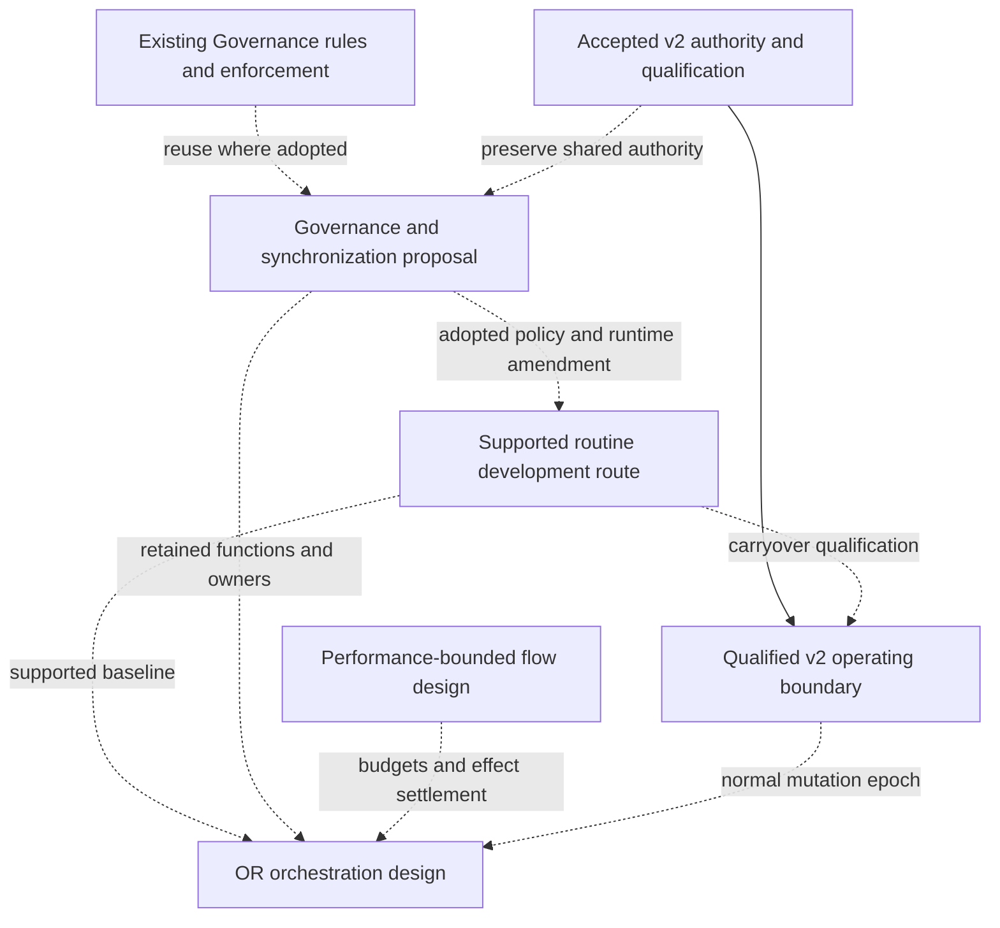

# FS.GG development master

Snapshot: **2026-09-07**. This is a planning overview and navigation aid. It creates no execution queue,
accepted contract, new gate or production authorization. The source design owns its detail; accepted
policy, published contracts and the applicable execution roadmap determine what can actually run.

Start here to understand how the development programmes fit together. Use the
[development design inventory](development-design-inventory.md) to find every document in the surveyed
`docs/` corpus, its planning disposition and the designs that still need a status decision. The inventory
owns the detailed snapshot and evidence qualifications; this document owns the synthesis. Neither is a
second source of completion receipts or dispatch state.

For the proposed continuation after simplification, read
[After simplification: unified v2 development design and roadmap](2026-09-07-154210-post-simplification-v2-development-design-and-roadmap.md).
It consolidates the remaining v2 work, process selection by work class and operating epoch, governance,
receiver carryover and conditional PB/OR development. It changes no current execution contract or authority.

## 1. Current plan

**The current plan is v2 migration and development simplification, with the OR orchestration and PB
performance designs developed against that foundation.** Governance preservation is the shared design
constraint connecting them. This plan is deliberately separate from the wider proposal inventory;
listing a future idea does not add it to the current plan.

| Current track | Main source | Focus and execution boundary |
|---|---|---|
| **V2 migration** | [GitHub Substrate v2 roadmap](github-substrate-v2-roadmap.md) | Continue the source-owned execution frontier and comprehensive qualification; preserve Git journals, fencing, recovery, freeze and operating-epoch boundaries |
| **Development simplification** | [Radical development roadmap](2026-09-07-074251-radical-development-bureaucracy-reduction-design-and-roadmap.md) | Qualify the landed routine route, finish economics/release/recovery work, and prove separate ordinary-v2 carryover |
| **OR orchestration design** | [August 31 OR-first design](coordination/2026-08-31-operations-research-first-agent-orchestration-design.md) | Develop scheduling, resource governance and durable execution against the supported simpler route; hosting and mutation adoption remain conditional on the design's evidence and epoch requirements |
| **Performance-bounded flow design** | [September 6 PB design and roadmap](coordination/2026-09-06-performance-bounded-development-flow-design-and-roadmap.md) | Preserve bounded attempts, recovery ownership and enforceable resource limits; distinguish essential functions from optional controller machinery |
| **Governance across all four tracks** | [September 7 governance proposal](coordination/2026-09-07-150716-governance-preserving-ci-simplification-design-proposal.md) | Decide delivery profile independently of synchronization need; retain Governance adjudication and Coordination authority when removing ceremony and CI waits |

This is the dominant planning view. The executable v2 roadmap and adopted routine policy retain their
actual authority; placing OR/PB in the current design plan does not turn their proposed implementations
into mandatory prerequisites for ordinary delivery or cutover.

## 2. Work within the current plan

1. **Advance v2 under its existing qualification.** The roadmap owns the next executable unit, exact
   acceptance contracts and cutover sequence. Do not duplicate its checkboxes or dispatch frontier here.
2. **Reconcile simplification evidence and remaining work.** The newer source marks R0/R1 delivered and
   has observer implementation evidence. Settle R2 closure, then retain explicit release/recovery,
   economics and R5 carryover outcomes rather than declaring the whole programme complete.
3. **Resolve the governance integration proposal.** Name isolated operation classes, shared grants,
   retained rule predicates, enforcement locations and supported fallback. No source-branch CI change
   should silently alter journal protection or protected-effect authority.
4. **Refine OR and PB around that agreed boundary.** Keep their useful governance, scheduling and recovery
   functions. Assign an enforcing owner for every necessary function, compare a simple supported executor,
   and qualify any new controller by enabled operation class.
5. **Update affected contracts only through their owners.** Publish producer changes before receiver
   adoption, preserve candidate/default sequencing and measure current-route and live-v2 outcomes separately.

These are synthesis and proposed integration priorities, not newly authorized implementation units or a
serial schedule. Read-only OR/PB work and bounded current-route improvements can proceed alongside v2
where their actual dependencies permit. Applicable Quint/SDD publication and migration remain dependencies
of the affected surfaces, not an excuse to add every related proposal to this plan.

**Further development is separate:** the SVG engine, web and bindings programmes, Quint learning material,
symbology showcases, deferred typed Governance integration and older developer-experience proposals remain
visible in the [full inventory](development-design-inventory.md#programme-register). Their inclusion there
preserves them for later selection; it gives them no implicit priority over the current plan. Component
work already authorized by its owner is not cancelled by this planning distinction.

## 3. Dependency map

Solid arrows below represent a dependency or authority relationship stated by the designs. Dashed arrows
represent proposed integration or optional support; they do not authorize implementation or claim adoption.
This is a conceptual map, not a graph consumed by a scheduler.

The v2 roadmap owns its exact Quint, candidate, canary, default and retirement sequencing. OR/PB
read-only research and pure component work can precede their mutation authority. The current plan does
not permit production canaries early or require a hosted dashboard, federation or optimizer before
routine simplification can deliver value.

## 4. Decisions that must not disappear between documents

| Open integration question | Why it matters | Proposed home for resolution |
|---|---|---|
| Isolated routine work versus routine work sharing resources | A branch/worktree does not exclude shared effects; no-claim policy must not recreate earlier races | Governance proposal, adopted routine policy and Coordination contract |
| Which CI obligations are removed versus merely executed cheaply? | Job consolidation, test selection and guarantee reduction are different changes | Routine design and owning policy; v2 §12 for later migration integration |
| Which reporting can lag, and which evidence authorizes an action? | A missing usage report differs from unknown merge/publication state or revoked authority | Governance proposal, routine observer/recovery implementation and PB effect settlement |
| Can evidence survive unrelated base movement? | Current Governance freshness keys include base/head; a source-head check is not full snapshot authority | Governance freshness contract and Coordination approval semantics |
| Who supplies governance if the OR/PB host is absent? | Optional hosting must not leave required capacity, exclusion or recovery functions ownerless | OR/PB scope and governance proposal's ownership matrix |
| What constitutes routine programme completion? | Landed helper code, measured incumbent benefit and ordinary-v2 carryover are distinct | R0–R5 sources and installed receiver evidence |
| Which telemetry/projection obligations remain after simplification? | September 4 automation preserves obligations that September 7 simplification proposes removing | Telemetry design, current routine observer and applicable accepted policy |
| Which historical plans are actually complete or superseded? | Old unchecked items and future-tense banners can recreate already-completed work | Original owner evidence and explicit successor links; inventory records the disposition |
| How do governance/lifecycle defaults activate? | Typed Governance integration, Quint migration and default flips are separate decisions | Owning migration designs, published artifacts and accepted ADRs |

These are design review topics, not a new per-PR checklist. Resolve a topic in its owning source and link
the disposition here when useful; do not duplicate a policy or create a board row just to update this page.

## 5. Snapshot conflicts and evidence limits

The inventory uses fetched `.github` `origin/main` at
`8363d57f3b5b15dd86b6efe8df53a89e93633648`, plus the two explicitly marked local drafts.
The local checkout's older document bytes can differ from that snapshot. In particular:

- R0/R1 are recorded as delivered in the newer radical-design ledger. PR #3322 landed an observer,
  but R2 remains unchecked in that ledger. Record **implementation evidence present; milestone closure
  unresolved**, rather than silently marking R2 done or claiming nothing has shipped.
- Several source banners are dated snapshots. The architecture review still mentions its old GS2-03.7
  pause, while the v2 roadmap records later acceptance. The Quint status guide is dated August 26.
  These statements are not interchangeable live execution reports.
- The OR/PB and earlier alignment documents predate the landed routine pilot. Their unadopted-policy
  wording needs a scoped refresh when the owning designs are next revised.
- The newest governance proposal and migration-overhead report were local drafts at the census. The
  governance proposal accompanies this documentation change and remains unadopted. The telemetry report
  stays unpublished; the inventory records its name without publishing its contents or a broken link.

No live board census, external issue-status audit, package-feed qualification or all-repository document
survey was performed for this inventory. Remote references identify owners and supporting sources, not
verified current availability or completion. Uncertainty is recorded rather than converted into a default
“pending” or “done.”

## 6. Keep the portfolio discoverable with little maintenance

For future documentation work, the intended lightweight practice is to add or update the relevant
inventory row and, only if the relationship changes, this overview. Keep source paths as document identity;
rename/supersession links should preserve the trail to old decisions. A new report containing future work
belongs in the programme register even if its filename does not say “design.”

Use distinct dispositions: proposal, accepted direction, implementation evidence, qualified completion,
deferred/on hold, historical/superseded, or status needing reconciliation. Attach an evidence date/source
when making an implementation claim. Do not infer completion from a merged design, an issue's title,
unchecked historical prose, or a successful component test.

At a planning review, inspect the older-programme and status-reconciliation rows before adding more work.
Fold duplicates into the owning source while retaining links to their rationale. A deliberate deferral is
an acceptable outcome; losing a proposal because it lived under `reports/` is not.

This practice adds no inventory-freshness gate, automated registry, mandatory report, issue or approval
cycle. The master and inventory help people find decisions; existing systems continue to govern execution.
