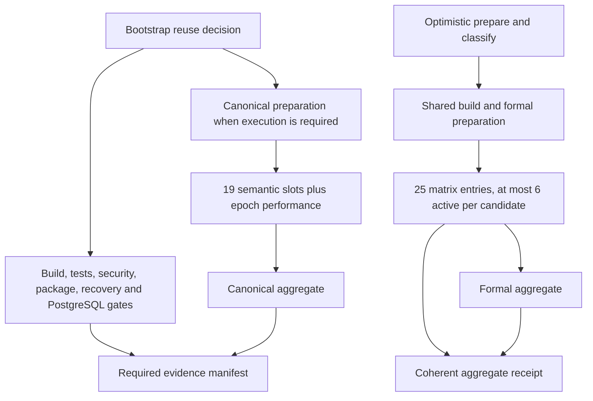

# CI machinery, capacity and offline qualification

**Assessment:** 2026-09-26, with a fleet queue snapshot at **14:34:35–14:34:42 UTC**.
**Scope:** `FS-GG/.github`, `FS-GG/FS.GG.Coordination`, their shared hosted capacity,
and the Podman/Forgejo pilots. This report records observations and proposals;
it changes no workflow, cancellation authority, required check or operational policy.

The immediate bottleneck is admission of more independent qualification work than the
hosted pool can process. The snapshot found **20 running jobs, all in Coordination**,
and another **45 materialized queued jobs** there. Three overlapping coherent candidates
accounted for 17 running jobs; Bootstrap used three. The classifier's historical API
scan was a separate amplifier, repaired in merged Coordination PR #838. Local computation
already works, but a signed local result has not yet replaced a hosted obligation.

The best next steps are to finish the existing one-shard trust bridge, limit admission of
new integration candidates to available capacity, and batch cheap checks where their
individual verdicts can be preserved. Increasing matrix fanout alone cannot fix a shared
capacity limit. Cancelling accepted coherent runs is not an ordinary optimization.

## Evidence boundaries and current authority

Repository analysis uses `.github` main
[`eef513d5`](https://github.com/FS-GG/.github/commit/eef513d5d27375656e8ebb6124e90095548dc277)
and Coordination main
[`a0c0a6fc`](https://github.com/FS-GG/FS.GG.Coordination/commit/a0c0a6fc6bd89597754657a417025efa03357c68).
The offline proposal was inspected at PR #839 head
[`2eb68869`](https://github.com/FS-GG/FS.GG.Coordination/pull/839/commits/2eb688694102b34842400be7d455d58c3756a2cf).
Later branch updates do not change this assessment's cutoff.

**Observed** below means source or API data inspected for this report. **Reported** means
an attributed pilot or incident result recorded by its execution owner. **Inference**
and **proposal** identify conclusions and future work. Private host logs were not inspected.
API reads were sequential within a short interval, not an atomic fleet transaction.

| Repository | Observed merge protection at 14:34 UTC | Consequence |
|---|---|---|
| `.github` | Classic branch protection; eight required contexts; GitHub Actions app 15368; `strict=false`; administrators enforced | Required contexts are `contract-coherence / coherence`, `projection`, `roster-closure`, `drift`, `claim-generation`, `Lint every shell file in the repo (pinned shellcheck)`, `claim-fence`, and `architecture-map reconcile`. |
| Coordination | Ruleset 21633423; six required contexts; app 15368; strict branch currency; squash-only PR merges; conversation resolution | Required contexts are `bootstrap-recovery`, `compiler-and-tests`, `dependency-and-security`, `deterministic-build`, `evidence-manifest`, and `package-install-smoke`. |

Sources: [`.github` protection API](https://api.github.com/repos/FS-GG/.github/branches/main/protection)
and [Coordination effective rules API](https://api.github.com/repos/FS-GG/FS.GG.Coordination/rules/branches/main).
These are live endpoints; the table preserves the observed values. `.github`'s effective
rules endpoint returned an empty list, which does **not** mean its classic protection is absent.
Workflow comments describing additional contexts as required are not substitutes for live rules.

Both repositories are public. GitHub documents free usage of standard hosted runners for
public repositories; active job-minutes below measure resource occupancy, not an invoice.
GitHub lists 20 standard concurrent jobs for Free and permits support requests for some
capacity increases. The org API did not expose its plan to this reader, so the configured
entitlement is not independently established by a plan read. The observed 20-job occupancy
agrees with the integration owners' reported 20-job limit. [Billing](https://docs.github.com/en/actions/concepts/billing-and-usage),
[limits](https://docs.github.com/en/actions/reference/limits), and
[owner report](https://github.com/FS-GG/.github/issues/3854).

## Queue state and the incident that produced it

The snapshot queried all **17 non-archived repositories** visible through the org API,
listing workflow runs in `in_progress`, `queued`, `waiting` and `pending` states, then
listing jobs for each returned run. No waiting or pending workflow runs were returned.
All running jobs had `ubuntu-latest` labels and GitHub Actions runner names.

| Repository | In-progress workflows | Queued workflows | Running jobs | Materialized queued jobs |
|---|---:|---:|---:|---:|
| Coordination | 1 | 3 | 20 | 45 |
| Rendering | 0 | 8 | 0 | 0 returned |
| SDD | 0 | 1 | 0 | 0 returned |
| `.github` and remaining 13 repositories | 0 | 0 | 0 | 0 |

Workflow state is an inadequate proxy for job occupancy. Each of the three Coordination
workflows labelled `queued` already had running and completed jobs:

| Run | Candidate | Workflow state | Completed / running / queued jobs |
|---|---|---|---:|
| [36248705447](https://github.com/FS-GG/FS.GG.Coordination/actions/runs/36248705447) | PR #839 `2eb68869` | Bootstrap, in progress | 11 / 3 / 0 |
| [36248705437](https://github.com/FS-GG/FS.GG.Coordination/actions/runs/36248705437) | PR #839 `2eb68869` | Optimistic, queued | 5 / 6 / 19 |
| [36248435778](https://github.com/FS-GG/FS.GG.Coordination/actions/runs/36248435778) | Earlier #839 `9418af53` | Optimistic, queued | 10 / 5 / 15 |
| [36248205403](https://github.com/FS-GG/FS.GG.Coordination/actions/runs/36248205403) | Main `a0c0a6fc` | Optimistic, queued | 12 / 6 / 11 |

Completed counts include skipped jobs. Jobs awaiting an unmet dependency may not yet appear,
so 45 is not the complete future workload. Job-level queue age needs eligibility time;
run creation time measures end-to-end age, not scheduler delay alone.

Rendering's eight queued runs were created on September 13 at 08:50–09:18 UTC; SDD's one
at 09:29 UTC. Their job APIs returned no jobs. These are **about 13-day-old unresolved run
records**, not evidence of 13 days of occupied runners or proof that today's saturation
caused their state. Investigate their admission/check-suite/provider state separately.
Representative records: [Rendering 34748572743](https://github.com/FS-GG/FS.GG.Rendering/actions/runs/34748572743),
[Rendering 34749302862](https://github.com/FS-GG/FS.GG.Rendering/actions/runs/34749302862),
[SDD 34749590081](https://github.com/FS-GG/FS.GG.SDD/actions/runs/34749590081).

The incident has three distinct parts:

1. **API enumeration amplification.** PR #838 reports a roughly 29,000-artifact,
   291-page scan before the classifier's 25-candidate cutoff. Of 36 preserved failed
   pre-coherent runs, 35 showed installation API rate limits and one a JSON error.
   Those runs were separately verified to have no active coherent job before cancellation.
   The merged repair caps discovery at ten 100-artifact pages, stops at 25 candidates,
   and falls back to current full validation on unavailable/malformed discovery. Recovery
   checks its two-candidate capacity first, limits exact-name lookups to 100 per scan,
   persists a validated cursor, and avoids historical dispatch scans.
   [Merged repair](https://github.com/FS-GG/FS.GG.Coordination/pull/838).
2. **Source admission amplification.** The 12:45 audit reported 222 queued Optimistic
   runs, 221 on open PR branches and 216 on intermediate drafts. Coordination had
   312 open PRs, 305 drafts; three stack depths were 129, 78 and 57. Ancestor inclusion
   was verified for 204 intermediate heads with queued replacement tips. This is
   historical owner-reported evidence, not the 14:34 snapshot.
   [Stack audit](https://github.com/FS-GG/FS.GG.Coordination/pull/838#issuecomment-5846377962).
3. **Exceptional backlog cleanup.** The user explicitly authorized a one-time ADR-0084
   exception for those 204 runs. The execution owner reported ordinary cancellation
   left aggregate jobs queued, then force-cancelled the same audited IDs and read back
   204/204 completed/cancelled. Coordination queued runs fell from 221 immediately
   before the batch to 16. This exception is closed and does not grant a standing
   cancellation policy. [Authorization](https://github.com/FS-GG/FS.GG.Coordination/pull/838#issuecomment-5846429500)
   and [completion](https://github.com/FS-GG/FS.GG.Coordination/pull/838#issuecomment-5846461965).

The scan repair reduces API demand, not the number of accepted formal obligations.
The cleanup removed accumulated work, not its admission cause. The current overlap of
main, an earlier PR head and a later PR head demonstrates that recurrence remains possible.

## Workflow structure and measured cost

At the inspected `.github` revision, parsing `.github/workflows/*.yml` gives **143 workflow
files**: 103 declare `pull_request`, 96 `push`, 122 manual dispatch and 24 schedules;
event counts overlap. Fifteen PR workflows have no workflow-level path filter, but some
classify impact inside the workflow. For example,
[`coord-engine.yml`](https://github.com/FS-GG/.github/blob/eef513d5d27375656e8ebb6124e90095548dc277/.github/workflows/coord-engine.yml)
always reports change completeness while gating expensive engine work on impact.
[`coherence.yml`](https://github.com/FS-GG/.github/blob/eef513d5d27375656e8ebb6124e90095548dc277/.github/workflows/coherence.yml)
also responds to body edits because authorization markers are mutable metadata. That
necessarily repeats other jobs in the same workflow. Removing required-context producers
with broad path filters would create missing-check problems; keep reporting and select
expensive work inside the producer.

The source/integration sample below queried workflow runs by each PR's current head,
across all returned events, at approximately 14:35 UTC. These are runs, not jobs or
runner-minutes; they include metadata-triggered reevaluations and cancelled work.

| `.github` PR | Head prefix | Runs observed | Interpretation |
|---|---|---:|---|
| [#3811](https://github.com/FS-GG/.github/pull/3811) | `959a1705` | 22 | Signature repair source |
| [#3843](https://github.com/FS-GG/.github/pull/3843) | `70002295` | 21 | Policy chain source |
| [#3844](https://github.com/FS-GG/.github/pull/3844) | `dcb244ee` | 19 | Roadmap projection source |
| [#3845](https://github.com/FS-GG/.github/pull/3845) | `2b481184` | 53 | Combined roadmap/LEARN integration, merged 13:34:50 |
| [#3846](https://github.com/FS-GG/.github/pull/3846) | `c6ea0f6b` | 34 | LEARN source |
| [#3850](https://github.com/FS-GG/.github/pull/3850), [#3852](https://github.com/FS-GG/.github/pull/3852) | `97c0f291` | 94 shared | Same head, two PR identities; count once. #3852 merged 13:49:57 |
| [#3853](https://github.com/FS-GG/.github/pull/3853) | `4790962c` | 19 | Documentation projection, merged 13:46:59 |

Deduplicating run IDs gives **262 runs** created September 25 20:29:48 through September 26
13:53:29 UTC: 162 success, 86 cancelled, 12 failure and two skipped. This is a selected
sample, not fleet throughput. A cancelled run may have consumed substantial work; no
minute savings can be inferred from its conclusion. #3852's new PR corrected branch-name
provenance without changing the head bytes; the repeated checks were an actual delivery
cost of that correction. Integration reduces future candidate count most effectively
when planned before every intermediate source branch opens online qualification.

Coordination has two overlapping qualification routes:

[Bootstrap source](https://github.com/FS-GG/FS.GG.Coordination/blob/a0c0a6fc6bd89597754657a417025efa03357c68/.github/workflows/bootstrap-qualification.yml)
uses a ref-based concurrency group with cancellation enabled. Formal execution has
19 semantic slots: `base` plus 18 named shards, and a separate `epoch` performance slot.
The semantic matrix has no explicit `max-parallel`. Preparation and both aggregates are
additional jobs, as are the nonformal gates. Bootstrap may reuse prior formal evidence;
it does not necessarily execute those 20 slots on every candidate.

[Optimistic source](https://github.com/FS-GG/FS.GG.Coordination/blob/a0c0a6fc6bd89597754657a417025efa03357c68/.github/workflows/optimistic-parallel-validation.yml)
keys concurrency by immutable candidate SHA and disables running-job cancellation.
Its 25 matrix entries contain the 20 formal slots and five nonformal partitions, sharing
a **six-job per-candidate** cap. Four preparation/classification/build jobs plus two
aggregates make **31 jobs** for a complete run. The recovery limit of two candidates
applies to nightly recovery dispatch; it is not a cap on ordinary PR/main admission.
Three candidates can occupy 18 matrix slots before Bootstrap or other repositories compete.

The graph correctly retains aggregation after shard failures (`always()` and
`fail-fast: false`). That preserves complete diagnostics and fail-closed receipt checking,
but adds work after an early failure. A new scheduler or offline join must preserve
complete shard coverage, candidate/plan identity and failure handling. The current matrix
also waits for both shared-build and formal-prepare before launching either kind of
entry. Separating those dependencies could improve first feedback, but cannot manufacture
capacity and needs measurement before adoption.

Observed completed runs on final #838 head `abf7e150cb9b38ade7401ea8553841415a352793`:

| Measure | Bootstrap [36246431637](https://github.com/FS-GG/FS.GG.Coordination/actions/runs/36246431637) | Optimistic [36246431777](https://github.com/FS-GG/FS.GG.Coordination/actions/runs/36246431777) |
|---|---:|---:|
| Created → final API update | 12m13s | 31m05s |
| Completed, non-skipped jobs | 10 | 31 |
| Sum of job start→completion durations | 26.18 min | 140.00 min |
| Formal execution | Skipped through its route | 20 slots, 112.55 min total |
| Longest formal job | — | `base`, 17m54s |

Optimistic formal work is **80.4%** of its measured active job time. Combined Bootstrap
and Optimistic active job time is **166.18 minutes**. These figures include job setup,
execution and artifact steps; they exclude time before jobs start. Created-to-update
is an elapsed proxy, not a pure execution timer. The formal aggregate's 28 seconds is
only fan-in overhead, not the cost of the shards it certifies. Economics based only on
that aggregate would dramatically undercount formal work; the Bootstrap reuse selector's
formal `runner-minutes` calculation currently selects the `canonical-quint` aggregate
job alone. [Selector source](https://github.com/FS-GG/FS.GG.Coordination/blob/a0c0a6fc6bd89597754657a417025efa03357c68/eng/bootstrap-gates/reuse-decision.sh).

For scale, applying this single coherent run's 140 minutes to a hypothetical sustained
20-slot pool gives an optimistic upper bound of **8.6 coherent candidates/hour** before
Bootstrap, other repositories or scheduling gaps. This is a capacity illustration, not
a throughput forecast. More parallelism shortens one uncongested run only while slots
are available; it does not reduce the summed work.

## Supersession and evidence custody

[ADR-0084](../adr/0084-semantic-reuse-never-cancels-coherent-validation.md) permits delivery
with authentic, complete, unexpired semantic reuse while an independent coherent run
continues. A later failure makes validation disputed and blocks dependent acceptance,
activation, publication and reuse. It does not undo the historical merge. A merged PR,
a descendant that contains an ancestor's source, or a green local run therefore does
not by itself discharge accepted coherent obligations.

[ADR-0043](../adr/0043-a-superseded-run-is-the-one-its-group-replaced.md) addresses a different
question: which same-head metadata reevaluation a landability verdict scores within its
workflow/event/branch/PR group. It does not authorize deleting coherent validation across
candidate heads. GitHub reruns mutate attempts under one run ID; monitoring should retain
attempt identity as well as run ID when diagnosing repeated failures.

There is a further limitation worth testing: `cancel-in-progress: false` protects running
work, but GitHub's default concurrency queue retains only one pending member of a group.
The inspected Optimistic workflow does not set `queue`. Its comment about preserving
“every rerun” is therefore stronger than the default pending-queue guarantee. Candidate
SHA groups avoid cancellation across different heads, but multiple same-head triggers
can still replace pending attempts. GitHub now documents `queue: max` with a bounded
100-run queue; adopting it alone would not solve cross-candidate overload.
[Concurrency semantics](https://docs.github.com/en/actions/how-tos/write-workflows/choose-when-workflows-run/control-workflow-concurrency).

Proposal: distinguish *source prepared locally*, *candidate admitted*, *coherent validation
pending/passed/disputed*, *merged*, and *activated* in capacity decisions. Admit fewer new
intermediate candidates before their coherent obligation is accepted; preserve existing
obligations after acceptance. Any change to draft admission needs an explicit contract
for promotion, selected tips, crash recovery and exact-head checks at merge.

## Offline computation and the remaining trust bridge

The local pilots establish useful capabilities with clear limits:

| Evidence | Established result | Remaining limitation |
|---|---|---|
| [Podman compiler/test pilot #3847](https://github.com/FS-GG/.github/issues/3847#issuecomment-5845970221) | Main reported online and `--network=none` passes at `d553425d`; 652 unit, 93 host and 691 architecture tests, plus telemetry receiver; fdev compared identities/results | Prefetched inputs and ext4 state were necessary. `NuGetAudit=false` applied to this compute batch; fresh vulnerability qualification remains separate. |
| [Formal pilot #3851](https://github.com/FS-GG/.github/issues/3851#issuecomment-5846402236) | All 20 slots passed offline; remaining 17 semantic jobs bounded to three concurrent containers; aggregate Q1/Q2, eight positive invariants, 166 negative controls, 19 formal rows | Main-reported durations sum to 4,057 s (**67.62 container-minutes**), range 156–641 s. This is not a same-machine, same-head hosted performance comparison. |
| [Forgejo shadow #3849](https://github.com/FS-GG/.github/issues/3849#issuecomment-5846088787) | Reported restore/mirror checks and ephemeral runner job passed the pinned compiler/test batch; cleanup verified by owner | Job used host networking and runner control shared Main's Unix account. It remains a local evaluation service with GitHub authoritative. |
| [Signed rehearsal #3854](https://github.com/FS-GG/.github/issues/3854#issuecomment-5847038895) | Unmodified `4f71cd3` host launcher ran a real shard, signed outside the container and published byte-identical evidence; independent signature verification reported | Rehearsal transport and shadow policy do not produce an authoritative offloaded check. |
| [Shadow PR #839](https://github.com/FS-GG/FS.GG.Coordination/pull/839) | Inspected code has separate candidate/protected-base checkouts, signer/image/archive pins, exact tuple fetch and formal-fragment join | At inspected head, policy is `shadow`, job condition begins `false`, and formal aggregate still depends on hosted matrix only. |

The formal pilot used image digest
`sha256:2a5eaffe1150b8ea5dada7f9a25805c75d649d897ed675e6ef10dcd188abb2ad`
and full canonical archive SHA-256
`926ec060018ad5d3a7d51b332b32468d1d2a5f53b39a5d7df14254696bd7e0b8`.
The earlier compiler pilot's smaller archive is a different input; do not interchange
its outer digest with the full formal archive. The 19 aggregate formal rows and 20
execution slots are also different counts: `base` supplies base qualification results.

The original exact-head hosted run
[36238568250](https://github.com/FS-GG/FS.GG.Coordination/actions/runs/36238568250), on
`d553425d`, started its first non-skipped job **93m50s after run creation**, later had
compiler/recovery failures and ended cancelled; its formal route was skipped. The
subsequent [diagnosis](https://github.com/FS-GG/FS.GG.Coordination/pull/838#issuecomment-5846789906)
identified missing `rg` in a hosted fixture; final `abf7e150` replaced four fixture calls
with portable `grep` and qualified successfully. The local pilot is still valid evidence
for its own tuple, but its originally pending hosted canonical comparison cannot be
silently promoted to completed same-head parity using the later candidate.

The proposed trust path is:

```mermaid
flowchart LR
    P[Protected supervisor and policy] --> C[Disposable offline candidate container]
    C --> O[Untrusted output receipt]
    O --> S[Host validation and signer outside container]
    S --> T[Public signed evidence ref]
    T --> V[Hosted verifier from protected base]
    V --> F[Same-run candidate and plan fragment]
    F --> A[Existing complete formal aggregate]
    A --> G[GitHub evidence and merge authority]
```

The [inspected supervisor](https://github.com/FS-GG/FS.GG.Coordination/blob/2eb688694102b34842400be7d455d58c3756a2cf/eng/run-offline-formal-shard.sh)
requires rootless Podman, pinned local image/archive, network disabled, a read-only root,
dropped capabilities, resource limits and disposable scratch/cache inputs. It closes the
signing FD before launching Podman and signs after zero exit. The
[envelope verifier](https://github.com/FS-GG/FS.GG.Coordination/blob/2eb688694102b34842400be7d455d58c3756a2cf/eng/offline-formal-evidence.py)
binds repository, head, base, tree, shard, policy, selected source paths, toolchain,
image, signer, receipt hash and a maximum six-hour lifetime. The
[join](https://github.com/FS-GG/FS.GG.Coordination/blob/2eb688694102b34842400be7d455d58c3756a2cf/eng/offline-formal-join.sh)
checks the current run's candidate obligation/plan and source/contract receipt identities
before emitting the normal three-file fragment.

A signature attests the supervisor's statement; it does not prove the host uncompromised
or candidate output semantically correct. Key custody, protected verifier provenance,
isolated writable state, receipt validation and complete aggregation are all necessary.
The public ref is a transport locator; exact binding and signature validation carry trust.
Create-only publication must remain an enforced producer property, not an assumption that
Git branch names are intrinsically immutable. GitHub specifically cautions against
self-hosted runners for public PRs, supporting the narrow supervisor/verifier approach.
[GitHub guidance](https://docs.github.com/en/actions/reference/security/secure-use).

The next live gate should use a fresh current tuple under protected **active** policy,
reject wrong head/base/shard, missing receipt, altered signature/content, stale evidence,
wrong policy and mismatched obligation, then compare substantive hosted/local fields.
Activation must remove exactly the selected hosted shard, add the verifier dependency to
fan-in, and preserve complete coverage. Retrying unavailable transport must be bounded;
rollback restores the hosted shard and dependency graph. A hosted verifier that occupies
a runner waiting for local compute would surrender much of the intended capacity gain.

Forgejo is optional scheduling infrastructure for this path. It can organize mirrors,
local jobs and retained output, but brings service lifecycle, backup/restore, version
compatibility, private networking and runner isolation work. The accepted pilot explicitly
needs a private runner-reachable network and dedicated disposable identity before broader
untrusted use. Package smoke also needs a local-feed contract. Direct Podman execution
is the smaller route to proving one offloaded obligation; a full forge migration requires
separate source/review/status authority decisions.

## Prioritized actions and acceptance evidence

These are proposals for existing owners, not new mandatory process or approvals.

| Priority | Owner and concrete next action | Acceptance evidence and tradeoff |
|---|---|---|
| P0 | Coordination integration + Main: finish #3854/#839 protected verifier qualification, then one current `authority-reconciliation` offload | Hosted positive and refusal cases, complete aggregate, measured local/hosted cost and exercised rollback. One slot proves the trust route; it is not yet a 20-slot saving. |
| P0 | Roadmap/integration owners: prepare independent source work locally and pace new online integration heads against job-level occupancy | Record admitted candidates, jobs and oldest eligible wait. Preserve accepted coherent work. Initial capacity planning can budget two six-slot coherent candidates plus headroom, but ordinary admission needs an explicit coordinator because `max-parallel` is per run. |
| P1 | Coordination owner: observe bounded classifier/recovery behavior after #838 | Page/request counts, fallback frequency, classification latency and successful protected cursor resumption. A fallback to full validation is safe but still costs compute. |
| P1 | CI owners: retain a small per-run measurement record from existing job/receipt data | Queue/eligibility time, setup, execution, aggregate, active minutes, failures and retry attempt; separate repo/workflow/head. Correct formal reuse accounting to include preparation/shards, not aggregate alone. Avoid adding a telemetry service merely for this report. |
| P1 | `.github` owner: pilot batching cheap independent shell/Python checks with a shared pinned environment | Preserve required names and per-check results, run all independent checks, measure cold setup and useful diagnosis. Fewer jobs can reduce setup/queue overhead; larger batches can delay feedback and must not hide failures. |
| P1 | Integration owners: make source-stack and same-head PR replacement rules explicit before admission | One selected delivery candidate per coherent integration, source provenance retained, promotion triggers exact-head qualification. Draft status alone is insufficient authority to discard existing obligations. |
| P1 | Coordination owner: verify same-head pending concurrency behavior and recovery custody | Adversarial repeated-trigger test and documented obligation identity. A bounded queue must not turn into another unbounded admission mechanism. |
| P2 | Main + Coordination: expand local formal compute only after the single-shard bridge passes | Start with bounded concurrency established on the actual host; measure CPU/RAM, cache isolation, timeout and maintenance. Compare identical tuples where feasible; do not extrapolate pilot wall times into billed savings. |
| P2 | Rendering/SDD owners: classify September 13 queued records with zero materialized jobs | Explain provider/admission state and correct owner/action; any cancellation follows its own applicable authority. These stale records should not contaminate running-capacity charts. |
| P2 | Platform owner: evaluate additional hosted capacity or dedicated isolated workers against measured arrival rate | Obtain actual entitlement/price, estimate headroom and ongoing operation cost. More capacity buys latency but does not repair repeated source admission or API scans. |

Preflight choice for this **report** is source/API inspection and arithmetic, with no new
model. For implementation, reuse generated-plan checks, fanout adversarial fixtures,
receipt refusal tests and the existing pipeline graph checker. A small state model is
worth considering only if admission, retries or mixed local/hosted fan-in introduce new
ordering behavior; keep independent requirements and a drift check against real YAML.
Use the [pipeline-preflight skill](../../.agents/skills/pipeline-preflight/SKILL.md) and
[ADR-0086](../adr/0086-proportionate-pipeline-preflight.md) to bound that work. No savings
estimate waives formal, security, exact-head or authority gates.

The missing measurements are a same-tuple hosted/local comparison, host maintenance cost,
longitudinal arrival/service rates, job eligibility timestamps and the org's actual
capacity entitlement. Until those exist, the evidence supports reducing hosted occupancy
and improving feedback latency; it does not support a monetary ROI or a fleet-wide
migration claim.

## Snapshot reproduction and interpretation

The fleet snapshot used the GitHub REST org repositories endpoint, followed by
`actions/runs` filtered separately by each nonterminal status, and each returned run's
`jobs` endpoint with `per_page=100`. Counts aggregate job states, never treating a queued
workflow as wholly unstarted. Source PR counts used `head_sha` and deduplicated run IDs;
job duration sums used `completed_at - started_at` only for completed, non-skipped jobs.
Skipped job timestamps can be inconsistent and were excluded from cost arithmetic.

The snapshot's nine zero-job run IDs are Rendering `34749302862`, `34749303646`,
`34748572831`, `34748572823`, `34748572825`, `34748572834`, `34748572743`, `34748572372`,
and SDD `34749590081`. The four active Coordination run IDs and job counts are preserved
above. New API reads will naturally show later states; these tables are the dated record,
not a claim of continuous monitoring. No runs were cancelled and no CI configuration was
changed while preparing this report.
