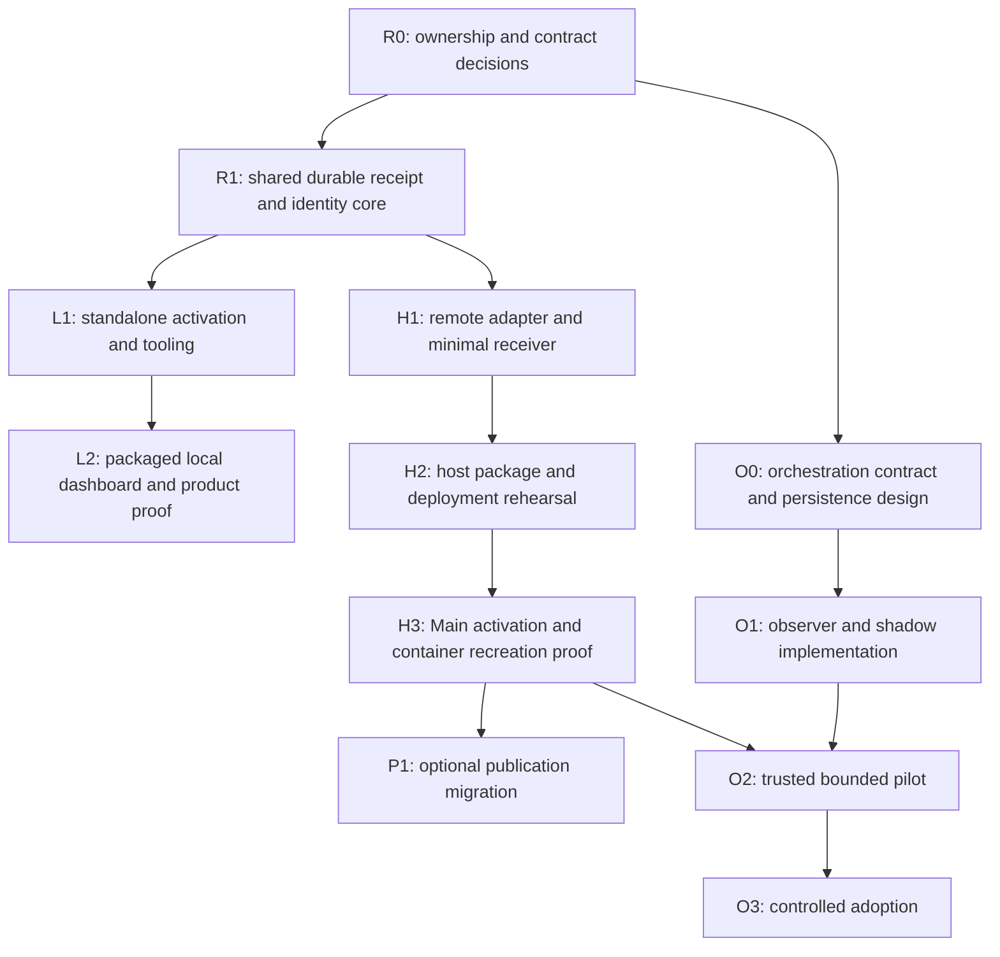

# Standalone telemetry, durable host and optional orchestration roadmap

Authored: **2026-09-09 19:07:26 UTC**. Status: **execution started; R0 decisions recorded, later acceptance remains pending**.

Deliver durable telemetry for mount-free development and lightweight standalone workspace tooling over the same evidence contracts. Add durable board orchestration later as an independently selected capability. Keep human effort concentrated in initial configuration and consequential changes; retries, receipts, routine authorization checks and recovery belong in software.

This roadmap records the user's agreement to proceed with the design, include receipt correctness, and **defer stronger runner GitHub credential isolation**. Approval to write and merge this document is not approval to provision credentials, install services, activate publication, dispatch agents, or release packages. The human guide below describes future operation; it is not a supported executable runbook today. Command names and package names remain provisional until implementation publishes tested instructions.

## 1. Sources, scope and relationship to existing work

Design input:

- [SystemAdmin redesign](https://github.com/EHotwagner/SystemAdmin/blob/main/docs/main-telemetry-actor-service-design-2026-09-09T160851Z.md), reviewed through its September 9 16:39:46 UTC revision.
- [Container hardening consequences](https://github.com/EHotwagner/SystemAdmin/blob/main/docs/fsharp-dev-hardening-consequences-2026-09-09T155613Z.md).
- [Existing telemetry store](../reference/local-telemetry-store.md) and [dashboard roadmap](utel-telemetry-dashboard.md).
- [Unified Roadmap](../2026-09-07-154210-fs-gg-unified-development-roadmap.md) and [OR-first orchestration design](../coordination/2026-08-31-operations-research-first-agent-orchestration-design.md).

The local baseline reviewed is `.github` commit `52c968d6fc930c1d43ddb7948d0072c1ffe41fcc`. Source links on `main` can evolve; implementation planning must record the exact reviewed revisions before amending contracts.

This is a supporting proposal under the Unified Roadmap, not a replacement queue or activation authority. Map each implementation slice to its existing owning item or create the smallest missing item when execution begins. Do not manufacture board rows, audit ledgers or mandatory independent reviews merely to track this prose. Existing process selection and qualification rules remain authoritative.

Source ownership should follow the telemetry engine and released workspace tooling. SystemAdmin owns host/container deployment definitions and operational integration, not a duplicate telemetry engine. Final repository and package boundaries are a first-stage decision. No status here asserts that upstream work has been accepted or deployed.

Included: shared observation/receipt contracts, durable storage integration, workspace identity, local dashboard, authenticated remote receiver, package/deployment lifecycle, optional publication integration, optional durable orchestration and runner recovery.

Excluded from this implementation scope: restored host mounts, actor remoting from containers, PostgreSQL migration for telemetry, cluster failover, historical transcript discovery, product-runtime tracking, automatic package upgrades, general host command execution, and stronger runner credential isolation. Container replacement safety, broad-token refresh and browser/native build prerequisites remain separate SystemAdmin work.

## 2. Architecture and explicit decisions

| Capability | Standalone workspace | Main or another optional host |
|---|---|---|
| Observation capture | Released workspace tooling; explicitly activated workflows | Same producer semantics over authenticated HTTP |
| Durable ownership | Private validated user-local store outside disposable workspace state | Restricted ingestion account; host-local inbox and SQLite |
| Processing | Bounded drain after work and explicit recovery | Bounded admission and ordinary Akka.NET actors around the existing engine |
| Dashboard | Bundled read-only UI, foreground loopback server on demand | Separately authenticated and workspace-authorized private UI |
| Publication | Off unless separately selected | Separate process/account and destination credential; existing publisher may initially remain |
| Orchestration | Optional separate installation with qualified persistence | Separate execution host and operational journal; container reconnects as client/runner |

Keep one authoritative telemetry destination per activated stream. Do not silently dual-write, probe other stores, or send ordinary product telemetry to Main. Telemetry unavailability leaves normal work usable and visibly reports missing evidence.

Keep Contracts, Client, Local and Dashboard independent of Host/Hosting and Akka dependencies. Use the existing workspace distribution rather than a second compulsory tool. Provisional host packages are `FS.GG.Telemetry.Host` and, separately, `FS.GG.Orchestration.Host`; neither is a product application dependency. UI assets ship with the tool. Distribution must work for the intended audience without framework checkouts or maintainer credentials.

Akka actors coordinate acceptance, drain, export and health; durable artifacts and SQLite retain authority. No second telemetry journal mirrors the same facts. Actor mailboxes are neither durability acknowledgements nor security boundaries. Use OS/process boundaries for ingestion, publication and any later privileged execution service.

For this mount-free fsharp-dev profile, Main owns durable storage. A container-local spool is best effort until remote acceptance. Native users may select validated local durable storage. Never label overlay storage durable because stop/start happens to retain it.

### 2.1 Deferred: stronger runner credential isolation

**Off for this roadmap's initial implementation and pilot. May be added later as a separately scoped enhancement.** Do not remove or narrow the user's existing interactive GitHub credentials as part of telemetry delivery, introduce a new credential broker, or add human approval to every assignment.

The initial orchestration pilot assumes trusted cooperating runners. Typed mutation checks, current generations, claim reconciliation and delivery readback still apply to operations passing through the supported coordination route. They do not prevent a runner with independently usable broad GitHub credentials from writing directly to GitHub. Revocation fences the supported route; it is not proof that such a process has lost every external capability. Repository protections continue to apply according to their actual configuration.

Do not describe this pilot as a hostile-runner security boundary. Do not enable untrusted cooperative contributors under that claim. When credential isolation is revisited, first produce a compact operation/credential matrix, then isolate runner credentials and protected delivery in independently enforceable process/service boundaries, test stale-runner bypass attempts, and document remaining authority. Merely removing an environment variable is insufficient if another accessible file or process contains the token.

Possible triggers: untrusted contributors, unattended execution of unreviewed repositories, broader multi-user deployment, or a requirement to guarantee that stale runners cannot perform protected delivery. Until separately selected, these triggers are limitations to report, not permission to expand this roadmap silently.

## 3. Shared correctness contracts

### 3.1 Identity and authorization

Define a stable logical producer identity independently of its secret. Rotation changes credentials, not producer identity. Recreating a configured producer reconnects to that identity through trusted enrollment; losing enrollment does not authorize guessing another producer's identity. Separate installations may receive distinct producer identities within one workspace.

Define a stable workspace identifier and an explicit association with allowed streams and canonical repository identities. Repository names, URLs, clone paths, worktree paths and board membership are not authorization. Decide and test clone/worktree association, repository transfer/rename, multiple repositories in a workspace, and local-to-host cutover. A new clone joins an existing workspace only through its configured authorized association.

The server binds authenticated principal, logical producer, allowed workspace and stream. Keep any new envelope/version separate from the existing closed observation payload unless a versioned payload amendment is actually needed. Reject unsupported identity combinations before durable admission. Do not reinterpret assignment IDs as workspace IDs.

Existing records without a provable workspace association remain explicitly legacy/unassigned and are excluded from newly scoped reads until an authorized migration resolves them. No migration guesses ownership from display names.

### 3.2 Receipt identity and lifecycle

Freeze a versioned digest algorithm and canonical representation, including normalization and rejection rules, with cross-adapter test vectors. A caller-supplied digest is verified, never trusted. Retries preserve the batch ID and canonical content; credential rotation must not create a new deduplication namespace.

Receipt key: `(logical producer ID, batch ID)`, with workspace/stream authorization bound to the accepted content or durable envelope. Native fact identity/revision remains independent of transport batch identity. Check existing identities before treating a retry as new pending quota consumption, while still bounding request work.

| Condition | Durable result | Client interpretation |
|---|---|---|
| New valid batch, capacity reserved, durable artifact recoverable | `durably-received` | Host owns processing obligation; not coverage or applied facts |
| Same identity and canonical content | Existing receipt/outcome | Retry safely; do not allocate another obligation |
| Same identity, changed canonical content | Conflict | Stop automatic retry and diagnose the producer |
| Committed acceptance/facts/cursors transaction | `applied` | Fact application committed; native delivery truth remains separate |
| Accepted batch fails semantic validation | `rejected` with bounded code | Terminal non-coverage outcome; retain receipt after payload cleanup |
| Request lost or times out | Unknown to client | Retry same identity/content or query; never invent a fresh ID |
| Rejected before durable admission | Explicit unaccepted error | Retry only where status permits; no durability guarantee |
| Terminal detail exceeds documented retention | `expired`/unavailable detail | Never infer success or absence of prior acceptance |

Admission performs authentication, closed-schema validation, authorization, size checks and atomic bounded capacity reservation. Persist with exclusive temporary creation, file flush, atomic rename and directory sync using trusted paths. Receipt recovery must be deterministic from durable artifacts; an independent index cannot acknowledge a missing artifact. Only then acknowledge durable receipt. After SQLite commits application, record/reconstruct the terminal result before removing its last recoverable input.

Retain unresolved obligations until terminal processing. Terminal receipt-detail retention and quarantine payload retention are separate. Preserve enough immutable batch identity/digest and native acceptance state to enforce retry/conflict rules after detail expiry. If the existing engine cannot reconstruct this, extend it before enabling the receiver. Any future compaction that weakens lifetime conflict detection needs an explicit protocol amendment; cache eviction alone never makes an old identity new.

Choose finite global pending bytes, producer count, request concurrency/timeouts, quarantine bytes and diagnostic retention. Retained identity metadata consumes disk too: budget, monitor and back it up; when required durable capacity is unavailable, refuse new admission rather than silently deleting obligations. Agree exact defaults from measured representative loads before production.

Use stable bounded errors: invalid request, unauthorized scope, identity conflict, oversized batch, overload, storage unavailable and unsupported version. The remote adapter maps these to documented HTTP statuses; HTTP 202 by itself is insufficient without a valid durable receipt. Use bounded exponential retry with jitter. Local and remote adapters run the same semantic conformance suite.

### 3.3 Storage, recovery and backup

Keep SQLite on verified local durable storage with the existing writer lock and qualified WAL/synchronization settings. Add a service single-instance lock. Actors recover before readiness; ambiguous writes, corruption and incompatible schema stop acceptance safely rather than trigger endless restarts.

Test crash boundaries before/after durable inbox creation, receipt recovery, database commit, quarantine transition and cleanup. Kill-process tests establish process-crash behavior; power-loss guarantees require storage-specific qualification and must not be inferred from those tests alone.

Backups cover a consistent SQLite snapshot plus accepted inbox obligations, receipt/identity metadata and required configuration. Define a coherent backup boundary while ingestion is quiesced or through an equivalent tested protocol. Restore tests must account for acknowledgements after the backup; restoring old state cannot promise their survival without replayable retained inputs. Agree recovery-point and recovery-time objectives before host activation.

### 3.4 Private projections and publication

Keep missing, unknown, zero, stale, rejected and pending distinct. Show provenance and last-applied state, not just process liveness. Opening a dashboard performs no drain, activation or mutation.

Local UI uses packaged assets, loopback binding, Host/Origin validation and short-lived session bootstrap. Shared UI uses separate browser authentication and workspace-scoped authorization on every query/export/subscription. Producer credentials cannot browse. No arbitrary SQL, filesystem reads or command API. Review closed private projection fields rather than exposing raw database rows.

Public export remains separately selected, allowlisted and label-approval-bound. Keep publisher credentials inaccessible to ingestion. Use atomic digest-bound handoff, coalesced durable publication intent, remote readback after ambiguous push, and last-good retention. Avoid a second publisher during migration.

## 4. Delivery roadmap and dependencies

The checklist below is the execution ledger; unchecked stages are not accepted work. Stage IDs are navigation labels rather than a new coordination protocol. Each exit produces reviewable code and evidence through the existing route; routine stages do not gain additional sign-offs merely because this table exists.

For this environment, H3 establishes the independently managed Main deployment pattern used by O2; orchestration still has its own store and readiness and does not depend on telemetry availability. Standalone delivery and the receiver can progress independently after R1. Do not delay the container's durability repair until every standalone UI feature ships. Do not describe the overall standalone product experience as delivered until L2 passes.

### Execution ledger

- [x] R0 — Ownership and implementation inputs: [decision record](../coordination/standalone-telemetry-r0-decisions.md). Documentation-only delivery; no package or host activation claimed.
- [x] R1 — Shared receipt, identity and storage correctness: [contract and qualification](../reference/telemetry-receipts.md); additive schema 9, shared adapter API, 79 focused tests including eight real process-exit boundaries. Source delivery only; remote deployment remains pending.
- [x] L1 — Standalone activation and workflow integration: [activation and storage contract](../reference/local-telemetry-store.md) and [source/package evidence](../reports/evidence/2026-09-10-standalone-telemetry-l1.md). Linux x64 source/package qualification covers explicit local assessment or refusal, remote lossy recovery, repository association and advisory workflow capture. Source delivery only; L2 owns the exact public release and complete dashboard proof.
- [ ] L2 — Packaged dashboard and standalone release proof.
- [x] H1 — Remote adapter and minimal receiver: [source contract and synthetic qualification](../reference/standalone-telemetry-receiver.md); shared R1 store implementation, closed HTTPS contracts/client, optional bounded Akka receiver and focused TLS/restart fixtures. Source delivery only; no package release, Main installation, production route or activation claimed.
- [ ] H2 — Immutable host packaging and deployment rehearsal.
- [ ] H3 — Main activation and container durability proof.
- [ ] P1 — Optional publication migration (not selected; retain incumbent publisher).
- [ ] O0 — Orchestration state and runner contract.
- [ ] O1 — Observer and shadow evaluation.
- [ ] O2 — Trusted bounded Main pilot.
- [ ] O3 — Controlled adoption.

Execution uses the routine route under the user's September 9 instruction to complete this roadmap and make necessary decisions. The proposal's earlier document-only authorization records its original scope; it does not undo that later execution instruction. Stronger runner credential isolation remains deferred. Existing upstream gates and independently checked operation boundaries remain in force.

### R0 — Establish ownership and implementation inputs

Deliver a compact decision record attached to the owning implementation work: source repository, workspace distribution/feed, supported OS/runtime profiles, exact baseline contracts, package boundaries, identity association rules and performance budgets. Inventory existing engine/renderer dependencies and reuse paths. Specify protocol compatibility and version negotiation; old clients must fail explicitly when incompatible.

Separate the implementation contract amendments from this proposal. Keep the Unified Roadmap's existing authority and frontier. Identify independent SystemAdmin prerequisites: safe replacement and reuse policy, route reachability, credential provisioning and test environment.

Exit: no ambiguity about ownership, first supported profile or which existing contract must change. Default choices can be proposed by the implementer; the user decides only audience, storage/trust and operational preferences that cannot be inferred.

### R1 — Implement shared receipt, identity and storage correctness

Implement stable producer/workspace association, canonical digest vectors, durable outcomes and recoverable indexes around the existing engine. Preserve activation/expected-dispatch facts, native fact deduplication, correction history, clock provenance and privacy. Add receipt lookup and bounded errors behind both adapter contracts. Specify terminal retention and identity capacity handling.

Exit: local conformance fixtures pass duplicate, conflict, cross-workspace denial, credential-identity continuity, out-of-order facts, capacity exhaustion and every persistence crash boundary. Existing accepted fact identities and coverage behavior remain compatible or have an explicitly tested migration.

### L1 — Standalone activation and normal workflow integration

Integrate capture, bounded drain and recovery into released workspace tooling. Activation explicitly selects a durable private store and persists a private association. Status while unconfigured creates nothing. Ensure workspace deletion/uninstall does not remove private history. Support explicit destination change with prospective cutover or approved identity-preserving import; do not upload databases implicitly.

Exit: a clean generated workspace works without Main, framework sources, root, a daemon or maintainer credentials. Interrupted capture/drain resumes, ephemeral placement is refused, and optional telemetry errors do not fail native work.

### L2 — Packaged local dashboard and standalone release proof

Build the common read-only projection and packaged UI path. Port or package existing renderer logic as needed to avoid a separate Python/Node installation solely for the dashboard, with parity fixtures. Offer explicit workspace selection and a usable foreground lifecycle with printed URL when browser opening is unavailable.

Measure incremental compressed/installed size, cold restore, startup latency, idle memory and submission overhead against R0 budgets. Qualify supported platforms separately; Linux mount checks do not prove Windows/macOS placement behavior. Test empty/populated/missing/stale/rejected states, local origin/session defenses, offline operation after installation and data-preserving uninstall.

Exit: audience-accessible exact release demonstrates the complete standalone journey with no host or orchestrator installed. Product application dependencies remain unaffected.

### H1 — Thin remote adapter and minimal receiver

Implement authenticated versioned batch submission and scoped receipt lookup. Keep endpoint/credential-reference config separate from host filesystem config. Enforce closed schemas, finite admission before enqueueing, fair drain and private health. Start with a fixed bounded actor set and isolated blocking I/O. No actor remoting or producer-selected paths, packages, commands or destinations.

Test independent client/server versions, slow clients, bad encodings, spoofed producers, cross-scope receipt reads, rotation/revocation, lost responses, unavailable disk, duplicate service start and recovery. Test actual container-to-Main routing in H2/H3; do not assume container loopback reaches Main.

Exit: synthetic producer obtains a recoverable durable receipt and applied outcome through the same R1 semantics; accepted work survives receiver restart. An unacknowledged ephemeral spool is explicitly reported as potentially lossy.

### H2 — Immutable host packaging and deployment rehearsal

Package the exact engine/adapters/UI dependencies with provenance and supported runtime prerequisites. Stage an exact inactive release under installer ownership; service accounts cannot update their executable. Define dedicated ingestion state, private configuration, browser access, optional publisher handoff and least-required writable paths. Keep ordinary service startup unprivileged and migration-free.

Produce a reviewed deployment plan and a tested operator runbook with actual supported commands, prerequisites, rollback boundaries and credential rotation. Validate systemd hardening against the runtime. Rehearse on isolated state: installation, readiness, graceful stop, crash restart, backup/restore, failed staging, compatible rollback and incompatible-schema refusal.

Exit: installation requires no source checkout or development container, and service startup neither installs nor updates itself. Exact route/TLS, identities, quotas and recovery objectives are resolved for the selected host.

### H3 — Main activation and container durability proof

After operator selection of the concrete deployment plan, install the receiver and configure this container's producer relationship. Prefer retaining the existing approved publisher during ingestion cutover. Reconcile old pending batches; use an explicit cutover identity/time and avoid duplicate authoritative destinations. Verify application and private dashboard readback.

Use a disposable producer/container fixture to submit a prospective observation, receive durable acceptance, recreate the producer, reconnect its configured identity and recover the same outcome and facts without duplication. Stop all development containers and confirm Main still serves durable history. Distinguish accepted history from unacknowledged gaps. Never delete the user's valuable container merely to run this test.

Exit: host restart, producer recreation and credential rotation preserve accepted history and identity. Missing ingestion is visible independently of service/timer health. The tested operator guide is delivered with the release.

### P1 — Optional publication migration

Only if publication is selected, move to the separate publisher account/process after validating aggregate handoff, labels, approval digest, fixed destination credentials, last-good retention and exact remote readback. Reconcile prior publisher state and deactivate its recurrence before enabling a replacement. Test ambiguous pushes and restart without duplicate publication.

Exit: a single authorized publisher operates; private dashboards still need no publication credential. Skipping P1 does not block H3 or L2.

### O0 — Orchestration state and runner contract

Extend the owning OR-first design with durable ProjectOrchestrator, canonical WorkItem, operation, scheduler reservation and command/attempt identities. Keep WorkItem ownership outside board membership. Select and qualify an operational persistence backend independently of telemetry SQLite; specify serialization, migrations, journal/outbox recovery and backup. Do not introduce cluster failover initially.

Specify assignments, expected revisions, generations, bounded budgets/deadlines, command receipts, pause/cancel/revoke and runner enrollment. Define the trusted-runner limitation from section 2.1 in API/operator documentation. Identify existing upstream activation prerequisites before pilot selection.

Define candidate artifact survival: an acknowledged candidate references an immutable digest and baseline/head in owner-controlled durable storage or a qualified durable remote Git ref. A local path, console message or telemetry event is not a durable candidate. Before acceptance, unpushed changes can be lost with the container. Bound artifact size/type/retention and treat contents as untrusted. Specify retry, partial upload and cleanup behavior without exposing host paths.

Exit: deterministic transition and fault fixtures cover canonical identity, multi-board membership, reservation/claim compensation, duplicate runner creation, candidate durability and unknown external effects. Persistence recovery never substitutes telemetry rows for execution state.

### O1 — Read-only observer and shadow evaluation

Build project observations, pure checked planning, durable proposal lineage and bounded planning-agent attempts. Withhold runner/mutation capabilities from the candidate instance; shadow is enforced by available capabilities, not a prompt. Existing production drivers retain all authority. Planning sessions have separately selected budgets and no automatic renewal on restart.

Build CLI/dashboard command projections separating conversation, proposed plan, durable command acceptance and completed effects. Bind consequential commands to principal, scope, expected revision, generation and stable command ID. Where approval is needed, bind it to the exact plan digest and budget; routine preauthorization remains possible.

Exit: candidate cannot dispatch in observer/shadow mode, stale proposals cannot replace newer decisions, session reconnect replays durable results, and planning-agent death preserves state and remaining budget.

### O2 — One-board trusted routine pilot on Main

Select stable item identities and permitted job classes, budget, runner capacity, startup policy and ownership generation. Reconcile stable-driver in-flight work and transfer only that scope; exclude it from the stable route. Run bounded deterministic scheduling and disposable implementation attempts under the section 2.1 trust assumption.

Main owns durable actors and operational journal. The container starts only its supervised client/runner after explicit enrollment. Recovery inspects unresolved effects, runners and reservations before dispatch. Persist pause/revocation and budget accounting; a reconnect cannot renew authority or create a fresh empty journal. Lost heartbeat means uncertain outcome, not failed delivery. Reassignment requires reconciliation, and cooperative fencing cannot prevent direct broad-token bypass.

Exit: one representative routine item completes through candidate persistence, required verification, protected-route delivery and native readback. Failure injection covers process creation, claim, artifact submission, PR creation and merge before receipt, plus disconnect/reconnect, stale output and host reboot. Operator can pause and reconcile fallback without duplicate ownership. Telemetry outage does not corrupt or stop otherwise safe orchestration transitions.

### O3 — Controlled adoption and later options

Expand explicit scope only after pilot evidence and remaining upstream gates pass. Preserve one accountable local owner per canonical subject and external coordination rules. Test multiple projects sharing finite capacity, transient board failures and scoped recovery before broad adoption. Candidate releases continue through the stable delivery route; a successful build cannot activate itself.

Cooperative untrusted contributors, stronger credential isolation, multi-node failover and any telemetry database replacement remain later decisions. Trusted cooperative execution may be designed against the upstream versioned application protocol, but it must preserve the documented authority limits and cannot silently enable untrusted runners. No Akka cluster enrollment for producers or contributors.

## 5. Qualification matrix and completion evidence

| Boundary | Minimum evidence | Failure interpretation |
|---|---|---|
| Durable intake | Crash/retry at each fsync/rename/index boundary | No success without recoverable obligation |
| Application | Commit-before-cleanup replay and native fact deduplication | Received is not applied or coverage |
| Identity | Rotation, recreated producer, workspace denial, expired receipt/conflict | Credentials and caches cannot reset identity |
| Resource use | Per-producer/global exhaustion, fair drain, disk full | Refuse new work explicitly; preserve accepted work |
| Dashboard | Local browser/session attacks and cross-workspace reads | Loopback and workspace URLs are insufficient authority |
| Deployment | Exact artifacts, restart, backup restore, incompatible rollback | Installed/running is not recovered/ready |
| Container lifecycle | Disposable producer deletion after acknowledgement | Unacknowledged spool remains lossy |
| Orchestration | Duplicate creation/effects, stale proposals, lost heartbeat | Timeout is unknown; inspect before repeating |
| Work artifacts | Lost runner before/after durable candidate acceptance | Journal metadata alone does not preserve code |
| Trust | Supported-route fencing tests plus documented direct-write limitation | No claim of hostile-runner containment |
| Product independence | Clean standalone install and work during telemetry outage | Host/orchestration never become hidden prerequisites |

Run targeted unit/contract tests per slice and package/deployment/browser tests where the changed boundary requires them. Use synthetic data for failure and security tests. Required repository CI remains required; do not add a new universal review tier. Record source revision, artifact version, environment, executed checks and limits in the owning work's existing evidence path.

Report source merged, package released, host installed and behavior verified separately. Completing implementation does not retroactively claim observations for earlier gaps. Update Unified Roadmap progress only when its authoritative owning item reaches its existing closure condition.

## 6. Human actions necessary

This is the complete planned human-action inventory, subject to concrete installation choices. Several decisions may be made together in one reviewed setup plan. No extra approval is required for each batch, retry, receipt, actor restart or assignment already covered by a valid routine-work grant.

| When | Person/authority | Necessary choice or action | Software prepares or automates |
|---|---|---|---|
| Before implementation boundaries freeze | Maintainer, with user input where needed | Confirm owning distribution, audience and supported profiles | Dependency inventory, proposed defaults and contract diff |
| Standalone first use | Workspace user | Explicitly activate and select/confirm durable storage | Validate placement/permissions, persist association, show status |
| Before Main installation | Host operator | Select exact deployment plan: host route/TLS, accounts, storage, quotas, backup objectives | Preflight, exact paths/artifacts, permissions and rollback preview |
| Producer enrollment | Operator or trusted launcher setup | Provision scoped telemetry credential/reference and producer/workspace association | Validate TLS, protect secret, test scoped acceptance; never print it |
| Shared dashboard setup | Operator/user administrator | Select browser identities and workspace access | Enforce query authorization independently of ingestion |
| Public publication, only if wanted | Destination owner/operator | Choose destination, labels and credential; approve concrete export/publication scope | Preview safe output, install isolated publisher, verify remote result |
| Release with host/schema changes | Operator | Select exact release and approve concrete migration/deployment changes where needed | Backup, compatibility checks, staging, readiness and recovery evidence |
| Orchestration observer/shadow | User/operator | Select project read scope and any inference budget | Enforce read-only capability and bounded sessions |
| Trusted orchestration pilot | User/operator | Select item/job scope, budget, runner, trust limitation and pause/auto-resume policy | Preview transfer, reconcile current work, enforce supported-route checks |
| Exceptional uncertain outcome | Relevant owner | Resolve an ambiguity the system cannot safely inspect or a requested scope change | Show evidence, bounded choices and consequences; preserve pending state |
| Credential rotation/revocation | Credential owner | Supply replacement or request revocation | Keep producer identity, bounded overlap and safe diagnostics |
| Restore/data deletion | Data owner/operator | Select restore point or explicitly authorize deletion | Show acknowledged-data impact; retain data by default |
| Stronger runner isolation later | User/operator | Explicitly select the deferred enhancement | Produce operation/credential matrix and isolated-runner implementation plan |

For this environment, the ordinary user need not install Akka or PostgreSQL, administer actor paths, copy receipts, manually run drains after each task, approve every routine assignment or restore host mounts. A privileged operator step is needed only for host resources that require it; implementation must prepare the complete reviewable plan first.

## 7. Comprehensive human setup and operation guide

**Planning guide, not commands to execute today.** H2/L2/O2 must replace provisional interfaces with release-specific tested instructions before their respective activation. Follow only steps for the selected profile. The implementing agent should prepare routine configuration and tests; the person supplies decisions, credentials and privileges that cannot be inferred or safely synthesized.

### 7.1 Choose the profile and prepare

1. For a native standalone workspace, choose local telemetry and the on-demand dashboard. For mount-free fsharp-dev, choose Main's remote receiver. Choose orchestration separately only when agent execution is wanted.
2. Identify the workspace and intended repositories, storage owner and users allowed to read history. Decide whether an existing store continues, a prospective cutover starts, or an explicit import is needed.
3. Review the release-specific prerequisites and artifact provenance. The optional .NET tool's installation CLI and runtime requirements must be checked separately. Use exact versions and approved sources, never a mutable latest alias.
4. For Main, verify the operator can manage the selected service accounts, private storage, TLS and firewall. Resolve container-to-host reachability without host mounts, D-Bus or a Podman socket.
5. Before replacing a real container, use the separate SystemAdmin safe-replacement procedure to preserve unpublished/untracked work. Telemetry durability does not back up the workspace.

Success: the selected profile and durable destination are explicit, and required artifacts/privileges exist. Missing prerequisites produce actionable status without silently selecting another destination.

### 7.2 Activate standalone telemetry

1. Restore the normal released workspace tools. Do not install the optional host merely to obtain a dashboard.
2. Review the proposed private user-local storage placement and workspace association; activate explicitly. If placement is ephemeral or unsuitable, choose a qualified destination before proceeding.
3. Run an ordinary eligible workflow with prospective capture enabled. The tool submits durably and attempts bounded drain. Inspect receipt/application status if there is a diagnostic.
4. Open the packaged dashboard from the workspace command. Use its printed local URL if browser opening is unavailable. Confirm the selected workspace and distinguish pending from applied facts.
5. Stop the foreground dashboard when finished. History remains in the private store. Configure a private backup appropriate to its value; do not commit it to Git.

Success: normal work and dashboard function without Main or a permanent service. Uninstalling tooling or deleting a workspace preserves history. Opening status alone has not activated telemetry or drained state.

### 7.3 Install and enroll with Main

1. Have the implementation produce an exact deployment preview with artifact digests, runtime prerequisites, accounts, paths, listener, TLS, quotas, browser authorization and backup/recovery choices.
2. Review and select that concrete plan. The authorized installer stages an inactive immutable release, creates narrowly owned state/configuration, applies tested service hardening and runs synthetic preflight checks.
3. Provision telemetry producer credentials through the trusted setup path. Configure the container with endpoint and credential reference, never Main's storage path. Keep the logical producer/workspace association stable across secret rotation.
4. Start ingestion and wait for storage recovery/readiness. Process liveness alone is insufficient. Test authenticated connectivity from the actual container route, including wrong-identity denial.
5. Submit a permitted prospective observation and inspect durable then applied receipt. Open the separately authenticated private dashboard and check workspace identity, provenance and freshness.
6. Rehearse producer recreation with disposable fixtures. Verify history after service restart and after the producer disappears. Confirm backup restore in isolation before relying on the deployment.

Success: Main owns accepted obligations independently of the container; the user sees explicit unacknowledged gaps. No publication or orchestration is activated by these steps.

### 7.4 Enable publication only if desired

Review an allowlisted output preview, public labels and fixed destination. Provision the publisher credential under its separate account. Reconcile and stop the incumbent publisher before enabling a replacement. Confirm exact deployed output and last-good retention. Changing labels/destination uses the existing approval semantics; ordinary private dashboard use requires none of this.

### 7.5 Start optional orchestration safely

1. Begin in observer/shadow mode with bounded project reads and a selected planning budget. Confirm the candidate has no dispatch capabilities and proposed results are labeled as proposals.
2. Review pilot scope using stable item identities, job classes, budget, runner capacity and the cooperative-fencing limitation. Stronger runner credential isolation remains off. Avoid untrusted contributors.
3. Choose startup policy: paused/read-only by default, or explicit bounded auto-resume. This policy survives restart and does not broaden work authority.
4. Have the stable route and candidate reconcile in-flight work and transfer the selected scope/generation. Do not merely start a second board driver with an overlapping filter.
5. Enroll the supervised container client/runner. Main retains project/work actors and operational state; startup in fsharp-dev must not create another owner or update Main.
6. Follow the first routine item through assignment, durable candidate, verification where required, delivery and native readback. Confirm that killing a planning session preserves budget/state and disconnecting a runner produces uncertainty rather than duplicate dispatch.
7. Expand only the selected scope after pilot evidence passes. Existing grants allow routine checks and assignments to execute without fresh human prompts.

Success: process running, recovered/reconciled, and dispatch enabled are distinct visible states. Telemetry failures do not corrupt the execution journal. A local candidate is not reported durably accepted until its artifacts are recoverable outside the disposable runner.

### 7.6 Everyday controls

- **Status/dashboard:** read configuration, accepted/applied backlog, freshness and scoped operational state. A stale view displays its observation revision.
- **Pause:** stop new dispatch; preserve current assignments and reconciliation.
- **Cancel:** request bounded shutdown of a selected assignment; wait for observed outcome rather than assuming success.
- **Revoke:** remove supported-route authority and reject stale generations. Under deferred isolation, this does not revoke independently held broad GitHub credentials.
- **Resume:** revalidate scope, generations, remaining budget and unresolved operations under the saved policy.
- **Retry/reconnect:** software reuses stable identities and durable cursors. Do not manually generate replacement IDs to escape an unknown outcome.

Conversation may explain or propose these actions. Consequential changes become checked structured commands with durable receipts; a chat acknowledgement is not proof of external completion.

### 7.7 Diagnose failures and recover

| Symptom | First action | Safe recovery outcome |
|---|---|---|
| Unconfigured telemetry | Check explicit destination/activation | Remain unconfigured or select a valid profile; no discovery of unrelated stores |
| Receiver unreachable or TLS failure | Check selected route, certificate and service readiness | Same-identity bounded retry; normal work remains usable |
| Unauthorized producer | Check enrollment, scope and credential validity | Rotate/re-enroll through trusted setup without resetting logical identity |
| Pending backlog/disk full | Inspect durable capacity and drain health | Preserve accepted batches; stop new admission until capacity is restored |
| Identity/content conflict | Inspect bounded diagnostic and producer implementation | Correct the producer; never overwrite an accepted batch identity |
| Corrupt/incompatible store | Stop admission and inspect qualified recovery plan | Restore/migrate under lock; no empty-store fallback |
| Receipt detail expired | Consult retained identity/outcome policy | Explicit unavailable detail; never infer success from absence |
| Host restore required | Review backup boundary and later acknowledgements | Restore privately and reconcile/replay retained inputs; disclose unrecoverable loss |
| Runner disconnected | Keep assignment pending reconciliation | Inspect effects/artifacts and current generation before replacement |
| PR/merge timeout | Inspect native GitHub state and recorded operation | Record observed outcome before any retry |
| Candidate pilot must stop | Pause, reconcile and transfer scope to stable route | One active supported-route owner; stopping a process alone is not a transfer |
| Suspected credential compromise | Revoke through the credential owner | Telemetry scope revoked independently; broad GitHub token revocation remains separate |

Do not delete inbox files, edit SQLite by hand, reuse an expired generation, restore host mounts or bypass protected checks as a repair. The released guide must supply actual diagnostic commands and bounded error-code mappings; this proposal deliberately invents none.

### 7.8 Upgrade, rotate, restore or remove

For upgrades, stage an exact inactive version and inspect compatibility before changing production. Back up coherently, quiesce/lock as required, apply an explicitly selected migration, activate and verify readiness plus a permitted end-to-end observation. Roll back binaries only when schema compatibility permits. Otherwise use the tested restore/reconciliation procedure and account for later acknowledged inputs.

For telemetry credential rotation, provision the replacement for the same logical producer, use only a bounded overlap if selected, confirm continuity and revoke the old credential. This does not refresh the independently injected GitHub token in running processes.

For removal, stop relevant dispatch/admission/publication, reconcile pending obligations, disable only installation-owned services and revoke their credentials. Preserve private data, backups and evidence unless deletion is explicitly selected by the data owner. Uninstalling a workspace tool does not authorize deletion of telemetry history.

## 8. Completion and deferred follow-up

The initial telemetry outcome is complete when R0/R1, L1/L2 and H1/H2/H3 have their respective accepted evidence and the selected Main integration is verified. P1 is optional. Orchestration is independently complete only to the explicitly selected O-stage; no telemetry milestone requires it.

Before execution, resolve exact package/source ownership, audience-accessible feed, supported runtime matrix, measurable budgets, workspace mapping, retention defaults, host route/TLS and backup objectives. Before orchestration pilot, resolve operational persistence, durable candidate storage, existing upstream gates, trust scope and startup policy. Implementers should propose concrete defaults and bundle human decisions instead of repeatedly seeking approval for routine details.

Deferred notice: stronger runner credential isolation may be added later. Its absence remains visible in pilot documentation and limits claims about revocation and hostile-runner containment. It adds no present implementation dependency, package, credential migration or approval ceremony.
