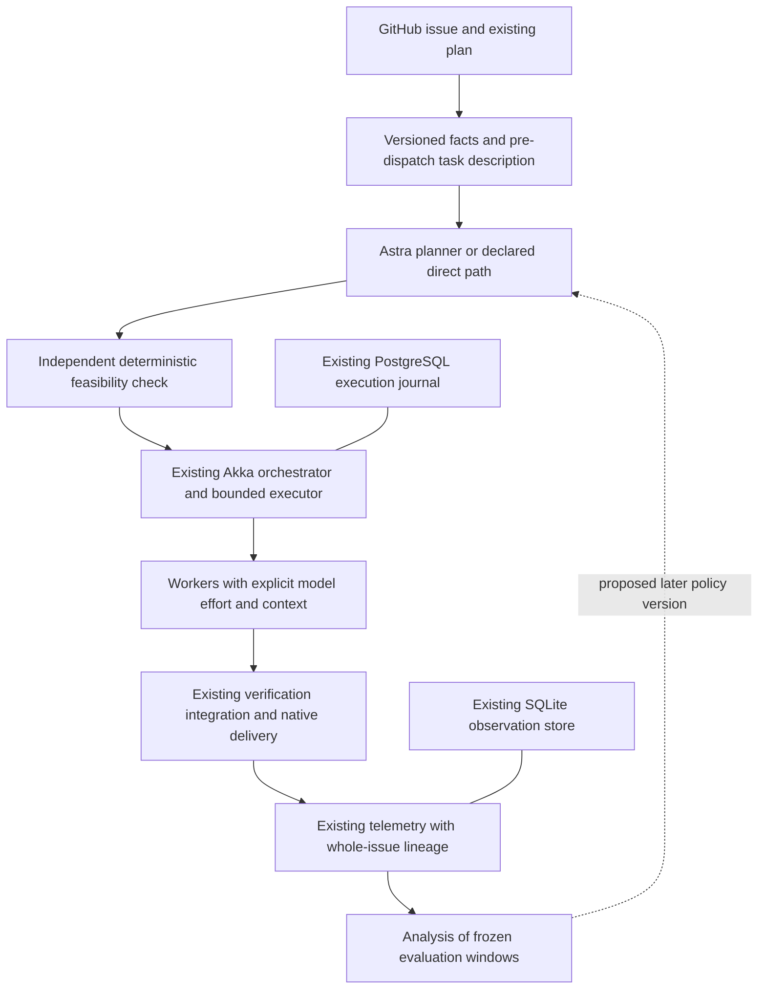
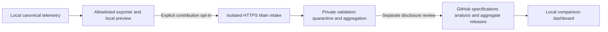

# Stable-policy orchestration and statistical learning

Authored: **2026-09-12 09:50:59 UTC**. Feature: **LEARN-01**. Status: **design and proposed implementation roadmap; no implementation or live experiment started**.

Owner: `.github` for programme policy, the existing telemetry producer and analysis contracts; `FS.GG.Coordination` for orchestration, planning and execution integration. SystemAdmin owns the selected installed Main/runner boundary. SDD, Templates and consuming repositories own their actual publication/adoption boundaries.

Unified part: **Stable-policy orchestration and statistical learning**, spanning V0 measurement, E0 comparative evaluation and selected E1 scheduling/context extensions. Backlink: [Unified Roadmap §9.8](../2026-09-07-154210-fs-gg-unified-development-roadmap.md#98-feature-parts-and-subroadmap-index). Reuse the selected [standalone O0–O3 roadmap](2026-09-09-190726-standalone-telemetry-host-and-orchestration.md); it retains completion authority for that foundation.

The requested outcome is one existing Akka orchestrator that turns GitHub work into bounded, feasible assignments, uses an Astra planner when useful, assigns workers with explicit model, effort and context, and learns which choices improve delivered quality and total issue cost. Begin with a few broad, fixed profiles and stable evaluation windows. Collect rich descriptions from the start; introduce finer routing only after repeated evidence supports it.

Acceptance of this document accepts a planning direction. Its fields, profiles, margins and experiment contracts are prospective design, not adopted executable schemas or dispatch policy. This document does not authorize implementation, provider calls, issue creation, publication, enrollment, deployment, a live canary or default changes. It adds no V0–V6 completion gate, changes no GS2 contract, and does not close O2 or O3.

## 1. Existing capabilities and the actual gap

The architecture is already substantially chosen. The [Unified Roadmap §§3–4](../2026-09-07-154210-fs-gg-unified-development-roadmap.md#3-intended-architecture-and-ownership) assigns one shared execution implementation to Coordination and separates process, legality, authority and capacity. Its [§7](../2026-09-07-154210-fs-gg-unified-development-roadmap.md#7-ci-observation-and-performance-contracts) supplies whole-item accounting and experiment discipline. The [OR-first design §§4 and 7](../coordination/2026-08-31-operations-research-first-agent-orchestration-design.md#4-operations-research-control-architecture) already proposes independent feasibility checks, work shaping, allocation and context compilation; [§14](../coordination/2026-08-31-operations-research-first-agent-orchestration-design.md#14-observability-and-audit) supplies outcome-first observation.

| Capability | Inspected evidence and status | Reuse or remaining LEARN gap |
|---|---|---|
| Host-local telemetry facts and projections | [UTEL store](utel-local-telemetry-store.md), [operational completeness](utel-operational-completeness.md), [store reference](../reference/local-telemetry-store.md) and [receipt contract](../reference/telemetry-receipts.md) describe delivered source, coherent publication and qualification of named repository-owned populations | Reuse immutable inbox/receipts, SQLite WAL, one writer, exact native identity deduplication, revisioned observations and bounded private reads. Do not build a learning event store |
| Runtime/CI identity, usage and outcome joins | [`TelemetryStore.fs`](../../src/FS.GG.Coord.Core/TelemetryStore.fs), [`TelemetryRuntime.fs`](../../src/FS.GG.Coord.Core/TelemetryRuntime.fs), [`TelemetryCi.fs`](../../src/FS.GG.Coord.Core/TelemetryCi.fs) already carry original-item/attempt/parent lineage, requested and observed model/effort, native usage, CI populations and outcomes | Extend these contracts where necessary; neither a successful batch nor a joined row proves complete usage coverage |
| Activities, complications and budgets | Existing activity spans, exact usage attribution, process reviews and complications; [`TelemetryBudget.fs`](../../src/FS.GG.Coord.Core/TelemetryBudget.fs) implements distinct-item intervention semantics | Reuse delayed correction and overhead accounting. Do not infer tokens from elapsed spans or create a second intervention counter |
| Durable single-host orchestration | O0/O1 source accepted; O2 provider/session core, executor pipeline and Main composition source delivered. The [O2 source window](2026-09-09-190726-standalone-telemetry-host-and-orchestration.md#o2-source-window-after-the-provider-session-correction) records immutable publication from `a22c7f97533e7bb4c60a891a49994ca5b0995189` and an inert receiver binding | Reuse Akka.NET, PostgreSQL execution journal, reservations, generation fencing, durable candidates and effect reconciliation. Installed subscription pilot, reboot/recovery acceptance and O3 remain pending |
| Typed provider/session boundary | Coordination's [`Execution.fs`](https://github.com/FS-GG/FS.GG.Coordination/blob/a22c7f97533e7bb4c60a891a49994ca5b0995189/src/FS.GG.Coordination.Orchestration.Execution/Execution.fs) separates requested/resolved selection, bounded launch, session observation and known/unknown/not-applicable usage or cost | Availability and observed identity must be verified on the selected installed adapter. An option in a task packet does not prove the provider honored it |
| Planning proposals | Coordination's [`Observer.fs`](https://github.com/FS-GG/FS.GG.Coordination/blob/a22c7f97533e7bb4c60a891a49994ca5b0995189/src/FS.GG.Coordination.Orchestration.Observer/Observer.fs) provides bounded planning attempts and durable proposals; its inspected action vocabulary is inspect/compare/recommend | The complete create/keep/investigate/decompose contract, context manifests and statistical policy comparison need a scoped extension; they are not already demonstrated end to end |
| Task dimensions and experiment assignment | Inspected closed telemetry fact types do not expose a complete pre-dispatch feature snapshot, context manifest, randomized assignment or frozen evaluation-window contract | Define the minimal additive producer contracts and bounded derived analysis; do not insert arbitrary new fields into today's closed schema |

The telemetry SQLite store and the orchestration PostgreSQL journal serve different purposes. PostgreSQL retains execution intent, reservations and settlement; SQLite retains observations for analysis. Join them by existing identities and source references. Neither may reconstruct the other's authority from dashboard state. A derived analysis file is reproducible output, never a new mutable source of completion truth.

Built-in collaboration has no native final-usage hook. Its explicit dispatch observations can establish expected population and lineage, but cannot establish total tokens. Existing installation evidence for another route or workspace does not establish collection for a selected experiment; inspect actual configuration and preserve unsupported or unconfigured coverage gaps.

## 2. One orchestration loop, with a small initial policy



These boxes are responsibilities, not additional services. Pure policy and analysis stay callable without a host. The existing Akka actor graph supervises the selected work; it does not embed a second scheduler/executor or turn every telemetry event into a planning-agent call.

1. Observe an issue using its stable repository/native identity, current scope revision, source/base, dependencies and existing plan. Record eligibility and the first eligible-request time before queue admission. Board membership is navigation, not work identity.
2. Resume a valid plan. For a new substantial feature, Astra high proposes **create**, **keep**, **investigate** or **decompose**, with bounded scope, rationale and outputs. Investigation names a decision-changing question, cost limit and stopping condition. Ordinary test failures and session restarts do not summon a fresh planner.
3. Compile the proposal into a typed assignment or bounded internal activity graph. Bind model, effort, context manifest, required outputs, touch-set, tools, deadline, attempt budget and integration owner. No free-text instruction can widen an effect's authority.
4. Independently check feasibility against authoritative obligations and current resource/authority facts, including constraints omitted by the planner. Commit only the next useful dispatch horizon. Revalidate effect-time preconditions through the incumbent boundary.
5. Execute, verify and integrate through existing technical checks and native delivery. Process loss and ambiguous effects use existing reconciliation; a timeout does not prove absence or release outstanding reservations.
6. Emit ordinary machine observations. Analyze completed windows asynchronously. A report can propose a policy version; it cannot activate itself.

### 2.1 Proposed broad profiles

| Profile | Initial role and selection | Stable treatment of context and recovery |
|---|---|---|
| `plan-standard` | Astra high for new substantial feature planning or material replanning; resume a valid plan without another planning pass | Bounded planning packet, fixed planner instructions, explicit stopping rule and original-issue accounting |
| `implement-standard` | Sol medium for implementation under the selected task contract; one owner, with only justified bounded children | Fixed implementation/review/check process; explicit context variant; same lineage and budget through repair |
| `direct-small` | Optional predeclared path for a bounded, sufficiently understood issue that can use the standard implementation worker without a new Astra planning pass | Eligibility is evaluated before dispatch under a fixed rule. Required technical evidence remains. Initially report separately or exclude from the first experiment |

These are proposed baselines using the programme's requested model selections, subject to actual provider availability and the selected work contract. They are not a claim that every installed subscription exposes those identities. If unavailable, report the capability gap and defer the affected experiment or use an already authorized incumbent route with a recorded deviation. Do not silently substitute a model and call it the same treatment.

Keep a short, finite list of supported profiles. Broad task descriptions do not imply a model/effort matrix for every language, repository, risk, size and novelty combination. The first experiment changes context only within `implement-standard`; planner model, worker model, effort, decomposition policy, review/check process and concurrency policy remain fixed. A later model or effort experiment changes one named factor against a retained control.

Routine delivery remains the default. Only an explicit human instruction selecting heavier ceremony for named scope changes that process. Risk labels, formal work, protected paths or learned predictions may select substantive technical checks and operation safeguards; they cannot select ceremony, grant authority or remove mandatory evidence. A model prediction never overrides the [existing qualification/reuse contract](../adr/0084-semantic-reuse-never-cancels-coherent-validation.md).

### 2.2 Work shaping and capacity

Keep ordinary implementation steps inside an assignment. Create GitHub subissues only for independently deliverable outcomes with a real owner/dependency boundary and an integration contract. Creating an issue/subissue is a provider effect requiring the selected route's authority and duplicate protection. The planner may also propose an issue; this document does not execute that proposal.

Estimate decomposition using fixed setup, repeated context, cut-edge coordination, parallel benefit, integration, review and expected repair. Start with conservative ranges and transparent rules from the existing OR design. Do not require a calibrated solver before safe baseline work can produce measurements. Avoid LOC targets and artificial item enlargement/splitting to improve a ratio.

Scheduling begins with the existing feasible priority/FIFO/aging policy, bounded WIP and recovery headroom. Observe implementation, review and integration queues together. Unchanged estimates do not justify moving a running task. Solver investment, alternate decomposition and adaptive allocation are conditional later work, with the same independent feasibility checks for incumbent and candidate plans.

## 3. Describe tasks separately from choices and outcomes

Task dimensions describe information available before assignment. They are not an execution-profile name or a retrospective explanation of success. Preserve unknown values rather than confidently filling every field.

| Dimension family | Useful initial fields | Collection and limits |
|---|---|---|
| Requested work | Defect/feature/refactor/docs/investigation; intended deliverable; acceptance surface | Derive from the original request and current plan; use multiple labels only when supported |
| Scope and dependencies | Repository count, component/contract boundaries, dependency count, touch conflict, independently deliverable slices | Record estimates and ranges before dispatch; actual files changed belong to outcomes |
| Uncertainty and difficulty | Requirement clarity, domain novelty, known reproduction, algorithmic/concurrency complexity, confidence in estimates | Fixed rubric with evidence provenance; a planner's estimate is not ground truth |
| Technical obligations | Language/runtime, public contract/model change, validation classes, required integration/environment | Derive authoritative obligations independently of the planner's chosen graph |
| Operational constraints | Reversibility, current authority, restricted data/tools, provider capability, capacity and deadline class | Separate eligibility from predicted difficulty; an unknown permission does not become low risk |
| Context state | Existing plan, reusable evidence, relevant source footprint, warm/resumed session, known prior attempts | Measure available information before treatment; retrieved bytes and later compactions are execution facts |

Every description carries a schema/rubric version, observation time, input/scope digest, evidence references, producer identity and field confidence/provenance. Cheap deterministic extraction comes first; use an existing planning turn for judgments where useful. Audit a small sample for consistency, including disagreement and missing labels. Do not commission a labeling agent and certificate for every issue.

Freeze the pre-dispatch snapshot used for eligibility and randomization. Corrections append revisions and reasons, preserving the originally available values. Scope discovered after dispatch is a post-assignment event: retain it for explanation and future feature design, not a silent replacement baseline covariate. Do not train an initial router on retries, actual changed files or final review severity while claiming those were known beforehand.

## 4. Context and token efficiency are first-class

The target is quality-constrained **total issue tokens and latency**, including the cost of selecting and maintaining context. A shorter prompt that creates another investigation, retry or escaped repair may be worse.

The context manifest separates mandatory material from selectable material, following [OR-first §7.6](../coordination/2026-08-31-operations-research-first-agent-orchestration-design.md#76-agent-allocation-and-context-compilation):

| Class | Contents and invariant |
|---|---|
| Mandatory | Objective, governing instructions/contracts, authority boundary, exact relevant snapshot, allowed scope/tools, dependencies, required output and acceptance/recovery contract. Never omitted to hit a context target |
| Selectable | Focused source, examples, prior findings, history, logs, research and relevant optional skills. Select by relevance and expected error reduction; retain references to omitted candidates |
| Assembly evidence | Manifest/version/digest, selected source revisions, inclusion reasons, mandatory/selectable status, estimated size, retrieval method, build duration and actual usage where available |
| Runtime evolution | Additional retrieval, cache reads/writes where exposed, compaction/handoff manifest, restored or lost mandatory references, context revision, provider limits and truncation/refusal events |

Mandatory content is determined from actual applicable instructions; the compiler cannot reclassify inconvenient instructions as optional. If it cannot fit or safely represent the necessary material, it refuses that package or follows the declared escalation path. Test a missing governing instruction, stale contract, incompatible source snapshot and malicious retrieved instruction as negative controls. Untrusted issue/source content remains data at the instruction boundary.

The first context comparison uses **current package** versus **focused package**. Capture and version the current package recipe before enrollment. The focused recipe preserves mandatory content, sends the relevant source/plan excerpts and exact references, and supports bounded retrieval on demand. Hold the retrieval tools and permissions constant so the experiment compares package selection, not covert tool access. Charge every extra retrieval or summarization turn to its issue.

Count context building, retrieval, summary/compaction, cache preparation, duplicate parent/child transmission, resume/handoff, and analysis/instrumentation maintenance. Cache-hit rates and bytes are diagnostics; report actual provider usage separately. Keep cached input as a subset where that provider defines it so it is not added twice; similarly do not add reasoning already included in output. Record estimates as estimates when native counters or tokenizer identity are unavailable.

Session reuse can save setup but also transfer information across treatments. The first experiment must predeclare whether sessions are isolated per original issue or whether related issues form one randomized cluster. Keep parent/child treatment consistent, record warmness, and prevent a worker from privately choosing a different context variant. Emergency recovery may use the fixed rescue path; it remains charged to the assigned arm.

## 5. Original-issue accounting and conceptual records

The original GitHub issue is the primary accounting and evaluation unit. Its admitted scope and success criteria are frozen references. A decomposition creates child execution identities and possibly subissues, not additional independent successes. A preexisting independently admitted issue retains its own root; shared dependencies use explicit allocation without counting the same expense twice.

For issue `i`, the conceptual totals are:

```text
T(i) = unique attributable native token usage across planning, context work,
       all children, implementation, retries, review, validation-related model work,
       integration, delivery and delayed repairs + allocated shared model cost
L(i) = time from first eligible request to the declared native acceptance outcome
       with unfinished age and follow-up repair delay reported separately
```

Compute totals only under compatible provider accounting semantics. Preserve the per-provider vector when token definitions cannot be combined. Native usage gaps make the total incomplete, not zero. Runner time, API calls, human attention and actual priced expense are separate dimensions; wall time is not the sum of parallel child durations. Critical-path attribution requires witnessed dependency/timing evidence.

All eligible and assigned issues remain visible: no-op, refused, failed, cancelled, stopped, superseded and unfinished. Report acceptance against the original issue's substantive criteria and selected endpoint—source delivery, publication, installation or observed operation—as appropriate. A child final message, PR merge or transport receipt cannot stand in for a different endpoint. Material scope changes get a linked revision and deviation disposition; they do not reset the denominator.

Shared planner, observer, analysis and intervention costs follow a fixed allocation rule declared before a window, with unallocated amounts and absolute programme cost also shown. Report amortized scenarios against plausible operating volumes; do not conceal build/maintenance cost by assuming unlimited future work. Late repairs and reopened issues append evidence to the original assignment and produce a new analysis revision.

### 5.1 Minimal conceptual data model

The following records describe relationships for implementation planning. They are **not schema names accepted by current APIs**, migration numbers, a new database or a requirement to persist every column twice.

| Concept | Minimal relationships and facts | Authoritative owner / implementation disposition |
|---|---|---|
| Issue observation | Original issue, feature, scope revision, eligibility, first eligible time, pre-dispatch dimensions and provenance | Native issue facts plus minimal versioned telemetry extension; preserve existing item identity |
| Policy/window definition | Profile versions, context recipes, eligibility, assignment design, outcomes, margins, sample/stopping plan, analysis version | Versioned policy/research artifact under existing ownership; immutable digest referenced by assignments |
| Plan/assignment | Existing proposal, attempt, parent/root, chosen action, requested profile, context digest, limits, randomization unit/arm/probability and deviation reason | Extend existing Coordination planning/execution contracts; execution authority stays in its journal |
| Context manifest | Source digests/references, mandatory/selectable selection, assembly/retrieval/compaction lineage and size/usage provenance | Private bounded manifest in existing artifact custody; observation stores references and needed aggregates |
| Execution observation | Observed provider/model/effort, usage scopes, invocation/turn, activities, CI, queue/terminal events and coverage | Reuse existing runtime/CI/activity facts; additive fields only after producer contract qualification |
| Issue outcome/follow-up | Native acceptance reference, failure/cancellation/censor state, all descendant settlement, repair/regression links, maturity | Reuse native outcome/complication/revision mechanisms; distinguish task completion from follow-up maturity |
| Analysis result | Frozen input digests/cutoff, expected versus observed population, exclusions/deviations, effect estimates/uncertainty, decision and limits | Reproducible private read model/report; public allowlisted aggregates only; no new completion authority |

A randomized assignment must be durable before dispatch so restart cannot redraw a preferable arm. Its identity is the original issue or predeclared cluster, not attempt ID. Repeated native observations deduplicate as today. A correction changes a projection revision, never the historic assignment or recorded policy. Design schema evolution and compatibility in the owning producer before consumers send new facts.

## 6. Statistical analysis plan

### 6.1 Questions, cohorts and estimands

Begin with one question: **does the focused context package reduce total issue tokens for the selected supported work class while preserving useful completion quality and acceptable latency?** Retain a stable control. Do not simultaneously tune model, effort, decomposition, review and context, and do not create a full factorial grid of task dimensions.

Choose an eligible cohort before observing its outcomes. Prefer one provider/accounting scope and one broad implementation route with real total-usage support. Include the planner in total cost even though its recipe is identical across arms. Unsupported native-collaboration usage is visible in the coverage census but cannot qualify the primary total-token comparison. Excluding an unsupported route before randomization is different from dropping failed collection afterward.

The primary estimand is the difference, and corresponding ratio, of **mean total tokens per assigned original issue** under the two fixed policies over the declared observation horizon. This includes unsuccessful work. Mean cost matters to capacity; medians and distributions supplement it. Report the share reaching native acceptance by a fixed, class-appropriate deadline, material escaped defects/repairs during follow-up, unresolved effects and total lead time. Cost per accepted original issue is a secondary cohort ratio whose numerator includes costs from unsuccessful assigned issues.

Acceptance has both a functional predicate and a follow-up predicate. Never substitute the agent's self-rating. Preserve useful tests, actual review findings and independent native outcomes. A zero count of rare incidents in a small cohort is an observation, not evidence of equivalent rare-event safety. Authority and integrity violations invoke their existing immediate response, regardless of a favorable average.

### 6.2 Assignment and dependence

Randomize eligible original issues to current/focused context, normally with equal allocation, after freezing their pre-dispatch description. Block on a few important pre-treatment nuisance factors such as repository and broad work class when volume supports both arms. Randomized blocks compare the factor of interest within groups sharing relevant nuisance conditions; this motivates limited blocking, not a cell for every label. [NIST randomized block designs](https://www.itl.nist.gov/div898/handbook/pri/section3/pri332.htm)

Persist randomization algorithm/version, stable unit, allocation probability, block, seed/reference and assignment before any treatment-specific work. A retry, child, new PR or resumed worker inherits its original assignment. Use the assigned-treatment analysis as primary even when a provider fallback, rescue package or crossover occurs. Show deviations separately; an as-executed comparison is diagnostic and may be confounded.

Correlated descendants are one issue, not independent observations. Related issues sharing a planner/session, feature or tightly coupled repository change may require cluster assignment and analysis. Record repeated measures and shared resource contention. For a later scheduler policy that changes queue behavior, issue-level randomization may cause interference; a separately designed cluster or randomized switchback experiment would need carryover/washout handling. Do not assume this first context trial qualifies a scheduling policy.

The analysis must respect the actual assignment unit and blocked/clustered design. Predeclare cluster-resampling or randomization-based intervals as appropriate, and covariate adjustment using only frozen pre-treatment features. With too few independent clusters, report insufficient precision; hundreds of children cannot compensate for a handful of original clusters. Repeated benchmark runs are useful for mechanisms and variance, but do not multiply the count of real delivered issues.

### 6.3 Windows, maturity and decision cadence

Proposed initial operating cadence, to be bound in LEARN-01.1 before enrollment:

- Enroll for at least **28 days** under immutable profiles, context recipes, eligibility and analysis rules. Set a maximum enrollment of **84 days** and a fixed outcome deadline per selected class; calendar duration alone never permits promotion.
- Preserve at least **30 days of post-acceptance repair observation** for a broad adoption claim, following Unified §7.3. Record unfinished/censored issues at each cutoff. A maximum follow-up cutoff and treatment of unresolved work must be declared before enrollment so a difficult issue cannot disappear or keep the analysis open forever.
- Inspect operational health whenever needed, but evaluate promotion only at predeclared data locks, proposed every **four weeks** after the minimum enrollment. Each lock states the included admission horizon and which follow-up is mature. Repeated inferential looks require a predeclared sequential error budget; otherwise interim views are descriptive and only one planned final analysis can qualify a claim.
- Require sufficient independent sample size and confidence-interval precision for the declared practical improvement and quality/latency margins. If the cap is reached without adequate evidence, return **insufficient data**, retain the baseline, and design a new bounded window if worth funding.

For concreteness, LEARN-01.1 should assess a provisional target of at least **10% total-token reduction**, a class-appropriate latency non-inferiority margin, and a separately justified tolerance for material completion/repair differences. The 10% target is a proposed local investment threshold, not a scientific constant or an adopted gate. Fix actual margins, confidence level, baseline variance/rate estimates and sample-size calculation before candidate results are inspected. Use simulation under plausible heavy-tail and cluster dependence when simple independent-observation calculations do not match the design.

Do not choose a tiny sample merely because the window is short. The Unified Roadmap's ten-per-route viability comparison does not establish rare-defect equivalence or p95/p99 behavior. If quality precision is unattainable at current volume, the result can support bounded continued observation of the same qualified scope; it cannot support a broad default or safety-equivalence claim.

### 6.4 Missingness, censoring, drift and multiplicity

Reconcile the expected eligible/assigned population against launch, child, CI and native outcome inventories. Report record validity, identity joins, population coverage, attribution and statistical qualification separately. A known cost lower bound is useful, but unbounded missing usage cannot establish a total-token saving. Do not repair missing usage with elapsed time, a guessed API price or an LLM estimate.

Analyze failure and cancellation as actual dispositions. Distinguish administrative censoring at the data lock from a known failed/stopped outcome. For time-to-acceptance, show unfinished ages and use an explicitly justified censored-time analysis; cancellations may be competing outcomes rather than independent censoring. Report fixed-horizon completion and cost alongside it, and disclose assumptions about informative loss to follow-up. Do not label partial spending on unfinished issues as their eventual full cost.

Keep recent immature cohorts separate from mature follow-up. Specify how late repairs revise previous estimates and decisions. Run sensitivity bounds for plausible missing outcomes/costs and display differential loss across arms. Material evidence loss can make an experiment inconclusive without invalidating the native work that was safely delivered.

Log provider/backend/model revisions, toolchain/policy changes, load, seasonality, operator changes and collection revisions. Visible provider identity may still hide backend changes; record that limit. Do not pool a discontinuity automatically. A material change can end the active window as interrupted and start a newly versioned comparison; preserve the earlier population and costs.

Predeclare one primary improvement and the quality/latency guardrails. Use a defined joint decision rule and multiplicity handling for confirmatory tests. Treat rich subgroup comparisons as exploratory until independently replicated; avoid selecting the best of many model/task/context cells from the same observations and calling it confirmed. A later confirmation window must use fresh outcomes and retain the control.

### 6.5 Stable policy, urgent repair and analysis output

Stable evaluation does not postpone necessary incident response. The existing bureaucracy policy remains distinct: target near 5%, ceiling 10%, one intervention at 15 cumulative distinct breaches above 10% or any original item above 25%; useful tests remain excluded. Neither a new window nor a retry resets its epoch. Keep the predecessor's broader overhead series separate, as [Unified §7.4](../2026-09-07-154210-fs-gg-unified-development-roadmap.md#74-narrow-bureaucracy-budget-tests-excluded) requires.

An urgent technical repair or due overhead intervention proceeds through its existing owner and authority. Attribute all repair cost. If it changes the experimental treatment, process or measurement materially, flag the window interrupted/deviated, preserve assigned-treatment results and apply the predeclared restart/disposition rule. Do not silently improve one arm mid-window or reset the intervention because a report was produced. Verified deployed improvement remains the intervention's reset requirement.

One reproducible report per analysis lock should answer: which original issues were eligible/assigned; what was actually observed; where usage/outcomes are missing; what changed between arms; the effect estimate and uncertainty; whether practical margins pass; and what remains unproven. Include a compact task-mix/coverage table, outcome/cost distributions, late-repair count and budget breakdown. Add visualizations only when they answer those questions. Refreshing a dashboard need not run a model or trigger a new report ceremony.

## 7. How learning becomes useful without early overfitting

The first learning product is an honest empirical baseline: costs, quality, variability, missingness and sources of avoidable context/coordination work. Descriptive associations help identify hypotheses; they do not authorize a task-specific router. Keep decisions broad while data accumulates.

After a replicated context benefit, test one further choice with sufficient volume: another context recipe, a model/effort alternative, the direct-small path, or a work-shaping rule. Reuse the existing OR methods for constrained scheduling/assignment when that specific bottleneck justifies them. Compare total issue cost and operator burden, including the optimizer itself.

Later, partial pooling across related task classes may stabilize sparse estimates while retaining repository/provider variation and uncertainty. Validate calibration and held-out performance on future windows before using these predictions in dispatch. Weakly supported classes keep the broad control; they do not get a confident custom profile because a label exists.

Only then consider constrained adaptive exploration among already qualified profiles. It needs a fixed eligible action set, independent feasibility, bounded exploration and resource caps, logged assignment probabilities, overlap with the retained control, delayed-outcome handling and rollback. Update at declared epochs, not after each attractive outcome. The learner may adjust allocations within adopted bounds; it cannot learn new authority, remove checks, alter evaluation criteria or change its own training history.

Historical replay checks feasibility, reconstruction and decision differences. It does not observe an unchosen model's outcome. Logged-bandit research addresses learning where only the chosen action's value is observed and requires explicit assumptions about the logging process; its results do not make arbitrary agent logs causal evidence. [Microsoft Research: Learning from Logged Implicit Exploration Data](https://www.microsoft.com/en-us/research/publication/learning-from-logged-implicit-exploration-data-2/)

For any future off-policy estimate, document support/overlap, assignment-probability provenance, estimator assumptions, weight concentration/effective sample size, temporal validity and sensitivity. Unknown probabilities or unsupported actions may prevent that estimate; observational replay remains useful without a causal claim. Simulation describes its assumptions, shadow proves feasibility/overhead, and a controlled authorized comparison supplies evidence about actual outcomes. No one result establishes all four.

## 8. Concrete issue walk-through

Consider a hypothetical GitHub issue to fix a parser defect and add a regression case. The requested outcome and acceptance criteria are recorded before dispatch. The task snapshot says single repository, known reproduction, existing contract, low scope uncertainty; confidence and evidence references accompany those labels.

A valid existing plan means no fresh Astra pass. Otherwise `plan-standard` decides whether to keep the issue intact or investigate the reproduction. Reading the parser, editing it and running tests remain internal steps. If investigation reveals an independently deliverable producer/consumer change, the planner may propose subissues with an integration contract; all descendant costs still join the original experimental root.

The eligible issue is randomly assigned the focused package before implementation. Sol medium receives mandatory instructions, the relevant parser and tests, the accepted plan and exact references. The same check/review route and rescue rules apply in both arms. A retry adds an invocation, not a new trial or budget. If native observation reports a different model, requested and observed values remain separate and the issue remains in its assigned arm with a deviation.

Suppose the initial prompt is smaller but a missing example causes extra retrieval and repair. Those tokens, the planner, review and integration all count. A later regression within follow-up is linked back to the same issue and policy. A child success or source merge alone does not erase it. If one child has unsupported usage, the report shows a partial total and cannot use that issue as evidence of a complete token saving.

The window result might be “focused context reduced median input but total tokens and quality remain inconclusive.” That is a useful outcome: keep the stable baseline, inspect the failure mechanism, and propose a new version only at the declared boundary. A statistically supported and practically useful result still applies only to the measured provider, work class, process and time window.

## 9. Executable near-term roadmap

All milestones use the routine route and one accountable owner. Technical/model/schema checks follow the changed boundary; explicit publication and operation safeguards remain separate. These are future assignments, not work started by this design. The first source window is **LEARN-01.1–.3**; .4–.5 are detailed dependent milestones whose live work waits for their stated foundations and authority. Keep O2/O3 and existing UTEL/GS2 records as references, with no duplicate mutable checkboxes here.

- [ ] **LEARN-01.1 — Freeze the baseline and one reviewable experiment contract — route: routine.**
  Owner: `.github` policy/analysis owner, with Coordination supplying the actual adapter and assignment boundary.
  Depends on: this design's planning-direction acceptance; read-only access to supported source and existing authorized observation summaries. No O2 live completion prerequisite for this source/research work.
  Scope: select one broad class; identify actual baseline packet/profile and native usage support; define task rubric, conceptual-to-existing-field mapping, context manifests, root accounting and assignment unit; freeze cadence, endpoints, margins, sample/precision plan, drift/interruption and stopping rules. Bind baseline artifacts and analysis versions; exclude unsupported routes prospectively and disclose the excluded population.
  Acceptance: a concrete current/focused comparison can be reconstructed without guessing model identity, eligibility, descendants or usage semantics. A small synthetic corpus includes failure, cancellation, open work, rescue, delayed repair and shared cost. Negative controls reject outcome-derived baseline labels, treating subissues as independent successes, and unbounded missing tokens as zero. The initial build/analysis budget follows E0's proposed five-day experiment cap, with a two-day scope check; observing a declared window is separately bounded.
  Closure: merged contract/analysis fixtures with native checks and readback; no adopted live policy or reported efficiency result. If available evidence cannot support a token experiment, name the smallest collection prerequisite and keep baseline/descriptive work useful.

- [ ] **LEARN-01.2 — Add the missing observation contract and reproducible issue analysis — route: routine.**
  Owner: `.github` existing telemetry producer; Coordination owns any assignment-side contract change.
  Depends on: .1's stable field/identity contract. Coordinate producer-before-consumer compatibility; reuse existing UTEL facts where they suffice.
  Scope: minimal additive typed facts/references for pre-dispatch task snapshots, manifest/recipe identity, policy/window assignment and deviations; derive whole-issue analysis through the existing bounded private read path. Retain current receipt limits, SQLite writer/replay semantics, privacy and public allowlist. Do not copy execution intent into a new journal.
  Acceptance: repeatable input snapshots reproduce totals, coverage and assigned-treatment reports; unique costs reconcile across root/children/retry/review/repair; source fixtures cover reordering, duplicates, correction, reopened roots, incomplete CI, provider mismatch, unsupported usage and late arrival. Negative controls for double-counted cache/reasoning, missing child, redraw on retry and cross-workspace join stay visibly invalid/incomplete. Demonstrate bounded output and old-store/schema compatibility, plus source-owned checks appropriate to the change.
  Closure: source delivered and compatibility evidence retained. Publication, installed adoption and actual operating collection are separately reported pending; a green synthetic report is not a measured benefit.

- [ ] **LEARN-01.3 — Integrate fixed profiles and context assembly into the existing orchestrator — route: routine.**
  Owner: Coordination; `.github` supplies the versioned profile/analysis contract.
  Depends on: .1; .2's producer contract for new observation fields; accepted O0/O1 and relevant O2 source boundaries. Source/shadow qualification does not wait for unrelated V0–V6 exits.
  Scope: extend existing typed proposal/assignment contracts for create/keep/investigate/decompose; resume valid plans; implement fixed Astra-high/Sol-medium selections and explicit direct-small eligibility; compile current/focused manifests; persist assignment before dispatch; connect observations to the existing executor. Reuse deterministic feasibility, WIP/reservations, artifact custody and effect settlement. No new service, executor or model-routing search.
  Acceptance: fixture journeys exercise existing-plan reuse, bounded investigation, justified independent decomposition, mandatory context, parent/child treatment, provider capability refusal and requested/observed mismatch. Independent checker controls reject stale authority, missing obligation, capacity oversubscription and budget renewal. Shadow capabilities cannot dispatch or mutate GitHub; crash/replay cannot redraw treatment or create a second owner. Qualify affected canonical model correspondence where semantics change, and the selected exact native checks.
  Closure: merged source plus executable shadow/adapter evidence. Runtime publication and installed usage remain pending; no O2/O3 completion claim and no live randomization from source merge.

- [ ] **LEARN-01.4 — Qualify installation and run one authorized fixed context window — route: routine.**
  Owner: Coordination for execution; `.github` for telemetry/analysis; SystemAdmin for selected Main/runner operation; actual receiver owners for adoption.
  Depends on: .2–.3 published and adopted at their real producer/receiver boundaries; relevant O2 installed subscription/recovery/pilot acceptance under its own ledger; applicable O3 scope expansion if enrollment exceeds O2; selected class authority and experiment opt-in. Bind exact artifacts/releases before operation. Normal v2 mutations retain their own epoch gates; a permitted incumbent/read-only route does not acquire a new V0–V6 dependency.
  Scope: clean installed and retained-upgrade proof; prospective telemetry reconciliation; an A/A assignment/analysis rehearsal for machinery, then the predeclared current/focused enrollment with fixed profiles and bounded ordinary workload. Enrollment is a separate operating effect, not implied by this document or a successful package build.
  Acceptance: actual supported root/child usage, context assembly and native delivery/repair joins; separate warm/cold and requested/observed facts; no missing population concealed. Inject pause/restart, duplicate observation, lost telemetry and unavailable provider to prove assignment persistence, explicit incompleteness and safe native delivery. A/A validates plumbing and detects gross allocation/reporting faults; it does not prove absence of every bias. Complete the declared data lock with failed/cancelled/open issues retained and mature versus censored follow-up explicit.
  Closure: native installation/operation receipts and a reproducible window dataset/report, or a recorded interrupted/stopped window with reasons. Missing statistical power remains insufficient data; neither receipt closes O2/O3 on their owners' behalf.

- [ ] **LEARN-01.5 — Make and verify the first evidence-based policy decision — route: routine.**
  Owner: `.github` policy/analysis owner; Coordination and selected receiver owners deliver any approved adoption.
  Depends on: .4's usable locked data and declared maturity/precision; actual authority for any subsequent activation.
  Scope: estimate primary total-token effect and quality/latency guardrails with the predeclared design; quantify collection/analysis/maintenance cost and practical return. Decide retain control, bounded continuation, stop candidate or prepare a separately versioned promotion. Obtain a fresh confirmation window before broadening a claimed benefit; retain a stable control for subsequent comparisons.
  Acceptance: independent reproduction from bounded source references; no success-only denominator, hidden crossover or post hoc subgroup promotion; sensitivity to missingness, shared cost and delayed repair is visible. Negative controls expose artificial split-success inflation and a cheaper prompt with greater total repair cost. A promotion names the supported class/provider, installed version, rollback and limits; it cannot weaken technical checks or declare unmeasured rare safety/tail equivalence.
  Closure: merged decision and native readback, plus installed/observed evidence only if an authorized activation actually occurred. Update Unified §0 after authoritative milestone closure. A retain/inconclusive result closes this decision milestone honestly; it does not mark the broader learning capability or adaptive extension delivered.

### 9.1 Conditional later outline and feature exit

The next horizon is chosen from results, not expanded into a speculative queue now. It may contain confirmation of a context gain, a single model/effort or direct-path comparison, limited partial pooling, a measured work-shaping/scheduling improvement, or constrained adaptive exploration. Each requires stable baseline coverage, repeatable outcome evidence, adequate independent sample/uncertainty, an operating owner and bounded implementation/maintenance cost. Adaptive work additionally requires logged action support, calibration/drift proof and preserved control/rollback.

The feature's stable-policy core is delivered only when the existing orchestrator supports explicit bounded assignments and context manifests on a named installed route, complete-enough whole-issue observation supports a reproducible controlled comparison, and one mature evidence-based decision has been completed within that scope. Successful adoption is not required if the candidate lacks benefit; a functioning comparison and honest retain decision are valid learning outcomes. If unsupported usage prevents the comparison, source-window completion alone cannot claim this exit.

Report **source delivered**, **published**, **installed**, **activated**, **observed/qualified**, **ready window complete** and **feature exit met** separately. Later adaptive routing remains conditional and unimplemented until its own approved horizon passes; it is never implied by checking the five core milestones. Missing optional adaptive work or community enrollment is not a hidden prerequisite for the stable-policy core.

### 9.2 Later community participation milestone

The user accepted an isolated Main intake as the design direction and requested its inclusion in the roadmap. It is a later, opt-in extension, independent of completing the first internal experiment. No endpoint, DNS name, repository or data collection is activated by that decision. Section 12 defines its product and data boundaries.

- [ ] **LEARN-01.6 — Enable opt-in community contribution through isolated Main intake and reviewed public aggregates — route: routine; later dependent window.**
  Owner: `.github` for contribution/analysis/publication contracts and existing telemetry exporter; Coordination for reusable receiver components where applicable; SystemAdmin for Main hosting; SDD/Templates and installed clients for adoption. Name the research-data custodian and release owner before enrollment.
  Depends on: .1–.2's stable definitions and exporter/read contracts; lessons from .4's internal data-quality window; accepted consent/disclosure/retention policy, actual hostname/public ingress capacity and operating authority. It does not require adaptive routing or authorize broader O3 orchestration scope: community intake has no dispatch capability.
  Scope: versioned local preview/export, observation-sharing consent separate from experiment consent, contributor enrollment and credentials, isolated authenticated HTTPS intake on Main, private bounded validation/aggregation and a dedicated GitHub repository for specifications, analysis code and reviewed cohort dataset releases. Fix exact repository/hostname identities during implementation; do not invent deployed resources. Publish/adopt actual exporter/receiver bytes and prove clean and retained clients before inviting participants.
  Acceptance: local-only operation sends nothing; preview and upload use the same serialized closed-schema bytes; project exclusions and withdrawal stop future submission; unexpected fields or wider schema/consent scope require refusal or renewed opt-in. Exercise cross-tenant access, replay/conflicting duplicate, quota, poisoning, interrupted upload/acknowledgment, deletion before publication and private restore/retention controls. Main intake cannot read internal orchestration/telemetry data or issue jobs. The release fixture suppresses sparse groups and detects differencing across repeated releases; public outputs contain no task text, repository/issue/path references, exact event times or stable user/issue identifiers. A report distinguishes self-selected observation from randomized cohorts, preserves coverage and clustered uncertainty, and never treats signed self-report as verified delivery.
  Closure: separately evidenced source/publication/installed intake, an explicitly opted-in pilot, tested withdrawal and one reviewed public aggregate release if its disclosure and sample rules pass. If too few contributors exist, publish the specification/analysis and an insufficient-cohort result without exposing their data. GitHub publication authority and data-release consent remain separate from accepting an upload; source merge alone completes neither.

## 10. Workspace impact and adoption

Under [Unified §9.9](../2026-09-07-154210-fs-gg-unified-development-roadmap.md#99-when-new-workspaces-change), this design changes no workspace contents or enabled behavior. .1 changes research inputs; .2–.3 first change source capability. **.4 is the first milestone that can change an explicitly enrolled installed route or a newly created workspace that selects published learning support.** General fresh-workspace defaults remain unchanged.

| Receiver family | Before and proposed after | Publication/adoption and proof |
|---|---|---|
| Selected Main/runner workspace | Existing bounded execution and telemetry; opt-in fixed profiles/context comparison after qualification | Coordination publishes exact Host/runner artifacts; SystemAdmin adopts them and qualifies clean installation separately from the retained inert deployment. Existing O2/O3 remain native prerequisites for their scope |
| Repository-owned driver/helper consumers | Current automatic observations where supported; additive task/context/window references and fixed assignment support | `.github` publishes coherent driver/telemetry bytes; consuming repositories adopt compatible pins. Source checkout availability is not installed publication |
| SDD-generated console and Fable-game families, when selected | Current provider/lifecycle and guidance; optional compatible helper/configuration for the named experiment | SDD adopts published driver/Kit/tool pins and publishes its materializer. Templates publishes an updated provider/overlay only if it owns affected bytes. Bind actual release IDs during .4, not invented versions now |
| Existing generated repositories | No automatic rewrite or enrollment | Use the existing bounded upgrade/adopter path; preserve authored files, owner-sourced skills, co-tenants and existing authority. Report collisions before mutation and verify rollback/retry separately |
| Community contribution clients, later .6 | Local analysis remains available without sharing; optional preview/export and separately consented experiments | Publish the existing exporter/receiver extensions, then adopt them through actual CLI/driver/SDD/Templates paths. Qualify a clean local-only client, an opted-in client and separate retained-client upgrade; no automatic upload or enrollment |

Clean-creation acceptance uses installed published tools with isolated caches: create the selected representative family, verify exact generated pins/bytes, then observe one opted-in assignment and explicit unsupported/gap behavior. A companion non-opted-in creation retains existing behavior. The upgrade proof checks preserved user content, interruption/retry and exact receiver consumption independently; a clean build or pin diff cannot substitute for it.

Keep omitted lifecycle `sdd`, existing provider defaults, writer epochs and trust boundaries. No automatic product-wide experiment enrollment, v2 activation, telemetry historical import, federation or broader credential isolation is included. Relevant SDD/Templates work is publish-before-adopt plumbing, not a second implementation of policy or the orchestration engine.

## 11. Risks, ownership and stop conditions

| Risk | Response and accountable boundary |
|---|---|
| Sparse tasks produce unstable apparent winners | Analysis owner keeps broad profiles, wide uncertainty and insufficient-data results; confirm on a fresh window before finer routing |
| Smaller context loses essential information | Context owner enforces mandatory manifests and fixed rescue; charge retrieval/repair to the original issue and inspect total cost |
| Planner/decomposition inflates throughput | Native outcome and analysis owners retain the original scope, root denominator, all children and integration/repair cost |
| Provider availability/hidden drift breaks treatment | Execution owner records requested/observed identity and capability; analysis owner reports deviations/interrupted windows without silent substitution |
| Quota or subscription cost is misrepresented | Provider boundary reports actual token/quota usage and known/unknown/not-applicable monetary cost with provenance. Do not multiply subscription tokens by an unrelated API price or call unknown cost free |
| Collection loss masquerades as efficiency | Telemetry owner exposes independent coverage and source gaps; valid delivery continues, but incomplete totals cannot qualify the saving |
| Mandatory guards disappear behind planner agreement | Coordination checker reconstructs obligations from authority; omission/corruption controls exercise snapshot construction as well as plan validation |
| Frequent experiments and analysis become overhead | One bounded initial comparison, machine logging, infrequent data locks, one existing intervention state; include analysis/maintenance cost and stop poor investments |
| Delayed defects or shared workload reverse the result | Fixed repair follow-up, root/cluster accounting, declared censoring and sensitivity; preserve late corrections and re-evaluate affected decisions |
| Learning leaks private task content or creates shadow authority | Retain bounded private facts/manifests in existing custody; no raw conversations/secrets, no unrestricted public exports, no dashboard policy activation |

Before a live window, resolve actual provider/model support, trustworthy total-usage coverage, selected work class/volume, exact releases and operation authority, practical margins/sample sufficiency, retained follow-up evidence and the real scope of O2/O3 acceptance. These are explicit prerequisites for that dependent work, not blockers to the source-only .1–.3 window.

Stop or pause new experimental dispatch on an actual authority/integrity failure, a violated existing runtime guard, unacceptable confirmed quality harm under the declared rule, or lost ability to preserve assignment/settlement. Reconcile already-started effects through the existing recovery owner. Observation loss alone does not stop safe ordinary work, but it can suspend experiment enrollment and invalidate a comparative claim. At the investment or sample cap, retain the baseline unless a concrete, authorized next window is justified.

This roadmap adds no parallel policy registry, queue, review authority, observation engine or execution engine. Its implementation succeeds by making the existing path measurable and its improvements demonstrable within declared limits. The later community intake reuses observation mechanisms behind a separate trust boundary.

## 12. Community participation and where data lives

Users should get useful local results before being asked to contribute: their own cost/quality/coverage dashboard and the ability to download broad community aggregates for local comparison without uploading their work. **Local-only is the default for community sharing.** This does not change an existing workspace's separately selected internal telemetry configuration.

The accepted deployment direction is a small, isolated HTTPS intake on **Main**, managed by SystemAdmin. A dedicated hostname such as `telemetry.fs.gg` is illustrative; ownership, reachability and capacity are unverified and no endpoint exists by virtue of this plan. Reuse the existing receiver's validation/receipt mechanisms through a separate service identity, credentials, storage and retention boundary. It has no execution/dispatch capability, internal database credentials or access to the existing private orchestration or telemetry stores. Public exposure needs its own resource and fault qualification. The same protocol can later move to another host without changing clients.



The proposed dedicated GitHub repository is a public research surface: schema/specification versions, analysis code, experiment descriptions, limitations and reviewed cohort dataset releases. Its exact identity is TBD. GitHub issues, PRs and public repository commits are not the submission channel for individual reports. Raw local telemetry, conversations and issue-level research data stay out of public Git history.

### 12.1 Participation choices and data minimization

| Participation mode | What leaves the workspace | User benefit and consent |
|---|---|---|
| Local analysis | Nothing | Own dashboard and downloaded broad-cohort comparison; no account or contribution required |
| Community observation | Small versioned statistical summaries with broad task/profile/accounting/coverage categories | Preview exact export, select projects/exclusions, opt in to a declared disclosure scope; may authorize automatic future sharing within that scope without a prompt per task |
| Private research cohort | Explicitly consented, minimized pseudonymous issue-level snapshots and cluster/assignment/follow-up identifiers | Enables richer dependence and delayed-outcome analysis under restricted access/retention; separate participation agreement and preview, never automatic escalation from summary sharing |
| Controlled experiment | The selected observation tier plus predeclared randomized assignment and supported outcomes | Separate opt-in to execution changes, fixed eligibility/limits, stop/withdraw controls; sharing consent alone cannot authorize experimental routing |

The exporter uses existing canonical facts, not transcript scraping or a duplicate logger. Preview and send must use the same closed-schema serializer; include exporter/schema, measurement, policy/window and consent versions. Broader disclosure or a changed experiment requires renewed opt-in before dependent uploads or execution. Opt-out stops future community sending and enrollment; it does not pretend to erase an already public release.

Allowlist only the fields needed for named analyses. Exclude task/source text, prompts, summaries, filenames/paths, repository/issue/PR URLs and names, credentials, exact event timestamps and stable public user/project/issue IDs. Generalize dates and rare categories, bound counts and payloads, and keep explicit missingness/measurement semantics. Removing names or hashing identifiers is not proof of anonymity: unusual combinations and timing can identify work. OpenTelemetry's guidance supports minimizing collection and dropping/redacting sensitive attributes as concrete mechanisms; those mechanisms do not themselves establish anonymous output. [OpenTelemetry handling sensitive data](https://opentelemetry.io/docs/security/handling-sensitive-data/)

Private research pseudonyms may be scoped to an approved study to preserve clusters and follow-up, with their linkage and access controlled separately. Do not publish those IDs. Declare retention, deletion, access and backup behavior before intake. Community storage is isolated from internal workspace stores, even when receiver code and native fact semantics are shared; contributor-supplied identities never select another tenant or a filesystem path.

### 12.2 Intake, release and withdrawal

Use authenticated contributor credentials with bounded enrollment, payload/schema validation, rate/storage quotas, receipt identity/content checks and recoverable retries. Keep untrusted or conflicting reports in bounded private quarantine under the receiver owner. Native measurement provenance, duplicate/plausibility checks and anomaly inspection help detect errors and poisoning; a signature proves an origin or byte identity, not the truth of claimed work or outcome. Community reports never become execution authority or automatically retrain a dispatch policy.

Treat community arrivals as a separate bounded population with its own coverage and retention. An accepted upload means durable receipt, not statistical qualification or public release. Separate staging/validation from approved analysis and publication. Keep contributor withdrawal usable before publication and propagate deletion through the defined private retention/backup process; retain only the minimal identity/revocation metadata justified by that disclosed process.

Release only aggregated cohorts under an explicit disclosure rule: minimum independent contributor/project population, suppression/generalization of rare intersections, bounded contributor influence, and review of differencing across successive or overlapping releases. The minimum must be set and tested in .6; a threshold alone is not a privacy proof. Withhold sparse groups and per-user league tables. Consider stronger disclosure methods if useful releases remain identifying, rather than weakening the rule to publish on schedule.

Once public, reports can be cloned or forked and cannot carry a promise to erase every copy. GitHub documents that removing sensitive data involves history and may leave copies in forks/clones; this is why deletion and disclosure review must occur before publication. Publish a clear withdrawal/correction policy describing what can be removed privately, excluded from future releases or corrected publicly, and the limits for prior public copies. [GitHub sensitive-data removal](https://docs.github.com/en/authentication/keeping-your-account-and-data-secure/removing-sensitive-data-from-a-repository)

### 12.3 What community data can establish

Community participation broadens environment coverage but creates self-selection, selective upload and measurement differences. Report recruitment, contributor/project clusters, provider availability, runtime/version/accounting support, missing populations and withdrawal alongside results. Do not pool tokens with incompatible semantics or treat many submissions from one user as many independent users.

Observation-only community comparisons are descriptive, even when the reports are signed or very numerous. Compare compatible cohorts, expose selection and survivorship limits, and keep internal randomized results separate. A consented community experiment requires its own assignment unit, treatment fidelity, interference/cluster analysis and follow-up plan. Summary-only data may not support issue-level covariance, delayed-repair attribution or causal analysis; state those limits rather than inventing linkage. Private richer cohorts can answer additional questions only under their declared collection and statistical assumptions.

The first internal context window stays independent of community recruitment. .6 creates a measured participation path after the internal definitions and exporter prove useful; it is not a condition for the stable-policy core or permission to collect users' data now.
