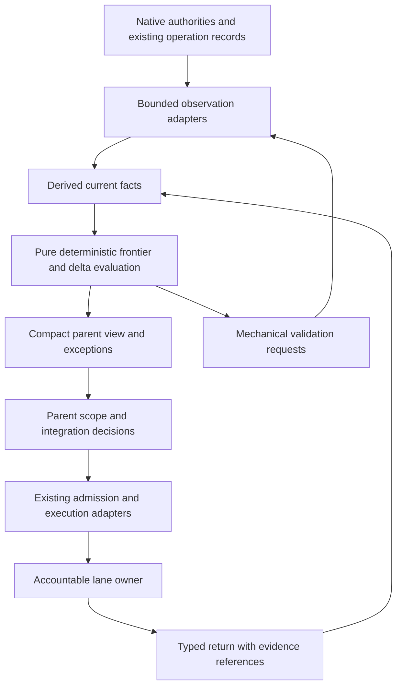

# Programme context efficiency and deterministic coordination

Identity: **V2-CTX-01**. Authored: **2026-10-05**.
Status: **delivered coordination components selected as the user-requested default; full integration and economics pending**.
Owner: `.github` programme-driver maintainer, with Coordination execution and UTEL/LEARN measurement owners.
Parent: [Unified Roadmap, section 9.8](../2026-09-07-154210-fs-gg-unified-development-roadmap.md#98-feature-parts-and-subroadmap-index).

## Outcome and scope

Reduce repeated parent investigation, unnecessary model wakeups and recovery-context growth while
preserving decisions, acceptance quality and original operation identities. Extend the existing
[temporary programme driver](unified-programme-driver.md), its F# helper and existing observation
adapters. Keep detailed investigation with the accountable lane owner; return current facts and explicit
exceptions to the parent. Evaluate total task cost as well as parent context size.

The current design has useful context controls and a deterministic advisory scheduler. It is **not yet
shown to minimize context churn**, and it does not implement an end-to-end deterministic decision and
execution loop. Maximizing the amount delegated is also the wrong objective: a smaller parent can hide
more duplicated work among children. The proposed objective is less redundant context and coordination
per accepted item, with unchanged quality and honest accounting for all participants.

This document proposes future source changes. It changes no skill instructions, model routes, schemas,
resource limits, execution authority, required checks or generated workspace bytes. It neither resumes
active lanes nor replaces their supervisors. No new permanent orchestrator, event journal, memory
service, vector database or per-lane manager is selected. Adoption remains bounded to the temporary
programme driver unless a later consumer is explicitly selected.

## User-selected default, 2026-10-05

The user explicitly selected the improved `$work-programme` workflow as the default. The skill now
uses delivered typed owner returns and compact delta views, bounded evidence retrieval, mechanical
reuse advice and bounded hosted-check watchers for applicable new work. Existing prose-only attempts
retain their identities and evidence; new packet-bound continuations establish truthful typed returns.
Missing bases resynchronize without releasing unknown reservations or renewing source timestamps.

This instruction supersedes the proposal's earlier default/adoption deferral for these delivered
components. It does not claim completion of .1 or .4–.6, an end-to-end deterministic executor, measured
savings, new process containment or installed consumer qualification. Resource and native acceptance
contracts remain in force. Continue measurement and recovery validation during ordinary work; roll
back the affected coordination component if it loses obligations, lineage or effect correspondence.

## What exists and what remains unproved

The audit inspected `.github` main at
[`2859e8b2a8f0683b4947765a0ef23f863090bfa2`](https://github.com/FS-GG/.github/tree/2859e8b2a8f0683b4947765a0ef23f863090bfa2).
The source links below pin that observation. This is a source/design review, not a live census of
workers, a rerun of the acceptance suite or a token-cost experiment.

| Surface | Existing behavior | Gap and consequence |
|---|---|---|
| [Skill](https://github.com/FS-GG/.github/blob/2859e8b2a8f0683b4947765a0ef23f863090bfa2/.agents/skills/work-programme/SKILL.md) | Parent owns scope, capacity and integration; owners retain investigation. New workers receive explicit routes and no inherited conversation; normal repairs reuse the owner. Returns target 150–300 words. | These are instructions to the model. The helper cannot establish that the parent actually avoids duplicate investigation, or that workers received all applicable obligations. |
| [Frontier function](https://github.com/FS-GG/.github/blob/2859e8b2a8f0683b4947765a0ef23f863090bfa2/.agents/skills/work-programme/scripts/programme.fsx#L109) | Given explicit time and snapshot, sorts by priority and ID; checks freshness, dependency boundary, retained owners, PR limits, capacity and touch-set conflicts. Produces advisory actions. | Observations, priority and scalar capacity arrive from callers. It neither collects source facts nor performs admission, dispatch, review or effect settlement. CLI invocations obtain current time, so replay needs the same time input; identical files run later need not yield identical freshness decisions. |
| [Packet builder](https://github.com/FS-GG/.github/blob/2859e8b2a8f0683b4947765a0ef23f863090bfa2/.agents/skills/work-programme/scripts/programme.fsx#L155) | Hash-pinned references, mandatory whole instructions, optional excerpts, explicit omissions, maximum 256 KiB. | Byte bounds do not measure tokens, relevance or subsequent retrieval. Completeness is relative to the caller's mandatory list; an omitted applicable instruction cannot be discovered from that list alone. |
| [Artifact verifier](https://github.com/FS-GG/.github/blob/2859e8b2a8f0683b4947765a0ef23f863090bfa2/.agents/skills/work-programme/scripts/programme.fsx#L190) | Streams declared files, checks bytes/hashes and rejects linked paths. | Equality does not prove authenticity, complete evidence population, semantic acceptance, cleanup or current permission. Adding a generic success flag would erase essential distinctions. |
| [Measurements and report](https://github.com/FS-GG/.github/blob/2859e8b2a8f0683b4947765a0ef23f863090bfa2/.agents/skills/work-programme/scripts/programme.fsx#L243) | Retains helper inputs/results and counts helper bytes, durations and failures. Reports native tokens as unknown and compactions as not observed. | This is not parent prompt accounting or whole-family cost. It excludes many reads, messages, model turns and worker histories. Fewer helper bytes cannot establish a cheaper programme. |
| [Acceptance fixtures](https://github.com/FS-GG/.github/blob/2859e8b2a8f0683b4947765a0ef23f863090bfa2/tests/work-programme/acceptance.fsx) | Covers frontier refusals, packet completeness relative to declarations, drift, links, strict JSON and deterministic replay. | Does not demonstrate adapter observation correctness, worker-return semantics, interruption recovery or context savings in real use. |

The driver plan records an entry-point reduction from 21,213 to 8,599 bytes, or 59.5%. That is a
historical static byte comparison, not an observed reduction in tokens, compactions or total cost.
The operational hypotheses to test are repeated evidence reads, hand-assembled snapshots, verbose
returns, redundant reviews and model polling. Their frequency and economic impact are currently
unmeasured by this audit; do not publish inferred counts from an anecdotal conversation.

Earlier work already owns important parts of the solution:

- [Skill context budgets and progressive disclosure](../reports/2026-07-25-223627-skill-context-budget-and-progressive-disclosure-roadmap.md)
  addresses catalog size, complete skill transport and selective reference loading. Preserve those
  mechanisms instead of another round of skill splitting.
- [Coordination churn redesign](../reports/2026-08-14-090508-coordination-churn-redesign-roadmap.md)
  identifies typed complete reads, explicit intent and revisioned inputs. Reuse its boundaries rather
  than parse prose into scheduling authority.
- [LEARN-01](2026-09-12-095059-stable-policy-orchestration-and-statistical-learning.md) owns controlled
  context comparisons and whole-issue economics. The existing [observation contract](../../.agents/skills/work-programme/references/observation.md)
  owns lineage, coverage and telemetry integration. This feature supplies a candidate treatment.
- [V2-PROC-01](2026-10-05-shared-process-supervision.md) owns bounded command execution and containment.
  Shared process mechanics can reduce repeated supervisor investigation, but cannot by themselves
  select context, validate semantic returns or measure token savings.

## Prior art and disposition

Primary sources were reviewed online on 2026-10-05. The application column is a design inference;
results from other tasks and models are not estimates of FS-GG benefit. No dependency was installed or
benchmarked for this analysis.

| Source | Relevant finding or mechanism | Application and limit |
|---|---|---|
| [Anthropic: effective context engineering](https://www.anthropic.com/engineering/effective-context-engineering-for-ai-agents) | Lightweight references, selective retrieval, compaction and specialized contexts address long-running work. | Load exact evidence on demand. Preserve obligations and unresolved facts through compaction; a short summary is not authoritative state. |
| [Anthropic: multi-agent research](https://www.anthropic.com/engineering/multi-agent-research-system) | Independent exploration benefits from clear task boundaries and compact returns, but delegation increases token use and is less suitable for tightly coupled work. | Use lane owners for independent work. Measure all children and coordination; do not transfer research benchmark gains to repository delivery. |
| [Anthropic: building effective agents](https://www.anthropic.com/research/building-effective-agents) | Predictable workflows and open-ended agents suit different kinds of work; complexity needs justification. | Put mechanical routing in deterministic code and semantic investigation with the owner. Keep the current F# implementation before selecting a framework. |
| [LangChain: context engineering](https://www.langchain.com/blog/context-engineering-for-agents) | Separates writing, selecting, compressing and isolating context; evaluation and traces are prerequisites for judging improvements. | Treat these as distinct controls. Offload raw outputs to artifacts before adding model-based summarization. |
| [Temporal architecture](https://github.com/temporalio/temporal/blob/main/docs/architecture/README.md) | Separates deterministic workflow decisions from activities; replay and activity retry have different requirements. | Pure decision replay must issue zero effects. Reconcile ambiguous original effects through existing Execution contracts. Do not add Temporal or a second journal. |
| [Kubernetes controllers](https://kubernetes.io/docs/concepts/architecture/controller/) | Reconciliation observes current state and works toward desired state through bounded control loops. | Keep user intent separate from observations. Reconcile source facts when events are missing; worker messages are hints, not the sole truth source. No Kubernetes dependency follows. |
| [Bazel Skyframe](https://bazel.build/reference/skyframe) | Incremental recomputation depends on declaring every input dependency; hidden reads invalidate cache correctness. | Reuse mechanical evaluations only with a complete input closure and evaluator identity. File hashes cannot substitute for semantic review or live permission. |
| [LangGraph persistence](https://docs.langchain.com/oss/python/langgraph/persistence) | Distinguishes thread checkpoints from cross-thread stores. | Separate bounded current session state from retained evidence and project knowledge. Reuse existing storage; a new memory database is unnecessary for the first pilot. |
| [Liu et al., Lost in the Middle](https://arxiv.org/abs/2307.03172) | Evaluated models showed sensitivity to the position of relevant information in long contexts. | Test obligation recall and exception handling, not merely context length. These older experiments do not quantify current routed models. |
| [Cemri et al., Why Do Multi-Agent LLM Systems Fail?](https://arxiv.org/abs/2503.13657) | Categorizes failures involving design, inter-agent alignment, verification and termination. | Include stale handoffs, missing constraints and false completion in negative controls. A taxonomy motivates fixtures, not a local failure-rate claim. |

## Proposed architecture

Keep one advisory decision core and the existing effect adapters. Add machine-readable observation and
return projections where repeated manual assembly is demonstrated. Proposed record names below describe
semantics; milestone .2 chooses the versioned contract and migration after checking existing types.

### Current facts and replay

Retain a bounded current view per session, with the complete active-reservation inventory and
individually timestamped facts. Large immutable evidence stays in existing private or hosted artifact
storage. Existing journals retain effect history. The view is a disposable cache: deleting it must not
lose authority, release an active reservation or imply a new attempt.

A proposed observation envelope carries source identity/revision, observation time, completeness,
provenance, affected lane, original attempt, candidate/operation identity and the typed fact. Keep
`missing`, `unreadable`, `partial`, `pending`, `failed` and `succeeded` distinct. Do not renew source
freshness when copying a cache. A poll heartbeat may prove an observer is alive; it does not make an
unchanged source fact newer. Complete absence requires the source's complete-read contract.

The pure evaluator consumes facts, explicit evaluation time, user-scope revision and policy/evaluator
identity. Stable ordering resolves independent inputs; source revisions order updates within their
own domain. There is no invented total order across unrelated providers. Duplicate observations are
idempotent; older revisions cannot overwrite newer ones; incomparable conflicting observations produce
an explicit reconciliation action. Changed user scope invalidates affected suggestions immediately.

Retain replay inputs, including evaluation time, so a reproduced decision has the same freshness
meaning. Replay emits suggested actions only. Native adapters recheck current admission before effects;
material drift rejects the stale suggestion and refreshes facts. A suggested-action identity supports
deduplication, but is never an execution grant or an exactly-once guarantee. Ambiguous outcomes preserve
the original operation and reconcile before retry; expiry or reload does not grant new time or budget.

### Delta views and bounded returns

The default parent view contains changed lane facts, newly actionable work, blocked decisions, invalidated
evaluations and a compact complete active inventory. It names its base/current revisions and observation
coverage. Unchanged logs, successful hash rows and closed-lane history stay behind artifact references.
A missing base revision causes bounded resynchronization, not application of an ungrounded delta.

A lane return should carry:

| Field group | Meaning |
|---|---|
| Identity | Campaign, feature/item, owner, original/current attempt and candidate/operation; reuse existing lineage fields |
| Revision | Return revision, superseded revision, input packet digest and actual source revisions consumed |
| Outcome | Established boundary, pending work and unknowns; source, publication, installed and native results remain separate |
| Evidence | Typed evidence references, immutable digest/revision, scope and producing evaluator where applicable |
| Exception | Concrete decision requested, affected obligations and alternatives; explicit none when no decision is needed |
| Continuation | Next bounded action, retained ownership and stopping condition; acknowledgment and terminal completion are distinct |

Keep the existing short narrative target alongside these fields. Bound machine payload and narrative
separately; preserve overflow as a retrievable artifact and surface its existence. A malformed or
incomplete return is not success. Ask the same owner to repair it before launching a replacement
investigation. Late returns from superseded owners remain historical evidence and cannot close the
current candidate. Conflicting valid returns require reconciliation, not whichever arrived last.

This contract reduces routine parent rereads; it does not ban inspection. A parent expands evidence for
an identified inconsistency, an architectural join, an explicit user request or a required root-owned
review. Record the reason using existing observation fields where possible, so repeated expansion can
be measured without adding a separate review ledger.

### Mechanical evaluation and semantic review

Separate three responsibilities:

1. **Deterministic code:** parsing, declared population checks, hashes, lineage/revision joins, freshness,
   dependency boundaries, duplicate suppression and rendering. Return typed failures and references.
2. **Accountable owner:** investigate source, interpret tests, explain correctness and repair the item.
   A domain-specific validator may check structured evidence only within its established contract.
3. **Parent or required authority:** resolve scope, competing claims, cross-lane joins and exceptional
   decisions. Preserve existing independent review and operation acceptance when required.

Cache only evaluations with a declared complete input closure: evidence identities, schema/evaluator
version, relevant source/configuration, acceptance profile and applicable policy identity. Changes
invalidate the affected evaluations and their dependents. Time-sensitive facts expire independently.
If the dependency closure is unknown, recompute or request the missing evidence. A sampled audit cannot
replace a required check. Reuse follows [ADR-0084](../adr/0084-semantic-reuse-never-cancels-coherent-validation.md);
coherent validation and later disputes retain their existing meanings.

An evidence hash proves equality to an expected value only when that expectation is itself trustworthy.
A successful mechanical report cannot mint semantic acceptance, signature authenticity, cleanup or
permission. Historical semantic findings may be referenced with their exact scope; the cache must not
silently promote them to acceptance of a changed candidate.

### Context selection and delegation

Build task packets from the actual instruction hierarchy, explicit task scope and acceptance obligations.
Make instruction discovery visible to the packet caller; do not claim the current declared mandatory
list proves universal completeness. Include whole applicable instructions and a small current-state
summary, then references to pinned source/evidence. Keep instructions and untrusted data distinct.
Instructions embedded in logs, web pages or worker artifacts cannot override the governing packet.

Use bounded retrieval by artifact identity and section/range. Verify identity before returning an
excerpt; missing, changed or inaccessible artifacts produce explicit failure. Sanitize public output
without changing retained private evidence. Bound raw output before model exposure and return a handle
plus a useful summary. Never silently truncate acceptance-relevant findings. A cache permission check
must still apply when a later worker requests an artifact.

New independent owners use fresh contexts with explicit packets. Reuse an owner for normal repairs to
avoid reconstructing source knowledge; rotate only at a meaningful boundary or a demonstrated context
problem, with a compact checkpoint and current-source validation. Context rotation does not create a new
execution attempt or renew authority. Where the runtime cannot control inherited history or compaction,
record the capability gap; do not pretend a packet erased history already present.

Choose delegation when work is sufficiently independent and has a clear return contract. Prefer one
owner for tightly coupled changes; no critic or manager per lane by default. Worker count is bounded by
host slots, native resources, repository touch-sets and CI capacity through existing admission. Include
packet construction, worker startup, review and retries in the cost decision. A single-owner route uses
the same evidence boundaries when subagents are unavailable or prohibited. No runtime prohibition is
overridden by this design.

### Waiting, recovery and user updates

Coalesce notifications about the same observed revision. Existing bounded watchers emit material
transitions, observation failure or a due deadline; they do not wake a model for every CI tick. An
unchanged system may still need a freshness refresh or a user-requested status update. Preserve those
separate reasons for waking. Use backoff and a bounded deadline rather than an indefinitely running
service or polling agent. External events are hints; authoritative reconciliation repairs missed events.

A restart reads current user scope, active owners/reservations, unresolved effects, artifact references
and the latest factual view. It refreshes affected native facts before action. Closed history remains
retrievable without rebuilding the full conversation. Test missing checkpoints and stale references;
a summary alone must never establish completion or permission.

Generate scheduled user updates from established completion events and current blockers: completed in
the requested recent windows, work in progress, current problems and user-only dependencies. Deduplicate
by item and accepted boundary, retain timestamps, and state coverage gaps. Source merge and native
qualification may be different events; do not count the same boundary again after restart. Status
cadence follows the user's active request, not a hard-coded new programme policy.

## Measurement and experiment

Instrument the existing observation path before claiming benefit. Join parent, workers, reviewers,
retrieval, repairs and retries to the same original item. Report covered and uncovered activity; absent
usage is unknown, not zero. Do not infer native tokens or compactions from bytes, elapsed time or tool
count. The helper remains useful as a byte/duration proxy with that narrower label.

| Metric | Definition and interpretation |
|---|---|
| Parent context | Native input/output usage per decision and per item where exposed; report cached/uncached input separately. Prompt caching can reduce billed cost without reducing context length. |
| Duplicate retrieval | Repeated artifact-digest and range exposure within one owner/session, measured as repeated covered bytes. Distinguish justified refresh/review from unexplained rereads; this is not a token estimate. |
| Coordination work | Parent turns without new actionable facts, follow-ups, packet assembly, review and reconciliation cost; identify the work rather than classifying every parent turn as overhead. |
| Whole-family economics | Total observed usage and supported cost attribution for all participants, including failed attempts and abandoned work; accepted-item denominator plus failed/stopped cohort totals. No survivor-only savings. |
| Quality and progress | Acceptance failures, missed constraints, false completion, dispute/rework rate and completed scope under unchanged checks. |
| Latency and recovery | End-to-end item duration, time from actionable observation to response, and recovery reads/turns; separate CI/resource wait from model work. |
| Compaction | Native observed events only, with coverage. When unavailable, report not observed, not zero. |

First use retained, sanitized fixtures for replay and an offline pilot. Then, when an existing LEARN
window is admitted, compare the current driver against one fixed treatment. Keep task population,
model/effort, acceptance obligations and resource constraints fixed; record unavoidable differences.
Randomize or use a declared matched design through LEARN, avoid cross-arm memory contamination, and
predeclare sample size, analysis, practical benefit and non-inferiority margins before observing results.
Do not treat repeated turns of one item as independent samples.

A candidate pilot target is **at least 30% less unexplained duplicate parent retrieval**, with no
increase in whole-family cost beyond a predeclared margin and no material loss of quality or response
latency. This is a proposed target, not a measured result or an active gate. Baseline findings may justify
a different declared target before treatment begins. A small smoke sample establishes feasibility only;
it cannot prove statistical benefit. Existing overhead rules remain in force; this plan adds no new
mandatory measurement service. If coverage is inadequate, publish an inconclusive result and retain
only independently justified correctness improvements.

## Implementation roadmap and parallelism

The bounded .1–.3 source window below is locally tested; milestone closure and operational adoption
remain separate. These are bounded extensions of the existing driver,
not a second rollout programme. Detail the next window when assigned; later rows define outcomes and
acceptance, not pre-authorized operation launches.

| Milestone | Owner and dependency | Deliverable and exit |
|---|---|---|
| **V2-CTX-01.1 — Baseline and bounded pilot selection** | `.github` driver owner with UTEL measurement owner; ready independently of LEARN container qualification and V2-PROC implementation | Inventory actual repeated reads, return failures and waits in an authorized observation window; identify telemetry coverage. Retain sanitized replay cases, exact baseline and one next treatment. Exit: reproducible byte/turn accounting with explicit unknown native usage and an agreed comparison population. |
| **.2 — Typed observations, returns and pure deltas** | `.github` helper owner; after .1; consult existing Coordination types | Add the smallest compatible contracts and deterministic projection, with time and evaluator identity retained. Exit: replay, duplicate/out-of-order/conflict, source freshness, changed scope and missing-base tests pass; no replay path launches effects. Version readers/writers together or preserve an explicit compatible fallback. |
| **.3 — Bounded evidence views and evaluation reuse** | `.github` packet/evidence owner; after .2 contract | Add selective artifact views, obligation discovery checks and complete-input mechanical reuse. Exit: mandatory omission/overflow, drift, untrusted instructions, hidden dependency, validator change and expired-evidence negative controls pass; semantic/native acceptance remains external. |
| **.4 — Owner and watcher integration** | `.github` driver owner with Coordination adapter owner; parallel with .3 after .2, disjoint files/worktrees | Connect typed returns and material-change notifications behind the existing route. Exit: same-owner repair, superseded return, interrupted dispatch, missed event, bounded wait and compact restart work without duplicate effects or lost reservations. Single-owner fallback is exercised. |
| **.5 — End-to-end comparison** | `.github` integration owner with UTEL/LEARN; after .3 and .4; live comparison additionally needs its admitted LEARN window | Run offline correspondence first, then the selected controlled window. Exit: quality, lineage, total cost, parent churn, latency and coverage are reported together; benefit is supported or explicitly inconclusive. No live comparison is inferred from source tests. |
| **.6 — Bounded adoption and retirement** | `.github` driver owner; after .5 disposition | Adopt only qualified behavior, keep a rollback route and update mirrored skill guidance once. Exit: current driver entry points select the qualified implementation; obsolete glue is removed after retained-attempt compatibility is established. Retire with the programme or transfer only demonstrated reusable contracts to an existing owner. |

The next useful priority is .1 followed by .2: trustworthy observations and compact returns make later
context savings assessable. Source work can proceed while LEARN qualification is blocked. V2-PROC-01
remains a complementary lane; its containment implementation is not a dependency of pure projections or
packet work. A later watcher/process-runner adoption must use its qualified profile and account for
helper/observer processes within actual capacity. Do not replace an active operation's backend.

Shared-file integration uses one integrator. .3 and .4 may proceed concurrently only after agreeing on
.2's contract and reserving disjoint touch-sets. Keep one current PR per dependency chain and existing
repository admission limits. Completed historical V2 work gains no retroactive dependency on this plan.

### Bounded source window, 2026-10-05

The [.1 baseline fixture](../../tests/work-programme/context-baseline/README.md) selects five retained
helper operations: three packet builds, a refused frontier and its repaired evaluation. Reproducible
artifact accounting covers39,546 input bytes,4,666 output bytes and267,542 packet bytes. Repeated
packet construction across owners is not actual parent reread evidence. Model turns, native usage,
compactions, waits, return failures and whole-family economics remain unknown or unobserved; this
population is an offline smoke comparison only, with economic conclusions inconclusive. The original
.1 measurement exit is not claimed complete.

The additive [.2 delta contract](../../.agents/skills/work-programme/references/adapter.md#additive-offline-delta-input)
retains legacy commands and separate boundary statuses, owner/original-attempt/candidate joins,
explicit evaluation time and policy/evaluator/scope identity, and complete active reservations.
Conflicts reconcile, missing bases resynchronize, and acknowledgment cannot mint completion.
[PR #4235](https://github.com/FS-GG/.github/pull/4235) delivered the bounded .1/.2 source window.
Its combined entry point passed31 legacy,35 delta and10 Python baseline controls; two synthetic CLI
runs retained exact inputs and reproduced the expected result. This establishes source/CLI behavior,
not the original .1 whole-family measurement exit or operational adoption.

The additive [.3 evidence-view/reuse contract](../../.agents/skills/work-programme/references/adapter.md#additive-bounded-evidence-view)
verifies a complete artifact's raw identity before bounded excerpts, preserves whole mandatory
instructions, and returns typed refusals without truncation. The shared reader consumes at most the
limit plus one overflow-detection byte during growth. Pure reuse advice requires the caller-declared
complete input population, pinned mechanical receipt, policy/profile/evaluator/source-config identity,
current access and independently fresh facts/receipt. It cannot reuse semantic/native acceptance or
authenticate a caller's pin. Root source qualification passed44 focused view/reuse controls and the
full120-case combined suite (31 legacy,35 delta,44 view/reuse,10 baseline); the initial compile failure
remains retained separately. [PR #4237](https://github.com/FS-GG/.github/pull/4237) delivered this source
with hosted checks and two actual CLI checks: whole-instruction evidence correspondence and
mechanical-only reuse advice. This .3 window is source qualification only. Owner/watcher integration,
live economics and operational adoption remain pending; default skill instructions are unchanged
and .4–.6 remain open.

The bounded .4 watcher slice extends the existing [delivery tool](../../tools/routine-delivery.py)
with opt-in `--watch-checks --watch-seconds N` (1–600 seconds). It checks the expected PR head before
and after each native check read, bounds direct query time and combined output during acquisition,
and emits initial/material changes, terminal state, observation failure or deadline. Unchanged polling
and unrelated PR update timestamps do not emit another revision. The route branches before telemetry
discovery and rejects `--apply`; delivery still requires its fresh canonical checks. It owns only its
direct query children and makes no descendant-containment claim.

All67 focused delivery tests passed, including deadline, cancellation, overflow, changed-head and
unchanged-output controls. An actual read-only invocation against merged PR #4237 made three native
queries and returned one terminal record covering57 checks, with readiness unevaluated and no apply
authority. This proves that terminal adapter path; it is not a measured context saving. Full .4 remains
open: historical prose dispatches lack the original packet/revision bindings required for truthful typed
returns, and interrupted dispatch, missed-event recovery and complete reservation reconstruction still
need an actual integrated window. No missing identity is reconstructed as fact.

## Validation, risks and rollback

Extend the existing focused F# suite and adapter fixtures rather than inventing a broad new gate.
Offline tests can verify the following without launching real workloads:

| Risk | Required negative control or recovery check |
|---|---|
| Compact state hides an active owner or late failure | Reconstruct the complete reserved set; preserve unknown effects and let a later dispute invalidate affected suggestions |
| Old evidence becomes current by copying or replay | Preserve source timestamps, source revisions and original attempt; advancing evaluation time expires affected decisions |
| Cached review ignores an input | Change policy, profile, validator, source or a declared transitive input independently; each invalidates its dependent result |
| A return falsely claims completion | Reject missing boundary/evidence, distinguish acknowledgment, and check authoritative closure instead of trusting prose |
| Compression loses a stopping rule | Inject obligations at varied locations and verify packet completeness, overflow refusal and recovery recall |
| Notifications are repeated, lost or reordered | Deduplicate known revisions; reconcile missing events; refuse conflicting state; wake for actual deadlines |
| Context offload increases cost or delays response | Include all descendants and repair work; compare quality and actionable-event latency as well as parent bytes |
| Observation or watchers interfere with qualification | Account for their process/resource use; keep pure tests independent of live workloads and reuse existing admission |
| Framework growth exceeds the benefit | Start in the existing helper; require a measured gap before adding a dependency, service or further abstraction |

Before adoption, exercise a bounded real route with normal admission, interruptions and fresh native
readback. Source tests establish source behavior only. Do not rerun native workloads solely to manufacture
context metrics or reinterpret past failures as new success.

Rollback selects the previously qualified driver for future decisions, drains or reconciles current
owners under their original identities, and retains evidence and failed results. Stop the treatment
for lost obligations, false completion, duplicate effects or unresolved lineage. A missing observer
alone is an economic-evidence gap under the existing advisory contract, not permission to discard an
otherwise valid native delivery or claim savings.

## Workspace impact and completion

This plan changes no fresh or retained workspace. The temporary repository-owned driver does not need
package publication merely to land its local source improvements. If reusable contracts later move into
Coordination or distributed skill tooling, that work separately owns source compatibility, publication,
pinned installation and selected receiver qualification. No installed consumer inherits acceptance from
this document or from a producer merge.

Design delivery means this proposal and its roadmap joins are merged. Source completion means the
selected .2–.4 implementation and tests are accepted. Operational adoption requires .5–.6's disposition;
measured context or cost benefit requires adequate observed evidence. Each claim keeps its own boundary.
