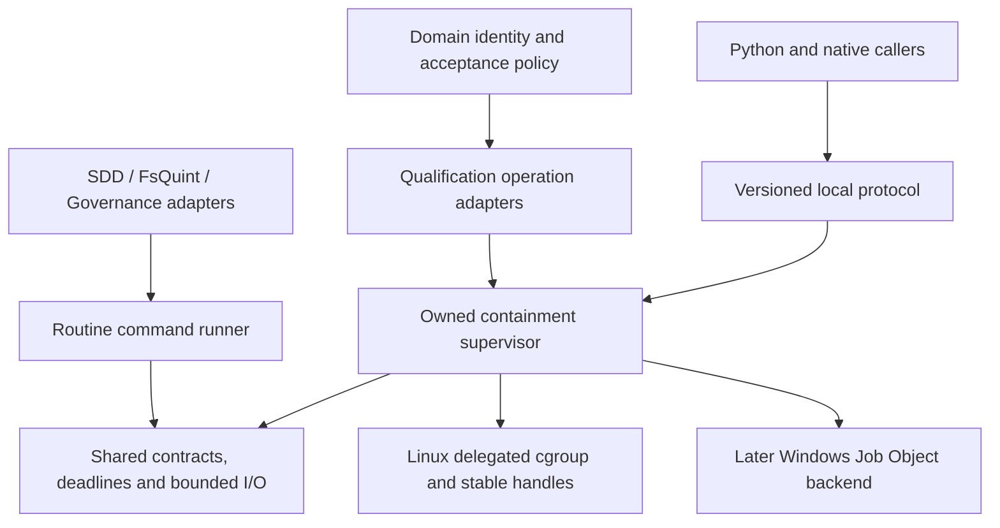

# Shared process execution and supervision

Identity: **V2-PROC-01**. Authored: **2026-10-05**.
Status: **design and implementation plan; implementation, dependency selection and adoption open**.
Owner: Coordination execution maintainer, with `.github` programme integration and named consumer owners.
Parent: [Unified Roadmap, section 9.8](../2026-09-07-154210-fs-gg-unified-development-roadmap.md#98-feature-parts-and-subroadmap-index).

## Outcome and scope

Provide one reusable implementation of bounded command execution and qualified workload supervision.
Replace independently maintained launch, stream, deadline and cleanup code where equivalent behavior
has been demonstrated. Preserve the stronger ownership and evidence requirements of qualification
operations without requiring every routine command to use a qualification sandbox.

This plan selects development of the shared capability. It does not select a third-party dependency,
change an accepted execution profile, grant operating privileges, raise resource limits, install a
service, or establish a native qualification result. Existing accepted source and operations retain
their original scope. The current task delivers this design and its roadmap joins, not its implementation.

The first consumers are SDD's bounded test command runner and FsQuint's tool runner. A separate Linux
containment pilot follows in Coordination's qualification tooling. Governance, LEARN, BAR, SC2 and
Rendering adopt only through their own reviewed source and native acceptance windows. Existing work
can finish under its current qualified implementation; this feature is not a retroactive prerequisite
for completed V2 milestones or an instruction to replace supervisors during active operations.

## Existing code and demonstrated need

The following source revisions were inspected during research. They are observation pins, not claims
about every active branch or evidence that a replacement has been qualified.

| Existing owner | Observed behavior | Extraction opportunity |
|---|---|---|
| [SDD TestShared at 4f35ef88](https://github.com/FS-GG/FS.GG.SDD/blob/4f35ef88e7254937f9c3d85d9506ff5484d112ac/tests/Shared/TestShared.fs) | Concurrent stdout/stderr reads, execution timeout, a separate pipe-drain grace, typed held-pipe failure and best-effort tree termination | Common bounded I/O and lifecycle result; preserve the distinction between a child timeout and pipes held after its exit |
| [FsQuint Tooling at fa1dc39e](https://github.com/FS-GG/FsQuint/blob/fa1dc39e61e5e1d83a44d0fbf0b7ab59c8a45381/src/FsQuint.Tooling/Tooling.fs) | Cancellation, executable hash checks and shared output accounting; some cleanup paths await exit without a separate bound | Shared execution mechanics, keeping Quint version, identity and result interpretation in the adapter |
| [Governance GateExecution at 09a20140](https://github.com/FS-GG/FS.GG.Governance/blob/09a20140c2a6cf0694b4a14ce896abf8c4674234/src/FS.GG.Governance.GateExecution/Interpreter.fs) | Own command/environment construction, concurrent capture, timing and failure representation | Adapt a common runner behind the existing execution port; preserve public command records and failure meanings |
| [Coordination custody at 8861ef86](https://github.com/FS-GG/FS.GG.Coordination/blob/8861ef868805346776b67155676d8ccee2b7d260/src/FS.GG.Coordination.Orchestration.Execution/CustodyBootstrap.fs) | Stable process leases, sealed bootstrap resources and a specific no-process-descendants profile | Reuse qualified primitives and preserve their limited profile; do not reinterpret them as general descendant containment |
| [Coordination execution core](https://github.com/FS-GG/FS.GG.Coordination/blob/8861ef868805346776b67155676d8ccee2b7d260/src/FS.GG.Coordination.Orchestration.Execution/README.md) | Durable intent before launch; recovery reconciles the original attempt, deadline and limits | Reuse its operation identity and settlement boundaries rather than create another journal or orchestrator |

Recent qualification work also repeatedly encounters processes exiting between procfs reads, children
reparenting, output writers surviving the leader, and cleanup observations arriving after cancellation.
These motivate shared fixtures and typed incomplete observations. Historical failures do not establish
that any new backend would have passed; original evidence remains immutable.

## Prior art and dependency decisions

Research was read-only: primary documentation, release metadata and selected source bodies were
inspected. No candidate library was installed or benchmarked. Package versions and source revisions
below identify research inputs; the implementation evaluation must join actual package bytes to the
selected source and runtime before adoption.

| Candidate | Relevant capability | Planned disposition |
|---|---|---|
| [CliWrap 3.10.5](https://github.com/Tyrrrz/CliWrap/releases/tag/3.10.5) | Immutable command description, concurrent streaming, pipelines, graceful/forceful cancellation | Leading candidate behind the ordinary runner. Its [execution implementation](https://github.com/Tyrrrz/CliWrap/blob/3.10.5/CliWrap/Command.Execution.cs) deliberately waits for process exit without a cancellable wait; it cannot alone prove our cleanup deadline. Evaluate bounded custom sinks, output failure, inherited writers and cancellation behavior. |
| [Meziantou cgroup v2](https://github.com/meziantou/Meziantou.Framework/blob/db940dd4d4f05435c571ae01a2322a9aa505e0bd/src/Meziantou.Framework.Unix.ControlGroups/readme.md), source version 2.0.2 | Controller configuration, resource measurements, freeze and subtree kill | Leading focused Linux mechanism candidate. The [implementation](https://github.com/meziantou/Meziantou.Framework/blob/db940dd4d4f05435c571ae01a2322a9aa505e0bd/src/Meziantou.Framework.Unix.ControlGroups/CGroup2.cs) uses PID migration and ordinary path-based file reads; qualified launch ordering, bounded reads, ownership and retirement remain integration work. |
| [ProcessKit v2.12.0](https://github.com/ZelAnton/ProcessKit-fSharp/tree/v2.12.0) | F# process groups, platform containment, resource limits, streaming and test seams | Evaluate against the same contract before adding equivalent custom mechanisms. Its [platform contract](https://github.com/ZelAnton/ProcessKit-fSharp/blob/v2.12.0/docs/platform-support.md) documents Linux process-group defaults, cgroups when aggregate limits are requested, setsid escape on the weaker mechanism and direct-child-only Linux parent-death handling. Repository created June 2026; maturity and maintenance need assessment. |
| [Asmichi.ChildProcess](https://github.com/asmichi/ChildProcess) | Native process creation and explicit handle/environment behavior | Secondary candidate if the first options cannot supply the required launch seam; include native helper distribution and architecture support in cost. |
| [MedallionShell](https://github.com/madelson/MedallionShell), [SimpleExec](https://github.com/adamralph/simple-exec), [ProcessX](https://github.com/Cysharp/ProcessX), [FAKE](https://fake.build/reference/fake-core-createprocess.html) | Routine command execution, streams and cancellation | Reference alternatives. Reuse existing FAKE integrations when appropriate; avoid layering multiple interchangeable wrappers or introducing a build framework solely for custody. |
| [Vanara](https://github.com/dahall/Vanara), [CsWin32](https://github.com/microsoft/CsWin32) | Windows interop | Consider for a later Job Object backend; select one strategy and keep platform interop out of portable contracts. |
| [Testcontainers](https://dotnet.testcontainers.org/) | Container lifecycle and [independent resource cleanup](https://dotnet.testcontainers.org/api/resource_reaper/) | Useful for compatible integration-test environments. Its Docker-compatible API requirement does not establish a fit for the current CLI-based Podman custody route. Any API service must remain inside the allowed container boundary. |
| [.NET 11 process APIs](https://devblogs.microsoft.com/dotnet/process-api-improvements-in-dotnet-11/) | Coordinated capture, handle inheritance, process handles and parent-exit behavior | Future backend simplification. Preserve the current pinned .NET 10 runtime; no runtime upgrade is part of this design. Linux parent-death behavior is not Windows whole-job cleanup. |

The evaluation produces a decision for each layer: adopt unchanged, adapt through public APIs,
contribute a bounded upstream change, or retain the existing qualified implementation. A custom backend
requires a demonstrated contract gap, not a preference for local ownership. Inspect licenses,
transitive/native dependencies, supported platforms, servicing activity and reproducibility. Record
unverified guarantees explicitly. Avoid a fork unless its maintenance and security cost are justified.

Relevant system designs provide the architectural baseline:

- [BenchExec](https://github.com/sosy-lab/benchexec) combines workload-wide cgroup accounting with
  isolation and reproducible measurements. Use its approach when evaluating benchmark interference
  and aggregate resource claims; a new process runner alone does not validate SVG speedups.
- [systemd delegation](https://systemd.io/CGROUP_DELEGATION/) separates cgroup owners and delegated
  subtrees. Follow its single-writer principle; do not manipulate another manager's hierarchy.
- [BuildXL sandboxing](https://github.com/microsoft/BuildXL/blob/main/Documentation/Specs/Sandboxing.md)
  separates execution, observation and declared-access policy. Reuse that boundary without importing
  an entire build engine.
- [nsjail](https://github.com/google/nsjail) and [isolate](https://github.com/ioi/isolate) are reference
  implementations for namespaces, resource control and restricted execution.
- [Tini](https://github.com/krallin/tini) and [dumb-init](https://github.com/Yelp/dumb-init) illustrate
  signal forwarding and orphan reaping. Reaping, containment and resource enforcement remain distinct.

## Architecture and ownership

Coordination owns the shared source because it already owns execution and custody. Add focused
projects there only after the initial inventory confirms a dependency boundary. Provisional names are
`FS.GG.Execution.Contracts`, `FS.GG.Execution.Processes` and `FS.GG.Execution.Linux`; these are proposed
names, not published packages. Contracts must have no Akka, provider SDK, GitHub, telemetry-store or
product dependency. Existing orchestration code depends downward on the new components.

The contracts describe requested guarantees and observed outcomes. A capability report is advisory;
launch revalidates the necessary capability. Strong containment requests refuse if unavailable. A
routine runner may provide weaker descendant guarantees only when the caller explicitly accepts them;
there is no automatic fallback from a cgroup to a process group under the same profile name.

The native launch boundary remains small where namespace, seccomp, inherited descriptor or pre-exec
work requires it. Do not execute arbitrary managed callbacks between fork and exec. Managed clients
and Python wrappers use a bounded local protocol over inherited descriptors; no host command service,
host socket, broad filesystem mount or remote shell service is introduced. Whether the supervisor
itself is managed or native is settled by the pilot's bootstrap and accounting requirements. A managed
supervisor consumes its own CLR/task budget and cannot qualify a native-only bootstrap profile.

## Proposed contracts

The shapes below describe semantics, not an approved public API or executable schema. Final names and
F# signatures are established in milestone .2 and reviewed against existing Execution contracts.

| Contract | Required meaning |
|---|---|
| Command specification | Literal executable, ordered argument vector, working directory, explicit inherited/allowlisted/replaced environment mode, input source and output policy; shell execution is an explicit separate adapter |
| Operation identity | Existing attempt and generation, unique launch ordinal and source/profile binding; a PID alone is never an operation identity |
| Budget | One monotonic total deadline including reserved cleanup, phase limits clipped to it, and byte/resource bounds; nested calls receive remaining budget |
| Required capabilities | Explicit containment, process identity, namespace, accounting and cleanup requirements; requested and actually obtained capabilities are both retained |
| Process lease | Owned stable handle plus generation and scope identity; disposal and signaling never acquire authority over an unrelated numeric PID |
| Execution result | Launch disposition, exit/signal if observed, cancellation/timeout cause, output completion, resource violations and cleanup disposition as separate fields |
| Observation | Timestamp, scope, completeness and provenance; unavailable, pending, absent, malformed and limit-exceeded are distinct states |
| Cleanup result | Requested actions, observed leader exit, workload-empty state, reaped children and unresolved identities; `Complete`, `Incomplete` or `Unknown` with bounded diagnostics |

Cancellation requested is not termination observed. A nonzero command exit is not a launch failure.
A successful leader exit does not imply EOF or clean descendants. Timeout, output overflow and cleanup
failure cannot be flattened into a synthetic exit code that a caller might treat as ordinary success.
Compatibility adapters may preserve old external representations while retaining the richer result.

### Deadline and output semantics

Use a monotonic clock for live budgets. Wall-clock time is metadata and may validate external expiry;
it cannot renew or extend an execution budget. A persisted monotonic value is meaningful only in its
original clock domain: reconnect/recovery cannot reinterpret it on another host or boot. Reuse the
existing operation's bounded recovery contract or report unavailable; never grant fresh time by reload.

Read stdout and stderr concurrently as bytes. Charge the combined byte count before appending to
retained buffers or files, including diagnostics and protocol frames. Bound frame length, retained
prefix/tail and incomplete text lines; incremental decoding must not bypass byte accounting. A sink
failure initiates the same bounded retirement path. Redaction happens before public diagnostics, while
private retained evidence follows existing custody rules. Secrets and full environments are never
included by default.

One work deadline and one cleanup reserve cover version probes, workload execution, pipe draining,
termination and final observation. Callers may expose their historical work-plus-grace API through an
adapter, but record the actual total. A cancellation-aware task does not prove that a library's internal
wait is bounded. If the OS cannot complete termination within the bound, return incomplete cleanup and
retain ownership with the supervisor; never detach an untracked cleanup task and report success.

### Limits and their units

| Limit or measurement | Meaning and enforcement |
|---|---|
| `MaxKernelTasks` | Kernel thread/task bound, backed by `pids.max` on Linux; includes runtime and helper threads |
| `MaxOwnedProcesses` | Distinct owned process generations; separate from thread count; state whether enforced by launch admission or sampled supervision |
| `MaxClrProcesses` | Explicitly defined CLR host/runtime classification; a semantic budget, not a cgroup controller |
| CPU budget | Aggregate quota and optional affinity are separate settings; one CPU's quota does not imply pinning to one core |
| Memory budget | Kernel aggregate memory accounting for a contained workload; sampled RSS is supplementary and not equivalent to `memory.max` |
| Output budget | Combined retained/emitted workload and supervisor evidence bytes, with explicit stream/frame limits |

The user-selected qualification example is ten CLR processes, 32 owned processes and 512 kernel tasks
inside one CPU / 2 GiB outer bounds. These values remain profile inputs, not library defaults; narrower
role limits remain valid. Include helpers, supervisor overhead and infrastructure reservations once,
without double-counting shared infrastructure. If ten CLR processes are insufficient, report the
observed demand and failed boundary to the user; do not silently increase the limit.

Linux's [PID controller counts TIDs](https://docs.kernel.org/admin-guide/cgroup-v2.html#pid). A library
property called `MaxProcesses` that writes `pids.max` cannot implement the semantic process limit.
Sampling cannot guarantee that a transient CLR or process peak never occurred. Profiles requiring a
hard semantic cap need a separately qualified launch restriction/reservation mechanism; otherwise
report the cap as observed, with its sampling interval and blind spots. Unclassifiable processes never
count as zero CLR or zero memory.

## Linux containment and lifecycle

Use only a dedicated delegated cgroup-v2 subtree. Verify its filesystem, ownership, effective ancestor
limits and available controllers. Keep the supervisor outside the restricted workload leaf; workloads
must not write aggregate controls, migrate out, or admit unrelated processes. Configure limits before
releasing the target. A spawn-then-migrate sequence is insufficient because children may fork before
migration. Evaluate a fixed reviewed launcher that joins before exec or a supported
[`clone3` placement primitive](https://man7.org/linux/man-pages/man2/clone.2.html); missing required
capabilities refuse rather than fall back to host access.

Use stable process handles for individual signaling and exit observation. Procfs metadata supplies
classification and diagnostics; it does not independently grant ownership. Namespace PID translations,
UID mappings, procfs mount identity and kernel/architecture requirements are part of the backend
profile. Scope filesystem operations to held, validated directories where required; prevent path or
symlink replacement from redirecting control writes. Multiple supervisors cannot own the same subtree.

The lifecycle is `Prepared -> Starting -> Running -> Retiring -> Terminal`. Failure from any state
retains the original cause and enters retirement if an effect may have occurred. Record launch intent
before the effect through the existing owner journal. Ambiguous launch is reconciled against the same
identity; no automatic retry launches a duplicate. Lost caller channels initiate retirement according
to the original lease. A supervisor crash requires an independently qualified outer cleanup owner;
a cgroup alone does not automatically kill its contents when its managing process dies.

Retirement applies the profile's graceful signal, then subtree termination if needed, all within the
original total deadline. Observe the subtree empty and reap owned children through the designated
reaper. `cgroup.kill` submission is not cleanup completion. Kernel populated state excludes zombies,
so empty live membership and completed child reaping are separate evidence. Remove only owned empty
cgroups. Permission loss, stuck kernel tasks or an expired observation window produce incomplete
cleanup; escalation retains the original scope and never signals foreign processes.

### Observation during exit transitions

Separate the owned-generation ledger from the mutable latest observation. Retain bounded provenance
for previously complete owned observations; an incomplete row cannot erase that provenance or replace
fresh classification. During a qualifying transition, allow a finite acquisition episode using one
existing deadline and a fixed sweep count. Scope this behavior to the selected backend and profile.

Pending observations remain unknown. Preserve all positively established violations immediately.
Resolution requires fresh complete classification, a qualified terminal observation, or positive
absence of the exact generation. Unknown, foreign, reused or malformed identities refuse. Never infer
absence from a failed read, combine old rows into a fictitious current census, or reset the acquisition
budget when a second field changes. Final success requires no unresolved pending observation.

Prefer the owned cgroup for workload accounting and retirement. Global CLR census, when a profile
requires it, is a separate read-only capacity observation. It cannot make unrelated processes cleanup
targets. Executable hashes, ELF/PE mappings, JIT double-mapping allowances, Chrome singleton files and
product-specific runtime declarations remain explicit policy adapters; they are not generic exceptions
in the process library.

## Compatibility, evidence and distribution

Reuse existing Execution operation identities, prerequisite admission, source/compiled artifact joins,
journal recovery and receiver acceptance. V2-PROC-01 does not create another scheduler, authority store,
permanent monitoring service or package registry. Routine consumers must not acquire orchestration or
provider dependencies merely to run a command.

A native or Python client protocol needs bounded framing, schema version, operation/generation binding,
monotonically checked request ordinals, peer validation, explicit EOF/channel-loss behavior and no
replay of an acknowledged effect. Unknown versions or malformed frames refuse. Keep the currently
qualified protocol until a separately tested adapter replaces it; changing bootstrap ordinals globally
for a fixture is not an acceptable migration.

Retain source/package/native-helper hashes, runtime and OS profile, actual obtained capabilities,
original deadline, bounded observations, command outcome and independent cleanup evidence. Successful
source tests, published packages, installed consumer behavior and full workload qualification are
separate states. Public reports contain references and sanitized summaries; raw maps, credentials,
private container identifiers and operation grants remain outside public documentation.

Keep the first implementation and conformance fixtures in Coordination. Publish reusable packages only
when two consumers establish the boundary and a versioned dependency is necessary. Native helpers
require architecture-specific immutable artifacts, reproducible source joins and normal release gates.
Additive adapters preserve old entry points first; behavioral tightening is documented and versioned.
Rollback selects an earlier qualified version for a new operation after the current operation retires.
Never swap implementation or replay a consumed effect inside an active attempt.

## Conformance and evaluation

Run every relevant candidate through the same actual OS fixtures as the retained implementation.
Pure state-machine tests supplement native evidence; mocks cannot establish containment or cleanup.
Fixtures run in disposable owned scopes with small limits and an independent cleanup owner. Do not
exercise PID reuse by signaling arbitrary system PIDs; use deterministic identity controls plus
isolated native generation tests.

| Scenario | Required observable result |
|---|---|
| Missing executable, invalid arguments/environment or unavailable capability | Refusal before workload execution; distinct launch/capability result |
| Concurrent stdout/stderr flood, binary output, huge unterminated line, slow/failed sink | No deadlock; byte limits enforced before retention; bounded retirement |
| Leader exits while grandchild holds pipes | Exit and EOF reported separately; no unbounded drain or invented cleanup |
| Immediate fork, double fork, reparenting and `setsid` | Required containment includes descendants from target start; no process-group guarantee substituted |
| Cancellation before spawn, during launch, work and retirement | One launch at most; original failure retained; same total budget |
| Deadline crossed during observation, output publication or cleanup | No renewed budget; incomplete result if retirement cannot be established |
| PID reuse, UID/namespace/topology drift and foreign process | No foreign signaling or quota exemption; typed identity refusal |
| Transient exe disappearance / terminal multithread observation | Finite qualified acquisition; unknown remains explicit; positive violations remain recorded |
| Memory/task cap, compiler thread bursts and nested helpers | Correct aggregate accounting; kernel task limit distinguished from process/CLR budget |
| Workload attempts to change cgroup controls or escape | Denied by the qualified isolation profile; no unrelated admission |
| Caller disconnect, supervisor SIGKILL and interrupted recovery | Outer owner retires the original scope or reports unresolved cleanup; no duplicate launch |
| Removed cgroup, permission failure, malformed controller files | Unavailable/invalid result, never healthy unlimited defaults |
| Repeated runs and rejected starts | No FD, pipe, child, cgroup or background-task growth beyond established baseline |
| Environment secrets and diagnostic failures | No secret leakage; primary failure preserved alongside cleanup/diagnostic failures |

For routine pilots, require outcome compatibility on existing fixtures and verify the newly closed
failure cases. For containment, require independent scope-empty and reaping checks before acceptance.
Every intended semantic guarantee needs an executable negative control that would fail if the guard
were removed. A platform capability may be reported unsupported; it may not be silently weakened.

Measure warm/cold launch latency, cancellation-to-retirement time, supervisor CPU/RSS/task overhead,
output throughput, allocation/FD growth and false refusals under controlled concurrency. Compare the
same workload and profile on the same host with repeated, ordered trials; report spread and limits.
Record setup/maintenance effort and duplicated code retired. No speedup or cost saving is claimed by
this design. Freeze a small representative workload set and an investigation budget before experiments;
stop expansion if adoption cost exceeds demonstrated benefit or the selected guarantees remain unmet.

## Implementation milestones

All milestones are open. The next implementation window is **.1 inventory and bounded evaluation**.
The table is the implementation plan, not a second live task board. Record detailed changes and native
results in the owning repositories and existing issues/PRs when implementation begins.

| Milestone | Owner and narrow touch-set | Dependencies | Exit evidence |
|---|---|---|---|
| **V2-PROC-01.1 Inventory and prior-art evaluation** | Coordination maintainer; read-only consumer inventory and isolated evaluation fixtures under its tests/engineering tree | This design | Classify routine vs contained runners, freeze required guarantees and two consumer cases; pin candidate package/source/runtime; compare CliWrap, Meziantou and ProcessKit against critical lifecycle fixtures; decide reuse/adaptation with explicit gaps and effort bound |
| **.2 Shared contracts and conformance fixtures** | Coordination; focused contract project and test fixtures | .1 | Typed command/budget/capability/result/cleanup contracts, bounded byte sinks, deterministic lifecycle tests and real disposable-process fixtures; map existing Execution identities and avoid dependency cycles |
| **.3 Routine runner and first consumer** | Coordination runner plus SDD TestShared/ChildProcess tests | .2 and routine backend decision | Selected backend passes fixture matrix for its declared weaker/stronger capabilities; SDD adapter preserves start/timeout/held-pipe distinctions and diagnostics; real affected acceptance tests pass; no unbounded buffering or cleanup wait introduced |
| **.4 Linux contained backend** | Coordination Linux backend, reviewed launcher/protocol and containment tests | .2 and Linux backend decision; delegated disposable environment for native checks | Placement before target execution, verified controllers/protection, stable identity, channel-loss cleanup, supervisor-death outer owner and bounded retirement all qualify; unsupported profiles refuse; actual overhead recorded |
| **.5 Second consumer and shared-boundary review** | FsQuint Tooling and tests; Coordination only for demonstrated generic gaps | .3 | Quint-specific policy remains local; bounded cleanup/output behavior passes actual tool fixtures; dependency direction and public signatures remain coherent; two consumer results justify package boundary |
| **.6 Coherent publication and installed pilots** | Coordination publisher; SDD and FsQuint receiver owners | .5; .4 separately for publishing the Linux backend | Normal package/native-helper release checks, immutable distribution joins and downloaded-only consumer tests; source unavailable during installed proof; upgrade and rollback tested; publication alone does not establish receiver adoption |
| **.7 Qualification consumer adoption** | One owning adapter at a time: Coordination/LEARN first, then independently selected BAR, SC2, Rendering and Governance | .4 and installed backend from .6; each consumer's existing admission | Side-by-side evidence on fixed fixtures, then one newly admitted real operation; preserve original receipts, domain policies and limits; remove that consumer's replaced mechanics only after its own acceptance |
| **.8 Consolidation and benefit review** | Coordination and migrated consumer owners | Selected .7 adoptions | Remove obsolete duplicate implementations and temporary adapters; retain conformance suite and servicing owner; report maintenance/runtime impact and remaining exclusions; mark only actually adopted scopes complete |

After .2, routine execution (.3) and Linux containment (.4) can proceed independently. The FsQuint
migration can follow .3 while .4 qualifies; publishing the routine package need not wait for an
unready Linux backend. Native fixture runs share the existing capacity/admission controls, so parallel
source work does not authorize overlapping expensive workloads. Each consumer owns its adapter files;
one Coordination owner integrates common contracts. No consumer widens the core to encode its policy.

Governance adoption is a distinct later adapter change: its command records and required-executable
semantics remain under the existing Governance plan. BAR/SC2 native identities and LEARN container
capabilities are not resolved by merging this plan. Library availability does not supply delegation,
credentials or new host access.

## Workspace impact and completion

No generated workspace, template default, installed tool or running supervisor changes when this
prose lands. The first user-visible change is .3's SDD test tooling after its consumer source lands:
consistent bounded failures and diagnostics through the shared runner. FsQuint changes at .5 source
adoption and .6 installed adoption. Published dependencies reach fresh workspaces only through an
explicit SDD/Templates integration if one is later selected; that integration is not assumed here.
Retained workspaces require a separate pinned dependency/adapter upgrade, preserving local settings.
Local-only workspaces require no GitHub credentials or service enrollment to use ordinary execution.

Feature completion requires the selected packages and native helpers published where applicable,
both initial consumers installed and qualified, the selected containment consumer's real operation
accepted, and replaced duplicate code retired. Unsupported OS profiles and unselected product
migrations remain named exclusions. Final results must distinguish capability delivered, consumer
adopted and measured benefit; a documentation merge or successful library sample establishes none of
those runtime outcomes.
