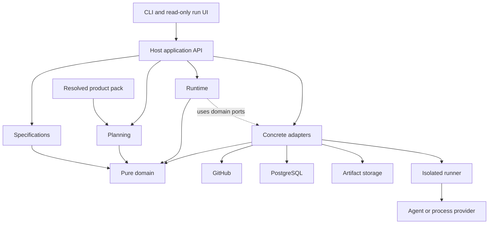

# FS.GG v3: clean platform rewrite design

Status: proposed architecture and future programme, 2026-10-10. Implementation starts only after v2 is complete. This document does not activate work, authorize a cutover, change current policy or declare any proposed capability implemented.

This is a proposal for **version 3 of the development framework**. It is distinct from the [current unified roadmap's third revision](2026-10-07-unified-development-roadmap-v3.md), which organizes existing v2 work.

The recommended design is a dedicated platform monorepo containing a modular control plane, typed-SDD integration, a durable Akka.NET runtime, GitHub and execution adapters, and cohesive product packs. Build a complete replacement with new contracts and storage, then switch once. Preserve the useful behavioral knowledge from v2 without preserving its APIs, command names, schemas or historical process machinery.

Supporting documents:

- [Framework analysis and first draft](fsgg-v3/01-framework-analysis-and-initial-draft.md): inspected revisions, source evidence, responsibility map and limitations.
- [Prior art and research](fsgg-v3/02-prior-art-and-research.md): 28 research entries, experience reports, alternatives and limits of inference.
- [Delivery roadmap](fsgg-v3/03-delivery-roadmap.md): dependencies, parallel workstreams, acceptance scenarios and single-cutover plan.

## 1. Product outcome and scope

The platform turns a development intent into a reviewable, tested change using the accepted project model, project-specific materials and explicitly authorized tools. The normal experience should be: describe the change, let the platform prepare and run the work, inspect the result, and merge under repository policy. The user should not assemble version joins, claim documents or proof receipts by hand.

The rewrite covers the **development platform**: workspace creation, typed specification lifecycle, planning, scheduling, agent/process execution, verification, GitHub delivery, board projection, diagnostics, product materialization and platform publication. Product libraries such as Rendering, Game, Audio and Net remain independently buildable runtime dependencies. Their implementation is not rewritten merely to reorganize the development framework. Their supported project types and development workflows remain in the capability inventory.

The completion-baseline inventory must account for every supported v2 platform capability and classify it as retained, redesigned or intentionally retired. “Not yet inspected” is not a retirement decision. New features beyond that finite scope require an explicit tradeoff against the rewrite's completion, not automatic admission into the programme.

### Fixed constraints

| Constraint | Consequence |
|---|---|
| Start after completed v2 | Use the actual published and installed v2 typed-SDD toolchain as the bootstrap; do not make v3 an excuse to stop v2 early. |
| Complete replacement | Develop v3 separately, qualify it as a whole, and make one production cutover. Internal implementation increments are not incremental production replacement. |
| No backward compatibility | New package/CLI contracts, manifests, database and runtime epoch. No v2 event reader, compatibility facade, old workspace upgrader or historical run import. |
| Optimistic development | Start independent work freely; detect stale bases and conflicts mechanically; reserve serialization for actual shared effects. |
| Little bureaucracy | One change record and PR; derive evidence and projections from execution. No mandatory chain of planning, critic, receipt and closure documents. |
| Preserve correctness | Simplify the user process without deleting effect identity, authorization, native result checks, isolation or proportionate tests. |

## 2. Why this boundary

The source analysis found valuable existing boundaries: pure orchestration decisions, durable PostgreSQL intent, neutral execution providers, typed WorkspaceModel changes and product descriptors. The main structural problem is their composition across repositories, packages, CLI surfaces, generated skill roots and installed-consumer joins. The proposal addresses that composition first.

Experience from [Shopify](https://shopify.engineering/shopify-monolith) supports enforcing dependency boundaries and evaluating change locality; [Segment](https://www.twilio.com/en-us/blog/developers/best-practices/goodbye-microservices) illustrates both the operational benefit of consolidation and the cost in fault isolation. These findings inform the platform boundary; they do not establish a numerical productivity forecast.

Use a proposed repository named `FS.GG.Platform`. Leave organization defaults and organization-level discoverability in `.github`. Keep generic FsQuint functionality independently owned. Product runtime repositories can remain separate. Inside the platform, source-level project references replace producer-to-consumer package publication for normal development. Only genuine external consumers justify public packages.

## 3. Repository, modules and deployment

Illustrative layout, not a scaffolding recipe:

```text
FS.GG.Platform/
  src/
    Domain/                 pure identities, plans, transitions, policy values
    Specifications/         WorkspaceModel and typed-SDD application semantics
    Planning/               pack resolution and pipeline compilation
    Runtime/                Akka scheduling, recovery, admission and supervision
    Adapters/
      PostgreSql/           journal, inbox, outbox, observations and projections
      GitHub/               native facts, commands, PRs, checks and Projects
      Execution/            provider implementations and runner protocol
      Artifacts/            content-addressed storage and publication transports
    Host/                   API, authentication and composition root
    Runner/                 isolated task executor
    Cli/                    human/agent interface, including workspace creation
  packs/                    canonical product materials and conformance cases
  specs/                    accepted typed-SDD modules and concurrency models
  tests/                    module, integration, scenario and fault tests
  eng/                      build graph, release composition, fixture tooling
  docs/                     product documentation and generated API reference
```

Start with roughly one build project per meaningful boundary. The layout is not a quota: do not create an assembly for every record, codec, report format or command. Separate a project when it enforces an important dependency, has an independent consumer, needs incompatible dependencies or crosses a trust boundary. Prefer internal modules otherwise. Use `.fsi` signatures at public F# boundaries and a fast project-reference check to reject forbidden dependencies.



Solid arrows between code modules represent allowed source dependencies; dotted runtime calls use interfaces owned inward. The Host composes concrete adapters. The domain does not reference Akka, PostgreSQL, GitHub, provider SDKs or UI types. Specifications and Planning do not perform network I/O. Pure authorization/rule evaluation belongs inward; credential acquisition and enforcement at the effect boundary belong in adapters.

Deploy one trusted Host and one PostgreSQL instance initially, plus separate runners. The CLI uses the same application semantics for planning and inspection. Local workspace generation and pure validation work without a running scheduler; durable unattended runs require the Host and database. A local development deployment uses the same database semantics as hosted execution. Do not maintain a second SQLite workflow engine for convenience.

Do not start with Akka Cluster, multiple competing Hosts, a message broker, Kubernetes operators or a service mesh. A single Host is an explicit availability tradeoff: recovery can pause execution, but must preserve durable intent. Multi-host availability is a later requirement unless the completed-v2 scope makes it necessary; in that case, include it in the initial capability inventory and qualify failover before cutover.

## 4. Authority and data model

| Information | Authority | Derived views |
|---|---|---|
| Accepted product semantics, source, pack definitions and dependency locks | Protected Git revision | Generated guidance, compiled plans, documentation |
| PR head, checks, merge result, issue state and published GitHub objects | Native GitHub observations | Runtime snapshots, board status, CLI display |
| Work admission, run state, attempts, operation intent, reservations and recovery | PostgreSQL journal and transactional state | Actor memory, run UI, scheduling queues |
| Human priority, explicit hold, requested scope | Configured planning input, including designated Project fields | Admitted runtime commands with actor identity and observation |
| Agent conversation/session state | Execution provider | Diagnostic references; never acceptance or delivery authority |
| Artifact bytes | Content-addressed artifact store | Database metadata binds digest, size, media type, origin and retention |
| Metrics and logs | Telemetry pipeline | Advisory diagnosis; not a source of workflow success |

Use platform identities for `WorkspaceId`, `WorkId`, `RunId`, `PlanId`, `OperationId`, `AttemptId` and `RunnerId`. External bindings hold repository IDs, issue/PR IDs and display URLs. Names and URLs are labels, not durable identity. Each admitted run binds source revision, accepted model revision, resolved pack digest, toolchain digest, policy revision and runtime protocol version.

An operation has stable intent identity and immutable parameters. Attempts are executions or observations of that intent. Reusing an operation ID with different parameter bytes is rejected. A generation or fencing number distinguishes the current owner from stale actors and runners. Time observations and random choices needed for decisions enter as explicit inputs or recorded events so recovery does not reinterpret history.

Events have explicit schema and payload digests. Unknown event versions or corrupted artifacts produce a clear recovery refusal, not best-effort reinterpretation. Starting v3 fresh avoids v2 migration code. It does not remove the need to handle later **v3** upgrades: bind runs to compatible engine/plan versions, drain incompatible runs before deployment, and test every supported v3 schema transition. Do not add speculative support for versions that do not exist.

## 5. Typed-SDD and pipeline compilation

The accepted WorkspaceModel describes product behavior, decisions, repository profile, CI obligations, external contracts and evidence requirements. A proposed change names its exact semantic base. The application computes its disposition and affected obligations; prose that changes no semantics is represented honestly as such.

The conceptual compiler is a pure function:

```text
compile(accepted model, proposed change, resolved pack, policy, observed facts)
    -> validated execution plan | actionable diagnostics
```

This notation is a design contract, not an existing API. The compiler resolves capability names, validates inputs and prerequisites, detects cycles, checks resource and authority requirements, and emits a finite graph. A node states its task kind, inputs, outputs, prerequisites, execution capability, verification obligation, budget, deadline and external-effect classification.

Useful node kinds include inspect, propose, implement, verify, review, deliver and observe. These are not obligatory stages on every change. A documentation edit may need only preparation, focused validation and PR delivery. A publication needs candidate creation, qualification, authorization, publication and native readback. Product packs select obligations; the compiler validates their composition.

Agent tasks can choose how to solve their bounded objective. New dependencies or expanded scope are returned as a plan-change proposal. The runtime creates a new immutable plan revision after checking it; it never edits a running graph invisibly. Completed effects remain attached to their original intent. Replanning can reuse evidence only when its complete input identity still matches.

### Bootstrap without circular trust

Develop v3 using the **completed v2 typed-SDD release**, pinned as an external tool. Keep its accepted model and validation independent of the v3 runtime under development. The inspected v2 signature includes required IssueRef and explicit HumanAcceptance: the bootstrap must honor the actual completed-v2 contract. Tooling can create/link the one required issue automatically and capture a real authorized acceptance from the normal review surface; it cannot invent human approval or silently weaken the validator.

If completed v2 cannot express a low-friction ordinary path, surface that at roadmap M0 and resolve the exact mismatch before implementation spreads. Do not create a parallel informal lifecycle to evade it. The v3 lifecycle can simplify its own public change identity and distinguish human acceptance from explicitly policy-authorized automated acceptance. Native PR approval can serve as acceptance only with the required actor, scope and head binding verified.

Self-hosting is an isolated qualification scenario before cutover. Until the replacement is qualified, completed v2 tools remain the development authority. The switch of production framework and development tooling occurs in the same cutover window; a self-hosting demonstration does not constitute gradual production adoption.

## 6. Runtime, durability and recovery

Akka.NET is the proposed scheduler and supervision layer. Use a system-level admission/capacity actor, run actors for active workflows, and supervised executors for ready operations. Passivation drops recoverable memory. Avoid an actor per domain record, blocking I/O on dispatchers, unbounded stashes or mailbox-only timers.

The PostgreSQL adapter provides an atomic command transaction: deduplicate inbox identity, compare expected stream revision, append events, record derived pending effects and update required transactional indexes. A separate outbox table is acceptable only if written in that same transaction and rebuildable from authoritative intent. Actor acknowledgement follows commit. A process crash before acknowledgement therefore produces a deduplicated command, not another business transition.

The runtime is deliberately narrower than a general workflow platform. It interprets finite compiled plans and a small operation lifecycle. [Akka.NET delivery documentation](https://getakka.net/articles/actors/reliable-delivery.html) does not establish exactly-once external effects. The [research comparison](fsgg-v3/02-prior-art-and-research.md#durable-workflows-actors-and-external-effects) assigns a bounded early Temporal comparison before this implementation choice becomes expensive to change. If Temporal wins that experiment, it replaces workflow durability; it does not become a second journal beside it.

### Operation lifecycle

| State | Meaning | Allowed progress |
|---|---|---|
| Prepared | Intent and input identity committed; no dispatch recorded | Dispatch when capability, authority and capacity are valid |
| Dispatching | A dispatch attempt is durably recorded; effect may or may not have occurred | Receive acknowledgement or reconcile after uncertainty |
| Running | Provider positively identified the active attempt | Observe completion; request cancellation; retain original deadline |
| Observing | Outcome requires fresh native/provider readback | Confirm outcome, retry an observation, or classify unresolved |
| Unknown | Available evidence cannot determine the effect | Reconcile or request one targeted operator decision; no blind repeat |
| Succeeded / Failed / Cancelled | Terminal result supported by the relevant observation | Schedule dependents according to result; perform tracked cleanup |

Cancellation requested is an additional flag, not immediate terminal success. Deadline expiry stops new work and starts settlement; it does not prove the remote process is gone. Cleanup has its own durable status. A resource reservation is released only when the relevant work has stopped or the resource is isolated from future use.

Classify effects as read-only, retryable with a provider idempotency contract, or reconcile-before-repeat. Use stable intent keys, parameter digests, bounded retries and jitter. The GitHub adapter cannot assume every endpoint supports idempotency keys. For an ambiguous PR creation, inspect a deterministic branch and operation binding before retrying; for ambiguous merge or publish, read the native object and digest. If the API cannot disambiguate, leave the operation unresolved and show exactly what is missing.

Database fencing rejects stale state updates, but GitHub does not understand a PostgreSQL fencing token. Route privileged external mutations through one effect broker. Before replacing its owner, settle or isolate in-flight calls; do not claim that a lease expiry prevents a stale network request from completing. Runner assignments similarly bind run, attempt, generation, capability, artifact identity and original deadline. A lost heartbeat alone is not permission to launch a duplicate job.

### Persistence and artifact operations

Logical storage consists of streams/events, command inbox, pending effects, attempts, reservations, external observations, artifact references and rebuildable query projections. Keep payloads bounded. Store large bundles in an artifact adapter with digest verification on upload and readback; use filesystem storage locally and an object store when deployed. Candidate publication begins only after custody is confirmed.

Backups include the database and referenced artifact retention. Restore enters reconciliation mode before dispatch, because external effects can outlive restored state. Garbage collection respects active runs, unresolved effects, accepted release references and retention policy. Telemetry loss must not lose workflow state; artifact loss must not be hidden by a green telemetry record.

## 7. Optimistic scheduling and collaboration

Work is eligible when its prerequisites are satisfied and a compatible executor has capacity. Choose priority plus aging initially; keep feasibility separate from ranking. A simpler scheduler is preferable to a cost optimizer whose inputs are mostly unknown. Per-provider and per-project concurrency ceilings provide fairness and backpressure. Cost/token observations may be unknown and must be displayed as unknown; user-specified hard budgets remain enforceable.

Give each implementation attempt an isolated workspace at an exact base revision. Touch-set predictions help identify likely conflicts but are not global claims on whole repositories. Independent changes proceed concurrently. Shared interfaces are agreed early; a necessary cross-module edit can be one atomic PR rather than several package publications.

At integration, compare the actual diff, semantic base and current target. Rebase or regenerate automatically where safe, then rerun affected obligations. A conflict goes to its owner with a concrete diagnosis. Bound automatic repair/rebase attempts so stale work cannot consume capacity indefinitely. Serialize merges through native repository policy; use merge queues where available, otherwise verify the actual head immediately before merge and read back the result.

Exclusive reservations are for real shared resources: a publication name/version, mutable deployment target, scarce device, credential-bearing effect channel or incompatible workspace operation. Ordinary source ownership does not require a lease ceremony. Parallelism is measured by completed useful changes, not by agent count or the number of “ready” rows.

## 8. GitHub infrastructure and Projects

Expose typed ports for repository facts, change delivery, checks, planning inputs and publication. Implement REST/GraphQL directly behind the adapter for hosted use. `gh` remains useful for interactive bootstrap and diagnostics; do not make human-readable CLI output the domain protocol. Handle pagination, incomplete responses, rate limits and authentication expiration explicitly.

Validate webhook signatures and durably enqueue delivery IDs before acknowledging. Deduplicate redeliveries and reconcile periodically; do not assume ordered or complete notifications. Refresh native facts at consequential boundaries. Failed or partial board reads mean “unavailable/incomplete,” not “no work.” [GitHub webhook guidance](https://docs.github.com/en/webhooks/using-webhooks/best-practices-for-using-webhooks) and [GraphQL limits](https://docs.github.com/en/graphql/overview/rate-limits-and-query-limits-for-the-graphql-api) motivate these adapter obligations.

Projects has two clearly assigned roles. Designated human fields express priority, requested work and holds. Machine-owned fields summarize runtime state and native delivery facts. A field has one owner; the projector does not overwrite a human hold to make a row look consistent. A completed issue with a stale “Ready” status is a projection discrepancy, not schedulable new work. Admission binds a specific set of work identities and revisions, not whatever rows happen to be visible later.

Board updates are resumable projections; board availability does not block already-authorized local implementation. Missing authority or uncertainty about scope blocks the affected external effect. A read-only inspection mode performs no writes, launches or admission and reports its observation completeness. Keep these distinctions visible in the API and CLI rather than relying on a skill paragraph to prevent mutation.

## 9. Product packs and workspace creation

A product pack is the cohesive definition of how to create and develop one supported project kind. It includes a versioned manifest, typed parameters, scaffold content, toolchain requirements, capability bindings, skills, verification obligations, examples and executable conformance fixtures. Pack dependencies resolve to an immutable lock; conflicting file ownership or capability definitions produce diagnostics rather than order-dependent overwrites.

| Pack concern | Proposed contract |
|---|---|
| Identity | Name, version, digest, supported platform/language/project kind and schema version |
| Inputs | Typed required/optional parameters, validation, defaults and secret references |
| Scaffold | Owned paths, deterministic transformations and expected generated tree |
| Tools | Exact resolved toolchain, supported OS/architecture, acquisition and verification metadata |
| Capabilities | Typed command arguments, working directory, environment allowlist, limits, input/output artifacts and effect class |
| Development material | Canonical skills, task guidance, examples and provider-specific presentation adapters |
| Evidence | Named obligations and parsers whose outputs bind to exact inputs |
| Conformance | Fresh creation, build/test, representative change, invalid inputs and supported environment cases |

Pack manifests are data. Executable extensions run through the runner capability boundary, not in the privileged Host. Distinguish trusted built-in adapters from externally supplied executable packs. Secret values do not enter generated source, ordinary parameters or logs.

Generate workspaces in a staging directory, verify the expected tree and then finalize locally. Repository creation and Projects wiring are separate visible external operations with their own authorization and recovery. A failed GitHub setup does not destroy a valid local workspace or pretend remote setup succeeded.

Keep one canonical skill source and generate agent-specific views as build/materialization outputs. The views contain guidance, not independent lifecycle authority. A product pack references released runtime libraries instead of vendoring their implementation. There is no v2 workspace migration feature in v3 launch scope: supported v3 workspaces start fresh. Existing product source may be placed into a newly configured v3 workspace through an explicit product adoption decision, but old orchestration state and configuration are not imported.

A new product kind that uses existing capabilities should require only pack changes and conformance fixtures. A new execution technology may need an adapter, but must not require product-specific branches in the scheduler or wizard. This is an executable architecture acceptance case, not a naming convention.

## 10. Execution, credentials and isolation

The runner receives bounded assignments and returns outcomes/artifacts. Provider adapters advertise launch, inspect, cancel, resume, streaming and usage capabilities; unavailable resume is explicit. Keep provider-specific session IDs and transport behavior outside the platform domain. Do not hardcode model names or assume token accounting means monetary billing.

Use ephemeral working directories and separate execution identities. The Host holds GitHub administration, merge and publication credentials; arbitrary agent/build code does not receive them. Authenticated runner transport binds an assignment to its registered runner and expiry. Local transport can use operating-system peer identity; remote transport needs authenticated encrypted channels and short-lived credentials.

Execution profiles declare filesystem, process, network and resource restrictions. Qualify those restrictions on every supported environment. Environment-variable scrubbing alone is not containment. If a required isolation capability is unavailable, the run is ineligible for that profile; the UI explains why. Start with the environments required by completed-v2 scope rather than pretending to provide universal sandboxing.

Repository content, issue bodies, tool output and downloaded material are task data. They cannot expand execution authority. An agent may propose privileged work, but only the effect broker can perform it after checking the authorized scope and current native conditions. Candidate code remains untrusted even when it was produced by a trusted developer account.

## 11. Low-bureaucracy development and user experience

The unit of work is one intent, one proposed change and one PR. The accepted specification and source live together. The platform captures revisions, artifacts, checks and outcomes automatically and presents one concise evidence summary in the PR. Reports and board state are projections; they are not extra objects an owner must keep synchronized.

| Change | Normal path | Additional work only when justified |
|---|---|---|
| Prose with no semantic change | Edit, classify, check links/format and merge under repository policy | No full formal run or mandatory independent critic |
| Ordinary implementation | Accepted intent, isolated work, affected checks, PR | Replan/review if scope or contract changes |
| Concurrent protocol or persistence change | Typed model delta, relevant model checks, implementation correspondence and fault tests | Broader review for actual authority or invariant changes |
| Product pack | Pack fixtures plus affected workspace scenarios | New adapter/isolation qualification only for new capabilities |
| Publish, deploy or destructive action | Prepare complete candidate and check result | Obtain missing operation authority once; existing authorization persists within scope |

Use concise diagnostics: what happened, what is still uncertain, which action can resolve it, and whether the platform can take that action automatically. A normal user should not see journal sequence arithmetic, hashes or recovery flags unless expanding diagnostic detail. Human and machine-readable CLI output describe the same state; JSON output is stable and typed. A read-only run view is sufficient initially; a portal is not required.

Typical journeys are explicit. A new-project user selects a pack and supplies parameters; the platform resolves, previews and creates it. A feature author states intent; the platform proposes the semantic change and execution plan, then runs authorized work. A stalled-run user sees “merge result unknown; checking GitHub” rather than a misleading failure/retry prompt. A release owner reviews a fully qualified candidate before the first publication action.

Do not add standing committees, mandatory reviewer chains, separate evidence ledgers or manual per-phase admission forms. Automated technical checks and targeted approval at real authority boundaries provide the control. Exceptions should identify a concrete missing fact or permission and affect only the operation that needs it.

## 12. Verification, CI and publication

Use five complementary layers: pure reducer/compiler tests, pack and adapter contract tests, PostgreSQL/runtime integration, installed end-to-end scenarios, and deliberate failure injection. Typed-SDD selects the appropriate obligations; uncertainty in impact selection conservatively broadens technical checks, not approval bureaucracy.

Model critical invariants: an effect is not dispatched before durable intent; stale generations cannot advance state; a changed semantic base cannot be silently accepted; dependencies require valid outcomes; cancellation does not imply settlement; an unknown effect cannot trigger an unsafe repeat; capacity cannot be reused while its previous effect remains active. Connect model traces to actual reducer/runtime behavior through FsQuint. [Quint's model-based testing guidance](https://quint.sh/docs/model-based-testing) explains why a valid model alone does not prove implementation correspondence.

CI has a small always-running classifier and required result aggregator. Compute affected .NET modules from project references and shared build inputs; include pack-content, toolchain, schema and generated-material dependencies. Select expensive jobs inside the workflow. [GitHub required-check behavior](https://docs.github.com/en/pull-requests/how-tos/merge-and-close-pull-requests/troubleshooting-required-status-checks) makes skipped required workflows and unhandled merge-group events unsuitable as a foundation.

Cache only results whose complete relevant inputs match. Live authorization, remote publication state and mergeability are re-observed when required; they are not timeless cache entries. Keep one result model that distinguishes passed, failed, not applicable, unavailable and not run. Full release qualification includes cold installation outside the source tree, all supported packs, representative providers and recovery tests. Monorepo source tests do not replace installed-consumer tests.

Publish one platform release train for externally distributed CLI/Host/runner/contracts and built-in packs, with a manifest binding exact component digests. Internal libraries are not separately released by default. Independent third-party packs can have their own versions, resolved against explicit platform contracts; this does not imply support for v2 contracts.

Build a candidate from an immutable source commit. Validate package metadata, payloads, dependencies, signatures/provenance and installation before publishing anything. Publish the same bytes to required feeds, read them back and promote the stable manifest only after the set is complete. If one feed fails, the candidate remains incomplete; retry only missing/verified-safe operations. Do not hold all development on main while a fixed candidate is publishing. [SLSA provenance](https://slsa.dev/spec/v1.2/provenance) informs artifact identity, not a claim that provenance proves functional correctness.

## 13. Observability and measurable success

Correlate logs, traces and metrics by work/run/operation/attempt. Show queue age, execution time, retry/unknown-effect counts, conflict rework, check duration and manual intervention. Keep telemetry optional for correctness; the durable run query must work when the metrics backend is unavailable. Redact secrets and separate diagnostic transcript retention from required execution evidence.

The following are proposed acceptance targets, not measured current performance:

| Outcome | Initial target and measurement |
|---|---|
| Ordinary development effort | One PR and no manually maintained execution receipt or phase ledger in each representative routine scenario; any bootstrap-required issue is automatically linked |
| Product extensibility | A new fixture product kind using existing capabilities changes only its pack and tests |
| Dependency integrity | No forbidden project references or source cycles; pure core tests need no network, database or actor system |
| Recovery correctness | All enumerated failure scenarios preserve invariants and produce a terminal or accurately unresolved result |
| Fresh usability | Every admitted pack/environment combination passes a clean installed creation/build/change journey |
| Feedback speed | Provisional controlled-run targets: focused local checks within 60 seconds; routine PR checks within 5 minutes, excluding external queue time. M0 measures feasibility and records a justified target if these are unrealistic |
| Coordination cost | Record interventions, wait time and rework for the same benchmark changes on completed v2 and v3; no claimed improvement without comparable samples |
| Parallelism | Two independent changes can proceed without shared source locks; a conflicting pair is detected and repaired without losing either intent |

Performance targets must not incentivize skipped correctness obligations. Set hardware, sample count, cache state and percentile method in the M0 benchmark fixture. Separate active execution from provider/GitHub queue time. Small samples establish usability, not statistical certainty about production reliability.

## 14. Single replacement and deliberate exclusions

The [roadmap](fsgg-v3/03-delivery-roadmap.md#single-production-cutover) defines the future transition. In outline: finish v2; develop and qualify the entire v3 system separately; stop new v2 admission; settle every active or unknown effect; preserve historical v2 records; switch tools, authority and fresh runtime storage once; observe v3 against the acceptance suite.

There is no old-event migration, facade, dual writer, production shadow scheduler, compatibility test matrix or rolling product-by-product replacement. Preparation and testing use isolated resources. Existing libraries keep their runtime APIs because rewriting those libraries is outside scope, not because the development platform offers backward compatibility.

A fallback is a fresh operational decision. After v3 has produced effects, pointing tools back to an old database is unsafe. Settle or isolate v3 work first, then either fix forward or restart v2 admission against reconciled native facts. Historical states are not replayed into either system. Detailed cutover commands will be written and rehearsed during qualification; this proposal is not a current operator runbook.

Deferred unless the completion inventory proves them necessary: multi-tenant SaaS, multi-region scheduling, a general BPMN/workflow designer, arbitrary in-process plugins, a custom build engine, learned scheduling, mandatory portal, automated old-workspace conversion and an all-product-library rewrite. These exclusions keep the one-go replacement finite.

## 15. Decisions to close early

| Decision | Proposed default | Evidence needed and latest point |
|---|---|---|
| Runtime implementation | Akka.NET with one PostgreSQL authority | Common fault suite and maintenance-cost comparison against Temporal in M1; choose one before expanding runtime-dependent work |
| Completed-v2 capability scope | Retain outcomes, redesign interfaces, retire only deliberately | Installed inventory and representative journeys in M0 |
| Supported environments/providers | All required by the accepted scope, with honest capability declarations | Native availability, isolation and installation matrix in M0 |
| Packaging and repository name | `FS.GG.Platform`, one platform release train | External-consumer inventory and package-name availability in M0/M1 |
| Performance and capacity targets | Small control plane, bounded concurrency, targets above | Controlled v2 baseline and expected workload in M0 |
| Product source adoption | Fresh v3 workspace semantics, no v2 configuration import | Rehearsed product adoption scenario in M3/M4 |

The primary risk is reproducing the current coordination complexity under cleaner names. Counter it with complete user-journey tests, small enforced module boundaries and a rule that every required manual step must have a concrete reason. The roadmap makes these measurable delivery conditions, not aspirations deferred until after the rewrite.
