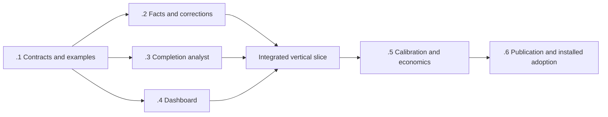

# Process efficiency telemetry delivery roadmap

Identity: **V2-EFF-01**. Authored: **2026-10-06**. Status: **active; measurement contract and synthetic examples accepted, producer and consumer implementation in progress**.
Parent: [V2 roadmap](../github-substrate-v2-roadmap.md#v2-eff-01--process-efficiency-telemetry--2026-10-06).
Design: [process efficiency telemetry and dashboard](../designs/process-efficiency-telemetry.md).
Evidence: [22-source prior-art review](../research/2026-10-06-process-efficiency-telemetry-prior-art.md).

User-selected migration scope (2026-10-06): backward compatibility is not required. Prioritize the
new telemetry route while preserving historical facts, correction lineage and auditability.

## Delivery objective

Each completed item receives a bounded, evidence-linked agent assessment explaining useful work,
problems, retries, avoidable process and possible improvements. The dashboard connects those
explanations to reproducible resource accounting, accepted outcomes and explicit data coverage.
Known source delivery remains visible when runtime accounting or analysis is incomplete.

Deliver through the existing Coordination telemetry store, observation adapters, dashboard projection
and GitHub Pages route. This roadmap introduces no permanent analytics service and does not itself
change schemas, policies, execution authority or defaults. Research/design merge is planning delivery,
not telemetry implementation or installed acceptance.

## Reuse and ownership

| Capability | State established by the design audit | Owner or dependency |
|---|---|---|
| Activities, complications, usage attribution and process reviews | Implemented in inspected source; automatic complete coverage not demonstrated | Coordination telemetry maintainers |
| Bounded public process projection and Pages publication | Implemented in inspected source; explanatory findings are limited | `.github` telemetry/dashboard maintainers |
| Whole-item economics, unknown usage and publication/receiver distinctions | Existing requirements; preserve their scoped definitions | V2 economics profile and UTEL owners |
| Typed coordination returns and context-efficiency treatment | Existing related work; whole-family savings still need evidence | [V2-CTX-01](2026-10-05-programme-context-efficiency.md) |
| Problem taxonomy, structured assessments, reliable completion analyst and explanations | Proposed here; not yet delivered | V2-EFF-01.1–.4 |
| Supported cross-item attribution supersession | Installed capability must be verified; do not assume database revisions expose a usable repair command | V2-EFF-01.2 with [UTEL correctness](utel-01-telemetry-correctness.md) |
| Producer completeness and native completion admission | Existing authority; this feature exposes gaps without weakening admission | [UTEL operational completeness](utel-operational-completeness.md) |

The source audit is pinned in the design. At implementation start, reconcile current main and installed
versions; reuse any capability already delivered by the owning UTEL work. Do not create competing
completion, cost or revision authorities. New record names and wire versions are selected against the
then-current protected contracts, not inferred from this proposal's examples.

## Milestones

### V2-EFF-01.1 — Freeze the measurement contract and labeled examples

- [x] Owner: telemetry contract maintainer, with dashboard and programme maintainers supplying consumers.
- [x] Define the activity/purpose/cause/necessity axes, evidence statuses, metrics and population rules.
  Map them explicitly to current records and economics profiles. Resolve overlap, shared allocations,
  incomplete accounting, provisional delivery assessments and supported corrections.
- [x] Produce the labeled corpus and hand-calculated metric fixtures described in the design. Include
  clean work, useful failed validation, avoidable replay, changed-input reruns, infrastructure/context
  problems, incorrect lineage and delivered-but-missing-runtime cases.
- [x] Select versioned extensions and migration against current protected schemas. Target the new producer, store, collector and dashboard as one coherent migration.
  Backward compatibility with old binaries, readers and wire formats is not required. Pin any external trace convention used by an adapter.

Dependencies: none beyond current contract inspection. Touch-set: canonical contract/design declarations
and shared fixtures only; do not mix producer, UI and release implementation into this milestone.
Acceptance: maintainers can classify the examples consistently, reproduce totals by hand, distinguish
fact from inference and identify every unknown denominator. A synthetic cross-item correction selects
one current outcome and conserves cost. The milestone is complete when these contracts are concrete,
not when another general planning document is written.

Contract acceptance: [versioned declarations](../../contracts/process-efficiency/README.md)
freeze the vocabulary, canonical joins, existing economics-profile aliases, additive producer inputs
and atomic assessment-request lifecycle. Thirteen focused Python tests and 23 hand-calculated cases
passed; all nine Draft 2020-12 schemas and 20 samples passed full schema validation. The synthetic
corpus contains 30 development and 30 reserved held-out episodes. Historical source pins were
verified locally; shallow CI explicitly skips only that historical-object check, without fetching
repository history. The existing dashboard test job runs the semantic fixtures with unchanged job
dependencies and time limits. No native store migration or analysis is activated by these contracts;
calibration, savings, coherent publication and installed adoption remain open.

### V2-EFF-01.2 — Add canonical measurement and correction support

- [ ] Owner: Coordination telemetry implementation maintainer.
- [ ] Implement the admitted record extensions, stable object joins, revision selection and
  deterministic reducers. Preserve unsuccessful attempts and explicit allocation/coverage states.
- [ ] Provide or qualify a supported cross-item supersession path with idempotence and audit history;
  coordinate with UTEL correctness if that path already exists. Preserve original invalid records
  as history without retaining their contribution in current totals.
- [ ] Export bounded facts for analysis/projection, including producer, ingestion and observation ages.
  Distinguish native item eligibility from known source delivery and provisional explanations.

Depends on .1. Touch-set: canonical telemetry schema/store, reducer and CLI/adaptor contracts plus
their focused tests. Acceptance: fixtures cover duplicates, late/out-of-order revisions, overlapping
activity, shared CI, unknown usage, cancellations and reopens. Cross-item correction changes
attribution without changing delivered total or total cost. Unsupported legacy correction fails
explicitly; no out-of-band database repair. Preserve historical records, audit history and correction conservation through migration;
old readers and binaries need not remain compatible.

### V2-EFF-01.3 — Generate bounded assessments on completion

- [ ] Owner: completion/observation adapter maintainer.
- [ ] Wire durable completion notification/reconciliation to the existing review route. Add the
  admitted provisional-delivery route where native populations are incomplete.
- [ ] Build the bounded evidence packet, analyst prompt/rubric, structured output validator, stable
  idempotency key and assessment lifecycle. Record model usage and prevent analysis self-trigger loops.
- [ ] Recover from restart, missing token/authority, timeout, malformed response, exhausted budget and
  delayed evidence without blocking delivery or silently declaring analysis successful.

Depends on .1 for contract implementation against fixtures; real producer integration also requires
.2. Touch-set: completion scheduling/outbox integration, evidence assembler, prompt and assessment
validator. Acceptance: an actual admitted item gets one bounded evidence-linked review; a delivery
with missing runtime gets a clearly provisional explanation or explicit unavailable state. Duplicate
notifications do not duplicate analysis. Facts, permissions and required checks are unchanged.
Analysis cost is visible; additional evidence revisions remain within a declared per-item budget.

Canonical custody dependency delivered (2026-10-06): Coordination
[PR #949](https://github.com/FS-GG/FS.GG.Coordination/pull/949) merged qualified head
`f2022662684e9f9ff064c44a5b3daf7c24369846` as
`daeab80bca717942602278c96ad1d07d6b64623d`. It extracts the existing managed process lease,
pins its two-file source manifest and delivers the fixed fake collector bootstrap with coherent
regenerated artifacts. Retained local C/artifact qualification, four bounded stdio cases and
four nonlaunch plus five ordinary managed cases establish those producer scopes. The original
managed reporting failure remains retained with its strict bounded supplemental acceptance;
no native replay was needed.

The exact-head hosted check set finished with 45 passed and six skipped checks. One routine
delivery attempt reported current validation and coherent validation not required; the hosted
coherent execution checks are included in that passed set. All three prospective feature/item/attempt
telemetry fields were supplied. Returned telemetry health remains `open`; historical model usage
and complete observation coverage remain unknown. This closes the canonical producer dependency
only. Native helper installation, receiver integration, provider execution and actual bounded
assessment acceptance remain pending; .3 and .6 stay open.

Source preparation is described in [bounded assessment preparation](../coordination/process-efficiency-assessment.md).
The offline helper and synthetic checks cover evidence selection, full-schema/semantic output validation
and private execution-state recovery. They do not activate a completion trigger, provider or store
integration. Installed exporter/admission joins and actual native/provisional review acceptance remain
pending; this milestone stays unchecked.

### V2-EFF-01.4 — Publish useful dashboard explanations

- [ ] Owner: `.github` dashboard maintainer.
- [ ] Implement the versioned sanitized projection, public-summary publication rules and matched
  current-only dashboard/feed migration. Keep private findings private unless the approved projection allows their content.
- [ ] Build the work-mix, retry, problem, item-summary/timeline, improvement and data-health views from
  the design. Include open/abandoned items and known deliveries with incomplete accounting.
- [ ] Add accessible tables, keyboard interaction, coverage/denominator labels, stable filters,
  bounded pagination and last-valid-feed fallback.

Source checkpoint (2026-10-06): the local fixture slice extends the Source Deliveries
foundation ([PR #4269](https://github.com/FS-GG/.github/pull/4269), `428ef7f6`) with
host schema 5 and a closed `process-efficiency/1` projection. Public collection and presentation
require host schema 5 under the user-selected current-only migration.
The source collector now joins the bounded schema-14 canonical measurement/assessment export
to its exact compact snapshot revision. Schema-14 endpoint/exporter native qualification, installed
efficiency behavior and live efficiency acceptance remain pending; unavailable or invalid exports retain the base completed-work
and source-delivery view with efficiency unavailable. This checkpoint does not close .4.

The projection policy `efficiency-public-projection/1` explicitly expands the existing item-label
approval for structured metric values, coverage, purpose/health dimensions, taxonomy enums and
fixed summary templates, closed queue/assessment states, fixed failure codes, witnessed clocks,
source hashes and bounded selection counts. This is an explicit structured-field publication policy;
it does not approve private analysis prose. Item identity still requires the approved label registry, including its repository-root item URLs;
public evidence
needs a separate explicit GitHub URL map. Private synopsis, findings, rationale, improvements,
identifiers, metric reasons and arbitrary URLs are excluded. Policy profile names are contract
aliases, not claims that those profiles were already installed. Numeric facts come from canonical
records; projection neither computes metrics nor chooses current canonical revisions.

The synthetic vertical slice shows native-item observations and a provisional missing-runtime
explanation. Tables retain exact numerator/denominator, unknown quantity, coverage, public cohort,
open/abandoned/excluded population, cutoff, observation/event times and mapped source revisions.
Work mix uses the .1 purpose dimension; data health uses independent source/ingestion/publication
age dimensions. Purpose amounts and different resource units are not combined. Public problem
labels retain their epistemic status. Fixed missing-evidence guidance is marked hypothetical;
private analyst improvement prose stays unavailable. Repository/work-type/acceptance dimensions
and producer freshness remain unavailable without approved canonical exports.

An older installed host feed is rejected with a host-schema-5 requirement. Refresh failure retains
the last valid host-5 data; an initial mismatch shows unavailable/error state, never empty success.
The parent owns sequencing of matching feed publication and Pages deployment; source delivery
does not establish live acceptance during a version mismatch.

The host-5 source context projection exposes fixed approved `Historical` and `Current work`
labels. Private `host-config/3` selects those two store roots explicitly; the same configuration
is read by snapshot, recurring publisher setup and event publication routes. Each source retains
its own complete host projection and approved original item aliases. Workspace authority, epoch
IDs, raw item IDs, costs and totals are never joined across sources. Source failure yields an
unavailable context with unknown work counts. A shared 1 MiB public limit can withhold a whole
context with `public-budget-exceeded`; it does not produce a false complete empty population.
The accessible source selector updates completed items, source deliveries, efficiency and local
host panels together and retains selection across valid refreshes. Independent two-store selection
remains source-qualified; the installed standalone route currently selects one schema-13 store.
Parent-owned browser root03 passed all 18 cases with clean custody; root04 passed all 19 cases after the scoped selector-visibility regression. Neither browser fixture result
establishes canonical collection or live acceptance. Collector-only source integration preserves
those exact frontend bytes and shares one absolute 45-second budget across compact/export reads;
public projection receives only the remaining host byte budget. No metrics are recalculated here.

The source includes native keyboard controls, search/scope/measurement filters, ten-item pages,
accessible table captions/headings and the existing last-valid-feed fallback. All 137 existing
Python source tests pass, including the current two-UID proof digest binding. Parent-owned browser
root04 genuinely passed all 19 fixture cases with clean custody. Earlier root01 observer failure
and root02 nine-pass/seven-fail test window remain failed and retained separately.

The parent-owned two-UID root01 genuinely passed six handoff permission checks with both original
process groups retired and empty before/after disposable UID/temp scopes. Its fixture result binds
exporter SHA `184723284a4205914811c4d2c78c89d338b3da75a372068a8647bdf7b8ee0a5f`; terminal
SHA `718b260bb7bbfa3eaea878e5dfcf27bd4529d5695dc94134b39aed8cfcba6c54` retains the actual
result. The old proof was preserved privately before updating the checked-in proof from that genuine
fixture result. This qualifies handoff permissions for the exact source exporter, not schema-14
endpoint behavior, native measurements, publication, installation or live feed acceptance.

Standalone installed adoption (2026-10-06): [PR #4273](https://github.com/FS-GG/.github/pull/4273)
merged at `ba5e8e0a627a6c24a8c82fecfd3b6eb9216ea8fd`; the installed dashboard script now binds
SHA `184723284a4205914811c4d2c78c89d338b3da75a372068a8647bdf7b8ee0a5f` against the
unchanged immutable 0.98.0 engine and schema-13 compact source. One genuine read-only snapshot
preserved all five completed groups and their exact cost, runtime, CI and shared base fields.
Eight approved labels preserve the prior six and disclose three source-only rows: Governance
[#444](https://github.com/FS-GG/FS.GG.Governance/pull/444), Rendering's latest Templates
[#673](https://github.com/FS-GG/FS.GG.Templates/pull/673), and Typed Protocol's latest `.github`
[#4274](https://github.com/FS-GG/.github/pull/4274). Each retains
`operationalCompletion=unestablished`; broad item labels do not imply whole-item completion or
reconstruct earlier deliveries. Historical script, labels, receipt and original preview remain retained.

The first host-5 publication at `9a426e05c8bf602a2b63589b69634c03ec5d058a` passed immutable-byte,
payload-revision and current-branch verification. [Pages run 37481318971](https://github.com/FS-GG/.github/actions/runs/37481318971)
succeeded from source `0cecd74eff6a3d44d5a4cbfb248b658e195bde1c`; HTTP 200 readback matched
the entire embedded host-5 payload exactly, with five completed groups, three source deliveries
and efficiency explicitly unavailable. The deployment is current-only; no older public feed reader
or compatibility bridge is required.

Supported activation separately published and verified `a636a625d1aa70265f466b3bf26c5e6691d0a3c0`
with public revision `0a2f903bb9073bed26756b551a23e1605d4668f7233c01b86ad8d6e1d2ba517e`.
Its actual native run retired cleanly after 10.26 seconds and observed the selected .NET 10.0.12
runtime. Event publication is active and user units are installed. Timer recurrence is unavailable
because the user service manager is absent; installed units are not a running timer.
[Pages run 37482126123](https://github.com/FS-GG/.github/actions/runs/37482126123) then succeeded
from protected source `0cecd74eff6a3d44d5a4cbfb248b658e195bde1c`. HTTP 200 readback at
14:56:23 UTC matched the complete immutable activation payload: five completed groups and three
source deliveries, with no dirty or incompatible rows and efficiency unavailable. Typed Protocol
now shows its actual latest `.github` #4274 delivery at 14:40:46 UTC; Governance #444 and
Rendering Templates #673 are unchanged. Historical follow-up usage remains unknown. Schema-14 export activation, installed analysis and the .6 coherent producer/release/pilot
work remain owed, so the full .4 checklist stays open.

The .2/.3 owners agreed a separate read-only `telemetry efficiency-export` batch interface.
Its source consumer seam binds `snapshotRevision` to the exact compact `item-detail/3` base and
keeps a distinct `sourceFingerprint` over current facts, usage, corrected attribution, efficiency
records, queue health and receiver clocks. The exporter owns selection in one WAL snapshot; an
analysis update cannot pretend that an unchanged compact-base digest covers changed efficiency
sources. The consumer performs no canonical reductions or revision selection.

The closed `efficiency-export/1` response has cutoff/observation times, item selection, global metric
selection and item rows. Selection declares limit, returned, omitted and complete; limits are 200
items, 1,000 serialized metrics globally and 32 per item. Each row retains private item/original-group
identities, canonical metrics, one selected assessment or null, typed analysis health and nullable
witnessed source/ingestion clocks. Private analysis packets are excluded. Analysis health exposes
pending/last-attempt times and only fixed failure codes; other reasons become unknown. Canonical
request state (pending/claimed/settled/failed/unavailable) remains distinct from assessment state;
a new pending/claimed request stays visible even when a prior assessment is ready. Explicit
original groups preserve the existing public-label boundary.

The pure canonical projection retains up to two public-local source bindings, each with its exact
compact base revision, full source fingerprint and verbatim omitted counts. Health-only items remain
visible with unavailable measurements and unknown clocks. Queue and accepted-assessment states
remain separate. Ambiguous approved identities within a selected export are withheld; metrics are never
aggregated in Python. Output is bounded before entering the host feed; its caller can supply the remaining public byte
budget, while source counts remain intact when public rows are withheld. Unsupported exact quantities
and omitted public rows remain explicit. The source collector reader is connected; actual endpoint qualification and operator execution
remain pending, so these source tests do not establish installed or live efficiency.

The reader makes one batch call per store using the caller's remaining monotonic deadline, bounded
by the existing 45-second call cap. Private input is bounded to 4 MiB and public output remains
bounded to 1 MiB. Schema-14 `build_host` calls this source seam; actual endpoint acceptance remains pending. Integers beyond JavaScript's exact safe range are withheld as unsupported items (a subset
of withheld coverage), preserving Source Deliveries independently and never rounding measured facts.

Further source checkpoint (2026-10-06): collapsed efficiency cards expose the current analysis
state, and an Analysis status filter makes pending, running and failed rows discoverable without
opening every card. State counts use only approved rows matching the item/scope filters, with
unmapped, withheld and source-omitted populations explicitly excluded. A prior ready assessment
does not make a queued request ready. Unavailable exports clear the counts instead of reporting
zero analysis work. All 137 dashboard Python checks pass. The first parent-selected 20-case browser
attempt refused an unproved live-worker memory observation and retired cleanly; a separately selected
fresh attempt passed the resource guard and recorded 19 passes with one mobile-containment failure
in the new regression. The canonical provenance line now wraps its complete revision/fingerprint
strings, with a targeted width assertion beside the whole-page check. Parent-selected root07
qualified the repaired UI/test source `e6076710986784db112415e3d464a1828c2be665`: all 20 cases
passed in 13.136 seconds, with no skips, retries or unexpected results, clean custody and no resource
failure. The earlier failed windows remain retained. This fixture result does not establish an
installed schema-14 exporter or live efficiency; deployment and full .4/.6 acceptance remain open.

Provider-response cost source qualification (2026-10-06): the separate bounded population
publishes canonical per-response counters for approved pending, source-delivered and completed
items. The structured publication policy also permits these six nullable counters, approved
model/effort aliases, current revisions, snapshot-scoped public-local references and explicit
eligible/published/unmapped/withheld/incompatible counts. Counters are exact decimal strings;
unknowns remain null and consistent over-policy actual costs remain visible. Provider identities,
private fact identifiers, response hashes and canonical JSON stay private. The projection neither
sums costs nor inserts provider responses into native-turn totals, and cost observations do not
establish successful assessment or item completion.

Parent-selected browser root08 qualified exact UI/test source `af5913c1`: all 21 authored cases
passed in 17.0088 seconds with zero skips/retries/unexpected results, clean retirement, no resource
failure and core limit zero. Fresh two-UID root02 passed all six permission checks in 1.0305 seconds,
with both original groups retired and empty disposable scopes; its actual result binds collector
SHA `409b20b5884075899b707fceb82223e5dbc5655f1074b510df3950c29bab24b6`.
All 143 pure dashboard tests pass with that genuine proof. Earlier proof and failed windows remain
retained. Current installed 0.98/schema-13 live feed remains unchanged; actual 0.99/Host 0.5/schema-14
collection, authenticated provider observations and full .4/.6 acceptance remain pending.

Depends on .1 for fixture-driven work; live projection acceptance requires .2 and .3. Touch-set:
dashboard collector/projection, static UI/assets and focused projection/UI tests. Coordinate ownership
of shared DTOs with .2; the UI does not edit canonical completion logic.
Acceptance: the vertical slice shows one actual native completion and one incomplete-accounting
delivery, with truthful summaries and reconcilable identities. No private identifiers, raw transcripts,
unapproved URLs or executable markup escape. Feed errors and pending analysis cannot look like zero
cost or no delivered work. The matched dashboard/feed migration is current-only; previous reader
compatibility is not required.

### V2-EFF-01.5 — Calibrate explanations and measure net value

- [ ] Owner: telemetry evaluation maintainer, with a maintainer sample for label adjudication.
- [ ] Evaluate the held-out corpus without tuning on its results. Report cause confusion,
  avoidability precision/recall, abstention, family coverage, source-reference validity and numeric
  accuracy. Use the design's proposed precision target with sample-size caveats.
- [ ] Run a bounded live pilot covering successful, failed, retried, interrupted and incomplete items.
  Compare like work and include analyst cost, all participants and unsuccessful attempts.
- [ ] Validate that the dashboard identifies specific supported problems and actionable interventions;
  report whether measured improvement exceeds measurement cost. Tune or disable low-value analysis
  rather than add mandatory review layers.

Depends on the .2–.4 vertical slice. Touch-set: evaluation fixtures/reports and bounded pilot
configuration, with bug fixes returned to the owning implementation surface. Acceptance: no
fabricated numeric claims or invalid references in accepted output; the supported-cause target and
its uncertainty are reported honestly. Insufficient samples/usage prevent economic claims but not
honest partial visibility. A plumbing demo is not proof of savings. Keep delivery quality and required
checks intact; recommendations alone do not count as completed process improvements.

### V2-EFF-01.6 — Publish, install and adopt the verified route

- [ ] Owner: relevant package/release maintainer and selected receiver owners, with Pages maintainer.
- [ ] Publish the coherent producer/CLI/adapter set where package changes require it. Verify installed
  versions and their emitted contracts independently from source merges.
- [ ] Deploy the matching new dashboard/feed through the established Pages route. Demonstrate a newly
  completed real item passing through installed collection, assessment, projection and browser view.
- [ ] Adopt the verified assessment behavior for the selected completion paths. Record coverage,
  health/freshness expectations, bounded backfill and tested rollback. Expand only after pilot evidence.

Depends on .5 and the relevant publication gates. Touch-set: release/receiver configuration and
deployment integration; no unrelated product changes. Acceptance: installed end-to-end evidence,
including a provisional/missing-data case and a supported correction, reconciles with canonical
records. One current attributed outcome remains after correction. Existing source history remains
auditable. Rollback preserves delivery and facts while disabling the new analysis/projection. Mark
the feature complete only when the selected installed routes and live Pages view are demonstrated.

## Sequence and parallel opportunities

After .1, .2–.4 can proceed against the same versioned fixtures with disjoint declared touch-sets.
The canonical owner controls shared types; the analyst owner controls generation and validation; the
dashboard owner controls presentation. Integration waits for actual producer behavior rather than
declaring success from mocks. A contract change invalidates affected fixtures and consumers explicitly.
This is a future implementation sequencing plan, not a dispatch instruction or creation of workers.

Prioritize the vertical slice and the missing-runtime display over broad historical backfill or new
export integrations. No extra issue, approval, review agent or coordination service is required solely
to implement this feature. Use the normal route appropriate to each actual contract/source change;
the documentation-only planning PR does not grant routine admission to later schema work.

## Completion evidence

Each milestone records source PRs, relevant focused checks and remaining limits in this owning roadmap.
Publication, installation and live acceptance are separate fields. The programme-level entry links
here rather than copying mutable checklists. Planned work remains unchecked until its own acceptance
is met; neither research volume nor a merged design closes an implementation milestone.
