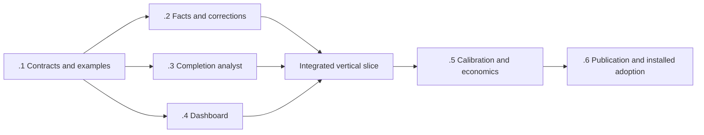

# Process efficiency telemetry delivery roadmap

Identity: **V2-EFF-01**. Authored: **2026-10-06**. Status: **active; measurement contract and synthetic examples accepted, producer and consumer implementation in progress**.
Parent: [V2 roadmap](../github-substrate-v2-roadmap.md#v2-eff-01--process-efficiency-telemetry--2026-10-06).
Design: [process efficiency telemetry and dashboard](../designs/process-efficiency-telemetry.md).
Evidence: [22-source prior-art review](../research/2026-10-06-process-efficiency-telemetry-prior-art.md).

## Delivery objective

Each completed item receives a bounded, evidence-linked agent assessment explaining useful work,
problems, retries, avoidable process and possible improvements. The dashboard connects those
explanations to reproducible resource accounting, accepted outcomes and explicit data coverage.
Known source delivery remains visible when runtime accounting or analysis is incomplete.

Deliver through the existing Coordination telemetry store, observation adapters, dashboard projection
and GitHub Pages route. This roadmap introduces no permanent analytics service and does not itself
change schemas, policies, execution authority or defaults. Research/design merge is planning delivery,
not telemetry implementation or installed acceptance.

## Reuse and ownership

| Capability | State established by the design audit | Owner or dependency |
|---|---|---|
| Activities, complications, usage attribution and process reviews | Implemented in inspected source; automatic complete coverage not demonstrated | Coordination telemetry maintainers |
| Bounded public process projection and Pages publication | Implemented in inspected source; explanatory findings are limited | `.github` telemetry/dashboard maintainers |
| Whole-item economics, unknown usage and publication/receiver distinctions | Existing requirements; preserve their scoped definitions | V2 economics profile and UTEL owners |
| Typed coordination returns and context-efficiency treatment | Existing related work; whole-family savings still need evidence | [V2-CTX-01](2026-10-05-programme-context-efficiency.md) |
| Problem taxonomy, structured assessments, reliable completion analyst and explanations | Proposed here; not yet delivered | V2-EFF-01.1–.4 |
| Supported cross-item attribution supersession | Installed capability must be verified; do not assume database revisions expose a usable repair command | V2-EFF-01.2 with [UTEL correctness](utel-01-telemetry-correctness.md) |
| Producer completeness and native completion admission | Existing authority; this feature exposes gaps without weakening admission | [UTEL operational completeness](utel-operational-completeness.md) |

The source audit is pinned in the design. At implementation start, reconcile current main and installed
versions; reuse any capability already delivered by the owning UTEL work. Do not create competing
completion, cost or revision authorities. New record names and wire versions are selected against the
then-current protected contracts, not inferred from this proposal's examples.

## Milestones

### V2-EFF-01.1 — Freeze the measurement contract and labeled examples

- [x] Owner: telemetry contract maintainer, with dashboard and programme maintainers supplying consumers.
- [x] Define the activity/purpose/cause/necessity axes, evidence statuses, metrics and population rules.
  Map them explicitly to current records and economics profiles. Resolve overlap, shared allocations,
  incomplete accounting, provisional delivery assessments and supported corrections.
- [x] Produce the labeled corpus and hand-calculated metric fixtures described in the design. Include
  clean work, useful failed validation, avoidable replay, changed-input reruns, infrastructure/context
  problems, incorrect lineage and delivered-but-missing-runtime cases.
- [x] Select versioned extensions and migration against current protected schemas. Keep existing
  consumers valid. Pin any external trace convention used by an adapter.

Dependencies: none beyond current contract inspection. Touch-set: canonical contract/design declarations
and shared fixtures only; do not mix producer, UI and release implementation into this milestone.
Acceptance: maintainers can classify the examples consistently, reproduce totals by hand, distinguish
fact from inference and identify every unknown denominator. A synthetic cross-item correction selects
one current outcome and conserves cost. The milestone is complete when these contracts are concrete,
not when another general planning document is written.

Contract acceptance: [versioned declarations](../../contracts/process-efficiency/README.md)
freeze the vocabulary, canonical joins, existing economics-profile aliases, additive producer inputs
and atomic assessment-request lifecycle. Thirteen focused Python tests and 23 hand-calculated cases
passed; all nine Draft 2020-12 schemas and 20 samples passed full schema validation. The synthetic
corpus contains 30 development and 30 reserved held-out episodes. Historical source pins were
verified locally; shallow CI explicitly skips only that historical-object check, without fetching
repository history. The existing dashboard test job runs the semantic fixtures with unchanged job
dependencies and time limits. No native store migration or analysis is activated by these contracts;
calibration, savings, coherent publication and installed adoption remain open.

### V2-EFF-01.2 — Add canonical measurement and correction support

- [ ] Owner: Coordination telemetry implementation maintainer.
- [ ] Implement the admitted record extensions, stable object joins, revision selection and
  deterministic reducers. Preserve unsuccessful attempts and explicit allocation/coverage states.
- [ ] Provide or qualify a supported cross-item supersession path with idempotence and audit history;
  coordinate with UTEL correctness if that path already exists. Preserve original invalid records
  as history without retaining their contribution in current totals.
- [ ] Export bounded facts for analysis/projection, including producer, ingestion and observation ages.
  Distinguish native item eligibility from known source delivery and provisional explanations.

Depends on .1. Touch-set: canonical telemetry schema/store, reducer and CLI/adaptor contracts plus
their focused tests. Acceptance: fixtures cover duplicates, late/out-of-order revisions, overlapping
activity, shared CI, unknown usage, cancellations and reopens. Cross-item correction changes
attribution without changing delivered total or total cost. Unsupported legacy correction fails
explicitly; no out-of-band database repair. Existing readers and records retain supported behavior.

### V2-EFF-01.3 — Generate bounded assessments on completion

- [ ] Owner: completion/observation adapter maintainer.
- [ ] Wire durable completion notification/reconciliation to the existing review route. Add the
  admitted provisional-delivery route where native populations are incomplete.
- [ ] Build the bounded evidence packet, analyst prompt/rubric, structured output validator, stable
  idempotency key and assessment lifecycle. Record model usage and prevent analysis self-trigger loops.
- [ ] Recover from restart, missing token/authority, timeout, malformed response, exhausted budget and
  delayed evidence without blocking delivery or silently declaring analysis successful.

Depends on .1 for contract implementation against fixtures; real producer integration also requires
.2. Touch-set: completion scheduling/outbox integration, evidence assembler, prompt and assessment
validator. Acceptance: an actual admitted item gets one bounded evidence-linked review; a delivery
with missing runtime gets a clearly provisional explanation or explicit unavailable state. Duplicate
notifications do not duplicate analysis. Facts, permissions and required checks are unchanged.
Analysis cost is visible; additional evidence revisions remain within a declared per-item budget.

Source preparation is described in [bounded assessment preparation](../coordination/process-efficiency-assessment.md).
The offline helper and synthetic checks cover evidence selection, full-schema/semantic output validation
and private execution-state recovery. They do not activate a completion trigger, provider or store
integration. Canonical exporter/admission joins and actual native/provisional review acceptance remain
pending; this milestone stays unchecked.

### V2-EFF-01.4 — Publish useful dashboard explanations

- [ ] Owner: `.github` dashboard maintainer.
- [ ] Implement the versioned sanitized projection, public-summary publication rules and compatibility
  behavior. Keep private findings private unless the approved projection allows their content.
- [ ] Build the work-mix, retry, problem, item-summary/timeline, improvement and data-health views from
  the design. Include open/abandoned items and known deliveries with incomplete accounting.
- [ ] Add accessible tables, keyboard interaction, coverage/denominator labels, stable filters,
  bounded pagination and last-valid-feed fallback.

Depends on .1 for fixture-driven work; live projection acceptance requires .2 and .3. Touch-set:
dashboard collector/projection, static UI/assets and focused projection/UI tests. Coordinate ownership
of shared DTOs with .2; the UI does not edit canonical completion logic.
Acceptance: the vertical slice shows one actual native completion and one incomplete-accounting
delivery, with truthful summaries and reconcilable identities. No private identifiers, raw transcripts,
unapproved URLs or executable markup escape. Feed errors and pending analysis cannot look like zero
cost or no delivered work. Existing feed readers remain supported through the chosen migration.

### V2-EFF-01.5 — Calibrate explanations and measure net value

- [ ] Owner: telemetry evaluation maintainer, with a maintainer sample for label adjudication.
- [ ] Evaluate the held-out corpus without tuning on its results. Report cause confusion,
  avoidability precision/recall, abstention, family coverage, source-reference validity and numeric
  accuracy. Use the design's proposed precision target with sample-size caveats.
- [ ] Run a bounded live pilot covering successful, failed, retried, interrupted and incomplete items.
  Compare like work and include analyst cost, all participants and unsuccessful attempts.
- [ ] Validate that the dashboard identifies specific supported problems and actionable interventions;
  report whether measured improvement exceeds measurement cost. Tune or disable low-value analysis
  rather than add mandatory review layers.

Depends on the .2–.4 vertical slice. Touch-set: evaluation fixtures/reports and bounded pilot
configuration, with bug fixes returned to the owning implementation surface. Acceptance: no
fabricated numeric claims or invalid references in accepted output; the supported-cause target and
its uncertainty are reported honestly. Insufficient samples/usage prevent economic claims but not
honest partial visibility. A plumbing demo is not proof of savings. Keep delivery quality and required
checks intact; recommendations alone do not count as completed process improvements.

### V2-EFF-01.6 — Publish, install and adopt the verified route

- [ ] Owner: relevant package/release maintainer and selected receiver owners, with Pages maintainer.
- [ ] Publish the coherent producer/CLI/adapter set where package changes require it. Verify installed
  versions and their emitted contracts independently from source merges.
- [ ] Deploy the compatible dashboard/feed through the established Pages route. Demonstrate a newly
  completed real item passing through installed collection, assessment, projection and browser view.
- [ ] Adopt the verified assessment behavior for the selected completion paths. Record coverage,
  health/freshness expectations, bounded backfill and tested rollback. Expand only after pilot evidence.

Depends on .5 and the relevant publication gates. Touch-set: release/receiver configuration and
deployment integration; no unrelated product changes. Acceptance: installed end-to-end evidence,
including a provisional/missing-data case and a supported correction, reconciles with canonical
records. One current attributed outcome remains after correction. Existing source history remains
auditable. Rollback preserves delivery and facts while disabling the new analysis/projection. Mark
the feature complete only when the selected installed routes and live Pages view are demonstrated.

## Sequence and parallel opportunities

After .1, .2–.4 can proceed against the same versioned fixtures with disjoint declared touch-sets.
The canonical owner controls shared types; the analyst owner controls generation and validation; the
dashboard owner controls presentation. Integration waits for actual producer behavior rather than
declaring success from mocks. A contract change invalidates affected fixtures and consumers explicitly.
This is a future implementation sequencing plan, not a dispatch instruction or creation of workers.

Prioritize the vertical slice and the missing-runtime display over broad historical backfill or new
export integrations. No extra issue, approval, review agent or coordination service is required solely
to implement this feature. Use the normal route appropriate to each actual contract/source change;
the documentation-only planning PR does not grant routine admission to later schema work.

## Completion evidence

Each milestone records source PRs, relevant focused checks and remaining limits in this owning roadmap.
Publication, installation and live acceptance are separate fields. The programme-level entry links
here rather than copying mutable checklists. Planned work remains unchecked until its own acceptance
is met; neither research volume nor a merged design closes an implementation milestone.
